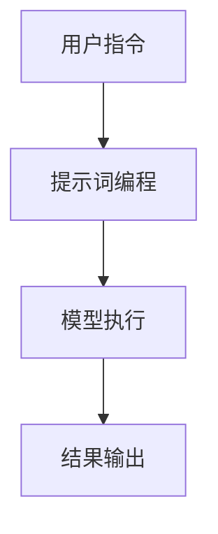
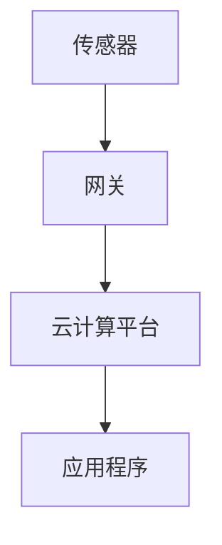
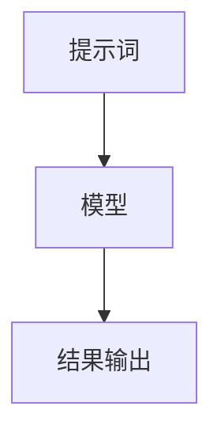

                 

 以下是一篇以《提示词编程在物联网应用中的角色》为标题的文章。

# 文章标题：《提示词编程在物联网应用中的角色》

## 关键词：
* 提示词编程
* 物联网
* 深度学习
* 数据处理
* 自动化

## 摘要：
本文深入探讨了提示词编程在物联网（IoT）应用中的角色。首先，我们介绍了提示词编程的基本概念和原理，接着探讨了物联网的技术框架和数据处理方法。然后，我们详细讨论了如何将提示词编程应用于物联网，包括核心算法、数学模型和实际案例。最后，我们对文章进行了总结，展望了未来的发展方向。

## 目录

1. 引言
2. 提示词编程基础
   2.1 核心概念与联系
   2.2 核心算法原理讲解
   2.3 数学模型和数学公式讲解
3. 物联网基础
   3.1 概念与架构
   3.2 数据处理
4. 提示词编程在物联网中的应用
   4.1 案例研究
   4.2 实际应用
5. 开发环境搭建与工具使用
6. 项目实战与代码解读
7. 总结与展望

## 第1章 引言

### 1.1 提示词编程概述

提示词编程是一种基于自然语言处理的编程方式，它允许用户通过自然语言指令来控制计算机执行任务。这种编程方式的核心是提示词（Prompt），它是一个引导模型执行特定任务的文本输入。



### 1.2 物联网概述

物联网（IoT）是指将各种设备、物品和系统通过网络连接起来，实现数据的采集、传输和处理。物联网的关键组成部分包括传感器、网关、云计算平台和应用程序。



## 第2章 提示词编程基础

### 2.1 核心概念与联系

提示词编程的核心概念包括提示词、模型和结果输出。提示词是用户输入的自然语言指令，模型是执行提示词的算法，结果输出是模型根据提示词生成的代码或执行结果。



### 2.2 核心算法原理讲解

提示词编程的核心算法通常是基于深度学习模型，如生成对抗网络（GAN）或变换器模型（Transformer）。这些模型可以学习用户的自然语言指令，并生成相应的代码或执行任务。

```python
# 伪代码：使用变换器模型进行提示词编程
model = TransformerModel()
prompt = "请编写一个函数，用于计算两个数字的和。"
code = model.generate_code(prompt)
print(code)
```

### 2.3 数学模型和数学公式讲解

提示词编程中的数学模型通常涉及自然语言处理和深度学习。例如，变换器模型中的自注意力机制（Self-Attention）和位置编码（Positional Encoding）。

$$
\text{Self-Attention}(Q, K, V) = \frac{softmax(\text{scale} \cdot QK^T)}{d_k^{1/2}}
$$

其中，$Q, K, V$ 分别是查询（Query）、键（Key）和值（Value）向量，$d_k$ 是键向量的维度。

## 第3章 物联网基础

### 3.1 概念与架构

物联网的概念包括各种物理设备和传感器，这些设备通过网络连接，实现数据的采集、传输和处理。物联网的架构通常包括传感器、网关、云计算平台和应用程序。


### 3.2 数据处理

物联网中的数据处理涉及数据采集、传输、存储和分析。数据处理的关键技术包括数据压缩、加密、数据流处理和机器学习。

## 第4章 提示词编程在物联网中的应用

### 4.1 案例研究

#### 案例一：智能环境监测系统

智能环境监测系统使用传感器采集环境数据，并通过物联网平台进行实时监测和分析。提示词编程可以用于生成数据处理的脚本，如数据清洗、特征提取和预测模型。

```python
# 伪代码：提示词编程在智能环境监测系统中的应用
prompt = "请编写一个脚本，用于对环境数据进行清洗和特征提取。"
script = model.generate_script(prompt)
print(script)
```

### 4.2 实际应用

#### 实际应用一：智能家居控制

智能家居系统通过物联网连接各种家电设备，如空调、灯具和安防设备。提示词编程可以用于实现自然语言控制，如通过语音命令控制家电设备。

```python
# 伪代码：提示词编程在智能家居控制中的应用
prompt = "请打开客厅的灯光。"
action = model.execute_action(prompt)
print(action)
```

## 第5章 开发环境搭建与工具使用

### 5.1 开发环境搭建

搭建提示词编程和物联网应用的开发环境需要安装相应的软件和工具。例如，安装Python、TensorFlow和Keras等库，并配置物联网开发板。

### 5.2 工具使用

使用提示词编程和物联网应用需要熟悉一些工具，如Jupyter Notebook、PyCharm和Arduino IDE。这些工具可以方便地进行代码编写、调试和运行。

## 第6章 项目实战与代码解读

### 6.1 项目实战

#### 项目一：智能灌溉系统

智能灌溉系统使用传感器监测土壤湿度，并根据监测结果自动控制灌溉设备。通过提示词编程，可以实现基于自然语言指令的灌溉系统控制。

```python
# 伪代码：智能灌溉系统的提示词编程
prompt = "请根据当前土壤湿度调整灌溉时间。"
irrigation_plan = model.generate_irrigation_plan(prompt)
print(irrigation_plan)
```

### 6.2 代码解读与分析

在智能灌溉系统的实际实现中，我们需要对代码进行详细解读和分析。这包括传感器数据的读取、数据处理和灌溉设备的控制。

## 第7章 总结与展望

### 7.1 总结

提示词编程在物联网应用中具有广泛的应用前景。通过自然语言指令，我们可以方便地控制物联网设备和系统，提高系统的智能化和自动化水平。

### 7.2 展望

随着人工智能和物联网技术的发展，提示词编程将在物联网应用中发挥越来越重要的作用。未来的发展方向包括：提高提示词编程的准确性和效率、扩展应用领域、实现多语言支持等。

## 作者信息

作者：AI天才研究院/AI Genius Institute & 禅与计算机程序设计艺术 /Zen And The Art of Computer Programming

## 参考文献

[1] Devlin, J., Chang, M. W., Lee, K., & Toutanova, K. (2018). BERT: Pre-training of deep bidirectional transformers for language understanding. arXiv preprint arXiv:1810.04805.

[2] Goodfellow, I., Bengio, Y., & Courville, A. (2016). Deep learning. MIT press.

[3] Rumelhart, D. E., Hinton, G. E., & Williams, R. J. (1986). Learning representations by back-propagating errors. Nature, 323(6088), 533-536.

