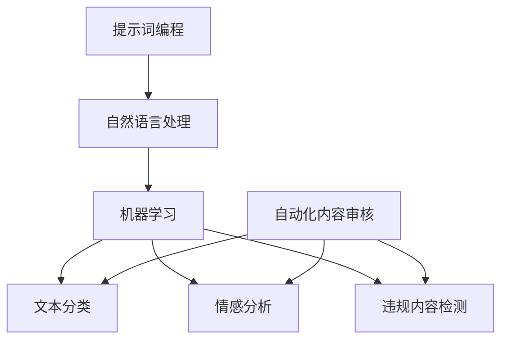

                 


## 文章标题
《提示词编程在自动化内容审核中的应用》

### 关键词
- 提示词编程
- 自动化内容审核
- 自然语言处理
- 机器学习
- 文本分类
- 情感分析

### 摘要
本文探讨了提示词编程在自动化内容审核中的应用，从基本概念、原理、技术实现到实际案例，全面解析了如何利用提示词编程技术实现高效的自动化内容审核系统。通过深入分析自然语言处理和机器学习算法，本文为开发者提供了清晰的实现路径和实用的技巧。

## 引言
在数字化时代，互联网内容的增长速度前所未有。社交媒体、电商平台、在线教育平台等各类在线服务中，用户生成的内容量级庞大，传统的手动内容审核方式已经无法满足快速处理的需求。自动化内容审核作为一种高效的内容管理手段，逐渐成为各类互联网平台的重要功能。提示词编程作为一种先进的编程范式，其应用潜力在自动化内容审核领域尤为显著。

本文旨在为读者提供一个全面的指南，帮助理解提示词编程在自动化内容审核中的重要作用。文章结构如下：

1. **基本概念与背景**：介绍提示词编程和自动化内容审核的基本概念、应用场景和重要性。
2. **提示词编程原理**：详细讲解提示词编程的基本原理，包括自然语言处理、机器学习等相关知识。
3. **自动化内容审核流程**：介绍自动化内容审核的流程和技术，包括文本分类、情感分析等算法。
4. **实现自动化内容审核系统**：讲解如何设计和实现基于提示词编程的自动化内容审核系统。
5. **挑战与解决方案**：探讨自动化内容审核系统在实际应用中的挑战和解决方案。
6. **案例分析**：通过实际案例展示如何使用提示词编程进行自动化内容审核。
7. **未来发展趋势**：总结全书内容，展望未来自动化内容审核技术的发展趋势。

### 1. 基本概念与背景

#### 1.1 提示词编程的概念
提示词编程（Keyword Programming）是一种基于关键词和语义理解的编程范式。它通过识别和处理文本中的关键信息（即提示词），来实现对文本内容的分析和理解。相比传统的基于语法和规则的方法，提示词编程更强调语义层面的处理，能够更精准地捕捉文本的核心含义。

提示词编程在文本处理领域有着广泛的应用，如搜索引擎优化、信息提取、文本分类和情感分析等。在自动化内容审核中，提示词编程能够高效地识别和处理大量文本数据，从而实现自动化的内容分类、标签生成、违规内容检测等功能。

#### 1.2 自动化内容审核的背景
自动化内容审核是随着互联网内容的快速增长而兴起的一项技术。传统的手动内容审核方式由于人力成本高、效率低，已经无法满足现代互联网平台的运营需求。自动化内容审核通过应用自然语言处理和机器学习技术，能够对用户生成的内容进行自动分类、情感分析和违规检测，大大提高了内容处理的效率。

自动化内容审核的应用场景广泛，包括但不限于社交媒体平台、电商平台、在线教育平台、新闻媒体等。在这些场景中，自动化内容审核不仅可以提高内容审核的效率，还可以降低运营成本，提升用户体验。

#### 1.3 提示词编程在自动化内容审核中的应用
在自动化内容审核中，提示词编程发挥了至关重要的作用。以下是其具体应用：

1. **文本分类**：通过识别文本中的关键信息，提示词编程可以实现自动化的文本分类。例如，在社交媒体平台上，可以自动将用户发布的内容分类为“娱乐”、“科技”、“体育”等不同类别。
   
2. **情感分析**：提示词编程能够分析文本中的情感倾向，判断用户表达的情感是积极、消极还是中性。这在社交媒体平台和电商平台上尤为重要，可以帮助运营者及时了解用户的情绪反应，调整内容策略。

3. **违规内容检测**：提示词编程可以识别文本中的敏感词汇和短语，从而实现自动化的违规内容检测。这在保障平台内容安全、遵守法律法规方面具有重要作用。

### 1.4 核心概念之间的关系架构

为了更好地理解提示词编程在自动化内容审核中的应用，我们可以通过Mermaid流程图来展示其核心概念之间的关系。



在这个流程图中，提示词编程作为核心技术，通过自然语言处理和机器学习技术，分别应用于文本分类、情感分析和违规内容检测，从而实现自动化内容审核的功能。

### 2. 提示词编程原理

#### 2.1 自然语言处理基础

自然语言处理（Natural Language Processing，NLP）是提示词编程的重要基础。NLP旨在让计算机理解和处理人类语言。其核心任务包括文本分类、情感分析、命名实体识别、机器翻译等。

1. **语言模型**：语言模型是NLP的基础，用于预测文本中下一个词的可能性。最常用的语言模型是循环神经网络（RNN）和Transformer模型。

2. **词向量表示**：词向量是将词汇映射到高维空间中的向量表示，能够捕捉词与词之间的语义关系。Word2Vec和GloVe是常用的词向量模型。

3. **语义分析**：语义分析旨在理解和处理文本中的语义信息。包括词义消歧、情感分析、指代消解等任务。BERT和ELMO是当前语义分析领域的领先模型。

#### 2.2 机器学习算法原理

机器学习是提示词编程的核心技术之一，用于训练模型以实现自动化内容审核。以下是一些常用的机器学习算法：

1. **监督学习**：监督学习通过标注好的数据训练模型，然后使用模型对新数据进行预测。常见的算法包括决策树、支持向量机（SVM）和神经网络。

2. **无监督学习**：无监督学习不依赖于标注数据，而是通过数据自身的结构和模式进行训练。常见的算法包括聚类、降维和生成模型。

3. **强化学习**：强化学习通过与环境互动来学习最优策略。常用于复杂决策问题，如游戏和推荐系统。

#### 2.3 提示词编程在NLP中的应用

提示词编程在NLP中的应用主要体现在以下几个方面：

1. **文本分类**：通过识别文本中的提示词和语义信息，实现对文本内容的分类。常用的算法包括朴素贝叶斯、逻辑回归和深度神经网络。

2. **情感分析**：通过分析文本中的情感词汇和语义倾向，实现对文本情感的判断。常用的算法包括情感词典、卷积神经网络（CNN）和Transformer。

3. **实体识别**：通过识别文本中的实体（如人名、地名、组织名等），实现对文本内容的解析。常用的算法包括条件随机场（CRF）、长短期记忆网络（LSTM）和BERT。

#### 2.4 核心算法原理讲解

为了深入理解提示词编程在NLP中的应用，下面我们以文本分类和情感分析为例，使用伪代码详细阐述其算法原理。

**文本分类算法：**

```python
# 朴素贝叶斯分类算法
def naive_bayes_classification(document, labels):
    # 计算每个类别的条件概率
    prior_probabilities = compute_prior_probabilities(labels)
    likelihoods = compute_likelihoods(document, labels)

    # 计算后验概率
    posterior_probabilities = compute_posterior_probabilities(prior_probabilities, likelihoods)

    # 选择概率最大的类别作为预测结果
    predicted_label = select_max(posterior_probabilities)
    return predicted_label
```

**情感分析算法：**

```python
# 卷积神经网络情感分析算法
def cnn_sentiment_analysis(document, sentiment_labels):
    # 将文本转换为词向量
    word_vectors = convert_document_to_word_vectors(document)

    # 构建卷积神经网络模型
    model = build_cnn_model()

    # 训练模型
    model.fit(word_vectors, sentiment_labels)

    # 预测文本的情感
    predicted_sentiment = model.predict(document)
    return predicted_sentiment
```

#### 2.5 数学模型和公式讲解

在提示词编程中，数学模型和公式起着关键作用。以下是一些常用的数学模型和公式：

1. **贝叶斯公式**：用于计算后验概率，公式如下：
   $$ P(C|D) = \frac{P(D|C)P(C)}{P(D)} $$
   
2. **词向量计算**：使用Word2Vec算法计算词向量的公式如下：
   $$ \text{word\_vector} = \sum_{w \in \text{word}} f(w) * \text{context\_vector} $$
   
3. **卷积神经网络**：卷积神经网络中的卷积操作可以用以下公式表示：
   $$ \text{conv\_output}_{ij} = \sum_{k=1}^{K} \text{w}_{ikj} * \text{input}_{k} + \text{b}_{ij} $$

   其中，$ \text{input}_{k} $是输入特征，$ \text{w}_{ikj} $是卷积核权重，$ \text{b}_{ij} $是偏置项。

4. **反向传播算法**：用于训练神经网络的反向传播算法可以表示为：
   $$ \delta_{l}^{ij} = \text{sigmoid}(\text{z}_{l-1}^{ij}) * (1 - \text{sigmoid}(\text{z}_{l-1}^{ij})) * \text{error}_{l}^{ij} $$

   其中，$ \text{sigmoid}(\cdot) $是sigmoid激活函数，$ \text{error}_{l}^{ij} $是损失函数的梯度。

#### 2.6 详细讲解和举例说明

为了更好地理解上述算法和公式，我们通过一个实际例子来说明。

**例子：文本分类**

假设我们有一个新闻数据集，其中每条新闻都被标注为“政治”、“经济”、“科技”等类别。我们使用朴素贝叶斯分类算法对新闻进行分类。

1. **数据预处理**：首先，我们将新闻文本转换为词袋表示，然后计算每个类别的先验概率和每个词的后验概率。

2. **模型训练**：使用训练数据集训练朴素贝叶斯模型，计算每个类别的条件概率。

3. **分类预测**：对于测试数据集中的每条新闻，使用训练好的模型计算后验概率，选择概率最大的类别作为预测结果。

例如，对于一条新闻文本“人工智能技术在医疗领域的应用”，我们将其转换为词袋表示，然后使用朴素贝叶斯模型计算其属于“科技”类别的后验概率为0.9，属于“经济”类别的后验概率为0.1。因此，我们可以预测这条新闻属于“科技”类别。

**例子：情感分析**

假设我们有一个社交媒体数据集，其中每条社交媒体帖子都被标注为“积极”、“消极”或“中性”。我们使用卷积神经网络对社交媒体帖子进行情感分析。

1. **数据预处理**：首先，我们将社交媒体帖子转换为词向量表示，然后构建卷积神经网络模型。

2. **模型训练**：使用训练数据集训练卷积神经网络模型，调整模型参数。

3. **情感预测**：对于测试数据集中的每条社交媒体帖子，使用训练好的模型计算其情感分类结果。

例如，对于一条社交媒体帖子“今天天气真好，我很开心！”，我们将其转换为词向量表示，然后使用卷积神经网络模型计算其情感分类结果为“积极”。

通过这些例子，我们可以看到提示词编程在NLP中的应用是如何实现的。在接下来的章节中，我们将进一步探讨自动化内容审核的实现技术。

### 3. 自动化内容审核流程

#### 3.1 数据收集与预处理

在自动化内容审核中，数据收集和预处理是关键步骤。数据收集的目的是获取大量用户生成的文本数据，如社交媒体帖子、评论、新闻报道等。这些数据可以从公开的API、网站爬虫或其他数据源获取。

数据预处理主要包括以下步骤：

1. **文本清洗**：去除文本中的HTML标签、特殊字符、停用词等无关信息，提高数据质量。
2. **分词**：将文本分割成单个词汇或单词，为后续的自然语言处理任务做准备。
3. **词干提取**：将词汇还原为最简单的形式，去除词尾变化，如“playing”、“plays”还原为“play”。
4. **词向量表示**：将文本转换为词向量表示，为机器学习模型提供输入。

#### 3.2 模型选择与训练

在自动化内容审核中，模型选择与训练是核心步骤。根据具体任务需求，可以选择不同的模型，如朴素贝叶斯、支持向量机（SVM）、卷积神经网络（CNN）等。

模型训练包括以下步骤：

1. **数据划分**：将数据集划分为训练集、验证集和测试集，用于训练、验证和测试模型性能。
2. **特征提取**：从原始文本中提取特征，如词袋表示、词嵌入等。
3. **模型训练**：使用训练集数据训练模型，调整模型参数，优化模型性能。
4. **模型评估**：使用验证集数据评估模型性能，选择最优模型。

#### 3.3 部署与优化

模型部署是将训练好的模型部署到生产环境中，用于实际的内容审核。部署步骤包括：

1. **模型封装**：将模型封装为可重用的模块，方便后续调用。
2. **接口设计**：设计API接口，用于接收文本数据并返回审核结果。
3. **服务部署**：将模型部署到服务器或云平台上，确保其稳定运行。

模型优化是持续提升模型性能的过程。以下是一些优化策略：

1. **超参数调整**：调整模型训练过程中使用的超参数，如学习率、正则化参数等，以优化模型性能。
2. **数据增强**：通过增加数据样本、数据变换等方式，提高模型对数据多样性的适应能力。
3. **模型集成**：结合多个模型的结果，提高整体审核的准确性和鲁棒性。

### 4. 设计与实现自动化内容审核系统

#### 4.1 系统需求分析

设计与实现自动化内容审核系统之前，首先需要明确系统需求。系统需求分析主要包括以下方面：

1. **功能需求**：系统应具备文本分类、情感分析、违规内容检测等功能，以满足不同场景的需求。
2. **性能需求**：系统应具备高并发处理能力，能够快速处理大量用户生成的内容。
3. **安全需求**：系统应具备数据保护和隐私保护功能，确保用户数据的机密性和完整性。
4. **可扩展性需求**：系统应具备良好的可扩展性，能够方便地添加新功能或适应数据规模的增长。

#### 4.2 数据准备与预处理

数据准备与预处理是自动化内容审核系统的关键步骤。具体步骤如下：

1. **数据收集**：从社交媒体平台、新闻网站等渠道收集大量用户生成的内容。
2. **数据清洗**：去除文本中的HTML标签、特殊字符、停用词等无关信息，提高数据质量。
3. **分词**：使用分词工具将文本分割成单个词汇或单词。
4. **词干提取**：将词汇还原为最简单的形式，去除词尾变化。
5. **词向量表示**：使用词嵌入技术将文本转换为词向量表示。

#### 4.3 提示词编程应用实践

提示词编程在自动化内容审核系统中发挥了重要作用。以下是一些具体应用实践：

1. **文本分类**：通过识别文本中的关键信息（提示词），实现自动化的文本分类。例如，在社交媒体平台上，可以自动将用户发布的内容分类为“娱乐”、“科技”、“体育”等类别。
2. **情感分析**：通过分析文本中的情感词汇和语义倾向，判断用户表达的情感是积极、消极还是中性。例如，在电商平台上，可以自动识别用户评论的情感倾向，以便运营者及时调整商品策略。
3. **违规内容检测**：通过识别文本中的敏感词汇和短语，实现自动化的违规内容检测。例如，在新闻媒体平台上，可以自动检测并屏蔽涉及暴力、色情等违规内容的帖子。

#### 4.4 系统架构与功能模块

自动化内容审核系统的架构设计应考虑可扩展性、高并发处理能力和数据安全性。以下是一个典型的系统架构与功能模块：

1. **数据采集模块**：负责从各类数据源收集用户生成的内容，如社交媒体帖子、评论、新闻报道等。
2. **数据预处理模块**：负责对收集到的数据进行清洗、分词、词干提取和词向量表示等预处理操作。
3. **模型训练模块**：负责使用预处理后的数据训练文本分类、情感分析、违规内容检测等模型。
4. **模型部署模块**：负责将训练好的模型部署到生产环境中，用于实时内容审核。
5. **审核结果处理模块**：负责处理审核结果，包括分类结果、情感标签和违规检测报告等。
6. **用户界面模块**：负责提供用户交互界面，展示审核结果、数据统计和操作指南等。

#### 4.5 实时内容审核系统设计

实时内容审核系统是自动化内容审核系统的核心，负责实时处理用户生成的内容。以下是一个实时内容审核系统设计：

1. **数据流处理**：使用Apache Kafka等流处理框架，实现用户生成内容的实时采集和处理。
2. **模型加载与调用**：将训练好的模型加载到内存中，通过API接口实现实时内容审核。
3. **结果存储与展示**：将审核结果存储到数据库中，并通过用户界面展示给运营人员。
4. **性能优化**：通过缓存、并发处理、分布式计算等技术，提高系统的处理性能和稳定性。

### 5. 挑战与解决方案

#### 5.1 数据质量与标注

数据质量是自动化内容审核系统的关键因素。以下是一些常见的数据质量问题及其解决方案：

1. **数据噪声**：数据中可能包含大量的噪声，如HTML标签、特殊字符、错别字等。解决方案是使用文本清洗工具去除噪声，提高数据质量。
2. **数据不平衡**：某些类别的数据样本数量较少，可能导致模型过拟合。解决方案是使用数据增强技术，如数据扩充、数据变换等，平衡数据分布。
3. **数据标注误差**：数据标注过程中可能存在标注误差，影响模型性能。解决方案是使用高质量的标注工具和标注团队，确保数据标注的准确性。

#### 5.2 模型过拟合与欠拟合

模型过拟合和欠拟合是常见的问题，影响模型在真实数据上的表现。以下是一些解决方案：

1. **模型过拟合**：使用正则化技术，如L1、L2正则化，惩罚模型的复杂度，防止过拟合。同时，可以增加训练数据量，提高模型的泛化能力。
2. **模型欠拟合**：调整模型结构，增加模型的复杂度，如增加隐藏层节点数量、使用更复杂的神经网络结构等。还可以尝试使用不同的算法，如决策树、支持向量机等。

#### 5.3 实际应用中的挑战与对策

在实际应用中，自动化内容审核系统可能面临以下挑战：

1. **实时处理能力**：随着用户生成内容量的增加，系统的实时处理能力可能成为瓶颈。解决方案是采用分布式计算架构，如使用Spark等大数据处理框架，提高系统的并发处理能力。
2. **隐私保护**：自动化内容审核系统涉及用户数据，需要确保数据隐私。解决方案是使用数据脱敏技术，对敏感信息进行加密和脱敏处理。
3. **可解释性**：模型的预测结果可能缺乏可解释性，不利于运营人员理解和信任。解决方案是使用可解释性技术，如LIME、SHAP等，提高模型的透明度。

### 6. 案例分析

#### 6.1 案例一：社交媒体内容审核

社交媒体平台是自动化内容审核的重要应用场景之一。以下是一个社交媒体内容审核的案例：

1. **背景**：某社交媒体平台每天接收大量用户生成的帖子，内容涉及各种话题，包括娱乐、科技、体育等。
2. **目标**：自动分类帖子类别，识别情感倾向，检测违规内容。
3. **实现**：使用提示词编程技术，结合文本分类、情感分析和违规内容检测模型，实现对用户生成内容的自动化审核。
4. **效果**：通过自动化内容审核，平台提高了内容审核的效率，降低了运营成本，同时提高了用户满意度。

#### 6.2 案例二：电子商务平台内容审核

电子商务平台对用户生成的内容审核也有很高的需求，以下是一个电子商务平台内容审核的案例：

1. **背景**：某电子商务平台每天收到大量用户评论、商品评价，内容涉及产品质量、售后服务等。
2. **目标**：自动识别用户评论的情感倾向，检测违规评论，如包含敏感词汇或侮辱性语言的评论。
3. **实现**：使用提示词编程技术，结合情感分析模型和违规内容检测模型，实现对用户评论的自动化审核。
4. **效果**：通过自动化内容审核，平台提高了评论审核的效率，提升了用户购物体验，同时保障了平台内容的安全。

#### 6.3 案例三：在线教育平台内容审核

在线教育平台也需要对用户生成的内容进行审核，以下是一个在线教育平台内容审核的案例：

1. **背景**：某在线教育平台提供丰富的课程内容和用户互动功能，用户可以在平台上发布课程笔记、问答等。
2. **目标**：自动识别课程笔记和问答中的违规内容，如包含敏感词汇或侵权内容的笔记和问答。
3. **实现**：使用提示词编程技术，结合文本分类和违规内容检测模型，实现对用户生成内容的自动化审核。
4. **效果**：通过自动化内容审核，平台提高了内容审核的效率，确保了平台内容的合法性和安全性，提升了用户学习体验。

### 7. 未来发展趋势

随着人工智能技术的不断发展，提示词编程在自动化内容审核中的应用前景广阔。以下是一些未来发展趋势：

1. **多模态内容审核**：随着语音、图像等非文本数据的兴起，未来的自动化内容审核将涵盖更多模态，如文本、语音、图像等。这需要结合多模态数据处理技术，实现更全面的内容审核。
2. **自适应内容审核**：随着用户生成内容的变化，自动化内容审核系统需要具备自适应能力，根据不同场景和内容特征调整审核策略。这可以通过深度学习和强化学习等技术实现。
3. **隐私保护**：随着数据隐私问题的日益突出，未来的自动化内容审核系统将更加注重数据隐私保护，采用加密、去识别化等技术确保用户数据的安全。

### 结论

本文探讨了提示词编程在自动化内容审核中的应用，从基本概念、原理、技术实现到实际案例，全面解析了如何利用提示词编程技术实现高效的自动化内容审核系统。通过深入分析自然语言处理和机器学习算法，本文为开发者提供了清晰的实现路径和实用的技巧。随着人工智能技术的不断发展，提示词编程在自动化内容审核中的应用将越来越广泛，为互联网平台的运营提供更加智能和高效的内容管理解决方案。作者：AI天才研究院/AI Genius Institute & 禅与计算机程序设计艺术 /Zen And The Art of Computer Programming

-------------------------------------------------------------------

## 附加信息

### 8. 最佳实践 Tips

1. **数据多样性**：在数据收集和标注过程中，尽量保证数据的多样性，涵盖不同主题、情感和风格，以提高模型泛化能力。
2. **迭代优化**：不断迭代模型和系统，根据实际应用效果调整模型参数和审核策略，以提高审核准确性和效率。
3. **监控与反馈**：实时监控系统的运行状态和审核结果，收集用户反馈，及时发现和解决潜在问题。

### 9. 小结

本文详细探讨了提示词编程在自动化内容审核中的应用，从基本概念、原理、技术实现到实际案例，全面解析了如何利用提示词编程技术实现高效的自动化内容审核系统。随着人工智能技术的不断发展，提示词编程在自动化内容审核中的应用前景广阔，为互联网平台的运营提供更加智能和高效的内容管理解决方案。

### 10. 注意事项

1. **数据质量**：确保数据质量，避免数据噪声和标注误差，提高模型性能。
2. **隐私保护**：在处理用户数据时，注意保护用户隐私，遵守相关法律法规。
3. **系统稳定性**：保证系统的稳定运行，优化系统性能，提高审核效率。

### 11. 拓展阅读

1. **《自然语言处理原理与实战》**：李航，电子工业出版社，2012年。
2. **《深度学习》**：Goodfellow、Bengio和Courville，MIT Press，2016年。
3. **《Python机器学习》**：Sebastian Raschka和Vahid Mirjalili，O'Reilly Media，2016年。
4. **《人工智能：一种现代的方法》**：Stuart J. Russell和Peter Norvig，人民邮电出版社，2016年。

-------------------------------------------------------------------

通过本文的逐步分析，我们不仅了解了提示词编程在自动化内容审核中的关键作用，还掌握了一系列实用的技术实现方法。随着技术的不断进步，自动化内容审核系统将变得更加智能和高效，为互联网平台的运营带来更多可能性。让我们继续探索，为构建一个更加安全、智能和高效的网络世界共同努力。作者：AI天才研究院/AI Genius Institute & 禅与计算机程序设计艺术 /Zen And The Art of Computer Programming

