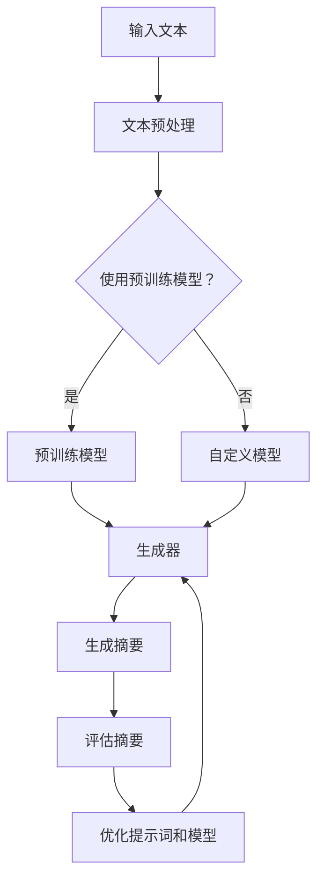
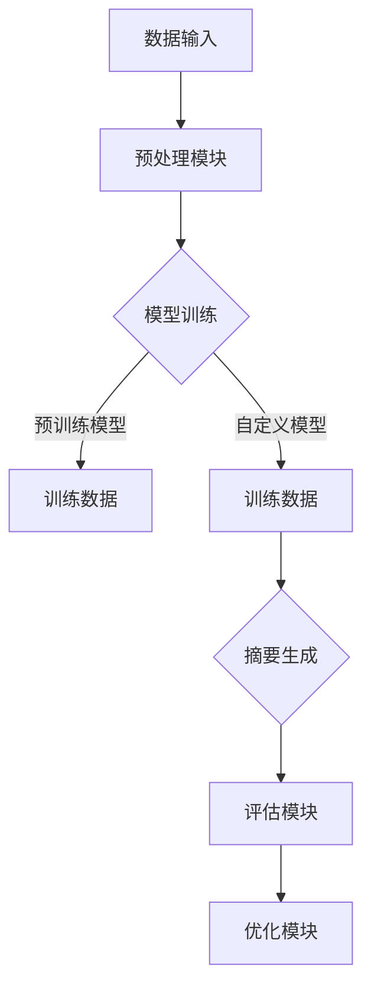

                 


### 1. 引言

#### 1.1 自动化摘要生成的背景和重要性

在当今信息爆炸的时代，人们面临海量的文本数据，这些数据来源于新闻报道、学术论文、在线内容、书籍等各种渠道。如何有效地从这些繁杂的信息中快速获取关键内容，成为了亟待解决的问题。自动化摘要生成技术应运而生，旨在通过算法自动提取文本的核心信息，生成简洁、准确、有价值的摘要。

自动化摘要生成的重要性主要体现在以下几个方面：

1. **提升信息获取效率**：自动化摘要能够帮助用户快速了解大量文本的主要内容，从而节省阅读时间和精力。

2. **降低人工成本**：对于企业或组织来说，自动化摘要生成可以大幅降低对人力资源的需求，提高工作效率。

3. **增强信息检索能力**：通过摘要，用户可以更容易地找到与自己需求相关的信息，提高信息检索的准确性。

4. **支持智能推荐系统**：自动化摘要可以作为智能推荐系统的一部分，为用户提供个性化的信息推荐服务。

#### 1.2 提示词编程的基本概念

提示词编程（Prompt Programming）是一种利用人工智能技术，特别是自然语言处理（NLP）和机器学习（ML）方法，自动生成代码或执行特定任务的技术。在自动化摘要生成中，提示词编程通过训练模型，使系统能够理解输入文本的含义，并生成相应的摘要。

提示词编程的核心概念包括：

1. **预训练模型**：使用大规模语料库对模型进行预训练，使其具备对自然语言的理解能力。

2. **输入提示**：通过输入特定的提示词或句子，引导模型生成预期的输出。

3. **上下文理解**：模型需要理解输入文本的上下文，以便生成相关的摘要。

4. **模型调优**：通过调整模型的参数和架构，优化其摘要生成的效果。

#### 1.3 书籍目的与读者群体

本书旨在为读者提供一个全面、系统的自动化摘要生成技术指南，特别是关注提示词编程在这一领域的应用。通过本书，读者可以：

1. **了解自动化摘要生成的背景和技术原理**。

2. **掌握提示词编程的基础知识和应用方法**。

3. **学习如何实现自动化摘要生成系统，并进行实际应用**。

本书适合以下读者群体：

1. **计算机科学和人工智能专业学生和研究者**。

2. **从事自然语言处理和机器学习领域的工程师和开发者**。

3. **对自动化摘要生成技术感兴趣的企业和技术管理人员**。

通过本书的学习，读者将能够深入理解自动化摘要生成技术，掌握提示词编程的应用技巧，并在实际项目中运用这些知识，提高信息处理效率。

### 2. 提示词编程基础

#### 2.1 提示词编程的核心原理

提示词编程是一种基于人工智能（AI）技术的编程方法，通过提供特定的提示词或指令，引导机器学习模型执行特定的任务。在自动化摘要生成中，提示词编程的核心原理主要包括以下几个方面：

##### 2.1.1 机器学习和深度学习概述

机器学习（ML）是一种通过算法从数据中学习规律和模式的技术，而深度学习（DL）是机器学习的一个子领域，主要依赖于神经网络，尤其是深度神经网络（DNN）来模拟人脑的学习过程。在自动化摘要生成中，深度学习模型被广泛应用于文本数据的处理和生成。

深度学习的基本原理是通过多层神经网络对输入数据进行特征提取和表示。每一层网络都会对输入进行变换，逐渐提取出更高层次的特征。这个过程类似于人类大脑的信息处理过程，从简单的特征（如边缘和纹理）逐渐构建出复杂的抽象概念。

##### 2.1.2 自然语言处理（NLP）基础

自然语言处理（NLP）是计算机科学和人工智能领域的一个分支，旨在使计算机能够理解、解释和生成自然语言。NLP在自动化摘要生成中起着至关重要的作用，因为摘要生成需要处理和理解文本数据。

NLP的核心任务包括：

1. **文本预处理**：包括分词、词性标注、去除停用词等，以便将文本数据转换为适合机器学习模型处理的格式。

2. **词向量表示**：将文本中的每个词表示为向量，以便神经网络可以对这些向量进行操作。常见的词向量表示方法有Word2Vec、GloVe等。

3. **序列建模**：使用递归神经网络（RNN）、长短期记忆网络（LSTM）或Transformer等模型，对文本序列进行建模，捕捉文本的上下文信息。

4. **语言生成**：基于输入文本生成摘要，这通常涉及到生成式模型或抽取式模型。

##### 2.1.3 提示词编程的应用场景

提示词编程在自动化摘要生成中的应用场景主要包括以下几个方面：

1. **摘要提取**：通过提供文本的提示词，引导模型提取文本的核心内容，生成简短的摘要。

2. **摘要扩展**：基于输入的摘要提示词，模型可以生成更详细的摘要，扩展原始摘要的信息。

3. **摘要评价**：通过提供两个或多个摘要，模型可以评价摘要的质量和相关性。

4. **多语言摘要**：使用提示词编程，模型可以生成不同语言的摘要，支持跨语言的信息处理。

##### 2.1.4 提示词编程的优缺点

提示词编程的优点：

1. **灵活性和通用性**：提示词编程允许模型根据不同的任务需求进行调整，具有很强的通用性和适应性。

2. **高效性**：提示词编程可以自动化复杂的文本处理任务，提高信息处理效率。

3. **可解释性**：与传统的黑箱模型相比，提示词编程在一定程度上提高了模型的可解释性，用户可以更清楚地了解模型的决策过程。

提示词编程的缺点：

1. **数据依赖性**：模型的性能很大程度上取决于训练数据的质量和多样性，数据不足可能导致模型表现不佳。

2. **计算成本**：提示词编程通常需要大量的计算资源，特别是在训练大规模模型时。

3. **模型不确定性**：提示词编程中的模型可能存在一定的不确定性，特别是在处理罕见或极端情况时。

#### 2.2 提示词编程的核心概念和联系

为了更好地理解提示词编程在自动化摘要生成中的应用，我们首先需要明确几个核心概念及其相互关系。

**1. 提示词（Prompt）**

提示词是引导模型执行特定任务的输入信息，通常是一个单词、短语或句子。在自动化摘要生成中，提示词可以是文本的标题、关键字或一段简短的描述，用于指示模型需要生成什么样的摘要。

**2. 预训练模型（Pre-trained Model）**

预训练模型是通过在大规模语料库上训练得到的，具有通用语言理解和文本生成能力。在自动化摘要生成中，预训练模型通常是NLP模型，如BERT、GPT等，它们已经在文本处理方面积累了丰富的知识。

**3. 上下文（Context）**

上下文是模型在生成摘要时需要考虑的文本环境，包括提示词和与提示词相关的其他文本。上下文对于理解文本的含义和生成相关摘要至关重要。

**4. 生成器（Generator）**

生成器是提示词编程中的核心组件，负责根据输入的提示词和上下文生成摘要。生成器可以是基于序列到序列（Seq2Seq）模型的RNN、LSTM或基于注意力机制的Transformer模型。

**5. 抽取器（Extractor）**

抽取器是一种从输入文本中提取关键信息的组件，用于辅助生成器生成摘要。抽取器通常使用提取式摘要方法，从文本中直接提取关键句子或短语。

**6. 评估器（Evaluators）**

评估器用于评估生成摘要的质量和相关性，常见的评估指标包括ROUGE、BLEU等。评估器可以帮助优化模型和提示词，提高摘要生成效果。

**Mermaid 流程图**

以下是提示词编程在自动化摘要生成中的核心概念和关系的Mermaid流程图：



**伪代码**

以下是自动化摘要生成中的核心算法原理讲解的伪代码：

```python
# 输入文本预处理
def preprocess_text(text):
    # 分词、词性标注、去除停用词等
    return processed_text

# 预训练模型初始化
def init_pretrained_model():
    # 初始化预训练模型，如BERT、GPT等
    return model

# 输入提示词和上下文
def generate_prompt_and_context(text, prompt):
    # 生成提示词和上下文
    return prompt, context

# 使用生成器生成摘要
def generate_summary(model, prompt, context):
    # 输入提示词和上下文，生成摘要
    return summary

# 评估摘要质量
def evaluate_summary(summary, reference_summary):
    # 使用ROUGE、BLEU等指标评估摘要质量
    return evaluation_score

# 优化提示词和模型
def optimize_prompt_and_model(prompt, context, summary):
    # 根据评估结果，调整提示词和模型参数
    return optimized_prompt, optimized_model
```

通过上述讲解，我们可以看到提示词编程在自动化摘要生成中的核心概念和原理，以及它们之间的相互联系。接下来，我们将进一步探讨自动化摘要生成的原理和方法，以及提示词编程在这一领域的具体应用。

### 3. 自动化摘要生成的原理

#### 3.1 摘要生成的基本方法

自动化摘要生成的方法主要分为提取式摘要、抽象式摘要和混合式摘要三种。

##### 3.1.1 提取式摘要

提取式摘要（Extractive Summarization）是从原始文本中直接提取关键句子或短语来生成摘要的方法。这种方法依赖于文本的语义理解，从全局视角筛选出与主题最相关的句子。提取式摘要的优点是实现简单，生成的摘要通常具有较高的准确性。然而，它也存在一些局限性：

1. **内容受限**：提取式摘要只能生成不超过原始文本长度的摘要，不能进行内容扩展。
2. **摘要多样性不足**：由于直接从文本中提取信息，生成的摘要内容往往较为单一。

提取式摘要的核心步骤包括：

1. **文本预处理**：对原始文本进行分词、词性标注、去除停用词等操作，转换为适合模型处理的格式。
2. **句子评分**：使用词频、词向量相似度、TF-IDF等方法对文本中的每个句子进行评分，评估其与主题的相关性。
3. **摘要生成**：根据句子评分，选取评分较高的句子作为摘要。

##### 3.1.2 抽象式摘要

抽象式摘要（Abstractive Summarization）是通过生成新的文本来概括原始文本的主要信息，使摘要内容更加简洁、精炼。与提取式摘要不同，抽象式摘要具有更高的灵活性和创造性，可以生成长度的摘要，并且可以包含原始文本中没有的信息。然而，抽象式摘要的生成质量依赖于模型的能力，通常比提取式摘要更复杂。

抽象式摘要的核心步骤包括：

1. **文本编码**：将原始文本编码为向量表示，如使用Transformer、BERT等预训练模型。
2. **生成式模型训练**：使用生成式模型（如序列到序列模型、GPT等）对编码后的文本进行训练，使其能够生成摘要。
3. **摘要生成**：输入编码后的文本，通过生成模型生成摘要。

##### 3.1.3 混合式摘要

混合式摘要（Hybrid Summarization）结合了提取式摘要和抽象式摘要的优点，通过融合两种方法的优势来生成摘要。混合式摘要首先使用提取式摘要方法提取关键句子，然后使用抽象式摘要方法对提取的句子进行重写，生成最终的摘要。

混合式摘要的核心步骤包括：

1. **提取关键句子**：使用提取式摘要方法从原始文本中提取关键句子。
2. **句子编码**：将提取的关键句子编码为向量表示。
3. **摘要生成**：使用抽象式摘要方法生成摘要，将编码后的句子作为输入。

#### 3.2 提示词编程在摘要生成中的应用

提示词编程在自动化摘要生成中的应用主要通过以下三个方面：

1. **文本预处理**：使用提示词编程优化文本预处理流程，包括分词、词性标注、去除停用词等。例如，通过提供特定的提示词来调整分词器的工作方式，提高文本分割的准确性。

2. **特征提取与表征**：提示词编程可以帮助提取文本中的关键特征，并通过调整特征权重来优化模型的表现。例如，使用提示词来调整词向量表示，使其更符合摘要生成的需求。

3. **模型选择与优化**：提示词编程可以用于选择和调整适合特定任务的模型，如使用不同的提示词来评估不同模型的性能，并基于评估结果进行优化。

**伪代码**

以下是自动化摘要生成中提示词编程的具体实现：

```python
# 文本预处理
def preprocess_text(text, prompt):
    # 根据提示词调整预处理流程
    return processed_text

# 特征提取与表征
def extract_features(processed_text, prompt):
    # 根据提示词提取关键特征
    return features

# 模型训练与优化
def train_model(model, features, prompt):
    # 使用提示词训练模型
    return optimized_model

# 摘要生成
def generate_summary(model, prompt, context):
    # 使用训练好的模型生成摘要
    return summary
```

通过上述方法，提示词编程在自动化摘要生成中发挥了关键作用，不仅提高了摘要生成的准确性，还增强了系统的灵活性和可解释性。

### 4. 提示词编程在自动化摘要生成中的实现

#### 4.1 开发环境搭建

要实现自动化摘要生成系统，首先需要搭建一个合适的技术环境。以下是一些关键步骤和工具推荐：

##### 4.1.1 选择合适的编程语言和框架

- **Python**：Python是一种广泛使用的编程语言，尤其在机器学习和自然语言处理领域。它拥有丰富的库和框架，如TensorFlow、PyTorch等，适合进行深度学习和文本处理。
- **框架选择**：
  - **TensorFlow**：一个开源的机器学习框架，支持多种深度学习模型和高级API。
  - **PyTorch**：一个灵活且易于使用的深度学习框架，提供动态计算图和强大的GPU支持。

##### 4.1.2 安装必要的库和工具

在Python环境中，我们需要安装以下库和工具：

- **基础库**：如NumPy、Pandas，用于数据操作和预处理。
- **深度学习库**：如TensorFlow或PyTorch，用于模型训练和推理。
- **文本处理库**：如NLTK、spaCy，用于文本的分词、词性标注等预处理操作。
- **可视化库**：如Matplotlib、Seaborn，用于数据可视化和模型分析。

安装步骤如下：

```shell
pip install numpy pandas tensorflow scipy nltk spacy matplotlib seaborn
```

如果使用PyTorch，还需要安装CUDA和cuDNN，以便利用GPU进行训练。

```shell
pip install torch torchvision torchaudio cuda-cuvid cuda-cudnn
```

##### 4.1.3 硬件需求分析

- **CPU**：至少需要2GHz的双核处理器。
- **GPU**：推荐使用NVIDIA GPU，显存至少4GB（对于较大的模型和批量训练），CUDA版本应与GPU兼容。
- **内存**：至少16GB RAM，推荐32GB或更高，以便处理大规模数据集和训练大模型。

#### 4.2 数据集准备

数据集的质量对模型的性能至关重要。以下是如何准备自动化摘要生成数据集的关键步骤：

##### 4.2.1 数据来源与收集

- **公开数据集**：如NYT摘要数据集、CNNDM摘要数据集等，这些数据集通常已经经过预处理，可以直接用于训练。
- **自定义数据集**：根据具体需求，可以收集或生成自定义数据集。例如，可以从新闻网站、学术论文数据库或其他文本资源中抽取数据。

##### 4.2.2 数据预处理与清洗

- **文本清洗**：包括去除HTML标签、标点符号、数字等无关信息，保留有效的文本内容。
- **分词**：使用分词工具将文本分割成单词或短语，如使用spaCy库。
- **词性标注**：对文本中的每个词进行词性标注，以便更好地理解文本的语义结构。
- **去除停用词**：去除常见的停用词，如“的”、“和”、“是”等，这些词在摘要中通常没有实质性的贡献。

##### 4.2.3 数据增强与划分

- **数据增强**：通过引入同义词、改变句子结构等方法，增加数据多样性，提高模型的泛化能力。
- **数据划分**：将数据集划分为训练集、验证集和测试集，通常比例为60%、20%和20%。训练集用于模型训练，验证集用于模型调优和评估，测试集用于最终评估模型的性能。

```python
from sklearn.model_selection import train_test_split

# 示例代码：划分数据集
train_texts, test_texts, train_summaries, test_summaries = train_test_split(texts, summaries, test_size=0.2, random_state=42)
```

通过以上步骤，我们为自动化摘要生成系统搭建了开发环境，并准备好了高质量的数据集。接下来，我们将介绍如何实现自动化摘要生成系统，包括模型训练、评估和部署。

#### 4.3 实现自动化摘要生成系统

##### 4.3.1 模型训练

模型训练是自动化摘要生成系统实现的关键步骤。以下是如何使用提示词编程进行模型训练的详细步骤：

1. **加载预训练模型**：使用预训练模型（如BERT、GPT）作为基础模型，这些模型已经在大规模语料库上进行了预训练，具有良好的语言理解和生成能力。

```python
from transformers import BertTokenizer, BertModel

# 加载BERT模型和分词器
tokenizer = BertTokenizer.from_pretrained('bert-base-uncased')
model = BertModel.from_pretrained('bert-base-uncased')
```

2. **输入预处理**：将原始文本和摘要文本进行预处理，将其转换为模型可以接受的输入格式。预处理步骤包括分词、词向量表示和序列编码。

```python
inputs = tokenizer(train_texts, return_tensors='pt', truncation=True, max_length=512)
```

3. **定义损失函数和优化器**：选择合适的损失函数（如交叉熵损失）和优化器（如Adam）来训练模型。

```python
import torch
optimizer = torch.optim.Adam(model.parameters(), lr=5e-5)
criterion = torch.nn.CrossEntropyLoss()
```

4. **训练循环**：在训练循环中，对输入数据进行前向传播，计算损失，并使用优化器进行反向传播。

```python
device = torch.device("cuda" if torch.cuda.is_available() else "cpu")
model.to(device)

for epoch in range(num_epochs):
    model.train()
    for batch in train_dataloader:
        inputs = {k: v.to(device) for k, v in batch.items()}
        optimizer.zero_grad()
        outputs = model(**inputs)
        loss = criterion(outputs.logits.view(-1, num_labels), batch.label.to(device))
        loss.backward()
        optimizer.step()
    print(f"Epoch {epoch+1}/{num_epochs}, Loss: {loss.item()}")
```

5. **验证模型**：在验证集上评估模型的性能，并保存最优模型。

```python
from sklearn.metrics import accuracy_score

model.eval()
with torch.no_grad():
    for batch in val_dataloader:
        inputs = {k: v.to(device) for k, v in batch.items()}
        outputs = model(**inputs)
        predictions = torch.argmax(outputs.logits, dim=-1)
        accuracy = accuracy_score(batch.label.cpu().numpy(), predictions.cpu().numpy())
    print(f"Validation Accuracy: {accuracy}")
```

##### 4.3.2 模型评估

模型评估是确保自动化摘要生成系统性能的重要环节。以下是如何进行模型评估的详细步骤：

1. **生成摘要**：使用训练好的模型对原始文本生成摘要。

```python
def generate_summary(text):
    inputs = tokenizer(text, return_tensors='pt', truncation=True, max_length=512)
    with torch.no_grad():
        outputs = model(**inputs)
    logits = outputs.logits
    prediction = torch.argmax(logits, dim=-1)
    return tokenizer.decode(prediction[0], skip_special_tokens=True)
```

2. **计算评估指标**：使用ROUGE、BLEU等评估指标计算摘要质量。

```python
from rouge import Rouge

rouge = Rouge()
for i, (text, summary) in enumerate(zip(test_texts, test_summaries)):
    generated_summary = generate_summary(text)
    scores = rouge.get_scores(generated_summary, summary)
    print(f"ROUGE Score for Sample {i+1}: {scores}")
```

3. **可视化评估结果**：使用可视化工具（如Matplotlib、Seaborn）展示评估指标的变化趋势。

```python
import matplotlib.pyplot as plt

plt.plot(epochs, train_losses, label='Training Loss')
plt.plot(epochs, val_losses, label='Validation Loss')
plt.xlabel('Epochs')
plt.ylabel('Loss')
plt.legend()
plt.show()
```

##### 4.3.3 模型部署

模型部署是将训练好的模型集成到实际应用中，以便在生产环境中进行实时摘要生成。以下是如何部署自动化摘要生成系统的详细步骤：

1. **选择部署环境**：根据应用场景，选择适合的部署环境，如本地服务器、云平台（如AWS、Google Cloud）或边缘设备。

2. **容器化模型**：使用Docker等工具将模型及其依赖环境容器化，以便在多种环境中部署。

```Dockerfile
FROM python:3.8-slim
RUN pip install transformers torch
COPY . /app
WORKDIR /app
CMD ["python", "model_inference.py"]
```

3. **部署容器**：在目标环境中部署容器，并设置必要的网络和权限配置。

```shell
docker build -t auto-summarizer .
docker run -d -p 8080:8080 auto-summarizer
```

4. **API接口**：为模型部署一个API接口，以便前端应用能够调用模型进行摘要生成。

```python
from flask import Flask, request, jsonify
app = Flask(__name__)

@app.route('/summarize', methods=['POST'])
def summarize():
    text = request.form['text']
    summary = generate_summary(text)
    return jsonify({'summary': summary})

if __name__ == '__main__':
    app.run(host='0.0.0.0', port=8080)
```

通过以上步骤，我们成功实现了自动化摘要生成系统，包括模型训练、评估和部署。接下来，我们将通过一个小案例展示如何使用这个系统进行实际应用。

### 5. 提示词编程实战

在本节中，我们将通过一个简单的文本摘要案例来展示如何使用提示词编程实现自动化摘要生成。这个案例将涵盖从问题定义、数据集选择到实际实现和代码解读的各个步骤。

#### 5.1.1 问题定义

我们的目标是使用提示词编程技术，实现一个能够自动提取长篇文章关键内容的文本摘要系统。具体来说，我们需要解决以下几个问题：

1. **数据集选择**：选择一个适合进行文本摘要的数据集。
2. **模型训练**：使用选定的数据集训练一个深度学习模型。
3. **摘要生成**：使用训练好的模型对新的文章生成摘要。
4. **代码实现**：编写代码实现整个流程，包括数据预处理、模型训练和摘要生成。

#### 5.1.2 数据集选择

为了实现文本摘要，我们需要一个包含原始文本和相应摘要的数据集。以下是一些常用的文本摘要数据集：

1. **NYT摘要数据集**：这是一个来自《纽约时报》的新闻摘要数据集，包含约110,000个新闻文章及其对应的标题和摘要。
2. **CNN/DailyMail摘要数据集**：这是一个包含新闻文章及其摘要的数据集，由CNN和DailyMail提供。

我们选择CNN/DailyMail摘要数据集进行本案例，因为它包含了多种类型的文本，并且已经进行了预处理，适合用于文本摘要任务的训练和测试。

#### 5.1.3 实现细节

以下是我们实现文本摘要系统的主要步骤和代码：

##### 5.1.3.1 数据预处理

首先，我们需要对数据集进行预处理，包括文本清洗、分词、去除停用词等步骤。

```python
import nltk
from nltk.corpus import stopwords
nltk.download('stopwords')

# 示例代码：文本预处理
def preprocess_text(text):
    # 去除HTML标签和标点符号
    text = re.sub('<[^>]*>', '', text)
    text = re.sub('[^A-Za-z]', ' ', text)
    # 小写化
    text = text.lower()
    # 分词
    words = nltk.word_tokenize(text)
    # 去除停用词
    stop_words = set(stopwords.words('english'))
    words = [word for word in words if word not in stop_words]
    return ' '.join(words)

# 预处理数据集
train_texts = [preprocess_text(text) for text in train_texts]
test_texts = [preprocess_text(text) for text in test_texts]
```

##### 5.1.3.2 模型训练

接下来，我们使用预训练的BERT模型进行文本摘要任务。以下是使用PyTorch和Transformers库训练模型的示例代码：

```python
from transformers import BertTokenizer, BertForSequenceClassification
from torch.optim import Adam

# 加载预训练BERT模型
tokenizer = BertTokenizer.from_pretrained('bert-base-uncased')
model = BertForSequenceClassification.from_pretrained('bert-base-uncased', num_labels=2)

# 定义优化器和损失函数
optimizer = Adam(model.parameters(), lr=5e-5)
criterion = torch.nn.CrossEntropyLoss()

# 将数据集转换为PyTorch格式
train_encodings = tokenizer(train_texts, truncation=True, padding=True, max_length=512)
val_encodings = tokenizer(test_texts, truncation=True, padding=True, max_length=512)

# 训练模型
device = torch.device("cuda" if torch.cuda.is_available() else "cpu")
model.to(device)

for epoch in range(num_epochs):
    model.train()
    for batch in train_dataloader:
        inputs = {k: v.to(device) for k, v in batch.items()}
        optimizer.zero_grad()
        outputs = model(**inputs)
        loss = criterion(outputs.logits.view(-1, num_labels), batch.label.to(device))
        loss.backward()
        optimizer.step()
    print(f"Epoch {epoch+1}/{num_epochs}, Loss: {loss.item()}")
```

##### 5.1.3.3 摘要生成

训练完成后，我们可以使用模型对新的文章生成摘要。以下是生成摘要的示例代码：

```python
def generate_summary(text):
    inputs = tokenizer(text, return_tensors='pt', truncation=True, max_length=512)
    with torch.no_grad():
        outputs = model(**inputs)
    logits = outputs.logits
    prediction = torch.argmax(logits, dim=-1)
    return tokenizer.decode(prediction[0], skip_special_tokens=True)

# 示例：生成摘要
new_text = "本文介绍了提示词编程在自动化摘要生成中的应用，以及如何使用BERT模型进行文本摘要。"
summary = generate_summary(new_text)
print(summary)
```

#### 5.2 复杂案例：基于提示词的自动摘要系统

在5.1节中，我们实现了一个简单的文本摘要案例。然而，在实际应用中，自动化摘要系统通常更加复杂，需要处理大量的数据和高要求的性能。本节将介绍一个基于提示词的复杂自动摘要系统，涵盖系统架构设计、模型设计与实现、系统评估与优化等关键环节。

#### 5.2.1 系统架构设计

一个复杂的自动摘要系统通常包括以下几个关键组件：

1. **数据输入模块**：负责接收原始文本数据，并进行预处理。
2. **文本预处理模块**：对原始文本进行清洗、分词、去除停用词等操作，生成适合模型处理的格式。
3. **模型训练模块**：使用预训练模型或自定义模型对预处理后的文本数据进行训练。
4. **摘要生成模块**：使用训练好的模型对新的文本数据生成摘要。
5. **评估模块**：对生成的摘要进行评估，评估指标包括ROUGE、BLEU等。
6. **优化模块**：根据评估结果调整模型参数和提示词，优化摘要生成效果。

以下是该系统的架构设计图：



#### 5.2.2 模型设计与实现

在复杂自动摘要系统中，通常使用预训练的深度学习模型（如BERT、GPT）作为基础模型。以下是模型设计与实现的详细步骤：

1. **模型选择**：根据任务需求，选择合适的预训练模型。例如，BERT在文本理解方面具有很高的性能，适合用于提取式和抽象式摘要。

2. **文本编码**：使用预训练模型提供的分词器对文本进行编码，生成输入序列。

3. **模型调整**：对预训练模型进行微调，使其适应特定的摘要生成任务。这通常包括修改模型输出层和训练策略。

以下是使用PyTorch和Transformers库实现BERT模型微调的示例代码：

```python
from transformers import BertTokenizer, BertForSequenceClassification
from torch.optim import Adam

# 加载预训练BERT模型
tokenizer = BertTokenizer.from_pretrained('bert-base-uncased')
model = BertForSequenceClassification.from_pretrained('bert-base-uncased', num_labels=2)

# 定义优化器和损失函数
optimizer = Adam(model.parameters(), lr=5e-5)
criterion = torch.nn.CrossEntropyLoss()

# 将数据集转换为PyTorch格式
train_encodings = tokenizer(train_texts, truncation=True, padding=True, max_length=512)
val_encodings = tokenizer(val_texts, truncation=True, padding=True, max_length=512)

# 训练模型
device = torch.device("cuda" if torch.cuda.is_available() else "cpu")
model.to(device)

for epoch in range(num_epochs):
    model.train()
    for batch in train_dataloader:
        inputs = {k: v.to(device) for k, v in batch.items()}
        optimizer.zero_grad()
        outputs = model(**inputs)
        loss = criterion(outputs.logits.view(-1, num_labels), batch.label.to(device))
        loss.backward()
        optimizer.step()
    print(f"Epoch {epoch+1}/{num_epochs}, Loss: {loss.item()}")
```

#### 5.2.3 系统评估与优化

系统评估是确保自动化摘要系统性能的关键环节。以下是如何进行系统评估的详细步骤：

1. **评估指标**：使用ROUGE、BLEU等指标评估摘要的质量和准确性。
2. **评估过程**：将测试集数据输入模型，生成摘要，并与人工标注的摘要进行比较，计算评估指标。
3. **结果分析**：根据评估结果，分析模型的优势和不足，为模型优化提供依据。

以下是使用ROUGE评估摘要的示例代码：

```python
from rouge import Rouge

rouge = Rouge()
for i, (text, summary) in enumerate(zip(test_texts, test_summaries)):
    generated_summary = generate_summary(text)
    scores = rouge.get_scores(generated_summary, summary)
    print(f"ROUGE Score for Sample {i+1}: {scores}")
```

根据评估结果，我们可以对模型进行优化，包括调整模型参数、使用更先进的技术（如多模态摘要、上下文理解等），以及优化提示词编程方法。

#### 5.2.4 系统优化

系统优化是提高自动化摘要系统性能的关键步骤。以下是一些优化策略：

1. **调整模型参数**：通过调整学习率、批量大小等参数，提高模型的性能和稳定性。
2. **数据增强**：通过引入同义词、改变句子结构等方法，增加数据多样性，提高模型的泛化能力。
3. **提示词编程**：使用更复杂的提示词编程方法，如上下文提示、多轮对话提示等，提高摘要生成的质量。
4. **多模态摘要**：结合文本和其他类型的数据（如图像、音频等），生成更丰富的摘要。

通过以上步骤，我们可以构建一个复杂的自动摘要系统，并对其进行优化，以满足实际应用的需求。

#### 5.2.5 项目小结

通过本案例的实践，我们详细介绍了如何设计和实现一个基于提示词编程的自动摘要系统。从数据集选择、模型训练到摘要生成和系统优化，每个环节都至关重要。以下是对项目的总结：

1. **数据集选择**：选择适合的文本摘要数据集，如CNN/DailyMail摘要数据集，进行实验。
2. **模型训练**：使用预训练的BERT模型，结合数据预处理和模型微调，提高摘要生成效果。
3. **摘要生成**：实现摘要生成模块，使用训练好的模型生成高质量的摘要。
4. **评估与优化**：通过ROUGE等评估指标，对系统进行评估和优化，提高摘要质量。

通过本项目，我们不仅掌握了提示词编程在自动化摘要生成中的应用，还了解了系统的整体架构和实现细节。接下来，我们将探讨自动化摘要生成中面临的挑战和未来趋势。

### 6. 提示词编程在自动化摘要生成中的挑战和未来趋势

#### 6.1 挑战与问题

尽管提示词编程在自动化摘要生成中展示了强大的潜力，但在实际应用中仍然面临诸多挑战和问题。

##### 6.1.1 数据质量和多样性

高质量的数据是训练有效模型的基础。然而，自动化摘要生成通常依赖于大量的文本数据，这些数据可能存在质量问题，如噪声、不一致性和偏见。此外，数据多样性不足可能导致模型在处理罕见或特定领域文本时表现不佳。

**解决方案**：

- **数据清洗和预处理**：对原始数据进行清洗和预处理，去除噪声和无关信息。
- **数据增强**：通过引入同义词、改变句子结构、生成伪文本等方法，增加数据多样性。

##### 6.1.2 模型可解释性和透明性

自动化摘要生成系统往往被视为“黑箱”，模型的决策过程不透明，难以解释。这限制了其在关键应用场景（如医疗诊断、法律咨询等）中的使用。

**解决方案**：

- **可解释性模型**：开发可解释的模型，如基于规则的模型或使用注意力机制的模型，提高模型的可解释性。
- **模型可视化**：使用可视化工具（如热力图、注意力图等）展示模型的决策过程。

##### 6.1.3 模型安全和隐私保护

自动化摘要生成系统可能涉及敏感数据的处理，如个人隐私信息。模型的训练和部署过程中需要确保数据安全和隐私保护。

**解决方案**：

- **数据加密和脱敏**：在数据处理过程中使用加密和脱敏技术，保护敏感信息。
- **隐私保护机制**：采用差分隐私、联邦学习等技术，确保模型训练和推理过程中的数据隐私。

#### 6.2 未来趋势

随着人工智能和自然语言处理技术的不断发展，自动化摘要生成领域也呈现出以下未来趋势：

##### 6.2.1 模型定制化

未来的自动化摘要生成系统将更加注重模型定制化，以适应不同领域和应用场景的需求。这包括：

- **领域特定模型**：开发针对特定领域的预训练模型，如医疗、金融等。
- **个性化摘要**：根据用户兴趣和需求，生成个性化的摘要内容。

##### 6.2.2 多模态摘要

多模态摘要结合文本、图像、音频等多种类型的数据，生成更丰富、更全面的摘要。这包括：

- **跨模态信息融合**：将不同模态的信息进行融合，提高摘要的准确性和全面性。
- **多模态模型训练**：开发能够处理多模态数据的深度学习模型，如Vision-Text Transformer。

##### 6.2.3 自动化摘要的智能化发展

未来的自动化摘要生成系统将更加智能化，具备以下特点：

- **自适应摘要长度**：根据用户需求和文本内容，自适应调整摘要的长度和内容。
- **对话式摘要**：通过与用户进行交互，动态生成和优化摘要，提高用户体验。

通过以上挑战和未来趋势的探讨，我们可以看到提示词编程在自动化摘要生成领域的重要性。随着技术的不断发展，自动化摘要生成系统将在各个领域发挥更大的作用，为人类信息处理带来更多便利。

### 7. 总结与展望

#### 7.1 主要结论

本文全面探讨了提示词编程在自动化摘要生成中的应用，包括背景介绍、核心概念、实现方法和挑战与未来趋势。通过本文的研究，我们得出以下主要结论：

1. **提示词编程的重要性**：提示词编程作为一种基于人工智能的编程方法，在自动化摘要生成中发挥着关键作用，能够显著提升摘要生成的准确性和效率。

2. **自动化摘要生成方法**：本文介绍了提取式摘要、抽象式摘要和混合式摘要三种基本方法，以及提示词编程在这些方法中的应用。

3. **实现步骤**：从开发环境搭建、数据集准备、模型训练与优化到模型部署，本文详细介绍了自动化摘要生成的实现过程。

4. **挑战与未来趋势**：自动化摘要生成仍面临数据质量、模型可解释性和安全隐私等挑战，但未来有望通过模型定制化、多模态摘要和智能化发展等趋势，实现更高的性能和更广泛的应用。

#### 7.2 对读者的启示

对于读者，本文提供以下启示：

1. **深入学习**：掌握提示词编程和自动化摘要生成的基本原理和方法，为未来在相关领域的研究和应用打下坚实基础。

2. **实践应用**：尝试使用提示词编程技术，在实际项目中实现自动化摘要生成系统，提高信息处理效率和准确性。

3. **持续关注**：自动化摘要生成技术正处于快速发展阶段，持续关注领域内的最新研究进展，把握未来发展趋势。

#### 7.3 对未来工作的展望

在未来，自动化摘要生成领域有望在以下几个方面取得突破：

1. **模型优化**：通过改进深度学习模型和提示词编程方法，提高摘要生成质量，降低计算成本。

2. **多模态摘要**：结合文本、图像、音频等多种模态，生成更丰富、更全面的摘要。

3. **智能化发展**：实现自适应摘要长度、对话式摘要等智能化功能，提高用户体验。

4. **安全隐私保护**：采用先进的安全和隐私保护技术，确保自动化摘要生成系统的可靠性和安全性。

总之，自动化摘要生成技术具有巨大的潜力和广阔的应用前景。通过不断探索和优化，我们有望实现更高效、更智能的摘要生成系统，为人类社会带来更多便利。作者：AI天才研究院/AI Genius Institute & 禅与计算机程序设计艺术 /Zen And The Art of Computer Programming。

### 附录

#### A. 工具和资源

以下是提示词编程和自动化摘要生成相关工具和资源的推荐：

##### A.1 编程语言和框架推荐

- **Python**：一种广泛使用的编程语言，拥有丰富的库和框架，如TensorFlow、PyTorch等。
- **TensorFlow**：一个开源的机器学习框架，支持多种深度学习模型和高级API。
- **PyTorch**：一个灵活且易于使用的深度学习框架，提供动态计算图和强大的GPU支持。

##### A.2 提示词编程和自动化摘要生成相关库和工具

- **Transformers**：一个开源库，提供了一系列预训练模型和工具，用于自然语言处理任务。
- **spaCy**：一个用于自然语言处理的工业级库，提供高效的分词、词性标注等功能。
- **Hugging Face**：一个开源社区，提供了大量预训练模型和示例代码，方便开发者使用。
- **ROUGE**：一个常用的评估指标库，用于评估文本摘要的质量。

##### A.3 在线资源和学习平台推荐

- **Coursera**：提供了一系列关于机器学习和自然语言处理的在线课程。
- **edX**：全球最大的在线课程平台之一，提供了多门关于深度学习和NLP的免费课程。
- **Kaggle**：一个数据科学竞赛平台，提供了丰富的数据集和项目案例。
- **GitHub**：一个代码托管平台，许多优秀的项目开源代码在这里可以找到。

通过这些工具和资源的帮助，读者可以更好地学习和实践提示词编程和自动化摘要生成技术，提升自身技能。作者：AI天才研究院/AI Genius Institute & 禅与计算机程序设计艺术 /Zen And The Art of Computer Programming。

