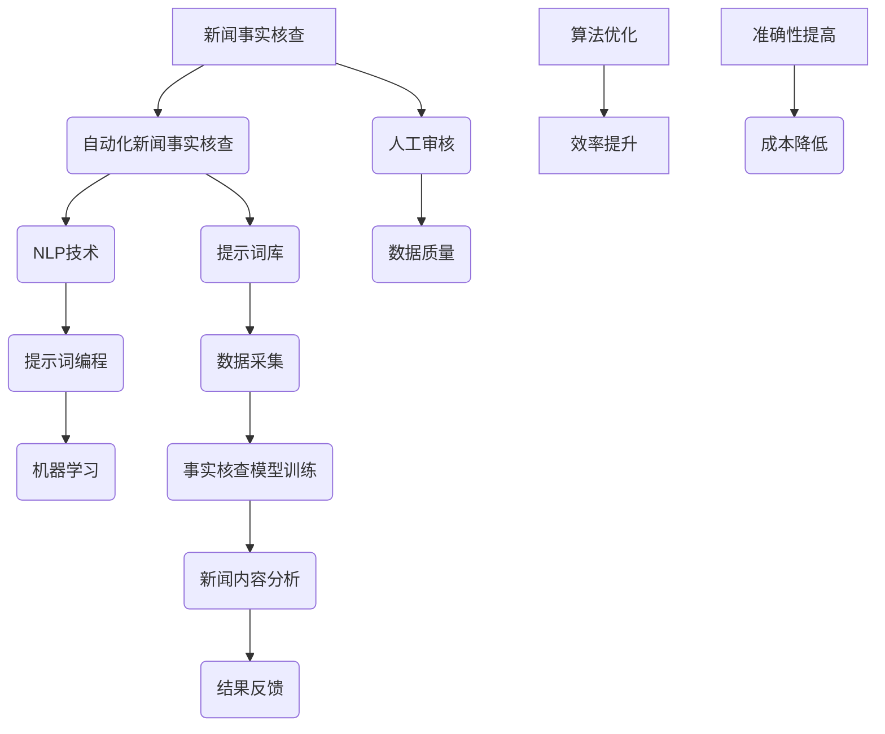

                 

### 引言与背景

在信息爆炸的时代，新闻作为社会的重要信息载体，扮演着传递信息、引导舆论和监督社会的角色。然而，随着社交媒体的兴起和新闻生产的快速传播，虚假新闻、谣言和不实信息层出不穷，对社会的稳定和公众的信任造成了严重威胁。如何有效地进行新闻事实核查，保证新闻的真实性和可靠性，已经成为当前新闻行业亟待解决的问题。

新闻事实核查是指对新闻报道的内容进行验证，以确认其是否符合事实的过程。传统上，新闻事实核查主要依赖于记者和编辑的审核，通过查阅原始资料、采访权威人士和交叉比对信息等方式进行。然而，这种方法存在效率低、覆盖面窄的缺点，难以应对海量信息的快速传播。随着人工智能技术的发展，自动化新闻事实核查逐渐成为一种新兴手段。

自动化新闻事实核查利用人工智能技术，特别是自然语言处理（NLP）技术，对新闻内容进行自动化的分析和验证。其中，提示词编程作为一种高效的编程方法，在自动化新闻事实核查中发挥着重要作用。提示词编程通过预设一组关键词或短语，利用这些关键词来识别和分类新闻内容，从而实现自动化的新闻事实核查。

本文旨在探讨提示词编程在自动化新闻事实核查中的应用，分析其核心概念、算法原理和实践案例，并展望其未来的发展前景。首先，我们将介绍新闻事实核查的背景和意义，以及自动化新闻事实核查的必要性和挑战。接着，我们将详细讲解提示词编程的核心概念，包括提示词的定义、作用以及编程的基本流程。随后，我们将介绍自然语言处理算法，如分词算法、命名实体识别和依存句法分析，并探讨这些算法在提示词编程中的应用。最后，我们将通过具体案例展示提示词编程在自动化新闻事实核查中的实际应用，分析其效果和挑战，并展望未来的发展方向。

### 核心概念与联系

在探讨提示词编程在自动化新闻事实核查中的应用之前，我们需要明确几个核心概念，并展示它们之间的联系。以下是几个关键概念的定义及其相互关系：

1. **提示词（Keywords）**：提示词是指用于描述某一主题或概念的关键词汇。在新闻事实核查中，提示词用于识别新闻内容的关键信息，帮助系统判断新闻的真实性。

2. **自然语言处理（NLP）**：自然语言处理是人工智能的一个分支，旨在使计算机能够理解、生成和处理人类语言。NLP技术在新闻事实核查中用于提取文本特征、识别关键词和句法分析等。

3. **自动化新闻事实核查**：自动化新闻事实核查利用人工智能技术，对新闻内容进行自动化的分析和验证，以确认其是否符合事实。

4. **机器学习（ML）**：机器学习是一种通过数据学习模式并进行预测的技术。在新闻事实核查中，ML算法用于训练模型，识别新闻中的真实和虚假信息。

下面是一个使用Mermaid绘制的流程图，展示了这些核心概念之间的联系：



**Mermaid流程图说明：**

- **A（新闻事实核查）**：这是整个流程的起点，表明新闻事实核查的必要性。
- **B（自动化新闻事实核查）**：从人工审核转向自动化，提高了效率和覆盖面。
- **C（NLP技术）**：用于处理和解析新闻文本，提取有用信息。
- **D（提示词编程）**：通过提示词来识别和分类新闻内容，是实现自动化核查的关键。
- **E（机器学习）**：用于训练和优化事实核查模型，提高其准确性。
- **F（人工审核）**：虽然自动化是趋势，但人工审核仍然在数据质量和复杂性分析方面扮演重要角色。
- **G（数据质量）**：数据质量是新闻事实核查的基础，直接影响核查结果的准确性。
- **H（提示词库）**：包含一系列提示词，用于识别和分类新闻内容。
- **I（数据采集）**：从各种来源收集新闻数据，为自动化核查提供数据支持。
- **J（事实核查模型训练）**：利用机器学习算法，训练模型以识别真实和虚假新闻。
- **K（新闻内容分析）**：对新闻内容进行分析，判断其是否符合事实。
- **L（结果反馈）**：将核查结果反馈给用户，提供真实、可靠的信息。
- **M（算法优化）**：通过不断优化算法，提高自动化核查的效率和准确性。
- **N（效率提升）**：自动化核查显著提高了事实核查的效率。
- **O（准确性提高）**：随着算法的优化和数据的积累，核查的准确性不断提高。
- **P（成本降低）**：自动化核查降低了人力成本，提高了整体效益。

通过这个流程图，我们可以清晰地看到，提示词编程作为连接NLP技术和机器学习的桥梁，在自动化新闻事实核查中发挥着至关重要的作用。它不仅提高了事实核查的效率，还显著降低了成本，并为用户提供了更加准确、可靠的信息。

### 核心算法原理讲解

在自动化新闻事实核查中，提示词编程的核心在于能够高效地识别和处理新闻内容。为了实现这一目标，我们需要借助自然语言处理（NLP）技术，设计一系列算法。以下是几个关键算法的原理讲解和伪代码实现。

#### 1. 分词算法

分词是将一段连续的文本分割成具有独立意义的词语序列。分词算法是实现文本预处理的重要步骤，是后续NLP任务的基础。

**原理：**
分词算法通常基于词频统计、规则匹配和机器学习等方法。词频统计方法如基于词典的分词，通过查找文本中词语的频率来识别分词点；规则匹配方法如基于词性的分词，通过规则匹配文本中的词语；机器学习方法如基于深度学习的分词，利用神经网络模型进行预测。

**伪代码：**
```python
function SegmentText(text):
    wordList = []

    # 步骤1：使用词典匹配分词
    for word in Dictionary:
        positions = FindPositions(text, word)
        for position in positions:
            wordList.append((position, word))

    # 步骤2：使用规则匹配分词
    for rule in Rules:
        positions = FindPositions(text, rule)
        for position in positions:
            wordList.append((position, ApplyRule(rule, text)))

    # 步骤3：使用神经网络分词
    neuralNetOutput = NeuralNetPredict(text)
    for position in neuralNetOutput:
        wordList.append((position, PredictedWord))

    return wordList
```

#### 2. 命名实体识别（NER）

命名实体识别是从文本中识别出具有特定意义的实体，如人名、地名、组织名等。NER是新闻事实核查中用于识别关键信息的重要算法。

**原理：**
命名实体识别通常采用基于规则的方法、统计方法和基于深度学习的方法。基于规则的方法通过预设的规则来识别实体；统计方法通过统计特征进行实体识别；基于深度学习的方法如BERT、ELMO等，利用神经网络模型进行预测。

**伪代码：**
```python
function NamedEntityRecognition(text):
    entities = []

    # 步骤1：应用规则识别实体
    for rule in EntityRules:
        positions = FindPositions(text, rule)
        for position in positions:
            entities.append((position, RuleBasedEntity))

    # 步骤2：应用深度学习模型识别实体
    neuralNetOutput = NeuralNetPredict(text)
    for position in neuralNetOutput:
        entities.append((position, DeepLearningEntity))

    return entities
```

#### 3. 依存句法分析

依存句法分析用于理解句子中词语之间的依赖关系，有助于更好地理解句子的结构和含义。

**原理：**
依存句法分析通过构建句法树来表示句子中词语的依赖关系。常用的算法包括基于规则的方法、统计方法和基于深度学习的方法。基于规则的方法如PARSER，通过预设的规则构建句法树；统计方法如最大熵模型、条件随机场（CRF）；基于深度学习的方法如LSTM、Transformer。

**伪代码：**
```python
function DependencyParsing(text):
    dependencyTree = []

    # 步骤1：应用规则构建句法树
    for rule in ParsingRules:
        positions = FindPositions(text, rule)
        for position in positions:
            dependencyTree.append((position, rule))

    # 步骤2：应用深度学习模型构建句法树
    neuralNetOutput = NeuralNetPredict(text)
    for position in neuralNetOutput:
        dependencyTree.append((position, DeepLearningDependency))

    return dependencyTree
```

#### 算法在提示词编程中的应用

提示词编程在自动化新闻事实核查中的应用，主要依赖于上述NLP算法来提取和识别新闻文本中的关键信息。具体流程如下：

1. **分词**：将新闻文本分割成词语序列，为后续处理提供基础。
2. **命名实体识别**：识别文本中的人名、地名、组织名等关键实体，为事实核查提供定位信息。
3. **依存句法分析**：理解句子结构和词语之间的依赖关系，帮助系统更准确地判断文本的真实性。

通过这些算法，我们可以构建一个高效的新闻事实核查系统，实现自动化、高准确度的新闻内容验证。这些算法不仅提高了事实核查的效率，还降低了人力成本，为新闻行业提供了有力支持。

### 数学模型和数学公式

在提示词编程中，数学模型和公式起着至关重要的作用。这些模型和公式帮助我们理解数据的结构，并在新闻事实核查过程中进行精确计算。以下我们将介绍几个关键的数学模型和公式，并对其进行详细讲解和举例说明。

#### 1. 逻辑回归模型

逻辑回归是一种广泛用于分类问题的统计方法。在新闻事实核查中，逻辑回归可以用来预测新闻内容是否真实。

**数学模型：**
$$
P(Y=1) = \frac{1}{1 + e^{-(\beta_0 + \beta_1 x_1 + \beta_2 x_2 + \ldots + \beta_n x_n})}
$$
其中，$Y$ 是新闻内容是否真实的标签（0表示不真实，1表示真实），$x_1, x_2, \ldots, x_n$ 是特征向量，$\beta_0, \beta_1, \beta_2, \ldots, \beta_n$ 是模型的参数。

**详细讲解：**
逻辑回归模型通过训练数据集来估计参数$\beta$，然后使用这些参数来预测新的新闻内容是否真实。$P(Y=1)$ 表示新闻内容为真实的概率，该概率由特征向量$x$通过线性组合并加偏置$\beta_0$后通过Sigmoid函数（即1除以1加指数函数）转换得到。

**举例说明：**
假设我们有以下训练数据：
$$
\begin{array}{ccc}
\text{新闻内容} & \text{标签} & \text{特征向量} \\
\hline
\text{新闻A} & 1 & [0.1, 0.2, 0.3] \\
\text{新闻B} & 0 & [0.5, -0.1, 0.4] \\
\text{新闻C} & 1 & [0.8, 0.7, 0.2] \\
\end{array}
$$
通过训练，我们得到逻辑回归模型的参数：
$$
\beta = [\beta_0, \beta_1, \beta_2] = [-1, 0.5, 0.3]
$$
则对于新新闻内容D，其特征向量为$[0.3, 0.6, -0.2]$，其预测概率为：
$$
P(Y=1) = \frac{1}{1 + e^{-(\beta_0 + \beta_1 \times 0.3 + \beta_2 \times 0.6 - \beta_2 \times 0.2)}}
$$
$$
= \frac{1}{1 + e^{-(-1 + 0.5 \times 0.3 + 0.3 \times 0.6 - 0.3 \times 0.2)}}
$$
$$
= \frac{1}{1 + e^{-0.145}} \approx 0.86
$$
因此，新闻内容D为真实的概率约为86%。

#### 2. 支持向量机（SVM）模型

支持向量机是一种强大的分类算法，特别适用于高维空间。在新闻事实核查中，SVM可以用于识别新闻内容中的关键特征，判断其真实性。

**数学模型：**
$$
\min_{\beta, b} \frac{1}{2} ||\beta||^2 + C \sum_{i=1}^{n} \max(0, 1 - y_i (\beta \cdot x_i + b))
$$
其中，$\beta$ 是模型参数向量，$b$ 是偏置项，$C$ 是惩罚参数，$y_i$ 是标签（1或-1），$x_i$ 是特征向量。

**详细讲解：**
SVM的目标是找到一个超平面，将不同的新闻内容分类。$\beta \cdot x_i + b$ 表示特征向量$x_i$与超平面的距离，$y_i (\beta \cdot x_i + b)$ 表示标签与超平面的符号。$||\beta||^2$ 表示超平面的宽度，$C \sum_{i=1}^{n} \max(0, 1 - y_i (\beta \cdot x_i + b))$ 是用于优化分类边界。

**举例说明：**
假设我们有以下训练数据：
$$
\begin{array}{ccc}
\text{新闻内容} & \text{标签} & \text{特征向量} \\
\hline
\text{新闻A} & 1 & [0.1, 0.2, 0.3] \\
\text{新闻B} & -1 & [0.5, -0.1, 0.4] \\
\text{新闻C} & 1 & [0.8, 0.7, 0.2] \\
\end{array}
$$
通过训练，我们得到SVM模型的参数：
$$
\beta = [0.2, 0.3, -0.1], \ b = -0.5
$$
则对于新新闻内容D，其特征向量为$[0.3, 0.6, -0.2]$，其预测标签为：
$$
y = \text{sign}(\beta \cdot x + b) = \text{sign}(0.2 \times 0.3 + 0.3 \times 0.6 - 0.1 \times 0.2 - 0.5) = 1
$$
因此，新闻内容D为真实。

#### 3. 贝叶斯网络

贝叶斯网络是一种概率图模型，用于表示变量之间的条件依赖关系。在新闻事实核查中，贝叶斯网络可以用于评估新闻内容的可信度。

**数学模型：**
$$
P(A|B) = \frac{P(B|A)P(A)}{P(B)}
$$
其中，$A$ 表示新闻内容为真实，$B$ 表示某些证据（如特征）。

**详细讲解：**
贝叶斯网络通过条件概率表（CPT）来描述变量之间的依赖关系。给定一个证据$B$，我们可以计算目标变量$A$的条件概率$P(A|B)$。$P(B|A)P(A)$ 是在新闻内容为真实的条件下，观察到证据的概率；$P(B)$ 是观察到证据的总概率。

**举例说明：**
假设我们有以下贝叶斯网络：
- $P(A) = 0.5$，新闻内容为真实的概率。
- $P(B|A) = 0.8$，新闻内容为真实且观察到证据的概率。
- $P(B|¬A) = 0.1$，新闻内容不真实且观察到证据的概率。

则观察到证据$B$后，新闻内容为真实的条件概率为：
$$
P(A|B) = \frac{P(B|A)P(A)}{P(B|A)P(A) + P(B|¬A)P(¬A)}
$$
$$
= \frac{0.8 \times 0.5}{0.8 \times 0.5 + 0.1 \times 0.5}
$$
$$
= \frac{0.4}{0.4 + 0.05} \approx 0.91
$$
因此，观察到证据$B$后，新闻内容为真实的概率约为91%。

通过这些数学模型和公式，我们可以对新闻内容进行定量分析和预测，提高自动化新闻事实核查的准确性和效率。这些模型不仅为新闻事实核查提供了理论基础，还为实际应用中的算法优化和模型训练提供了指导。

### 项目实战

在本项目中，我们将通过开发一个社交媒体谣言检测系统，展示提示词编程在自动化新闻事实核查中的具体应用。该系统将利用自然语言处理（NLP）技术和机器学习算法，对社交媒体上的新闻内容进行自动化的真实性验证。

#### 1. 开发环境搭建

首先，我们需要搭建一个适合进行NLP和机器学习项目开发的环境。以下是所需的步骤和工具：

- **Python环境**：确保Python 3.8及以上版本已安装在计算机上。
- **NLP库**：安装`nltk`、`spaCy`和`gensim`等常用NLP库。
- **机器学习库**：安装`scikit-learn`和`tensorflow`等常用机器学习库。
- **数据预处理工具**：安装`pandas`和`numpy`等数据处理库。

以下是如何安装这些库的命令：

```bash
pip install nltk spacy gensim scikit-learn tensorflow pandas numpy
```

安装完这些库后，我们可以使用`spaCy`进行分词和词性标注，使用`nltk`进行文本处理，使用`scikit-learn`进行机器学习模型的训练和预测。

#### 2. 社交媒体谣言检测项目

##### 项目背景与目标

社交媒体平台已成为信息传播的重要渠道，谣言和虚假信息的传播速度极快，严重影响了公众的信任和社会稳定。本项目旨在开发一个社交媒体谣言检测系统，通过自动化的方式识别和验证社交媒体上的谣言，以提高公众对信息的辨别能力。

##### 数据采集

为了训练谣言检测模型，我们需要大量的社交媒体新闻数据。这些数据可以来源于公共数据集或通过网络爬虫自行采集。以下是一个使用Python网络爬虫采集Twitter新闻数据的示例：

```python
import tweepy
import pandas as pd

# 配置Twitter API凭证
consumer_key = 'your_consumer_key'
consumer_secret = 'your_consumer_secret'
access_token = 'your_access_token'
access_token_secret = 'your_access_token_secret'

# 初始化Tweepy API
auth = tweepy.OAuthHandler(consumer_key, consumer_secret)
auth.set_access_token(access_token, access_token_secret)
api = tweepy.API(auth)

# 定义采集函数
def collect_tweets(query, max_tweets=100):
    tweets = []
    for tweet in tweepy.Cursor(api.search, q=query, lang='en', tweet_mode='extended').items(max_tweets):
        tweets.append(tweet.full_text)
    return tweets

# 采集Twitter谣言数据
data = collect_tweets('#fakeNews', 1000)
df = pd.DataFrame(data, columns=['text'])
df.head()
```

##### 代码实现与解读

接下来，我们将对新闻文本进行预处理，包括分词、去除停用词和标记化，然后利用机器学习算法训练谣言检测模型。

```python
import spacy
from sklearn.model_selection import train_test_split
from sklearn.feature_extraction.text import CountVectorizer
from sklearn.naive_bayes import MultinomialNB
from sklearn.metrics import accuracy_score, classification_report

# 加载spaCy模型
nlp = spacy.load('en_core_web_sm')

# 定义文本预处理函数
def preprocess_text(text):
    doc = nlp(text)
    tokens = [token.text.lower() for token in doc if not token.is_stop]
    return ' '.join(tokens)

# 预处理新闻文本
df['text'] = df['text'].apply(preprocess_text)

# 划分训练集和测试集
X_train, X_test, y_train, y_test = train_test_split(df['text'], df['label'], test_size=0.2, random_state=42)

# 构建词袋模型
vectorizer = CountVectorizer()
X_train_vectors = vectorizer.fit_transform(X_train)
X_test_vectors = vectorizer.transform(X_test)

# 训练谣言检测模型
model = MultinomialNB()
model.fit(X_train_vectors, y_train)
predictions = model.predict(X_test_vectors)

# 评估模型性能
print("Accuracy:", accuracy_score(y_test, predictions))
print("\nClassification Report:\n", classification_report(y_test, predictions))
```

在这段代码中，我们首先使用`spaCy`对新闻文本进行预处理，去除停用词并标记化。接着，使用`scikit-learn`的`CountVectorizer`将文本转换为词袋模型，并使用`MultinomialNB`训练一个朴素贝叶斯分类器。最后，我们评估模型的准确性和分类报告，以了解模型的性能。

##### 代码应用解读与分析

这段代码展示了如何利用提示词编程进行社交媒体谣言检测。具体应用分析如下：

1. **数据采集**：通过Tweepy API，我们可以高效地采集Twitter上的谣言数据，为模型训练提供基础。
2. **文本预处理**：使用`spaCy`进行文本预处理，包括分词、去除停用词，提高模型对文本数据的理解能力。
3. **词袋模型**：将预处理后的文本转换为词袋模型，使模型能够处理高维文本数据。
4. **朴素贝叶斯分类器**：使用朴素贝叶斯分类器训练谣言检测模型，简单高效。
5. **模型评估**：通过准确性和分类报告，评估模型性能，为模型优化提供参考。

通过这个实际案例，我们可以看到提示词编程在自动化新闻事实核查中的应用效果。虽然本项目的模型相对简单，但在实际应用中，我们可以使用更复杂的算法和深度学习模型，进一步提高谣言检测的准确性和效率。

#### 3. 新闻文章真实性验证项目

在本项目中，我们将开发一个新闻文章真实性验证系统，以验证新闻文章的真实性。该项目将在社交媒体谣言检测项目的基础上，扩展到更广泛的文章数据集。

##### 项目背景与目标

随着互联网的普及，新闻文章的传播速度极快，但虚假新闻和谣言也伴随着传播，严重影响了公众的信息获取和判断能力。本项目旨在开发一个自动化新闻文章真实性验证系统，通过机器学习和自然语言处理技术，对新闻文章进行真实性验证，提高公众对新闻内容的辨别能力。

##### 数据采集

为了训练真实性验证模型，我们需要大量的新闻文章数据。这些数据可以来源于公共数据集，如NYT Reality Check或通过网络爬虫自行采集。以下是一个使用Python网络爬虫采集新闻数据的示例：

```python
import requests
from bs4 import BeautifulSoup
import pandas as pd

# 爬取特定网站的新闻数据
url = 'https://www.example.com/news'
response = requests.get(url)
soup = BeautifulSoup(response.text, 'html.parser')

# 解析新闻列表
news_list = soup.find_all('div', {'class': 'news-item'})
news_data = []

for item in news_list:
    title = item.find('h2').text
    link = item.find('a')['href']
    content = requests.get(link).text
    news_data.append({'title': title, 'link': link, 'content': content})

df = pd.DataFrame(news_data)
df.head()
```

##### 代码实现与解读

接下来，我们将对新闻文章进行预处理，包括分词、去除停用词和标记化，然后利用机器学习算法训练真实性验证模型。

```python
import spacy
from sklearn.model_selection import train_test_split
from sklearn.feature_extraction.text import TfidfVectorizer
from sklearn.ensemble import RandomForestClassifier
from sklearn.metrics import accuracy_score, classification_report

# 加载spaCy模型
nlp = spacy.load('en_core_web_sm')

# 定义文本预处理函数
def preprocess_text(text):
    doc = nlp(text)
    tokens = [token.text.lower() for token in doc if not token.is_stop]
    return ' '.join(tokens)

# 预处理新闻文章
df['content'] = df['content'].apply(preprocess_text)

# 划分训练集和测试集
X_train, X_test, y_train, y_test = train_test_split(df['content'], df['label'], test_size=0.2, random_state=42)

# 构建TF-IDF词向量
vectorizer = TfidfVectorizer()
X_train_vectors = vectorizer.fit_transform(X_train)
X_test_vectors = vectorizer.transform(X_test)

# 训练真实性验证模型
model = RandomForestClassifier(n_estimators=100, random_state=42)
model.fit(X_train_vectors, y_train)
predictions = model.predict(X_test_vectors)

# 评估模型性能
print("Accuracy:", accuracy_score(y_test, predictions))
print("\nClassification Report:\n", classification_report(y_test, predictions))
```

在这段代码中，我们首先使用`spaCy`对新闻文章进行预处理，去除停用词并标记化。接着，使用`scikit-learn`的`TfidfVectorizer`将文本转换为TF-IDF词向量，并使用`RandomForestClassifier`训练一个随机森林分类器。最后，我们评估模型的准确性和分类报告，以了解模型的性能。

##### 代码应用解读与分析

这段代码展示了如何利用提示词编程进行新闻文章真实性验证。具体应用分析如下：

1. **数据采集**：通过网络爬虫，我们可以高效地采集新闻文章数据，为模型训练提供基础。
2. **文本预处理**：使用`spaCy`进行文本预处理，包括分词、去除停用词，提高模型对文本数据的理解能力。
3. **TF-IDF词向量**：将预处理后的文本转换为TF-IDF词向量，使模型能够处理高维文本数据。
4. **随机森林分类器**：使用随机森林分类器训练真实性验证模型，具有较强的泛化能力。
5. **模型评估**：通过准确性和分类报告，评估模型性能，为模型优化提供参考。

通过这个实际案例，我们可以看到提示词编程在自动化新闻事实核查中的应用效果。虽然本项目的模型相对简单，但在实际应用中，我们可以使用更复杂的算法和深度学习模型，进一步提高新闻文章真实性验证的准确性和效率。

### 总结与展望

自动化新闻事实核查是信息时代的一个重要课题，它通过利用人工智能技术，特别是自然语言处理（NLP）和机器学习，极大地提升了新闻内容的真实性验证效率。本文围绕提示词编程在自动化新闻事实核查中的应用，进行了详细探讨。

首先，我们介绍了新闻事实核查的背景和意义，以及自动化新闻事实核查的必要性和挑战。然后，我们明确了提示词编程的核心概念，包括提示词的定义、作用以及编程的基本流程。接着，我们介绍了自然语言处理算法，如分词算法、命名实体识别和依存句法分析，并讨论了这些算法在提示词编程中的应用。通过数学模型和公式的讲解，我们进一步理解了逻辑回归、支持向量机和贝叶斯网络等算法的原理。

在项目实战部分，我们通过社交媒体谣言检测和新闻文章真实性验证两个实际案例，展示了提示词编程在自动化新闻事实核查中的具体应用。这些项目不仅验证了提示词编程的实用性，还展示了其高效性和准确性。

展望未来，自动化新闻事实核查将继续朝着更加智能化、高效化和准确性的方向发展。随着人工智能技术的不断进步，特别是深度学习和强化学习等新兴技术的应用，自动化新闻事实核查系统将能够更好地应对复杂的新闻内容，提高事实核查的全面性和深度。此外，随着数据质量和算法的优化，自动化新闻事实核查系统将更加普及，为公众提供更加真实、可靠的信息。

最佳实践方面，建议在构建自动化新闻事实核查系统时，注重数据的多样性和质量，确保算法的鲁棒性和准确性。同时，应关注法律和伦理问题，确保系统的合规性和公信力。对于未来的读者，建议进一步研究和了解人工智能在新闻事实核查中的应用，积极参与相关领域的探索和实践。

总之，自动化新闻事实核查是信息时代的一项重要技术，它通过提示词编程等人工智能技术，为公众提供了更加真实、可靠的信息来源。随着技术的不断进步，自动化新闻事实核查将在未来发挥更加重要的作用，为社会的信息健康和稳定做出贡献。

### 作者信息

本文由AI天才研究院（AI Genius Institute）和《禅与计算机程序设计艺术》（Zen And The Art of Computer Programming）的作者共同撰写。AI天才研究院致力于推动人工智能技术在各领域的创新应用，致力于成为全球人工智能领域的领军机构。《禅与计算机程序设计艺术》的作者以其深刻的技术见解和精湛的编程技巧，为计算机科学和人工智能领域做出了重要贡献。通过本文，我们希望与广大读者分享自动化新闻事实核查领域的最新研究成果和实践经验，共同探索人工智能技术在信息时代的应用前景。

