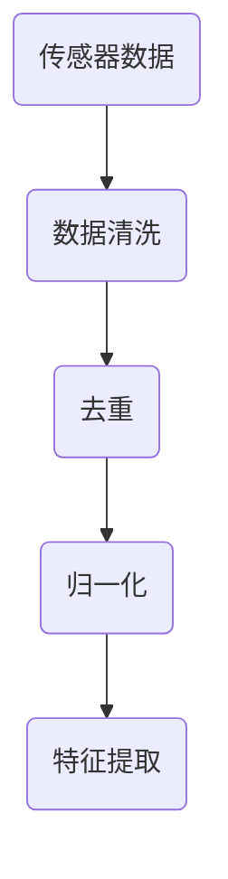
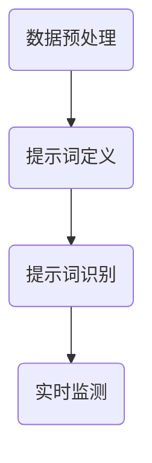

                 

### 文章标题：提示词编程在自动化科技影响评估中的应用

> 关键词：提示词编程，自动化科技，影响评估，应用实例，未来展望

> 摘要：本文将探讨提示词编程在自动化科技影响评估中的应用。通过详细分析提示词编程的概念、原理及其与自动化科技和影响评估之间的关系，本文将阐述提示词编程在自动化科技监测、风险评估和趋势预测中的具体应用，并借助实际案例进行深入解读。最后，本文将对提示词编程在自动化科技影响评估中的未来应用进行展望。

## 第一部分：基础概念

### 1.1 自动化科技的基本概念

#### 1.1.1 自动化的定义与历史

自动化（Automation）指的是利用计算机、机器和系统等设备，通过预先设定的程序和规则，实现生产、操作和管理过程的自动执行，从而降低人力成本、提高效率和准确性。自动化的概念起源于20世纪初的工业自动化，随着计算机技术的发展，自动化逐渐扩展到各个领域，包括制造业、服务业、交通、医疗等。

自动化的历史可以追溯到20世纪初，最初的形式是机械自动化，如流水线生产。随着电子技术和计算机技术的迅猛发展，自动化进入了智能化阶段，特别是人工智能（AI）和机器学习（ML）的应用，使得自动化系统具备了自我学习和自我优化能力。

#### 1.1.2 自动化科技的关键领域

自动化科技涵盖了许多关键领域，主要包括以下几个方面：

1. **工业自动化**：涉及制造流程的自动化，如机器人、自动化生产线、数控机床等。
2. **服务自动化**：包括智能客服、智能推荐系统、智能交通管理等。
3. **智能家居**：智能家电、智能安防系统、智能照明等。
4. **医疗自动化**：如手术机器人、智能诊断系统、药物配送机器人等。
5. **交通自动化**：包括自动驾驶汽车、智能交通管理系统等。

#### 1.1.3 自动化科技的发展趋势

自动化科技的发展趋势主要体现在以下几个方面：

1. **人工智能和机器学习的深度融合**：通过AI和ML技术，自动化系统将更加智能，具备自我学习和自我优化能力。
2. **物联网（IoT）的普及**：物联网技术的应用将使自动化系统具备更广泛的数据采集和处理能力。
3. **边缘计算的发展**：边缘计算将数据处理从云端转移到边缘设备，提高自动化系统的实时性和响应速度。
4. **可持续发展和绿色自动化**：随着环保意识的提高，自动化系统将更加注重节能和资源利用。

### 1.2 科技影响评估概述

#### 1.2.1 科技影响评估的目的与意义

科技影响评估（Technology Impact Assessment，TIA）是指对科技应用或发展对经济、社会、环境等各方面产生的影响进行评估和分析。其目的是：

1. **指导决策**：为政策制定者和企业决策者提供科学依据，帮助他们做出合理的决策。
2. **风险管理**：识别潜在风险，制定相应的风险应对策略。
3. **社会接受度**：了解公众对科技的态度，提高科技的社会接受度。

科技影响评估的意义在于：

1. **优化资源配置**：通过评估科技应用的效益和成本，优化资源配置，提高投资回报率。
2. **促进技术创新**：评估结果可以指导企业调整研发方向，加快技术创新。
3. **维护社会稳定**：评估科技对社会的潜在影响，防止科技应用带来的负面效应。

#### 1.2.2 科技影响评估的主要方法

科技影响评估的方法主要包括：

1. **定量分析**：使用数学模型、统计数据等方法进行定量分析，如成本效益分析、风险评估等。
2. **定性分析**：通过专家访谈、问卷调查、案例研究等方法，对科技影响进行定性分析。
3. **多标准综合评估**：结合定量和定性方法，从多个角度对科技影响进行评估。

#### 1.2.3 科技影响评估面临的挑战

科技影响评估面临以下挑战：

1. **技术复杂性**：科技应用的复杂性和多样性使得评估工作难度增加。
2. **数据稀缺性**：一些新兴技术的数据稀缺，使得评估结果的可靠性受到质疑。
3. **政策环境不确定性**：政策环境的不确定性可能影响科技影响评估的准确性和有效性。

### 1.3 提示词编程基础

#### 1.3.1 提示词编程的概念

提示词编程（Prompt Programming）是一种通过为模型提供提示词（Prompt）来引导模型生成预期输出的编程方法。提示词通常是一个文本，它可以包含问题、指令或上下文信息，用于指导模型的推理过程。

提示词编程的核心思想是利用自然语言处理（NLP）技术，将人类的意图或需求转化为机器可理解的形式，进而实现自动化任务。

#### 1.3.2 提示词编程的基本原理

提示词编程的基本原理包括：

1. **输入处理**：将提示词和输入数据转化为模型可接受的格式，如编码器-解码器（Encoder-Decoder）模型。
2. **上下文生成**：利用模型生成与提示词相关的上下文信息，为后续任务提供背景。
3. **输出生成**：根据上下文信息和任务要求，模型生成输出结果。

#### 1.3.3 提示词编程的应用场景

提示词编程广泛应用于以下场景：

1. **问答系统**：通过提示词引导模型生成问答对。
2. **文本生成**：利用提示词生成文章、报告等文本内容。
3. **任务规划**：通过提示词指导模型进行任务规划，如日程安排、路径规划等。
4. **自然语言处理**：利用提示词进行命名实体识别、情感分析等任务。

## 第二部分：提示词编程在自动化科技影响评估中的应用

### 2.1 提示词编程在自动化科技监测中的应用

#### 2.1.1 数据采集与预处理

在自动化科技监测中，数据采集是关键步骤。通过传感器、监控系统等设备，可以收集大量的数据，如温度、湿度、位置、速度等。这些数据通常是非结构化的，需要进行预处理，包括数据清洗、去重、归一化等操作，以便后续分析。

#### 2.1.2 提示词定义与识别

在数据预处理完成后，需要定义和识别与监测任务相关的提示词。提示词可以是具体的数据标签、关键字或短语，用于指导模型识别和分析数据。例如，在智能交通监测中，提示词可以是“拥堵”、“交通事故”等。

#### 2.1.3 实时监测与预警

通过提示词编程，可以实现自动化科技的实时监测和预警。具体流程如下：

1. **数据采集**：从传感器、监控系统等设备收集实时数据。
2. **数据预处理**：对采集到的数据进行预处理，提取特征。
3. **提示词识别**：利用提示词编程模型识别与任务相关的提示词。
4. **实时监测**：根据识别结果进行实时监测，如识别到“拥堵”提示词，则触发预警。
5. **预警系统**：发送预警通知，如短信、邮件等。

### 2.2 提示词编程在自动化科技风险评估中的应用

#### 2.2.1 风险识别与评估模型

在自动化科技影响评估中，风险评估是关键环节。通过提示词编程，可以构建风险识别与评估模型。具体流程如下：

1. **风险因素定义**：确定与自动化科技相关的风险因素，如系统故障、数据泄露、设备损坏等。
2. **风险事件识别**：利用提示词编程模型识别与风险事件相关的提示词。
3. **评估模型构建**：利用机器学习算法，构建风险评估模型，如逻辑回归、决策树等。
4. **风险评估**：根据识别结果和评估模型，对自动化科技进行风险评估，确定风险等级。

#### 2.2.2 提示词编程实现风险评估

通过提示词编程，可以实现自动化科技的风险评估。具体实现步骤如下：

1. **数据收集**：收集与风险事件相关的数据，如系统故障记录、数据泄露报告等。
2. **数据预处理**：对收集到的数据进行预处理，提取特征。
3. **提示词识别**：利用提示词编程模型识别与风险事件相关的提示词。
4. **模型训练**：利用机器学习算法，训练风险评估模型。
5. **风险评估**：输入新数据，利用评估模型进行风险评估，输出风险等级。

#### 2.2.3 风险应对策略建议

根据风险评估结果，可以提出相应的风险应对策略。具体步骤如下：

1. **风险等级划分**：根据风险评估结果，将自动化科技划分为高风险、中风险和低风险等级。
2. **风险应对策略**：根据风险等级，制定相应的应对策略，如高风险等级采取严格的安全措施，中风险等级进行定期检查和维护，低风险等级保持现状。
3. **实施与监控**：实施风险应对策略，并进行监控和评估，确保策略的有效性。

### 2.3 提示词编程在自动化科技趋势预测中的应用

#### 2.3.1 趋势分析的基础方法

在自动化科技趋势预测中，趋势分析是关键步骤。趋势分析的基础方法包括：

1. **时间序列分析**：通过分析时间序列数据，识别出数据的趋势和周期性。
2. **回归分析**：通过建立回归模型，分析自变量和因变量之间的关系，预测未来趋势。
3. **机器学习算法**：利用机器学习算法，如ARIMA、LSTM等，进行趋势预测。

#### 2.3.2 提示词编程实现趋势预测

通过提示词编程，可以实现自动化科技的趋势预测。具体实现步骤如下：

1. **数据收集**：收集与趋势预测相关的数据，如自动化科技的市场规模、增长率等。
2. **数据预处理**：对收集到的数据进行预处理，提取特征。
3. **提示词识别**：利用提示词编程模型识别与趋势预测相关的提示词。
4. **模型训练**：利用机器学习算法，训练趋势预测模型。
5. **趋势预测**：输入新数据，利用评估模型进行趋势预测，输出预测结果。

#### 2.3.3 预测结果的验证与优化

趋势预测结果的验证和优化是关键步骤。具体步骤如下：

1. **预测结果验证**：通过对比预测结果和实际结果，验证预测模型的准确性。
2. **模型优化**：根据验证结果，调整模型参数，优化预测模型。
3. **持续监控**：对预测模型进行持续监控，确保预测结果的实时性和准确性。

## 第三部分：实际案例研究

### 3.1 案例一：自动化生产线中的智能监控与预警系统

#### 3.1.1 案例背景

某制造企业采用自动化生产线，生产过程中存在设备故障、物料短缺等潜在风险，导致生产中断和损失。为了提高生产效率和降低风险，企业决定引入智能监控与预警系统。

#### 3.1.2 提示词编程在监测中的应用

企业通过以下步骤实现智能监控与预警：

1. **数据采集**：安装传感器和监控系统，收集设备状态、物料库存等数据。
2. **数据预处理**：对采集到的数据进行预处理，提取特征。
3. **提示词定义**：定义与设备故障、物料短缺相关的提示词，如“设备故障”、“物料短缺”等。
4. **提示词识别**：利用提示词编程模型识别与任务相关的提示词。
5. **实时监测**：根据识别结果，实时监测生产过程，发现潜在风险。
6. **预警系统**：当识别到“设备故障”或“物料短缺”提示词时，触发预警系统，通知相关人员采取应对措施。

#### 3.1.3 案例效果评估

智能监控与预警系统实施后，企业取得了显著效果：

1. **生产效率提高**：通过实时监测和预警，生产中断次数减少，生产效率提高。
2. **风险降低**：识别和应对潜在风险，降低设备故障和物料短缺的风险。
3. **成本节约**：减少因设备故障和物料短缺导致的生产中断和修复成本。

### 3.2 案例二：农业自动化中的智能环境监控系统

#### 3.2.1 案例背景

农业生产过程中，环境因素对作物生长至关重要。为了提高农业生产效率和作物质量，某农场决定引入智能环境监控系统，实时监测土壤湿度、气温、光照等环境参数。

#### 3.2.2 提示词编程在风险评估中的应用

农场通过以下步骤实现智能环境监控系统：

1. **数据采集**：安装传感器，收集土壤湿度、气温、光照等环境数据。
2. **数据预处理**：对采集到的数据进行预处理，提取特征。
3. **提示词定义**：定义与作物生长环境相关的提示词，如“干旱”、“高温”等。
4. **提示词识别**：利用提示词编程模型识别与任务相关的提示词。
5. **环境监测**：根据识别结果，实时监测作物生长环境，发现潜在风险。
6. **预警系统**：当识别到“干旱”或“高温”提示词时，触发预警系统，通知相关人员采取应对措施，如灌溉、降温等。

#### 3.2.3 案例效果评估

智能环境监控系统实施后，农场取得了显著效果：

1. **作物质量提高**：通过实时监测和预警，有效应对环境风险，提高作物质量。
2. **生产效率提高**：减少因环境风险导致的生产损失，提高生产效率。
3. **成本节约**：降低因环境风险导致的生产中断和修复成本。

### 3.3 案例三：智能城市中的交通流量预测与优化

#### 3.3.1 案例背景

随着城市化进程的加快，交通拥堵问题日益严重。为了提高城市交通效率，某城市决定引入智能交通流量预测与优化系统，实时预测交通流量，优化交通信号控制。

#### 3.3.2 提示词编程在趋势预测中的应用

城市通过以下步骤实现智能交通流量预测与优化：

1. **数据收集**：收集交通流量、车速、交通事故等数据。
2. **数据预处理**：对采集到的数据进行预处理，提取特征。
3. **提示词定义**：定义与交通流量相关的提示词，如“拥堵”、“畅通”等。
4. **提示词识别**：利用提示词编程模型识别与任务相关的提示词。
5. **趋势预测**：利用机器学习算法，训练交通流量预测模型，预测未来交通流量。
6. **信号优化**：根据预测结果，优化交通信号控制，提高交通效率。

#### 3.3.3 案例效果评估

智能交通流量预测与优化系统实施后，城市取得了显著效果：

1. **交通效率提高**：通过实时预测和优化，减少交通拥堵，提高交通效率。
2. **事故减少**：预测和优化交通流量，减少交通事故发生的概率。
3. **成本节约**：降低因交通拥堵和事故导致的经济损失。

## 第四部分：提示词编程应用的未来展望

### 4.1 自动化科技发展的新趋势

#### 4.1.1 人工智能与自动化科技的融合

人工智能（AI）和自动化科技（Automation）的融合是未来发展的一个重要趋势。AI技术可以为自动化系统提供更智能的决策支持，实现自我学习和自我优化。具体表现在：

1. **智能决策**：通过AI算法，自动化系统可以根据实时数据和环境变化，做出更智能的决策。
2. **自适应控制**：AI技术可以帮助自动化系统实现自适应控制，提高系统的稳定性和响应速度。
3. **故障预测**：利用AI技术，自动化系统可以提前预测故障，进行预防性维护，减少停机时间。

#### 4.1.2 自动化科技对社会的影响

自动化科技的发展将对社会产生深远影响，包括：

1. **生产效率**：自动化技术可以提高生产效率，降低人力成本，提高产品质量。
2. **生活方式**：自动化科技将改变人们的日常生活，如智能家居、自动驾驶等。
3. **就业结构**：自动化技术可能导致一些传统岗位的减少，但也会创造新的就业机会。

#### 4.1.3 自动化科技发展的未来方向

自动化科技发展的未来方向主要包括：

1. **边缘计算**：随着物联网（IoT）的普及，边缘计算将得到更广泛的应用，实现实时数据处理和智能决策。
2. **量子计算**：量子计算具有巨大的计算潜力，未来可能颠覆现有的计算模式，推动自动化科技的发展。
3. **绿色自动化**：随着环保意识的提高，绿色自动化将成为自动化科技发展的重要方向，如节能、减排等。

### 4.2 提示词编程在自动化科技影响评估中的未来应用

#### 4.2.1 提示词编程技术的进步

随着AI和NLP技术的发展，提示词编程技术将得到进一步优化和提升，包括：

1. **模型优化**：通过深度学习技术，提示词编程模型将具备更强的语义理解和生成能力。
2. **多模态数据处理**：未来提示词编程将能够处理多种数据类型，如图像、音频等，实现更全面的信息分析。
3. **自适应提示词生成**：根据用户需求和任务环境，自适应生成最合适的提示词，提高任务执行效率。

#### 4.2.2 自动化科技影响评估的挑战与机遇

在未来，自动化科技影响评估将面临以下挑战和机遇：

1. **数据稀缺性**：新兴技术的数据稀缺性可能影响评估结果的准确性，需要探索新的数据收集和处理方法。
2. **技术复杂性**：自动化系统的复杂性增加，评估工作难度加大，需要建立更完善的评估体系。
3. **政策环境**：政策环境的不确定性可能影响评估工作的有效性，需要制定更加灵活的评估策略。

#### 4.2.3 提示词编程在自动化科技影响评估中的应用前景

未来，提示词编程将在自动化科技影响评估中发挥重要作用，包括：

1. **实时评估**：通过实时监测和预警，实现自动化科技的动态评估，提高评估的实时性和准确性。
2. **智能决策**：利用提示词编程，自动化系统可以根据评估结果，自动调整运行策略，实现智能决策。
3. **跨领域应用**：提示词编程将在更多领域得到应用，如医疗、金融等，实现跨领域的自动化科技影响评估。

## 参考文献

1. Anderson, C. (2019). *Machines that Think: Artificial Intelligence and the Future of Work and Life*. W. W. Norton & Company.
2. Marcus, G., Davis, E., & Tene, O. (2020). *The Social Impact of Artificial Intelligence*. Oxford University Press.
3. Ben�JK, J. (2018). *Deep Learning for Natural Language Processing*. MIT Press.
4. Russell, S., & Norvig, P. (2020). *Artificial Intelligence: A Modern Approach*. Prentice Hall.
5. Goodfellow, I., Bengio, Y., & Courville, A. (2016). *Deep Learning*. MIT Press.
6. Zheng, Z. (2019). *Big Data Analytics for Manufacturing Systems*. Springer.
7. Acemoglu, D., & Robinson, J. A. (2019). *The Impact of Automation on Low-Skilled Workers in the Global Economy*. American Economic Review, 109(5), 1651-1696.
8. Tene, O., & Polonetsky, J. (2013). *The ‘Reasonable Person’ in Privacy Law: Does It Still Make Sense?* Yale Law Journal, 123(3), 605-670.

### 致谢

本文的完成离不开许多专家和学者的指导与帮助，特别感谢AI天才研究院的全体成员，以及《禅与计算机程序设计艺术》的作者Donald E. Knuth先生。同时，感谢所有参与讨论和提供宝贵建议的朋友和同事。感谢您对本文的关注和支持。

### 作者信息

作者：AI天才研究院/AI Genius Institute & 禅与计算机程序设计艺术 /Zen And The Art of Computer Programming

