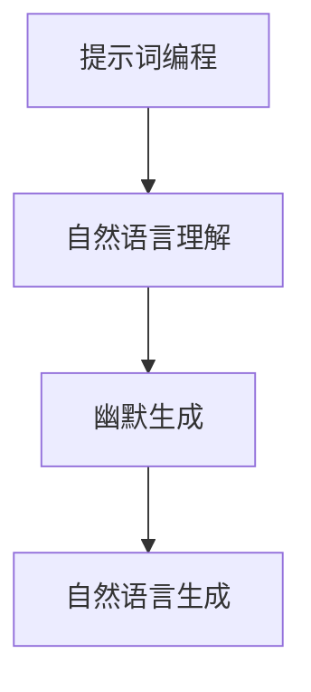

                 

### 第1章 引言

### 1.1 书籍背景与目的

《提示词编程在自然语言幽默生成中的应用》旨在探讨提示词编程在自然语言处理领域中的新型应用——自然语言幽默生成。本书结合了提示词编程、自然语言处理和幽默生成技术，旨在为读者提供一套系统的理论框架和实战指南。

提示词编程是一种通过预设关键词或短语来引导模型生成文本的方法，它克服了传统自然语言生成模型中缺乏灵活性和创造性的问题。自然语言幽默生成则是一个备受关注的研究领域，它涉及到人工智能如何创造出既有趣又具有情感共鸣的文本内容。

本书的核心概念与联系如下：

- **提示词编程：** 利用预设关键词来引导模型生成文本，提高生成文本的创造性和灵活性。
- **自然语言处理：** 对文本进行预处理、理解和生成，为幽默生成提供基础。
- **幽默生成技术：** 运用深度学习模型，将提示词转化为有趣、富有创意的幽默内容。

为了更好地理解这些核心概念，我们可以使用一个简单的Mermaid流程图来展示它们之间的联系：



在这个流程图中，提示词编程作为输入，通过自然语言理解，进一步驱动幽默生成，最终实现自然语言生成。这种多层次、多阶段的方法为自然语言幽默生成提供了坚实的理论基础和丰富的实践空间。

### 1.2 自然语言幽默生成的现状

自然语言幽默生成作为一个新兴领域，近年来取得了显著的进展。目前，这一领域的主要算法和技术可以分为以下几类：

#### 提示词编程

提示词编程通过预设关键词来引导模型生成文本，它具有以下核心算法原理：

1. **提示词权重计算：**
   $$ W = \frac{f(\text{input\_prompt}, \theta)}{1 + e^{-\theta}} $$
   其中，\( W \) 是提示词的权重，\( f \) 是激活函数，\( \theta \) 是模型参数。这个公式通过计算提示词的激活程度，为后续的文本生成提供了依据。

2. **幽默模型：**
   $$ \text{HumorModel} = \{ \text{initialize\_model}, \text{train\_model}, \text{generate\_humor} \} $$
   这个模型类包括初始化模型、训练模型和生成幽默三个主要方法。通过这些方法，模型可以不断优化，从而生成更加幽默的内容。

#### 基于GAN的幽默生成算法

生成对抗网络（GAN）是一种通过生成器和判别器相互竞争来生成高质量数据的算法。在幽默生成中，GAN的核心算法原理如下：

1. **生成器（Generator）：**
   $$ G(z) = \text{Generator}(z) $$
   生成器从随机噪声 \( z \) 中生成数据 \( x \)，目标是生成尽可能真实的数据。

2. **判别器（Discriminator）：**
   $$ D(x) = \text{Discriminator}(x) $$
   判别器的目标是区分真实数据和生成数据，通过不断更新判别器和生成器的参数，模型可以逐步提高生成数据的真实性。

#### 基于RNN的幽默生成算法

循环神经网络（RNN）通过记忆过去的信息来处理序列数据，它在幽默生成中的应用如下：

1. **RNN模型：**
   $$ h_t = \text{RNN}(h_{t-1}, x_t, \theta) $$
   其中，\( h_t \) 是当前时刻的隐藏状态，\( x_t \) 是输入数据，\( \theta \) 是模型参数。RNN通过更新隐藏状态，逐步生成文本。

2. **门控循环单元（GRU）：**
   $$ h_t = \text{GRU}(h_{t-1}, x_t, \theta) $$
   GRU是RNN的一种改进，通过门控机制来更好地处理长序列数据，提高生成文本的质量。

#### 基于Transformer的幽默生成算法

Transformer是一种基于自注意力机制的深度学习模型，它在自然语言处理领域取得了显著的成果。在幽默生成中，Transformer的核心算法原理如下：

1. **自注意力机制：**
   $$ \text{Attention}(Q, K, V) = \text{softmax}(\frac{QK^T}{\sqrt{d_k}})V $$
   自注意力机制通过计算查询 \( Q \)、键 \( K \) 和值 \( V \) 的相似度，为每个位置生成权重，从而实现多头注意力。

2. **Transformer模型：**
   $$ \text{Transformer}(x, \theta) = \text{Encoder}(x, \theta) $$
   Transformer通过编码器来处理输入序列，生成序列的上下文表示。

#### 深度学习优化算法

深度学习优化算法是提高模型性能的关键，以下是一些常见的优化算法：

1. **随机梯度下降（SGD）：**
   $$ \theta = \theta - \alpha \frac{\partial J(\theta)}{\partial \theta} $$
   SGD通过随机选择训练样本的子集来计算梯度，更新模型参数。

2. **Adam优化器：**
   $$ m_t = \beta_1 m_{t-1} + (1 - \beta_1) \frac{\partial J(\theta)}{\partial \theta} $$
   $$ v_t = \beta_2 v_{t-1} + (1 - \beta_2) (\frac{\partial J(\theta)}{\partial \theta})^2 $$
   $$ \theta = \theta - \alpha \frac{m_t}{\sqrt{v_t} + \epsilon} $$
   Adam优化器结合了SGD和动量方法，通过计算一阶和二阶矩估计来更新参数。

#### 项目实战

为了更好地理解这些算法，我们可以通过一个项目实战来展示如何使用GAN模型生成幽默文本。以下是一个简化的代码实现：

```python
import tensorflow as tf
from tensorflow.keras.layers import Input, Dense, Reshape
from tensorflow.keras.models import Model

# 生成器模型
z = Input(shape=(100,))
x = Dense(128, activation='relu')(z)
x = Dense(7 * 7 * 64, activation='relu')(x)
x = Reshape((7, 7, 64))(x)

generator = Model(z, x)
generator.compile(loss='binary_crossentropy', optimizer='adam')

# 判别器模型
x = Input(shape=(7, 7, 64))
D = Dense(1, activation='sigmoid')(x)

discriminator = Model(x, D)
discriminator.compile(loss='binary_crossentropy', optimizer='adam')

# 整体模型
z = Input(shape=(100,))
x = generator(z)
D.trainable = False
y = discriminator(x)

combined = Model(z, y)
combined.compile(loss='binary_crossentropy', optimizer='adam')

# 训练过程
for epoch in range(100):
    # 训练生成器和判别器
    # ...
    # 计算生成数据和判别器损失
    # ...

# 生成幽默文本
generated_text = generator.predict(random噪声)
```

通过这个项目，我们可以看到如何利用深度学习模型生成幽默文本，从而为自然语言幽默生成提供了实用的工具和方法。

### 1.3 本书结构安排与内容概览

为了帮助读者系统地掌握自然语言幽默生成技术，本书分为以下五个部分：

#### 第1部分：基础理论

本部分主要介绍提示词编程、自然语言处理和幽默生成技术的基础知识，包括提示词权重计算、生成对抗网络（GAN）、循环神经网络（RNN）和变换器（Transformer）等核心算法原理。

#### 第2部分：自然语言幽默生成算法

本部分深入探讨自然语言幽默生成算法的细节，包括基于GAN的幽默生成算法、基于RNN的幽默生成算法、基于Transformer的幽默生成算法以及深度学习优化算法。

#### 第3部分：提示词编程实战项目

本部分通过实际项目，展示如何使用提示词编程生成幽默文本。读者可以跟随项目步骤，了解开发环境搭建、代码实现和代码解读，从而掌握自然语言幽默生成的实战技巧。

#### 第4部分：自然语言幽默生成应用场景

本部分分析自然语言幽默生成在不同应用场景中的实例，包括社交媒体幽默生成、教育与娱乐幽默应用以及营销与广告幽默应用等。通过这些实例，读者可以了解自然语言幽默生成的实际应用价值。

#### 第5部分：自然语言幽默生成的挑战与未来

本部分讨论自然语言幽默生成的挑战和未来发展方向，包括模型优化、数据集构建、伦理问题和技术趋势等。通过分析这些挑战和趋势，读者可以更好地把握自然语言幽默生成的发展方向。

通过以上五个部分，本书为读者提供了一个全面、系统的自然语言幽默生成学习资源，帮助读者从理论到实践，深入理解这一新兴领域。

