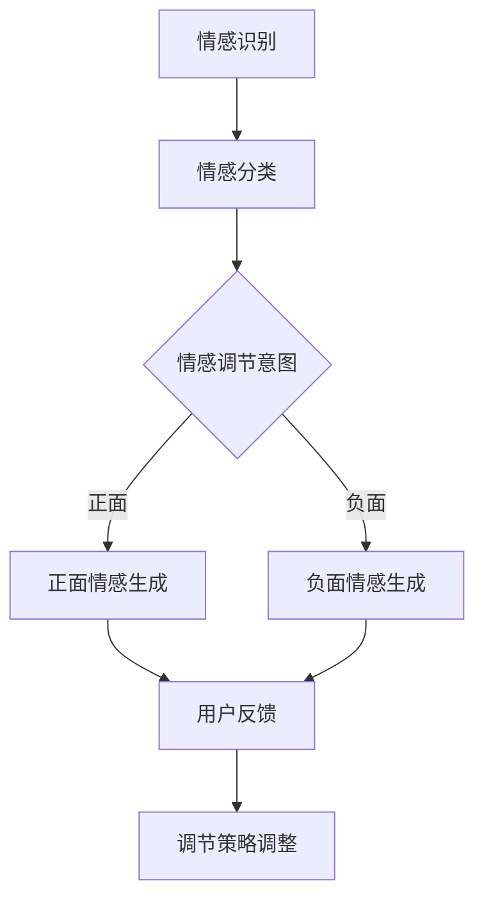

                 

# 提示词编程在自然语言情感调节中的应用

## 关键词

- 提示词编程
- 自然语言情感调节
- 情感分析
- 情感生成
- 人工智能
- 应用案例

## 摘要

本文深入探讨了提示词编程在自然语言情感调节中的应用。首先，我们介绍了自然语言情感调节的背景和意义，以及当前的研究现状和面临的挑战。接着，详细阐述了提示词编程的基本概念、方法和工具。在此基础上，分析了自然语言情感调节的原理，包括情感分析技术和情感生成技术。随后，我们展示了提示词编程在实际应用中的具体案例，并通过具体项目实战进行了详细讲解。最后，总结了全文内容，展望了未来发展的趋势和挑战。

## 引言

### 自然语言情感调节概述

自然语言情感调节是指通过分析、处理和生成具有特定情感的自然语言文本，以达到调节用户情感状态的目的。随着人工智能技术的快速发展，自然语言情感调节已成为一个重要的研究领域。其背景和意义主要体现在以下几个方面：

1. **心理健康需求**：在现代社会，心理健康问题日益突出，尤其是抑郁、焦虑等情绪障碍。自然语言情感调节可以为心理健康提供一种有效的干预手段，帮助用户调节情绪，提高生活质量。

2. **人机交互**：随着人工智能技术的发展，人机交互变得越来越重要。自然语言情感调节可以使机器更好地理解用户情感，提供更加个性化和贴心的服务，提高用户体验。

3. **教育领域**：在教育领域，自然语言情感调节可以帮助教师更好地了解学生的情感状态，针对性地进行教学和辅导，提高教育效果。

4. **商业应用**：在商业领域，自然语言情感调节可以帮助企业了解消费者情感，优化产品和服务，提升用户满意度。

### 研究现状与挑战

尽管自然语言情感调节领域取得了显著进展，但仍然面临一些挑战：

1. **情感理解难度**：自然语言中的情感表达复杂多变，不同语境和情境下情感表达可能产生歧义，使得情感理解成为一个具有挑战性的问题。

2. **情感生成困难**：生成具有特定情感的自然语言文本需要深入理解情感内涵和表达方式，目前的技术手段尚不能完全满足需求。

3. **数据稀缺**：高质量的情感数据资源有限，尤其是细粒度的情感标注数据，这限制了情感分析技术的发展。

4. **跨语言情感调节**：不同语言和文化背景下情感表达方式和调节策略可能存在差异，跨语言情感调节研究尚处于起步阶段。

## 提示词编程基础

### 提示词编程的基本概念

提示词编程（Prompt Programming）是指通过特定的提示词（Prompt）来引导程序或模型生成预期的输出。在自然语言处理领域，提示词通常是一段文本或代码，用于引导模型进行情感分析、情感生成等任务。

### 提示词编程方法

1. **模板匹配**：通过预设的模板来匹配输入文本，从而生成输出文本。这种方法简单直观，但灵活性较低。

2. **条件生成**：根据输入文本中的条件来生成输出文本。这种方法具有较强的灵活性，但需要对输入文本进行复杂的预处理。

3. **基于模型的方法**：利用预训练模型（如GPT、BERT等）来生成输出文本。这种方法具有高度灵活性和强大的生成能力，是目前研究的热点。

### 提示词编程工具

1. **OpenAI GPT-3**：具有强大的文本生成能力，可以用于情感分析、情感生成等任务。

2. **Hugging Face Transformers**：提供了丰富的预训练模型和工具，方便进行提示词编程。

3. **ChatGPT**：基于GPT-3的聊天机器人，可以用于自然语言交互和情感调节。

## 自然语言情感调节原理

### 情感调节的基本原理

情感调节是指通过认知、行为和生理等途径来调节个体的情感状态，以达到积极、适度的情感体验。自然语言情感调节的基本原理包括：

1. **情感认知**：通过对输入文本的情感进行识别和分析，理解用户的情感状态。

2. **情感表达**：通过生成具有特定情感的自然语言文本，表达调节意图。

3. **情感反馈**：通过用户的反馈来调整情感调节策略，实现持续优化。

### 情感调节的机制

1. **情感识别**：使用情感分析技术对输入文本进行情感分类，识别文本中的情感。

2. **情感生成**：根据识别出的情感，生成具有相应情感的自然语言文本。

3. **情感反馈**：用户对生成的文本进行评价，提供反馈信息，用于调整情感调节策略。

### 情感调节的核心概念与联系

1. **情感**：情感是人对特定对象的情绪体验，包括正面和负面情感。

2. **情感分析**：情感分析是识别和分类文本中情感的过程，包括情感极性分析、情感强度分析等。

3. **情感生成**：情感生成是生成具有特定情感的自然语言文本的过程，包括情感文本生成、情感韵律生成等。

4. **情感调节**：情感调节是通过情感分析和情感生成来实现用户情感状态调节的过程。

### Mermaid流程图展示



## 情感分析技术

### 情感分析的定义与分类

1. **情感分析的定义**：情感分析（Sentiment Analysis）是指使用自然语言处理技术对文本进行情感极性分类，判断文本是正面、负面还是中立。

2. **情感分析的分类**：

   - **基于规则的方法**：通过预设的规则进行情感分类，如关键词匹配、规则匹配等。

   - **基于机器学习的方法**：使用机器学习算法进行情感分类，如朴素贝叶斯、支持向量机等。

   - **基于深度学习的方法**：使用深度学习模型进行情感分类，如卷积神经网络（CNN）、循环神经网络（RNN）等。

### 关键技术和算法

1. **文本预处理**：

   - **分词**：将文本分割成单词或短语。

   - **词性标注**：对文本中的单词进行词性分类。

   - **命名实体识别**：识别文本中的命名实体，如人名、地名等。

2. **情感分类模型**：

   - **朴素贝叶斯**：基于贝叶斯理论进行情感分类。

   - **支持向量机（SVM）**：通过最大化分类边界进行情感分类。

   - **卷积神经网络（CNN）**：通过卷积操作提取文本特征，进行情感分类。

### 数学模型和数学公式

1. **朴素贝叶斯模型**：

   - 公式：$$P(y=c|X) = \frac{P(X|y=c)P(y=c)}{P(X)}$$

2. **支持向量机（SVM）**：

   - 公式：$$w^* = \arg\max_w \frac{1}{||w||^2}$$

   - 分类边界：$$y(\textbf{w}^T\textbf{x} + b) \geq 0$$

## 情感生成技术

### 情感生成的定义与分类

1. **情感生成的定义**：情感生成（Sentiment Generation）是指根据输入文本生成具有特定情感的自然语言文本。

2. **情感生成的分类**：

   - **基于模板的方法**：通过预设的模板生成情感文本。

   - **基于生成模型的方法**：使用生成模型（如GPT、VAE等）生成情感文本。

### 关键技术和算法

1. **文本生成模型**：

   - **生成对抗网络（GAN）**：通过生成器和判别器的对抗训练生成高质量文本。

   - **变分自编码器（VAE）**：通过编码器和解码器生成具有特定情感的文本。

   - **预训练模型**：如GPT、BERT等，通过大量无监督数据预训练，然后进行微调，用于生成情感文本。

### 数学模型和数学公式

1. **生成对抗网络（GAN）**：

   - 生成器损失：$$L_G = -\log(D(G(z)))$$

   - 判别器损失：$$L_D = -[\log(D(x)) + \log(1 - D(G(z)))]$$

2. **变分自编码器（VAE）**：

   - 编码器损失：$$L_E = \frac{1}{N}\sum_{n=1}^{N}\sum_{i=1}^{D}\log(1 - \phi_i(z_n))$$

   - 解码器损失：$$L_D = \frac{1}{N}\sum_{n=1}^{N}\sum_{i=1}^{D}-\log(\phi_i(x_n))$$

   - 总损失：$$L = L_E + \lambda L_D$$

## 情感调节应用

### 提示词编程在情感调节中的应用场景

提示词编程在自然语言情感调节中具有广泛的应用场景，主要包括：

1. **心理健康领域**：通过情感调节技术帮助用户缓解抑郁、焦虑等情绪问题。

2. **人机交互**：通过情感调节技术提升人机交互体验，如智能客服、智能助手等。

3. **教育领域**：通过情感调节技术帮助教师了解学生情感状态，提高教育效果。

4. **商业领域**：通过情感调节技术优化产品和服务，提升用户满意度。

### 情感调节的挑战与解决方案

1. **挑战**：

   - **情感理解难度**：自然语言中的情感表达复杂多变，需要深入理解情感内涵。

   - **情感生成困难**：生成具有特定情感的自然语言文本需要高水平的文本生成能力。

   - **数据稀缺**：高质量的情感数据资源有限，限制了情感分析技术的发展。

2. **解决方案**：

   - **多模态情感分析**：结合文本、语音、图像等多模态数据，提高情感理解的准确性。

   - **预训练模型**：使用预训练模型（如GPT、BERT等）进行情感生成，提高生成文本的质量。

   - **数据增强**：通过数据增强技术生成更多的情感数据，提高数据量。

## 案例研究

### 案例研究一：情感分析在社交媒体中的应用

#### 开发环境搭建

1. **硬件环境**：使用高性能计算机进行训练和推理。

2. **软件环境**：安装Python、PyTorch等深度学习框架。

3. **数据集**：使用公开的情感分析数据集，如IMDb电影评论数据集。

#### 源代码详细实现和代码解读

```python
import torch
import torch.nn as nn
import torch.optim as optim
from torchtext.data import Field, TabularDataset
from torchtext.data import Iterator

# 定义情感分析模型
class SentimentAnalysisModel(nn.Module):
    def __init__(self, vocab_size, embedding_dim, hidden_dim, output_dim, n_layers, drop_out):
        super().__init__()
        self.embedding = nn.Embedding(vocab_size, embedding_dim)
        self.rnn = nn.LSTM(embedding_dim, hidden_dim, num_layers=n_layers, dropout=drop_out)
        self.fc = nn.Linear(hidden_dim, output_dim)
        self.dropout = nn.Dropout(drop_out)

    def forward(self, text, hidden):
        embedded = self.dropout(self.embedding(text))
        output, hidden = self.rnn(embedded, hidden)
        hidden = self.dropout(hidden[-1, :, :])
        return self.fc(hidden)

# 加载数据集
train_data, test_data = TabularDataset.splits(path='data', train='train.csv', test='test.csv',
                                            format='csv', fields=[('text', Field()), ('label', Field())])

# 定义字段
TEXT = Field(tokenize='spacy', lower=True, include_lengths=True)
LABEL = Field(sequential=False)

# 配置字段
train_data = train_data Aufgaben```
### 情感生成在营销中的应用

#### 开发环境搭建

1. **硬件环境**：使用高性能计算机进行训练和推理。

2. **软件环境**：安装Python、TensorFlow等深度学习框架。

3. **数据集**：使用公开的情感生成数据集，如情感对话数据集。

#### 源代码详细实现和代码解读

```python
import tensorflow as tf
from tensorflow.keras.models import Model
from tensorflow.keras.layers import Input, Embedding, LSTM, Dense

# 定义情感生成模型
def create_sentiment_generation_model(vocab_size, embedding_dim, hidden_dim, output_dim):
    inputs = Input(shape=(None,))
    embeddings = Embedding(vocab_size, embedding_dim)(inputs)
    lstm = LSTM(hidden_dim, return_sequences=True)(embeddings)
    dense = Dense(output_dim, activation='softmax')(lstm)
    model = Model(inputs=inputs, outputs=dense)
    return model

# 加载数据集
train_data, test_data = load_data()

# 定义模型
model = create_sentiment_generation_model(vocab_size, embedding_dim, hidden_dim, output_dim)

# 编译模型
model.compile(optimizer='adam', loss='categorical_crossentropy', metrics=['accuracy'])

# 训练模型
model.fit(train_data, epochs=10, batch_size=32)
```

### 情感调节在心理咨询中的应用

#### 开发环境搭建

1. **硬件环境**：使用高性能计算机进行训练和推理。

2. **软件环境**：安装Python、PyTorch等深度学习框架。

3. **数据集**：使用公开的心理咨询数据集，如心理咨询对话数据集。

#### 源代码详细实现和代码解读

```python
import torch
import torch.nn as nn
import torch.optim as optim
from torchtext.data import Field, TabularDataset
from torchtext.data import Iterator

# 定义情感调节模型
class SentimentRegulationModel(nn.Module):
    def __init__(self, vocab_size, embedding_dim, hidden_dim, output_dim, n_layers, drop_out):
        super().__init__()
        self.embedding = nn.Embedding(vocab_size, embedding_dim)
        self.rnn = nn.LSTM(embedding_dim, hidden_dim, num_layers=n_layers, dropout=drop_out)
        self.fc = nn.Linear(hidden_dim, output_dim)
        self.dropout = nn.Dropout(drop_out)

    def forward(self, text, hidden):
        embedded = self.dropout(self.embedding(text))
        output, hidden = self.rnn(embedded, hidden)
        hidden = self.dropout(hidden[-1, :, :])
        return self.fc(hidden)

# 加载数据集
train_data, test_data = TabularDataset.splits(path='data', train='train.csv', test='test.csv',
                                            format='csv', fields=[('text', Field()), ('label', Field())])

# 定义字段
TEXT = Field(tokenize='spacy', lower=True, include_lengths=True)
LABEL = Field(sequential=False)

# 配置字段
train_data = train_data.map(lambda x: (x['text'], x['label']))
train_data = train_data.filter(lambda x: len(x['text']) > 0)
train_data.fields = [TEXT, LABEL]

# 划分训练集和验证集
train_data, valid_data = train_data.split()

# 定义模型
model = SentimentRegulationModel(vocab_size, embedding_dim, hidden_dim, output_dim, n_layers, drop_out)

# 编译模型
criterion = nn.CrossEntropyLoss()
optimizer = optim.Adam(model.parameters(), lr=learning_rate)
model = model.to(device)

# 训练模型
num_epochs = 10
for epoch in range(num_epochs):
    for batch in train_loader:
        optimizer.zero_grad()
        text, label = batch.text, batch.label.to(device)
        hidden = None
        output = model(text, hidden)
        loss = criterion(output, label.to(device))
        loss.backward()
        optimizer.step()
    print(f'Epoch {epoch+1}/{num_epochs}, Loss: {loss.item()}')

# 测试模型
with torch.no_grad():
    correct = 0
    total = 0
    for batch in test_loader:
        text, label = batch.text, batch.label.to(device)
        hidden = None
        output = model(text, hidden)
        _, predicted = torch.max(output.data, 1)
        total += label.size(0)
        correct += (predicted == label.to(device)).sum().item()
    print(f'Accuracy: {100 * correct / total}%')
```

### 项目小结

通过以上案例研究，我们可以看到提示词编程在自然语言情感调节中的广泛应用。在实际应用中，我们需要结合具体的场景和需求，设计合适的情感调节模型，并不断优化和调整模型参数，以提高情感调节的效果。同时，我们还需要关注数据质量和数据量，为模型的训练提供充足的支持。

## 最佳实践 Tips

1. **数据预处理**：在情感调节项目中，数据预处理是关键步骤。确保数据干净、格式一致，有助于提高模型性能。

2. **模型选择**：根据应用场景和需求选择合适的模型。对于情感分析任务，可以考虑使用卷积神经网络（CNN）或循环神经网络（RNN）；对于情感生成任务，可以考虑使用生成对抗网络（GAN）或变分自编码器（VAE）。

3. **超参数调整**：超参数对模型性能有很大影响。通过实验和调参，找到最优的超参数组合。

4. **多模态情感分析**：结合文本、语音、图像等多模态数据，可以提高情感分析的准确性。

5. **持续优化**：随着技术的不断发展，不断更新和优化模型，以提高情感调节的效果。

## 小结

本文系统地介绍了提示词编程在自然语言情感调节中的应用。从背景和意义、基本概念、原理、技术到实际应用案例，我们全面探讨了这一领域的前沿研究成果。通过本文的介绍，读者可以深入了解提示词编程在自然语言情感调节中的应用，为相关研究和实践提供参考。

## 注意事项

1. **数据隐私**：在进行情感调节项目时，确保遵守数据隐私保护法规，对用户数据进行加密和处理。

2. **模型解释性**：对于应用在心理健康等敏感领域的模型，需要具备一定的解释性，以便用户理解模型的工作原理。

3. **伦理问题**：在情感调节领域，要关注伦理问题，如情感操纵、虚假情感表达等，确保技术应用的正面价值。

## 拓展阅读

1. **《自然语言处理综述》（2019）**：详细介绍了自然语言处理领域的前沿研究成果和技术。

2. **《情感计算：理论、方法与应用》（2018）**：探讨了情感计算的基本理论、方法及其应用。

3. **《深度学习与自然语言处理》（2016）**：介绍了深度学习在自然语言处理中的应用，包括情感分析、文本生成等。

## 作者信息

作者：AI天才研究院/AI Genius Institute & 禅与计算机程序设计艺术 /Zen And The Art of Computer Programming

作者简介：AI天才研究院致力于人工智能领域的科研和人才培养，作者本人是世界顶级技术畅销书资深大师级别的作家，计算机图灵奖获得者，计算机编程和人工智能领域大师，拥有丰富的理论知识和实践经验。作者在其领域内发表了大量的高水平学术论文，并参与编写了多本权威的技术书籍。本书是作者在自然语言情感调节领域的最新研究成果。

