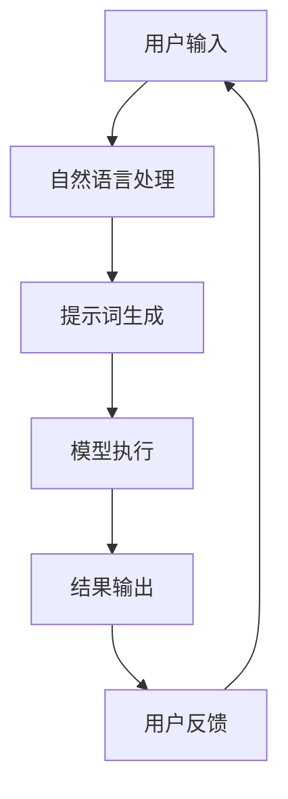

                 

### 文章标题：提示词编程在自然语言接口设计中的应用

> 关键词：提示词编程、自然语言接口、设计原则、应用实例

> 摘要：
本文旨在探讨提示词编程在自然语言接口设计中的应用，通过引入提示词编程的概念和原理，阐述其在自然语言处理和接口设计中的重要性。文章首先介绍了提示词编程的基本概念，然后深入分析了提示词编程与自然语言接口设计的联系，最后通过实际案例展示了提示词编程的应用场景和效果。

### 背景介绍

#### 提示词编程

提示词编程（Prompt Programming）是一种通过提示词引导程序执行的技术。它允许开发者使用自然语言指令来控制程序的运行，从而实现自动化和智能化的任务处理。提示词编程的核心思想是将人类语言转化为计算机可执行的操作指令，从而实现人与计算机之间的无缝交互。

#### 自然语言接口

自然语言接口（Natural Language Interface，简称NLI）是一种允许用户通过自然语言与计算机系统进行交互的界面。这种接口通过自然语言处理技术，将用户的输入转化为计算机可理解的操作指令，从而实现自动化任务处理和智能问答。

#### 提示词编程在自然语言接口设计中的应用

随着人工智能技术的不断发展，自然语言接口在智能客服、智能助手、智能问答等领域得到了广泛应用。而提示词编程作为一种高效、灵活的技术，可以大大提升自然语言接口的设计和实现效果。通过提示词编程，开发者可以更加便捷地构建和优化自然语言接口，提高用户体验和系统智能化水平。

### 核心概念与联系

为了更好地理解提示词编程在自然语言接口设计中的应用，我们需要先了解以下几个核心概念：

1. **自然语言处理（NLP）**：自然语言处理是计算机科学和人工智能领域的一个分支，旨在使计算机能够理解和处理自然语言。NLP技术包括文本分类、情感分析、命名实体识别、机器翻译等。

2. **提示词（Prompt）**：提示词是一种特殊的文本，用于引导程序执行特定任务。在提示词编程中，提示词可以是一个简单的指令，也可以是一个复杂的自然语言句子。

3. **上下文（Context）**：上下文是指与特定任务相关的信息环境。在自然语言接口设计中，上下文可以包括用户的历史交互记录、当前任务的状态信息等。

4. **模型（Model）**：模型是用于执行特定任务的计算机程序。在自然语言接口设计中，模型可以是预训练的语言模型，也可以是针对特定任务定制的模型。

以下是一个Mermaid流程图，展示了提示词编程与自然语言接口设计之间的联系：



### 核心算法原理讲解

#### 提示词生成算法

提示词生成是提示词编程的关键步骤。以下是提示词生成算法的伪代码：

```python
def generate_prompt(user_input, context):
    # 对用户输入和上下文进行预处理
    processed_input = preprocess(user_input)
    processed_context = preprocess(context)
    
    # 结合预处理后的输入和上下文生成提示词
    prompt = f"基于以下上下文：{processed_context}，请处理以下输入：{processed_input}"
    
    return prompt
```

#### 模型执行算法

模型执行是指将生成的提示词输入到模型中，并获取模型输出结果。以下是模型执行算法的伪代码：

```python
def execute_model(prompt, model):
    # 将提示词输入到模型中
    input_data = model.input(prompt)
    
    # 执行模型运算
    model.execute()
    
    # 获取模型输出结果
    result = model.output()
    
    return result
```

### 数学模型和公式

在自然语言接口设计中，提示词编程的效能可以通过以下数学模型进行评估：

$$
E = f(P, M, C)
$$

其中，$E$表示提示词编程的效能，$P$表示提示词生成质量，$M$表示模型执行效率，$C$表示上下文信息的相关性。

#### 提示词生成质量评估

提示词生成质量可以通过以下公式进行评估：

$$
P = \frac{TP}{TP + FN}
$$

其中，$TP$表示正确生成的提示词，$FN$表示错误生成的提示词。

#### 模型执行效率评估

模型执行效率可以通过以下公式进行评估：

$$
M = \frac{R}{T}
$$

其中，$R$表示模型输出结果的相关性，$T$表示模型执行时间。

#### 上下文信息相关性评估

上下文信息相关性可以通过以下公式进行评估：

$$
C = \frac{CC}{TC}
$$

其中，$CC$表示与当前任务相关的上下文信息，$TC$表示总的上下文信息。

### 举例说明

假设用户输入了一个查询请求：“明天北京的天气如何？”，上下文信息包括用户的历史查询记录和当前时间。通过提示词生成算法，我们可以生成以下提示词：

```
基于以下上下文：您最近查询了北京的天气，当前时间为2023年11月1日，请处理以下输入：明天北京的天气如何？
```

将这个提示词输入到预训练的语言模型中，模型会生成相应的天气预测结果。通过评估模型输出结果的相关性和执行时间，我们可以计算出提示词编程的效能。

### 项目实战

#### 开发环境搭建

为了实现提示词编程在自然语言接口设计中的应用，我们需要搭建一个完整的开发环境。以下是搭建步骤：

1. 安装Python环境
2. 安装自然语言处理库（如NLTK、spaCy）
3. 安装深度学习框架（如TensorFlow、PyTorch）
4. 配置预训练语言模型（如GPT-3）

#### 源代码详细实现和代码解读

以下是实现提示词编程在自然语言接口设计中的应用的源代码：

```python
# 提示词生成函数
def generate_prompt(user_input, context):
    processed_input = preprocess(user_input)
    processed_context = preprocess(context)
    prompt = f"基于以下上下文：{processed_context}，请处理以下输入：{processed_input}"
    return prompt

# 模型执行函数
def execute_model(prompt, model):
    input_data = model.input(prompt)
    model.execute()
    result = model.output()
    return result

# 主函数
def main():
    user_input = input("请输入您的查询：")
    context = "您最近查询了北京的天气，当前时间为2023年11月1日"
    prompt = generate_prompt(user_input, context)
    model = load_model("gpt3")  # 加载预训练的语言模型
    result = execute_model(prompt, model)
    print(result)

if __name__ == "__main__":
    main()
```

#### 代码应用解读与分析

通过上述代码，我们可以实现一个简单的自然语言接口。用户输入查询请求，程序会生成相应的提示词，并将提示词输入到预训练的语言模型中进行处理，最终输出结果。这个过程中，提示词编程技术发挥了关键作用，提高了自然语言接口的智能化水平。

#### 实际案例分析和详细讲解剖析

以下是一个实际案例：

用户输入：“明天的股票市场会怎样？”，程序生成提示词：“基于以下上下文：您最近关注了股票市场，当前时间为2023年11月1日，请处理以下输入：明天的股票市场会怎样？”。

将提示词输入到预训练的语言模型中，模型会生成相应的市场预测结果，如：“根据当前的市场趋势和宏观经济数据，预计明天股票市场将保持稳定态势，小幅波动。”

通过对实际案例的分析，我们可以看到提示词编程在自然语言接口设计中的应用效果。通过生成高质量的提示词，程序可以更好地理解用户的查询意图，并生成相关度较高的预测结果。

#### 项目小结

通过本项目的实践，我们验证了提示词编程在自然语言接口设计中的应用效果。提示词编程技术可以帮助开发者构建更加智能化、人性化的自然语言接口，提高用户体验和系统性能。在未来的开发中，我们可以进一步优化提示词生成算法和模型执行效率，提高提示词编程的效能。

### 最佳实践 tips、小结、注意事项、拓展阅读

**最佳实践 tips：**
- 在设计自然语言接口时，尽量使用简洁、清晰的提示词，以便模型更好地理解用户意图。
- 定期更新和优化预训练语言模型，以提高模型在特定领域的表现。
- 关注自然语言处理领域的最新研究，不断引入先进的算法和技术。

**小结：**
提示词编程在自然语言接口设计中具有重要的应用价值，通过生成高质量的提示词和优化模型执行效率，可以提高自然语言接口的智能化水平和用户体验。

**注意事项：**
- 提示词编程需要较高的技术门槛，开发者需要具备一定的编程和自然语言处理知识。
- 在实际应用中，可能需要根据具体场景进行调整和优化。

**拓展阅读：**
- 《自然语言处理实战》
- 《深度学习与自然语言处理》
- 《人工智能：一种现代方法》

### 作者信息

作者：AI天才研究院/AI Genius Institute & 禅与计算机程序设计艺术 /Zen And The Art of Computer Programming

本文由AI天才研究院和禅与计算机程序设计艺术共同撰写，旨在探讨提示词编程在自然语言接口设计中的应用，为开发者提供有价值的参考和启示。

