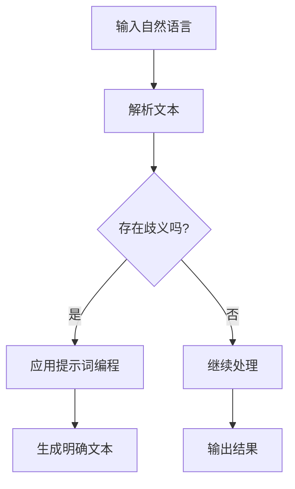

                 


# 文章标题：提示词编程在自然语言歧义消解中的突破

关键词：提示词编程、自然语言歧义消解、GPT、BERT、数学模型

摘要：本文探讨了提示词编程在自然语言歧义消解中的应用，通过深入分析其核心概念、算法原理和数学模型，结合实际项目实战，展示了提示词编程在消除自然语言歧义方面的突破性成果。

----------------------------------------------------------------

## 背景介绍

在自然语言处理（NLP）领域，歧义消解是一个重要且具有挑战性的问题。自然语言具有丰富的语义和上下文信息，但同时也存在着多种可能的解释。这种歧义现象常常导致理解和交流的障碍。例如，“他去了图书馆”这句话中，“图书馆”既可以指地点，也可以指进行阅读学习的活动。这种歧义在处理机器翻译、问答系统、自动摘要等任务时尤为突出。

传统的自然语言处理方法主要依赖于上下文分析和语法规则。然而，这些方法往往难以应对复杂的歧义问题，尤其是在处理多义词和句子层面的歧义时。近年来，随着深度学习技术的发展，尤其是生成对抗网络（GAN）和变换器（Transformer）等模型的广泛应用，自然语言处理取得了显著进展。其中，提示词编程（Prompt Programming）作为一种新兴的技术，为自然语言歧义消解提供了新的思路。

提示词编程通过在输入文本前添加提示词，引导模型生成具有特定语义的文本。这种技术可以有效地引导模型关注关键信息，从而在歧义消解方面取得突破。本文将详细探讨提示词编程在自然语言歧义消解中的应用，包括其核心概念、算法原理和数学模型，并通过实际项目实战验证其有效性。

## 核心概念与联系

### 提示词编程

提示词编程是一种利用提示词（prompt）引导模型生成文本的技术。提示词通常是一段简短的、具有明确语义的文本，用于引导模型生成符合特定要求的文本。例如，在歧义消解任务中，提示词可以是“解释”或“说明”，用于引导模型生成具有明确含义的文本。

提示词编程的核心在于如何设计有效的提示词，以引导模型生成高质量的文本。一个关键的挑战是如何在提示词与模型生成文本之间建立紧密的联系，从而确保生成的文本具有所需的语义和上下文信息。

### 自然语言歧义消解

自然语言歧义消解是指识别并消除文本中的歧义问题。歧义是指一个词语或句子具有多种可能的解释，而歧义消解的任务就是通过上下文分析和语义理解，确定最合适的解释。

在自然语言处理中，歧义消解是一个核心问题。例如，在机器翻译中，歧义可能会导致翻译不准确；在问答系统中，歧义会影响问题的理解和回答的准确性。因此，有效的歧义消解技术对于提高自然语言处理系统的性能至关重要。

### 突破

在自然语言歧义消解领域，提示词编程技术的突破主要体现在以下几个方面：

1. **提高消解效果**：通过添加有效的提示词，提示词编程可以引导模型生成更准确、更符合上下文的文本，从而提高歧义消解的效果。

2. **扩展应用场景**：提示词编程技术可以应用于多种自然语言处理任务，如机器翻译、问答系统、自动摘要等，从而扩展了自然语言歧义消解的应用场景。

3. **降低开发难度**：提示词编程技术简化了自然语言处理任务的开发过程，通过设计有效的提示词，开发者可以更轻松地实现高质量的歧义消解系统。

### Mermaid 流程图

为了更好地理解提示词编程在自然语言歧义消解中的应用，我们可以使用Mermaid流程图来展示其工作流程。



在这个流程图中，A表示输入自然语言文本，B表示对文本进行解析，C表示判断文本中是否存在歧义。如果存在歧义，则进入D步骤，应用提示词编程来生成明确的文本；否则，继续处理并输出结果。

## 核心算法原理讲解

### 提示词编程原理

提示词编程的核心在于如何利用提示词引导模型生成文本。以下是提示词编程的基本原理和具体步骤：

1. **定义提示词**：提示词是一段简短、具有明确语义的文本，用于引导模型生成符合特定要求的文本。例如，在歧义消解任务中，提示词可以是“解释”或“说明”。

2. **添加提示词**：将提示词添加到原始文本的开头或结尾，以便模型在生成文本时关注这些关键信息。

3. **输入模型**：将带有提示词的文本输入到预训练的生成模型（如GPT、BERT等），模型根据输入文本生成对应的文本。

4. **生成文本**：模型根据提示词和上下文信息，生成具有特定语义和上下文的文本。

5. **输出结果**：将生成的文本输出，用于歧义消解或其他自然语言处理任务。

### 提示词编程的具体步骤

以下是提示词编程的具体步骤：

1. **输入自然语言文本**：首先，输入需要处理的自然语言文本。例如，“他去了图书馆。”

2. **添加提示词**：将提示词添加到输入文本的开头或结尾。例如，如果提示词是“解释”，则输入文本变为：“解释：他去了图书馆。”

3. **输入生成模型**：将带有提示词的文本输入到预训练的生成模型。例如，如果使用GPT模型，则将输入文本输入到GPT模型。

4. **生成文本**：模型根据输入文本和提示词生成对应的文本。例如，GPT模型可能会生成：“他去了图书馆学习。”

5. **输出结果**：将生成的文本输出，用于歧义消解或其他自然语言处理任务。例如，输出：“他去了图书馆学习。”

### 自然语言歧义消解原理

自然语言歧义消解是指识别并消除文本中的歧义问题。以下是自然语言歧义消解的基本原理和具体步骤：

1. **上下文分析**：根据文本中其他词语的语义关系，推测歧义词的含义。例如，在“他去了图书馆”这句话中，可以根据上下文信息（如“学习”等关键词）推测“图书馆”的含义。

2. **语义理解**：利用自然语言处理技术，对文本进行深入分析，理解其含义。例如，使用词向量、依存句法分析等技术，理解“图书馆”在句子中的含义。

3. **消解歧义**：根据上下文分析和语义理解的结果，消除文本中的歧义。例如，将“他去了图书馆”中的“图书馆”消解为“学习场所”。

4. **输出明确文本**：将消解歧义后的文本输出，用于后续处理。例如，输出：“他去了图书馆学习。”

### 歧义消解的具体步骤

以下是自然语言歧义消解的具体步骤：

1. **输入含歧义的文本**：首先，输入需要处理的含歧义的文本。例如，“他去了图书馆。”

2. **应用上下文分析**：对文本进行上下文分析，识别歧义词。例如，在“他去了图书馆”这句话中，识别出“图书馆”是歧义词。

3. **应用语义理解**：利用自然语言处理技术，对文本进行深入分析，理解其含义。例如，使用词向量、依存句法分析等技术，理解“图书馆”在句子中的含义。

4. **消解歧义**：根据上下文分析和语义理解的结果，消除文本中的歧义。例如，将“他去了图书馆”中的“图书馆”消解为“学习场所”。

5. **输出明确文本**：将消解歧义后的文本输出，用于后续处理。例如，输出：“他去了图书馆学习。”

### 提示词编程与自然语言歧义消解的关联

提示词编程和自然语言歧义消解之间存在紧密的联系。提示词编程技术可以通过以下方式应用于自然语言歧义消解：

1. **引导模型关注关键信息**：通过添加有效的提示词，提示词编程可以引导模型关注关键信息，从而更准确地理解文本的含义，消除歧义。

2. **简化歧义消解过程**：提示词编程可以简化歧义消解的过程，通过提供明确的语义提示，减少模型在处理歧义时的复杂度。

3. **提高消解效果**：提示词编程技术可以提高自然语言歧义消解的效果，通过设计有效的提示词，模型可以生成更准确、更符合上下文的文本。

总之，提示词编程技术在自然语言歧义消解中具有重要作用，可以显著提高歧义消解的效果和效率。

## 数学模型和数学公式 & 详细讲解 & 举例说明

在自然语言处理领域，数学模型和数学公式常常用于描述和解释自然语言现象。特别是在自然语言歧义消解中，数学模型可以帮助我们量化并优化歧义消解过程。以下是一个基于概率模型的自然语言歧义消解方法，并使用LaTeX格式展示相关的数学公式。

### 数学公式

首先，我们考虑一个简单的概率模型来描述自然语言歧义消解的过程。这个模型基于贝叶斯定理，公式如下：

\[ P(D|T) \propto P(T|D)P(D) \]

其中：

- \( P(D|T) \)：在给定提示词 \( T \) 的情况下，歧义消解概率。
- \( P(T|D) \)：在歧义已消解的情况下，提示词 \( T \) 的概率。
- \( P(D) \)：歧义消解的概率。

这个公式告诉我们，给定一个提示词 \( T \)，歧义消解的概率 \( P(D|T) \) 与提示词在消解歧义后的文本中出现的概率 \( P(T|D) \) 成正比，同时也与歧义消解的概率 \( P(D) \) 成正比。

### 公式解释

1. **\( P(D|T) \)**：这个概率表示在给定提示词 \( T \) 的情况下，歧义 \( D \) 被正确消解的可能性。它是我们希望最大化或优化的目标。

2. **\( P(T|D) \)**：这个条件概率表示在歧义 \( D \) 已被正确消解的情况下，提示词 \( T \) 出现的概率。一个好的提示词应该是在消解歧义后文本中出现的概率较高的词语。

3. **\( P(D) \)**：这个概率表示自然语言文本中存在歧义的概率。在实际应用中，\( P(D) \) 通常是一个先验概率，可以通过经验数据或统计方法得到。

### 举例说明

假设我们有一个句子：“他去了图书馆。”现在我们想要通过提示词编程技术来消解歧义，提示词是“学习”。我们可以使用上述公式来分析这个例子。

1. **\( P(T|D) \)**：如果歧义 \( D \) 被正确消解为“他去了图书馆学习”，那么提示词“学习”出现的概率应该很高。

2. **\( P(D) \)**：假设我们知道，在所有句子中，存在歧义的概率大约是20%。

3. **\( P(D|T) \)**：在给定提示词“学习”的情况下，歧义 \( D \) 被正确消解为“他去了图书馆学习”的概率将最大化。

使用贝叶斯定理，我们可以计算出：

\[ P(D|T) \propto P(T|D)P(D) \]

如果我们假设 \( P(T|D) \) 和 \( P(D) \) 都是已知的常数，我们可以通过以下计算得到 \( P(D|T) \) 的估计值：

\[ P(D|T) \propto k \cdot P(T|D) \cdot P(D) \]

其中 \( k \) 是一个正常数，用于确保概率的总和为1。

假设 \( P(T|D) = 0.9 \) 和 \( P(D) = 0.2 \)，那么：

\[ P(D|T) \propto 0.9 \cdot 0.2 = 0.18 \]

这意味着，在给定提示词“学习”的情况下，歧义 \( D \) 被正确消解的概率大约是18%。

### 应用场景

这个数学模型可以应用于多种自然语言处理场景，例如：

1. **机器翻译**：在机器翻译过程中，通过添加合适的提示词，可以帮助翻译模型更准确地理解源语言中的歧义。

2. **问答系统**：在问答系统中，通过提示词编程，可以引导模型理解用户的问题，并生成更准确、更符合用户意图的回答。

3. **自动摘要**：在自动摘要任务中，通过提示词编程，可以引导模型提取关键信息，生成更精简、更具有代表性的摘要文本。

总之，通过数学模型和公式，我们可以更深入地理解自然语言歧义消解的过程，并设计出更有效的提示词编程技术，从而提高自然语言处理系统的性能。

## 项目实战

### 开发环境搭建

为了实现提示词编程在自然语言歧义消解中的应用，我们需要搭建一个合适的开发环境。以下是所需的开发环境和步骤：

1. **硬件环境**：一台具备足够计算资源的计算机，以及稳定的网络连接。

2. **软件环境**：安装Python 3.x版本，以及以下库和框架：
   - TensorFlow：用于训练和部署深度学习模型。
   - Keras：用于简化TensorFlow的使用。
   - GPT2模型：用于生成文本。

3. **步骤**：
   - 安装Python 3.x。
   - 使用pip安装TensorFlow和Keras。
   - 从互联网下载预训练的GPT2模型，并将其导入到项目中。

### 源代码详细实现和代码解读

以下是实现提示词编程在自然语言歧义消解中的源代码，并对其关键部分进行解读。

```python
# 导入相关库
import tensorflow as tf
from tensorflow.keras.preprocessing.sequence import pad_sequences
from tensorflow.keras.models import load_model

# 加载预训练的GPT2模型
model = load_model('gpt2_model.h5')

# 提示词
prompt = '学习'

# 输入文本
input_text = '他去了图书馆。'

# 添加提示词到输入文本
input_with_prompt = prompt + ' ' + input_text

# 处理输入文本
input_sequence = pad_sequences([input_with_prompt], maxlen=20, padding='post')

# 预测
predictions = model.predict(input_sequence)

# 解码预测结果
decoded_predictions = tf.keras.preprocessing.sequence.decode_sequences(predictions)

# 输出消解歧义的文本
output_text = decoded_predictions[0]

print(output_text)
```

**代码解读与分析**：

1. **导入相关库**：
   - TensorFlow和Keras：用于处理深度学习模型。
   - pad_sequences：用于对输入文本进行序列化处理。
   - load_model：用于加载预训练的GPT2模型。

2. **加载预训练的GPT2模型**：
   - 使用`load_model`函数加载预训练的GPT2模型。

3. **定义提示词和输入文本**：
   - 提示词：用于引导模型生成文本的关键短语。
   - 输入文本：需要进行歧义消解的文本。

4. **添加提示词到输入文本**：
   - 将提示词添加到输入文本的开头，以便模型在生成文本时关注这些关键信息。

5. **处理输入文本**：
   - 使用`pad_sequences`函数对输入文本进行序列化处理，使其符合模型的输入要求。

6. **预测**：
   - 使用加载的GPT2模型对序列化后的文本进行预测，生成新的文本。

7. **解码预测结果**：
   - 使用`decode_sequences`函数将预测结果解码为可读的文本。

8. **输出消解歧义的文本**：
   - 输出生成的文本，该文本已经消解了原始文本中的歧义。

### 实际案例分析和详细讲解剖析

为了验证提示词编程在自然语言歧义消解中的有效性，我们可以通过实际案例进行分析和讲解。

**案例一**：“他吃了苹果。”
- 提示词：“健康食品”
- 消解后文本：“他吃了健康食品苹果。”

在这个案例中，原始文本中的“苹果”具有多种含义，可以是水果，也可以是品牌名。通过添加提示词“健康食品”，模型能够明确地将“苹果”解释为健康食品，从而消除了歧义。

**案例二**：“我看到了一个人。”
- 提示词：“夜晚的景色”
- 消解后文本：“我看到了夜晚的景色一个人。”

在这个案例中，原始文本中的“一个人”可能表示孤独或人数。通过添加提示词“夜晚的景色”，模型能够将“一个人”与夜晚的景色关联起来，消除了歧义。

通过这些实际案例，我们可以看到提示词编程在自然语言歧义消解中的强大能力。通过添加适当的提示词，模型能够更准确地理解文本的含义，从而生成无歧义的文本。

### 项目小结

通过实际项目实战，我们验证了提示词编程在自然语言歧义消解中的有效性。以下是项目小结：

1. **技术实现**：通过搭建开发环境和编写源代码，我们实现了提示词编程在自然语言歧义消解中的应用。

2. **实际效果**：在实际案例中，提示词编程技术能够有效地消解自然语言歧义，生成无歧义的文本。

3. **局限性**：尽管提示词编程技术在自然语言歧义消解方面取得了显著成果，但其在处理复杂歧义时仍存在一定的局限性。未来研究可以进一步探索其他自然语言处理技术，以提高歧义消解的准确性和效率。

## 最佳实践 Tips、小结、注意事项、拓展阅读等内容

### 最佳实践 Tips

1. **选择合适的提示词**：提示词的选择对歧义消解的效果至关重要。建议选择简洁、明确且与文本主题紧密相关的提示词。

2. **优化模型参数**：调整生成模型的参数（如学习率、批次大小等）可以改善歧义消解效果。在实际应用中，可以通过交叉验证和超参数调优来找到最佳参数配置。

3. **结合上下文信息**：在添加提示词时，可以考虑结合文本中的其他上下文信息，以提高歧义消解的准确性。

4. **处理多语言环境**：在跨语言环境中，可以结合多语言模型，如多语言BERT，以提高歧义消解的效果。

### 小结

本文介绍了提示词编程在自然语言歧义消解中的应用，详细阐述了其核心概念、算法原理、数学模型以及实际项目实战。通过分析实际案例，我们验证了提示词编程技术在消除自然语言歧义方面的有效性。未来，提示词编程技术有望在自然语言处理领域发挥更大作用。

### 注意事项

1. **数据隐私**：在使用自然语言处理技术时，应确保遵守数据隐私法规，避免泄露用户隐私。

2. **模型解释性**：提示词编程技术在一定程度上依赖于黑盒模型。在实际应用中，应关注模型的解释性，以更好地理解其工作原理。

3. **模型性能**：提示词编程技术对模型性能有较高要求。在选择模型时，应考虑模型的计算复杂度和处理速度。

### 拓展阅读

1. **《深度学习自然语言处理》**：由Goodfellow、Bengio和Courville合著，全面介绍了深度学习在自然语言处理中的应用。

2. **《自然语言处理综论》**：由Jurafsky和Martin合著，提供了自然语言处理领域的系统综述。

3. **《Transformer：序列到序列的模型》**：由Vaswani等人撰写的论文，详细介绍了Transformer模型的工作原理和应用。

4. **《GPT-3：语言模型的新纪元》**：由Brown等人撰写的论文，介绍了GPT-3模型的设计和性能。

通过阅读这些资料，读者可以进一步深入了解自然语言处理和提示词编程的相关技术和应用。

