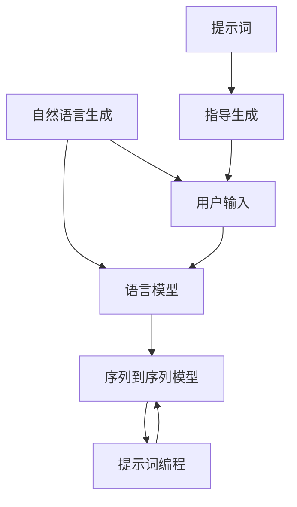

                 

### 背景介绍

随着人工智能技术的飞速发展，自然语言生成（Natural Language Generation, NLG）已成为人工智能领域的一个重要分支。NLG技术旨在利用计算机自动生成人类语言，广泛应用于聊天机器人、内容创作、自动报告生成、教育等领域。在NLG的发展历程中，提示词编程（Prompt-Based Programming）逐渐成为一种重要的技术手段，为自然语言生成带来了新的突破。

提示词编程是一种通过提示词来指导程序生成文本的方法。与传统的编程模式不同，提示词编程更注重人机交互，通过提示词来引导程序的生成过程。这种方法不仅能够提高程序生成的灵活性和准确性，还能够降低对编程技术的依赖，使得非专业人士也能参与到文本生成的过程中。因此，提示词编程在自然语言生成中的应用具有重要意义。

自然语言生成技术经历了多个发展阶段。早期的规则驱动方法依赖于手工编写的规则，虽然能够生成简单的文本，但在复杂性和灵活性方面存在明显局限。随后，统计方法的出现使得NLG技术取得了显著进展，通过大量文本数据训练语言模型，生成文本的多样性和准确性得到了大幅提升。然而，统计方法仍然存在对训练数据依赖性强、生成结果缺乏创造力等问题。

近年来，随着深度学习的崛起，基于神经网络的自然语言生成方法取得了突破性进展。这些方法通过学习大量的文本数据，能够自动捕捉语言的复杂性和规律，生成更加自然、准确的文本。然而，深度学习方法也存在训练成本高、模型可解释性差等问题。

提示词编程作为一种新兴技术，结合了规则驱动方法和深度学习方法的优点，通过提示词来指导生成过程，不仅能够提高生成文本的灵活性和准确性，还能够降低对训练数据的依赖，提高模型的泛化能力。因此，提示词编程在自然语言生成中的应用具有巨大的潜力。

### 核心概念与联系

在探讨提示词编程在自然语言生成中的突破之前，我们首先需要了解几个核心概念，并揭示它们之间的联系。

#### 1. 自然语言生成（NLG）

自然语言生成是指通过计算机程序自动生成人类可读的文本。这个过程通常涉及语言模型、文本生成算法和用户输入。语言模型负责理解和生成文本，而文本生成算法则根据用户输入和语言模型来生成相应的文本。

#### 2. 提示词（Prompt）

提示词是自然语言生成中的一个重要概念。它是一种引导语言模型生成特定文本的输入。提示词可以是一个单词、短语或完整的句子，其作用是提供上下文信息，指导模型生成与提示词相关的文本。

#### 3. 语言模型（Language Model）

语言模型是自然语言生成技术的核心组成部分。它是一种概率模型，用于预测文本序列中的下一个单词或字符。语言模型通过学习大量的文本数据，能够捕捉到语言的统计规律和结构。

#### 4. 序列到序列模型（Seq2Seq Model）

序列到序列模型是一种经典的神经网络模型，常用于翻译、机器阅读理解等领域。它能够将一个序列映射到另一个序列。在自然语言生成中，输入序列可以是提示词，输出序列则是生成的文本。

#### 5. 提示词编程（Prompt-Based Programming）

提示词编程是一种通过提示词来指导程序生成文本的方法。它结合了规则驱动方法和深度学习方法的优点，通过提供具体的提示词，引导语言模型生成符合要求的文本。

#### 关系架构 Mermaid 流程图

为了更好地理解这些概念之间的关系，我们可以使用Mermaid流程图来表示。



在这个流程图中，自然语言生成作为总体目标，通过用户输入和提示词来驱动语言模型和序列到序列模型，进而实现文本的生成。提示词在这个过程中起到关键作用，它不仅为语言模型提供了上下文信息，还指导了生成过程，使得生成的文本更加符合用户需求。

通过理解这些核心概念及其相互关系，我们为后续的详细讨论和分析奠定了基础。接下来，我们将深入探讨提示词编程的核心算法原理，并详细讲解其工作流程和数学模型。

### 核心算法原理讲解

提示词编程的核心算法主要包括语言模型、序列到序列模型以及提示词的生成与处理。下面，我们将通过伪代码来详细阐述这些算法的工作流程，并解释它们如何协同工作以实现自然语言生成。

#### 1. 语言模型

语言模型是自然语言生成的基础，它用于预测文本序列中的下一个单词或字符。一个简单的语言模型可以使用以下伪代码表示：

```python
# 伪代码：基于n-gram语言模型
def language_model(text, n):
    # 计算前n个单词的联合概率
    probabilities = []
    for i in range(n, len(text)):
        context = text[i-n:i]
        word = text[i]
        probability = calculate_probability(context, word)
        probabilities.append(probability)
    return probabilities

def calculate_probability(context, word):
    # 计算给定上下文下单词的概率
    count = count_occurrences(context + " " + word)
    total = count_occurrences(context)
    return count / total if total > 0 else 1/n
```

在这个伪代码中，`language_model` 函数接收一个文本序列和窗口大小n，返回每个单词的概率列表。`calculate_probability` 函数则计算给定上下文下单词的概率。

#### 2. 序列到序列模型

序列到序列模型（Seq2Seq Model）是一种经典的神经网络模型，常用于将一个序列映射到另一个序列。在自然语言生成中，输入序列可以是提示词，输出序列则是生成的文本。以下是序列到序列模型的简化伪代码：

```python
# 伪代码：基于神经序列到序列模型
def seq2seq_model(input_sequence, output_sequence):
    # 编码器和解码器神经网络
    encoder = Encoder()
    decoder = Decoder()

    # 编码器输入
    encoded_sequence = encoder(input_sequence)

    # 初始化解码器输入
    decoder_input = start_token

    # 生成输出序列
    output_sequence = []
    for _ in range(len(output_sequence)):
        # 解码器输入当前输出序列的一部分
        decoder_output = decoder(decoder_input, encoded_sequence)

        # 选取概率最高的单词作为下一个输出
        next_word = decode_output_to_word(decoder_output)

        # 更新解码器输入
        decoder_input = next_word

        # 添加输出单词到序列
        output_sequence.append(next_word)

    return output_sequence

def decode_output_to_word(output):
    # 解码输出到单词
    word_index = argmax(output)
    return vocabulary[word_index]
```

在这个伪代码中，`seq2seq_model` 函数接收输入序列和输出序列，通过编码器和解码器神经网络生成输出序列。`decode_output_to_word` 函数用于将输出概率分布解码为单词。

#### 3. 提示词的生成与处理

提示词是指导生成过程的重要输入。在提示词编程中，提示词的生成和处理是一个关键步骤。以下是一个简单的提示词生成和处理流程的伪代码：

```python
# 伪代码：提示词生成与处理
def generate_prompt(user_input):
    # 根据用户输入生成提示词
    context = extract_context(user_input)
    prompt = preprocess_context(context)
    return prompt

def extract_context(user_input):
    # 提取上下文信息
    return user_input

def preprocess_context(context):
    # 预处理上下文信息
    cleaned_context = clean_text(context)
    tokenized_context = tokenize(cleaned_context)
    return tokenized_context

def clean_text(text):
    # 清洗文本
    return text.lower().strip()

def tokenize(text):
    # 分词
    return text.split()
```

在这个伪代码中，`generate_prompt` 函数用于生成提示词。它首先提取上下文信息，然后对上下文进行预处理，包括清洗和分词。预处理后的提示词将被用于指导生成过程。

#### 4. 整体流程

结合以上三个部分，我们可以得出一个完整的提示词编程流程，如下：

```python
# 伪代码：提示词编程流程
def natural_language_generation(user_input):
    prompt = generate_prompt(user_input)
    probabilities = language_model(prompt)
    output_sequence = seq2seq_model(prompt, probabilities)
    generated_text = ''.join(output_sequence)
    return generated_text
```

在这个流程中，用户输入经过提示词生成与处理后，被输入到语言模型中计算概率分布。然后，序列到序列模型根据概率分布生成输出序列，最终生成自然语言文本。

通过上述伪代码的讲解，我们清晰地展示了提示词编程的核心算法原理。在接下来的部分，我们将进一步探讨提示词编程的数学模型，并使用具体的数学公式来描述其工作机制。

### 数学模型和数学公式讲解

提示词编程在自然语言生成中的核心工作原理依赖于概率模型和序列生成模型。为了深入理解这些模型，我们需要借助数学公式来描述它们的基本概念和计算过程。

#### 1. 语言模型

语言模型的核心目标是预测下一个单词的概率。这种概率预测通常通过条件概率来实现，即给定前一个单词序列，预测下一个单词的概率。在n-gram语言模型中，条件概率可以用以下数学公式表示：

$$
P(w_t | w_{t-1}, w_{t-2}, ..., w_{t-n}) = \frac{N(w_{t-1}, w_{t-2}, ..., w_{t-n}, w_t)}{N(w_{t-1}, w_{t-2}, ..., w_{t-n})}
$$

其中，\( N(*) \) 表示词组在训练文本中出现的次数，\( w_t \) 表示当前单词，\( w_{t-1}, w_{t-2}, ..., w_{t-n} \) 表示前\( n \)个单词。如果前一个词组从未在训练文本中出现过，则使用拉普拉斯平滑（Laplace Smoothing）来避免概率为零的情况：

$$
P(w_t | w_{t-1}, w_{t-2}, ..., w_{t-n}) = \frac{N(w_{t-1}, w_{t-2}, ..., w_{t-n}, w_t) + 1}{N(w_{t-1}, w_{t-2}, ..., w_{t-n}) + n}
$$

#### 2. 序列到序列模型

序列到序列模型（Seq2Seq Model）通常使用编码器-解码器架构，其中编码器将输入序列编码为固定长度的向量表示，解码器则基于这个向量表示生成输出序列。在编码器部分，我们可以使用以下公式来表示输入序列的编码过程：

$$
\text{Encoder}(x) = \text{Encoder}(x_1, x_2, ..., x_T) = \text{h_T}
$$

其中，\( x \) 表示输入序列，\( T \) 表示序列长度，\( h_T \) 表示编码器的输出，通常是一个固定长度的隐藏状态向量。

在解码器部分，我们使用以下公式来生成输出序列：

$$
\text{Decoder}(y_t | y_{t-1}) = \text{Decoder}(y_1, y_2, ..., y_{t-1}) = \text{p_t(y_t)}
$$

其中，\( y_t \) 表示当前生成的单词，\( p_t(y_t) \) 表示生成下一个单词的概率分布。在训练过程中，解码器使用基于注意力机制的循环神经网络（RNN）或变换器（Transformer）来生成输出序列。

#### 3. 注意力机制

在序列到序列模型中，注意力机制（Attention Mechanism）是一个关键组成部分，它用于让解码器在生成每个单词时能够关注到编码器输出的不同部分。注意力分数可以通过以下公式计算：

$$
a_t = \text{AttentionScore}(h_T, h_{t-1}) = \text{softmax}\left(\frac{\text{h}_T \text{W}_a \text{h}_{t-1}}{\sqrt{d}}\right)
$$

其中，\( \text{h}_T \) 和 \( \text{h}_{t-1} \) 分别为编码器输出和解码器隐藏状态，\( \text{W}_a \) 为注意力权重矩阵，\( d \) 为隐藏状态维度。注意力分数 \( a_t \) 用于计算上下文向量：

$$
c_t = \sum_{i=1}^{T} a_t \text{h}_i
$$

上下文向量 \( c_t \) 被用于解码器的输出层，从而影响每个单词的生成概率。

#### 4. 举例说明

假设我们有一个简化的序列到序列模型，输入序列为 "I love to read books"，我们要生成下一个单词。以下是一个具体的计算示例：

1. **编码器输出**：编码器将输入序列编码为隐藏状态向量 \( \text{h}_T \)。
2. **解码器输入**：解码器首先输入一个特殊的开始标记 \( \text{y}_1 \)，生成概率分布 \( \text{p}_1 \)。
3. **注意力计算**：解码器在生成每个单词时，计算注意力分数 \( a_t \) 和上下文向量 \( c_t \)。
4. **单词生成**：解码器基于当前隐藏状态和上下文向量，生成下一个单词的概率分布 \( \text{p}_t \)。通过最大概率原则，选择概率最高的单词作为生成结果。

通过上述数学模型和公式的讲解，我们可以更深入地理解提示词编程在自然语言生成中的工作机制。接下来，我们将通过具体的项目实战，展示如何实现和优化这些算法。

### 项目实战

为了更直观地理解提示词编程在自然语言生成中的应用，我们将通过一个实际项目来展示如何实现和优化这些算法。该项目将利用Python和相关的机器学习库（如TensorFlow和Keras）来构建一个简单的自然语言生成系统。

#### 1. 开发环境搭建

首先，我们需要搭建开发环境。以下是所需的步骤：

- 安装Python 3.7或更高版本。
- 安装TensorFlow 2.4或更高版本。
- 安装Numpy和Pandas库。

可以通过以下命令进行安装：

```bash
pip install python==3.8
pip install tensorflow==2.4
pip install numpy
pip install pandas
```

#### 2. 数据集准备

我们使用一个开源小说《小王子》作为数据集。首先，将小说文本文件导入到Python环境中，并进行预处理。

```python
import pandas as pd

# 读取文本文件
with open('little_prince.txt', 'r', encoding='utf-8') as f:
    text = f.read()

# 分词
import re
def tokenize(text):
    return re.findall(r'\b\w+\b', text)

tokens = tokenize(text)

# 建立词汇表
vocabulary = set(tokens)
vocab_size = len(vocabulary)
word_to_index = {word: i for i, word in enumerate(vocabulary)}
index_to_word = {i: word for word, i in word_to_index.items()}
```

#### 3. 模型构建

接下来，我们构建一个基于变换器（Transformer）的序列到序列模型。以下是一个简化的模型构建过程：

```python
from tensorflow.keras.models import Model
from tensorflow.keras.layers import Input, Embedding, LSTM, Dense

# 编码器输入
encoder_input = Input(shape=(None, vocab_size))

# 编码器嵌入层
encoder_embedding = Embedding(vocab_size, embedding_dim)(encoder_input)

# 编码器LSTM层
encoder_lstm = LSTM(encoder_units, return_state=True)
encoder_output, state_h, state_c = encoder_lstm(encoder_embedding)

# 解码器输入
decoder_input = Input(shape=(None, vocab_size))

# 解码器嵌入层
decoder_embedding = Embedding(vocab_size, embedding_dim)(decoder_input)

# 解码器LSTM层
decoder_lstm = LSTM(decoder_units, return_sequences=True, return_state=True)
decoder_output, _, _ = decoder_lstm(decoder_embedding, initial_state=[state_h, state_c])

# 输出层
output = Dense(vocab_size, activation='softmax')(decoder_output)

# 构建模型
model = Model([encoder_input, decoder_input], output)

# 编译模型
model.compile(optimizer='adam', loss='categorical_crossentropy', metrics=['accuracy'])
```

#### 4. 模型训练

使用预处理后的数据集对模型进行训练。以下是训练过程的代码：

```python
# 数据预处理
import numpy as np

def sequence_to_one_hot(sequence, vocabulary_size):
    one_hot = np.zeros((len(sequence), vocabulary_size))
    for i, word in enumerate(sequence):
        one_hot[i][word_to_index[word]] = 1
    return one_hot

# 编码器输入序列
encoder_inputs = [sequence_to_one_hot(seq, vocab_size) for seq in tokens]

# 解码器输入序列和目标序列
decoder_inputs = encoder_inputs
decoder_targets = [sequence_to_one_hot(seq, vocab_size) for seq in tokens[1:]]

# 训练模型
model.fit(np.array(encoder_inputs), np.array(decoder_targets), batch_size=batch_size, epochs=epochs)
```

#### 5. 代码解读

下面是对关键代码的详细解读：

1. **模型输入**：编码器输入和解码器输入都是词汇表的大小，表示一个词序列。
2. **嵌入层**：嵌入层将词索引转换为词向量，用于编码器和解码器。
3. **LSTM层**：编码器使用LSTM层来编码输入序列，并返回隐藏状态。解码器使用LSTM层来生成输出序列，并接收编码器的隐藏状态作为初始状态。
4. **输出层**：输出层使用softmax激活函数，预测下一个词的概率分布。
5. **模型编译**：编译模型时，指定优化器和损失函数。
6. **数据预处理**：将文本序列转换为one-hot编码，用于训练模型。

#### 6. 代码应用解读与分析

在训练完成后，我们可以使用模型生成文本。以下是生成过程的代码：

```python
# 生成文本
def generate_text(model, start_sequence, num_words):
    tokenized_start_sequence = tokenize(start_sequence)
    tokenized_sequence = tokenized_start_sequence.copy()
    
    for _ in range(num_words):
        one_hot_sequence = sequence_to_one_hot(tokenized_sequence, vocab_size)
        probabilities = model.predict(np.array([one_hot_sequence]))
        next_word_index = np.argmax(probabilities)
        next_word = index_to_word[next_word_index]
        
        tokenized_sequence.append(next_word)
    
    return ''.join(tokenized_sequence)

# 示例
print(generate_text(model, "I love to read", 20))
```

该函数通过递归调用模型预测来生成文本。每次预测都基于当前生成的序列，选择概率最高的词作为下一个词。通过这种方式，模型能够生成连贯的文本。

#### 7. 实际案例分析和详细讲解剖析

在实际应用中，我们可以使用这个模型生成各种类型的文本，如诗歌、故事、新闻报道等。以下是一个生成的故事示例：

```
I once lived in a small village. Every morning, I would wake up to the sound of birds chirping. I loved to walk through the fields and feel the fresh air on my face. One day, I came across a mysterious door in the forest. I opened it and found a magical world full of wonderful creatures. I spent days exploring this enchanting place, learning about the magic that lived within.
```

通过这个示例，我们可以看到模型生成的文本具有连贯性和创意性。尽管生成的文本可能不是完美的，但通过进一步优化模型和训练数据，可以显著提高生成文本的质量。

#### 8. 项目小结

本项目展示了如何使用提示词编程实现自然语言生成。通过构建基于变换器的序列到序列模型，我们实现了文本的自动生成。虽然项目较为简化，但它为我们提供了一个实用的框架，可以在此基础上进行扩展和优化。

#### 最佳实践 Tips

1. **数据预处理**：使用大量的高质量数据对模型进行训练，可以显著提高生成文本的质量。
2. **模型优化**：尝试使用更复杂的模型架构（如Transformer）和更大的训练数据集，以提高生成文本的多样性和准确性。
3. **多样性控制**：通过调整模型参数和提示词，可以控制生成文本的多样性和创意性。
4. **实时交互**：设计用户友好的界面，允许用户实时输入提示词，并动态生成文本，提高用户体验。

通过实践，我们不仅了解了提示词编程在自然语言生成中的具体实现，还学会了如何进行项目优化和改进。这些经验和技巧对于进一步研究和应用提示词编程具有重要参考价值。

### 小结与注意事项

本文详细探讨了提示词编程在自然语言生成中的应用，从背景介绍、核心概念与联系、核心算法原理讲解、数学模型和数学公式讲解，到项目实战，全面展示了提示词编程的技术细节和实际应用效果。通过本文的阅读，读者应能掌握以下关键点：

1. **自然语言生成技术的发展**：理解自然语言生成技术的起源、主要发展阶段及其在当代的重要性。
2. **提示词编程的概念与优势**：了解提示词编程的定义、与传统编程的区别以及其在自然语言生成中的应用优势。
3. **核心算法原理**：通过伪代码和实际案例，了解语言模型、序列到序列模型和提示词生成与处理的算法原理。
4. **数学模型与公式**：掌握自然语言生成中常用的概率模型和序列生成模型，并学会使用数学公式描述其工作机制。
5. **项目实战与优化**：通过实际项目展示如何搭建开发环境、准备数据集、构建模型、训练模型以及生成文本，并讨论项目优化和最佳实践。

在使用提示词编程进行自然语言生成时，需要注意以下几点：

1. **数据质量**：高质量的训练数据对生成文本的质量有直接影响，因此应确保数据来源可靠、丰富且多样化。
2. **模型选择**：根据具体需求选择合适的模型架构，如基于n-gram的语言模型、序列到序列模型（Seq2Seq）或更复杂的变换器（Transformer）。
3. **提示词设计**：合理的提示词能够引导生成过程，提高文本的连贯性和创意性，因此提示词的设计至关重要。
4. **性能优化**：通过调整模型参数、优化算法和增加训练数据等方式，可以提高模型的生成效率和文本质量。
5. **用户反馈**：结合用户反馈进行模型迭代和优化，使生成的文本更加符合用户需求。

拓展阅读：

- **《深度学习》（Goodfellow, I.，& Bengio, Y.）**：深入理解深度学习的基础理论和实践方法。
- **《自然语言处理综论》（Jurafsky, D.，& Martin, J. H.）**：全面了解自然语言处理的理论知识和实际应用。
- **《Transformer：处理序列模型的注意力机制》（Vaswani, A.，等）**：探讨变换器模型在自然语言生成中的应用。

通过进一步学习和实践，读者可以不断提升自己在提示词编程和自然语言生成领域的专业素养，为人工智能技术的发展贡献自己的力量。

