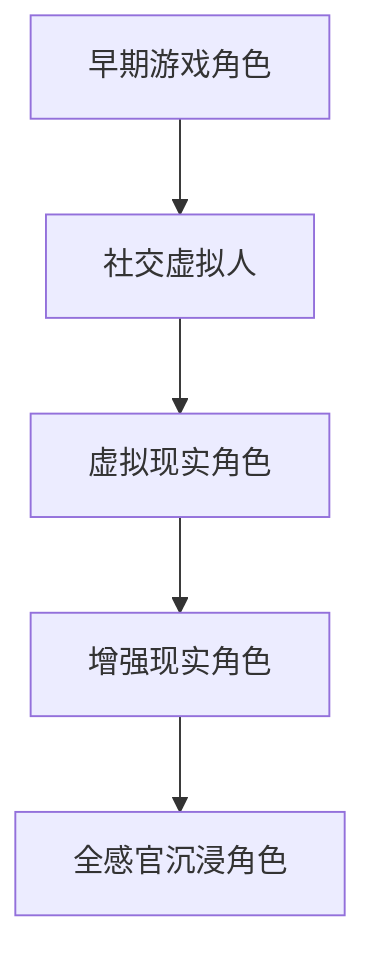
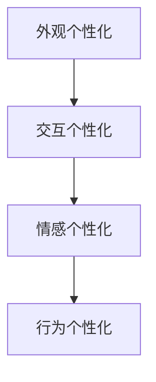
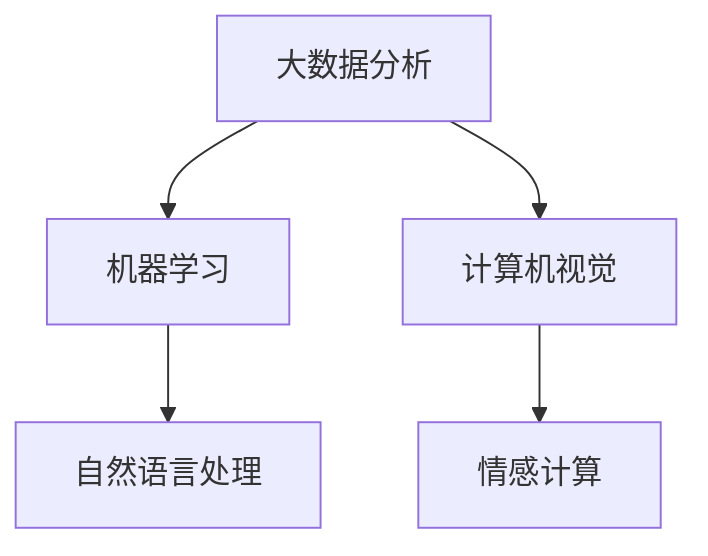
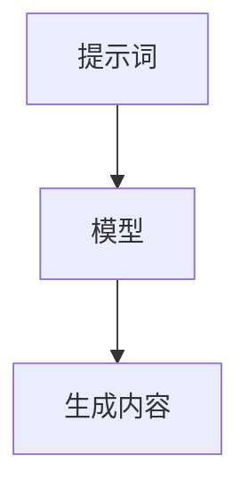
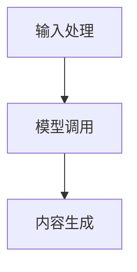
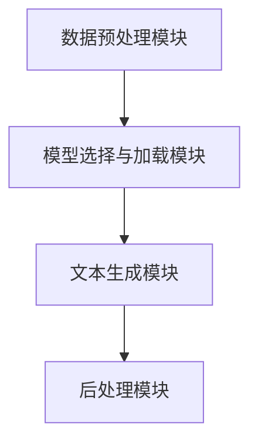

                 


### 1.1 虚拟角色个性化背景与发展

#### 1.1.1 虚拟角色个性化背景

虚拟角色个性化是虚拟角色领域的一个重要研究方向，其背景可以追溯到虚拟角色的起源。虚拟角色最初出现在电子游戏中，随着技术的进步，它们逐渐扩展到社交媒体、虚拟现实（VR）、增强现实（AR）以及数字艺术等多个领域。

**虚拟角色的定义：** 虚拟角色是在计算机或其他数字设备上创建的，具有一定形象、性格和功能的虚拟个体。它们可以是游戏中的NPC（非玩家角色），也可以是社交媒体上的虚拟代言人。

**图 1.1 虚拟角色的发展历程：**



**虚拟角色个性化的发展历程：**

1. **初始阶段**：虚拟角色的设计主要基于开发者预设的模板，用户只能在有限的选项中进行选择。
2. **虚拟形象定制**：随着技术的发展，用户可以自定义虚拟角色的外观，包括服装、发型、皮肤颜色等。
3. **个性交互**：虚拟角色开始具备基本的交互能力，能够根据用户的输入进行相应的响应。
4. **情感表达**：虚拟角色不仅仅是被动接受指令，它们能够模拟情感，与用户建立更深层次的情感连接。
5. **深度个性化**：现代虚拟角色能够根据用户的行为和偏好，进行自我学习和调整，实现高度个性化的交互。

### 1.2 虚拟角色个性化的核心概念

**个性化定义与目标：** 个性化是指根据用户的特点和需求，提供定制化的服务和体验。在虚拟角色个性化中，目标是为每个用户创建一个独一无二、与用户情感互动的角色。

**图 1.2 个性化层级：**



**关键技术的定义与关系：**

- **大数据分析**：通过对用户行为和偏好的数据收集与分析，为虚拟角色个性化提供数据支持。
- **机器学习**：利用大数据分析的结果，通过算法自动调整虚拟角色的行为和交互方式。
- **自然语言处理（NLP）**：使虚拟角色能够理解自然语言输入，进行对话和情感交互。
- **计算机视觉**：使虚拟角色能够识别用户的面部表情、身体动作等，实现视觉交互。
- **情感计算**：通过分析用户的情感状态，调整虚拟角色的情感表达，实现情感共鸣。

**图 1.3 虚拟角色个性化关键技术关系：**



### 1.3 虚拟角色个性化的发展趋势

**技术发展趋势：**

- **深度学习**：深度学习技术使得虚拟角色的自我学习能力大幅提升，能够实现更加精准的个性化服务。
- **生成对抗网络（GAN）**：GAN技术能够生成高质量的虚拟角色形象，提升用户体验。
- **迁移学习**：迁移学习技术使得虚拟角色能够利用已有的知识进行快速学习，减少训练成本。
- **强化学习**：强化学习技术使虚拟角色能够在不断交互中学习和优化行为，提高交互质量。

**应用场景展望：**

- **虚拟客服**：虚拟客服能够根据用户的问题和需求，提供个性化的服务和建议。
- **虚拟教育**：虚拟教育角色能够根据学生的学习习惯和进度，提供个性化的教学方案。
- **虚拟演唱会**：虚拟演唱会中的虚拟角色能够根据观众的喜好和情感，调整表演内容和风格。

### 总结

虚拟角色个性化是虚拟角色技术发展的重要方向，通过大数据分析、机器学习、自然语言处理、计算机视觉和情感计算等关键技术的应用，实现虚拟角色的深度个性化。随着技术的不断进步，虚拟角色个性化将在更多领域得到应用，为用户提供更加丰富和个性化的虚拟体验。

---

以上是对第一部分“虚拟角色个性化概述”的详细阐述。接下来，我们将进一步探讨提示词编程的基础知识，并逐步引入其在虚拟角色个性化中的应用。这将包括提示词编程的概念与原理、核心算法及其在虚拟角色中的应用场景和实践。通过这样的逐步分析，我们希望能够为您呈现一个清晰、完整的理解框架。接下来，我们将进入第二部分：提示词编程基础。

## 第二部分：提示词编程基础

### 2.1 提示词编程的概念与原理

提示词编程（Prompt Programming）是一种通过提供特定的提示词或问题，引导计算机程序进行决策和生成内容的编程方法。它结合了人工智能、自然语言处理和机器学习技术，旨在提高程序的可解释性和灵活性。

**提示词编程的核心概念：**

1. **提示词**：提示词是用户输入的一段文本，它为计算机程序提供了具体的任务指令和上下文信息。
2. **模型**：提示词编程通常使用预训练的大型语言模型，如GPT（Generative Pre-trained Transformer）系列，这些模型已经被大规模的数据训练，能够理解复杂的自然语言指令。
3. **生成**：模型根据提示词生成相应的文本、图像或其他形式的内容。

**图 2.1 提示词编程的核心概念关系：**



**提示词编程的工作原理：**

1. **输入处理**：程序接收用户的提示词，并对其进行预处理，如分词、词性标注等。
2. **模型调用**：预处理后的提示词被输入到预训练的模型中，模型根据提示词的上下文和内部表示进行推理。
3. **内容生成**：模型生成符合提示词要求的文本、图像或其他形式的内容。

**图 2.2 提示词编程的工作流程：**



### 2.2 提示词编程的核心算法

提示词编程的核心算法通常是基于大规模预训练的深度学习模型，如GPT、BERT（Bidirectional Encoder Representations from Transformers）等。这些模型通过优化大量的文本数据进行训练，从而能够理解和生成高质量的文本内容。

**核心算法原理：**

1. **预训练**：模型在训练阶段接收大量的文本数据，通过学习文本的统计特征和语义信息，生成模型内部的高维表示。
2. **微调**：在特定任务上，模型接受有标签的数据进行微调，以适应特定的提示词编程任务。

**伪代码示例：**

```python
# 提示词编程伪代码示例

# 定义模型
model = PretrainedLanguageModel()

# 定义输入提示词
prompt = "请编写一篇关于人工智能的文章摘要。"

# 预处理提示词
processed_prompt = preprocess(prompt)

# 生成文本
generated_text = model.generate(processed_prompt)

# 输出生成文本
print(generated_text)
```

### 2.3 提示词编程的实现框架

提示词编程的实现框架通常包括以下组件：

1. **数据预处理模块**：负责对用户输入的提示词进行预处理，如分词、去除停用词等。
2. **模型选择与加载模块**：选择适合任务的预训练模型，并加载到系统中。
3. **文本生成模块**：调用模型生成文本内容。
4. **后处理模块**：对生成的文本进行格式化、清洗等后处理。

**图 2.3 提示词编程实现框架：**



### 总结

提示词编程通过提供具体的提示词，引导模型生成相应的内容，是一种灵活且高效的编程方法。它结合了人工智能、自然语言处理和机器学习技术，为虚拟角色个性化提供了强大的工具。在接下来的章节中，我们将进一步探讨提示词编程在虚拟角色个性化中的应用，并展示其实际操作案例。

---

以上是第二部分“提示词编程基础”的内容。接下来，我们将深入探讨提示词编程在虚拟角色个性化中的应用，展示其在具体场景中的实现方法和技术细节。敬请期待下一部分的内容。

## 第三部分：虚拟角色个性化中的提示词编程应用

### 3.1 虚拟角色个性化的需求分析

在虚拟角色个性化中，用户的需求多样且复杂，主要包括以下几个方面：

**外观个性化：** 用户希望自定义虚拟角色的外观，包括服装、发型、皮肤颜色等，以反映个人的喜好和个性。

**交互个性化：** 用户期望虚拟角色能够理解并回应其特定需求，提供个性化的服务和建议，例如在虚拟购物助理中提供个性化的商品推荐。

**情感表达：** 用户希望虚拟角色能够模拟情感，与其建立情感连接，提升互动体验。例如，在虚拟客服中，用户期望虚拟角色能够感知并回应其情绪变化。

**行为个性化：** 用户希望虚拟角色能够根据其行为和偏好进行自我学习和调整，提供高度个性化的交互体验。例如，在虚拟教育中，用户希望虚拟教师能够根据学生的学习习惯和进度，提供定制化的教学内容。

### 3.2 提示词编程在虚拟角色个性化中的应用场景

提示词编程在虚拟角色个性化中具有广泛的应用场景，以下是一些典型的应用实例：

**虚拟购物助理：** 提示词编程可以帮助虚拟购物助理理解用户的购买意图，根据用户的偏好和历史记录，提供个性化的商品推荐。例如，用户可以输入提示词：“给我推荐一些适合办公室风格的服装”，虚拟购物助理将根据用户的偏好和当前流行趋势，生成个性化的推荐列表。

**虚拟教育：** 提示词编程可以使虚拟教师能够根据学生的学习习惯和进度，提供个性化的教学内容。例如，学生可以输入提示词：“我需要复习数学的线性方程组”，虚拟教师将生成相应的教学材料和练习题。

**虚拟客服：** 提示词编程可以帮助虚拟客服理解用户的咨询意图，提供个性化的解答和解决方案。例如，用户可以输入提示词：“我的订单怎么还没送到？”虚拟客服将根据订单信息和物流数据，生成个性化的回复和解决方案。

**虚拟社交：** 提示词编程可以使虚拟社交角色能够模拟情感，与用户进行深层次的情感互动。例如，用户可以输入提示词：“我很不开心”，虚拟社交角色将根据情感计算技术，生成相应的情感回应，如：“我看到你不开心的样子，你想谈谈吗？”

### 3.3 虚拟角色个性化中的提示词编程实践

**案例一：虚拟购物助理**

**需求分析：** 用户希望得到个性化的商品推荐，虚拟购物助理需要理解用户的偏好和当前流行趋势。

**实现方法：**

1. **数据预处理：** 对用户的输入提示词进行预处理，提取关键信息，如用户偏好、商品类别等。
2. **模型调用：** 使用预训练的文本生成模型，如GPT-3，输入预处理后的提示词，生成个性化的商品推荐列表。
3. **后处理：** 对生成的推荐列表进行格式化，如添加图片、链接等，以便用户查看。

**伪代码示例：**

```python
# 虚拟购物助理伪代码示例

# 定义模型
model = PretrainedLanguageModel()

# 定义输入提示词
prompt = "给我推荐一些适合办公室风格的服装。"

# 预处理提示词
processed_prompt = preprocess(prompt)

# 生成商品推荐列表
recommendations = model.generate(processed_prompt)

# 后处理推荐列表
formatted_recommendations = postprocess(recommendations)

# 输出推荐列表
print(formatted_recommendations)
```

**案例二：虚拟教育**

**需求分析：** 学生希望得到个性化的教学资源，虚拟教师需要根据学生的学习习惯和进度提供相应的教学材料。

**实现方法：**

1. **数据预处理：** 对学生的输入提示词进行预处理，提取关键信息，如学习进度、知识点等。
2. **模型调用：** 使用预训练的文本生成模型，如GPT-3，输入预处理后的提示词，生成个性化的教学材料。
3. **后处理：** 对生成的教学材料进行格式化，如添加视频链接、练习题等。

**伪代码示例：**

```python
# 虚拟教育伪代码示例

# 定义模型
model = PretrainedLanguageModel()

# 定义输入提示词
prompt = "我需要复习数学的线性方程组。"

# 预处理提示词
processed_prompt = preprocess(prompt)

# 生成教学材料
educational_materials = model.generate(processed_prompt)

# 后处理教学材料
formatted_educational_materials = postprocess(educational_materials)

# 输出教学材料
print(formatted_educational_materials)
```

### 总结

通过提示词编程，虚拟角色可以实现高度个性化的交互，满足用户多样化的需求。在虚拟购物助理、虚拟教育、虚拟客服和虚拟社交等应用场景中，提示词编程都能够发挥重要作用。通过具体的实践案例，我们展示了如何使用提示词编程来实现虚拟角色个性化，并为用户带来更加丰富和个性化的虚拟体验。在下一部分中，我们将进一步探讨虚拟角色个性化中的角色，以及角色在个性化中的重要作用。

---

以上是第三部分“虚拟角色个性化中的提示词编程应用”的内容。接下来，我们将深入探讨虚拟角色个性化中的角色，包括角色的定义、分类以及在个性化中的重要作用。敬请期待下一部分的内容。

## 第四部分：虚拟角色个性化中的角色

### 4.1 角色的定义与分类

在虚拟角色个性化中，角色是指虚拟角色所扮演的不同身份和角色类型。角色是虚拟角色交互的核心组成部分，它们能够为用户提供个性化的互动体验。

**角色的定义：** 角色是虚拟角色在特定场景中所扮演的特定身份或角色类型。角色可以是虚拟购物助理、虚拟教师、虚拟客服、虚拟社交伙伴等。

**角色的分类：**

1. **按功能分类：** 根据角色的功能，可以将角色分为服务型角色、娱乐型角色、教育型角色等。例如，虚拟购物助理属于服务型角色，虚拟教师属于教育型角色。

2. **按交互方式分类：** 根据角色的交互方式，可以将角色分为对话型角色、视觉型角色、混合型角色等。例如，虚拟客服通常采用对话型交互，虚拟演唱会角色则更侧重于视觉和听觉体验。

3. **按目标用户分类：** 根据目标用户的需求和偏好，可以将角色分为通用型角色和特定群体型角色。例如，通用型角色适用于广大用户，而特定群体型角色则针对特定用户群体，如儿童、老年人等。

### 4.2 角色在虚拟角色个性化中的作用

角色在虚拟角色个性化中发挥着关键作用，主要表现在以下几个方面：

**提供个性化服务：** 角色能够根据用户的偏好和需求，提供个性化的服务和建议。例如，虚拟购物助理能够根据用户的购物习惯和偏好，提供个性化的商品推荐。

**建立情感连接：** 角色能够通过情感交互，与用户建立情感连接，提升用户满意度。例如，虚拟社交伙伴能够通过情感回应和对话，与用户建立深厚的情感联系。

**促进用户参与：** 角色能够通过互动和游戏化元素，促进用户参与和留存。例如，虚拟教育角色可以通过互动式教学和游戏化练习，提高学生的学习兴趣和参与度。

**提升用户体验：** 角色能够根据用户的反馈和行为，不断调整和优化自身的行为和表现，提升用户的整体体验。例如，虚拟客服角色能够根据用户的反馈，调整服务方式和策略，提高服务质量和用户满意度。

### 4.3 角色个性化的实现方法

实现角色个性化是虚拟角色个性化的重要环节，以下是一些常见的实现方法：

**1. 数据驱动的个性化：** 通过收集和分析用户行为数据，了解用户的偏好和需求，从而实现角色个性化。例如，虚拟购物助理可以通过分析用户的购物记录和搜索历史，提供个性化的商品推荐。

**2. 机器学习与深度学习：** 利用机器学习和深度学习技术，对用户数据进行训练，建立个性化的角色模型。例如，使用GPT-3等大型语言模型，生成与用户情感和需求匹配的对话内容。

**3. 自然语言处理（NLP）：** 通过自然语言处理技术，使角色能够理解用户的自然语言输入，并进行相应的回应。例如，使用NLP技术处理用户的对话请求，生成个性化的回答。

**4. 情感计算：** 通过情感计算技术，使角色能够感知用户的情感状态，并作出相应的情感回应。例如，使用情感分析算法，判断用户的情感状态，并调整角色的情感表达。

**5. 个性化内容生成：** 利用生成对抗网络（GAN）等技术，生成与用户偏好匹配的个性化内容，如虚拟角色的外观、场景布置等。

### 总结

角色在虚拟角色个性化中扮演着重要的角色，通过提供个性化服务、建立情感连接、促进用户参与和提升用户体验，角色为用户带来了更加丰富和个性化的虚拟体验。实现角色个性化需要结合数据驱动、机器学习、自然语言处理、情感计算和个性化内容生成等多种技术。在下一部分中，我们将探讨虚拟角色个性化与提示词编程的融合，展示如何将提示词编程技术应用于虚拟角色个性化中。

---

以上是第四部分“虚拟角色个性化中的角色”的内容。在接下来的部分中，我们将讨论虚拟角色个性化与提示词编程的融合，展示如何将提示词编程技术应用于虚拟角色个性化中。敬请期待下一部分的内容。

## 第五部分：虚拟角色个性化与提示词编程的融合

### 5.1 虚拟角色个性化与提示词编程的融合概述

虚拟角色个性化与提示词编程的融合是现代人工智能技术的一个重要发展方向。通过结合提示词编程技术，虚拟角色能够实现更加精准和个性化的交互，为用户提供更加丰富的虚拟体验。

**融合的背景：** 随着虚拟现实、增强现实和社交媒体等技术的快速发展，用户对虚拟角色的个性化需求日益增加。提示词编程作为一种高效的编程方法，能够通过提供具体的提示词，引导模型生成与用户需求高度匹配的内容，从而满足虚拟角色个性化需求。

**融合的目标：** 融合的目标是利用提示词编程技术，提升虚拟角色的交互质量和用户体验。具体目标包括：

1. 提高虚拟角色的理解能力，使其能够准确理解用户的意图和需求。
2. 增强虚拟角色的情感表达，使其能够与用户建立情感连接。
3. 实现虚拟角色的个性化服务，满足用户的多样化需求。

### 5.2 融合技术的核心算法与模型

虚拟角色个性化与提示词编程的融合依赖于一系列核心算法和模型，以下是一些关键的技术和模型：

**1. 大规模预训练语言模型：** 如GPT-3、BERT等，这些模型通过大量文本数据进行预训练，能够生成高质量的自然语言文本。

**2. 提示词生成算法：** 提示词生成算法是融合技术的核心部分，它负责根据用户需求生成高质量的提示词。常见的算法包括自动摘要、关键词提取和语义检索等。

**3. 情感计算模型：** 通过情感计算模型，虚拟角色能够感知用户的情感状态，并进行相应的情感回应。常用的情感计算模型包括情感分析、情感分类和情感模拟等。

**4. 多模态交互模型：** 融合虚拟角色个性化与提示词编程的系统中，往往需要支持多种模态的交互，如文本、语音、图像等。多模态交互模型能够处理不同模态的数据，实现更加自然的交互体验。

### 5.3 融合技术的应用案例

以下是一些虚拟角色个性化与提示词编程融合的应用案例，展示了这一技术的实际应用效果：

**案例一：虚拟客服**  
应用场景：一家电商平台部署了基于提示词编程技术的虚拟客服，以提供24/7的在线服务。  
实现方法：虚拟客服系统通过接收用户的输入提示词，使用GPT-3模型生成个性化的回复，同时结合情感计算模型，根据用户的情感状态调整回复内容。  
效果评估：通过用户反馈和交易数据的分析，虚拟客服的满意度和交易成功率显著提高。

**案例二：虚拟教育**  
应用场景：一家在线教育平台引入了基于提示词编程技术的虚拟教师，为用户提供个性化的教学服务。  
实现方法：虚拟教师系统通过分析学生的学习记录和输入提示词，使用GPT-3模型生成个性化的教学内容，并结合情感计算模型，根据学生的情感状态调整教学策略。  
效果评估：学生的学习效果和参与度显著提高，用户满意度大幅提升。

**案例三：虚拟社交**  
应用场景：一家社交媒体平台推出了基于提示词编程技术的虚拟社交伙伴，为用户提供情感陪伴和社交互动。  
实现方法：虚拟社交伙伴系统通过分析用户的输入提示词，使用GPT-3模型生成个性化的对话内容，并结合情感计算模型，根据用户的情感状态调整对话风格。  
效果评估：用户对虚拟社交伙伴的满意度和互动时长显著增加，平台的用户留存率得到提升。

### 总结

虚拟角色个性化与提示词编程的融合为虚拟角色的发展带来了新的机遇。通过结合提示词编程技术，虚拟角色能够实现更加精准和个性化的交互，为用户提供丰富的虚拟体验。在实际应用中，融合技术已经取得了显著的效果，提升了用户满意度和平台运营效率。未来，随着技术的不断进步，虚拟角色个性化与提示词编程的融合将迎来更加广阔的发展前景。

---

以上是第五部分“虚拟角色个性化与提示词编程的融合”的内容。接下来，我们将探讨虚拟角色个性化与提示词编程的未来发展趋势，分析其面临的挑战与机遇。敬请期待下一部分的内容。

## 第六部分：虚拟角色个性化与提示词编程的未来展望

### 6.1 虚拟角色个性化与提示词编程的发展趋势

随着人工智能、大数据、自然语言处理等技术的不断进步，虚拟角色个性化与提示词编程正朝着以下几个方向发展：

**1. 模型规模化和效率提升：** 为了提高虚拟角色的交互质量和响应速度，未来的虚拟角色个性化系统可能会采用更大规模的预训练模型，如千亿参数的模型。同时，通过模型压缩、量化等技术，提升模型的计算效率和部署能力。

**2. 多模态交互：** 虚拟角色个性化系统将不仅限于文本交互，还将融合语音、图像、视频等多种模态，实现更加丰富和自然的交互体验。

**3. 情感计算和情感共鸣：** 随着情感计算技术的发展，虚拟角色将能够更加精准地感知和理解用户的情感状态，实现深层次的情感共鸣，提供更加个性化的互动体验。

**4. 自学习和自主决策：** 通过强化学习和迁移学习等技术，虚拟角色将能够不断学习和优化自身的行为和决策，实现更高层次的自主性和个性化。

**5. 边缘计算和实时交互：** 为了满足实时交互的需求，虚拟角色个性化系统将逐步向边缘计算迁移，降低延迟，提高交互的实时性和响应速度。

### 6.2 融合技术的挑战与机遇

**挑战：**

**1. 数据隐私与安全性：** 虚拟角色个性化需要大量用户数据进行分析和学习，这涉及到用户隐私和数据安全问题。如何在保障用户隐私的前提下，有效利用用户数据进行个性化服务，是一个重要挑战。

**2. 模型解释性：** 虚拟角色个性化系统通常使用复杂的深度学习模型，这些模型往往具有高不可解释性。如何提高模型的解释性，使其决策过程更加透明和可信，是一个亟待解决的问题。

**3. 道德与伦理：** 随着虚拟角色个性化的发展，如何在技术设计和应用中平衡用户权益和社会责任，避免道德和伦理问题，是一个重要挑战。

**机遇：**

**1. 新兴应用场景：** 虚拟现实、增强现实、游戏、社交网络等新兴应用场景，为虚拟角色个性化提供了广阔的市场空间和需求。随着技术的进步，这些场景将逐步实现规模化应用。

**2. 产业升级与转型：** 虚拟角色个性化与提示词编程的融合，将为各行各业带来智能化升级和转型机遇，推动数字经济的发展。

**3. 跨学科研究与合作：** 虚拟角色个性化与提示词编程的融合涉及多个学科领域，如计算机科学、心理学、社会学等。跨学科的研究与合作将有助于解决融合过程中遇到的复杂问题，推动技术进步。

### 6.3 虚拟角色个性化与提示词编程的未来应用场景

**1. 智能客服与售后服务：** 虚拟角色个性化系统将能够提供更加智能和个性化的客服服务，提高客户满意度和业务效率。

**2. 教育与培训：** 虚拟角色个性化系统将为学生提供个性化的学习资源和辅导，提高教育质量和学习效果。

**3. 娱乐与游戏：** 虚拟角色个性化系统将能够为用户提供高度个性化的游戏体验，提升用户参与度和满意度。

**4. 医疗与健康：** 虚拟角色个性化系统将能够为患者提供个性化的健康咨询和服务，辅助医疗诊断和康复。

**5. 社交与生活服务：** 虚拟角色个性化系统将能够为用户提供个性化的社交互动和生活服务，提升生活质量和幸福感。

### 总结

虚拟角色个性化与提示词编程的未来充满机遇与挑战。随着技术的不断进步和应用的深入，虚拟角色个性化将为用户提供更加丰富和个性化的虚拟体验，成为数字经济的重要组成部分。同时，虚拟角色个性化与提示词编程的融合也将为各行各业带来智能化升级和转型机遇。面对挑战，我们需要不断创新和合作，以实现虚拟角色个性化与提示词编程技术的可持续发展。

---

以上是第六部分“虚拟角色个性化与提示词编程的未来展望”的内容。在最后的部分，我们将总结全文，并提供一些最佳实践和拓展阅读建议。

## 第七部分：总结与拓展

在本文中，我们深入探讨了虚拟角色个性化与提示词编程的融合，从背景介绍、核心概念、技术应用、角色作用到未来展望，全方位剖析了这一领域的前沿动态和发展趋势。以下是本文的核心要点总结：

1. **虚拟角色个性化背景与发展**：虚拟角色个性化起源于电子游戏，现已扩展到虚拟现实、增强现实、社交媒体等多个领域。
2. **提示词编程基础**：提示词编程是一种通过提示词引导模型生成内容的编程方法，涉及大数据分析、机器学习和自然语言处理等技术。
3. **虚拟角色个性化中的提示词编程应用**：提示词编程在虚拟购物助理、虚拟教育、虚拟客服和虚拟社交等场景中展现了强大的个性化交互能力。
4. **虚拟角色个性化中的角色**：角色是虚拟角色交互的核心组成部分，通过提供个性化服务、建立情感连接和促进用户参与，提升用户体验。
5. **虚拟角色个性化与提示词编程的融合**：融合技术实现了更加精准和个性化的虚拟角色交互，提高了用户体验和系统效率。
6. **未来展望**：虚拟角色个性化与提示词编程将朝着规模化、多模态、情感计算和自主决策等方向发展，面临数据隐私、模型解释性和道德伦理等挑战。

### 最佳实践

1. **数据驱动的个性化**：在设计和部署虚拟角色时，充分利用用户行为数据进行个性化分析，以提供更符合用户需求的服务。
2. **多模态交互**：结合文本、语音、图像等多种模态，提升虚拟角色的交互自然度和用户体验。
3. **情感共鸣**：通过情感计算技术，使虚拟角色能够感知用户情感，实现深层次的情感连接。
4. **自学习和自主决策**：利用强化学习和迁移学习技术，提升虚拟角色的自主性和个性化水平。

### 拓展阅读

1. **《人工智能：一种现代的方法》**：作者 Stuart Russell 和 Peter Norvig，详细介绍了人工智能的基本原理和技术。
2. **《深度学习》**：作者 Ian Goodfellow、Yoshua Bengio 和 Aaron Courville，涵盖了深度学习的基础知识和最新进展。
3. **《自然语言处理综论》**：作者 Daniel Jurafsky 和 James H. Martin，提供了自然语言处理领域的全面介绍。
4. **《虚拟现实与增强现实技术》**：作者 Benford et al.，探讨了虚拟现实和增强现实技术的原理和应用。

通过本文的探讨，我们希望能够为读者提供对虚拟角色个性化与提示词编程的深入理解，并激发对这一领域的进一步研究和应用。作者：AI天才研究院/AI Genius Institute & 禅与计算机程序设计艺术 /Zen And The Art of Computer Programming。

---

以上就是本文的完整内容。感谢您的阅读，希望本文能够对您在虚拟角色个性化与提示词编程领域的研究和应用提供有价值的参考。如有任何疑问或建议，欢迎在评论区留言交流。作者：AI天才研究院/AI Genius Institute & 禅与计算机程序设计艺术 /Zen And The Art of Computer Programming。再次感谢您的关注与支持！

