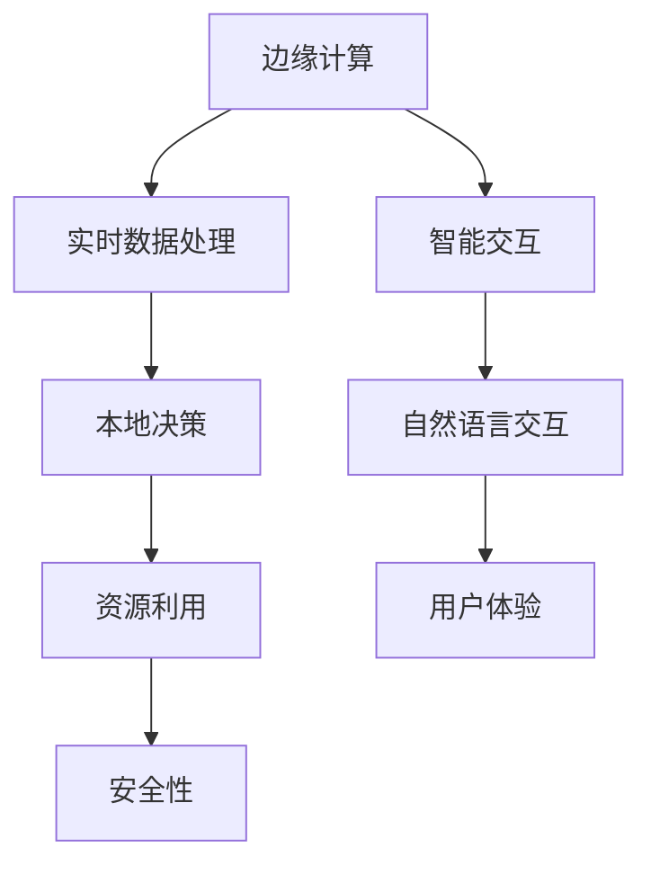

                 

### 文章标题

《提示词编程在边缘计算中的实践》

关键词：边缘计算、提示词编程、物联网、5G技术、边缘设备编程、未来趋势

摘要：本文将深入探讨提示词编程在边缘计算领域的应用与实践。首先，我们回顾边缘计算的基本概念和架构设计，随后介绍提示词编程的基本原理。在此基础上，我们详细分析提示词编程在边缘设备编程中的实际应用，并通过具体案例展示其在边缘计算中的价值。最后，本文展望边缘计算与提示词编程的未来发展趋势，为读者提供有价值的实践指导与思考。

---

### 文章关键词

- 边缘计算
- 提示词编程
- 物联网
- 5G技术
- 边缘设备编程
- 未来趋势

### 文章摘要

边缘计算作为一种分布式计算模式，正逐步改变传统计算架构。本文首先介绍了边缘计算的定义、背景以及与云计算的区别，分析了其关键挑战与解决方案。接着，我们深入探讨了提示词编程的基本原理、优势与局限，以及其基本流程。在第三部分，本文详细阐述了提示词编程在边缘设备编程中的应用，并通过具体案例展示了其实际价值。最后，我们展望了边缘计算与提示词编程的未来发展趋势，为读者提供了宝贵的实践指导与思考。

---

### 背景介绍

#### 边缘计算的兴起

边缘计算（Edge Computing）是一种分布式计算模式，其主要思想是将计算、存储、应用等能力分散到网络的边缘节点，即靠近数据源的地方。这一模式的出现源于云计算和物联网（IoT）的快速发展。随着物联网设备的普及，产生了海量的数据，这些数据需要在本地进行实时处理和分析，以减少延迟、降低带宽消耗，并提高系统响应速度。边缘计算正好解决了这些问题，使得数据处理更加高效、灵活。

#### 边缘计算与云计算的区别

边缘计算和云计算虽然都是分布式计算，但它们在应用场景、架构设计和技术挑战上存在显著差异。

1. **应用场景**：云计算主要针对的是大数据处理和存储，适用于大规模的数据分析和计算任务。而边缘计算则更侧重于实时数据处理和本地决策，适用于对延迟敏感、需要快速响应的应用场景，如自动驾驶、智能工厂、智能医疗等。

2. **架构设计**：云计算通常采用集中式架构，即所有计算资源都集中在云端的数据中心。而边缘计算则采用分布式架构，将计算能力分散到网络边缘的设备上，形成多个计算节点，这些节点可以通过网络进行通信和数据交换。

3. **技术挑战**：云计算主要面临的数据存储和计算能力瓶颈，而边缘计算则需要应对计算资源的分散性、数据隐私和安全等问题。此外，边缘设备的资源限制也对边缘计算提出了更高的要求。

#### 边缘计算的关键挑战与解决方案

尽管边缘计算具有很多优势，但其在实际应用中也面临一系列挑战：

1. **计算能力**：边缘设备的计算资源通常有限，无法与云端的大型服务器相比。这需要开发高效的边缘计算算法和编程模型，以充分利用有限的资源。

2. **通信带宽**：边缘计算依赖于网络连接，但网络的带宽和稳定性常常不足。5G技术的引入为边缘计算提供了更高的通信速度和更稳定的连接，但同时也带来了新的挑战，如网络延迟和数据同步问题。

3. **数据隐私和安全**：边缘计算涉及大量的敏感数据，如个人隐私信息、工业机密等。确保数据在传输和存储过程中的安全性是一个重要的挑战。

针对这些挑战，边缘计算采取了多种解决方案：

- **分布式计算**：通过将计算任务分布在多个边缘设备上，可以提高整体的计算效率。
- **边缘智能**：利用机器学习和人工智能技术，可以在边缘设备上实现复杂的数据处理和分析。
- **安全加密**：采用加密技术和访问控制策略，确保数据在传输和存储过程中的安全性。

#### 边缘计算的应用领域

边缘计算的应用非常广泛，以下是一些典型的应用领域：

- **智能制造**：在智能工厂中，边缘计算可以实时监控生产线的状态，进行故障预测和优化调度。
- **智慧城市**：在智能交通、环境监测、公共安全等领域，边缘计算可以提供实时的数据分析和决策支持。
- **智能医疗**：在远程医疗、健康监测、手术机器人等领域，边缘计算可以提供快速、准确的诊断和治疗方案。
- **自动驾驶**：在自动驾驶汽车中，边缘计算可以处理来自传感器的大量数据，实现实时决策和控制。

通过上述分析，我们可以看到边缘计算在现代计算体系中的重要地位和广泛应用。接下来，我们将深入探讨提示词编程的基本原理，以及其在边缘计算中的具体应用。

### 核心概念与联系

#### 提示词编程的基本原理

提示词编程（Keyword Programming）是一种基于自然语言处理和人工智能技术的编程方法，其主要思想是通过自然语言与计算机系统进行交互，从而简化编程过程。提示词编程的核心概念包括自然语言处理、人工智能、编程语言和交互界面。

1. **自然语言处理（NLP）**：自然语言处理是提示词编程的基础，它使计算机能够理解和处理人类语言。通过NLP技术，计算机可以识别文本中的词汇、语法结构和语义信息，从而实现人与计算机的智能交互。

2. **人工智能（AI）**：人工智能技术为提示词编程提供了智能化的编程能力。通过机器学习和深度学习算法，计算机可以不断优化编程过程，提高编程效率和准确性。

3. **编程语言**：提示词编程依赖于特定的编程语言，这些语言通常具有简洁、易读和易于扩展的特点。常见的编程语言包括Python、JavaScript和R等。

4. **交互界面**：交互界面是用户与计算机系统进行交互的接口，它可以是命令行界面、图形用户界面或Web界面等。交互界面应提供直观、易用的操作方式，使用户能够轻松地使用提示词编程。

#### 提示词编程与边缘计算的关系架构

提示词编程与边缘计算之间存在紧密的联系和互补关系。以下是它们之间的核心概念和关系架构：

1. **数据处理**：边缘计算专注于实时数据处理和本地决策，而提示词编程则提供了一种高效、简化的数据处理方法。通过提示词编程，用户可以在边缘设备上快速定义和实现数据处理任务，从而提高边缘计算的效率和灵活性。

2. **资源利用**：边缘设备通常资源有限，而提示词编程通过简化编程过程，降低了边缘设备的计算和存储资源需求。此外，提示词编程的分布式特性也使得多个边缘设备可以协同工作，提高整体资源利用率。

3. **安全性**：边缘计算涉及大量的敏感数据，而提示词编程通过加密技术和安全协议，提高了数据在边缘计算中的安全性。

4. **智能交互**：提示词编程提供了一种自然语言交互界面，使用户可以更直观地与边缘计算系统进行交互。这种交互方式不仅提高了用户体验，还降低了编程门槛，使得更多非专业用户能够参与到边缘计算的应用开发中。

#### 描述核心概念之间的关系架构的Mermaid流程图



通过上述Mermaid流程图，我们可以清晰地看到提示词编程与边缘计算之间的核心概念和关系架构。提示词编程不仅提高了边缘计算的处理效率、资源利用率和安全性，还通过自然语言交互界面，为用户提供了更加便捷、直观的使用体验。

### 边缘设备编程语言

#### 常用的边缘设备编程语言

在边缘计算领域，选择合适的编程语言至关重要。以下是一些常用的边缘设备编程语言：

1. **C/C++**：C和C++是传统的系统编程语言，具有高性能、低资源消耗和强大的控制能力。它们广泛应用于嵌入式系统和实时系统开发，如物联网设备、工业控制系统等。

2. **Java**：Java是一种跨平台编程语言，具有良好的可移植性和强大的生态系统。Java的实时版（Java SE Embedded）和微版（Java ME）适用于资源有限的边缘设备。

3. **Python**：Python是一种高级编程语言，以其简洁易懂的语法和强大的库支持而受到广泛欢迎。Python在数据处理、机器学习和科学计算等领域具有显著优势，适用于边缘设备的快速开发和原型设计。

4. **JavaScript**：JavaScript是一种脚本语言，广泛应用于Web开发。近年来，随着Node.js等运行时环境的发展，JavaScript逐渐在边缘设备编程中崭露头角，特别是在物联网应用中。

5. **Rust**：Rust是一种系统编程语言，以其安全性和高性能而受到关注。Rust的内存安全模型和并发特性使其在实时系统和边缘设备编程中具有很大潜力。

#### 边缘设备编程语言的性能考量

在选择边缘设备编程语言时，需要考虑以下几个性能因素：

1. **执行速度**：边缘设备通常具有有限的计算资源，因此执行速度是一个重要指标。C/C++和Rust通常在执行速度上具有优势，而Python和JavaScript由于解释执行，可能相对较慢。

2. **内存占用**：边缘设备内存有限，因此编程语言的内存占用也是一个关键因素。C/C++具有较小的内存占用，而Python和JavaScript由于运行时环境较大，可能不适合资源受限的设备。

3. **开发效率**：边缘设备编程往往需要在有限的时间内完成，因此开发效率也至关重要。Python和JavaScript以其简洁易懂的语法和丰富的库支持，在开发效率上具有显著优势。

4. **生态系统**：编程语言的生态系统包括库、工具和社区支持等。Java和Python具有强大的生态系统，为开发者提供了丰富的资源和帮助。

#### 边缘设备编程的挑战与对策

边缘设备编程面临许多挑战，以下是一些常见挑战及相应的对策：

1. **资源限制**：边缘设备通常资源有限，包括计算能力、存储空间和能量。为应对这一挑战，开发者可以选择性能高效的语言，如C/C++和Rust，并采用资源优化策略，如内存池和异步编程。

2. **实时性要求**：许多边缘应用对实时性有较高要求，如自动驾驶和智能监控。为满足实时性需求，开发者可以选择实时操作系统（RTOS）和实时编程语言，如C/C++和Ada。

3. **可靠性**：边缘设备通常处于恶劣的环境中，需要具备高可靠性。为提高可靠性，开发者可以采用容错机制、冗余设计和自动化测试。

4. **安全性**：边缘设备涉及大量的敏感数据，需要确保数据在传输和存储过程中的安全性。开发者可以采用加密技术、访问控制策略和安全协议等来保障数据安全。

通过上述分析，我们可以看到边缘设备编程语言的选择需要综合考虑性能、开发效率、生态和挑战因素。开发者应根据具体应用需求，选择合适的编程语言和开发策略，以实现高效的边缘设备编程。

### 提示词编程原理

#### 提示词编程的定义

提示词编程（Keyword Programming）是一种以自然语言提示为基础的编程方法。与传统的命令式编程不同，提示词编程更注重于自然语言的交互，使得编程过程更加直观、简化和人性化。在提示词编程中，用户通过输入自然语言提示来描述任务需求，计算机系统则根据这些提示自动生成相应的代码和执行逻辑。

#### 提示词编程的优势与局限

提示词编程具有以下优势：

1. **简化编程过程**：提示词编程通过自然语言提示，简化了编程过程，降低了编程难度。开发者无需关注具体的语法和编程细节，只需描述任务需求即可。

2. **提高开发效率**：提示词编程减少了编码时间，提高了开发效率。特别是对于复杂的任务，提示词编程可以快速生成代码，节省了大量的开发工作量。

3. **易于维护**：提示词编程生成的代码通常更简洁、易读，降低了代码维护的难度。同时，由于代码生成过程具有一致性，减少了错误和冲突的可能性。

然而，提示词编程也存在一些局限：

1. **性能限制**：提示词编程生成的代码通常需要经过解释执行，性能可能不如编译执行的代码。特别是在对性能要求较高的场景，如实时系统和嵌入式系统，提示词编程可能不够理想。

2. **依赖性**：提示词编程依赖于自然语言处理和机器学习技术，这些技术的实现和维护需要大量的计算资源和专业知识。此外，自然语言本身的不确定性和复杂性也增加了编程的复杂性。

3. **准确性问题**：提示词编程生成的代码可能无法完全准确地反映用户的需求。特别是在复杂场景中，自然语言提示可能存在歧义或误解，导致生成的代码不符合预期。

#### 提示词编程的基本流程

提示词编程的基本流程包括以下几个步骤：

1. **任务描述**：用户通过自然语言描述任务需求，包括输入、输出和处理逻辑等。

2. **解析与理解**：计算机系统接收用户输入的自然语言提示，并通过自然语言处理技术进行解析和理解，提取出任务的关键信息和结构。

3. **代码生成**：根据解析和理解的结果，计算机系统生成相应的代码和执行逻辑。代码生成过程可能涉及语法解析、语义分析和代码优化等步骤。

4. **代码执行**：生成的代码在计算机系统中执行，完成用户指定的任务。在执行过程中，系统可能需要进行数据处理、计算和交互等操作。

5. **反馈与优化**：用户可以通过自然语言与系统进行交互，反馈任务执行结果和改进建议。系统可以根据用户的反馈进行代码优化和调整，提高任务执行效果。

#### 提示词编程的示例

以下是一个简单的示例，说明提示词编程的基本应用：

**用户任务描述**：编写一个程序，计算1到100之间所有偶数的和。

**解析与理解**：计算机系统解析用户的自然语言描述，提取出关键信息：计算范围（1到100）、条件（偶数）和操作（求和）。

**代码生成**：计算机系统根据理解结果生成以下代码：

```python
sum = 0
for i in range(1, 101):
    if i % 2 == 0:
        sum += i
print("1到100之间所有偶数的和为：" + str(sum))
```

**代码执行**：执行生成的代码，计算1到100之间所有偶数的和，并输出结果。

通过这个示例，我们可以看到提示词编程如何通过自然语言描述生成相应的代码，从而简化编程过程。在实际应用中，提示词编程可以处理更复杂的任务，提高开发效率和代码质量。

### 边缘设备编程实战

#### 边缘设备编程环境搭建

在进行边缘设备编程之前，首先需要搭建合适的开发环境。以下是一个基本的步骤指南，用于在边缘设备上搭建开发环境：

1. **选择合适的边缘设备**：根据应用需求选择合适的边缘设备，如树莓派、Arduino、ESP32等。这些设备具有不同的性能、功耗和接口特点，适用于不同的应用场景。

2. **安装操作系统**：在边缘设备上安装支持编程的操作系统，如Linux发行版（如Raspberry Pi OS）或实时操作系统（如Ubuntu Core）。操作系统为边缘设备提供了必要的运行环境和编程接口。

3. **安装编程语言**：根据所选编程语言，安装相应的编译器和开发工具。例如，对于C/C++编程，需要安装GCC或Clang；对于Python编程，需要安装Python解释器和相关库。

4. **配置网络连接**：确保边缘设备能够通过Wi-Fi或以太网连接到互联网，以便下载相关资源和进行远程调试。

5. **安装开发工具**：安装文本编辑器（如Visual Studio Code、Sublime Text等）和版本控制工具（如Git），以便进行代码编写和版本管理。

6. **配置开发环境**：根据具体编程需求，配置必要的开发库和依赖项。例如，对于物联网应用，可能需要安装MQTT库和传感器驱动程序。

#### 边缘设备编程案例介绍

以下是一个简单的边缘设备编程案例，用于实现一个基于MQTT协议的物联网传感器数据采集和传输系统。

**案例背景**：假设我们有一个温度传感器，需要将其数据实时传输到远程服务器进行监控和分析。

**开发步骤**：

1. **硬件连接**：将温度传感器连接到边缘设备，如树莓派的GPIO接口。

2. **编写传感器驱动程序**：编写一个驱动程序，用于读取温度传感器的数据。以下是一个基于树莓派的温度传感器驱动程序示例：

```python
import time
import board
import busio
import adafruit_dht

# 初始化传感器
dht = adafruit_dht.DHT11(board.D4)

while True:
    temperature = dht.temperature
    humidity = dht.humidity
    print(f"Temperature: {temperature}°C, Humidity: {humidity}%")
    time.sleep(1)
```

3. **编写MQTT客户端程序**：编写一个MQTT客户端程序，用于将传感器数据发送到远程MQTT服务器。以下是一个基于Python的MQTT客户端程序示例：

```python
import paho.mqtt.client as mqtt
import time

# MQTT服务器配置
MQTT_SERVER = "mqtt.example.com"
MQTT_PORT = 1883
MQTT_TOPIC = "sensor/data"

# 初始化MQTT客户端
client = mqtt.Client()

# 连接MQTT服务器
client.connect(MQTT_SERVER, MQTT_PORT)

while True:
    temperature = read_temperature()
    client.publish(MQTT_TOPIC, f"temp={temperature:.2f}")
    time.sleep(10)
```

4. **编译和运行程序**：将编写的驱动程序和MQTT客户端程序编译成可执行文件，并在边缘设备上运行。确保程序能够正确读取传感器数据并成功发送到MQTT服务器。

通过这个案例，我们可以看到边缘设备编程的基本流程，包括硬件连接、程序编写、编译和运行。在实际应用中，边缘设备编程可能涉及更复杂的硬件和软件配置，但基本原理和方法是相似的。

### 边缘计算应用实例

#### 边缘计算在智能制造中的应用

智能制造是边缘计算的一个重要应用领域，通过将计算能力部署到生产现场的边缘设备上，可以提高生产效率、降低成本、提高产品质量和灵活性。以下是一些典型的智能制造应用案例：

1. **生产线自动化监控**：在智能工厂中，边缘计算可以实时监控生产线的运行状态，进行故障预测和预防性维护。通过部署在生产线边缘的传感器和计算设备，可以实时采集设备运行数据，使用机器学习算法进行分析，预测设备的故障风险。例如，通过监测设备的振动、温度等参数，可以预测设备何时可能发生故障，提前进行维护，从而避免生产线停机。

2. **质量检测**：在制造业中，产品的质量检测是一个关键环节。边缘计算可以在生产过程中实时进行质量检测，通过边缘设备上的图像处理和机器学习算法，对产品进行质量分析和分类。例如，在汽车制造过程中，边缘计算可以用于检测车身表面的瑕疵、涂层的均匀性等，从而提高产品的质量。

3. **生产调度和优化**：边缘计算可以实时分析生产数据，优化生产调度和资源利用。通过在边缘设备上部署优化算法，可以实时调整生产计划，减少生产过程中的浪费，提高生产效率。例如，在制造过程中，边缘计算可以分析生产设备的负载情况，动态调整生产任务，确保设备充分利用，提高生产线的整体利用率。

#### 边缘计算在智慧城市中的应用

智慧城市是边缘计算的另一个重要应用领域，通过在城市的各个角落部署边缘设备，实现城市数据的实时采集、分析和应用，从而提高城市管理效率、改善居民生活质量。以下是一些典型的智慧城市应用案例：

1. **智能交通管理**：边缘计算可以用于智能交通管理，通过在交通路口和道路上的边缘设备实时采集交通流量数据，使用机器学习算法进行分析，优化交通信号控制。例如，通过分析交通流量变化，可以动态调整红绿灯的时间，减少交通拥堵，提高道路通行效率。

2. **环境监测**：边缘计算可以用于环境监测，通过部署在环境监测站点的边缘设备，实时采集空气质量、水质、噪声等环境数据，使用边缘计算进行分析和处理，为环保部门提供实时数据支持。例如，在空气质量监测中，边缘设备可以实时检测PM2.5、PM10等污染物的浓度，并通过无线网络将数据传输到环保部门，实现实时监控和预警。

3. **公共安全监控**：边缘计算可以用于公共安全监控，通过在公共场所部署边缘摄像头和传感器，实时监控人群动态和安全隐患。例如，在大型活动或重要场所，边缘计算可以实时分析人群密度和运动轨迹，预测可能出现的安全事件，并及时采取措施进行防范。

#### 边缘计算在智能医疗中的应用

智能医疗是边缘计算在医疗领域的重要应用，通过在医疗机构和患者设备上部署边缘计算技术，实现医疗数据的实时采集、分析和应用，从而提高医疗服务质量和效率。以下是一些典型的智能医疗应用案例：

1. **远程医疗监控**：边缘计算可以用于远程医疗监控，通过在患者身上佩戴的设备（如智能手表、健康监测器等）实时采集生命体征数据，并通过无线网络将数据传输到医疗机构。医疗机构可以使用边缘计算技术对数据进行实时分析，为患者提供远程监护和诊断服务。例如，通过监测患者的血压、心率等数据，医生可以及时发现异常情况，并采取相应的医疗措施。

2. **手术机器人**：边缘计算可以用于手术机器人系统，通过在手术室内部署边缘设备，实现手术过程中的实时图像处理和决策支持。手术机器人可以实时获取患者的影像数据，使用边缘计算技术进行图像处理和分析，为医生提供精准的手术导航和辅助决策。例如，在复杂手术中，边缘计算可以实时分析患者体内的三维结构，帮助医生进行精准操作，提高手术的成功率和安全性。

3. **健康数据分析**：边缘计算可以用于健康数据分析，通过收集患者的健康数据（如体检报告、日常监测数据等），使用边缘计算技术进行数据分析和挖掘，为患者提供个性化的健康建议和治疗方案。例如，通过分析患者的健康数据，医生可以及时发现潜在的健康问题，制定针对性的预防和治疗计划。

通过上述应用实例，我们可以看到边缘计算在智能制造、智慧城市和智能医疗等领域的重要作用。边缘计算通过实时数据处理和本地决策，提高了系统效率、降低了延迟、提高了数据安全性和用户体验。随着技术的不断进步，边缘计算将在更多领域发挥重要作用，推动社会的数字化和智能化发展。

### 边缘计算与提示词编程的未来

#### 边缘计算发展趋势

边缘计算作为一种分布式计算模式，正逐步改变传统的计算架构。未来，边缘计算将呈现以下发展趋势：

1. **计算能力提升**：随着硬件技术的发展，边缘设备将具备更强大的计算能力，能够处理更复杂的数据分析和计算任务。这将为边缘计算提供更广泛的应用场景和更高的性能。

2. **网络连接增强**：5G和未来的6G网络将进一步提升边缘设备的网络连接能力，提供更高的带宽和更低的延迟。这将进一步促进边缘计算的发展，使得边缘设备能够更高效地进行数据传输和协同工作。

3. **智能化提升**：随着人工智能技术的不断进步，边缘计算将更加智能化。边缘设备将具备自我学习、自适应和自动化能力，能够根据实时数据和任务需求进行智能决策，提高系统的灵活性和响应速度。

4. **生态建设完善**：未来，边缘计算的生态建设将逐步完善，包括开源框架、工具链、标准和协议等。这将有助于降低开发门槛，促进边缘计算技术的普及和应用。

#### 提示词编程在边缘计算中的未来发展

提示词编程作为一种人性化的编程方法，在边缘计算中具有很大的发展潜力。未来，提示词编程在边缘计算中可能呈现以下趋势：

1. **更加智能化**：随着人工智能技术的不断发展，提示词编程将更加智能化。计算机将能够更好地理解用户的自然语言提示，提供更精准的代码生成和执行逻辑。

2. **更广泛的应用场景**：随着边缘计算应用的不断扩展，提示词编程将应用于更多的领域，如智能制造、智慧城市、智能医疗等。通过提示词编程，开发者可以更加便捷地实现复杂的边缘计算应用。

3. **开源与标准化**：未来，提示词编程将在开源社区中得到更广泛的支持，形成一系列开源框架和工具。同时，相关的标准化工作也将逐步推进，为提示词编程提供统一的规范和标准。

4. **与人工智能技术的深度融合**：提示词编程与人工智能技术的结合将更加紧密，通过机器学习和深度学习算法，提示词编程将能够更好地理解用户的意图，提供更高效、更精准的编程服务。

#### 边缘计算与提示词编程对社会的影响

边缘计算与提示词编程的结合将对社会产生深远的影响：

1. **提高生产效率**：边缘计算通过实时数据处理和本地决策，提高了生产线的自动化和智能化水平，从而提高了生产效率、降低了成本。

2. **改善生活质量**：边缘计算在智慧城市和智能医疗中的应用，为人们提供了更加便捷、高效和智能的服务，改善了生活质量。

3. **促进数据安全**：边缘计算通过本地数据处理和加密技术，提高了数据的安全性和隐私性，为用户提供了更加可靠的数据保护。

4. **推动技术进步**：边缘计算与提示词编程的结合，为软件开发和人工智能领域带来了新的机遇和挑战，推动了技术的不断进步和创新。

综上所述，边缘计算与提示词编程的未来充满潜力，它们将共同推动社会向更加智能、高效和安全的方向发展。

### 附录

#### 附录A：常用边缘计算工具与资源

为了帮助开发者更好地了解和应用边缘计算技术，以下列举了一些常用的边缘计算工具和资源：

1. **边缘计算框架**：
   - **Kubernetes**：用于容器编排和管理的开源平台，支持在边缘设备上部署和管理容器化应用。
   - **EdgeX Foundry**：开源平台，用于构建和管理边缘计算设备和服务。
   - **FI-LAB**：开源框架，提供边缘计算应用开发环境和工具。

2. **边缘设备编程语言**：
   - **Arduino**：用于控制各种硬件的开源编程平台，适用于嵌入式系统开发。
   - **Python**：广泛应用于边缘计算和人工智能开发，具有丰富的库和工具支持。
   - **C/C++**：高性能编程语言，适用于资源受限的边缘设备。

3. **边缘计算开发工具**：
   - **Visual Studio Code**：流行的代码编辑器，支持多种编程语言和边缘计算框架。
   - **Eclipse IoT**：集成开发环境，用于开发和测试边缘计算应用。
   - **JetBrains IntelliJ IDEA**：适用于Java和Python编程的开源IDE。

4. **边缘计算资源和教程**：
   - **边缘计算社区**：边缘计算相关的论坛、博客和社交媒体，提供丰富的技术交流和资源共享。
   - **边缘计算文档和教程**：许多开源项目和公司提供详细的文档和教程，帮助开发者了解和应用边缘计算技术。
   - **学术和研究机构**：研究机构和大学在边缘计算领域进行了大量研究，提供了前沿的技术和研究成果。

通过利用上述工具和资源，开发者可以更有效地进行边缘计算应用的开发和实践，推动边缘计算技术的普及和应用。

### 最佳实践 Tips

在边缘计算和提示词编程的应用过程中，以下是一些最佳实践，可以帮助开发者更高效地进行开发和优化：

1. **性能优化**：在边缘设备编程时，注重性能优化，如选择高效的算法和数据结构，减少不必要的内存和计算开销。可以使用低级编程语言（如C/C++）来提高执行速度。

2. **安全性**：边缘计算涉及大量的敏感数据，确保数据的安全至关重要。使用加密技术保护数据传输和存储，实施严格的访问控制策略，防止数据泄露和未授权访问。

3. **资源管理**：边缘设备资源有限，合理分配和利用资源是关键。采用轻量级框架和库，减少资源占用，优化代码，提高系统的稳定性和可靠性。

4. **分布式处理**：充分利用边缘计算的优势，通过分布式处理提高系统的计算能力和响应速度。将任务分配到不同的边缘设备上，实现协同工作，提高整体性能。

5. **持续监控与优化**：实时监控边缘计算系统的运行状态，及时发现问题并进行优化。通过日志分析和性能测试，发现瓶颈和潜在问题，持续改进系统性能。

6. **用户培训与支持**：为用户提供详细的文档和教程，帮助用户更好地理解和使用边缘计算和提示词编程技术。提供技术支持和社区交流平台，促进用户之间的互动和学习。

### 小结

本文全面介绍了边缘计算和提示词编程的基本概念、原理和应用实践。通过分析边缘计算的发展趋势和关键挑战，我们深入探讨了提示词编程在边缘设备编程中的优势和应用。同时，通过具体案例展示了边缘计算在智能制造、智慧城市和智能医疗等领域的实际应用。最后，我们展望了边缘计算和提示词编程的未来发展趋势，并提供了最佳实践和小结，为开发者提供了宝贵的指导和参考。

### 注意事项

在开发边缘计算和提示词编程应用时，以下注意事项对于确保系统性能和安全性至关重要：

1. **设备兼容性**：确保所选的边缘设备和编程语言兼容，并适应目标应用场景的需求。

2. **数据处理隐私**：遵守数据隐私法规，确保数据处理过程符合相关法律法规，保护用户的隐私权益。

3. **实时性要求**：根据应用场景确定实时性要求，选择合适的编程语言和算法，确保系统能够及时响应和处理数据。

4. **错误处理**：设计健壮的错误处理机制，确保系统在出现异常时能够稳定运行，并能够快速恢复。

5. **环境配置**：在边缘设备上配置合适的环境，确保开发工具和依赖库的兼容性和稳定性。

### 拓展阅读

对于希望进一步深入了解边缘计算和提示词编程的开发者，以下资源提供了丰富的知识和实践指导：

1. **书籍**：
   - 《边缘计算：原理、架构与应用》
   - 《智能边缘计算：从技术到实践》
   - 《机器学习在边缘计算中的应用》

2. **在线课程**：
   - Coursera上的《边缘计算与物联网》课程
   - Udacity的《边缘计算与人工智能》课程

3. **开源项目**：
   - EdgeX Foundry：边缘计算开源平台
   - Kubernetes：容器编排和管理的开源平台

4. **技术博客与论文**：
   - Google AI博客：关于边缘计算和机器学习的最新研究和技术动态
   - ArXiv：计算机科学和人工智能领域的最新论文

通过阅读这些资源，开发者可以获取更深入的技术知识和实践经验，为边缘计算和提示词编程的开发提供有力支持。作者：AI天才研究院/AI Genius Institute & 禅与计算机程序设计艺术/Zen And The Art of Computer Programming

