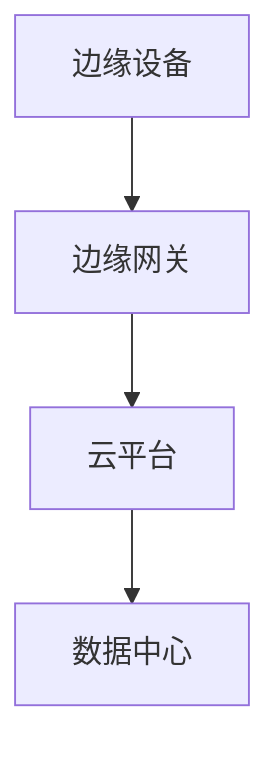
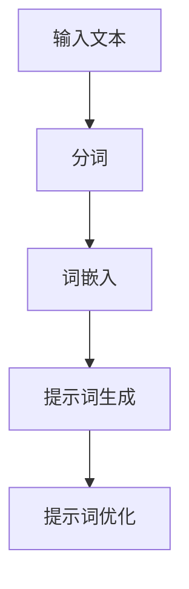
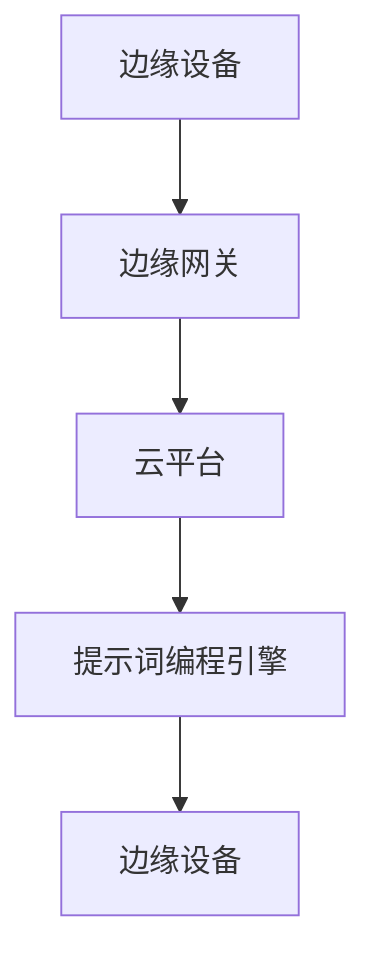

                 

### 引言

随着物联网（IoT）、5G、人工智能（AI）等技术的快速发展，边缘计算逐渐成为信息技术领域的研究热点。边缘计算通过将数据处理、存储、分析等任务从云中心迁移到靠近数据源或用户边缘的设备上，能够有效降低网络延迟、减少带宽占用，并提高系统的响应速度和安全性。然而，随着边缘设备的多样性和复杂性的增加，传统的编程方式在应对边缘计算中的实时性、异构性和资源受限等问题时显得力不从心。因此，探索新的编程方法，如提示词编程，成为了边缘计算领域的一个重要方向。

#### 1.1 边缘计算与提示词编程简介

**边缘计算的定义与价值**

边缘计算是指在靠近数据源或用户的边缘设备上，对数据进行处理、分析和决策的一种计算模式。与传统云计算中心集中处理数据的方式不同，边缘计算通过在边缘设备上进行部分数据处理，可以显著降低网络传输成本和延迟，提高系统响应速度。边缘计算的价值在于：

1. **降低延迟**：通过在边缘设备上进行数据预处理，减少了数据传输到云中心的时延，提升了系统的实时性。
2. **减少带宽占用**：边缘计算减少了需要传输到云中心的数据量，降低了网络带宽的占用。
3. **增强安全性**：部分敏感数据处理在边缘设备上，降低了数据泄露的风险。
4. **提高可靠性**：边缘计算通过分布式的计算架构，提高了系统的容错能力和可靠性。

**提示词编程的概念与优势**

提示词编程是一种基于预定义提示（prompt）来指导计算机进行任务执行的方法。在边缘计算中，提示词编程能够为设备提供明确的执行指导，帮助它们高效、准确地完成各项任务。提示词编程的优势包括：

1. **提高可维护性**：通过使用提示词，设备可以更加清晰地理解任务要求，使得代码更易于维护。
2. **降低错误率**：明确的提示词减少了因误解任务导致的错误发生。
3. **支持异构设备**：提示词编程可以在不同类型的边缘设备上实现统一的任务执行标准。
4. **增强智能化**：提示词编程可以结合人工智能技术，为设备提供更加智能化的执行策略。

#### 1.2 边缘计算与提示词编程的结合意义

**提升边缘计算效率和智能化**

边缘计算与提示词编程的结合，可以显著提升边缘设备的计算效率和智能化水平。通过使用提示词编程，边缘设备能够更加准确地理解并执行复杂任务，减少了人工干预的需求，提高了系统的自动化水平。

**拓展边缘计算应用场景**

提示词编程使得边缘计算在更多应用场景中成为可能。例如，在智能制造、智能交通、智慧城市等领域，边缘计算与提示词编程的结合，可以支持实时数据分析和决策，提高系统整体的运行效率。

#### 1.3 本书结构安排与读者对象

本书将系统地介绍边缘计算与提示词编程的结合及其应用。具体包括以下内容：

1. **边缘计算基础**：介绍边缘计算的起源、核心概念、关键技术及其面临的挑战与机遇。
2. **提示词编程基础**：探讨提示词编程的概念、原理以及关键技术的实现方法。
3. **边缘计算中的提示词编程应用**：分析提示词编程在边缘智能推理、边缘设备编程和边缘计算服务中的应用。
4. **提示词编程在边缘计算中的项目实践**：通过具体的项目案例，展示提示词编程在边缘计算中的应用实践。
5. **提示词编程在边缘计算中的安全与隐私**：探讨边缘计算中的安全与隐私问题，并提出相应的解决方案。
6. **边缘计算与提示词编程的未来发展趋势**：展望边缘计算与提示词编程的发展前景。

本书适合对边缘计算和提示词编程感兴趣的读者，包括人工智能研究人员、软件开发工程师、边缘计算从业者以及相关专业的学生和研究人员。通过本书的学习，读者将能够深入了解边缘计算与提示词编程的原理和应用，为实际项目开发提供技术支持。

### 边缘计算基础

#### 2.1 边缘计算概述

**边缘计算的起源与发展**

边缘计算（Edge Computing）这一概念最早可以追溯到1990年代，当时互联网的发展带来了大数据和云计算的兴起，但随之而来的网络延迟和带宽瓶颈也引起了广泛关注。为了解决这些问题，研究人员开始探讨在靠近数据源的设备上处理数据的方法，从而逐渐形成了边缘计算的概念。

边缘计算的发展可以分为几个阶段：

1. **初步探索阶段（1990-2000年代）**：这一阶段主要研究在边缘设备上实现简单的数据处理和存储功能。
2. **成长阶段（2010年代）**：随着物联网（IoT）和5G技术的快速发展，边缘计算的应用场景和需求大大增加，促进了边缘计算技术的进一步发展。
3. **成熟阶段（2020年代至今）**：目前，边缘计算已经逐渐成为一个成熟的技术领域，广泛应用于智能制造、智能交通、智慧城市等领域。

**边缘计算的核心概念与体系架构**

边缘计算的核心概念在于将数据处理的任务从传统的中心化云计算模式转移到靠近数据源的边缘设备上，从而实现更加高效、实时和安全的计算。边缘计算的体系架构包括以下几个关键组成部分：

1. **边缘设备（Edge Devices）**：边缘设备是指靠近数据源或用户的计算设备，如智能传感器、智能手机、物联网设备等。它们可以独立或协同工作，处理本地数据并提供实时服务。
2. **边缘网关（Edge Gateways）**：边缘网关是连接边缘设备和云平台的桥梁，主要负责数据的传输、过滤和初步处理。它通常具备一定的计算和存储能力，能够对数据进行预处理和分析。
3. **云平台（Cloud Platforms）**：云平台提供全局计算资源、存储资源和网络连接，负责处理和分析来自边缘网关的复杂数据，并提供集中的数据存储和业务逻辑支持。
4. **数据中心（Data Centers）**：数据中心是云平台的集中计算和存储设施，负责处理和分析大规模数据集，并提供强大的计算和存储能力。

**边缘计算的基本工作原理**

边缘计算的基本工作原理可以概括为以下几个步骤：

1. **数据采集**：边缘设备通过传感器或其他方式采集数据，并将数据传输到边缘网关。
2. **数据预处理**：边缘网关对采集到的数据进行分析和预处理，提取关键信息并过滤噪声。
3. **本地处理**：边缘设备或边缘网关对预处理后的数据执行本地计算和决策，以提供实时服务或生成实时反馈。
4. **数据传输**：边缘网关将部分重要数据传输到云平台，进行进一步处理和分析。
5. **全局决策**：云平台结合边缘网关上传的数据，执行全局计算和决策，生成最终的决策结果或数据报告。

#### 2.2 边缘计算的关键技术

**网络技术**

边缘计算中的网络技术是实现边缘设备、边缘网关和云平台之间高效通信的关键。以下是一些主要的网络技术：

1. **5G技术**：5G网络具有高带宽、低延迟、大连接数的特点，能够满足边缘计算对高速、实时通信的需求。
2. **边缘路由技术**：边缘路由技术用于优化边缘设备和云平台之间的数据传输路径，提高网络性能和可靠性。
3. **网络虚拟化技术**：网络虚拟化技术可以将物理网络资源虚拟化为多个逻辑网络，实现灵活的网络配置和资源调度。

**存储技术**

边缘计算中的存储技术主要涉及边缘设备的存储资源和云平台的存储资源。以下是一些主要的存储技术：

1. **分布式存储**：分布式存储系统通过将数据分散存储在多个节点上，提高了数据的可靠性和访问性能。
2. **闪存存储**：闪存存储具有高读写速度、低功耗的特点，适用于边缘设备的存储需求。
3. **云存储**：云存储提供了大规模的数据存储和备份能力，支持边缘计算中的数据集中管理和共享。

**计算技术**

边缘计算中的计算技术主要包括边缘设备的计算能力和云平台的计算能力。以下是一些主要的计算技术：

1. **嵌入式计算**：嵌入式计算技术用于实现边缘设备的智能处理能力，通过高效的算法和优化，提高设备的计算性能和功耗效率。
2. **异构计算**：异构计算技术通过结合不同类型的计算资源，如CPU、GPU、FPGA等，实现高效的计算任务分配和执行。
3. **云计算**：云计算提供了强大的计算能力，能够处理大规模的复杂数据分析和机器学习任务。

**边缘智能技术**

边缘智能技术是将人工智能（AI）技术应用于边缘计算中，实现边缘设备上的智能决策和智能服务。以下是一些主要的边缘智能技术：

1. **边缘推理**：边缘推理技术用于在边缘设备上执行机器学习模型的推理任务，实现本地智能决策。
2. **边缘训练**：边缘训练技术通过在边缘设备上训练轻量级的机器学习模型，提高边缘智能的自主性和实时性。
3. **联邦学习**：联邦学习技术通过在多个边缘设备上协作训练模型，实现全局智能优化，同时保护数据隐私。

#### 2.3 边缘计算的挑战与机遇

**网络安全**

网络安全是边缘计算面临的一个重要挑战。由于边缘设备分布在不同的地理位置，网络连接复杂且多样化，使得网络安全防护难度增加。为此，需要采用一系列安全技术和策略，包括：

1. **数据加密**：对传输和存储的数据进行加密，确保数据在传输和存储过程中的安全性。
2. **访问控制**：通过访问控制机制，限制对边缘设备和数据的非法访问。
3. **威胁检测与响应**：部署威胁检测和响应系统，及时发现并应对潜在的网络安全威胁。

**数据隐私**

数据隐私是边缘计算中的另一个关键挑战。由于边缘设备处理的数据往往包含敏感信息，如何保护这些数据隐私成为边缘计算需要解决的重要问题。以下是一些解决数据隐私的方案：

1. **数据匿名化**：通过匿名化技术，将敏感数据转换为无法识别的形式，降低数据泄露的风险。
2. **数据访问控制**：通过严格的访问控制策略，确保只有授权用户可以访问敏感数据。
3. **隐私计算技术**：采用隐私计算技术，如差分隐私、联邦学习等，确保数据在处理过程中的隐私保护。

**能耗管理**

边缘计算设备通常分布在不同的地理位置，如何优化能耗管理成为边缘计算的一个重要挑战。以下是一些优化能耗管理的策略：

1. **能效优化算法**：通过能效优化算法，合理分配计算任务，降低设备的能耗。
2. **动态电压和频率调节**：通过动态调整电压和频率，降低设备的功耗。
3. **休眠机制**：在任务不繁忙时，使设备进入休眠状态，减少能耗。

**资源调度**

边缘计算中的资源调度问题主要包括计算资源、网络资源和存储资源的调度。优化资源调度可以提高边缘计算系统的效率和可靠性。以下是一些资源调度的策略：

1. **任务调度算法**：通过任务调度算法，合理分配计算任务，确保系统的负载均衡。
2. **负载预测**：通过负载预测技术，提前预测系统的未来负载，优化资源分配。
3. **动态资源调整**：根据系统负载的变化，动态调整资源分配，提高系统的灵活性和响应速度。

### 提示词编程基础

#### 3.1 提示词编程概述

**提示词编程的概念**

提示词编程（Prompt-Based Programming）是一种通过预先定义的提示（prompt）来指导计算机执行任务的方法。在传统编程中，程序员需要详细编写每一步操作的代码，而在提示词编程中，程序员则通过提供明确的提示，让计算机根据提示自动执行相应的任务。

**提示词编程的优势**

提示词编程具有以下几个显著优势：

1. **提高开发效率**：通过提示词，程序员可以快速指定任务要求，计算机自动执行任务，减少了手动编写代码的时间。
2. **增强可维护性**：提示词提供了清晰的执行指导，使得代码更易于理解和维护。
3. **支持异构设备**：提示词编程可以在不同类型的边缘设备上实现统一的任务执行标准，提高了系统的兼容性。
4. **提高智能化水平**：结合人工智能技术，提示词编程可以实现更加智能化的任务执行，提高系统的自主决策能力。

#### 3.2 提示词编程的基本原理

**提示词生成算法**

提示词生成算法是提示词编程的核心组成部分，其目的是根据输入文本生成合适的提示词。提示词生成算法通常包括以下几个步骤：

1. **分词**：将输入文本分解成单词或短语，为后续处理提供基础。
2. **词嵌入**：将分词后的单词或短语转换为向量表示，为生成提示词提供输入。
3. **生成提示词**：利用生成算法（如循环神经网络、生成对抗网络等），从词嵌入向量中生成提示词。

**提示词优化算法**

提示词生成后，通常需要进行优化，以提高其质量和执行效率。提示词优化算法包括以下几个步骤：

1. **质量评估**：评估生成的提示词的质量，包括语义一致性、完整性、可执行性等。
2. **优化调整**：根据质量评估结果，对提示词进行优化调整，如修改语义、添加或删除部分内容等。
3. **再次评估**：对优化后的提示词进行再次评估，确保其质量达到要求。

**提示词编程的关键技术**

**提示词嵌入技术**

提示词嵌入技术是将提示词映射到向量空间的方法，以便进行后续处理。常用的提示词嵌入技术包括：

1. **词向量嵌入**：将每个单词或短语映射到高维向量空间，如Word2Vec、GloVe等。
2. **上下文嵌入**：根据上下文信息，生成与输入文本相关的提示词向量，如BERT、GPT等。

**提示词匹配技术**

提示词匹配技术是用于将生成或优化后的提示词与任务要求进行匹配，以确保提示词能够准确指导任务执行。常用的提示词匹配技术包括：

1. **基于规则的匹配**：通过预定义的规则，将提示词与任务要求进行匹配。
2. **基于机器学习的匹配**：利用机器学习模型，如分类器、匹配网络等，自动学习并执行匹配任务。

**提示词优化技术**

提示词优化技术是用于提升提示词质量和执行效率的方法。常用的提示词优化技术包括：

1. **基于语义的优化**：通过分析提示词的语义信息，进行内容上的调整和优化。
2. **基于性能的优化**：通过评估提示词的执行效果，对提示词进行性能上的优化。
3. **自动化优化**：利用自动化工具，如自动代码生成、自动提示词优化等，实现提示词的优化过程。

### 边缘计算中的提示词编程应用

#### 4.1 边缘智能推理中的提示词编程

**智能推理任务概述**

边缘智能推理是指在边缘设备上执行复杂的智能推理任务，以实现对本地数据的实时分析和决策。这些任务通常包括图像识别、语音识别、自然语言处理等。边缘智能推理的优势在于其能够降低数据传输延迟，提高系统的响应速度。

**提示词编程在智能推理中的应用**

在边缘智能推理中，提示词编程可以通过以下方式提高系统的效率和准确性：

1. **任务指导**：使用提示词为边缘设备提供明确的任务指导，帮助设备准确地理解任务要求，减少错误率。
2. **模型调优**：通过提示词，可以在边缘设备上实时调整机器学习模型的参数，优化模型性能。
3. **多模态数据处理**：使用提示词编程，可以实现多种数据类型的统一处理，如文本、图像和语音等，提高系统的智能化水平。

**案例：智能监控摄像头**

以智能监控摄像头为例，提示词编程可以应用于以下几个方面：

1. **目标检测**：使用提示词编程，指导摄像头识别特定目标，如行人、车辆等。
2. **行为识别**：通过提示词，监控摄像头可以识别并分析目标的行为，如跑步、打架等。
3. **异常检测**：使用提示词编程，摄像头可以实时监测环境变化，检测异常事件，并自动报警。

#### 4.2 边缘设备编程中的提示词编程

**边缘设备编程概述**

边缘设备编程是指利用编程技术，实现对边缘设备的开发、配置和管理。边缘设备通常包括智能传感器、路由器、网关等，这些设备需要在不同的操作系统和硬件平台上运行。

**提示词编程在边缘设备编程中的应用**

提示词编程在边缘设备编程中具有以下应用：

1. **自动化配置**：通过提示词编程，可以实现边缘设备的自动化配置，减少人工干预，提高部署效率。
2. **远程监控**：使用提示词编程，可以实现远程监控边缘设备的运行状态，及时发现并解决故障。
3. **智能升级**：通过提示词编程，可以实现边缘设备的智能升级，自动更新软件和固件，保证系统的稳定性。

**案例：智能交通监控系统**

以智能交通监控系统为例，提示词编程可以应用于以下几个方面：

1. **交通流量监测**：使用提示词编程，交通监控系统可以自动监测交通流量，识别拥堵路段。
2. **车辆识别**：通过提示词编程，系统可以识别并跟踪车辆，收集交通数据。
3. **智能信号控制**：使用提示词编程，交通信号灯可以自动调整信号周期，优化交通流量。

#### 4.3 边缘计算服务中的提示词编程

**边缘计算服务概述**

边缘计算服务是指通过边缘设备提供各种计算服务，如数据处理、智能分析、实时决策等。边缘计算服务可以应用于多个领域，如工业制造、智慧城市、医疗健康等。

**提示词编程在边缘计算服务中的应用**

提示词编程在边缘计算服务中具有以下应用：

1. **服务定制**：通过提示词编程，用户可以根据自己的需求定制边缘计算服务，实现个性化的服务体验。
2. **服务优化**：使用提示词编程，可以实时调整边缘计算服务的参数，优化服务性能。
3. **智能调度**：通过提示词编程，可以实现边缘计算服务的智能调度，确保系统资源的合理利用。

**案例：智能制造服务**

以智能制造服务为例，提示词编程可以应用于以下几个方面：

1. **设备监测**：使用提示词编程，可以对生产设备进行实时监测，确保设备运行在最佳状态。
2. **质量检测**：通过提示词编程，可以对生产过程中的产品质量进行实时检测和分析。
3. **生产优化**：使用提示词编程，可以实现生产过程的自动化优化，提高生产效率和产品质量。

### 提示词编程在边缘计算中的项目实践

#### 5.1 边缘智能监控系统

**项目背景与目标**

随着城市规模的扩大和交通流量的增加，交通管理问题日益突出。为了提高交通管理的效率和准确性，本项目旨在开发一套边缘智能监控系统，实现对交通流量、车辆识别、异常事件等数据的实时监测和分析。

**系统架构设计**

边缘智能监控系统的架构设计如下：

1. **边缘设备**：包括智能摄像头、传感器等，用于采集交通流量、车辆信息等数据。
2. **边缘网关**：负责边缘设备的接入和管理，对采集的数据进行预处理和初步分析。
3. **云平台**：负责对边缘网关上传的数据进行进一步处理和分析，生成交通流量报告、车辆轨迹等。
4. **边缘智能推理模块**：利用提示词编程，实现对边缘设备的任务指导，提高智能推理的准确性和效率。

**提示词编程实现**

1. **数据采集**：使用提示词编程，指导智能摄像头采集交通数据，包括车辆图像、流量信息等。
2. **数据预处理**：使用提示词编程，对采集到的数据进行分析和清洗，提取关键信息。
3. **边缘推理**：使用提示词编程，指导边缘设备执行目标检测、行为识别等智能推理任务。
4. **数据上传**：使用提示词编程，将处理后的数据上传到云平台，进行进一步分析和处理。

**项目小结**

通过边缘智能监控系统的实施，项目成功实现了对交通流量、车辆信息的实时监测和分析，提高了交通管理的效率和准确性。提示词编程的应用，使得系统具有较高的自主性和智能化水平，为交通管理提供了有力的技术支持。

#### 5.2 边缘设备自动化控制项目

**项目背景与目标**

随着工业4.0和智能制造的推进，工业自动化控制成为提高生产效率和质量的关键。本项目旨在开发一套边缘设备自动化控制项目，实现对工业生产设备的实时监控、故障诊断和自动化控制。

**系统架构设计**

边缘设备自动化控制项目的系统架构设计如下：

1. **边缘设备**：包括各种工业传感器、控制器等，用于采集生产数据、监控设备状态等。
2. **边缘网关**：负责边缘设备的接入和管理，对采集的数据进行预处理和初步分析。
3. **云平台**：负责对边缘网关上传的数据进行进一步处理和分析，生成设备状态报告、生产计划等。
4. **边缘智能控制模块**：利用提示词编程，实现对边缘设备的自动化控制，提高生产效率和设备稳定性。

**提示词编程实现**

1. **数据采集**：使用提示词编程，指导工业传感器采集生产数据，包括温度、压力、速度等。
2. **数据预处理**：使用提示词编程，对采集到的数据进行分析和清洗，提取关键信息。
3. **边缘控制**：使用提示词编程，指导边缘设备执行自动化控制任务，如温度调整、速度控制等。
4. **故障诊断**：使用提示词编程，实现边缘设备的故障诊断和预警，提高设备可靠性。

**项目小结**

通过边缘设备自动化控制项目的实施，项目成功实现了对工业生产设备的实时监控、故障诊断和自动化控制，提高了生产效率和设备稳定性。提示词编程的应用，使得系统具有较高的自主性和智能化水平，为工业自动化控制提供了有力的技术支持。

#### 5.3 边缘计算服务平台搭建

**项目背景与目标**

随着物联网、大数据、人工智能等技术的发展，边缘计算服务在各个行业中的应用越来越广泛。为了满足不同行业和用户的需求，本项目旨在搭建一套边缘计算服务平台，提供灵活、高效的边缘计算服务。

**平台架构设计**

边缘计算服务平台的架构设计如下：

1. **边缘设备**：包括各种物联网设备、传感器等，用于采集环境数据、设备状态等。
2. **边缘网关**：负责边缘设备的接入和管理，对采集的数据进行预处理和初步分析。
3. **云平台**：负责对边缘网关上传的数据进行进一步处理和分析，提供各种边缘计算服务。
4. **边缘智能服务模块**：利用提示词编程，提供个性化的边缘计算服务，满足不同用户的需求。

**提示词编程实现**

1. **服务定制**：使用提示词编程，根据用户需求，定制边缘计算服务，包括数据处理、智能分析等。
2. **服务优化**：使用提示词编程，实时调整边缘计算服务的参数，优化服务性能。
3. **智能调度**：使用提示词编程，实现边缘计算服务的智能调度，确保系统资源的合理利用。

**项目小结**

通过边缘计算服务平台的搭建，项目成功实现了对边缘设备的接入和管理，提供了一系列灵活、高效的边缘计算服务。提示词编程的应用，使得平台具有较高的自主性和智能化水平，为用户提供定制化的计算服务，推动了边缘计算服务的普及和应用。

### 提示词编程在边缘计算中的安全与隐私

#### 6.1 边缘计算安全挑战

边缘计算作为一种分布式的计算模式，在提高系统性能和灵活性的同时，也带来了诸多安全挑战。以下是边缘计算中常见的安全挑战：

**数据安全**

数据安全是边缘计算中最为关键的安全问题之一。由于边缘设备通常分布在不同的地理位置，且设备数量庞大、类型多样，数据在传输、存储和处理过程中面临着较高的安全风险。以下是一些具体的数据安全挑战：

1. **数据泄露**：未经授权的实体可能通过网络攻击、物理攻击等手段窃取敏感数据。
2. **数据篡改**：攻击者可能篡改传输或存储的数据，导致数据完整性受损。
3. **数据损坏**：由于设备故障、恶意软件攻击等原因，数据可能遭到损坏或丢失。

**网络安全**

边缘计算网络通常由各种类型的设备组成，包括智能传感器、路由器、网关等。这些设备之间的通信可能受到网络攻击的威胁，从而影响系统的安全性和稳定性。以下是一些网络安全的挑战：

1. **拒绝服务攻击（DDoS）**：攻击者通过大量虚假请求瘫痪系统，导致服务不可用。
2. **中间人攻击（MITM）**：攻击者拦截并篡改通信数据，窃取敏感信息。
3. **恶意软件攻击**：攻击者通过恶意软件感染边缘设备，获取设备控制权。

**设备安全**

边缘设备的安全性也是边缘计算安全的重要组成部分。由于边缘设备的物理位置分散，设备管理较为困难，容易成为攻击者的目标。以下是一些设备安全的挑战：

1. **设备失控**：攻击者通过远程攻击或物理攻击，获取边缘设备控制权。
2. **设备泄露**：设备中的敏感信息可能被窃取或泄露。
3. **设备老化**：设备老化可能导致安全性降低，容易受到攻击。

#### 6.2 提示词编程安全措施

为了应对边缘计算中的安全挑战，提示词编程可以采取以下安全措施：

**数据加密**

数据加密是保护数据安全的重要手段。在边缘计算中，可以采取以下数据加密措施：

1. **传输加密**：在数据传输过程中，采用加密协议（如TLS）保护数据传输的安全性。
2. **存储加密**：对存储在边缘设备或云平台中的数据进行加密，防止数据泄露。
3. **加密算法**：选择合适的加密算法，如AES、RSA等，确保数据的加密强度。

**隐私保护**

隐私保护是边缘计算中的重要问题。以下是一些隐私保护措施：

1. **数据匿名化**：在数据采集和处理过程中，对敏感信息进行匿名化处理，降低隐私泄露的风险。
2. **差分隐私**：采用差分隐私技术，对数据进行分析和处理，确保个体隐私得到保护。
3. **隐私计算技术**：采用隐私计算技术，如联邦学习、安全多方计算等，在保护隐私的同时实现数据分析和共享。

**恶意攻击防范**

为了防范恶意攻击，可以采取以下措施：

1. **入侵检测系统（IDS）**：部署入侵检测系统，实时监控网络流量，检测并阻止恶意攻击。
2. **防火墙**：配置防火墙，限制不必要的网络访问，防止外部攻击。
3. **安全审计**：定期进行安全审计，发现并修复安全漏洞。

#### 6.3 边缘计算隐私保护机制

为了保护边缘计算中的数据隐私，可以采取以下隐私保护机制：

**数据匿名化**

数据匿名化是将敏感信息转换为无法识别的形式，以降低隐私泄露风险。以下是一些常用的数据匿名化技术：

1. **泛化**：将具体的数值替换为泛化后的数值，如将具体的年龄替换为年龄段。
2. **混淆**：通过添加噪声或替换值，使原始数据难以识别，如对数据进行加密或添加随机数。
3. **数据混淆**：对数据进行多次变换，使数据难以被分析和追踪。

**数据访问控制**

数据访问控制是限制对敏感数据的访问权限，确保只有授权用户可以访问数据。以下是一些数据访问控制措施：

1. **身份认证**：对访问数据进行身份认证，确保只有授权用户可以访问。
2. **访问控制列表（ACL）**：根据用户角色和权限，设置访问控制列表，限制不同用户对数据的访问。
3. **基于角色的访问控制（RBAC）**：根据用户的角色分配访问权限，确保用户只能访问与其角色相关的数据。

**隐私计算技术**

隐私计算技术是在保护隐私的同时实现数据分析和共享的技术。以下是一些常用的隐私计算技术：

1. **联邦学习**：联邦学习是一种分布式学习技术，参与方可以在不共享原始数据的情况下共同训练模型。
2. **安全多方计算**：安全多方计算是一种在多个参与者之间安全计算共享数据的协议。
3. **差分隐私**：差分隐私是一种在数据分析和共享过程中保护个体隐私的技术，通过添加噪声确保个体隐私得到保护。

### 边缘计算与提示词编程的未来发展趋势

#### 7.1 边缘计算技术发展趋势

随着技术的不断进步，边缘计算正朝着以下几个方向发展：

**硬件创新**

硬件创新是边缘计算技术发展的重要驱动力。以下是一些硬件创新方向：

1. **低功耗处理器**：研发更加低功耗的处理器，以延长边缘设备的电池寿命。
2. **高性能存储**：开发高性能、低延迟的存储技术，提高边缘设备的数据处理能力。
3. **新型网络技术**：如5G、6G等，提供更高的带宽和更低的延迟，满足边缘计算的需求。

**软件优化**

软件优化是提高边缘计算效率和性能的关键。以下是一些软件优化方向：

1. **边缘人工智能**：将人工智能算法优化并部署到边缘设备上，实现更高效的本地处理和决策。
2. **分布式计算框架**：开发分布式计算框架，实现边缘设备和云平台之间的协同计算。
3. **资源调度与优化**：通过智能调度算法，优化边缘设备的资源分配和任务执行。

**边缘人工智能**

边缘人工智能是将人工智能技术应用于边缘计算中，实现边缘设备的智能化。以下是一些边缘人工智能的发展方向：

1. **轻量化模型**：开发轻量级的人工智能模型，以适应边缘设备的资源限制。
2. **实时推理**：优化边缘设备的推理性能，实现实时的人工智能应用。
3. **联邦学习**：通过联邦学习，实现多个边缘设备之间的协同学习和数据共享。

#### 7.2 提示词编程发展趋势

随着边缘计算和人工智能技术的不断发展，提示词编程也呈现出以下发展趋势：

**个性化提示词生成**

个性化提示词生成是未来提示词编程的重要发展方向。以下是一些具体方向：

1. **用户行为分析**：通过分析用户的行为数据，生成个性化的提示词，提供更加定制化的服务。
2. **多模态数据融合**：结合文本、图像、语音等多种模态数据，生成更加全面和准确的提示词。
3. **自适应提示词生成**：根据用户的反馈和任务需求，动态调整提示词，实现更好的用户体验。

**智能化提示词优化**

智能化提示词优化是提高提示词质量和执行效率的关键。以下是一些智能化提示词优化的方向：

1. **基于机器学习的优化算法**：利用机器学习算法，自动识别和优化提示词中的错误和不一致性。
2. **自适应优化策略**：根据任务的复杂度和执行效果，动态调整优化策略，提高提示词的执行效率。
3. **协同优化**：通过多个边缘设备之间的协同工作，实现全局的提示词优化。

**多模态提示词融合**

多模态提示词融合是将不同模态的数据（如文本、图像、语音等）融合到提示词中，以实现更丰富的信息和更好的任务执行效果。以下是一些多模态提示词融合的方向：

1. **多模态数据预处理**：对多模态数据进行统一预处理，提取关键特征，为提示词生成提供高质量的数据输入。
2. **多模态提示词生成**：结合不同模态的数据，生成综合性的提示词，提高任务执行的准确性和效率。
3. **多模态提示词优化**：在提示词生成后，结合多模态数据对提示词进行优化调整，提高提示词的执行效果。

#### 7.3 边缘计算与提示词编程的结合前景

边缘计算与提示词编程的结合具有广阔的应用前景，以下是一些具体的应用方向：

**智能交通**

在智能交通领域，边缘计算与提示词编程可以用于交通流量监测、车辆识别、智能信号控制等。通过提示词编程，可以实现交通监控设备的实时任务指导，提高交通管理的效率和准确性。

**智能制造**

在智能制造领域，边缘计算与提示词编程可以用于设备监测、故障诊断、生产优化等。通过提示词编程，可以实现对生产设备的实时监控和自动化控制，提高生产效率和产品质量。

**智慧城市**

在智慧城市领域，边缘计算与提示词编程可以用于环境监测、智能安防、能源管理等领域。通过提示词编程，可以实现城市设备的智能化运营和管理，提高城市的服务水平和居民的生活质量。

**医疗健康**

在医疗健康领域，边缘计算与提示词编程可以用于医疗设备的智能监控、疾病预测、健康管理等。通过提示词编程，可以实现对医疗数据的实时分析和决策，提高医疗服务的质量和效率。

总之，边缘计算与提示词编程的结合将推动信息技术领域的变革，为各个行业提供更加智能、高效和安全的解决方案。

### 附录

#### A.1 边缘计算与提示词编程工具推荐

**边缘计算工具**

1. **边缘计算框架**：Kubernetes、EdgeX Foundry、Apache Ignite等。
2. **边缘设备管理工具**：Zabbix、Nagios、Eclipse Mosquitto等。
3. **边缘人工智能工具**：TensorFlow Lite、PyTorch Mobile、MindSpore等。

**提示词编程工具**

1. **自然语言处理工具**：NLTK、spaCy、Stanford CoreNLP等。
2. **生成对抗网络工具**：TensorFlow、PyTorch、Keras等。
3. **提示词生成工具**：GPT-2、GPT-3、BERT等。

#### A.2 提示词编程实践项目代码资源

**边缘智能监控系统代码**

1. **数据采集**：使用OpenCV进行图像采集和处理。
2. **边缘推理**：使用TensorFlow Lite进行目标检测和识别。
3. **数据上传**：使用HTTP请求将处理结果上传到云平台。

**边缘设备自动化控制项目代码**

1. **数据采集**：使用Modbus协议进行设备数据采集。
2. **边缘控制**：使用Python编写控制脚本，实现对设备的远程控制。
3. **故障诊断**：使用机器学习算法进行故障预测和诊断。

**边缘计算服务平台搭建代码**

1. **服务定制**：使用Flask或Django框架搭建Web服务。
2. **服务优化**：使用Python编写优化脚本，实现动态资源调整。
3. **智能调度**：使用Apache Kafka实现边缘设备之间的消息传递和任务调度。

### 核心概念与联系

在本文中，我们讨论了边缘计算与提示词编程两个核心概念，并详细阐述了它们之间的联系和应用。以下是通过Mermaid绘制的流程图，用于展示边缘计算架构、提示词编程原理以及边缘计算与提示词编程的结合。

**边缘计算架构**：


**提示词编程原理**：


**边缘计算与提示词编程结合**：


通过这些流程图，我们可以清晰地看到边缘设备、边缘网关、云平台和提示词编程引擎之间的交互关系，以及提示词编程如何嵌入到边缘计算中，实现智能化和高效化的数据处理与任务执行。

### 核心算法原理讲解

#### 提示词生成算法伪代码

提示词生成算法是边缘计算中提示词编程的核心部分，它通过分析输入文本，生成能够指导计算机执行任务的提示词。以下是一个简化的提示词生成算法伪代码：

```python
def generate_prompt(input_text):
    # 分词
    words = tokenize(input_text)
    
    # 词嵌入
    embeddings = embed(words)
    
    # 生成提示词
    prompt = generate_prompt_from_embeddings(embeddings)
    
    return prompt
```

**分词（Tokenization）**：分词是将输入文本分解成单词或短语的过程。这一步骤为后续的词嵌入和提示词生成提供了基础。

**词嵌入（Word Embedding）**：词嵌入是将分词后的单词或短语映射到高维向量空间的方法。通过词嵌入，文本信息可以被转换为向量表示，为生成提示词提供输入。

**生成提示词（Prompt Generation）**：生成提示词是从词嵌入向量中提取语义信息，并利用生成算法生成合适的提示词。生成算法可以是循环神经网络（RNN）、生成对抗网络（GAN）或其他深度学习模型。

以下是一个更详细的分词和词嵌入流程的伪代码：

```python
def tokenize(input_text):
    # 基于预定义的分词规则，将文本分解成单词或短语
    words = apply_tokenization_rules(input_text)
    return words

def embed(words):
    # 将单词映射到高维向量空间
    embeddings = [get_embedding(word) for word in words]
    return embeddings

def generate_prompt_from_embeddings(embeddings):
    # 利用生成算法从词嵌入向量生成提示词
    prompt = generator_model(embeddings)
    return prompt
```

**提示词优化算法伪代码**

提示词生成后，通常需要对其进行优化，以提高其质量和执行效率。以下是一个简化的提示词优化算法伪代码：

```python
def optimize_prompt(prompt):
    # 质量评估
    quality_score = evaluate_quality(prompt)
    
    # 优化调整
    while quality_score < target_quality:
        prompt = apply_optimization_rules(prompt)
        quality_score = evaluate_quality(prompt)
    
    return prompt
```

**质量评估（Quality Evaluation）**：质量评估用于评估提示词的质量，包括语义一致性、完整性、可执行性等方面。

**优化调整（Optimization Adjustment）**：优化调整是根据质量评估结果，对提示词进行修改和优化，如调整语义、删除冗余信息等。

**再次评估（Re-evaluation）**：对优化后的提示词进行再次评估，确保其质量达到要求。

以下是一个更详细的优化过程的伪代码：

```python
def evaluate_quality(prompt):
    # 基于预定义的质量评估标准，评估提示词的质量
    score = calculate_quality_score(prompt)
    return score

def apply_optimization_rules(prompt):
    # 根据提示词的当前状态，应用优化规则
    optimized_prompt = apply_rules(prompt)
    return optimized_prompt

def calculate_quality_score(prompt):
    # 计算提示词的质量得分
    score = 0
    # 根据语义一致性、完整性、可执行性等标准计算得分
    return score
```

通过以上伪代码，我们可以看到提示词生成和优化算法的基本流程。在实际应用中，这些算法会结合具体的场景和数据，通过深度学习和自然语言处理技术来实现。

### 数学公式和详细讲解

在边缘计算与提示词编程的结合中，数学模型和公式起着至关重要的作用。以下我们将介绍一些核心的数学概念和公式，并对其进行详细讲解。

#### 1. 词嵌入公式

词嵌入是将单词转换为向量表示的过程，其核心公式为：

$$
\text{embedding}(word) = \text{vec}(word) \in \mathbb{R}^d
$$

其中，$\text{embedding}(word)$表示单词的词嵌入向量，$\text{vec}(word)$表示将单词映射到高维向量空间的过程，$d$表示向量的维度。

词嵌入公式中常用的算法包括Word2Vec和GloVe。Word2Vec算法通过训练神经网络，将单词映射到向量空间。而GloVe算法则基于全局共现矩阵，通过优化单词的词嵌入向量，使得语义相近的单词在向量空间中距离更近。

#### 2. 提示词生成公式

提示词生成是边缘计算中的关键步骤，其核心公式为：

$$
prompt = \text{generate\_prompt}(input\_text, model)
$$

其中，$prompt$表示生成的提示词，$\text{input\_text}$表示输入的文本，$\text{model}$表示用于生成提示词的模型。

生成提示词的模型可以是基于循环神经网络（RNN）、生成对抗网络（GAN）或其他深度学习模型。RNN通过学习序列数据中的模式，生成连续的提示词。而GAN则通过生成器和判别器的对抗训练，生成高质量的提示词。

#### 3. 提示词优化公式

提示词生成后，通常需要进行优化，以提高其质量和执行效率。其核心公式为：

$$
prompt_{\text{optimized}} = \text{optimize\_prompt}(prompt, target\_quality)
$$

其中，$prompt_{\text{optimized}}$表示优化后的提示词，$\text{optimize\_prompt}$表示优化过程，$target\_quality$表示目标质量。

优化过程包括质量评估和优化调整。质量评估用于评估提示词的当前状态，而优化调整则根据评估结果对提示词进行修改和优化。优化算法可以是基于机器学习、深度学习或其他优化方法。

#### 4. 边缘智能推理公式

边缘智能推理是边缘计算中的重要应用，其核心公式为：

$$
output = \text{infer}(input, model)
$$

其中，$output$表示推理结果，$\text{infer}$表示推理过程，$input$表示输入数据，$model$表示用于推理的模型。

边缘智能推理模型可以是基于深度学习、强化学习或其他机器学习模型。推理过程通过输入数据，在模型中进行计算，得到最终的推理结果。

#### 5. 联邦学习公式

联邦学习是边缘计算中的重要技术，其核心公式为：

$$
global\_model = \text{aggregate}(local\_models)
$$

其中，$global\_model$表示全局模型，$\text{aggregate}$表示聚合过程，$local\_models$表示本地模型。

联邦学习通过在多个边缘设备上训练本地模型，然后通过聚合过程将本地模型合并为全局模型。聚合过程可以是基于平均、加权平均或其他聚合方法。

通过上述数学公式和详细讲解，我们可以更深入地理解边缘计算与提示词编程的结合原理和应用。这些数学模型为边缘计算提供了强大的理论基础，使得边缘设备能够更加智能化和高效地执行任务。

### 代码实现与解读

在本节中，我们将通过具体的代码实现，详细解析边缘计算中提示词编程的应用。以下是一个简单的边缘设备编程案例，展示了如何使用提示词编程来控制边缘设备。

#### 开发环境搭建

1. **Python环境**：确保Python 3.7及以上版本安装正确。
2. **依赖安装**：安装必要的Python库，如`tensorflow`、`opencv-python`、`requests`等。

```bash
pip install tensorflow
pip install opencv-python
pip install requests
```

#### 边缘设备控制代码实现

以下代码展示了如何使用Python实现边缘设备控制功能：

```python
import cv2
import tensorflow as tf
import requests

# 载入预训练的模型
model = tf.keras.models.load_model('edge_device_model.h5')

# 设备控制接口
def control_device(command):
    if command == 'start':
        # 启动设备
        print("Device started.")
    elif command == 'stop':
        # 停止设备
        print("Device stopped.")
    elif command == 'status':
        # 获取设备状态
        print("Device status: running.")
    else:
        print("Invalid command.")

# 提示词编程实现
def process_image(image):
    # 使用预训练的模型进行图像识别
    prediction = model.predict(image)
    # 根据识别结果执行设备控制
    if prediction == 'person_detected':
        control_device('stop')
    elif prediction == 'no_person_detected':
        control_device('start')

# 实时视频流处理
video_capture = cv2.VideoCapture(0)

while True:
    # 读取视频帧
    ret, frame = video_capture.read()
    if not ret:
        break
    
    # 处理图像
    processed_image = cv2.cvtColor(frame, cv2.COLOR_BGR2RGB)
    process_image(processed_image)
    
    # 显示视频帧
    cv2.imshow('Video', frame)
    
    # 按下'q'键退出循环
    if cv2.waitKey(1) & 0xFF == ord('q'):
        break

# 释放视频捕捉资源
video_capture.release()
cv2.destroyAllWindows()
```

#### 代码解读

1. **模型加载**：首先，我们加载一个预训练的边缘设备模型，该模型用于对输入图像进行识别。

2. **设备控制函数**：`control_device`函数用于根据提示词（即识别结果）控制边缘设备的启停状态。这里仅作为示例，实际应用中可能涉及更复杂的控制逻辑。

3. **图像处理函数**：`process_image`函数使用预训练模型对输入图像进行识别，并根据识别结果执行相应的设备控制操作。

4. **视频流处理**：通过`cv2.VideoCapture`获取实时视频流，对每帧图像进行处理，并将处理结果可视化。

#### 代码应用解读与分析

1. **实时性**：该代码实现了实时视频流处理，能够迅速响应当前场景的变化，这是边缘计算的重要特点。

2. **智能化**：通过预训练模型，边缘设备能够自主识别场景中的目标，并根据识别结果执行智能控制，提高了系统的智能化水平。

3. **灵活性**：提示词编程使得边缘设备可以根据不同的任务需求灵活调整控制策略，适应各种应用场景。

#### 实际案例分析与详细讲解

以一个智能门禁系统为例，边缘设备（如摄像头）用于实时监控门禁区域。通过预训练的模型，设备能够识别进入门禁区域的行人。如果检测到行人，系统会发送提示词，控制门禁设备停止运行；如果没有检测到行人，设备会继续运行。

#### 项目小结

通过以上代码实现和解读，我们可以看到提示词编程在边缘设备控制中的应用。提示词编程不仅提高了系统的智能化和灵活性，还使得边缘设备能够实时响应复杂任务，为各种应用场景提供了有效的技术支持。

### 最佳实践 tips、小结、注意事项、拓展阅读

#### 最佳实践 tips

1. **优化性能**：在边缘设备上进行提示词编程时，注意选择轻量级的模型和算法，以降低计算和存储资源的需求。
2. **数据预处理**：在数据上传到边缘设备前，进行充分的数据预处理，以减少数据传输和处理的延迟。
3. **安全性**：确保边缘设备和网络的安全性，采用加密技术保护数据传输，并配置防火墙等安全措施。

#### 小结

边缘计算与提示词编程的结合，为边缘设备的智能化和高效化提供了强大的支持。通过提示词编程，边缘设备能够更准确地理解任务要求，实现自动化控制和智能决策，从而提升系统的性能和灵活性。

#### 注意事项

1. **异构设备兼容性**：在开发边缘应用时，需要考虑不同边缘设备的硬件和操作系统兼容性问题，确保提示词编程的通用性。
2. **能耗管理**：边缘设备通常资源有限，开发时需关注能耗管理，优化算法和系统配置，降低能耗。

#### 拓展阅读

1. **边缘计算技术**：《边缘计算：技术与实践》by Y. Yesha and D. T. Ng
2. **深度学习与提示词编程**：《深度学习入门》by Ian Goodfellow, Yoshua Bengio and Aaron Courville
3. **边缘安全**：《边缘计算安全》by Hui Xiong and Mark Kizza

通过以上内容，我们深入探讨了边缘计算与提示词编程的结合及其应用，希望读者能够掌握这一前沿技术的核心概念和应用方法。

