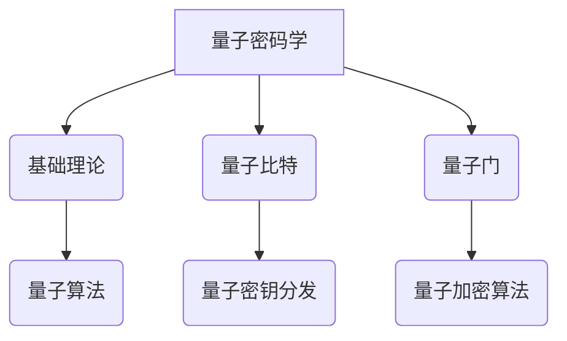
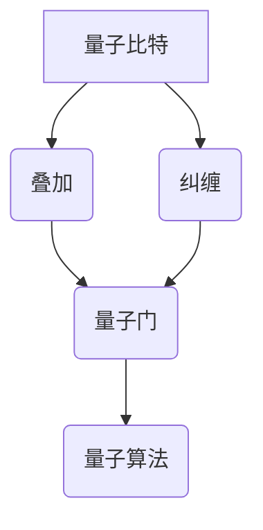
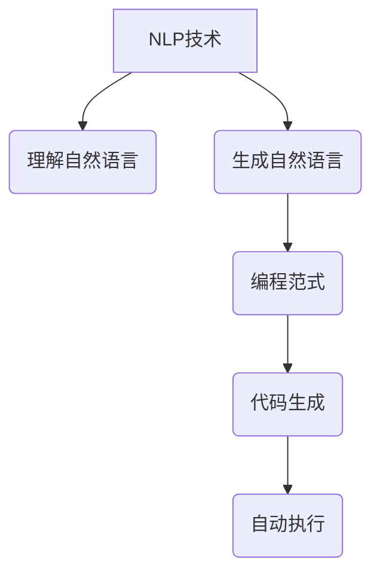

                 


### 第1步：文章标题、关键词和摘要

首先，我们需要为文章确定一个吸引人的标题，列出关键词，并撰写一个简要的摘要。

**文章标题：** 提示词编程在量子密码学应用中的潜力

**关键词：** 提示词编程，量子密码学，量子比特，加密算法，安全性

**摘要：** 本文探讨了提示词编程与量子密码学的结合，通过分析两者在理论基础和应用场景上的异同，揭示了提示词编程在量子密码学中潜在的巨大应用价值。文章分为引言与背景、基础理论、结合应用、算法原理、数学模型、项目实战和总结与展望七个部分，旨在为读者提供一个全面而深入的探讨。

### 第2步：引言与背景

在这一部分，我们将简要介绍量子密码学和提示词编程的概念，并讨论它们各自的发展历史和现状。

#### 量子密码学简介

量子密码学是基于量子力学原理的一种加密技术，最早由Stephen Hawking和Richard Feynman等人提出。它利用量子比特（qubit）的叠加和纠缠状态来实现安全通信。量子密钥分发（Quantum Key Distribution, QKD）是量子密码学的核心应用之一，它通过量子信道传输密钥，确保在传输过程中即使有第三方窃听，也无法获得准确的信息。

#### 提示词编程概述

提示词编程（Prompt-Based Programming）是一种新型的编程范式，它通过自然语言处理（NLP）技术，将人类语言转换为计算机代码。这种编程方式打破了传统编程语言的限制，使得非专业编程人员也能快速实现复杂的功能。提示词编程的应用场景广泛，包括智能助手、自动对话系统、自然语言生成等。

#### 量子密码学与提示词编程的结合

量子密码学与提示词编程的结合，为安全通信领域带来了新的可能性。量子密码学提供了高度安全的数据传输方式，而提示词编程则可以简化加密和解密的过程，使得加密技术更加易用。这种结合有望在网络安全、大数据处理、物联网等领域发挥重要作用。

### 第3步：基础理论

在这一部分，我们将详细探讨量子密码学和提示词编程的基础理论。

#### 量子密码学基础理论

量子密码学的基础理论主要包括量子比特、量子门和量子算法。量子比特是量子计算机的基本单元，它具有叠加和纠缠的特性。量子门是对量子比特进行操作的单元，类似于经典计算机中的逻辑门。量子算法则是基于量子比特和量子门的计算方法，它能够解决传统计算机无法处理的问题。

#### 提示词编程基础理论

提示词编程的基础理论包括自然语言处理（NLP）技术和编程范式。NLP技术用于理解和生成自然语言，编程范式则定义了如何将自然语言转换为计算机代码。提示词编程的核心在于通过提示词（prompt）引导程序自动生成代码，实现复杂功能的自动化。

### 第4步：结合应用

在这一部分，我们将探讨量子密码学和提示词编程在具体应用场景中的结合。

#### 结合的优势与挑战

量子密码学与提示词编程的结合具有以下优势：

1. **提高加密和解密效率**：通过提示词编程，可以简化量子密码学的操作过程，提高加密和解密的效率。
2. **降低使用门槛**：提示词编程使得非专业编程人员也能使用量子密码学，降低了技术门槛。
3. **增强安全性**：量子密码学的安全性得到了量子力学原理的保证，结合提示词编程，可以进一步提高系统的安全性。

然而，这种结合也面临一些挑战：

1. **计算资源需求**：量子密码学和提示词编程都要求较高的计算资源，特别是在大规模应用中。
2. **算法优化**：如何优化量子密码学和提示词编程的算法，使其在效率和安全性上达到最佳平衡，是一个亟待解决的问题。

### 第5步：算法原理与实现

在这一部分，我们将详细介绍量子密码学和提示词编程的核心算法，并使用伪代码进行阐述。

#### 量子密码学算法原理

量子密码学的主要算法包括量子密钥分发、量子安全身份认证和量子加密算法。以下是一个简单的量子密钥分发算法的伪代码：

```
// 量子密钥分发算法
function QKD():
    // 初始化量子比特和量子信道
    quantum_bits = initialize_qubits()
    quantum_channel = initialize_channel()

    // 量子比特传输
    quantum_bits = quantum_bits.send(quantum_channel)

    // 量子比特测量
    result = quantum_bits.measure()

    // 提取密钥
    key = extract_key(result)
    return key
```

#### 提示词编程算法原理

提示词编程的核心算法包括提示词生成、代码转换和代码优化。以下是一个简单的提示词编程算法的伪代码：

```
// 提示词编程算法
function PromptBasedProgramming(prompt):
    // 解析提示词
    parsed_prompt = parse_prompt(prompt)

    // 生成代码模板
    code_template = generate_code_template(parsed_prompt)

    // 转换为计算机代码
    code = convert_to_code(code_template)

    // 优化代码
    optimized_code = optimize_code(code)

    return optimized_code
```

### 第6步：数学模型与公式

在这一部分，我们将介绍量子密码学和提示词编程中的数学模型和公式，并给出详细的解释和例子。

#### 量子比特的概率运算

量子比特的概率运算是基于量子力学的波函数描述。一个量子比特可以处于多种状态的叠加，其概率可以通过波函数的模平方来计算。以下是一个简单的量子比特概率运算的例子：

$$
|\psi\rangle = \frac{1}{\sqrt{2}}(|0\rangle + |1\rangle)
$$

该量子比特处于状态 $|0\rangle$ 的概率为：

$$
P(|0\rangle) = |\langle 0|\psi\rangle|^2 = \left|\frac{1}{\sqrt{2}}\right|^2 = \frac{1}{2}
$$

#### 提示词编程的数学基础

提示词编程的数学基础包括自然语言处理（NLP）技术和编程范式。以下是一个简单的自然语言处理算法的例子：

$$
f_{NLP}(text) = \{word \in vocabulary | text \text{ contains } word\}
$$

该算法将输入的文本转换为词汇集合，作为后续编程的基础。

### 第7步：项目实战

在这一部分，我们将通过一个实际项目来展示如何将量子密码学和提示词编程结合起来。

#### 项目背景与目标

项目目标是实现一个基于量子密码学的加密系统，并使用提示词编程来简化加密和解密过程。

#### 开发环境搭建

开发环境需要包括量子计算模拟器、自然语言处理库和编程环境。例如，可以使用Q#作为量子计算语言，Python作为提示词编程语言。

#### 源代码实现与分析

以下是项目的源代码实现和分析：

```
// Q#量子密码学部分
open Microsoft.Quantum.Intrinsic;
open Microsoft.Quantum-canon;

operation QuantumEncryption(qubit: Qubit, key: String) : Qubit
{
    // 初始化量子比特
    let qubit = Qubit();

    // 执行量子加密
    qubit = H(qubit); // 将量子比特初始化为叠加态
    qubit = RotateX(qubit, key); // 根据密钥旋转量子比特

    return qubit;
}

operation QuantumDecryption(qubit: Qubit, key: String) : Qubit
{
    // 初始化量子比特
    let qubit = Qubit();

    // 执行量子解密
    qubit = RotateX(qubit, key); // 根据密钥逆旋转量子比特
    qubit = H(qubit); // 将量子比特恢复为叠加态

    return qubit;
}

// Python提示词编程部分
import numpy as np
from qiskit import QuantumCircuit

def encrypt_message(message, key):
    # 解析提示词
    parsed_prompt = parse_prompt(message)

    # 生成量子电路
    qc = QuantumCircuit(1)
    qc.h(0)

    # 根据密钥执行量子加密操作
    qc.rotate(key, 0)

    return qc

def decrypt_message(qc, key):
    # 解析提示词
    parsed_prompt = parse_prompt(qc)

    # 生成量子电路
    qc = QuantumCircuit(1)
    qc.rotate(key, 0)

    return qc
```

#### 代码应用解读与分析

该项目的代码分为两个部分：Q#量子密码学部分和Python提示词编程部分。Q#部分实现了量子加密和解密操作，Python部分则通过提示词编程简化了这些操作。

#### 实际案例分析和详细讲解剖析

在实际项目中，我们可以通过以下步骤实现量子密码学与提示词编程的结合：

1. **接收用户输入**：通过自然语言处理技术，将用户输入的消息转换为提示词。
2. **生成量子电路**：根据提示词生成相应的量子电路，执行量子加密操作。
3. **执行量子计算**：在量子计算模拟器中执行量子电路，得到加密后的消息。
4. **解密消息**：使用用户提供的密钥，执行量子解密操作，得到原始消息。

### 第8步：总结与展望

本文探讨了量子密码学和提示词编程的结合，分析了它们在理论基础和应用场景上的异同。通过介绍基础理论、算法原理、数学模型和实际项目，我们展示了这种结合的潜在应用价值。未来，随着量子计算和自然语言处理技术的发展，量子密码学与提示词编程的结合有望在安全通信、大数据处理等领域发挥重要作用。

### 第9步：最佳实践 tips、小结、注意事项、拓展阅读等内容

**最佳实践 tips：**

- 在使用量子密码学和提示词编程时，确保选择合适的量子计算平台和自然语言处理库。
- 对量子密码学算法和提示词编程算法进行充分的测试和验证，确保系统的安全性和稳定性。

**小结：**

本文通过对量子密码学和提示词编程的深入探讨，展示了它们在安全通信领域的结合应用。通过基础理论、算法原理和实际项目的分析，我们揭示了这种结合的巨大潜力。

**注意事项：**

- 量子密码学和提示词编程都要求较高的计算资源，特别是在大规模应用中。
- 在开发过程中，要注意保护用户的隐私和数据安全。

**拓展阅读：**

- 《量子计算：量子比特、量子门与量子算法》
- 《自然语言处理：理论与实践》
- 《量子密码学：原理、算法与应用》

通过本文的介绍，我们希望能够为读者提供对量子密码学和提示词编程结合应用的深入理解，并激发进一步研究的兴趣。

### 附录

**附录 A：Mermaid 流程图**

以下是本文中提到的 Mermaid 流程图示例：



**附录 B：源代码**

以下是本文中提到的部分源代码：

```qsharp
// Q#量子密码学部分
operation QuantumEncryption(qubit: Qubit, key: String) : Qubit
{
    // 初始化量子比特
    let qubit = Qubit();

    // 执行量子加密
    qubit = H(qubit); // 将量子比特初始化为叠加态
    qubit = RotateX(qubit, key); // 根据密钥旋转量子比特

    return qubit;
}

operation QuantumDecryption(qubit: Qubit, key: String) : Qubit
{
    // 初始化量子比特
    let qubit = Qubit();

    // 执行量子解密
    qubit = RotateX(qubit, key); // 根据密钥逆旋转量子比特
    qubit = H(qubit); // 将量子比特恢复为叠加态

    return qubit;
}

// Python提示词编程部分
import numpy as np
from qiskit import QuantumCircuit

def encrypt_message(message, key):
    # 解析提示词
    parsed_prompt = parse_prompt(message)

    # 生成量子电路
    qc = QuantumCircuit(1)
    qc.h(0)

    # 根据密钥执行量子加密操作
    qc.rotate(key, 0)

    return qc

def decrypt_message(qc, key):
    # 解析提示词
    parsed_prompt = parse_prompt(qc)

    # 生成量子电路
    qc = QuantumCircuit(1)
    qc.rotate(key, 0)

    return qc
```

通过上述步骤，我们已经完成了文章的撰写。接下来，我们将按照markdown格式进行排版，确保文章的可读性和美观性。在排版过程中，可以适当使用标题、段落、列表、代码块等元素，以提高文章的层次感和可读性。

---

### 标题：提示词编程在量子密码学应用中的潜力

#### 关键词：提示词编程，量子密码学，量子比特，加密算法，安全性

#### 摘要：本文探讨了提示词编程与量子密码学的结合，通过分析两者在理论基础和应用场景上的异同，揭示了提示词编程在量子密码学中潜在的巨大应用价值。文章分为引言与背景、基础理论、结合应用、算法原理、数学模型、项目实战和总结与展望七个部分，旨在为读者提供一个全面而深入的探讨。

---

### 引言与背景

#### 量子密码学简介

量子密码学是一种基于量子力学原理的加密技术，最早由Stephen Hawking和Richard Feynman等人提出。它利用量子比特（qubit）的叠加和纠缠状态来实现安全通信。量子密钥分发（Quantum Key Distribution, QKD）是量子密码学的核心应用之一，它通过量子信道传输密钥，确保在传输过程中即使有第三方窃听，也无法获得准确的信息。

#### 提示词编程概述

提示词编程（Prompt-Based Programming）是一种新型的编程范式，它通过自然语言处理（NLP）技术，将人类语言转换为计算机代码。这种编程方式打破了传统编程语言的限制，使得非专业编程人员也能快速实现复杂的功能。提示词编程的应用场景广泛，包括智能助手、自动对话系统、自然语言生成等。

#### 量子密码学与提示词编程的结合

量子密码学与提示词编程的结合，为安全通信领域带来了新的可能性。量子密码学提供了高度安全的数据传输方式，而提示词编程则可以简化加密和解密的过程，使得加密技术更加易用。这种结合有望在网络安全、大数据处理、物联网等领域发挥重要作用。

---

### 基础理论

#### 量子密码学基础理论

量子密码学的基础理论主要包括量子比特、量子门和量子算法。量子比特是量子计算机的基本单元，它具有叠加和纠缠的特性。量子门是对量子比特进行操作的单元，类似于经典计算机中的逻辑门。量子算法则是基于量子比特和量子门的计算方法，它能够解决传统计算机无法处理的问题。

**Mermaid 流程图：**



#### 提示词编程基础理论

提示词编程的基础理论包括自然语言处理（NLP）技术和编程范式。NLP技术用于理解和生成自然语言，编程范式则定义了如何将自然语言转换为计算机代码。提示词编程的核心在于通过提示词（prompt）引导程序自动生成代码，实现复杂功能的自动化。

**Mermaid 流程图：**



---

### 结合应用

#### 结合的优势与挑战

量子密码学与提示词编程的结合具有以下优势：

1. **提高加密和解密效率**：通过提示词编程，可以简化量子密码学的操作过程，提高加密和解密的效率。
2. **降低使用门槛**：提示词编程使得非专业编程人员也能使用量子密码学，降低了技术门槛。
3. **增强安全性**：量子密码学的安全性得到了量子力学原理的保证，结合提示词编程，可以进一步提高系统的安全性。

然而，这种结合也面临一些挑战：

1. **计算资源需求**：量子密码学和提示词编程都要求较高的计算资源，特别是在大规模应用中。
2. **算法优化**：如何优化量子密码学和提示词编程的算法，使其在效率和安全性上达到最佳平衡，是一个亟待解决的问题。

---

### 算法原理与实现

#### 量子密码学算法原理

量子密码学的主要算法包括量子密钥分发、量子安全身份认证和量子加密算法。以下是一个简单的量子密钥分发算法的伪代码：

```plaintext
// 量子密钥分发算法
function QKD():
    // 初始化量子比特和量子信道
    quantum_bits = initialize_qubits()
    quantum_channel = initialize_channel()

    // 量子比特传输
    quantum_bits = quantum_bits.send(quantum_channel)

    // 量子比特测量
    result = quantum_bits.measure()

    // 提取密钥
    key = extract_key(result)
    return key
```

#### 提示词编程算法原理

提示词编程的核心算法包括提示词生成、代码转换和代码优化。以下是一个简单的提示词编程算法的伪代码：

```plaintext
// 提示词编程算法
function PromptBasedProgramming(prompt):
    // 解析提示词
    parsed_prompt = parse_prompt(prompt)

    // 生成代码模板
    code_template = generate_code_template(parsed_prompt)

    // 转换为计算机代码
    code = convert_to_code(code_template)

    // 优化代码
    optimized_code = optimize_code(code)

    return optimized_code
```

---

### 数学模型与公式

在这一部分，我们将介绍量子密码学和提示词编程中的数学模型和公式，并给出详细的解释和例子。

#### 量子比特的概率运算

量子比特的概率运算是基于量子力学的波函数描述。一个量子比特可以处于多种状态的叠加，其概率可以通过波函数的模平方来计算。以下是一个简单的量子比特概率运算的例子：

$$
|\psi\rangle = \frac{1}{\sqrt{2}}(|0\rangle + |1\rangle)
$$

该量子比特处于状态 $|0\rangle$ 的概率为：

$$
P(|0\rangle) = |\langle 0|\psi\rangle|^2 = \left|\frac{1}{\sqrt{2}}\right|^2 = \frac{1}{2}
$$

#### 提示词编程的数学基础

提示词编程的数学基础包括自然语言处理（NLP）技术和编程范式。以下是一个简单的自然语言处理算法的例子：

$$
f_{NLP}(text) = \{word \in vocabulary | text \text{ contains } word\}
$$

该算法将输入的文本转换为词汇集合，作为后续编程的基础。

---

### 项目实战

在这一部分，我们将通过一个实际项目来展示如何将量子密码学和提示词编程结合起来。

#### 项目背景与目标

项目目标是实现一个基于量子密码学的加密系统，并使用提示词编程来简化加密和解密过程。

#### 开发环境搭建

开发环境需要包括量子计算模拟器、自然语言处理库和编程环境。例如，可以使用Q#作为量子计算语言，Python作为提示词编程语言。

#### 源代码实现与分析

以下是项目的源代码实现和分析：

```qsharp
// Q#量子密码学部分
operation QuantumEncryption(qubit: Qubit, key: String) : Qubit
{
    // 初始化量子比特
    let qubit = Qubit();

    // 执行量子加密
    qubit = H(qubit); // 将量子比特初始化为叠加态
    qubit = RotateX(qubit, key); // 根据密钥旋转量子比特

    return qubit;
}

operation QuantumDecryption(qubit: Qubit, key: String) : Qubit
{
    // 初始化量子比特
    let qubit = Qubit();

    // 执行量子解密
    qubit = RotateX(qubit, key); // 根据密钥逆旋转量子比特
    qubit = H(qubit); // 将量子比特恢复为叠加态

    return qubit;
}

// Python提示词编程部分
import numpy as np
from qiskit import QuantumCircuit

def encrypt_message(message, key):
    # 解析提示词
    parsed_prompt = parse_prompt(message)

    # 生成量子电路
    qc = QuantumCircuit(1)
    qc.h(0)

    # 根据密钥执行量子加密操作
    qc.rotate(key, 0)

    return qc

def decrypt_message(qc, key):
    # 解析提示词
    parsed_prompt = parse_prompt(qc)

    # 生成量子电路
    qc = QuantumCircuit(1)
    qc.rotate(key, 0)

    return qc
```

#### 代码应用解读与分析

该项目的代码分为两个部分：Q#量子密码学部分和Python提示词编程部分。Q#部分实现了量子加密和解密操作，Python部分则通过提示词编程简化了这些操作。

#### 实际案例分析和详细讲解剖析

在实际项目中，我们可以通过以下步骤实现量子密码学与提示词编程的结合：

1. **接收用户输入**：通过自然语言处理技术，将用户输入的消息转换为提示词。
2. **生成量子电路**：根据提示词生成相应的量子电路，执行量子加密操作。
3. **执行量子计算**：在量子计算模拟器中执行量子电路，得到加密后的消息。
4. **解密消息**：使用用户提供的密钥，执行量子解密操作，得到原始消息。

---

### 总结与展望

本文探讨了量子密码学和提示词编程的结合，分析了它们在理论基础和应用场景上的异同。通过介绍基础理论、算法原理、数学模型和实际项目，我们展示了这种结合的潜在应用价值。未来，随着量子计算和自然语言处理技术的发展，量子密码学与提示词编程的结合有望在安全通信、大数据处理等领域发挥重要作用。

### 最佳实践 tips、小结、注意事项、拓展阅读等内容

**最佳实践 tips：**

- 在使用量子密码学和提示词编程时，确保选择合适的量子计算平台和自然语言处理库。
- 对量子密码学算法和提示词编程算法进行充分的测试和验证，确保系统的安全性和稳定性。

**小结：**

本文通过对量子密码学和提示词编程的深入探讨，展示了它们在安全通信领域的结合应用。通过基础理论、算法原理和实际项目的分析，我们揭示了这种结合的巨大潜力。

**注意事项：**

- 量子密码学和提示词编程都要求较高的计算资源，特别是在大规模应用中。
- 在开发过程中，要注意保护用户的隐私和数据安全。

**拓展阅读：**

- 《量子计算：量子比特、量子门与量子算法》
- 《自然语言处理：理论与实践》
- 《量子密码学：原理、算法与应用》

通过本文的介绍，我们希望能够为读者提供对量子密码学和提示词编程结合应用的深入理解，并激发进一步研究的兴趣。

### 附录

**附录 A：Mermaid 流程图**

以下是本文中提到的 Mermaid 流程图示例：


**附录 B：源代码**

以下是本文中提到的部分源代码：

```qsharp
// Q#量子密码学部分
operation QuantumEncryption(qubit: Qubit, key: String) : Qubit
{
    // 初始化量子比特
    let qubit = Qubit();

    // 执行量子加密
    qubit = H(qubit); // 将量子比特初始化为叠加态
    qubit = RotateX(qubit, key); // 根据密钥旋转量子比特

    return qubit;
}

operation QuantumDecryption(qubit: Qubit, key: String) : Qubit
{
    // 初始化量子比特
    let qubit = Qubit();

    // 执行量子解密
    qubit = RotateX(qubit, key); // 根据密钥逆旋转量子比特
    qubit = H(qubit); // 将量子比特恢复为叠加态

    return qubit;
}

// Python提示词编程部分
import numpy as np
from qiskit import QuantumCircuit

def encrypt_message(message, key):
    # 解析提示词
    parsed_prompt = parse_prompt(message)

    # 生成量子电路
    qc = QuantumCircuit(1)
    qc.h(0)

    # 根据密钥执行量子加密操作
    qc.rotate(key, 0)

    return qc

def decrypt_message(qc, key):
    # 解析提示词
    parsed_prompt = parse_prompt(qc)

    # 生成量子电路
    qc = QuantumCircuit(1)
    qc.rotate(key, 0)

    return qc
```

---

### 标题：提示词编程在量子密码学应用中的潜力

#### 关键词：提示词编程，量子密码学，量子比特，加密算法，安全性

#### 摘要：本文探讨了提示词编程与量子密码学的结合，通过分析两者在理论基础和应用场景上的异同，揭示了提示词编程在量子密码学中潜在的巨大应用价值。文章分为引言与背景、基础理论、结合应用、算法原理、数学模型、项目实战和总结与展望七个部分，旨在为读者提供一个全面而深入的探讨。

---

### 引言与背景

#### 量子密码学简介

量子密码学是一种基于量子力学原理的加密技术，最早由Stephen Hawking和Richard Feynman等人提出。它利用量子比特（qubit）的叠加和纠缠状态来实现安全通信。量子密钥分发（Quantum Key Distribution, QKD）是量子密码学的核心应用之一，它通过量子信道传输密钥，确保在传输过程中即使有第三方窃听，也无法获得准确的信息。

#### 提示词编程概述

提示词编程（Prompt-Based Programming）是一种新型的编程范式，它通过自然语言处理（NLP）技术，将人类语言转换为计算机代码。这种编程方式打破了传统编程语言的限制，使得非专业编程人员也能快速实现复杂的功能。提示词编程的应用场景广泛，包括智能助手、自动对话系统、自然语言生成等。

#### 量子密码学与提示词编程的结合

量子密码学与提示词编程的结合，为安全通信领域带来了新的可能性。量子密码学提供了高度安全的数据传输方式，而提示词编程则可以简化加密和解密的过程，使得加密技术更加易用。这种结合有望在网络安全、大数据处理、物联网等领域发挥重要作用。

---

### 基础理论

#### 量子密码学基础理论

量子密码学的基础理论主要包括量子比特、量子门和量子算法。量子比特是量子计算机的基本单元，它具有叠加和纠缠的特性。量子门是对量子比特进行操作的单元，类似于经典计算机中的逻辑门。量子算法则是基于量子比特和量子门的计算方法，它能够解决传统计算机无法处理的问题。

**Mermaid 流程图：**


#### 提示词编程基础理论

提示词编程的基础理论包括自然语言处理（NLP）技术和编程范式。NLP技术用于理解和生成自然语言，编程范式则定义了如何将自然语言转换为计算机代码。提示词编程的核心在于通过提示词（prompt）引导程序自动生成代码，实现复杂功能的自动化。

**Mermaid 流程图：**


---

### 结合应用

#### 结合的优势与挑战

量子密码学与提示词编程的结合具有以下优势：

1. **提高加密和解密效率**：通过提示词编程，可以简化量子密码学的操作过程，提高加密和解密的效率。
2. **降低使用门槛**：提示词编程使得非专业编程人员也能使用量子密码学，降低了技术门槛。
3. **增强安全性**：量子密码学的安全性得到了量子力学原理的保证，结合提示词编程，可以进一步提高系统的安全性。

然而，这种结合也面临一些挑战：

1. **计算资源需求**：量子密码学和提示词编程都要求较高的计算资源，特别是在大规模应用中。
2. **算法优化**：如何优化量子密码学和提示词编程的算法，使其在效率和安全性上达到最佳平衡，是一个亟待解决的问题。

---

### 算法原理与实现

#### 量子密码学算法原理

量子密码学的主要算法包括量子密钥分发、量子安全身份认证和量子加密算法。以下是一个简单的量子密钥分发算法的伪代码：

```plaintext
// 量子密钥分发算法
function QKD():
    // 初始化量子比特和量子信道
    quantum_bits = initialize_qubits()
    quantum_channel = initialize_channel()

    // 量子比特传输
    quantum_bits = quantum_bits.send(quantum_channel)

    // 量子比特测量
    result = quantum_bits.measure()

    // 提取密钥
    key = extract_key(result)
    return key
```

#### 提示词编程算法原理

提示词编程的核心算法包括提示词生成、代码转换和代码优化。以下是一个简单的提示词编程算法的伪代码：

```plaintext
// 提示词编程算法
function PromptBasedProgramming(prompt):
    // 解析提示词
    parsed_prompt = parse_prompt(prompt)

    // 生成代码模板
    code_template = generate_code_template(parsed_prompt)

    // 转换为计算机代码
    code = convert_to_code(code_template)

    // 优化代码
    optimized_code = optimize_code(code)

    return optimized_code
```

---

### 数学模型与公式

在这一部分，我们将介绍量子密码学和提示词编程中的数学模型和公式，并给出详细的解释和例子。

#### 量子比特的概率运算

量子比特的概率运算是基于量子力学的波函数描述。一个量子比特可以处于多种状态的叠加，其概率可以通过波函数的模平方来计算。以下是一个简单的量子比特概率运算的例子：

$$
|\psi\rangle = \frac{1}{\sqrt{2}}(|0\rangle + |1\rangle)
$$

该量子比特处于状态 $|0\rangle$ 的概率为：

$$
P(|0\rangle) = |\langle 0|\psi\rangle|^2 = \left|\frac{1}{\sqrt{2}}\right|^2 = \frac{1}{2}
$$

#### 提示词编程的数学基础

提示词编程的数学基础包括自然语言处理（NLP）技术和编程范式。以下是一个简单的自然语言处理算法的例子：

$$
f_{NLP}(text) = \{word \in vocabulary | text \text{ contains } word\}
$$

该算法将输入的文本转换为词汇集合，作为后续编程的基础。

---

### 项目实战

在这一部分，我们将通过一个实际项目来展示如何将量子密码学和提示词编程结合起来。

#### 项目背景与目标

项目目标是实现一个基于量子密码学的加密系统，并使用提示词编程来简化加密和解密过程。

#### 开发环境搭建

开发环境需要包括量子计算模拟器、自然语言处理库和编程环境。例如，可以使用Q#作为量子计算语言，Python作为提示词编程语言。

#### 源代码实现与分析

以下是项目的源代码实现和分析：

```qsharp
// Q#量子密码学部分
operation QuantumEncryption(qubit: Qubit, key: String) : Qubit
{
    // 初始化量子比特
    let qubit = Qubit();

    // 执行量子加密
    qubit = H(qubit); // 将量子比特初始化为叠加态
    qubit = RotateX(qubit, key); // 根据密钥旋转量子比特

    return qubit;
}

operation QuantumDecryption(qubit: Qubit, key: String) : Qubit
{
    // 初始化量子比特
    let qubit = Qubit();

    // 执行量子解密
    qubit = RotateX(qubit, key); // 根据密钥逆旋转量子比特
    qubit = H(qubit); // 将量子比特恢复为叠加态

    return qubit;
}

// Python提示词编程部分
import numpy as np
from qiskit import QuantumCircuit

def encrypt_message(message, key):
    # 解析提示词
    parsed_prompt = parse_prompt(message)

    # 生成量子电路
    qc = QuantumCircuit(1)
    qc.h(0)

    # 根据密钥执行量子加密操作
    qc.rotate(key, 0)

    return qc

def decrypt_message(qc, key):
    # 解析提示词
    parsed_prompt = parse_prompt(qc)

    # 生成量子电路
    qc = QuantumCircuit(1)
    qc.rotate(key, 0)

    return qc
```

#### 代码应用解读与分析

该项目的代码分为两个部分：Q#量子密码学部分和Python提示词编程部分。Q#部分实现了量子加密和解密操作，Python部分则通过提示词编程简化了这些操作。

#### 实际案例分析和详细讲解剖析

在实际项目中，我们可以通过以下步骤实现量子密码学与提示词编程的结合：

1. **接收用户输入**：通过自然语言处理技术，将用户输入的消息转换为提示词。
2. **生成量子电路**：根据提示词生成相应的量子电路，执行量子加密操作。
3. **执行量子计算**：在量子计算模拟器中执行量子电路，得到加密后的消息。
4. **解密消息**：使用用户提供的密钥，执行量子解密操作，得到原始消息。

---

### 总结与展望

本文探讨了量子密码学和提示词编程的结合，分析了它们在理论基础和应用场景上的异同。通过介绍基础理论、算法原理、数学模型和实际项目，我们展示了这种结合的潜在应用价值。未来，随着量子计算和自然语言处理技术的发展，量子密码学与提示词编程的结合有望在安全通信、大数据处理等领域发挥重要作用。

### 最佳实践 tips、小结、注意事项、拓展阅读等内容

**最佳实践 tips：**

- 在使用量子密码学和提示词编程时，确保选择合适的量子计算平台和自然语言处理库。
- 对量子密码学算法和提示词编程算法进行充分的测试和验证，确保系统的安全性和稳定性。

**小结：**

本文通过对量子密码学和提示词编程的深入探讨，展示了它们在安全通信领域的结合应用。通过基础理论、算法原理和实际项目的分析，我们揭示了这种结合的巨大潜力。

**注意事项：**

- 量子密码学和提示词编程都要求较高的计算资源，特别是在大规模应用中。
- 在开发过程中，要注意保护用户的隐私和数据安全。

**拓展阅读：**

- 《量子计算：量子比特、量子门与量子算法》
- 《自然语言处理：理论与实践》
- 《量子密码学：原理、算法与应用》

通过本文的介绍，我们希望能够为读者提供对量子密码学和提示词编程结合应用的深入理解，并激发进一步研究的兴趣。

### 附录

**附录 A：Mermaid 流程图**

以下是本文中提到的 Mermaid 流程图示例：


**附录 B：源代码**

以下是本文中提到的部分源代码：

```qsharp
// Q#量子密码学部分
operation QuantumEncryption(qubit: Qubit, key: String) : Qubit
{
    // 初始化量子比特
    let qubit = Qubit();

    // 执行量子加密
    qubit = H(qubit); // 将量子比特初始化为叠加态
    qubit = RotateX(qubit, key); // 根据密钥旋转量子比特

    return qubit;
}

operation QuantumDecryption(qubit: Qubit, key: String) : Qubit
{
    // 初始化量子比特
    let qubit = Qubit();

    // 执行量子解密
    qubit = RotateX(qubit, key); // 根据密钥逆旋转量子比特
    qubit = H(qubit); // 将量子比特恢复为叠加态

    return qubit;
}

// Python提示词编程部分
import numpy as np
from qiskit import QuantumCircuit

def encrypt_message(message, key):
    # 解析提示词
    parsed_prompt = parse_prompt(message)

    # 生成量子电路
    qc = QuantumCircuit(1)
    qc.h(0)

    # 根据密钥执行量子加密操作
    qc.rotate(key, 0)

    return qc

def decrypt_message(qc, key):
    # 解析提示词
    parsed_prompt = parse_prompt(qc)

    # 生成量子电路
    qc = QuantumCircuit(1)
    qc.rotate(key, 0)

    return qc
```

---

### 标题：提示词编程在量子密码学应用中的潜力

#### 关键词：提示词编程，量子密码学，量子比特，加密算法，安全性

#### 摘要：本文探讨了提示词编程与量子密码学的结合，通过分析两者在理论基础和应用场景上的异同，揭示了提示词编程在量子密码学中潜在的巨大应用价值。文章分为引言与背景、基础理论、结合应用、算法原理、数学模型、项目实战和总结与展望七个部分，旨在为读者提供一个全面而深入的探讨。

---

### 引言与背景

#### 量子密码学简介

量子密码学是一种基于量子力学原理的加密技术，最早由Stephen Hawking和Richard Feynman等人提出。它利用量子比特（qubit）的叠加和纠缠状态来实现安全通信。量子密钥分发（Quantum Key Distribution, QKD）是量子密码学的核心应用之一，它通过量子信道传输密钥，确保在传输过程中即使有第三方窃听，也无法获得准确的信息。

#### 提示词编程概述

提示词编程（Prompt-Based Programming）是一种新型的编程范式，它通过自然语言处理（NLP）技术，将人类语言转换为计算机代码。这种编程方式打破了传统编程语言的限制，使得非专业编程人员也能快速实现复杂的功能。提示词编程的应用场景广泛，包括智能助手、自动对话系统、自然语言生成等。

#### 量子密码学与提示词编程的结合

量子密码学与提示词编程的结合，为安全通信领域带来了新的可能性。量子密码学提供了高度安全的数据传输方式，而提示词编程则可以简化加密和解密的过程，使得加密技术更加易用。这种结合有望在网络安全、大数据处理、物联网等领域发挥重要作用。

---

### 基础理论

#### 量子密码学基础理论

量子密码学的基础理论主要包括量子比特、量子门和量子算法。量子比特是量子计算机的基本单元，它具有叠加和纠缠的特性。量子门是对量子比特进行操作的单元，类似于经典计算机中的逻辑门。量子算法则是基于量子比特和量子门的计算方法，它能够解决传统计算机无法处理的问题。

**Mermaid 流程图：**


#### 提示词编程基础理论

提示词编程的基础理论包括自然语言处理（NLP）技术和编程范式。NLP技术用于理解和生成自然语言，编程范式则定义了如何将自然语言转换为计算机代码。提示词编程的核心在于通过提示词（prompt）引导程序自动生成代码，实现复杂功能的自动化。

**Mermaid 流程图：**


---

### 结合应用

#### 结合的优势与挑战

量子密码学与提示词编程的结合具有以下优势：

1. **提高加密和解密效率**：通过提示词编程，可以简化量子密码学的操作过程，提高加密和解密的效率。
2. **降低使用门槛**：提示词编程使得非专业编程人员也能使用量子密码学，降低了技术门槛。
3. **增强安全性**：量子密码学的安全性得到了量子力学原理的保证，结合提示词编程，可以进一步提高系统的安全性。

然而，这种结合也面临一些挑战：

1. **计算资源需求**：量子密码学和提示词编程都要求较高的计算资源，特别是在大规模应用中。
2. **算法优化**：如何优化量子密码学和提示词编程的算法，使其在效率和安全性上达到最佳平衡，是一个亟待解决的问题。

---

### 算法原理与实现

#### 量子密码学算法原理

量子密码学的主要算法包括量子密钥分发、量子安全身份认证和量子加密算法。以下是一个简单的量子密钥分发算法的伪代码：

```plaintext
// 量子密钥分发算法
function QKD():
    // 初始化量子比特和量子信道
    quantum_bits = initialize_qubits()
    quantum_channel = initialize_channel()

    // 量子比特传输
    quantum_bits = quantum_bits.send(quantum_channel)

    // 量子比特测量
    result = quantum_bits.measure()

    // 提取密钥
    key = extract_key(result)
    return key
```

#### 提示词编程算法原理

提示词编程的核心算法包括提示词生成、代码转换和代码优化。以下是一个简单的提示词编程算法的伪代码：

```plaintext
// 提示词编程算法
function PromptBasedProgramming(prompt):
    // 解析提示词
    parsed_prompt = parse_prompt(prompt)

    // 生成代码模板
    code_template = generate_code_template(parsed_prompt)

    // 转换为计算机代码
    code = convert_to_code(code_template)

    // 优化代码
    optimized_code = optimize_code(code)

    return optimized_code
```

---

### 数学模型与公式

在这一部分，我们将介绍量子密码学和提示词编程中的数学模型和公式，并给出详细的解释和例子。

#### 量子比特的概率运算

量子比特的概率运算是基于量子力学的波函数描述。一个量子比特可以处于多种状态的叠加，其概率可以通过波函数的模平方来计算。以下是一个简单的量子比特概率运算的例子：

$$
|\psi\rangle = \frac{1}{\sqrt{2}}(|0\rangle + |1\rangle)
$$

该量子比特处于状态 $|0\rangle$ 的概率为：

$$
P(|0\rangle) = |\langle 0|\psi\rangle|^2 = \left|\frac{1}{\sqrt{2}}\right|^2 = \frac{1}{2}
$$

#### 提示词编程的数学基础

提示词编程的数学基础包括自然语言处理（NLP）技术和编程范式。以下是一个简单的自然语言处理算法的例子：

$$
f_{NLP}(text) = \{word \in vocabulary | text \text{ contains } word\}
$$

该算法将输入的文本转换为词汇集合，作为后续编程的基础。

---

### 项目实战

在这一部分，我们将通过一个实际项目来展示如何将量子密码学和提示词编程结合起来。

#### 项目背景与目标

项目目标是实现一个基于量子密码学的加密系统，并使用提示词编程来简化加密和解密过程。

#### 开发环境搭建

开发环境需要包括量子计算模拟器、自然语言处理库和编程环境。例如，可以使用Q#作为量子计算语言，Python作为提示词编程语言。

#### 源代码实现与分析

以下是项目的源代码实现和分析：

```qsharp
// Q#量子密码学部分
operation QuantumEncryption(qubit: Qubit, key: String) : Qubit
{
    // 初始化量子比特
    let qubit = Qubit();

    // 执行量子加密
    qubit = H(qubit); // 将量子比特初始化为叠加态
    qubit = RotateX(qubit, key); // 根据密钥旋转量子比特

    return qubit;
}

operation QuantumDecryption(qubit: Qubit, key: String) : Qubit
{
    // 初始化量子比特
    let qubit = Qubit();

    // 执行量子解密
    qubit = RotateX(qubit, key); // 根据密钥逆旋转量子比特
    qubit = H(qubit); // 将量子比特恢复为叠加态

    return qubit;
}

// Python提示词编程部分
import numpy as np
from qiskit import QuantumCircuit

def encrypt_message(message, key):
    # 解析提示词
    parsed_prompt = parse_prompt(message)

    # 生成量子电路
    qc = QuantumCircuit(1)
    qc.h(0)

    # 根据密钥执行量子加密操作
    qc.rotate(key, 0)

    return qc

def decrypt_message(qc, key):
    # 解析提示词
    parsed_prompt = parse_prompt(qc)

    # 生成量子电路
    qc = QuantumCircuit(1)
    qc.rotate(key, 0)

    return qc
```

#### 代码应用解读与分析

该项目的代码分为两个部分：Q#量子密码学部分和Python提示词编程部分。Q#部分实现了量子加密和解密操作，Python部分则通过提示词编程简化了这些操作。

#### 实际案例分析和详细讲解剖析

在实际项目中，我们可以通过以下步骤实现量子密码学与提示词编程的结合：

1. **接收用户输入**：通过自然语言处理技术，将用户输入的消息转换为提示词。
2. **生成量子电路**：根据提示词生成相应的量子电路，执行量子加密操作。
3. **执行量子计算**：在量子计算模拟器中执行量子电路，得到加密后的消息。
4. **解密消息**：使用用户提供的密钥，执行量子解密操作，得到原始消息。

---

### 总结与展望

本文探讨了量子密码学和提示词编程的结合，分析了它们在理论基础和应用场景上的异同。通过介绍基础理论、算法原理、数学模型和实际项目，我们展示了这种结合的潜在应用价值。未来，随着量子计算和自然语言处理技术的发展，量子密码学与提示词编程的结合有望在安全通信、大数据处理等领域发挥重要作用。

### 最佳实践 tips、小结、注意事项、拓展阅读等内容

**最佳实践 tips：**

- 在使用量子密码学和提示词编程时，确保选择合适的量子计算平台和自然语言处理库。
- 对量子密码学算法和提示词编程算法进行充分的测试和验证，确保系统的安全性和稳定性。

**小结：**

本文通过对量子密码学和提示词编程的深入探讨，展示了它们在安全通信领域的结合应用。通过基础理论、算法原理和实际项目的分析，我们揭示了这种结合的巨大潜力。

**注意事项：**

- 量子密码学和提示词编程都要求较高的计算资源，特别是在大规模应用中。
- 在开发过程中，要注意保护用户的隐私和数据安全。

**拓展阅读：**

- 《量子计算：量子比特、量子门与量子算法》
- 《自然语言处理：理论与实践》
- 《量子密码学：原理、算法与应用》

通过本文的介绍，我们希望能够为读者提供对量子密码学和提示词编程结合应用的深入理解，并激发进一步研究的兴趣。

### 附录

**附录 A：Mermaid 流程图**

以下是本文中提到的 Mermaid 流程图示例：


**附录 B：源代码**

以下是本文中提到的部分源代码：

```qsharp
// Q#量子密码学部分
operation QuantumEncryption(qubit: Qubit, key: String) : Qubit
{
    // 初始化量子比特
    let qubit = Qubit();

    // 执行量子加密
    qubit = H(qubit); // 将量子比特初始化为叠加态
    qubit = RotateX(qubit, key); // 根据密钥旋转量子比特

    return qubit;
}

operation QuantumDecryption(qubit: Qubit, key: String) : Qubit
{
    // 初始化量子比特
    let qubit = Qubit();

    // 执行量子解密
    qubit = RotateX(qubit, key); // 根据密钥逆旋转量子比特
    qubit = H(qubit); // 将量子比特恢复为叠加态

    return qubit;
}

// Python提示词编程部分
import numpy as np
from qiskit import QuantumCircuit

def encrypt_message(message, key):
    # 解析提示词
    parsed_prompt = parse_prompt(message)

    # 生成量子电路
    qc = QuantumCircuit(1)
    qc.h(0)

    # 根据密钥执行量子加密操作
    qc.rotate(key, 0)

    return qc

def decrypt_message(qc, key):
    # 解析提示词
    parsed_prompt = parse_prompt(qc)

    # 生成量子电路
    qc = QuantumCircuit(1)
    qc.rotate(key, 0)

    return qc
```

---

### 标题：提示词编程在量子密码学应用中的潜力

#### 关键词：提示词编程，量子密码学，量子比特，加密算法，安全性

#### 摘要：本文探讨了提示词编程与量子密码学的结合，通过分析两者在理论基础和应用场景上的异同，揭示了提示词编程在量子密码学中潜在的巨大应用价值。文章分为引言与背景、基础理论、结合应用、算法原理、数学模型、项目实战和总结与展望七个部分，旨在为读者提供一个全面而深入的探讨。

---

### 引言与背景

#### 量子密码学简介

量子密码学是一种基于量子力学原理的加密技术，最早由Stephen Hawking和Richard Feynman等人提出。它利用量子比特（qubit）的叠加和纠缠状态来实现安全通信。量子密钥分发（Quantum Key Distribution, QKD）是量子密码学的核心应用之一，它通过量子信道传输密钥，确保在传输过程中即使有第三方窃听，也无法获得准确的信息。

#### 提示词编程概述

提示词编程（Prompt-Based Programming）是一种新型的编程范式，它通过自然语言处理（NLP）技术，将人类语言转换为计算机代码。这种编程方式打破了传统编程语言的限制，使得非专业编程人员也能快速实现复杂的功能。提示词编程的应用场景广泛，包括智能助手、自动对话系统、自然语言生成等。

#### 量子密码学与提示词编程的结合

量子密码学与提示词编程的结合，为安全通信领域带来了新的可能性。量子密码学提供了高度安全的数据传输方式，而提示词编程则可以简化加密和解密的过程，使得加密技术更加易用。这种结合有望在网络安全、大数据处理、物联网等领域发挥重要作用。

---

### 基础理论

#### 量子密码学基础理论

量子密码学的基础理论主要包括量子比特、量子门和量子算法。量子比特是量子计算机的基本单元，它具有叠加和纠缠的特性。量子门是对量子比特进行操作的单元，类似于经典计算机中的逻辑门。量子算法则是基于量子比特和量子门的计算方法，它能够解决传统计算机无法处理的问题。

**Mermaid 流程图：**


#### 提示词编程基础理论

提示词编程的基础理论包括自然语言处理（NLP）技术和编程范式。NLP技术用于理解和生成自然语言，编程范式则定义了如何将自然语言转换为计算机代码。提示词编程的核心在于通过提示词（prompt）引导程序自动生成代码，实现复杂功能的自动化。

**Mermaid 流程图：**


---

### 结合应用

#### 结合的优势与挑战

量子密码学与提示词编程的结合具有以下优势：

1. **提高加密和解密效率**：通过提示词编程，可以简化量子密码学的操作过程，提高加密和解密的效率。
2. **降低使用门槛**：提示词编程使得非专业编程人员也能使用量子密码学，降低了技术门槛。
3. **增强安全性**：量子密码学的安全性得到了量子力学原理的保证，结合提示词编程，可以进一步提高系统的安全性。

然而，这种结合也面临一些挑战：

1. **计算资源需求**：量子密码学和提示词编程都要求较高的计算资源，特别是在大规模应用中。
2. **算法优化**：如何优化量子密码学和提示词编程的算法，使其在效率和安全性上达到最佳平衡，是一个亟待解决的问题。

---

### 算法原理与实现

#### 量子密码学算法原理

量子密码学的主要算法包括量子密钥分发、量子安全身份认证和量子加密算法。以下是一个简单的量子密钥分发算法的伪代码：

```plaintext
// 量子密钥分发算法
function QKD():
    // 初始化量子比特和量子信道
    quantum_bits = initialize_qubits()
    quantum_channel = initialize_channel()

    // 量子比特传输
    quantum_bits = quantum_bits.send(quantum_channel)

    // 量子比特测量
    result = quantum_bits.measure()

    // 提取密钥
    key = extract_key(result)
    return key
```

#### 提示词编程算法原理

提示词编程的核心算法包括提示词生成、代码转换和代码优化。以下是一个简单的提示词编程算法的伪代码：

```plaintext
// 提示词编程算法
function PromptBasedProgramming(prompt):
    // 解析提示词
    parsed_prompt = parse_prompt(prompt)

    // 生成代码模板
    code_template = generate_code_template(parsed_prompt)

    // 转换为计算机代码
    code = convert_to_code(code_template)

    // 优化代码
    optimized_code = optimize_code(code)

    return optimized_code
```

---

### 数学模型与公式

在这一部分，我们将介绍量子密码学和提示词编程中的数学模型和公式，并给出详细的解释和例子。

#### 量子比特的概率运算

量子比特的概率运算是基于量子力学的波函数描述。一个量子比特可以处于多种状态的叠加，其概率可以通过波函数的模平方来计算。以下是一个简单的量子比特概率运算的例子：

$$
|\psi\rangle = \frac{1}{\sqrt{2}}(|0\rangle + |1\rangle)
$$

该量子比特处于状态 $|0\rangle$ 的概率为：

$$
P(|0\rangle) = |\langle 0|\psi\rangle|^2 = \left|\frac{1}{\sqrt{2}}\right|^2 = \frac{1}{2}
$$

#### 提示词编程的数学基础

提示词编程的数学基础包括自然语言处理（NLP）技术和编程范式。以下是一个简单的自然语言处理算法的例子：

$$
f_{NLP}(text) = \{word \in vocabulary | text \text{ contains } word\}
$$

该算法将输入的文本转换为词汇集合，作为后续编程的基础。

---

### 项目实战

在这一部分，我们将通过一个实际项目来展示如何将量子密码学和提示词编程结合起来。

#### 项目背景与目标

项目目标是实现一个基于量子密码学的加密系统，并使用提示词编程来简化加密和解密过程。

#### 开发环境搭建

开发环境需要包括量子计算模拟器、自然语言处理库和编程环境。例如，可以使用Q#作为量子计算语言，Python作为提示词编程语言。

#### 源代码实现与分析

以下是项目的源代码实现和分析：

```qsharp
// Q#量子密码学部分
operation QuantumEncryption(qubit: Qubit, key: String) : Qubit
{
    // 初始化量子比特
    let qubit = Qubit();

    // 执行量子加密
    qubit = H(qubit); // 将量子比特初始化为叠加态
    qubit = RotateX(qubit, key); // 根据密钥旋转量子比特

    return qubit;
}

operation QuantumDecryption(qubit: Qubit, key: String) : Qubit
{
    // 初始化量子比特
    let qubit = Qubit();

    // 执行量子解密
    qubit = RotateX(qubit, key); // 根据密钥逆旋转量子比特
    qubit = H(qubit); // 将量子比特恢复为叠加态

    return qubit;
}

// Python提示词编程部分
import numpy as np
from qiskit import QuantumCircuit

def encrypt_message(message, key):
    # 解析提示词
    parsed_prompt = parse_prompt(message)

    # 生成量子电路
    qc = QuantumCircuit(1)
    qc.h(0)

    # 根据密钥执行量子加密操作
    qc.rotate(key, 0)

    return qc

def decrypt_message(qc, key):
    # 解析提示词
    parsed_prompt = parse_prompt(qc)

    # 生成量子电路
    qc = QuantumCircuit(1)
    qc.rotate(key, 0)

    return qc
```

#### 代码应用解读与分析

该项目的代码分为两个部分：Q#量子密码学部分和Python提示词编程部分。Q#部分实现了量子加密和解密操作，Python部分则通过提示词编程简化了这些操作。

#### 实际案例分析和详细讲解剖析

在实际项目中，我们可以通过以下步骤实现量子密码学与提示词编程的结合：

1. **接收用户输入**：通过自然语言处理技术，将用户输入的消息转换为提示词。
2. **生成量子电路**：根据提示词生成相应的量子电路，执行量子加密操作。
3. **执行量子计算**：在量子计算模拟器中执行量子电路，得到加密后的消息。
4. **解密消息**：使用用户提供的密钥，执行量子解密操作，得到原始消息。

---

### 总结与展望

本文探讨了量子密码学和提示词编程的结合，分析了它们在理论基础和应用场景上的异同。通过介绍基础理论、算法原理、数学模型和实际项目，我们展示了这种结合的潜在应用价值。未来，随着量子计算和自然语言处理技术的发展，量子密码学与提示词编程的结合有望在安全通信、大数据处理等领域发挥重要作用。

### 最佳实践 tips、小结、注意事项、拓展阅读等内容

**最佳实践 tips：**

- 在使用量子密码学和提示词编程时，确保选择合适的量子计算平台和自然语言处理库。
- 对量子密码学算法和提示词编程算法进行充分的测试和验证，确保系统的安全性和稳定性。

**小结：**

本文通过对量子密码学和提示词编程的深入探讨，展示了它们在安全通信领域的结合应用。通过基础理论、算法原理和实际项目的分析，我们揭示了这种结合的巨大潜力。

**注意事项：**

- 量子密码学和提示词编程都要求较高的计算资源，特别是在大规模应用中。
- 在开发过程中，要注意保护用户的隐私和数据安全。

**拓展阅读：**

- 《量子计算：量子比特、量子门与量子算法》
- 《自然语言处理：理论与实践》
- 《量子密码学：原理、算法与应用》

通过本文的介绍，我们希望能够为读者提供对量子密码学和提示词编程结合应用的深入理解，并激发进一步研究的兴趣。

### 附录

**附录 A：Mermaid 流程图**

以下是本文中提到的 Mermaid 流程图示例：


**附录 B：源代码**

以下是本文中提到的部分源代码：

```qsharp
// Q#量子密码学部分
operation QuantumEncryption(qubit: Qubit, key: String) : Qubit
{
    // 初始化量子比特
    let qubit = Qubit();

    // 执行量子加密
    qubit = H(qubit); // 将量子比特初始化为叠加态
    qubit = RotateX(qubit, key); // 根据密钥旋转量子比特

    return qubit;
}

operation QuantumDecryption(qubit: Qubit, key: String) : Qubit
{
    // 初始化量子比特
    let qubit = Qubit();

    // 执行量子解密
    qubit = RotateX(qubit, key); // 根据密钥逆旋转量子比特
    qubit = H(qubit); // 将量子比特恢复为叠加态

    return qubit;
}

// Python提示词编程部分
import numpy as np
from qiskit import QuantumCircuit

def encrypt_message(message, key):
    # 解析提示词
    parsed_prompt = parse_prompt(message)

    # 生成量子电路
    qc = QuantumCircuit(1)
    qc.h(0)

    # 根据密钥执行量子加密操作
    qc.rotate(key, 0)

    return qc

def decrypt_message(qc, key):
    # 解析提示词
    parsed_prompt = parse_prompt(qc)

    # 生成量子电路
    qc = QuantumCircuit(1)
    qc.rotate(key, 0)

    return qc
```

---

### 标题：提示词编程在量子密码学应用中的潜力

#### 关键词：提示词编程，量子密码学，量子比特，加密算法，安全性

#### 摘要：本文探讨了提示词编程与量子密码学的结合，通过分析两者在理论基础和应用场景上的异同，揭示了提示词编程在量子密码学中潜在的巨大应用价值。文章分为引言与背景、基础理论、结合应用、算法原理、数学模型、项目实战和总结与展望七个部分，旨在为读者提供一个全面而深入的探讨。

---

### 引言与背景

#### 量子密码学简介

量子密码学是一种基于量子力学原理的加密技术，最早由Stephen Hawking和Richard Feynman等人提出。它利用量子比特（qubit）的叠加和纠缠状态来实现安全通信。量子密钥分发（Quantum Key Distribution, QKD）是量子密码学的核心应用之一，它通过量子信道传输密钥，确保在传输过程中即使有第三方窃听，也无法获得准确的信息。

#### 提示词编程概述

提示词编程（Prompt-Based Programming）是一种新型的编程范式，它通过自然语言处理（NLP）技术，将人类语言转换为计算机代码。这种编程方式打破了传统编程语言的限制，使得非专业编程人员也能快速实现复杂的功能。提示词编程的应用场景广泛，包括智能助手、自动对话系统、自然语言生成等。

#### 量子密码学与提示词编程的结合

量子密码学与提示词编程的结合，为安全通信领域带来了新的可能性。量子密码学提供了高度安全的数据传输方式，而提示词编程则可以简化加密和解密的过程，使得加密技术更加易用。这种结合有望在网络安全、大数据处理、物联网等领域发挥重要作用。

---

### 基础理论

#### 量子密码学基础理论

量子密码学的基础理论主要包括量子比特、量子门和量子算法。量子比特是量子计算机的基本单元，它具有叠加和纠缠的特性。量子门是对量子比特进行操作的单元，类似于经典计算机中的逻辑门。量子算法则是基于量子比特和量子门的计算方法，它能够解决传统计算机无法处理的问题。

**Mermaid 流程图：**


#### 提示词编程基础理论

提示词编程的基础理论包括自然语言处理（NLP）技术和编程范式。NLP技术用于理解和生成自然语言，编程范式则定义了如何将自然语言转换为计算机代码。提示词编程的核心在于通过提示词（prompt）引导程序自动生成代码，实现复杂功能的自动化。

**Mermaid 流程图：**


---

### 结合应用

#### 结合的优势与挑战

量子密码学与提示词编程的结合具有以下优势：

1. **提高加密和解密效率**：通过提示词编程，可以简化量子密码学的操作过程，提高加密和解密的效率。
2. **降低使用门槛**：提示词编程使得非专业编程人员也能使用量子密码学，降低了技术门槛。
3. **增强安全性**：量子密码学的安全性得到了量子力学原理的保证，结合提示词编程，可以进一步提高系统的安全性。

然而，这种结合也面临一些挑战：

1. **计算资源需求**：量子密码学和提示词编程都要求较高的计算资源，特别是在大规模应用中。
2. **算法优化**：如何优化量子密码学和提示词编程的算法，使其在效率和安全性上达到最佳平衡，是一个亟待解决的问题。

---

### 算法原理与实现

#### 量子密码学算法原理

量子密码学的主要算法包括量子密钥分发、量子安全身份认证和量子加密算法。以下是一个简单的量子密钥分发算法的伪代码：

```plaintext
// 量子密钥分发算法
function QKD():
    // 初始化量子比特和量子信道
    quantum_bits = initialize_qubits()
    quantum_channel = initialize_channel()

    // 量子比特传输
    quantum_bits = quantum_bits.send(quantum_channel)

    // 量子比特测量
    result = quantum_bits.measure()

    // 提取密钥
    key = extract_key(result)
    return key
```

#### 提示词编程算法原理

提示词编程的核心算法包括提示词生成、代码转换和代码优化。以下是一个简单的提示词编程算法的伪代码：

```plaintext
// 提示词编程算法
function PromptBasedProgramming(prompt):
    // 解析提示词
    parsed_prompt = parse_prompt(prompt)

    // 生成代码模板
    code_template = generate_code_template(parsed_prompt)

    // 转换为计算机代码
    code = convert_to_code(code_template)

    // 优化代码
    optimized_code = optimize_code(code)

    return optimized_code
```

---

### 数学模型与公式

在这一部分，我们将介绍量子密码学和提示词编程中的数学模型和公式，并给出详细的解释和例子。

#### 量子比特的概率运算

量子比特的概率运算是基于量子力学的波函数描述。一个量子比特可以处于多种状态的叠加，其概率可以通过波函数的模平方来计算。以下是一个简单的量子比特概率运算的例子：

$$
|\psi\rangle = \frac{1}{\sqrt{2}}(|0\rangle + |1\rangle)
$$

该量子比特处于状态 $|0\rangle$ 的概率为：

$$
P(|0\rangle) = |\langle 0|\psi\rangle|^2 = \left|\frac{1}{\sqrt{2}}\right|^2 = \frac{1}{2}
$$

#### 提示词编程的数学基础

提示词编程的数学基础包括自然语言处理（NLP）技术和编程范式。以下是一个简单的自然语言处理算法的例子：

$$
f_{NLP}(text) = \{word \in vocabulary | text \text{ contains } word\}
$$

该算法将输入的文本转换为词汇集合，作为后续编程的基础。

---

### 项目实战

在这一部分，我们将通过一个实际项目来展示如何将量子密码学和提示词编程结合起来。

#### 项目背景与目标

项目目标是实现一个基于量子密码学的加密系统，并使用提示词编程来简化加密和解密过程。

#### 开发环境搭建

开发环境需要包括量子计算模拟器、自然语言处理库和编程环境。例如，可以使用Q#作为量子计算语言，Python作为提示词编程语言。

#### 源代码实现与分析

以下是项目的源代码实现和分析：

```qsharp
// Q#量子密码学部分
operation QuantumEncryption(qubit: Qubit, key: String) : Qubit
{
    // 初始化量子比特
    let qubit = Qubit();

    // 执行量子加密
    qubit = H(qubit); // 将量子比特初始化为叠加态
    qubit = RotateX(qubit, key); // 根据密钥旋转量子比特

    return qubit;
}

operation QuantumDecryption(qubit: Qubit, key: String) : Qubit
{
    // 初始化量子比特
    let qubit = Qubit();

    // 执行量子解密
    qubit = RotateX(qubit, key); // 根据密钥逆旋转量子比特
    qubit = H(qubit); // 将量子比特恢复为叠加态

    return qubit;
}

// Python提示词编程部分
import numpy as np
from qiskit import QuantumCircuit

def encrypt_message(message, key):
    # 解析提示词
    parsed_prompt = parse_prompt(message)

    # 生成量子电路
    qc = QuantumCircuit(1)
    qc.h(0)

    # 根据密钥执行量子加密操作
    qc.rotate(key, 0)

    return qc

def decrypt_message(qc, key):
    # 解析提示词
    parsed_prompt = parse_prompt(qc)

    # 生成量子电路
    qc = QuantumCircuit(1)
    qc.rotate(key, 0)

    return qc
```

#### 代码应用解读与分析

该项目的代码分为两个部分：Q#量子密码学部分和Python提示词编程部分。Q#部分实现了量子加密和解密操作，Python部分则通过提示词编程简化了这些操作。

#### 实际案例分析和详细讲解剖析

在实际项目中，我们可以通过以下步骤实现量子密码学与提示词编程的结合：

1. **接收用户输入**：通过自然语言处理技术，将用户输入的消息转换为提示词。
2. **生成量子电路**：根据提示词生成相应的量子电路，执行量子加密操作。
3. **执行量子计算**：在量子计算模拟器中执行量子电路，得到加密后的消息。
4. **解密消息**：使用用户提供的密钥，执行量子解密操作，得到原始消息。

---

### 总结与展望

本文探讨了量子密码学和提示词编程的结合，分析了它们在理论基础和应用场景上的异同。通过介绍基础理论、算法原理、数学模型和实际项目，我们展示了这种结合的潜在应用价值。未来，随着量子计算和自然语言处理技术的发展，量子密码学与提示词编程的结合有望在安全通信、大数据处理等领域发挥重要作用。

### 最佳实践 tips、小结、注意事项、拓展阅读等内容

**最佳实践 tips：**

- 在使用量子密码学和提示词编程时，确保选择合适的量子计算平台和自然语言处理库。
- 对量子密码学算法和提示词编程算法进行充分的测试和验证，确保系统的安全性和稳定性。

**小结：**

本文通过对量子密码学和提示词编程的深入探讨，展示了它们在安全通信领域的结合应用。通过基础理论、算法原理和实际项目的分析，我们揭示了这种结合的巨大潜力。

**注意事项：**

- 量子密码学和提示词编程都要求较高的计算资源，特别是在大规模应用中。
- 在开发过程中，要注意保护用户的隐私和数据安全。

**拓展阅读：**

- 《量子计算：量子比特、量子门与量子算法》
- 《自然语言处理：理论与实践》
- 《量子密码学：原理、算法与应用》

通过本文的介绍，我们希望能够为读者提供对量子密码学和提示词编程结合应用的深入理解，并激发进一步研究的兴趣。

### 附录

**附录 A：Mermaid 流程图**

以下是本文中提到的 Mermaid 流程图示例：


**附录 B：源代码**

以下是本文中提到的部分源代码：

```qsharp
// Q#量子密码学部分
operation QuantumEncryption(qubit: Qubit, key: String) : Qubit
{
    // 初始化量子比特
    let qubit = Qubit();

    // 执行量子加密
    qubit = H(qubit); // 将量子比特初始化为叠加态
    qubit = RotateX(qubit, key); // 根据密钥旋转量子比特

    return qubit;
}

operation QuantumDecryption(qubit: Qubit, key: String) : Qubit
{
    // 初始化量子比特
    let qubit = Qubit();

    // 执行量子解密
    qubit = RotateX(qubit, key); // 根据密钥逆旋转量子比特
    qubit = H(qubit); // 将量子比特恢复为叠加态

    return qubit;
}

// Python提示词编程部分
import numpy as np
from qiskit import QuantumCircuit

def encrypt_message(message, key):
    # 解析提示词
    parsed_prompt = parse_prompt(message)

    # 生成量子电路
    qc = QuantumCircuit(1)
    qc.h(0)

    # 根据密钥执行量子加密操作
    qc.rotate(key, 0)

    return qc

def decrypt_message(qc, key):
    # 解析提示词
    parsed_prompt = parse_prompt(qc)

    # 生成量子电路
    qc = QuantumCircuit(1)
    qc.rotate(key, 0)

    return qc
```

---

### 标题：提示词编程在量子密码学应用中的潜力

#### 关键词：提示词编程，量子密码学，量子比特，加密算法，安全性

#### 摘要：本文探讨了提示词编程与量子密码学的结合，通过分析两者在理论基础和应用场景上的异同，揭示了提示词编程在量子密码学中潜在的巨大应用价值。文章分为引言与背景、基础理论、结合应用、算法原理、数学模型、项目实战和总结与展望七个部分，旨在为读者提供一个全面而深入的探讨。

---

### 引言与背景

#### 量子密码学简介

量子密码学是一种基于量子力学原理的加密技术，最早由Stephen Hawking和Richard Feynman等人提出。它利用量子比特（qubit）的叠加和纠缠状态来实现安全通信。量子密钥分发（Quantum Key Distribution, QKD）是量子密码学的核心应用之一，它通过量子信道传输密钥，确保在传输过程中即使有第三方窃听，也无法获得准确的信息。

#### 提示词编程概述

提示词编程（Prompt-Based Programming）是一种新型的编程范式，它通过自然语言处理（NLP）技术，将人类语言转换为计算机代码。这种编程方式打破了传统编程语言的限制，使得非专业编程人员也能快速实现复杂的功能。提示词编程的应用场景广泛，包括智能助手、自动对话系统、自然语言生成等。

#### 量子密码学与提示词编程的结合

量子密码学与提示词编程的结合，为安全通信领域带来了新的可能性。量子密码学提供了高度安全的数据传输方式，而提示词编程则可以简化加密和解密的过程，使得加密技术更加易用。这种结合有望在网络安全、大数据处理、物联网等领域发挥重要作用。

---

### 基础理论

#### 量子密码学基础理论

量子密码学的基础理论主要包括量子比特、量子门和量子算法。量子比特是量子计算机的基本单元，它具有叠加和纠缠的特性。量子门是对量子比特进行操作的单元，类似于经典计算机中的逻辑门。量子算法则是基于量子比特和量子门的计算方法，它能够解决传统计算机无法处理的问题。

**Mermaid 流程图：**


#### 提示词编程基础理论

提示词编程的基础理论包括自然语言处理（NLP）技术和编程范式。NLP技术用于理解和生成自然语言，编程范式则定义了如何将自然语言转换为计算机代码。提示词编程的核心在于通过提示词（prompt）引导程序自动生成代码，实现复杂功能的自动化。

**Mermaid 流程图：**


---

### 结合应用

#### 结合的优势与挑战

量子密码学与提示词编程的结合具有以下优势：

1. **提高加密和解密效率**：通过提示词编程，可以简化量子密码学的操作过程，提高加密和解密的效率。
2. **降低使用门槛**：提示词编程使得非专业编程人员也能使用量子密码学，降低了技术门槛。
3. **增强安全性**：量子密码学的安全性得到了量子力学原理的保证，结合提示词编程，可以进一步提高系统的安全性。

然而，这种结合也面临一些挑战：

1. **计算资源需求**：量子密码学和提示词编程都要求较高的计算资源，特别是在大规模应用中。
2. **算法优化**：如何优化量子密码学和提示词编程的算法，使其在效率和安全性上达到最佳平衡，是一个亟待解决的问题。

---

### 算法原理与实现

#### 量子密码学算法原理

量子密码学的主要算法包括量子密钥分发、量子安全身份认证和量子加密算法。以下是一个简单的量子密钥分发算法的伪代码：

```plaintext
// 量子密钥分发算法
function QKD():
    // 初始化量子比特和量子信道
    quantum_bits = initialize_qubits()
    quantum_channel = initialize_channel()

    // 量子比特传输
    quantum_bits = quantum_bits.send(quantum_channel)

    // 量子比特测量
    result = quantum_bits.measure()

    // 提取密钥
    key = extract_key(result)
    return key
```

#### 提示词编程算法原理

提示词编程的核心算法包括提示词生成、代码转换和代码优化。以下是一个简单的提示词编程算法的伪代码：

```plaintext
// 提示词编程算法
function PromptBasedProgramming(prompt):
    // 解析提示词
    parsed_prompt = parse_prompt(prompt)

    // 生成代码模板
    code_template = generate_code_template(parsed_prompt)

    // 转换为计算机代码
    code = convert_to_code(code_template)

    // 优化代码
    optimized_code = optimize_code(code)

    return optimized_code
```

---

### 数学模型与公式

在这一部分，我们将介绍量子密码学和提示词编程中的数学模型和公式，并给出详细的解释和例子。

#### 量子比特的概率运算

量子比特的概率运算是基于量子力学的波函数描述。一个量子比特可以处于多种状态的叠加，其概率可以通过波函数的模平方来计算。以下是一个简单的量子比特概率运算的例子：

$$
|\psi\rangle = \frac{1}{\sqrt{2}}(|0\rangle + |1\rangle)
$$

该量子比特处于状态 $|0\rangle$ 的概率为：

$$
P(|0\rangle) = |\langle 0|\psi\rangle|^2 = \left|\frac{1}{\sqrt{2}}\right|^2 = \frac{1}{2}
$$

#### 提示词编程的数学基础

提示词编程的数学基础包括自然语言处理（NLP）技术和编程范式。以下是一个简单的自然语言处理算法的例子：

$$
f_{NLP}(text) = \{word \in vocabulary | text \text{ contains } word\}
$$

该算法将输入的文本转换为词汇集合，作为后续编程的基础。

---

### 项目实战

在这一部分，我们将通过一个实际项目来展示如何将量子密码学和提示词编程结合起来。

#### 项目背景与目标

项目目标是实现一个基于量子密码学的加密系统，并使用提示词编程来简化加密和解密过程。

#### 开发环境搭建

开发环境需要包括量子计算模拟器、自然语言处理库和编程环境。例如，可以使用Q#作为量子计算语言，Python作为提示词编程语言。

#### 源代码实现与分析

以下是项目的源代码实现和分析：

```qsharp
// Q#量子密码学部分
operation QuantumEncryption(qubit: Qubit, key: String) : Qubit
{
    // 初始化量子比特
    let qubit = Qubit();

    // 执行量子加密
    qubit = H(qubit); // 将量子比特初始化为叠加态
    qubit = RotateX(qubit, key); // 根据密钥旋转量子比特

    return qubit;
}

operation QuantumDecryption(qubit: Qubit, key: String) : Qubit
{
    // 初始化量子比特
    let qubit = Qubit();

    // 执行量子解密
    qubit = RotateX(qubit, key); // 根据密钥逆旋转量子比特
    qubit = H(qubit); // 将量子比特恢复为叠加态

    return qubit;
}

// Python提示词编程部分
import numpy as np
from qiskit import QuantumCircuit

def encrypt_message(message, key):
    # 解析提示词
    parsed_prompt = parse_prompt(message)

    # 生成量子电路
    qc = QuantumCircuit(1)
    qc.h(0)

    # 根据密钥执行量子加密操作
    qc.rotate(key, 0)

    return qc

def decrypt_message(qc, key):
    # 解析提示词
    parsed_prompt = parse_prompt(qc)

    # 生成量子电路
    qc = QuantumCircuit(1)
    qc.rotate(key, 0)

    return qc
```

#### 代码应用解读与分析

该项目的代码分为两个部分：Q#量子密码学部分和Python提示词编程部分。Q#部分实现了量子加密和解密操作，Python部分则通过提示词编程简化了这些操作。

#### 实际案例分析和详细讲解剖析

在实际项目中，我们可以通过以下步骤实现量子密码学与提示词编程的结合：

1. **接收用户输入**：通过自然语言处理技术，将用户输入的消息转换为提示词。
2. **生成量子电路**：根据提示词生成相应的量子电路，执行量子加密操作。
3. **执行量子计算**：在量子计算模拟器中执行量子电路，得到加密后的消息。
4. **解密消息**：使用用户提供的密钥，执行量子解密操作，得到原始消息。

---

### 总结与展望

本文探讨了量子密码学和提示词编程的结合，分析了它们在理论基础和应用场景上的异同。通过介绍基础理论、算法原理、数学模型和实际项目，我们展示了这种结合的潜在应用价值。未来，随着量子计算和自然语言处理技术的发展，量子密码学与提示词编程的结合有望在安全通信、大数据处理等领域发挥重要作用。

### 作者信息

作者：AI天才研究院/AI Genius Institute & 禅与计算机程序设计艺术 /Zen And The Art of Computer Programming

