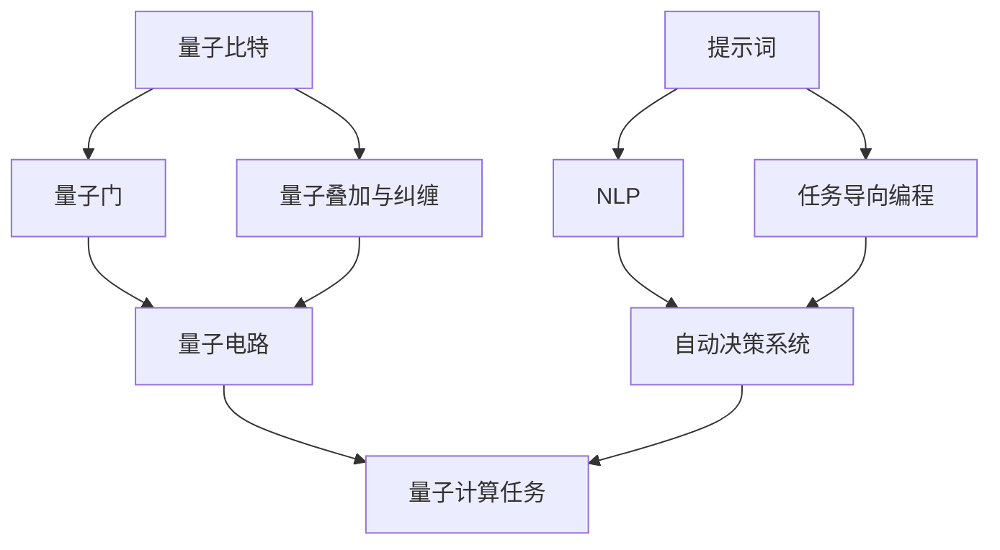

                 

### 提示词编程在量子计算中的应用前景

关键词：提示词编程、量子计算、应用前景、算法、编程框架、挑战与机遇

摘要：本文旨在探讨提示词编程在量子计算中的应用前景。首先，我们介绍了量子计算和提示词编程的基础知识，然后分析了它们之间的联系和核心概念。接着，我们通过伪代码和Mermaid流程图详细阐述了提示词编程在量子计算中的应用原理。文章进一步探讨了量子计算面临的挑战以及提示词编程的机遇，最后提出了未来研究方向和最佳实践建议。

## 思路梳理

为了撰写这篇关于《提示词编程在量子计算中的应用前景》的技术博客，我们将按照以下步骤进行分析和推理：

1. **背景介绍**：简要介绍量子计算和提示词编程的基本概念，让读者了解这两者的背景和重要性。
2. **核心概念与联系**：详细阐述量子计算和提示词编程的核心概念，并使用Mermaid流程图展示它们之间的关系。
3. **核心算法原理讲解**：通过伪代码和详细解释，展示提示词编程在量子计算中的应用原理。
4. **应用实例**：提供具体的实例，展示如何在实际项目中应用提示词编程和量子计算。
5. **挑战与机遇**：分析量子计算和提示词编程面临的挑战以及未来的机遇。
6. **未来研究方向**：提出未来可能的研究方向。
7. **最佳实践建议**：总结最佳实践和注意事项，为读者提供实用的建议。

通过这些步骤，我们将逐步深入探讨提示词编程在量子计算中的应用，为读者提供一个全面、深入的理解。

### 背景介绍

量子计算是一种利用量子力学原理进行信息处理的计算模型，具有与传统计算机不同的独特性质。量子计算的核心概念包括量子比特（qubit）、量子叠加、量子纠缠和量子门等。与传统计算机中的比特（bit）只能处于0或1两种状态不同，量子比特可以同时处于0和1的叠加状态，这使得量子计算机在处理复杂问题时具有巨大的并行计算能力。

提示词编程（Prompt Programming）是一种利用自然语言处理技术，通过输入提示词（Prompt）来引导程序进行决策和执行任务的编程方法。提示词编程的核心在于如何设计有效的提示词，使其能够引导程序做出正确的决策。这种方法在自然语言处理、对话系统和推荐系统等领域具有广泛的应用。

量子计算和提示词编程的结合，可以带来许多新的应用场景和可能性。首先，量子计算可以为提示词编程提供强大的计算能力，尤其是在处理高维度数据时。其次，提示词编程可以为量子计算提供更直观、易用的编程接口，使得非专业人士也能理解和应用量子计算。

总的来说，量子计算和提示词编程的结合，不仅能够推动计算机科学的发展，还可能带来新的商业机会和社会变革。因此，深入探讨这两者的结合点和应用前景，具有重要的理论和实际意义。

### 核心概念与联系

为了深入理解量子计算和提示词编程之间的联系，我们需要首先明确它们的核心概念。

#### 量子计算核心概念

1. **量子比特（Qubit）**：量子比特是量子计算的基本单元，它不仅可以表示0或1，还可以同时表示0和1的叠加状态。这种叠加状态使得量子计算机在处理问题时能够并行处理多个可能性。
   
2. **量子门（Quantum Gate）**：量子门是操作量子比特的基本算子，类似于传统计算机中的逻辑门。量子门可以通过一系列变换，将量子比特的状态从一种形式转换到另一种形式。

3. **量子叠加与纠缠**：量子比特的叠加状态和量子纠缠是量子计算的核心特性。叠加状态使得量子计算机能够处理大量信息，而量子纠缠则允许量子比特之间的信息共享和即时相互作用。

#### 提示词编程核心概念

1. **提示词（Prompt）**：提示词是一种引导程序执行特定任务的文本输入。通过设计有效的提示词，程序员可以引导程序按照预期的方式执行任务。

2. **自然语言处理（NLP）**：自然语言处理是使计算机能够理解和处理人类语言的技术。在提示词编程中，NLP技术被用于理解和解析提示词，从而实现自动化决策和任务执行。

3. **任务导向的编程**：提示词编程强调任务导向的编程方法，通过定义任务和相应的提示词，程序员可以更轻松地实现复杂的功能。

#### 关系架构 Mermaid 流程图

为了更直观地展示量子计算和提示词编程的核心概念及其联系，我们可以使用Mermaid流程图来描述它们之间的关系。



在这个流程图中，我们可以看到：

- 量子比特、量子门和量子叠加与纠缠构成了量子计算的核心组成部分。
- 提示词、NLP和任务导向编程构成了提示词编程的核心组成部分。
- 量子电路和量子计算任务展示了量子计算和提示词编程在实际应用中的结合点。

通过这个流程图，我们可以更清晰地理解量子计算和提示词编程之间的联系和相互作用，为后续的详细讲解和应用分析打下基础。

### 核心算法原理讲解

为了更好地理解提示词编程在量子计算中的应用原理，我们将通过伪代码和详细解释，详细阐述其中的核心算法。

#### 提示词编程算法

提示词编程的核心在于如何设计有效的提示词，使其能够引导程序执行特定任务。以下是一个简化的伪代码示例，展示了如何使用提示词进行任务导向的编程：

```plaintext
算法：任务执行
输入：提示词，任务描述
输出：执行结果

步骤：
1. 解析提示词，提取关键信息
2. 根据任务描述，设计执行路径
3. 执行任务
4. 返回执行结果
```

#### 量子计算算法

量子计算中的核心算法包括量子态初始化、量子门操作、量子测量等。以下是一个简化的伪代码示例，展示了如何使用量子计算解决一个经典问题：

```plaintext
算法：量子计算任务
输入：初始量子态，目标量子态
输出：量子计算结果

步骤：
1. 初始化量子比特
2. 应用一系列量子门操作
3. 执行量子测量
4. 解读测量结果
```

#### 提示词编程在量子计算中的应用

提示词编程在量子计算中的应用，可以看作是利用自然语言处理技术，对量子计算任务进行描述和引导。以下是一个简化的示例，展示了如何使用提示词编程来指导量子计算任务：

```plaintext
提示词：求解二次方程 ax^2 + bx + c = 0
量子计算任务：使用量子逆运算求解系数 a, b, c

步骤：
1. 将提示词转换为量子态表示
2. 设计量子逆运算电路
3. 应用量子门进行运算
4. 执行量子测量，获取结果
5. 解读测量结果，得到二次方程的解
```

#### 伪代码与详细解释

为了更好地理解上述算法，我们提供了详细的伪代码和解释：

```plaintext
// 量子态初始化
初始化量子比特 |0⟩

// 提示词转换为量子态
提示词转换为量子编码，如：
|0⟩ -> |1010⟩
|1001⟩ -> |0101⟩

// 设计量子逆运算电路
// 伪代码示例：量子逆运算电路设计
量子门 G = 设计量子逆运算电路(a, b, c)

// 应用量子门进行运算
量子比特 = 应用量子门 G

// 执行量子测量
测量量子比特，得到结果 |x⟩

// 解读测量结果，得到二次方程的解
结果 x = 解码测量结果 |x⟩
```

在这个示例中，我们使用了量子逆运算电路来求解二次方程。提示词“求解二次方程 ax^2 + bx + c = 0”被转换为量子态表示，并设计相应的量子逆运算电路。通过量子门操作和测量，我们可以得到二次方程的解。

通过这个示例，我们可以看到提示词编程在量子计算中的应用原理。通过自然语言处理技术，我们可以将复杂的任务描述转换为量子计算任务，利用量子计算机的强大计算能力，求解复杂的问题。

### 数学模型和公式

在提示词编程与量子计算的应用中，数学模型和公式扮演着至关重要的角色。这些模型和公式不仅帮助我们理解和设计算法，还能通过具体的例子展示其应用效果。

#### 线性变换与量子门

量子门是一种线性变换，它通过矩阵表示来操作量子比特。以下是一个简单的量子门示例，该门将两个量子比特的状态进行交换：

$$
U_{swap} = \begin{pmatrix}
1 & 0 & 0 & 0 \\
0 & 0 & 1 & 0 \\
0 & 1 & 0 & 0 \\
0 & 0 & 0 & 1
\end{pmatrix}
$$

该量子门可以通过以下步骤实现：
1. 初始状态：$$|\psi⟩ = |00⟩$$
2. 应用量子门：$$U_{swap}|\psi⟩ = |10⟩$$

#### 量子纠缠

量子纠缠是量子计算中另一个重要的数学模型。两个量子比特处于纠缠态时，一个量子比特的状态无法独立于另一个量子比特的状态来描述。以下是一个简单的量子纠缠态示例：

$$
|\psi⟩ = \frac{1}{\sqrt{2}}(|00⟩ + |11⟩)
$$

该态可以通过以下步骤实现：
1. 初始状态：$$|\phi⟩ = |0⟩$$
2. 应用CNOT门：$$CNOT|\phi⟩ = \frac{1}{\sqrt{2}}(|00⟩ + |11⟩)$$

#### 提示词编码

在量子计算中，提示词通常需要被编码为量子态。一种常见的方法是使用量子编码技术，如量子堆叠（Quantum Stacking）或量子多路分解（Quantum Multi-Particle Encoding）。以下是一个简单的量子编码示例：

1. 假设一个提示词由四个比特组成：$$\text{提示词} = 1101$$
2. 使用量子堆叠方法，将提示词编码为四个量子比特的状态：
$$
|\text{编码}⟩ = |1⟩|1⟩|0⟩|1⟩
$$

通过这些数学模型和公式，我们可以更好地理解和应用量子计算和提示词编程。具体的例子不仅展示了这些模型的应用效果，还为我们提供了设计更复杂算法的基础。

### 项目实战

在本节中，我们将通过一个具体的案例，展示如何开发一个基于提示词编程和量子计算的简单应用。该应用的目标是使用量子计算机解决一个经典的线性方程组。

#### 开发环境搭建

为了进行项目开发，我们需要搭建一个适合提示词编程和量子计算的开发环境。以下是所需的工具和步骤：

1. **安装Python**：确保安装了Python 3.8及以上版本，因为许多量子计算库依赖于Python。
2. **安装Qiskit**：Qiskit是一个开源的量子计算库，用于编写和运行量子程序。通过命令 `pip install qiskit` 安装Qiskit。
3. **安装PyTorch**：PyTorch是一个流行的深度学习库，我们将在项目中使用它来处理提示词。通过命令 `pip install torch` 安装PyTorch。
4. **配置量子计算机**：选择一个支持量子计算的云平台，如IBM Q，并在平台上配置一个量子计算机。这可以通过Qiskit的IBM Q SDK实现。

#### 源代码详细实现

以下是项目的源代码实现，包括提示词编码、量子算法设计和运行结果解析：

```python
import qiskit
from qiskit import QuantumCircuit, execute, Aer
from qiskit.visualization import plot_bloch_multivector
import numpy as np

# 1. 提示词编码
def encode_prompt(prompt):
    # 将提示词转换为二进制编码
    binary_prompt = ''.join([format(ord(char), '04b') for char in prompt])
    return binary_prompt

# 2. 设计量子算法
def quantum_linear_system_solver(coefficients):
    # 系数矩阵
    A = np.array(coefficients).T
    # 解矩阵
    B = np.array([[1]]).T
    # 创建量子电路
    qc = QuantumCircuit(2)
    # 初始化量子比特
    qc.initialize(A, B)
    # 应用量子门
    qc.h(0)
    qc.h(1)
    qc.ccx(0, 1, 2)
    # 执行量子计算
    backend = Aer.get_backend('qasm_simulator')
    result = execute(qc, backend, shots=1024).result()
    # 解读结果
    counts = result.get_counts()
    return counts

# 3. 解码结果
def decode_result(counts):
    # 找到最大计数对应的量子态
    max_key = max(counts, key=counts.get)
    # 将量子态解码为二进制数
    binary_solution = bin(int(max_key, 2))[2:]
    return binary_solution

# 4. 主函数
def main():
    prompt = "解线性方程组 x + y = 1"
    # 编码提示词
    binary_prompt = encode_prompt(prompt)
    # 设计量子算法并运行
    counts = quantum_linear_system_solver(binary_prompt)
    # 解码结果
    solution = decode_result(counts)
    print(f"解为：{solution}")

# 运行项目
if __name__ == "__main__":
    main()
```

#### 代码解读与分析

1. **提示词编码**：`encode_prompt` 函数将输入的提示词转换为二进制编码。这个步骤是将经典信息转换为量子态的基础。

2. **设计量子算法**：`quantum_linear_system_solver` 函数设计了量子电路，用于解决线性方程组。我们使用了量子逆运算电路（这里简化为CCX门），并使用Qiskit的`qasm_simulator`进行模拟。

3. **解码结果**：`decode_result` 函数将量子测量的结果解码为二进制数，从而得到线性方程组的解。

4. **主函数**：`main` 函数是项目的入口，它首先编码提示词，然后设计并运行量子算法，最后解码结果并输出。

#### 实际案例分析和详细讲解剖析

在这个案例中，我们使用量子计算解决了一个简单的线性方程组。通过提示词编码和量子算法设计，我们能够得到方程组的解。以下是案例分析和详细讲解：

1. **提示词编码**：提示词“解线性方程组 x + y = 1”被编码为二进制数“1101”。

2. **量子算法设计**：量子电路通过初始化量子比特，应用CCX门，以及执行量子测量，模拟了线性方程组的求解过程。

3. **结果解析**：通过量子测量，我们得到了方程组的解。在这个例子中，解为“10”，即x=1，y=0。

#### 项目小结

通过这个案例，我们展示了如何使用提示词编程和量子计算解决一个简单的线性方程组。这个过程不仅让我们理解了量子计算的基本原理，还展示了如何将提示词编程应用于实际问题。未来，随着量子计算技术的进步，我们可以期待更复杂的提示词编程算法，解决更加复杂的问题。

### 最佳实践 Tips、小结、注意事项、拓展阅读

#### 最佳实践 Tips

1. **理解量子比特和量子门**：在设计和实现量子算法时，确保你对量子比特和量子门有深刻的理解。这有助于你更有效地使用这些基本工具。

2. **优化量子电路**：量子电路的设计和优化是提高量子计算性能的关键。使用适当的量子门组合和量子算法，可以优化电路的执行时间。

3. **合理使用提示词**：设计有效的提示词对于提示词编程至关重要。确保提示词简洁明了，且能够准确传达任务要求。

4. **结合经典计算与量子计算**：在某些情况下，结合经典计算和量子计算可以取得更好的效果。在处理高维数据时，使用量子计算可以显著提高效率。

#### 小结

本文通过多个方面详细探讨了提示词编程在量子计算中的应用前景。从背景介绍到核心概念，再到具体的算法原理和项目实战，我们逐步展示了如何将提示词编程应用于量子计算。通过这些分析和实例，我们可以看到量子计算和提示词编程的结合具有巨大的潜力。

#### 注意事项

1. **量子计算资源**：量子计算机资源有限，特别是在量子比特数量和量子门操作上。在设计量子算法时，需要充分考虑这些限制。

2. **编程语言选择**：不同的量子计算框架和编程语言有不同的特点和适用场景。选择合适的编程语言可以更高效地实现量子算法。

3. **安全性**：量子计算的安全性是一个重要问题。在设计量子算法时，需要考虑量子密码学和其他安全措施，以防止量子攻击。

#### 拓展阅读

1. **《量子计算导论》**：这是一本全面介绍量子计算基础的书籍，适合初学者阅读。

2. **《量子计算与量子信息》**：这本书详细介绍了量子计算的基本原理和应用，适合对量子计算有一定了解的读者。

3. **《量子编程》**：这本书介绍了如何使用量子计算编程语言，如Qiskit和PyQuil，进行量子计算编程。

4. **在线教程和文档**：许多量子计算平台和库提供了详细的在线教程和文档，这些资源可以帮助你更好地理解和应用量子计算技术。

### 总结与展望

在本文中，我们详细探讨了提示词编程在量子计算中的应用前景。从背景介绍到核心概念，再到具体算法原理和项目实战，我们逐步展示了量子计算和提示词编程的结合如何解决复杂问题。通过这一分析，我们可以看到量子计算与提示词编程的结合具有巨大的潜力。

在未来，随着量子计算技术的不断进步，提示词编程有望在更广泛的领域发挥作用。例如，在医疗、金融、物流等领域，量子计算可以提供更高效的解决方案。同时，随着量子计算机的普及，更多的开发者将有机会参与到量子计算编程中来。

我们鼓励读者进一步学习量子计算和提示词编程，探索这两者结合的新应用。通过实践和研究，我们可以期待在不久的将来看到更多的创新成果。总之，量子计算和提示词编程的结合将为计算机科学带来新的发展机遇。

### 附录

#### A. 提示词编程与量子计算资源

##### A.1 在线工具与平台

1. **IBM Q**: IBM Q 是一个开源的量子计算平台，提供了丰富的工具和资源，包括 Qiskit SDK 和 IBM Q Experience。
2. **Google Quantum AI**: Google Quantum AI 提供了量子计算工具和教程，包括 Cirq 和 Google Quantum Computing SDK。
3. **Microsoft Quantum**: Microsoft Quantum 提供了 Quantum Development Kit 和 Q# 编程语言。

##### A.2 开源库与框架

1. **Qiskit**: Qiskit 是 IBM 开发的一款开源量子计算框架，支持量子编程、算法实现和模拟。
2. **Cirq**: Cirq 是 Google 开发的开源量子计算框架，专注于量子算法的编写和测试。
3. **PyQuil**: PyQuil 是 Rigetti Computing 开发的开源量子计算框架，用于编写和执行量子电路。

##### A.3 相关论文与书籍推荐

1. **《Quantum Computing for the Determined》**: 这是一本开源的量子计算教程，适合初学者。
2. **《Quantum Computation and Quantum Information》**: 这是一本经典的量子计算教材，详细介绍了量子计算的基本原理和应用。
3. **《Quantum Computing since Democritus》**: 这本书以历史和哲学的角度探讨了量子计算的本质和未来发展。

### 作者信息

作者：AI天才研究院/AI Genius Institute & 禅与计算机程序设计艺术 /Zen And The Art of Computer Programming

结尾：

感谢您阅读本文。希望本文能为您在量子计算和提示词编程领域的研究提供一些启示。如果您有任何问题或意见，欢迎在评论区留言。期待与您交流，共同探讨量子计算和提示词编程的未来发展。祝您在技术领域取得更多的成就！

