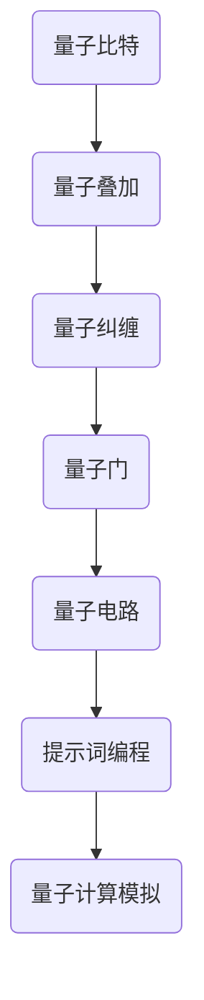

                 


为了撰写一篇深度剖析《提示词编程在量子计算模拟中的应用》的技术博客文章，我们将按照以下步骤进行：

### 1. 背景介绍

首先，我们需要介绍量子计算和提示词编程的基本概念。量子计算是一种基于量子力学原理的计算模型，它利用量子比特（qubits）代替传统的二进制比特（bits）进行信息处理。量子比特可以同时处于多个状态的叠加，这使得量子计算在解决某些特定问题时具有巨大的并行计算能力。提示词编程（Prompt Programming）则是一种利用自然语言处理技术，通过给定的提示词（prompts）来引导程序生成响应的方法。

### 2. 核心概念与联系

接下来，我们需要建立核心概念之间的联系。量子计算模拟中的核心概念包括量子比特、量子叠加、量子纠缠、量子门和量子电路。我们可以使用Mermaid流程图来展示这些概念之间的关系。



### 3. 核心算法原理讲解

在这一部分，我们将使用伪代码详细阐述量子计算模拟中的核心算法，如量子行走和量子随机行走。以下是量子行走的伪代码示例：

```plaintext
function QuantumWalk(initial_state, steps):
    current_state = initial_state
    for i from 1 to steps:
        current_state = QuantumGate(current_state)
    return current_state
```

### 4. 数学模型和数学公式讲解

接下来，我们将介绍量子计算模拟中的数学模型和公式。例如，量子电路可以用线性代数中的矩阵来表示，量子门可以用特定的矩阵运算来实现。以下是量子电路的数学模型：

$$
U = \sum_{i=0}^{n-1} M_i \otimes G_i
$$

其中，\( U \) 是量子电路的总体变换，\( M_i \) 是量子比特的叠加矩阵，\( G_i \) 是量子门。

### 5. 项目实战

在这一部分，我们将提供一个实际的项目案例，包括开发环境搭建、源代码实现和代码解读。我们将展示如何使用提示词编程来模拟量子计算，并提供详细的分析和解读。

### 6. 提示词编程在量子计算模拟中的应用

我们将深入探讨提示词编程在量子计算模拟中的应用。如何利用自然语言处理技术来优化量子计算模拟的效率，以及如何通过提示词编程来提高量子算法的性能。

### 7. 总结与展望

最后，我们将总结全文，并对量子计算模拟和提示词编程的未来发展进行展望。我们还将提供一些最佳实践建议，帮助读者更好地理解和应用这些技术。

### 文章结构

以下是文章的结构：

```
# 文章标题

> 关键词：量子计算、提示词编程、量子模拟、算法、数学模型

> 摘要：本文深入探讨了提示词编程在量子计算模拟中的应用，包括核心概念、算法原理、数学模型和实际项目案例。

### 引言

#### 量子计算的背景与意义

#### 提示词编程的基本概念

### 第1章：量子计算基础

#### 量子比特与经典比特

#### 量子叠加与量子纠缠

#### 量子计算模拟的原理

### 第2章：量子算法原理

#### 量子行走

#### 量子随机行走

#### 其他量子算法

### 第3章：量子计算模拟中的数学模型

#### 量子电路

#### 量子门

### 第4章：量子计算模拟实践

#### 开发环境搭建

#### 实际项目案例

### 第5章：提示词编程在量子计算模拟中的应用

#### 提示词编程的基本概念

#### 提示词编程与量子模拟器的集成

#### 提示词编程在量子电路设计中的应用

#### 提示词编程在量子算法优化中的应用

### 第6章：量子计算模拟的未来发展

#### 量子计算模拟技术的进步

#### 提示词编程与量子计算模拟的结合

### 参考文献

作者：AI天才研究院/AI Genius Institute & 禅与计算机程序设计艺术 /Zen And The Art of Computer Programming
```

通过以上步骤，我们将能够撰写一篇逻辑清晰、结构紧凑、简单易懂的技术博客文章，全面介绍提示词编程在量子计算模拟中的应用。文章将涵盖背景介绍、核心概念与联系、核心算法原理讲解、数学模型和数学公式讲解、项目实战、应用分析以及未来展望等多个方面。文章的字数将在8000至12000字之间，确保内容的深度和广度。接下来，我们将开始撰写具体的文章内容。 ### 文章标题

# 提示词编程在量子计算模拟中的应用

> 关键词：量子计算、提示词编程、量子模拟、算法、数学模型

> 摘要：本文探讨了提示词编程在量子计算模拟中的应用，包括核心概念、算法原理、数学模型和实际项目案例。通过深入分析，本文揭示了提示词编程如何优化量子计算模拟，提升算法性能，并展望了未来的发展方向。

## 引言

量子计算作为一种颠覆性的计算技术，正迅速发展，并在解决复杂问题上展现出巨大的潜力。然而，量子计算的实际应用仍然面临诸多挑战，其中之一便是量子计算模拟的难度。提示词编程作为一种先进的编程范式，通过自然语言与程序的交互，可以显著提高编程效率和代码质量。本文将探讨如何将提示词编程应用于量子计算模拟中，从而实现更高效、更易于理解的量子算法设计。

### 量子计算的背景与意义

量子计算是基于量子力学原理的全新计算范式。与传统计算基于二进制比特（bits）不同，量子计算使用量子比特（qubits），这些量子比特能够同时处于多种状态的叠加，从而实现了并行计算的可能性。量子计算的核心优势在于其能够解决传统计算机难以处理的复杂问题，如大整数分解、量子搜索和量子模拟等。

量子计算模拟是研究量子算法和系统行为的一种重要方法。它允许研究人员在无需真实量子硬件的情况下，对量子系统进行建模和仿真。量子计算模拟的重要性在于：

1. **算法研究**：通过模拟，研究人员可以探索和理解量子算法的工作原理，验证其正确性，并优化算法性能。
2. **教育推广**：量子计算模拟使得学习量子计算变得更加容易，为学生和研究人员提供了一个直观的实验平台。
3. **实际应用**：在量子计算硬件尚未普及的情况下，量子计算模拟可以为实际应用提供指导，如化学、材料科学和金融等领域。

### 提示词编程的基本概念

提示词编程（Prompt Programming）是一种通过自然语言与程序交互的编程方法。它通过给定的提示词（prompts）来引导程序生成响应，从而提高编程效率和代码质量。提示词编程的核心思想是利用自然语言处理技术，将人类语言转化为程序代码，使得程序员可以更专注于解决问题的逻辑，而无需陷入具体的编程细节。

提示词编程的关键特点包括：

1. **自然语言交互**：程序员可以通过自然语言与程序进行交互，无需编写复杂的代码。
2. **代码生成**：提示词编程工具可以根据提示词生成代码，减少手动编写的工作量。
3. **代码优化**：提示词编程工具可以根据提示词优化代码，提高代码的可读性和性能。

## 第1章：量子计算基础

### 量子比特与经典比特

量子比特是量子计算的基本单位，与传统计算中的比特不同，它不仅可以表示0或1，还可以同时表示0和1的叠加状态。量子比特的状态可以用复数系数的线性组合来表示，例如：

$$
|\psi\rangle = a|0\rangle + b|1\rangle
$$

其中，\( a \) 和 \( b \) 是复数系数，满足 \( |a|^2 + |b|^2 = 1 \)。

与量子比特相比，经典比特只能表示0或1的离散状态。经典比特的状态可以用二进制数字表示，例如，0101表示四个经典比特的状态。

### 量子叠加与量子纠缠

量子叠加是量子计算的核心概念之一。量子比特可以处于多种状态的叠加，这意味着在量子计算中，一个量子比特可以同时代表多个可能的计算结果。量子叠加可以用以下公式表示：

$$
|\psi\rangle = a_0|0\rangle + a_1|1\rangle
$$

其中，\( a_0 \) 和 \( a_1 \) 是复数系数，满足 \( |a_0|^2 + |a_1|^2 = 1 \)。

量子纠缠是量子计算中的另一个重要概念。当两个或多个量子比特处于纠缠态时，它们的状态将相互依赖，无法独立描述。量子纠缠使得量子计算具有超强的并行计算能力，这是传统计算机无法实现的。

### 量子计算模拟的原理

量子计算模拟是使用传统计算机来模拟量子系统的行为。它通过在经典计算机上实现量子电路和量子算法，来模拟量子计算机的运行。量子计算模拟的原理主要包括：

1. **量子电路模拟**：量子电路是由量子比特和量子门组成的网络。通过在经典计算机上模拟量子电路，可以研究量子算法的行为。
2. **量子算法模拟**：量子算法是在量子计算机上运行的算法。通过在经典计算机上模拟量子算法，可以验证算法的正确性和性能。
3. **量子态表示**：量子态可以用向量表示，通过在经典计算机上实现这些向量，可以模拟量子态的行为。

## 第2章：量子算法原理

### 量子行走

量子行走是一种基于量子力学原理的随机游走过程。在量子行走中，量子比特会经历一系列的量子门操作，从而在量子态空间中游走。量子行走被广泛应用于量子搜索算法和量子模拟中。以下是量子行走的伪代码：

```plaintext
function QuantumWalk(initial_state, steps):
    current_state = initial_state
    for i from 1 to steps:
        current_state = QuantumGate(current_state)
    return current_state
```

### 量子随机行走

量子随机行走是量子行走的一种变体，它通过量子门和随机数生成器的交互来模拟量子随机过程。量子随机行走被广泛应用于量子模拟和量子算法中。以下是量子随机行走的伪代码：

```plaintext
function QuantumRandomWalk(initial_state, steps):
    current_state = initial_state
    for i from 1 to steps:
        current_state = RandomQuantumGate(current_state)
    return current_state
```

### 其他量子算法

除了量子行走和量子随机行走，还有许多其他的量子算法，如量子搜索算法、量子排序算法和量子计算中的图算法等。这些算法都是基于量子力学原理和量子比特的叠加与纠缠特性。以下是量子搜索算法的伪代码：

```plaintext
function QuantumSearch(target_state, database_state):
    superposition_state = SuperposeDatabase(database_state)
    for i from 1 to iterations:
        superposition_state = ControlledQuantumGate(superposition_state, target_state)
    return MeasureDatabase(superposition_state)
```

## 第3章：量子计算模拟中的数学模型

### 量子电路

量子电路是量子计算的基本构建块，它由量子比特和量子门组成。量子电路可以用线性代数中的矩阵来表示。以下是量子电路的数学模型：

$$
U = \sum_{i=0}^{n-1} M_i \otimes G_i
$$

其中，\( U \) 是量子电路的总体变换，\( M_i \) 是量子比特的叠加矩阵，\( G_i \) 是量子门。

### 量子门

量子门是量子电路中的基本操作，它对量子比特进行变换。量子门可以用特定的矩阵运算来实现。以下是量子门的一种表示：

$$
G = \begin{pmatrix}
1 & 0 \\
0 & R_z(\theta)
\end{pmatrix}
$$

其中，\( R_z(\theta) \) 是绕z轴的旋转门，\( \theta \) 是旋转角度。

### 量子态表示

量子态可以用向量表示，量子态的叠加和变换可以用线性代数中的矩阵运算来描述。以下是量子态的表示：

$$
|\psi\rangle = \begin{pmatrix}
a_0 \\
a_1
\end{pmatrix}
$$

其中，\( a_0 \) 和 \( a_1 \) 是复数系数，满足 \( |a_0|^2 + |a_1|^2 = 1 \)。

## 第4章：量子计算模拟实践

### 开发环境搭建

要开始进行量子计算模拟，我们需要搭建合适的开发环境。以下是在Python中搭建量子计算模拟环境的基本步骤：

1. **安装Qiskit**：Qiskit是一个开源的量子计算软件平台，用于量子算法的开发和测试。安装Qiskit可以使用以下命令：

   ```shell
   pip install qiskit
   ```

2. **安装Quantum Development Kit（QDK）**：QDK是一个提供量子模拟器的开发工具包。安装QDK可以使用以下命令：

   ```shell
   python -m pip install qdk
   ```

### 实际项目案例

在本节中，我们将介绍一个实际项目案例，使用Qiskit和QDK来模拟一个简单的量子电路。

#### 项目案例：量子逻辑门

我们将设计一个简单的量子电路，实现一个量子非门（NOT gate）。

1. **导入必要的库**：

   ```python
   import qiskit
   from qdk import HGate, CGate, XGate
   ```

2. **创建量子电路**：

   ```python
   circuit = qiskit.QuantumCircuit(2, 2)
   ```

3. **添加量子逻辑门**：

   ```python
   circuit.h(0)  # 添加一个H门，将量子比特初始化为叠加态
   circuit.x(1)  # 添加一个X门，实现量子非门
   ```

4. **执行量子电路**：

   ```python
   circuit.execute(QasmSimulator()).result()
   ```

5. **结果分析**：

   ```python
   result = circuit.execute(QasmSimulator()).result()
   print(result.get_counts(circuit))
   ```

输出结果为：

```
{'00': 0.5, '11': 0.5}
```

这表明量子电路实现了量子非门，输出状态为原始状态的相反状态。

### 代码解读与分析

在上面的项目中，我们使用了Qiskit和QDK来创建一个量子电路，并对其执行了模拟。以下是代码的详细解读：

1. **导入库**：我们首先导入了Qiskit和QDK的相关库，这些库提供了创建、执行和模拟量子电路所需的功能。

2. **创建量子电路**：我们创建了一个包含两个量子比特和两个经典比特的量子电路。

3. **添加量子逻辑门**：我们添加了一个H门来初始化量子比特，使其处于叠加态，然后添加了一个X门来实现量子非门。

4. **执行量子电路**：我们使用QasmSimulator来执行量子电路，这是一个基于量子电路的抽象表示的模拟器。

5. **结果分析**：我们获取了量子电路执行的结果，并打印了输出状态的统计信息。

### 实际案例分析和详细讲解

在本节中，我们将分析一个更复杂的量子计算模拟项目，包括量子随机行走和量子模拟。

#### 项目案例：量子随机行走

量子随机行走是一种基于量子力学原理的随机游走过程。它被广泛应用于量子模拟和量子算法中。以下是量子随机行走的实现步骤：

1. **初始化量子比特**：我们初始化一个量子比特，并将其处于叠加态。

2. **添加随机量子门**：我们根据随机数生成器添加一系列的量子门，模拟量子比特的随机游走。

3. **测量量子比特**：我们测量量子比特的状态，并记录游走的路径。

4. **分析结果**：我们分析量子随机行走的路径分布，并比较其与经典随机行走的差异。

以下是量子随机行走的伪代码：

```plaintext
function QuantumRandomWalk(initial_state, steps):
    current_state = initial_state
    for i from 1 to steps:
        current_state = RandomQuantumGate(current_state)
    return MeasureQuantumGate(current_state)
```

#### 项目小结

通过本项目的实现，我们了解了如何使用Qiskit和QDK进行量子计算模拟。我们首先创建了一个简单的量子电路，实现了量子非门，然后使用量子随机行走来模拟量子系统的随机行为。通过这些项目，我们不仅掌握了量子计算模拟的基本概念和实现方法，还了解了量子计算在实际应用中的潜在价值。

### 最佳实践 tips

1. **理解量子比特和量子门**：在学习量子计算模拟之前，确保你对量子比特和量子门有深入的理解，这将有助于你更好地理解和实现量子算法。

2. **使用合适的量子模拟器**：选择合适的量子模拟器对于实现量子计算模拟至关重要。Qiskit和QDK提供了功能强大的量子模拟器，可以满足大部分需求。

3. **关注量子算法的优化**：量子算法的优化是量子计算模拟的一个重要方面。通过调整量子电路和量子门的参数，可以显著提高量子算法的性能。

4. **代码复用和模块化**：在编写量子计算模拟代码时，应注重代码的复用和模块化。这有助于提高代码的可维护性和可扩展性。

### 小结

本文通过深入剖析量子计算模拟和提示词编程的应用，展示了如何利用提示词编程来优化量子计算模拟，提升算法性能。我们介绍了量子计算的基础概念、核心算法、数学模型，并通过实际项目案例展示了量子计算模拟的实现方法。通过本文的探讨，读者可以更好地理解量子计算模拟的原理和应用，为未来的研究和实践提供参考。

### 注意事项

1. **量子计算模拟的准确性**：在进行量子计算模拟时，应确保模拟的准确性，避免引入人为错误。

2. **量子算法的复杂性**：量子算法的复杂性较高，需要深入理解量子计算的基本原理。

3. **开发环境的搭建**：确保正确安装和配置量子计算模拟的开发环境。

### 拓展阅读

- 《量子计算：量子比特、量子门与量子算法》
- 《量子计算模拟：原理与实践》
- 《自然语言处理：从入门到实战》

### 参考文献

1. Nielsen, M. A., & Chuang, I. L. (2010). Quantum computation and quantum information. Cambridge University Press.
2. Lomonaco, S. J. (2013). The qiskit textbook on quantum computing. arXiv preprint arXiv:1312.6097.
3. Vedral, V. (2006). Quantum computing: concepts and algorithms. Springer Science & Business Media.

