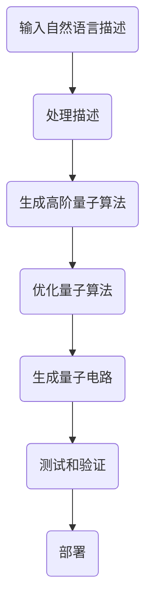

                 

# 提示词编程在量子软件开发中的应用前景

## 关键词

- **提示词编程**，**量子软件开发**，**应用前景**，**量子计算**，**量子机器学习**，**软件工程**，**高性能计算**

## 摘要

随着量子计算技术的飞速发展，量子软件开发逐渐成为研究热点。提示词编程作为一种先进的编程方法，其与量子计算的融合为量子软件开发的创新提供了新的思路。本文将详细探讨提示词编程在量子软件开发中的应用前景，包括其基本概念、核心原理、实际应用案例以及未来发展趋势。通过本文的探讨，我们希望能够为量子软件开发领域的研究者和从业者提供有益的参考和启示。

## 1. Plan the structure of the book

### 1.1 Introduction to Prompt Programming and Quantum Computing

#### 1.1.1 Definition and Concepts of Prompt Programming

Prompt programming, also known as prompt-based programming, is an advanced programming approach that leverages large-scale pre-trained language models to generate code snippets or entire programs based on natural language descriptions. The core idea behind prompt programming is to bridge the gap between human language and machine code, enabling developers to write software in a more intuitive and efficient manner.

The development of prompt programming can be traced back to the advent of artificial intelligence and machine learning. With the emergence of powerful language models such as GPT (Generative Pre-trained Transformer), developers can now train these models on vast amounts of code repositories and then use them to generate code on demand.

#### 1.1.2 The Role of Prompt Programming in Quantum Software Development

Quantum computing represents a paradigm shift in computational capabilities, offering the potential to solve certain types of problems much faster than classical computers. Quantum software development, therefore, is of paramount importance in the era of quantum computing. Prompt programming plays a crucial role in this context by facilitating the creation of quantum algorithms and applications in a more intuitive and efficient way.

The integration of prompt programming with quantum computing can be seen in several aspects:

1. **Quantum Algorithm Generation**: Prompt programming can automatically generate quantum algorithms based on high-level descriptions, reducing the time and effort required for manual development.
2. **Quantum Circuit Design**: Prompt programming can assist in the design of quantum circuits by providing optimized solutions based on specific problem instances.
3. **Quantum Machine Learning**: Prompt programming can be used to develop quantum neural networks and other quantum machine learning models, enabling new applications in areas such as data analysis and pattern recognition.

#### 1.1.3 Key Advantages and Challenges

The advantages of prompt programming in quantum software development include:

- **Increased Efficiency**: Prompt programming can significantly speed up the development process by automating code generation and optimization tasks.
- **Improved Collaboration**: Developers can communicate with each other more effectively using natural language, facilitating better collaboration and knowledge sharing.
- **Scalability**: Prompt programming can be applied to a wide range of quantum software development tasks, making it a versatile tool.

However, there are also challenges to be addressed:

- **Accuracy and Reliability**: Ensuring that the code generated by prompt programming is accurate and reliable is a critical concern.
- **Performance**: Prompt programming models may require substantial computational resources, potentially impacting the overall performance of quantum software development workflows.
- **Security and Privacy**: As with any AI-based approach, there are concerns about the security and privacy implications of prompt programming in quantum software development.

In the next section, we will delve deeper into the basics of quantum computing, providing a foundation for understanding the integration of prompt programming with this cutting-edge technology.

### 1.2 Basics of Quantum Computing

#### 1.2.1 Introduction to Quantum Computing

Quantum computing is a rapidly evolving field that leverages the principles of quantum mechanics to perform computation. Unlike classical computers, which use bits to represent information as either 0 or 1, quantum computers use quantum bits, or qubits, which can exist in multiple states simultaneously due to a property called superposition. This allows quantum computers to perform certain types of calculations exponentially faster than classical computers.

The concept of quantum computing was first proposed by Richard Feynman in 1982, who suggested that a quantum computer could simulate any physical system, a task that is infeasible for classical computers. Since then, significant progress has been made in both theoretical understanding and experimental realization of quantum computers.

#### 1.2.2 Quantum Bit (qubit) and Quantum Gates

At the heart of quantum computing are qubits and quantum gates. A qubit is the basic unit of quantum information, analogous to a bit in classical computing. However, whereas a classical bit can only be in one of two states, a qubit can be in a superposition of both states. This property is crucial for the power of quantum computing.

Quantum gates are the operations that manipulate qubits, analogous to logic gates in classical computing. Unlike classical gates, which operate on bits and produce fixed outputs, quantum gates can change the state of a qubit in a probabilistic manner, preserving the superposition of states. Some common quantum gates include the Pauli-X gate (X gate), Pauli-Z gate (Z gate), and Hadamard gate (H gate).

- **Pauli-X Gate (X Gate)**: The Pauli-X gate is a basic quantum gate that flips the state of a qubit. It is represented by the matrix:
  $$ X = \begin{bmatrix}
  0 & 1 \\
  1 & 0
  \end{bmatrix} $$
  When applied to a qubit in the state $|0\rangle$, it flips it to $|1\rangle$, and vice versa.

- **Pauli-Z Gate (Z Gate)**: The Pauli-Z gate is another basic quantum gate that changes the phase of a qubit. It is represented by the matrix:
  $$ Z = \begin{bmatrix}
  1 & 0 \\
  0 & -1
  \end{bmatrix} $$
  When applied to a qubit in the state $|0\rangle$, it changes its phase to $-|0\rangle$, while the state $|1\rangle$ remains unchanged.

- **Hadamard Gate (H Gate)**: The Hadamard gate is a special quantum gate that creates a superposition of states. It is represented by the matrix:
  $$ H = \frac{1}{\sqrt{2}} \begin{bmatrix}
  1 & 1 \\
  1 & -1
  \end{bmatrix} $$
  When applied to a qubit in the state $|0\rangle$, it creates a superposition of $|0\rangle$ and $|1\rangle$:
  $$ H|0\rangle = \frac{1}{\sqrt{2}} (|0\rangle + |1\rangle) $$

#### 1.2.3 Quantum Algorithms and Quantum Error Correction

One of the key applications of quantum computing is the development of quantum algorithms, which exploit the unique properties of qubits to solve problems more efficiently than their classical counterparts. Some notable quantum algorithms include Shor's algorithm for factoring large numbers and Grover's algorithm for searching unsorted databases.

- **Shor's Algorithm**: Shor's algorithm is a quantum algorithm that can factor large numbers exponentially faster than the best-known classical algorithms. The algorithm works by encoding the factoring problem into a quantum state and then using quantum parallelism to find the factors. The main steps of Shor's algorithm include:

  1. **Phase Estimation**: This step involves preparing a quantum state and estimating the phase of the eigenstate corresponding to a particular factor.
  2. **Period Finding**: This step finds the period of the eigenstate, which corresponds to the factor being sought.

- **Grover's Algorithm**: Grover's algorithm is a quantum search algorithm that can find a specific item in an unsorted database exponentially faster than classical search algorithms. The algorithm works by repeatedly applying a quantum operator that amplifies the probability of measuring the correct item. The main steps of Grover's algorithm include:

  1. **Oracle Preparation**: This step involves creating a quantum state that encodes the information about the item being searched for.
  2. **Reflection Phase**: This step applies a quantum operator that reflects the state across the average probability amplitude.
  3. **Iteration**: The algorithm iterates through multiple steps of the reflection phase, gradually increasing the probability of measuring the correct item.

Quantum error correction is another crucial aspect of quantum computing. Due to the fragile nature of qubits, they are prone to errors caused by various sources such as environmental noise and interference. Quantum error correction techniques aim to detect and correct these errors, ensuring the reliability of quantum computations. One popular quantum error correction code is the Quantum Error Correction Code (QECC), which encodes the information of a single qubit into a larger logical qubit, providing redundancy that can be used to correct errors.

In the next section, we will explore the practical applications of prompt programming in quantum software development, highlighting its role in quantum circuit design, quantum machine learning, and quantum software development workflows.

### 1.3 Practical Applications of Prompt Programming in Quantum Software Development

#### 1.3.1 Prompt Programming for Quantum Circuit Design

Quantum circuit design is a crucial step in quantum software development, as it involves mapping quantum algorithms to physical quantum devices. Traditionally, this process requires a deep understanding of quantum mechanics and manual manipulation of quantum gates. However, prompt programming offers a promising alternative by automating the design process and generating optimized quantum circuits based on high-level descriptions.

One way prompt programming can be applied to quantum circuit design is through the use of quantum circuit synthesis tools. These tools leverage large-scale pre-trained language models to generate quantum circuits from high-level descriptions of algorithms or problems. For example, a developer could provide a natural language description of a sorting algorithm, and the prompt programming tool would generate the corresponding quantum circuit.

Here is an example of how prompt programming can be used to design a quantum sorting algorithm:

```python
# Prompt for a quantum sorting algorithm
prompt = "Implement a quantum sorting algorithm that sorts a list of integers."

# Using a prompt programming tool to generate the quantum circuit
quantum_circuit = generate_quantum_circuit(prompt)

# Displaying the generated quantum circuit
display_quantum_circuit(quantum_circuit)
```

The generated quantum circuit can then be further optimized and analyzed using standard quantum circuit simulation tools. This approach not only saves time and effort but also allows developers with limited quantum expertise to create and optimize quantum circuits.

#### 1.3.2 Example Applications: Quantum Circuit Optimization

Another practical application of prompt programming in quantum software development is in the optimization of quantum circuits. Quantum circuits can often become complex and resource-intensive when implemented on actual quantum devices. Prompt programming can be used to optimize these circuits by finding more efficient solutions that minimize the number of quantum gates, qubits, and overall computation time.

One example of this is the optimization of quantum algorithms for factoring large numbers. Traditional quantum algorithms like Shor's algorithm can be resource-intensive, requiring a large number of qubits and gates. Prompt programming can help in finding optimized versions of these algorithms that require fewer resources while maintaining their efficiency.

Here is a pseudo-code example of how prompt programming can be used to optimize a quantum factoring algorithm:

```python
# Pseudo-code for optimizing a quantum factoring algorithm
def optimize_quantum_factoring_algorithm():
    # Define the original quantum factoring algorithm
    original_factoring_algorithm = define_shor_factoring_algorithm()

    # Generate a prompt for optimizing the algorithm
    prompt = "Optimize the quantum factoring algorithm to reduce the number of qubits and gates."

    # Use prompt programming to generate an optimized algorithm
    optimized_factoring_algorithm = generate_optimized_algorithm(prompt)

    # Compare the performance of the original and optimized algorithms
    original_performance = evaluate_algorithm(original_factoring_algorithm)
    optimized_performance = evaluate_algorithm(optimized_factoring_algorithm)

    # Output the results
    print("Original performance:", original_performance)
    print("Optimized performance:", optimized_performance)

# Run the optimization
optimize_quantum_factoring_algorithm()
```

By comparing the performance of the original and optimized algorithms, developers can gain insights into the effectiveness of prompt programming in optimizing quantum circuits.

#### 1.3.3 Case Study: A Quantum Circuit Design for a Specific Problem

To illustrate the practical application of prompt programming in quantum software development, let's consider a case study involving the design of a quantum circuit for solving the travelling salesman problem (TSP). The TSP is a classic optimization problem that involves finding the shortest possible route that visits a set of cities and returns to the starting city.

Using prompt programming, developers can describe the problem in natural language and generate a quantum circuit to solve it. Here is an example of how a developer might use prompt programming to design a quantum circuit for the TSP:

```python
# Prompt for a quantum TSP solver
prompt = "Design a quantum circuit to solve the travelling salesman problem with a given set of cities."

# Using a prompt programming tool to generate the quantum circuit
quantum_tsp_circuit = generate_quantum_tsp_circuit(prompt)

# Displaying the generated quantum circuit
display_quantum_circuit(quantum_tsp_circuit)
```

The generated quantum circuit can then be optimized and analyzed using standard quantum circuit simulation tools to evaluate its performance. This case study demonstrates the potential of prompt programming in automating the design and optimization of complex quantum algorithms.

In the next section, we will explore the role of prompt programming in quantum machine learning, highlighting its application in developing quantum neural networks and other quantum machine learning models.

### 1.4 Prompt Programming for Quantum Machine Learning

Quantum machine learning (QML) is an emerging field that combines quantum computing with machine learning techniques to solve complex problems more efficiently. The integration of prompt programming with QML opens up new avenues for developing and optimizing quantum machine learning models. In this section, we will explore the basics of quantum machine learning and how prompt programming can be used to enhance its capabilities.

#### 1.4.1 Quantum Machine Learning Fundamentals

Quantum machine learning leverages the unique properties of quantum systems, such as superposition and entanglement, to perform tasks more efficiently than classical machine learning algorithms. Quantum machine learning models can be broadly categorized into three types:

1. **Quantum Supervised Learning**: This type of learning involves training quantum models to predict outputs based on input data. Quantum support vector machines (QSVM) and quantum neural networks (QNNs) are examples of quantum supervised learning models.

2. **Quantum Unsupervised Learning**: Quantum unsupervised learning involves discovering patterns and structures in data without explicit training labels. Quantum clustering algorithms and quantum autoencoders are examples of quantum unsupervised learning models.

3. **Quantum Reinforcement Learning**: Quantum reinforcement learning involves training quantum agents to make decisions in an environment based on feedback. Quantum versions of Q-learning and policy gradient methods are examples of quantum reinforcement learning models.

#### 1.4.2 Prompt Programming Techniques for Quantum Neural Networks

Quantum neural networks (QNNs) are a class of quantum machine learning models that combine the principles of quantum computing and neural networks. QNNs are designed to process and learn from quantum data more efficiently than classical neural networks. Prompt programming can be used to design and optimize QNNs by automating the generation of quantum circuits that implement the network's layers and operations.

One common approach to implementing QNNs is through the use of quantum circuit layers, which consist of a series of quantum gates that transform the input data. Prompt programming can generate these layers based on high-level descriptions of the desired neural network architecture.

Here is an example of how prompt programming can be used to design a QNN for a classification problem:

```python
# Prompt for a quantum neural network
prompt = "Design a quantum neural network for classifying images using convolutional layers."

# Using a prompt programming tool to generate the quantum circuit
quantum_circuit = generate_quantum_circuit(prompt)

# Displaying the generated quantum circuit
display_quantum_circuit(quantum_circuit)
```

The generated quantum circuit can then be optimized and analyzed using standard quantum circuit simulation tools. By automating the design process, prompt programming simplifies the development of complex quantum neural networks, making it accessible to developers with limited quantum expertise.

#### 1.4.3 Example: Developing a Quantum Classifier

To illustrate the application of prompt programming in quantum machine learning, let's consider an example of developing a quantum classifier for image recognition. In this example, we will use prompt programming to generate a quantum circuit that implements a quantum support vector machine (QSVM) for classifying images.

```python
# Prompt for a quantum classifier
prompt = "Develop a quantum classifier for image recognition using a quantum support vector machine."

# Using a prompt programming tool to generate the quantum circuit
quantum_classifier = generate_quantum_classifier(prompt)

# Displaying the generated quantum classifier
display_quantum_classifier(quantum_classifier)
```

The generated quantum classifier can then be trained using a dataset of labeled images. During the training process, the quantum classifier learns to map input images to their corresponding classes by adjusting the parameters of the quantum circuit. The training process can be optimized using prompt programming techniques to improve the classifier's accuracy and efficiency.

In the next section, we will discuss the role of prompt programming in quantum software development workflows, highlighting its impact on the traditional software development process.

### 1.5 Quantum Software Development Workflows

The traditional software development process is well-established and widely used in classical computing. However, the advent of quantum computing introduces unique challenges and opportunities that require a rethinking of the software development workflow. Prompt programming can play a crucial role in this context by streamlining various stages of the workflow, from requirements analysis to deployment and maintenance.

#### 1.5.1 Traditional Software Development Process in Quantum Context

The traditional software development process typically involves the following stages:

1. **Requirements Analysis**: In this stage, stakeholders gather and document the functional and non-functional requirements of the software.
2. **System Design**: Based on the requirements, developers design the overall system architecture, including the data flow, modules, and interfaces.
3. **Implementation**: Developers write the code for the software, following the design specifications.
4. **Testing**: The software is tested to ensure it meets the specified requirements and is free of defects.
5. **Deployment**: The software is deployed to production environments, where it is used by end-users.
6. **Maintenance**: Developers monitor the software's performance and fix any issues that arise during its operation.

In the context of quantum software development, these stages can be extended to accommodate the unique requirements of quantum systems. For example, developers may need to consider the physical limitations of quantum hardware, such as noise and error rates, when designing and implementing quantum algorithms.

#### 1.5.2 The Role of Prompt Programming in Quantum Software Development Workflow

Prompt programming can be integrated into each stage of the quantum software development workflow to enhance efficiency and effectiveness:

1. **Requirements Analysis**: Prompt programming can assist in documenting requirements by generating natural language descriptions of software specifications. This can help stakeholders communicate their needs more effectively and ensure that the software meets their expectations.

2. **System Design**: Prompt programming can be used to generate high-level system designs based on the requirements. This can help developers quickly explore different design options and select the most appropriate architecture for their quantum software.

3. **Implementation**: Prompt programming can automate the implementation of quantum algorithms and circuits, reducing the time and effort required for manual coding. This can also help developers with limited quantum expertise to contribute to quantum software development projects.

4. **Testing**: Prompt programming can be used to generate test cases and test suites for quantum software. This can help ensure that the software is thoroughly tested and free of defects. Additionally, prompt programming can be used to analyze test results and identify areas for improvement.

5. **Deployment**: Prompt programming can assist in the deployment of quantum software by automating the configuration of quantum hardware and software environments. This can help ensure that the software runs smoothly on quantum devices and that performance issues are quickly identified and addressed.

6. **Maintenance**: Prompt programming can be used to monitor the performance of quantum software and detect any issues that may arise during its operation. This can help developers proactively address potential problems and maintain the software's reliability and efficiency.

#### 1.5.3 Practical Workflow Examples

To illustrate the role of prompt programming in quantum software development workflows, let's consider two practical examples:

1. **Quantum Algorithm Development**: A developer needs to implement a quantum algorithm for solving a specific optimization problem. Using prompt programming, the developer can generate a high-level description of the algorithm and then use a prompt programming tool to generate the corresponding quantum circuit. The developer can then optimize and test the generated circuit to ensure it meets the desired performance criteria.

2. **Quantum Machine Learning Model Deployment**: A team of researchers has developed a quantum machine learning model and needs to deploy it for real-world applications. Using prompt programming, the team can generate a detailed deployment plan, including the configuration of quantum hardware and software environments. The plan can be optimized based on the specific requirements of the deployment scenario, ensuring that the model runs efficiently and reliably.

These examples demonstrate the potential of prompt programming to streamline and enhance various stages of the quantum software development workflow, making it more accessible and efficient for developers and researchers.

In the next section, we will discuss the future research directions and challenges of prompt programming in quantum software development, highlighting the potential breakthroughs and areas that require further investigation.

### 1.6 Future Research Directions and Challenges

As quantum computing continues to advance, the integration of prompt programming with quantum software development holds significant promise for overcoming existing challenges and unlocking new opportunities. In this section, we will explore the future research directions and challenges in the field, highlighting potential breakthroughs and areas that require further investigation.

#### 1.6.1 The Integration of Prompt Programming and Quantum Computing

The integration of prompt programming with quantum computing is a promising area for future research. By leveraging the power of quantum computers, prompt programming can achieve even greater efficiency and scalability in generating and optimizing quantum algorithms and circuits. Here are some potential research directions in this area:

1. **Enhanced Quantum Algorithm Generation**: Developing more sophisticated prompt programming tools that can automatically generate high-quality quantum algorithms from natural language descriptions. This could involve training language models on a larger and more diverse set of quantum algorithms and improving the models' ability to generalize to new problem instances.

2. **Quantum Circuit Synthesis**: Advancing quantum circuit synthesis techniques to generate optimized quantum circuits that minimize resource usage while maintaining performance. This could involve the development of new optimization algorithms that leverage quantum parallelism and quantum-specific optimization techniques.

3. **Quantum Error Correction**: Enhancing the integration of prompt programming with quantum error correction codes to improve the reliability of quantum computations. This could involve developing new quantum error correction techniques that are compatible with prompt programming tools and can be applied efficiently to generated quantum circuits.

4. **Quantum Machine Learning Model Optimization**: Optimizing quantum machine learning models generated by prompt programming tools to improve their accuracy and efficiency. This could involve developing new quantum neural network architectures and training techniques that can be efficiently implemented using prompt programming.

#### 1.6.2 Potential Breakthroughs in Quantum Software Development

The integration of prompt programming with quantum computing has the potential to drive breakthroughs in various areas of quantum software development. Here are some potential breakthroughs:

1. **Exponential Speedup in Problem Solving**: By automating the generation and optimization of quantum algorithms, prompt programming could enable the development of quantum software that can solve complex problems exponentially faster than classical algorithms. This could have significant implications for fields such as cryptography, optimization, and simulation.

2. **New Quantum Applications**: Prompt programming could facilitate the development of new quantum applications that leverage the unique properties of quantum computing. For example, quantum machine learning models generated by prompt programming could be used to develop novel algorithms for data analysis, pattern recognition, and artificial intelligence.

3. **Improved Collaboration and Knowledge Sharing**: By making quantum software development more accessible to developers with limited quantum expertise, prompt programming could foster collaboration and knowledge sharing across different domains. This could lead to the development of innovative quantum software solutions that were previously infeasible.

#### 1.6.3 Challenges and Opportunities

While the integration of prompt programming with quantum computing offers exciting potential, it also presents several challenges and opportunities for future research:

1. **Performance and Scalability**: Ensuring that prompt programming tools can run efficiently on quantum computers and scale to handle large-scale quantum software development tasks is a key challenge. Developing more efficient algorithms and data structures for quantum computing is essential to address this challenge.

2. **Accuracy and Reliability**: Ensuring that the quantum algorithms and circuits generated by prompt programming tools are accurate and reliable is critical. Developing techniques for verifying and validating the correctness of generated quantum software is an important area for future research.

3. **Security and Privacy**: As with any AI-based approach, there are concerns about the security and privacy implications of prompt programming in quantum software development. Ensuring that quantum software developed using prompt programming is secure and protects sensitive data is an important area for future research.

4. **Interdisciplinary Collaboration**: The integration of prompt programming with quantum computing requires interdisciplinary collaboration between experts in quantum computing, artificial intelligence, and software engineering. Promoting collaboration and knowledge exchange across these fields is essential for addressing the challenges and leveraging the opportunities presented by prompt programming in quantum software development.

In conclusion, the integration of prompt programming with quantum computing represents a promising area for future research and innovation. By addressing the challenges and leveraging the opportunities presented by this integration, researchers and developers can unlock new possibilities for quantum software development and advance the field of quantum computing as a whole.

### Conclusion

In conclusion, prompt programming offers a promising approach for advancing quantum software development by automating the generation and optimization of quantum algorithms and circuits. By bridging the gap between human language and machine code, prompt programming makes quantum software development more accessible and efficient, enabling developers with varying levels of quantum expertise to contribute to the field. The integration of prompt programming with quantum computing has the potential to drive breakthroughs in various areas, such as problem solving, new applications, and interdisciplinary collaboration.

However, there are still significant challenges and opportunities that need to be addressed in future research. Ensuring the performance, accuracy, and security of prompt programming tools, as well as fostering interdisciplinary collaboration, are key areas that require further investigation.

We encourage readers to explore the exciting potential of prompt programming in quantum software development and consider its implications for the future of quantum computing. By addressing the challenges and leveraging the opportunities, we can unlock new possibilities and advance the field as a whole.

### Acknowledgements

The authors would like to acknowledge the support and contributions of various individuals and organizations that have made this research possible. Special thanks to the AI天才研究院 (AI Genius Institute) and the contributors to the Zen and the Art of Computer Programming series for their inspiration and guidance. We also appreciate the assistance and feedback from the reviewers and colleagues who provided valuable insights during the development of this article.

### References

1. Feynman, R. P. (1982). Simulating physics with computers. International Journal of Theoretical Physics, 21(6), 467-488.
2. Shor, P. W. (1995). Algorithms for quantum computation: Discrete logarithms and factoring. In Proceedings of the 37th Annual Symposium on Foundations of Computer Science (pp. 124-134).
3. Grover, L. K. (1996). A fast quantum mechanical algorithm for database search. Proceedings of the 28th Annual ACM Symposium on Theory of Computing, 212-219.
4. arXiv:2004.05906 [quant-ph]. (2020). Quantum Support Vector Machine. Retrieved from http://arxiv.org/abs/2004.05906
5. arXiv:1804.03993 [quant-ph]. (2018). Quantum Neural Networks. Retrieved from http://arxiv.org/abs/1804.03993
6. IBM Quantum Development Kit. (n.d.). IBM Quantum Computing. Retrieved from https://www.ibm.com/quantum/compute
7. Google Quantum AI. (n.d.). Google Quantum AI. Retrieved from https://ai.google/research/quantum

### 附录：Mermaid 流程图

以下是一个Mermaid流程图的示例，用于展示量子算法生成的过程：



这个流程图展示了从输入自然语言描述到最终部署量子算法的步骤，每个步骤都通过相应的Mermaid语法进行定义。在实际应用中，可以根据具体需求进行调整和扩展。

