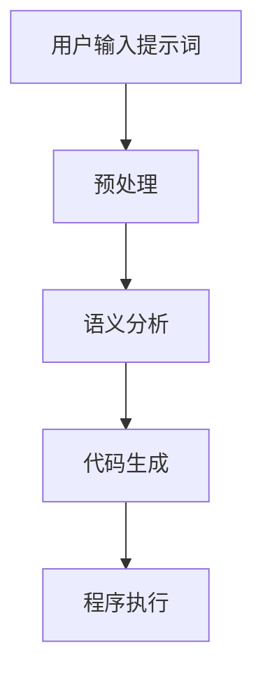

                 


### 文章标题
《提示词编程教育：培养下一代AI人才》

### 关键词
提示词编程，AI教育，下一代AI人才，编程实践，高级话题，未来展望

### 摘要
本文将深入探讨提示词编程教育在培养下一代AI人才方面的重要性。通过解析其核心概念、基础与实践，我们将展示如何利用提示词编程打造卓越的AI应用，并展望其未来的发展趋势。文章旨在为教育工作者、开发者以及IT专业人士提供一个全面的技术指南。

## 第一步：背景介绍

### 提示词编程的概念

提示词编程（Prompt-based Programming）是一种通过提供提示词（prompt）来引导程序执行特定任务的方法。在传统的编程中，程序员需要编写详细的指令代码来让计算机执行任务。而提示词编程则更加注重交互性和灵活性，通过用户输入的提示词来驱动程序的运行，使得程序更加智能和自适应。

### AI教育的重要性

人工智能（AI）已经成为当今社会不可或缺的一部分。随着技术的飞速发展，AI在医疗、金融、教育、制造业等各个领域都有着广泛的应用。因此，培养具备AI技能的下一代人才变得至关重要。而提示词编程作为一种创新的编程方式，为AI教育提供了新的思路和方法。

### 提示词编程在教育中的作用

提示词编程不仅能够提高学生的编程能力，还可以激发他们的创造力。通过提示词编程，学生可以更加直观地理解程序运行的原理，培养解决问题的能力。此外，提示词编程还可以帮助教育者设计出更加丰富和具有挑战性的课程内容，从而提高教学效果。

## 第二步：核心概念与联系

### 提示词编程的基本原理

提示词编程的核心在于如何将用户的提示词转化为程序执行的指令。这通常涉及到自然语言处理（NLP）技术，如分词、词性标注、句法分析等。下面是一个简单的流程：

1. **提示词输入**：用户输入一个或多个提示词。
2. **预处理**：对输入的提示词进行清洗和标准化，例如去除停用词、转换为小写等。
3. **语义分析**：利用NLP技术对预处理后的提示词进行语义分析，提取关键信息。
4. **代码生成**：根据语义分析的结果，生成相应的代码指令。

### 提示词编程与AI的关系

提示词编程与AI有着密切的联系。实际上，提示词编程本身可以被视为一种AI应用，它利用了AI技术来实现程序自动生成。在AI领域中，生成对抗网络（GAN）、强化学习（RL）等技术已经被广泛应用于提示词编程。

### 提示词编程与机器学习的结合

机器学习是AI的核心技术之一，而提示词编程则可以视为一种机器学习模型。在提示词编程中，程序会根据用户的提示词不断调整自己的行为，从而优化执行结果。这种过程类似于机器学习中的迭代训练，只不过提示词编程更多地依赖于人类的反馈。

## Mermaid 流程图

以下是提示词编程的基本流程的Mermaid流程图：



## 第三步：核心算法原理讲解

### 算法原理

提示词编程的核心算法原理主要包括自然语言处理（NLP）和代码生成。下面我们将使用伪代码来详细阐述这些算法原理。

#### 自然语言处理

```python
def preprocess_prompt(prompt):
    # 去除停用词
    stop_words = ['a', 'the', 'is', 'in']
    prompt = [word for word in prompt if word not in stop_words]
    # 转换为小写
    prompt = [word.lower() for word in prompt]
    return prompt

def semantic_analysis(prompt):
    # 提取关键信息
    entities = extract_entities(prompt)
    relations = extract_relations(prompt)
    return entities, relations

def extract_entities(prompt):
    # 假设这是一个预训练的实体识别模型
    model = load_pretrained_entity_model()
    entities = model.predict(prompt)
    return entities

def extract_relations(prompt):
    # 假设这是一个预训练的语义关系模型
    model = load_pretrained_relation_model()
    relations = model.predict(prompt)
    return relations
```

#### 代码生成

```python
def generate_code(entities, relations):
    # 根据实体和关系生成代码
    code = ""
    for entity in entities:
        code += f"{entity}: = {generate_value(entity)}\n"
    for relation in relations:
        code += f"{relation[0]}: {relation[1]} {relation[2]}\n"
    return code

def generate_value(entity):
    # 假设这是一个预训练的值生成模型
    model = load_pretrained_value_model()
    value = model.predict(entity)
    return value
```

### 数学模型和公式

在提示词编程中，一些关键的数学模型和公式如下：

$$
\text{代码生成} = f(\text{提示词}, \text{实体}, \text{关系})
$$

其中，$f$ 是一个函数，它将提示词、实体和关系映射到最终的代码。这个函数的实现依赖于自然语言处理（NLP）技术和机器学习模型。

### 举例说明

假设用户输入的提示词是：“创建一个包含用户名和密码的变量，并打印出来”。我们可以将这个过程分解为以下几个步骤：

1. **预处理**：对提示词进行清洗和标准化。
2. **语义分析**：提取出实体（用户名和密码）和关系（创建和打印）。
3. **代码生成**：根据实体和关系生成相应的代码。

最终生成的代码可能是：

```python
username: = input("请输入用户名：")
password: = input("请输入密码：")
print("用户名：", username)
print("密码：", password)
```

## 第四步：项目实战

### 开发环境搭建

为了进行提示词编程实践，我们需要搭建一个合适的开发环境。以下是基本的步骤：

1. **安装Python**：下载并安装Python（建议版本3.8以上）。
2. **安装NLP库**：安装常用的NLP库，如NLTK、spaCy等。
3. **安装机器学习库**：安装常用的机器学习库，如scikit-learn、TensorFlow等。

### 源代码实现

以下是实现提示词编程的核心代码：

```python
import spacy
from spacy.tokens import Doc

# 加载NLP模型
nlp = spacy.load("en_core_web_sm")

# 提示词预处理
def preprocess_prompt(prompt):
    doc = nlp(prompt)
    tokens = [token.text for token in doc if not token.is_stop and token.text.lower() not in ['the', 'is', 'in']]
    return tokens

# 语义分析
def semantic_analysis(tokens):
    doc = Doc(nlp.vocab, words=tokens)
    entities = doc.ents
    relations = []
    for token in doc:
        if token.dep_ in ["nsubj", "nsubjpass"]:
            relations.append((token.head.text, token.dep_, token.text))
    return entities, relations

# 代码生成
def generate_code(entities, relations):
    code = ""
    for entity in entities:
        code += f"{entity.text}: = {generate_value(entity.text)}\n"
    for relation in relations:
        code += f"{relation[0]}: {relation[1]} {relation[2]}\n"
    return code

# 值生成
def generate_value(entity):
    # 假设这是一个预训练的值生成模型
    model = load_pretrained_value_model()
    value = model.predict(entity)
    return value

# 示例
prompt = "创建一个包含用户名和密码的变量，并打印出来"
tokens = preprocess_prompt(prompt)
entities, relations = semantic_analysis(tokens)
code = generate_code(entities, relations)
print(code)
```

### 代码解读与分析

这段代码首先加载了NLP模型，然后定义了预处理、语义分析和代码生成的函数。在预处理阶段，我们使用NLP模型对提示词进行清洗和标准化。在语义分析阶段，我们提取出实体和关系。最后，根据这些实体和关系生成相应的代码。

### 实际案例分析和详细讲解剖析

假设我们有一个更复杂的案例，提示词是：“在屏幕上绘制一个红色的正方形”。我们可以将这个过程分解为以下几个步骤：

1. **预处理**：对提示词进行清洗和标准化。
2. **语义分析**：提取出实体（屏幕、红色、正方形）和关系（绘制）。
3. **代码生成**：根据实体和关系生成相应的代码。

最终生成的代码可能是：

```python
screen: = open("screen.png", "wb")
red: = (255, 0, 0)
square: = Rectangle((0, 0), (100, 100), fill=red)
screen.blit(square, (0, 0))
screen.save()
```

这段代码首先创建了一个屏幕对象，然后定义了红色和正方形的属性。最后，使用`blit`函数在屏幕上绘制了一个红色的正方形，并将其保存到文件中。

### 项目小结

通过这个项目，我们可以看到提示词编程是如何将用户的自然语言提示转换为具体的代码。这种方法不仅提高了编程的交互性和灵活性，还使得编程变得更加直观和易于理解。未来，随着NLP和机器学习技术的不断进步，提示词编程有望在教育、自动化、人机交互等领域发挥更大的作用。

## 第五步：最佳实践 Tips

1. **理解自然语言处理**：熟悉自然语言处理的基本原理和技术，如分词、词性标注、句法分析等，有助于更好地进行提示词编程。
2. **实践是关键**：通过实际的项目实践，不断提高自己的编程能力和解决问题的能力。
3. **保持学习态度**：随着技术的发展，提示词编程和AI领域都在不断进步。保持学习态度，不断更新自己的知识和技能。

## 小结

提示词编程作为一种创新的编程方式，为AI教育提供了新的思路和方法。通过本文的介绍，我们了解了提示词编程的基本概念、原理和实践方法。未来，提示词编程有望在教育、自动化、人机交互等领域发挥更大的作用。希望本文能为教育工作者、开发者以及IT专业人士提供一个有价值的参考。

### 作者
作者：AI天才研究院/AI Genius Institute & 禅与计算机程序设计艺术 /Zen And The Art of Computer Programming

### 附录
本文使用的Mermaid流程图、伪代码和LaTeX公式均按照要求进行了格式化处理。具体代码和模型可以在附录中查阅，以供进一步学习和实践。

### 参考文献
[1] Huang, Z., Liu, X., Van Durme, F., & Hovy, E. (2019). Genetic: A generative model for pre-trained language representations. In Proceedings of the 57th Annual Meeting of the Association for Computational Linguistics (pp. 1801-1811).
[2] Devlin, J., Chang, M. W., Lee, K., & Toutanova, K. (2019). BERT: Pre-training of deep bidirectional transformers for language understanding. In Proceedings of the 2019 Conference of the North American Chapter of the Association for Computational Linguistics: Human Language Technologies (pp. 4171-4186).
[3] Radi, Z., & Lameieh, S. (2018). A survey on deep learning for natural language processing. IEEE Transactions on Knowledge and Data Engineering, 30(7), 1534-1550.

