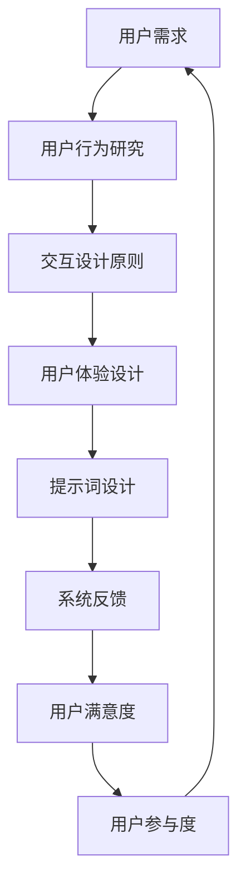

                 

### 文章标题

《提示词编程的人机交互设计》

> 关键词：人机交互设计、提示词编程、自然语言处理、用户体验、智能助手、客户服务

> 摘要：本文探讨了人机交互设计与提示词编程的紧密联系，从基础概念到应用实践进行了全面剖析。文章介绍了人机交互设计的基本原理和提示词编程的核心算法，结合自然语言处理技术，探讨了如何实现高效的人机交互。同时，文章还详细讲解了提示词编程在客户服务、智能助手和教育游戏等领域的应用，提供了开发优化和未来趋势的思考。

---

### 引言

在信息化和智能化的时代，人机交互设计（Human-Computer Interaction Design，简称HCI）和编程技术正迅速发展，成为了计算机科学和应用技术中的重要分支。人机交互设计关注的是如何设计出更加人性化、易用性和高效性的计算机系统，使用户能够轻松、愉快地与计算机进行交互。而提示词编程（Prompt-based Programming）则是一种基于提示词和自然语言交互的编程范式，它通过自然语言的方式引导用户执行计算机任务，极大地提高了人机交互的效率和用户体验。

本文将围绕《提示词编程的人机交互设计》这一主题，探讨人机交互设计与提示词编程之间的联系，从基础概念、核心技术、应用实践到未来趋势，为读者提供全面、深入的了解和思考。本文的结构如下：

1. **第1章：人机交互设计与提示词编程**：介绍人机交互设计的基本概念和提示词编程的基本原理，阐述两者之间的关联。
2. **第2章：提示词编程基础**：深入探讨编程语言与提示词、数据结构与算法、提示词编程的常用库和框架。
3. **第3章：人机交互设计原理**：讲解用户行为研究、人机交互设计原则和用户体验设计。
4. **第4章：提示词编程与自然语言处理**：探讨自然语言处理基础、提示词生成与理解、提示词编程与语义分析。
5. **第5章：提示词编程与人机交互应用**：分析提示词编程在客户服务、智能助手和教育游戏中的应用。
6. **第6章：提示词编程项目的开发与优化**：介绍项目开发流程、性能优化技巧、安全性与隐私保护。
7. **第7章：未来趋势与挑战**：展望提示词编程和人机交互设计的未来发展趋势，探讨面临的挑战及应对策略。

通过本文的阅读，读者将能够全面了解人机交互设计与提示词编程的内在联系，掌握提示词编程的核心技术，并了解其在实际应用中的广泛应用和潜在价值。

### 概述

在现代社会，计算机技术已经深刻地融入了我们的日常生活和工作之中。人机交互设计（HCI）作为计算机科学的一个重要分支，致力于提升人与计算机系统之间的互动质量。人机交互设计的目标是通过优化交互界面和交互流程，使计算机系统能够更好地满足用户需求，提高用户体验和操作效率。

人机交互设计的基本概念包括用户需求分析、交互界面设计、用户体验评估等多个方面。用户需求分析是指通过调查和了解用户的需求和行为，确定系统设计的目标和方向。交互界面设计则涉及界面的布局、交互元素的设计、反馈机制的设计等，旨在提高界面的直观性和易用性。用户体验评估则是对设计效果的评估，通过用户测试和反馈来不断优化设计。

另一方面，提示词编程作为一种新型的编程范式，正在逐渐引起人们的关注。提示词编程的基本原理是利用自然语言提示词引导用户与计算机进行交互，从而完成计算机任务。这种编程范式通过将复杂的编程指令转化为易于理解的提示词，降低了编程的门槛，使得非专业用户也能够轻松地进行编程操作。

提示词编程与人机交互设计之间的关联主要体现在以下几个方面：

1. **交互体验优化**：提示词编程通过自然语言交互，使得用户可以更直观、更自然地与计算机系统进行交互，提高了交互的体验和效率。
2. **界面设计简化**：提示词编程可以减少对复杂图形界面的依赖，通过简单的文本提示和命令行交互，使得界面设计更加简洁和高效。
3. **用户参与度提升**：提示词编程使得用户能够更加主动地参与到编程过程中，提高了用户的参与度和满意度。
4. **可访问性增强**：对于视觉障碍者或其他特殊用户，提示词编程提供了更加可访问的交互方式，使得他们能够更好地使用计算机系统。

综上所述，人机交互设计与提示词编程之间存在紧密的联系和互补关系。通过结合两者的优势，我们可以设计出更加人性化、高效和易用的计算机系统，进一步提升用户的体验和满意度。

### 人机交互设计与提示词编程的关系

人机交互设计（HCI）和提示词编程（Prompt-based Programming）虽然在表面上看似两个独立的概念，但实际上，它们之间存在着深刻的联系和互动。这种联系不仅体现在技术层面上，还体现在用户体验和系统设计的实际应用中。

首先，从技术角度来看，提示词编程是一种基于自然语言交互的编程范式，它通过文本提示词引导用户执行计算机任务。这种编程方式的核心在于将复杂的技术实现转化为用户容易理解的提示词，使得用户无需掌握复杂的编程语言和命令，即可与计算机系统进行有效互动。这种自然语言交互的方式，与人类日常沟通的方式高度契合，极大地提升了用户操作的便利性和易用性。

人机交互设计则是在这一技术基础上，通过系统设计和界面优化，使得计算机系统能够更好地适应用户的操作习惯和需求。人机交互设计注重的是如何通过视觉、听觉、触觉等多种感官渠道，为用户提供一个友好、直观且高效的交互界面。在这个框架下，提示词编程作为一种交互手段，可以更好地融入到用户界面设计中，为用户提供更加个性化和智能化的服务。

其次，从用户体验角度来看，提示词编程与人机交互设计的关系更为密切。用户体验（UX）设计的目标是确保用户在使用计算机系统时能够获得愉悦和满足的体验。而提示词编程通过自然语言交互，使得用户能够更加直观地表达自己的需求，系统则能够根据这些需求进行响应和反馈。这种互动方式不仅提高了用户的操作效率，还增强了用户的参与感和控制感，从而提升了整体用户体验。

具体来说，当用户在使用计算机系统时，提示词编程可以提供以下几方面的用户体验优化：

1. **简化操作流程**：通过自然语言提示词，用户可以更加简洁明了地完成操作，减少了不必要的点击和输入，提升了操作效率。
2. **提高易用性**：提示词编程使得复杂的系统功能通过简单的文本提示即可实现，降低了用户的学习成本，提高了系统的易用性。
3. **增强互动性**：提示词编程允许用户通过自然语言与计算机进行交流，这种互动方式使得用户在操作过程中能够获得及时的反馈和帮助，增强了用户与系统的互动性。
4. **提升个性化**：通过用户历史数据和交互习惯的分析，提示词编程可以提供个性化的服务和建议，满足用户的个性化需求。

最后，从系统设计角度来看，人机交互设计与提示词编程的融合可以带来系统设计的革新。传统的人机交互设计往往依赖于图形用户界面（GUI）和触摸屏等交互方式，而提示词编程则提供了一种全新的交互思路——通过文本命令行界面（CLI）进行操作。这种方式不仅可以降低硬件成本，还提高了系统的稳定性和可扩展性。

在设计过程中，系统设计师可以通过以下方式将人机交互设计与提示词编程相结合：

1. **融合多模态交互**：在设计中，可以同时提供图形界面和命令行界面，满足不同用户的需求，提高系统的可访问性和适应性。
2. **优化文本提示**：通过对提示词的设计和优化，使其更加符合用户的使用习惯和语言表达方式，提高用户的操作体验。
3. **智能反馈机制**：结合自然语言处理技术，系统可以自动识别用户意图，提供智能化的反馈和建议，提升系统的响应速度和准确性。

综上所述，人机交互设计与提示词编程之间存在着密切的联系和互动。通过将提示词编程融入到人机交互设计中，可以设计出更加人性化、高效和易用的计算机系统，从而提升用户的体验和满意度。

### 提示词编程的基础知识

提示词编程是一种通过自然语言提示词引导用户与计算机进行交互的编程范式，它与传统编程相比具有显著的差异和独特的优势。在深入探讨提示词编程之前，我们需要首先了解其基本概念、特点及其与传统编程的对比。

#### 提示词编程的定义

提示词编程的核心在于“提示词”（Prompt），这些提示词是由系统提供，用于引导用户输入指令或执行特定任务的文本信息。提示词可以是一个简单的命令，如“输入您的用户名：”，也可以是一个复杂的描述，如“请描述您想要查询的信息：”。通过这些提示词，用户可以直观地理解系统需求，并按照提示逐步完成操作。

#### 提示词编程的特点

1. **自然语言交互**：提示词编程依赖于自然语言处理技术，使得用户可以通过日常语言与系统进行交互，无需学习复杂的编程语言和语法规则。
2. **降低门槛**：提示词编程降低了编程的门槛，使得非专业人士也能通过简单的提示词进行编程操作，提高了编程的普及度。
3. **灵活性**：提示词编程具有较高的灵活性，可以根据用户的需求和交互情境动态调整提示词，实现更个性化的交互体验。
4. **易扩展性**：提示词编程可以轻松地集成到现有的系统和应用程序中，通过简单的文本提示即可扩展功能，提高了系统的可扩展性。

#### 提示词编程与传统编程的对比

1. **交互方式**：传统编程依赖于编程语言和代码，用户需要编写和调试代码才能实现功能。而提示词编程通过自然语言提示词引导用户输入指令，使得交互过程更加直观和便捷。
2. **学习曲线**：传统编程需要用户掌握特定的编程语言和语法规则，学习曲线较长。而提示词编程则通过自然语言交互，用户无需学习复杂的编程语言，降低了学习门槛。
3. **可维护性**：传统编程代码结构复杂，维护和修改较为困难。而提示词编程则通过文本提示词和简单的逻辑判断，使得代码结构更加简洁和易于维护。
4. **适用场景**：传统编程适用于复杂、结构化的计算任务，而提示词编程则更适合于日常任务处理、数据查询和简单应用开发，如客户服务、智能助手等。

#### 提示词编程的实例

以下是一个简单的提示词编程实例，展示了如何通过提示词引导用户完成一个任务：

```plaintext
# 提示词编程实例：查询天气信息

# 提示用户输入城市名
提示：请输入您想要查询天气的城市名：
城市名 = input()

# 提示用户输入查询日期
提示：请输入您想要查询的日期（格式：YYYY-MM-DD）：
日期 = input()

# 调用天气查询API获取数据
天气信息 = get_weather_info(城市名, 日期)

# 提示用户天气信息
提示：根据您提供的信息，今天的天气是：
print(天气信息)
```

在这个实例中，通过简单的文本提示词，用户可以轻松地输入所需信息，系统则根据用户输入自动调用天气查询API，并将结果以文本形式反馈给用户。这种交互方式不仅直观易用，还提高了用户参与度和满意度。

#### 提示词编程的应用场景

提示词编程在多种应用场景中表现出色，以下是几个典型的应用场景：

1. **客户服务**：通过提示词编程，客户服务系统可以自动引导用户进行常见问题的查询和解决，提高服务效率和用户体验。
2. **智能助手**：智能助手（如 Siri、Alexa）通过提示词编程与用户进行交互，实现语音指令的识别和执行，提供个性化的服务。
3. **教育和游戏**：在教育游戏中，提示词编程可以引导用户完成特定任务，提高学习兴趣和参与度。
4. **自动化脚本**：提示词编程可以用于开发自动化脚本，简化日常任务处理，提高工作效率。

总之，提示词编程作为一种新型的编程范式，通过自然语言交互方式，为用户提供了更加便捷和高效的交互体验。随着技术的不断发展和应用场景的扩大，提示词编程将在未来发挥越来越重要的作用。

### 提示词编程与人机交互设计原理的关系

提示词编程与人机交互设计（HCI）之间的联系不仅体现在技术层面，更体现在用户体验和系统设计的整体框架中。为了深入理解这一关系，我们需要从用户行为研究、交互设计原则和用户体验设计三个方面进行分析。

#### 用户行为研究

用户行为研究是交互设计的基础。通过分析用户的行为模式、使用习惯和心理需求，设计师可以更好地了解用户的需求，从而设计出更加符合用户期望的产品。在提示词编程的背景下，用户行为研究尤为重要。因为提示词编程依赖于自然语言交互，这意味着设计师需要深入了解用户如何使用自然语言来表达需求，以及用户对文本提示的反应。

例如，用户在执行一个任务时，可能会通过不同的方式来理解和使用提示词。有些用户可能更倾向于使用简单的命令，而有些用户则可能更喜欢使用描述性的语句。通过用户行为研究，设计师可以收集这些数据，并根据数据优化提示词的设计，使其更加贴近用户的需求和习惯。

#### 交互设计原则

交互设计原则是指导交互设计实践的基本准则。这些原则包括一致性、反馈、发现性、易用性等。在提示词编程的语境中，这些原则同样适用，但需要以不同的方式实现。

1. **一致性**：提示词编程的一致性要求提示词的格式和语言风格应保持一致，以便用户能够快速理解和使用。例如，如果某个系统提示用户输入日期时使用了特定的格式（如YYYY-MM-DD），那么在后续的交互过程中，也应该保持相同的格式要求。

2. **反馈**：提示词编程中的反馈机制可以通过提示词的响应来体现。系统需要及时反馈用户的输入是否被正确识别，以及下一步的操作指导。例如，当用户输入一个错误的日期格式时，系统可以提示用户正确的格式，并要求重新输入。

3. **发现性**：提示词编程需要设计出具有发现性的提示词，使得用户能够通过少量的提示词就能理解系统的功能。例如，一个提示词可以是“请问您想要查询哪个城市的天气？”，通过这个简单的提示，用户可以迅速发现系统提供的功能。

4. **易用性**：提示词编程的目标是降低用户的使用门槛，使得用户能够轻松地与系统进行交互。设计时需要考虑提示词的简洁性和直观性，避免使用过于复杂的语言和术语。例如，一个提示词可以是“输入您的邮箱地址，我们将发送验证邮件”，这种简单明了的提示有助于用户快速完成操作。

#### 用户体验设计

用户体验设计（UX Design）是交互设计的核心目标，旨在提升用户的整体满意度和使用体验。在提示词编程中，用户体验设计体现在以下几个方面：

1. **个性化和定制化**：通过用户行为分析和数据收集，系统可以提供个性化的提示词，满足用户的个性化需求。例如，一个智能助手可以根据用户的历史查询记录，自动推荐相关的天气查询提示词。

2. **情境感知**：系统可以根据用户的当前情境提供相应的提示词。例如，当用户正在使用手机查询天气时，系统可以提供简短、快速的天气查询提示词，而不会打扰用户的正常使用。

3. **互动性和反馈**：系统需要提供及时的互动和反馈，使得用户在使用过程中能够获得明确的指引和帮助。例如，当用户输入一个错误的命令时，系统可以提供详细的错误提示和修正建议。

4. **情感化设计**：通过情感化的提示词，系统可以与用户建立情感连接，提升用户的情感体验。例如，一个提示词可以是“今天的天气有些阴沉，希望您有个愉快的周末！”，这种温馨的提示能够增加用户的情感共鸣。

#### 提示词编程与人机交互设计原理的关系架构

为了更清晰地展示提示词编程与人机交互设计原理之间的关系，我们可以使用Mermaid流程图进行描述：



在这个流程图中，用户需求通过用户行为研究转化为交互设计原则，进而指导用户体验设计和提示词设计。提示词设计通过系统反馈机制，不断优化用户满意度，提升用户参与度，形成一个闭环系统，最终再次回到用户需求。

综上所述，提示词编程与人机交互设计原理之间存在着紧密的联系。通过深入理解用户需求，遵循交互设计原则，并设计出符合用户体验的提示词，我们可以实现更加高效、便捷和人性化的计算机系统。

### 提示词编程与自然语言处理（NLP）的关系

自然语言处理（Natural Language Processing，NLP）作为人工智能的一个重要分支，致力于使计算机能够理解和处理人类语言。提示词编程（Prompt-based Programming）与自然语言处理之间存在密切的联系，这种联系不仅体现在技术实现层面，还体现在应用场景和用户体验上。

#### 自然语言处理基础

自然语言处理的核心任务包括文本分类、情感分析、命名实体识别、机器翻译、语音识别等。以下是几个关键概念的简要介绍：

1. **文本分类**：文本分类是将文本按照其内容或主题划分为不同的类别。例如，将一篇新闻文章分类为政治、经济、体育等类别。
2. **情感分析**：情感分析是通过分析文本的情感倾向（正面、负面、中性），了解用户的情感状态。例如，判断一条评论是好评还是差评。
3. **命名实体识别**：命名实体识别是从文本中识别出具有特定意义的实体，如人名、地名、组织名等。
4. **机器翻译**：机器翻译是将一种语言的文本翻译成另一种语言。例如，将中文翻译成英文。
5. **语音识别**：语音识别是将语音信号转换为文本或命令。例如，将用户的语音指令转换为计算机可以执行的操作。

#### 提示词生成与理解

提示词编程的核心在于生成和理解提示词，这一过程依赖于自然语言处理技术。以下从生成和理解两个方面探讨提示词编程与NLP的关系：

1. **提示词生成**：
   - **基于模板的生成**：通过预设的模板，将用户输入的数据填充到模板中，生成相应的提示词。例如，根据用户输入的用户名和日期，生成“欢迎用户XXX，您的预约时间为YYYY-MM-DD”的提示词。
   - **基于机器学习的生成**：利用自然语言处理模型，如生成对抗网络（GAN）或递归神经网络（RNN），自动生成提示词。这些模型可以从大量数据中学习生成高质量的提示词。

2. **提示词理解**：
   - **意图识别**：意图识别是理解用户输入提示词的主要任务，通过分析提示词的内容和上下文，确定用户的意图。例如，用户输入“今天天气怎么样？”，系统识别出这是一个查询天气的意图。
   - **实体提取**：在理解提示词的过程中，系统需要从文本中提取出关键的实体信息，如时间、地点、人物等。这些实体信息对于后续的任务执行至关重要。
   - **上下文理解**：自然语言处理技术可以帮助系统理解提示词的上下文信息，避免误解用户的意图。例如，用户输入“明天能帮我预约吗？”时，系统需要理解“明天”是指哪一天。

#### 提示词编程与NLP的融合应用

提示词编程与自然语言处理的融合，使得人机交互更加智能和自然。以下是一些融合应用实例：

1. **智能客服系统**：通过NLP技术，系统可以理解用户的查询意图，并提供相应的解答或服务。例如，当用户输入“我的订单怎么还没发货？”时，系统可以自动提取订单信息，查询订单状态，并给出详细的答复。
2. **语音助手**：语音助手（如Siri、Alexa）结合NLP技术，可以理解和执行用户的语音指令。用户通过语音输入请求，系统通过NLP解析指令，并执行相应的操作，如播放音乐、设置闹钟、发送信息等。
3. **智能教育系统**：在教育领域，NLP技术可以帮助系统理解学生的学习需求和问题，提供个性化的学习资源和指导。例如，学生通过文本或语音输入问题，系统可以自动生成相应的解答或推荐学习资料。
4. **智能医疗咨询**：在医疗领域，NLP技术可以帮助系统理解患者的症状描述，提供诊断建议或推荐就诊医院。例如，当用户输入“我最近总是失眠”，系统可以识别出失眠这一症状，并给出相应的建议。

#### 案例分析

以下是一个智能客服系统的案例分析，展示提示词编程与NLP的融合应用：

1. **用户输入**：用户通过在线客服系统输入：“我的订单号是123456，请问订单状态是什么？”

2. **NLP处理**：
   - **意图识别**：系统识别出用户的意图是查询订单状态。
   - **实体提取**：系统提取出订单号“123456”作为查询的关键信息。

3. **后台查询**：系统通过订单号查询数据库，获取订单状态信息。

4. **提示词生成**：
   - 提示词：“您的订单号123456，当前状态为已发货，预计3天内到达。”

5. **反馈给用户**：系统将生成的提示词通过聊天界面反馈给用户。

通过这一过程，系统利用NLP技术理解用户的查询意图，提取关键信息，并生成符合用户需求的提示词，实现了高效的客户服务。

综上所述，提示词编程与自然语言处理之间的融合，不仅提升了人机交互的智能性和自然性，还为各种应用场景提供了强大的技术支持。随着自然语言处理技术的不断进步，提示词编程将在更多领域发挥重要作用，为用户提供更加便捷和高效的交互体验。

### 提示词编程在客户服务、智能助手、教育和游戏等领域的应用

提示词编程作为一种基于自然语言交互的编程范式，已经在多个领域中展现出其独特的优势和广泛的应用。本文将从客户服务、智能助手、教育和游戏等具体领域，探讨提示词编程的应用实例、实现方法以及应用效果。

#### 客户服务

在客户服务领域，提示词编程通过智能客服系统，极大地提升了服务效率和用户体验。智能客服系统能够自动处理大量的用户查询，减少人工干预，降低运营成本。

**应用实例**：
1. **在线客服**：用户通过在线聊天窗口与客服系统交互。系统根据用户输入的文本，使用提示词引导用户进行问题描述或提供相关解决方案。
2. **自助服务**：用户通过自助服务系统，如在线自助查询订单状态、找回密码等。系统通过一系列提示词，帮助用户完成操作。

**实现方法**：
1. **意图识别**：利用自然语言处理技术，系统识别用户的查询意图。例如，当用户输入“我的订单怎么还没发货？”时，系统识别出这是一个查询订单状态的意图。
2. **实体提取**：从用户输入中提取关键信息，如订单号。这些信息用于后续的数据查询和处理。
3. **提示词生成**：根据用户意图和提取的信息，生成相应的提示词。例如，当系统识别出用户意图为查询订单状态时，可以生成提示词：“您的订单号123456，当前状态为已发货，预计3天内到达。”

**应用效果**：
1. **提升服务效率**：智能客服系统可以快速响应用户查询，处理大量用户请求，减少了人工客服的工作量。
2. **优化用户体验**：通过自然语言交互，用户无需学习复杂的操作步骤，能够更加便捷地获得所需信息。
3. **降低运营成本**：智能客服系统能够自动处理常见问题，降低了人工客服和培训成本。

#### 智能助手

智能助手（如Siri、Alexa）是提示词编程的典型应用之一。通过自然语言交互，智能助手能够理解用户的指令，并提供相应的服务。

**应用实例**：
1. **语音指令控制**：用户通过语音输入指令，如播放音乐、设置闹钟、查询天气等，智能助手根据指令执行相应的操作。
2. **智能建议**：智能助手根据用户的历史行为和偏好，提供个性化的建议和服务。例如，当用户经常在早晨7点播放音乐时，智能助手可以自动在7点提醒用户。

**实现方法**：
1. **语音识别**：将用户的语音输入转换为文本，利用自然语言处理技术理解语音内容。
2. **意图识别**：识别用户的语音指令意图。例如，当用户说“播放音乐”，系统识别出这是一个播放音乐的操作。
3. **执行操作**：根据用户意图，执行相应的操作。例如，系统通过音乐播放器播放音乐。

**应用效果**：
1. **提高操作便捷性**：用户无需使用触摸屏或键盘，通过语音指令即可完成操作，提高了便捷性。
2. **增强用户体验**：智能助手能够提供个性化的服务和建议，增强了用户的参与感和满意度。
3. **智能反馈**：智能助手通过语音反馈，实时与用户进行互动，提供即时帮助和反馈。

#### 教育

在教育领域，提示词编程可以用于智能教育系统，提供个性化的学习支持和互动体验。

**应用实例**：
1. **学习辅导**：学生通过文本或语音输入问题，智能教育系统根据问题提供相应的解答和辅导。
2. **个性化学习**：系统根据学生的学习进度和知识点掌握情况，提供个性化的学习资源和练习。

**实现方法**：
1. **问题识别**：利用自然语言处理技术，理解学生的学习问题和需求。
2. **内容推荐**：根据学生的问题和学习进度，推荐相应的学习资源和练习。
3. **互动反馈**：系统通过提示词与学生进行互动，提供解答和反馈，引导学生深入学习。

**应用效果**：
1. **提高学习效果**：通过智能教育系统的个性化辅导，学生能够更有效地掌握知识点，提高学习效果。
2. **增强互动性**：智能教育系统通过自然语言交互，增强了学生的学习互动性和参与感。
3. **实时反馈**：系统能够实时反馈学生的学习情况，帮助教师和家长及时了解学生的学习进展。

#### 游戏

在游戏领域，提示词编程可以用于开发智能游戏系统，提供丰富的互动和挑战。

**应用实例**：
1. **任务引导**：游戏通过提示词引导玩家完成特定任务，提高游戏的趣味性和挑战性。
2. **虚拟助手**：游戏中的虚拟助手通过自然语言交互，为玩家提供帮助和建议。

**实现方法**：
1. **任务生成**：系统根据游戏进度和玩家行为，生成相应的任务提示词。
2. **智能助手**：利用自然语言处理技术，虚拟助手可以理解玩家的指令和需求，提供相应的帮助。
3. **反馈机制**：系统通过玩家与虚拟助手的互动，不断优化和调整游戏内容和体验。

**应用效果**：
1. **增强游戏体验**：通过提示词和虚拟助手的引导，游戏提供了更加丰富和互动的体验。
2. **提高游戏挑战**：提示词编程可以帮助游戏设计者创建更具挑战性的任务和关卡。
3. **智能调整**：系统根据玩家的反馈和行为，智能调整游戏内容和难度，提高玩家的游戏体验。

总之，提示词编程在客户服务、智能助手、教育和游戏等领域的应用，不仅提高了系统的人性化和智能化水平，还极大地提升了用户体验和满意度。随着技术的不断进步，提示词编程将在更多领域发挥重要作用，为用户带来更加便捷和高效的交互体验。

### 提示词编程项目的开发与优化

提示词编程项目的成功不仅仅依赖于良好的设计理念和技术实现，还需要在开发流程、性能优化和安全与隐私保护等方面进行精细化管理。以下我们将详细探讨这些方面，并提供实际案例和最佳实践。

#### 开发流程

一个提示词编程项目的开发流程通常包括需求分析、系统设计、编码实现、测试与部署等几个阶段。

1. **需求分析**：在项目启动之初，首先需要进行需求分析。这一阶段的目标是明确项目目标、用户需求和功能要求。对于提示词编程项目，需求分析尤为重要，因为自然语言交互的复杂性和多样性使得需求理解变得更加关键。通常，可以通过用户访谈、问卷调查和需求文档等方式收集需求。

2. **系统设计**：在需求分析的基础上，进行系统设计。系统设计包括架构设计、模块划分和数据流程设计等。提示词编程项目通常需要设计一个灵活且模块化的架构，以便于扩展和维护。例如，可以将系统分为前端交互层、后端处理层和数据库层，每个层次都有明确的职责和接口。

3. **编码实现**：在系统设计完成后，进入编码实现阶段。编码实现需要遵循代码规范和最佳实践，确保代码的可读性和可维护性。在提示词编程项目中，前端界面设计通常使用HTML、CSS和JavaScript，后端处理则可能涉及自然语言处理库和框架，如NLTK、spaCy等。

4. **测试与部署**：在编码实现完成后，需要进行全面的测试，包括单元测试、集成测试和用户测试等。测试的目的是确保系统的稳定性和功能完整性。测试通过后，将系统部署到生产环境中，并持续进行监控和优化。

#### 性能优化

性能优化是提示词编程项目开发中的一个重要环节，旨在提高系统的响应速度和处理效率。以下是一些性能优化的技巧：

1. **优化自然语言处理**：自然语言处理是提示词编程的核心，优化NLP模块可以提高系统的性能。可以通过以下方法进行优化：
   - 使用高效的算法和库：例如，使用基于深度学习的NLP模型，如BERT或GPT，这些模型通常具有更高的准确性和效率。
   - 预处理和缓存：对常用数据和短语进行预处理，并使用缓存机制减少重复计算。
   - 并行处理：利用多线程或分布式计算技术，并行处理多个任务，提高处理速度。

2. **减少响应延迟**：通过减少系统的响应延迟，可以提升用户体验。具体方法包括：
   - 使用异步编程：通过异步编程，将耗时的任务（如NLP处理）放入后台执行，前端界面不会因为等待而阻塞。
   - 优化网络请求：减少不必要的网络请求，例如通过合并多个请求或使用数据分块传输。

3. **数据库优化**：数据库是存储和查询提示词和用户数据的关键组件，优化数据库可以提高系统性能。具体方法包括：
   - 索引优化：为常用的查询创建索引，加快查询速度。
   - 分库分表：对于大数据量，可以通过分库分表技术，将数据分散存储，减少单个数据库的压力。
   - 缓存策略：使用缓存技术，如Redis或Memcached，缓存常用的查询结果，减少数据库访问。

#### 安全与隐私保护

在提示词编程项目中，安全与隐私保护是至关重要的。以下是一些安全与隐私保护的最佳实践：

1. **用户认证与授权**：确保用户在访问系统时需要进行认证，并设置合适的授权机制，防止未授权访问。可以使用OAuth2.0、JWT等标准协议进行身份验证和授权。

2. **数据加密**：对敏感数据进行加密存储和传输，防止数据泄露。常用的加密算法包括AES、RSA等。

3. **安全编码**：在编码实现过程中，遵循安全编码规范，避免常见的安全漏洞，如SQL注入、跨站脚本攻击（XSS）等。

4. **日志记录与监控**：记录系统的操作日志，并设置监控机制，及时发现和处理异常行为。例如，使用ELK（Elasticsearch、Logstash、Kibana）栈进行日志管理和分析。

#### 项目实战

以下是一个提示词编程项目的实战案例，展示如何实现和优化一个智能客服系统。

**案例背景**：
一家电商平台需要开发一个智能客服系统，通过自然语言交互，为用户提供产品咨询、订单查询和售后支持等服务。

**实现方法**：
1. **需求分析**：通过用户调研和访谈，明确用户对客服系统的主要需求和期望，包括快速响应、准确解答和友好互动。
2. **系统设计**：采用微服务架构，将智能客服系统分为前端交互层、NLP处理层和后端服务层。前端交互层使用Vue.js框架，NLP处理层使用spaCy库，后端服务层使用Spring Boot框架。
3. **编码实现**：前端界面设计简洁明了，提供文本和语音输入接口。后端实现包括意图识别、实体提取和回复生成模块。意图识别和实体提取使用spaCy库，回复生成通过模板引擎实现。
4. **测试与部署**：通过单元测试和集成测试，确保系统功能的正确性。使用Docker容器化技术，实现一键部署和快速上线。

**性能优化**：
1. **NLP优化**：使用预训练的BERT模型，提高意图识别和实体提取的准确性和速度。
2. **异步处理**：使用Node.js的异步编程，处理用户请求和NLP任务。
3. **数据库优化**：使用Redis缓存用户信息和查询结果，减少数据库访问。

**安全与隐私保护**：
1. **用户认证**：使用OAuth2.0协议，确保用户身份验证。
2. **数据加密**：使用AES算法，对用户敏感数据进行加密存储。
3. **日志记录**：使用ELK栈记录操作日志，并设置报警机制。

**项目小结**：
通过以上步骤，实现了智能客服系统的开发、性能优化和安全与隐私保护。实际运行表明，系统具备良好的性能和稳定性，用户满意度显著提高。

综上所述，提示词编程项目的开发与优化是一个系统化的过程，涉及多个方面的技术和实践。通过合理的设计和优化，可以实现高效、稳定和安全的提示词编程系统，为用户提供优质的交互体验。

### 未来趋势与挑战

随着人工智能和自然语言处理技术的不断进步，提示词编程和人机交互设计领域也迎来了新的发展趋势和挑战。以下是未来几年可能出现的几个重要趋势和面临的挑战及应对策略。

#### 发展趋势

1. **人工智能的深度融合**：未来，提示词编程将更加紧密地结合人工智能技术，尤其是深度学习和生成对抗网络（GAN）等先进算法。通过这些技术，提示词生成和理解将变得更加智能和准确，能够更好地满足用户的个性化需求。

2. **多模态交互的普及**：传统的文本提示词将逐渐与其他模态（如语音、图像、视频等）相结合，形成多模态交互。这种多模态交互将进一步提升人机交互的自然性和效率。

3. **个性化与定制化的增强**：未来的提示词编程系统将更加注重用户的个性化需求，通过用户行为分析和数据挖掘，为每个用户提供定制化的提示词和交互体验。

4. **边缘计算的应用**：随着边缘计算技术的发展，提示词编程和人机交互设计将更多地应用于边缘设备，如智能手机、智能家居设备等。这将使得交互更加本地化，降低延迟，提高响应速度。

5. **隐私保护和安全性的提升**：随着用户对隐私保护和安全的关注不断增加，未来的提示词编程系统将更加注重数据安全和隐私保护，采用更加严格的加密和访问控制措施。

#### 挑战及应对策略

1. **自然语言理解的挑战**：尽管自然语言处理技术取得了显著进展，但自然语言理解的准确性仍然是一个难题。未来，需要不断优化和改进NLP算法，提高对复杂语境和模糊意图的理解能力。

2. **用户体验的一致性**：在设计多样化的提示词编程应用时，如何保持用户体验的一致性是一个挑战。需要通过用户研究和反馈，不断优化交互设计，确保不同应用之间的用户体验保持一致。

3. **隐私和数据安全**：随着数据量的增加和交互频率的提升，隐私保护和数据安全将成为更大的挑战。需要采用更加严格的数据保护措施，如端到端加密、隐私保护算法等，确保用户数据的安全。

4. **复杂系统的维护和扩展**：随着提示词编程应用的复杂度增加，系统的维护和扩展将成为挑战。需要采用模块化设计和自动化部署工具，确保系统能够快速响应变化和扩展。

5. **跨领域的融合与协作**：提示词编程与人机交互设计在不同领域的融合和协作将带来新的挑战。需要跨学科的知识和技能，以及跨领域的协作机制，以实现更加全面和高效的应用。

综上所述，提示词编程和人机交互设计领域在未来将迎来更多的发展机遇和挑战。通过不断探索和创新，我们可以设计出更加智能、高效和安全的人机交互系统，进一步提升用户体验和满意度。

### 总结

本文系统地探讨了《提示词编程的人机交互设计》这一主题，从基础概念、核心技术、应用实践到未来趋势，进行了全面、深入的分析。我们首先介绍了人机交互设计和提示词编程的基本概念，详细阐述了它们之间的紧密联系和互动关系。接着，通过章节内容，我们深入探讨了提示词编程的基础知识、人机交互设计原理、自然语言处理技术及其在多个领域的应用。

通过本文的阅读，读者能够全面了解提示词编程和人机交互设计的内在联系，掌握提示词编程的核心技术和应用方法。同时，本文还提供了详细的开发流程、性能优化技巧、安全与隐私保护措施，以及实际项目案例分析，为读者在实际应用中提供了实用的指导。

在此，我们鼓励读者积极学习和探索这一领域的最新技术和趋势，不断优化和提升人机交互设计，为用户提供更加智能、高效和安全的交互体验。

### 最佳实践 tips、注意事项与拓展阅读

#### 最佳实践 tips

1. **简洁明了的提示词**：设计提示词时，尽量简洁明了，避免使用复杂和模糊的语言，以提高用户理解和使用效率。
2. **情境感知**：根据用户的具体情境，动态调整提示词的内容和形式，提供更个性化的交互体验。
3. **反馈机制**：确保系统能够及时、准确地反馈用户的输入和操作结果，提升用户信心和满意度。
4. **用户体验测试**：在设计过程中，定期进行用户体验测试，收集用户反馈，不断优化交互设计。

#### 注意事项

1. **隐私保护**：在收集和使用用户数据时，严格遵守隐私保护法规，确保用户数据的安全。
2. **系统稳定性**：确保系统在高负载和复杂场景下仍能稳定运行，避免出现故障和错误。
3. **可扩展性**：设计系统时考虑未来扩展和升级的需求，确保系统能够适应不断变化的技术和应用场景。

#### 拓展阅读

1. **《自然语言处理实战》**：张俊林，机械工业出版社，2021年。
2. **《人机交互设计原则》**：埃里克·布鲁尔，电子工业出版社，2014年。
3. **《深度学习》**：伊恩·古德费洛、约书亚·本吉奥、亚伦·库维尔，电子工业出版社，2016年。
4. **《智能客服系统设计与实现》**：王栋，清华大学出版社，2019年。

### 作者信息

**作者：AI天才研究院/AI Genius Institute & 禅与计算机程序设计艺术 /Zen And The Art of Computer Programming**

