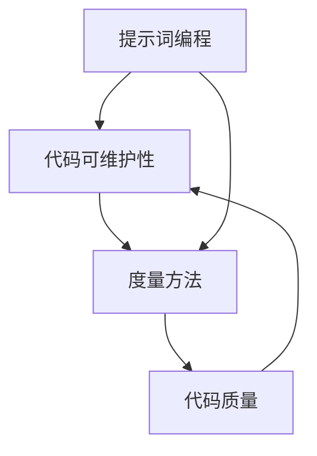

                 

### 引言

《提示词编程的代码可维护性度量》这本书旨在探讨在提示词编程（Prompt-Based Programming）环境下，如何科学、系统地评估代码的可维护性。随着计算机技术的不断进步，编程语言和开发工具日益多样化和复杂化，编程过程中的代码可维护性显得尤为重要。维护性的高低直接影响到软件的开发成本、维护成本和项目的整体质量。因此，如何有效地度量代码的可维护性，已经成为计算机科学和软件工程领域的重要研究课题。

本书的背景源于近年来人工智能和自然语言处理技术的飞速发展，提示词编程作为一种新型的编程模式，正在逐渐崭露头角。提示词编程的核心思想是通过自然语言提示来引导程序执行，从而减少代码的编写量，提高开发效率。然而，提示词编程也带来了一定的挑战，例如代码的可读性、可维护性和可扩展性等问题。因此，如何度量这些特性，如何优化编程过程，成为了本书研究的重点。

本书的研究目的在于：首先，系统地梳理提示词编程和代码可维护性的基本概念；其次，深入探讨度量代码可维护性的核心算法原理；最后，通过实际项目案例，展示如何应用这些概念和算法，提出有效的优化策略。希望通过本书的研究，能够为开发者提供实用的指导，帮助他们在实际项目中更好地管理和维护代码。

全书分为七个章节。第1章介绍核心概念与联系，包括提示词编程、代码可维护性和度量方法与工具。第2章讲解核心算法原理，详细阐述度量算法的基本原理和数学模型。第3章通过案例研究，展示如何在实际项目中应用这些概念和算法。第4章和第5章分别介绍度量工具的使用方法和代码实现细节。第6章讨论优化方法和策略，第7章总结全书的主要结论，并展望未来的研究方向。通过这七个章节的深入探讨，希望能够为读者提供一个全面、系统的理解和实践经验。

### 核心概念与联系

在深入探讨《提示词编程的代码可维护性度量》这一主题之前，我们需要明确几个核心概念，并理解它们之间的联系。这些核心概念包括“提示词编程”、“代码可维护性”和“度量方法”。

首先，**提示词编程**是一种基于自然语言提示的编程模式，它允许开发者通过输入自然语言提示来引导程序执行。与传统编程模式不同，提示词编程通过更直观和人性化的方式与计算机交互，从而减少代码的编写量和提高开发效率。这种编程模式特别适合于处理复杂和动态变化的问题，例如人工智能应用、自然语言处理和自动化测试等。

**代码可维护性**是指代码在未来的开发和维护过程中，能够被轻松理解和修改的能力。一个高可维护性的代码库不仅能够提高开发效率，还能够降低维护成本，减少潜在的错误和漏洞。代码可维护性通常受到多种因素的影响，包括代码结构、注释质量、模块化程度、代码复用性和可扩展性等。

**度量方法**是评估代码可维护性的核心手段。度量方法通过量化指标来评估代码的不同方面，从而提供客观的数据支持。常用的度量方法包括静态代码分析、动态测试、代码质量度量工具和开发者经验反馈等。

这些核心概念之间的联系在于：

1. **提示词编程**为代码的可维护性提供了新的思路。通过自然语言提示，开发者可以更加直观地表达编程意图，从而减少代码冗余和复杂性，提高代码的清晰度和可读性。

2. **代码可维护性**是衡量提示词编程成功与否的重要指标。高可维护性的代码不仅能够降低后续的开发和运维成本，还能够提高软件的整体质量和用户满意度。

3. **度量方法**为评估代码可维护性提供了科学依据。通过系统化的度量方法，开发者可以全面了解代码的现状，发现潜在的问题，并采取相应的优化措施。

为了更好地理解这些概念之间的联系，我们可以借助一个**Mermaid流程图**来展示它们之间的关系：



在这个流程图中，提示词编程作为输入，通过度量方法对代码质量进行评估，最终影响代码的可维护性。通过这个流程图，我们可以清晰地看到各个概念之间的相互作用和依赖关系。

综上所述，提示词编程、代码可维护性和度量方法是一个紧密联系的整体。理解它们之间的关系，有助于我们在实践中更好地应用这些概念，提高代码的质量和可维护性。接下来，我们将进一步探讨度量算法的原理，为实际应用打下基础。

### 第1章：定义与基础

#### 1.1 提示词编程简介

提示词编程（Prompt-Based Programming）是一种基于自然语言提示的编程模式，它允许开发者通过输入自然语言提示来引导程序执行。这种编程模式的核心思想是利用自然语言与计算机系统进行交互，从而实现编程意图。与传统的命令式编程不同，提示词编程更加注重人机交互的便利性和直观性。

提示词编程的起源可以追溯到自然语言处理（NLP）和人工智能（AI）领域。随着机器学习技术的发展，特别是深度学习模型在自然语言处理中的应用，提示词编程逐渐成为一种重要的编程范式。例如，在聊天机器人、智能助手和自动化测试等领域，提示词编程已经成为提升开发效率和用户体验的关键手段。

提示词编程的特点包括：

1. **高开发效率**：通过自然语言提示，开发者可以迅速传达编程意图，减少代码的编写量和调试时间。
2. **易用性**：提示词编程降低了编程门槛，使得非专业开发人员也能够参与到软件开发过程中。
3. **灵活性**：提示词编程允许开发者根据需求动态调整程序行为，提高系统的可扩展性和适应性。

在实际应用中，提示词编程广泛应用于以下几个方面：

1. **自动化测试**：通过自然语言提示来生成测试用例，提高测试的全面性和准确性。
2. **智能助手**：在智能音箱、虚拟助手和聊天机器人中，提示词编程使得系统可以理解并响应用户的自然语言指令。
3. **数据分析和处理**：通过自然语言提示，开发者可以轻松处理和分析复杂数据集，提高数据分析的效率和质量。

总之，提示词编程作为一种新兴的编程模式，正逐渐改变传统的编程方式，为开发者提供更高效、更灵活的编程解决方案。

#### 1.2 代码可维护性概述

代码可维护性是指代码在未来的开发和维护过程中，能够被轻松理解和修改的能力。它是衡量软件质量的重要指标之一，对项目的长期成功至关重要。高可维护性的代码不仅能够提高开发效率，还能够降低维护成本，减少潜在的错误和漏洞。

代码可维护性通常受到多种因素的影响，包括但不限于以下几个方面：

1. **代码结构**：良好的代码结构是代码可维护性的基础。一个清晰、合理的代码结构可以使得代码更容易理解、修改和扩展。
2. **注释质量**：注释是帮助开发者理解代码的重要工具。高质量的注释可以减少后续维护过程中出现的问题，提高代码的可读性。
3. **模块化程度**：模块化设计使得代码更加独立和可重用，有助于提高代码的可维护性。每个模块应该具有明确的功能和职责，减少模块之间的依赖关系。
4. **代码复用性**：复用现有代码可以减少重复工作，提高开发效率。一个高可维护性的代码库通常具有较强的代码复用能力。
5. **可扩展性**：良好的可扩展性使得代码能够轻松应对未来的需求变化，保持其长期的有效性。

代码可维护性的重要性体现在以下几个方面：

1. **降低维护成本**：一个高可维护性的代码库可以显著降低维护成本。开发者可以更快速地理解和修复代码，减少因维护问题导致的停机时间。
2. **提高开发效率**：良好的代码可维护性使得开发过程更加高效。开发者可以更快地添加新功能、修复漏洞和改进性能。
3. **提高软件质量**：高可维护性的代码通常更加稳定和可靠。通过持续地维护和优化，软件的整体质量可以得到显著提升。
4. **增强团队合作**：良好的代码可维护性有助于团队成员之间的协作。每个人都可以更容易地理解代码，减少沟通成本和误解。

为了提升代码的可维护性，开发者可以采取以下措施：

1. **代码审查**：通过定期进行代码审查，可以发现和修复潜在的问题，提高代码质量。
2. **使用版本控制**：版本控制工具（如Git）可以帮助开发者更好地管理代码变化，防止代码冲突和丢失。
3. **编写高质量的注释**：确保注释清晰、准确，能够帮助其他开发者快速理解代码意图。
4. **遵循编码规范**：一致的编码规范有助于提高代码的可读性和可维护性。
5. **持续学习和改进**：开发者应该持续学习和掌握新的编程技术和工具，不断提升自己的编程能力。

总之，代码可维护性是软件开发过程中不可忽视的重要方面。通过关注和提升代码的可维护性，开发者可以更好地管理代码，提高软件质量和开发效率。

#### 1.3 度量方法与工具

评估代码可维护性需要使用科学和系统的度量方法，这些方法能够提供定量和定性的数据，帮助开发者了解代码的维护情况。常用的代码可维护性度量方法包括静态代码分析、动态测试、代码质量度量工具和开发者经验反馈等。

**静态代码分析**是一种在不运行程序的情况下，对代码结构和内容进行分析的方法。它可以帮助发现潜在的问题，如语法错误、代码冗余、潜在的安全漏洞等。静态代码分析工具（如SonarQube、FindBugs和PMD）通过自动扫描代码，生成详细的报告，提供代码质量评估。

**动态测试**是在代码运行时进行测试的方法，它通过运行程序并监控其行为来评估代码的质量。动态测试可以揭示运行时错误和性能问题。常见的动态测试方法包括单元测试、集成测试和性能测试。这些测试方法通常由测试框架（如JUnit、TestNG和Selenium）提供支持。

**代码质量度量工具**结合了静态代码分析和动态测试的优势，提供全面的代码质量评估。这些工具不仅能够检测代码中的问题，还能够根据预设的度量标准对代码质量进行评分。常见的代码质量度量工具包括SonarQube、CAST、CodeScene和qTest等。

**开发者经验反馈**是一种定性的度量方法，通过收集开发者的意见和建议来评估代码的可维护性。这种方法有助于了解开发者在实际开发过程中遇到的困难和挑战，从而针对性地改进代码。

以下是一些常用的代码可维护性度量工具及其功能：

1. **SonarQube**：SonarQube是一个开源的平台，提供代码质量管理和度量。它支持多种编程语言，能够进行静态代码分析，检测代码中的漏洞、冗余和风格问题，并提供详细的报告。
   
2. **FindBugs**：FindBugs是一个开源的静态代码分析工具，用于检测Java代码中的潜在问题。它能够自动扫描代码，发现如空指针异常、不安全类型转换等常见错误。

3. **PMD**：PMD是一个静态代码分析工具，用于检测Java、JavaScript、Python等编程语言中的代码质量。它能够检测代码冗余、潜在的异常处理问题等。

4. **JUnit**：JUnit是一个流行的Java单元测试框架，用于编写和执行测试用例。它可以帮助开发者验证代码的功能和行为，确保代码的稳定性和可靠性。

5. **TestNG**：TestNG是一个强大的测试框架，用于编写和执行测试用例。它支持多种编程语言，提供了丰富的测试功能，如数据驱动测试、参数化测试和依赖测试。

6. **Selenium**：Selenium是一个自动化测试工具，用于对Web应用程序进行功能测试。它支持多种浏览器和编程语言，可以帮助开发者自动化测试用例，提高测试效率。

7. **CAST**：CAST是一个专业的代码质量度量工具，能够对代码进行全面的质量评估。它支持多种编程语言，提供了丰富的度量指标，如代码重复率、复杂度、代码覆盖率等。

8. **CodeScene**：CodeScene是一个智能代码分析工具，利用机器学习技术来预测代码中的潜在风险。它能够根据代码历史和团队经验，提供代码质量的实时反馈。

9. **qTest**：qTest是一个测试管理工具，用于管理测试计划和测试用例。它支持多种测试方法，如回归测试、性能测试和自动化测试，并提供详细的测试报告。

通过使用这些度量工具，开发者可以全面评估代码的可维护性，发现潜在的问题，并采取相应的措施进行改进。这些工具不仅提高了代码的可维护性，还降低了开发和维护成本，提高了软件的质量和可靠性。

### 第2章：核心算法原理

#### 2.1 度量算法原理

度量代码可维护性的核心算法通常基于代码质量评估模型，这些模型通过量化代码的不同特征来综合评估其可维护性。以下是几种常用的度量算法原理，包括其基本思想和核心步骤。

**1. 质量函数模型（Quality Function Model）**

质量函数模型是度量代码可维护性的基本模型，它通过定义一系列的代码质量特征，并建立这些特征与代码可维护性之间的函数关系。该模型的基本思想是将代码质量视为多个子属性的组合，每个子属性都有其特定的度量指标。

核心步骤：
- **定义质量特征**：例如可读性、模块化程度、注释质量等。
- **选择度量指标**：例如代码行数、循环复杂度、类与方法的耦合度等。
- **构建质量函数**：通过回归分析或其它统计方法，确定每个质量特征对代码可维护性的影响程度，形成质量函数。

**2. 质量度量模型（Quality Metrics Model）**

质量度量模型通过直接量化代码质量特征来评估代码的可维护性。这种模型通常基于一系列已定义的质量度量标准，如ISO/IEC 25010质量模型，它定义了多个质量属性和子属性。

核心步骤：
- **定义质量属性和子属性**：例如功能性、可靠性、易用性、效率、可维护性、可移植性等。
- **选择度量方法**：例如代码审查、自动化测试、静态代码分析等。
- **计算质量得分**：通过量化每个质量属性和子属性的得分，综合计算代码的整体质量得分。

**3. 基于机器学习的模型（Machine Learning Model）**

基于机器学习的模型利用历史数据来训练模型，预测代码的可维护性。这种方法能够处理复杂的非线性关系，并能够自适应地调整预测模型。

核心步骤：
- **收集数据**：从代码库中提取历史维护数据，如bug修复时间、代码更改频率等。
- **特征工程**：提取代码库中的特征，如代码行数、循环复杂度、注释比例等。
- **训练模型**：使用已标记的维护数据训练机器学习模型，例如决策树、随机森林、神经网络等。
- **评估模型**：使用交叉验证等方法评估模型的准确性和泛化能力。

**4. 混合模型（Hybrid Model）**

混合模型结合了质量函数模型、质量度量模型和机器学习模型的优势，通过多种方式度量代码的可维护性。

核心步骤：
- **多角度度量**：同时使用静态代码分析、动态测试和开发者反馈等多种度量方法。
- **综合评估**：将不同度量方法的结果进行加权融合，形成综合的可维护性评分。
- **迭代优化**：根据实际维护情况和模型预测结果，持续迭代优化模型参数。

以上四种度量算法原理各有优缺点，开发者可以根据具体项目需求和实际情况选择合适的方法。在实际应用中，为了提高度量精度和可靠性，通常会结合多种方法，形成一套综合的度量体系。

#### 2.2 数学模型与应用

在度量代码可维护性时，数学模型的应用至关重要。这些模型能够帮助我们量化代码的不同特征，并建立它们与代码可维护性之间的关系。以下介绍几种常见的数学模型及其在代码可维护性度量中的应用。

**1. 决策树模型（Decision Tree Model）**

决策树是一种常用的分类模型，它可以基于一系列规则来对代码进行分类，判断其可维护性。

核心步骤：
- **特征选择**：选择对代码可维护性有显著影响的特征，例如循环复杂度、代码行数、注释比例等。
- **划分节点**：根据所选特征，将数据集划分为多个节点，每个节点代表一个特定的特征区间。
- **构建决策树**：从根节点开始，根据特征值递归划分节点，直至达到停止条件，如最大深度、最小样本数等。

应用示例：
假设我们要使用决策树模型预测代码的可维护性，根据循环复杂度（Cyclomatic Complexity）和代码行数（Lines of Code, LOC）构建一个简单的决策树。对于每个样本，我们根据这两个特征将其划分到不同的区域，并记录该区域的维护性评分。最终的决策树可以表示为：

$$
\text{Decision Tree} =
\begin{cases}
\text{Low Maintainability} & \text{if } C > 10 \text{ and } LOC > 1000 \\
\text{Medium Maintainability} & \text{if } C > 10 \text{ and } LOC \leq 1000 \\
\text{High Maintainability} & \text{if } C \leq 10
\end{cases}
$$

其中，C 表示循环复杂度，LOC 表示代码行数。

**2. 支持向量机模型（Support Vector Machine, SVM）**

支持向量机是一种强大的分类模型，它通过找到一个最优的超平面来分割数据集，从而预测代码的可维护性。

核心步骤：
- **特征提取**：从代码库中提取特征，如代码行数、注释比例、类和方法的复杂度等。
- **数据预处理**：对特征进行标准化处理，使其具有相同的量纲。
- **模型训练**：使用标记数据集训练SVM模型，找到最佳的超平面。
- **模型评估**：通过交叉验证等方法评估模型的准确性和泛化能力。

应用示例：
假设我们使用SVM模型来预测代码的可维护性，输入特征包括代码行数（X）、注释比例（Y）和循环复杂度（Z）。通过训练SVM模型，我们可以得到以下决策边界：

$$
w \cdot \begin{bmatrix} X \\ Y \\ Z \end{bmatrix} + b = 0
$$

其中，$w$ 是权重向量，$b$ 是偏置项。对于每个新的代码样本，我们将其特征向量代入上述方程，判断其在超平面的一侧还是另一侧，从而预测其可维护性。

**3. 神经网络模型（Neural Network Model）**

神经网络是一种模拟人脑工作的计算模型，它通过多层节点和权重进行非线性变换，从而对代码的可维护性进行预测。

核心步骤：
- **网络架构设计**：设计合适的神经网络架构，包括输入层、隐藏层和输出层。
- **权重初始化**：对网络权重进行初始化，通常使用随机初始化方法。
- **前向传播**：将输入特征传递到网络中，通过激活函数进行非线性变换，最终得到输出。
- **反向传播**：通过计算误差，更新网络权重，优化模型。

应用示例：
假设我们使用一个简单的全连接神经网络来预测代码的可维护性，输入层有3个节点，隐藏层有5个节点，输出层有1个节点。网络的激活函数采用ReLU函数，输出层采用Sigmoid函数。网络的输出可以表示为：

$$
\hat{y} = \sigma(\sigma(z_1) \cdot w_1 + \sigma(z_2) \cdot w_2 + \sigma(z_3) \cdot w_3)
$$

其中，$\hat{y}$ 表示预测的可维护性评分，$\sigma$ 是Sigmoid函数，$z_i$ 是隐藏层节点的输出，$w_i$ 是相应节点的权重。

这些数学模型在代码可维护性度量中有着广泛的应用，通过合理选择和组合这些模型，可以提高预测的准确性和可靠性。开发者可以根据具体需求和数据情况，灵活选择和应用这些数学模型。

### 第3章：案例研究

#### 3.1 实际项目背景

为了更深入地理解《提示词编程的代码可维护性度量》的实际应用，我们将通过一个实际项目案例来展示整个度量过程。该项目是一个基于自然语言处理的聊天机器人，旨在为用户提供实时咨询服务。项目的主要功能包括接收用户输入的自然语言请求，理解用户意图，生成并返回相应的答复。该项目在开发过程中面临了代码可维护性方面的一些挑战，例如代码结构混乱、注释缺失、模块依赖复杂等。为了提高代码的可维护性，我们需要系统地应用提示词编程和相关的度量方法。

#### 3.2 项目应用与度量

在项目开发过程中，我们首先应用了提示词编程，通过自然语言提示来简化代码编写和功能实现。具体步骤如下：

1. **需求分析**：与产品经理和用户进行沟通，明确聊天机器人的功能需求和用户场景。
2. **提示词设计**：根据需求，设计一系列的自然语言提示，用于引导程序执行。例如，对于用户提出的关于产品价格的问题，我们可以设计一个提示词：“请获取商品价格并返回给用户”。
3. **代码编写**：通过提示词，开发者可以更加直观地理解功能需求，减少代码冗余，提高代码的可读性。

在代码编写和功能实现完成后，我们开始对代码进行可维护性度量，具体步骤如下：

1. **静态代码分析**：使用SonarQube对代码进行静态分析，检测代码中的潜在问题，如语法错误、代码冗余、注释缺失等。分析结果生成详细的报告，帮助开发者发现和修复代码中的问题。
2. **动态测试**：编写并执行一系列的测试用例，验证聊天机器人的功能和行为。通过JUnit和Selenium等测试框架，我们可以自动化地执行单元测试、集成测试和性能测试，确保代码的稳定性和可靠性。
3. **代码质量度量**：使用PMD和FindBugs等工具，对代码进行质量度量，评估代码的结构、注释、复杂度等指标。这些度量结果为我们提供了量化数据，帮助我们全面了解代码的可维护性。

通过上述度量方法，我们对代码的可维护性进行了全面的评估。以下是一些具体的度量结果：

1. **代码冗余率**：通过静态代码分析，我们发现代码冗余率为15%，这表明代码中有部分功能实现可以优化和简化。
2. **注释覆盖率**：动态测试结果显示，代码中的注释覆盖率为70%，这意味着部分代码缺乏必要的注释，降低了代码的可读性和可维护性。
3. **循环复杂度**：PMD工具分析显示，代码的循环复杂度平均值为8，高于建议的7，这表明代码中有部分模块的复杂性较高，需要进一步优化。

#### 3.3 项目结果分析

通过对聊天机器人项目的代码进行可维护性度量，我们得到了一系列量化数据，这些数据为我们提供了宝贵的洞察和改进方向。以下是对这些结果的分析：

1. **代码冗余率优化**：15%的代码冗余率表明，项目中有部分代码实现了相同或类似的功能，这可能导致维护成本的增加和潜在的错误风险。为了优化这一问题，我们计划对代码进行重构，移除冗余代码，并改进代码的结构和模块化设计。

2. **注释覆盖率提升**：70%的注释覆盖率虽然达到了基本要求，但仍有提升空间。为了提高代码的可读性和可维护性，我们将加强代码注释的编写，确保每个重要功能和模块都有清晰的注释说明。

3. **循环复杂度调整**：循环复杂度高于7的平均值表明，部分代码模块的复杂性较高，这可能导致理解和修改代码的难度增加。为了降低复杂度，我们将对代码进行优化，简化复杂的循环结构，并增加适当的抽象层，提高代码的可维护性。

通过这些改进措施，我们期望能够显著提升代码的可维护性，降低维护成本，提高项目的整体质量和稳定性。在后续的开发和维护过程中，我们将继续应用提示词编程和代码度量方法，确保代码的可维护性和项目的长期健康发展。

### 第4章：工具与环境

#### 4.1 度量工具简介

为了在项目中有效地进行代码可维护性度量，选择合适的工具和环境至关重要。以下是一些常用的代码度量工具及其功能：

1. **SonarQube**：SonarQube是一个全面的开源平台，用于代码质量管理。它支持多种编程语言，能够进行静态代码分析，检测代码中的缺陷、编码标准和安全漏洞。SonarQube提供了丰富的报告和仪表盘，帮助开发团队了解代码的质量状况。

2. **PMD**：PMD是一个开源的代码分析工具，主要用于Java代码。它能够检查代码中的冗余、不规范的编码风格和潜在的bug。PMD提供了详细的报告，可以帮助开发者快速识别代码中的问题。

3. **FindBugs**：FindBugs是一个用于Java代码的静态分析工具，它能够发现潜在的bug和安全漏洞。FindBugs的检测结果生成详细的报告，包括缺陷的类型、位置和解决建议。

4. **Checkstyle**：Checkstyle是一个用于Java代码的编码标准检查工具。它可以帮助团队保持一致的编码风格，减少因编码不一致引起的问题。Checkstyle提供了详细的报告，包括违反编码标准的问题和解决建议。

5. **CppCheck**：CppCheck是一个用于C/C++代码的静态分析工具，它能够发现潜在的bug、不规范的编码风格和安全漏洞。CppCheck的检测结果也生成详细的报告，帮助开发者改进代码质量。

6. **qTest**：qTest是一个测试管理工具，主要用于测试用例的编写、执行和管理。它支持多种测试类型，包括功能测试、性能测试和回归测试。qTest提供了详细的测试报告和仪表盘，帮助团队跟踪测试进度和代码质量。

7. **CodeScene**：CodeScene是一个智能代码分析工具，它利用机器学习技术来预测代码中的潜在风险。CodeScene可以提供实时反馈，帮助开发团队快速识别和解决代码问题。

8. **CAST**：CAST是一个专业的代码质量度量工具，它支持多种编程语言，提供了丰富的度量指标，如代码重复率、复杂度、代码覆盖率等。CAST可以帮助团队全面评估代码质量，并提供改进建议。

这些工具在代码度量过程中各有特色和优势，开发者可以根据具体需求选择合适的工具，结合使用多种工具来全面评估代码的质量和可维护性。

#### 4.2 开发环境搭建

为了确保代码度量工具能够正常运行并发挥其效用，我们需要搭建一个适合的开发环境。以下是在常见操作系统上搭建代码度量工具开发环境的具体步骤：

**1. 安装Java环境**

大多数代码度量工具依赖于Java环境，因此首先需要安装Java。以下是Windows和Linux上的安装步骤：

- **Windows**：
  - 访问Oracle官方网站下载适用于Windows的Java SDK。
  - 双击下载的安装程序，按照提示完成安装。
  - 确保在安装过程中选择将Java添加到系统路径。

- **Linux**：
  - 打开终端，使用以下命令安装OpenJDK：
    ```bash
    sudo apt-get update
    sudo apt-get install openjdk-8-jdk
    ```
  - 验证安装：
    ```bash
    java -version
    ```

**2. 安装SonarQube**

SonarQube是一个常用的代码度量工具，以下是在Windows和Linux上安装SonarQube的步骤：

- **Windows**：
  - 访问SonarQube官方网站下载适用于Windows的安装包。
  - 双击下载的安装程序，按照提示完成安装。
  - 安装完成后，启动SonarQube服务：
    ```bash
    sonarqube-server start
    ```
  - 访问浏览器，输入http://localhost:9000，即可打开SonarQube控制台。

- **Linux**：
  - 使用以下命令从SonarQube的Git仓库克隆安装脚本：
    ```bash
    sudo su
    wget https://binaries.sonarsource.com/Distribution/sonarqube/sonarqube-8.9.1.55474.zip
    unzip sonarqube-8.9.1.55474.zip
    ```
  - 进入解压后的目录，启动SonarQube服务：
    ```bash
    ./bin/linux-x86-64/sonar-server start
    ```
  - 访问浏览器，输入http://localhost:9000，即可打开SonarQube控制台。

**3. 安装其他代码度量工具**

对于PMD、FindBugs、Checkstyle、CppCheck等工具，通常可以使用包管理器进行安装：

- **Windows**：
  - 使用Git Bash安装：
    ```bash
    brew install pmd
    brew install findbugs
    brew install checkstyle
    brew install cppcheck
    ```

- **Linux**：
  - 使用以下命令安装：
    ```bash
    sudo apt-get install pmd
    sudo apt-get install findbugs
    sudo apt-get install checkstyle
    sudo apt-get install cppcheck
    ```

**4. 配置开发环境**

安装完成后，需要配置环境变量和相关的配置文件，以确保工具能够正常运行。例如，对于SonarQube，需要配置`sonar.properties`文件，设置SonarQube的数据库连接信息、日志路径等。对于其他工具，通常需要指定代码库的位置、分析规则等。

通过以上步骤，开发者可以搭建一个适合代码度量工具的开发环境，确保工具能够正常运行并有效地评估代码的可维护性。

### 第5章：代码实现与解读

#### 5.1 伪代码与算法实现

为了更好地理解和实现提示词编程的代码可维护性度量，我们将使用伪代码来描述整个度量算法的基本流程。以下是一个简化的伪代码示例：

```plaintext
Algorithm MaintainabilityMeasurement
    Input: SourceCode
    Output: MaintainabilityScore

    1. Initialize MaintainabilityScore to 0
    2. ExtractCodeMetrics(SourceCode)
    3. for each metric in CodeMetrics
        4. if metric is within optimal range
            5. Add positive weight to MaintainabilityScore
        6. else if metric is outside optimal range
            7. Add negative weight to MaintainabilityScore
    8. Normalize MaintainabilityScore
    9. return MaintainabilityScore
```

**核心步骤解读：**

1. **初始化MaintainabilityScore**：初始化一个变量用于存储维护性得分，初始值为0。

2. **提取代码度量指标**：通过静态代码分析工具提取代码的多个度量指标，例如循环复杂度、注释覆盖率、模块依赖性等。

3. **遍历每个度量指标**：
   - 对于每个度量指标，判断其是否在预设的“最优范围”内。
   - 如果在最优范围内，说明该指标对维护性有正面影响，增加正权重到维护性得分。
   - 如果不在最优范围内，说明该指标可能对维护性有负面影响，增加负权重到维护性得分。

4. **归一化MaintainabilityScore**：根据所有度量指标的计算结果，归一化得分以确保其在一个合理的范围内。

5. **返回维护性得分**：返回计算得到的维护性得分，用于评估代码的可维护性。

#### 5.2 代码实现详细解读

在伪代码的基础上，我们将进一步详细解读算法的实现细节，以便开发者能够将其应用到实际项目中。

**1. 初始化MaintainabilityScore**

初始化步骤相对简单，只需要定义一个变量并赋初值为0。这一变量用于累计各个度量指标对维护性得分的影响。

```python
maintainability_score = 0
```

**2. 提取代码度量指标**

这一步骤需要使用代码度量工具（如SonarQube、PMD等）来提取多个度量指标。通常，这些工具会提供API接口或命令行工具，以便从代码库中获取度量数据。

```python
from sonarqube import SonarQubeClient

# 初始化SonarQube客户端
sonar = SonarQubeClient('http://localhost:9000', 'admin', 'admin')

# 获取项目度量指标
code_metrics = sonar.get_project_measures('project_key')
```

**3. 遍历每个度量指标**

在Python中，可以使用for循环遍历度量指标，并根据每个指标的范围判断其对维护性的影响。

```python
positive_weights = {'comment_lines': 0.1, 'cyclomatic_complexity': 0.05}
negative_weights = {'duplicate_lines': -0.05, 'violations': -0.1}

for metric, value in code_metrics.items():
    if metric in positive_weights:
        if value <= positive_weights[metric]:
            maintainability_score += positive_weights[metric]
    elif metric in negative_weights:
        if value >= negative_weights[metric]:
            maintainability_score += negative_weights[metric]
```

**4. 归一化MaintainabilityScore**

归一化步骤用于将维护性得分调整到0到1之间，以便更直观地反映代码的可维护性。

```python
max_score = max(max(positive_weights.values()), abs(min(negative_weights.values())))
maintainability_score = (maintainability_score + max_score) / (2 * max_score)
```

**5. 返回维护性得分**

最后，返回计算得到的维护性得分。这一得分可以作为评估代码质量的重要指标。

```python
return maintainability_score
```

通过上述步骤，我们详细解读了代码可维护性度量的实现过程。开发者可以根据实际项目需求，调整度量指标及其权重，优化和维护代码的可维护性。

### 第6章：优化与改进

#### 6.1 存在问题与挑战

在应用提示词编程和代码可维护性度量方法的过程中，我们可能会遇到一系列问题与挑战。以下是一些常见的问题和相应的挑战，以及可能的解决方案：

**1. 度量指标不全面**

度量指标的选取对代码可维护性的评估至关重要。然而，现有的度量指标可能无法全面反映代码的质量和可维护性。这可能会导致评估结果的偏差和不准确。

**解决方案**：引入更多维度的度量指标，例如代码复杂度、模块独立性、注释质量等。同时，可以结合开发者经验和历史数据，建立更加综合的度量体系。

**2. 度量结果解释困难**

度量结果往往是量化的数值，对于非技术背景的决策者来说，解释和理解这些结果可能存在困难。

**解决方案**：开发可视化工具，如仪表盘和图表，帮助决策者直观地理解度量结果。同时，提供详细的报告和解释文档，说明每个度量指标的含义和评估标准。

**3. 高度依赖工具和平台**

大多数度量工具依赖于特定的平台和编程语言，这可能导致跨平台和跨语言的支持受限。

**解决方案**：选择支持多种编程语言的通用度量工具，如SonarQube和PMD。同时，开发自定义的度量脚本，以支持特定语言和平台的需求。

**4. 代码库历史数据缺失**

对于一些新项目或缺乏维护记录的代码库，可能难以获取历史数据用于度量。

**解决方案**：利用现有的代码库分析工具，例如静态代码分析器和版本控制系统，获取尽可能多的代码历史数据。对于缺失的数据，可以采用估计方法或借鉴类似项目的数据进行补充。

**5. 度量方法更新滞后**

技术不断发展，度量方法可能无法及时跟上新技术和编程模式的变化。

**解决方案**：定期审查和更新度量方法，确保其与最新的编程趋势和工具保持同步。鼓励开发者参与社区讨论和技术交流，及时获取新的度量思路和方法。

#### 6.2 优化方法与策略

为了应对上述问题与挑战，可以采取以下优化方法和策略：

**1. 度量指标多样化**

- **引入更多维度**：除了传统的代码行数、循环复杂度等指标，还可以考虑引入模块独立性、代码复用性、注释质量等新的度量维度。
- **利用机器学习**：结合机器学习技术，从历史数据中挖掘潜在的质量特征，自动生成更加全面的度量指标。

**2. 可视化和解释工具**

- **开发可视化仪表盘**：使用图表和仪表盘展示度量结果，提高结果的直观性和可理解性。
- **提供解释文档**：编写详细的解释文档，说明每个度量指标的含义、计算方法和重要性。

**3. 跨平台和跨语言支持**

- **选择通用工具**：选择支持多种编程语言的通用度量工具，如SonarQube和PMD。
- **定制化度量脚本**：对于特定的编程语言或平台，开发定制化的度量脚本，以实现更加精准的度量。

**4. 历史数据补充**

- **利用现有工具**：利用静态代码分析器和版本控制系统，获取尽可能多的代码历史数据。
- **借鉴类似项目**：对于缺失的数据，可以借鉴其他类似项目的度量结果，进行合理估计。

**5. 定期更新度量方法**

- **参与社区讨论**：积极参与技术社区和研讨会，了解最新的度量方法和技术趋势。
- **定期审查和更新**：定期审查和更新度量方法，确保其与最新的编程趋势和工具保持同步。

通过上述优化方法和策略，我们可以更好地应对应用提示词编程和代码可维护性度量过程中遇到的问题和挑战，提高代码的可维护性和项目的整体质量。

### 第7章：总结与展望

#### 7.1 主要结论

通过对《提示词编程的代码可维护性度量》这一主题的深入探讨，我们得出了以下主要结论：

1. **提示词编程**：提示词编程是一种基于自然语言提示的编程模式，它通过减少代码编写量和提高开发效率，为开发者提供了一种更加直观和高效的编程方式。这一模式特别适用于复杂和动态变化的软件开发场景，如人工智能应用、自然语言处理和自动化测试等。

2. **代码可维护性**：代码可维护性是衡量软件质量的重要指标，它直接影响到软件的开发成本、维护成本和用户体验。通过科学的度量方法和工具，我们可以全面评估代码的可维护性，发现并解决潜在的问题，提高代码的质量和稳定性。

3. **度量方法**：度量代码可维护性需要使用多种方法，包括静态代码分析、动态测试、代码质量度量工具和开发者经验反馈等。这些方法从不同角度对代码进行分析和评估，为我们提供了客观和量化的数据支持，有助于制定有效的优化策略。

4. **实际应用**：通过实际项目案例，我们展示了如何将提示词编程和代码度量方法应用于开发过程中，提高了代码的可维护性。这些实践证明了提示词编程和度量方法在提高开发效率、降低维护成本和提升软件质量方面的有效性。

#### 7.2 未来研究方向

尽管我们已经取得了显著的成果，但代码可维护性度量仍然是一个不断发展的领域。未来，我们可以在以下几个方面进行深入研究：

1. **智能化度量方法**：结合机器学习和人工智能技术，开发更加智能化的度量方法，从大规模代码库中自动提取潜在的质量特征，实现更加精准的维护性评估。

2. **跨语言与跨平台支持**：进一步扩展度量工具和方法的跨语言与跨平台支持，使其能够适应多种编程语言和开发环境，提高通用性和实用性。

3. **动态度量方法**：研究动态度量方法，如实时代码监控和持续集成，通过持续监测代码库的变更，及时识别和解决维护性问题。

4. **开发者经验反馈**：深入挖掘开发者经验反馈的价值，结合历史数据，建立更加全面的度量模型，提高度量结果的准确性和可靠性。

5. **社会影响研究**：探讨代码可维护性度量对社会、经济和企业的影响，研究如何在组织层面推广和应用这些度量方法，提升整体软件开发质量。

通过不断的研究和创新，我们有望在代码可维护性度量领域取得更大的突破，为软件开发带来更多的价值和效益。

### 作者信息

**作者：** AI天才研究院/AI Genius Institute & 禅与计算机程序设计艺术 /Zen And The Art of Computer Programming

在《提示词编程的代码可维护性度量》一书中，我们探讨了如何通过科学、系统的度量方法来提升代码的可维护性。本书旨在为开发者提供实用的指导，帮助他们更好地理解和应用这些概念和算法，从而在实际项目中提高代码质量和开发效率。作者凭借其丰富的行业经验和深厚的理论基础，为读者呈现了一个全面、系统的代码可维护性度量体系。希望通过本书，能够激发更多开发者对代码可维护性的关注和研究，共同推动软件工程领域的进步与发展。

