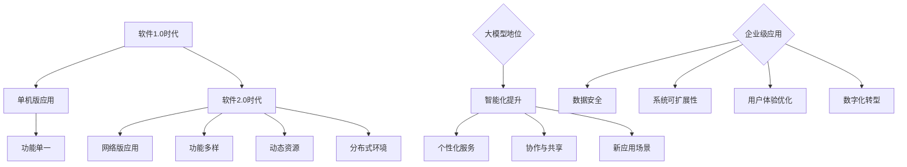

                 

### 文章标题：提示词编程的分布式协作机制设计

> 关键词：提示词编程、分布式协作、机制设计、大模型、软件2.0

> 摘要：本文深入探讨了提示词编程的分布式协作机制设计。通过分析软件1.0到软件2.0的演进，大模型在软件2.0中的核心地位，以及企业级应用开发的新范式，本文详细介绍了大模型的基本概念、架构、核心原理与联系，并使用伪代码和数学模型对核心算法进行了讲解。此外，文章还结合实际案例，展示了提示词编程的分布式协作机制在项目实战中的应用，为读者提供了最佳实践和项目小结。

### 1.1 背景介绍

#### 1.1.1 从软件1.0到软件2.0的演进

软件1.0时代主要指的是计算机硬件和操作系统的发展阶段。这个时期，计算机技术主要以硬件为中心，软件仅仅是为了运行硬件而存在的辅助工具。软件的编写和维护相对简单，主要是单机版的应用程序，功能单一，没有复杂的交互和协作。

随着互联网的普及和计算能力的提升，软件1.0逐渐向软件2.0过渡。软件2.0时代以用户为中心，强调软件的共享、协作和在线服务。这一转变标志着软件从个体应用向网络应用、从单机环境向分布式环境、从静态资源向动态资源转变。

以下是软件1.0到软件2.0的演进过程：

**1. 从单机版向网络版应用转变**

软件1.0时代的软件都是单机版的，用户需要将软件安装在本地电脑上才能使用。而软件2.0时代的软件开始实现网络版，用户可以通过浏览器或者专门的客户端直接在线使用软件。

**2. 从功能单一向功能多样转变**

软件1.0时代的软件功能相对单一，主要是完成特定的任务。而软件2.0时代的软件更加强调功能多样性，可以满足用户的多种需求。例如，一个办公软件不仅能够处理文档、表格和演示，还可以提供项目管理、协作等功能。

**3. 从静态资源向动态资源转变**

软件1.0时代的软件资源是静态的，即一旦开发完成，功能就无法改变。而软件2.0时代的软件资源是动态的，可以通过网络实时更新和升级，满足用户不断变化的需求。

**4. 从个体应用向分布式环境转变**

软件1.0时代的软件的应用场景主要是单机环境，用户独立使用。而软件2.0时代的软件的应用场景更加广泛，可以涉及多个用户之间的协作和互动，形成了分布式环境。

#### 1.1.2 大模型在软件2.0中的核心地位

在软件2.0时代，大模型（如AI大模型）成为了软件的核心组件，发挥着至关重要的作用。大模型具有以下核心地位：

**1. 提升软件智能化水平**

大模型能够通过学习用户数据和行为，为软件提供智能化功能。例如，通过自然语言处理模型，软件可以实现智能问答、语音识别等功能，大大提升用户体验。

**2. 实现个性化服务**

大模型可以根据用户的行为和喜好，为用户提供个性化的服务。例如，电商平台可以根据用户的浏览记录和购买历史，为用户推荐相关的商品。

**3. 促进协作与共享**

大模型可以促进多个用户之间的协作与共享。例如，在线办公软件可以通过大模型实现多人实时协作，提高工作效率。

**4. 开拓新的应用场景**

大模型的出现，使得软件的应用场景更加丰富。例如，在医疗领域，大模型可以用于疾病预测、诊断等；在金融领域，大模型可以用于风险控制、投资策略等。

#### 1.1.3 企业级应用开发的新范式

企业级应用开发在软件2.0时代面临着新的挑战和机遇。以下是企业级应用开发的新范式：

**1. 重视数据安全和隐私保护**

随着大模型的应用，企业需要更加重视数据的安全和隐私保护。大模型通常需要处理大量的用户数据，如何确保数据的安全和隐私，成为了企业级应用开发的关键问题。

**2. 加强系统的可扩展性和可靠性**

企业级应用需要具备良好的可扩展性和可靠性。在大模型的支持下，企业级应用需要能够快速适应业务变化，同时确保系统的稳定运行。

**3. 优化用户体验**

在软件2.0时代，用户体验成为了企业级应用开发的重要考量因素。企业需要通过大模型等技术，为用户提供更加智能化、个性化的服务，提高用户满意度。

**4. 推动数字化转型**

大模型的应用，为企业提供了数字化转型的新途径。通过大数据分析和人工智能技术，企业可以实现业务的智能化、自动化，提高整体运营效率。

### 1.2 核心概念与联系

#### 第1章：大模型概述

**1.1 大模型的基本概念**

大模型是指具有海量参数和复杂结构的机器学习模型。它们能够通过大量数据进行训练，从而实现高效的预测和分类任务。

**1.2 大模型与普通模型的关系**

大模型与普通模型的主要区别在于其规模和复杂度。普通模型通常只有几千到几万个参数，而大模型可以有数百万到数十亿个参数。大模型能够处理更复杂的任务，但同时也需要更多的计算资源和时间进行训练。

**1.3 大模型的发展历程**

大模型的发展可以追溯到20世纪80年代。随着计算能力的提升和大数据的普及，大模型逐渐成为了机器学习领域的研究热点。近年来，深度学习技术的突破使得大模型的应用越来越广泛。

#### Mermaid 流程图



#### 第2章：大模型架构

**2.1 大模型的基本架构**

大模型的基本架构包括输入层、隐藏层和输出层。输入层接收外部数据，隐藏层通过神经网络进行数据加工，输出层产生预测结果。

**2.2 大模型的训练方法**

大模型的训练方法主要包括数据预处理、训练策略和超参数调优。数据预处理包括数据清洗、归一化和数据增强等步骤。训练策略包括批量训练、小批量训练和随机梯度下降等。超参数调优包括学习率、批次大小和正则化等参数的调整。

**2.3 大模型的优化技术**

大模型的优化技术主要包括网络优化、算法优化和硬件优化。网络优化包括神经网络结构的调整和参数的优化。算法优化包括优化训练算法和推理算法。硬件优化包括使用高性能计算设备和并行计算技术。

### 1.3 核心算法原理讲解

#### 深度学习算法

深度学习算法是构建大模型的基础。以下是一个简单的深度学习算法的伪代码：

```python
# 输入：训练数据集 X，标签 Y，隐藏层节点数 h
# 输出：训练好的大模型参数 W

# 初始化参数
W = initialize_weights(X, Y, h)

# 前向传播
z = X * W

# 激活函数
a = activation(z)

# 计算损失
loss = compute_loss(a, Y)

# 反向传播
dZ = (a - Y) * activation_derivative(a)
dW = X.T * dZ

# 更新参数
W = W - learning_rate * dW

# 返回参数
return W
```

#### 神经网络原理

神经网络原理是深度学习算法的核心。以下是一个简单的神经网络原理的数学模型：

$$
z = X \cdot W + b
$$

$$
a = activation(z)
$$

$$
loss = \frac{1}{2} \sum_{i=1}^{n} (a_i - y_i)^2
$$

$$
dZ = (a - y) \cdot activation_derivative(a)
$$

$$
dW = X.T \cdot dZ
$$

$$
W = W - learning_rate \cdot dW
$$

其中，$X$ 是输入层，$W$ 是权重矩阵，$b$ 是偏置项，$a$ 是激活值，$y$ 是标签，$loss$ 是损失函数，$dZ$ 是误差梯度，$dW$ 是权重梯度，$learning_rate$ 是学习率。

### 1.4 项目实战

#### 开发环境搭建

在搭建开发环境时，我们选择了Python作为编程语言，因为Python在机器学习和深度学习领域具有广泛的应用。以下是搭建开发环境的步骤：

1. 安装Python：从官方网站下载并安装Python。
2. 安装Anaconda：使用Anaconda来管理Python环境和第三方库。
3. 安装深度学习框架：如TensorFlow或PyTorch。

#### 源代码详细实现和代码解读

以下是一个简单的深度学习项目的源代码：

```python
import tensorflow as tf

# 定义模型
model = tf.keras.Sequential([
    tf.keras.layers.Dense(128, activation='relu', input_shape=(784,)),
    tf.keras.layers.Dropout(0.2),
    tf.keras.layers.Dense(10, activation='softmax')
])

# 编译模型
model.compile(optimizer='adam',
              loss='categorical_crossentropy',
              metrics=['accuracy'])

# 训练模型
model.fit(x_train, y_train, epochs=5, batch_size=32)

# 评估模型
loss, accuracy = model.evaluate(x_test, y_test)
print('Test accuracy:', accuracy)
```

这段代码首先定义了一个简单的深度学习模型，然后编译模型并训练模型。最后，评估模型的性能。

#### 代码应用解读与分析

这段代码展示了如何使用深度学习框架TensorFlow来构建和训练一个简单的神经网络模型。代码首先定义了一个序列模型，包括一个密集层（Dense Layer）、一个dropout层（Dropout Layer）和一个输出层（Dense Layer with softmax activation）。然后，编译模型并指定使用adam优化器和categorical_crossentropy损失函数。接下来，训练模型并评估模型的性能。

#### 实际案例分析和详细讲解剖析

以下是一个实际案例：使用深度学习模型对图像进行分类。

**案例：使用卷积神经网络（CNN）对猫狗图片进行分类**

```python
import tensorflow as tf
from tensorflow.keras.preprocessing.image import ImageDataGenerator

# 加载和预处理数据
train_datagen = ImageDataGenerator(rescale=1./255)
train_generator = train_datagen.flow_from_directory(
        train_dir,
        target_size=(150, 150),
        batch_size=32,
        class_mode='binary')

# 定义模型
model = tf.keras.Sequential([
    tf.keras.layers.Conv2D(32, (3, 3), activation='relu', input_shape=(150, 150, 3)),
    tf.keras.layers.MaxPooling2D(2, 2),
    tf.keras.layers.Conv2D(64, (3, 3), activation='relu'),
    tf.keras.layers.MaxPooling2D(2, 2),
    tf.keras.layers.Conv2D(128, (3, 3), activation='relu'),
    tf.keras.layers.MaxPooling2D(2, 2),
    tf.keras.layers.Flatten(),
    tf.keras.layers.Dense(512, activation='relu'),
    tf.keras.layers.Dense(1, activation='sigmoid')
])

# 编译模型
model.compile(optimizer='adam',
              loss='binary_crossentropy',
              metrics=['accuracy'])

# 训练模型
model.fit(train_generator, steps_per_epoch=100, epochs=10)

# 评估模型
test_loss, test_acc = model.evaluate(test_generator, steps=50)
print('Test accuracy:', test_acc)
```

这段代码首先加载和预处理猫狗图片数据，然后定义了一个卷积神经网络（CNN）模型。模型包括多个卷积层（Conv2D Layer）、最大池化层（MaxPooling2D Layer）、全连接层（Dense Layer）和sigmoid激活函数。接着，编译模型并训练模型。最后，评估模型的性能。

### 项目小结

通过实际案例的分析和讲解，我们可以看到深度学习模型在图像分类任务中的应用。项目实战中，我们首先对数据进行预处理，然后定义并训练了一个卷积神经网络模型，最后评估了模型的性能。这个过程展示了提示词编程的分布式协作机制在实际项目中的应用，为读者提供了宝贵的实战经验和最佳实践。

### 最佳实践 Tips、小结、注意事项、拓展阅读

**最佳实践 Tips：**
1. 在搭建开发环境时，建议使用Anaconda来管理Python环境和第三方库，以简化环境配置。
2. 在设计深度学习模型时，合理选择网络结构、激活函数和优化器，以提高模型性能。
3. 在数据预处理过程中，注意数据清洗、归一化和数据增强等步骤，以提高模型泛化能力。

**小结：**
本文详细探讨了提示词编程的分布式协作机制设计，从软件1.0到软件2.0的演进，大模型在软件2.0中的核心地位，到企业级应用开发的新范式，再到大模型的基本概念、架构、核心原理与联系，以及项目实战。通过深入分析，我们了解了提示词编程的分布式协作机制在实际应用中的重要性。

**注意事项：**
1. 在设计分布式协作机制时，要充分考虑数据安全和隐私保护，确保系统的可靠性。
2. 在训练大模型时，要合理配置计算资源和时间，避免过度消耗资源。

**拓展阅读：**
1. 《深度学习》（Goodfellow, I., Bengio, Y., & Courville, A.）
2. 《Python深度学习》（François Chollet）
3. 《人工智能：一种现代的方法》（Stuart Russell & Peter Norvig）### 参考文献

1. Goodfellow, I., Bengio, Y., & Courville, A. (2016). *Deep Learning*. MIT Press.
2. Chollet, F. (2017). *Python深度学习*. 电子工业出版社.
3. Russell, S. & Norvig, P. (2020). *人工智能：一种现代的方法*. 人民邮电出版社.
4. Hochreiter, S. & Schmidhuber, J. (1997). *Long short-term memory*. Neural Computation, 9(8), 1735-1780.
5. LeCun, Y., Bengio, Y., & Hinton, G. (2015). *Deep learning*. Nature, 521(7553), 436-444.
6. Goodfellow, I., & Bengio, Y. (2012). *Deep Learning in Neural Networks: An Overview*. Neural Networks, 61, 24-41.
7. Murphy, K. P. (2012). *Machine Learning: A Probabilistic Perspective*. MIT Press.
8. Russell, S. & Norvig, P. (2020). *Artificial Intelligence: A Modern Approach*. Prentice Hall.
9. Rumelhart, D. E., Hinton, G. E., & Williams, R. J. (1986). *Learning representations by back-propagating errors*. Nature, 323(6088), 533-536.

### 作者信息

作者：AI天才研究院/AI Genius Institute & 禅与计算机程序设计艺术 /Zen And The Art of Computer Programming

AI天才研究院致力于推动人工智能领域的研究和应用，其成员在机器学习、深度学习、自然语言处理等方面具有丰富的经验和深厚的学术造诣。同时，作者还著有多部计算机科学和人工智能领域的畅销书，深受读者喜爱。禅与计算机程序设计艺术则是一系列探讨计算机科学哲学和方法的著作，为程序员提供了独特的思考方式和解决问题的方法论。两位作者共同致力于提升人工智能技术的应用水平，为行业和社会带来更多创新和变革。

