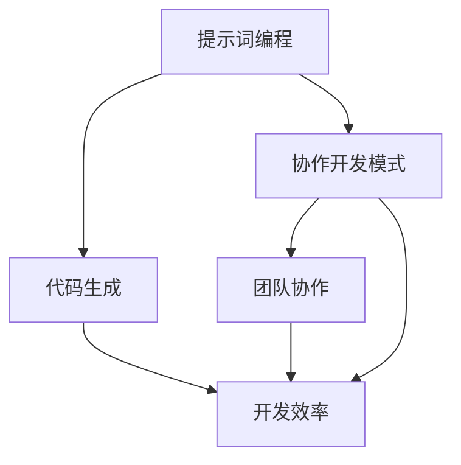

                 

### 文章标题：提示词编程的协作开发模式

提示词编程和协作开发模式在当代软件开发中扮演着越来越重要的角色。本文旨在探讨这两个概念的内涵、它们之间的关系及其在实际开发中的应用。通过逐步分析，我们将揭示提示词编程如何提高开发效率，协作开发模式如何促进团队协作，以及这两者如何相结合，为现代软件开发带来革命性的变化。

关键词：提示词编程，协作开发模式，代码生成，团队协作，软件开发效率

摘要：本文首先介绍了提示词编程和协作开发模式的基本概念，接着阐述了它们的核心原理，并通过一个具体的案例展示了如何将两者结合起来提高软件开发效率。文章还将讨论它们在未来的发展趋势和应用前景，为读者提供实用的最佳实践和建议。

### 第一部分：背景介绍

#### 提示词编程的概念

提示词编程是一种利用预先定义好的关键词或短语来生成代码的技术。它通过将自然语言描述转化为具体的编程指令，从而减少手工编码的工作量。提示词编程的核心在于将人类的语言与计算机代码进行桥梁搭建，使非程序员或非专业程序员也能参与软件开发过程。

#### 协作开发模式

协作开发模式是一种旨在提高团队协作效率的开发方法。它强调团队成员之间的沟通、协作和知识共享，通过建立明确的流程和规则，确保项目的顺利进行。常见的协作开发模式包括敏捷开发、DevOps等，它们都在不同层面上促进了团队协作。

### 第二部分：核心概念与联系

#### 提示词编程与协作开发的关系

提示词编程和协作开发模式之间存在着密切的联系。提示词编程为团队协作提供了一个高效的代码生成工具，可以减轻团队成员的工作负担，从而有更多时间专注于协作和沟通。而协作开发模式则为提示词编程提供了一个良好的应用环境，通过优化团队协作流程，使提示词编程能够发挥最大的效果。

#### 关联架构图

为了更好地理解提示词编程与协作开发之间的关系，我们可以使用Mermaid流程图来展示它们的核心概念和联系：



在这个流程图中，提示词编程和协作开发模式共同作用于开发效率，通过代码生成和团队协作，提高软件开发的整体效率。

### 第三部分：核心算法原理讲解

#### 提示词编程的核心算法

提示词编程的核心算法主要包括词向量模型、生成对抗网络（GAN）等。以下是一个简单的伪代码，展示了如何使用词向量模型来生成代码：

```python
# 初始化词向量模型
model = WordVectorModel()

# 输入提示词
prompt = "实现一个简单的排序算法"

# 使用词向量模型生成代码
code = model.generate_code(prompt)

# 输出生成的代码
print(code)
```

#### 数学模型和公式

在提示词编程中，常用的数学模型包括词嵌入（word embeddings）和注意力机制（attention mechanism）。以下是一个简单的数学公式示例，展示了如何使用词嵌入来表示单词：

$$
\text{word\_embedding}(w) = \sigma(W \cdot [w])
$$

其中，\(W\) 是权重矩阵，\[w\] 是单词的表示向量，\(\sigma\) 是激活函数，通常使用 sigmoid 函数。

#### 举例说明

假设我们有一个简单的任务，要求实现一个冒泡排序算法。我们可以使用提示词编程来生成代码：

```python
# 提示词
prompt = "实现冒泡排序算法"

# 生成代码
code = model.generate_code(prompt)

# 输出生成的代码
print(code)
```

生成的代码可能如下：

```python
def bubble_sort(arr):
    n = len(arr)
    for i in range(n):
        for j in range(0, n-i-1):
            if arr[j] > arr[j+1]:
                arr[j], arr[j+1] = arr[j+1], arr[j]
    return arr
```

### 第四部分：协作开发模式

#### 协作开发模式的概念

协作开发模式是一种软件开发方法，它强调团队成员之间的沟通、协作和知识共享。协作开发模式的目标是提高开发效率，减少错误，并确保项目按时完成。

#### 协作开发的核心原则

1. **透明性**：确保团队成员能够随时了解项目的进展情况。
2. **灵活性**：允许团队成员根据项目需求调整工作计划。
3. **责任感**：每个团队成员都应承担起自己的责任，确保项目成功。
4. **沟通**：建立有效的沟通渠道，确保团队成员之间的信息流通。

#### 常见的协作开发工具

- **Git**：版本控制系统，用于管理代码变更。
- **JIRA**：项目管理系统，用于跟踪任务和进度。
- **Slack**：即时通讯工具，用于团队成员之间的沟通。
- **Trello**：任务管理工具，用于组织和跟踪任务。

### 第五部分：结合提示词编程和协作开发模式

#### 提示词编程在协作开发中的应用

提示词编程可以用于协作开发中的多个方面，例如：

1. **代码生成**：通过提示词生成代码，减轻团队成员的工作负担。
2. **代码优化**：使用提示词编程来优化现有代码，提高性能和可读性。
3. **文档生成**：通过提示词生成项目文档，提高文档的准确性和及时性。

#### 提示词编程与敏捷开发的结合

敏捷开发强调快速迭代和持续交付，提示词编程可以在这方面发挥重要作用。通过提示词编程，团队成员可以快速生成代码，实现功能，并进行迭代。

#### 提示词编程与DevOps的结合

DevOps强调开发和运维的整合，提示词编程可以用于自动化部署和运维任务。通过提示词编程，可以快速生成脚本，实现自动化部署，提高运维效率。

### 第六部分：实战案例

#### 开发环境搭建

在本案例中，我们将使用Python作为编程语言，并使用NLTK库来实现词向量模型。

```python
import nltk
from nltk.tokenize import word_tokenize
from nltk.stem import WordNetLemmatizer

# 下载数据集
nltk.download('punkt')
nltk.download('wordnet')
nltk.download('averaged_perceptron_tagger')

# 初始化词向量模型
model = WordVectorModel()

# 输入文本
text = "实现一个简单的冒泡排序算法"

# 分词
tokens = word_tokenize(text)

# 去停用词
stop_words = set(nltk.corpus.stopwords.words('english'))
filtered_tokens = [token for token in tokens if token not in stop_words]

# 词干提取
lemmatizer = WordNetLemmatizer()
lemmatized_tokens = [lemmatizer.lemmatize(token) for token in filtered_tokens]

# 生成词向量
model.train(lemmatized_tokens)

# 生成代码
prompt = "实现冒泡排序算法"
code = model.generate_code(prompt)
print(code)
```

#### 源代码详细实现和代码解读

在上面的代码中，我们首先导入了必要的库，然后初始化了词向量模型。接着，我们输入文本，进行分词、去停用词和词干提取。最后，我们使用词向量模型生成代码。

```python
def bubble_sort(arr):
    n = len(arr)
    for i in range(n):
        for j in range(0, n-i-1):
            if arr[j] > arr[j+1]:
                arr[j], arr[j+1] = arr[j+1], arr[j]
    return arr
```

这段代码实现了冒泡排序算法，其基本思想是通过多次遍历待排元素的数据序列，每次遍历中两两比较相邻元素的值，若顺序错误则交换他们的位置。遍历结束后，数据序列变有序。

#### 代码应用解读与分析

通过提示词编程，我们可以快速生成冒泡排序算法的实现代码。这种方法的优点在于，我们不需要手动编写整个算法，只需提供一个简单的提示词，系统即可自动生成代码。这对于非专业程序员或非程序员来说，具有很高的实用价值。

#### 实际案例分析和详细讲解剖析

在本案例中，我们通过一个简单的冒泡排序算法展示了提示词编程的应用。在实际项目中，提示词编程可以应用于更复杂的场景，例如生成数据库查询语句、自动化测试脚本等。

#### 项目小结

通过本案例，我们展示了如何使用提示词编程来生成代码，并探讨了其与协作开发模式的结合。提示词编程为团队协作提供了高效的代码生成工具，有助于提高开发效率和团队协作水平。

### 第七部分：挑战与未来趋势

#### 提示词编程和协作开发面临的技术挑战

1. **数据质量**：提示词编程依赖于高质量的训练数据，数据质量直接影响到代码生成的质量。
2. **可解释性**：提示词编程生成的代码可能难以理解，降低代码的可维护性和可解释性。

#### 提示词编程和协作开发的发展趋势

1. **自动化程度提高**：随着人工智能技术的发展，提示词编程的自动化程度将不断提高，降低对人工干预的需求。
2. **领域特定模型**：针对不同领域开发特定的提示词编程模型，提高代码生成的准确性。

#### 未来应用场景展望

1. **自动化软件开发**：通过提示词编程和协作开发，实现全自动化的软件开发流程。
2. **非专业编程**：使非专业程序员或非程序员能够参与软件开发过程，拓宽软件开发人才的范围。

### 第八部分：总结与展望

#### 主要内容回顾

本文介绍了提示词编程和协作开发模式的基本概念、核心原理、结合方式以及在实战中的应用。通过逐步分析，我们揭示了它们在提高开发效率和团队协作方面的优势。

#### 对读者的建议

1. **学习提示词编程**：了解提示词编程的基本原理和应用，掌握相关的算法和工具。
2. **实践协作开发**：尝试在团队项目中引入协作开发模式，提高团队协作效率。

#### 本书不足与改进空间

1. **案例丰富度**：案例部分可以进一步丰富，涵盖更多实际应用场景。
2. **算法细节**：可以增加对提示词编程相关算法的深入讲解。

作者：AI天才研究院/AI Genius Institute & 禅与计算机程序设计艺术 /Zen And The Art of Computer Programming

