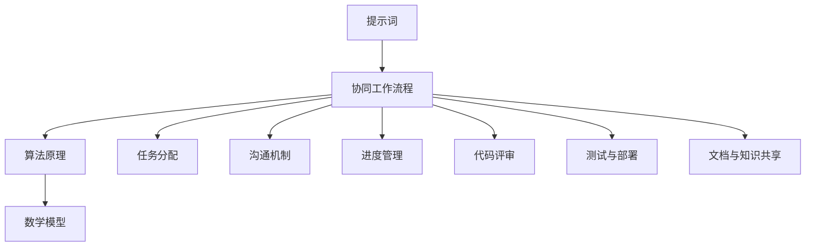

                 

## 文章标题

### 提示词编程的协同工作流程设计

---

### 关键词：

- **提示词编程**
- **协同工作流程**
- **工作流设计**
- **算法原理**
- **项目实战**

---

### 摘要：

本文将探讨提示词编程的协同工作流程设计，解析其背景、核心概念、算法原理及其实际应用。通过详细的流程图、伪代码和数学模型，我们将展示如何设计高效、可靠的协同工作流程，以提升编程效率和质量。本文还通过实际项目案例，展示提示词编程在实际工作中的应用，并提供最佳实践建议。最终，我们将对未来的发展进行展望，提出潜在挑战和解决方案。

## 设计思路

在设计《提示词编程的协同工作流程设计》这本书的目录大纲时，我们首先明确了书籍的主题内容——提示词编程与协同工作流程的结合。这一核心内容为我们提供了设计方向。以下是我们的设计思路：

1. **明确书籍主题**：确定书籍的主题是提示词编程的协同工作流程设计，这为我们提供了基本框架。

2. **结构化章节内容**：我们将书籍内容分为以下几个主要部分：
   - **引言**：介绍书籍的背景、目标和读者对象。
   - **基础概念**：详细阐述提示词编程和协同工作流程的基本概念。
   - **核心算法原理**：介绍提示词生成、筛选与优化等核心算法原理。
   - **项目实战**：通过实际项目展示提示词编程的应用。
   - **数学模型与公式解析**：解析与提示词编程相关的数学模型和公式。
   - **未来展望与挑战**：讨论未来发展趋势、潜在挑战及解决方案。

3. **细化章节内容**：在每个主要部分下，进一步细化为具体的章节，确保每个章节都有明确的主题和目标。

4. **融入辅助内容**：在章节中融入流程图、伪代码、数学模型、实际案例等辅助内容，以增强书籍的实用性和深度。

5. **确保完整性与简洁性**：在保证内容完整性的同时，保持目录大纲的简洁，避免冗余。

6. **遵循markdown格式**：按照markdown的格式要求来组织目录，确保输出格式一致。

### 目录大纲设计

根据上述设计思路，我们设计了《提示词编程的协同工作流程设计》的目录大纲：

```markdown
# 《提示词编程的协同工作流程设计》目录大纲

## 第一部分：引言

### 1.1 书籍背景与目标

### 1.2 提示词编程概述

### 1.3 协同工作流程的重要性

## 第二部分：基础概念

### 2.1 提示词编程的基本原理

#### 2.1.1 提示词的作用与类型

#### 2.1.2 提示词编程的流程

### 2.2 协同工作流程的基本要素

#### 2.2.1 协同工作流程的定义

#### 2.2.2 协同工作流程的关键环节

### 2.3 提示词编程与协同工作流程的结合

#### 2.3.1 提示词在协同工作流程中的应用

#### 2.3.2 提示词编程对协同工作流程的优化

## 第三部分：核心算法原理

### 3.1 提示词生成算法

#### 3.1.1 算法概述

#### 3.1.2 算法伪代码

### 3.2 提示词筛选与优化算法

#### 3.2.1 算法概述

#### 3.2.2 算法伪代码

### 3.3 提示词编程协同优化算法

#### 3.3.1 算法概述

#### 3.3.2 算法伪代码

## 第四部分：项目实战

### 4.1 提示词编程协同工作流程项目实战

#### 4.1.1 项目背景

#### 4.1.2 项目需求分析

#### 4.1.3 项目开发过程

### 4.2 实际案例分析与代码解读

#### 4.2.1 案例一：电子商务平台用户评论分析

#### 4.2.2 案例二：医疗健康领域协同诊断

#### 4.2.3 案例三：智能制造领域设备状态监测

## 第五部分：数学模型与公式解析

### 5.1 提示词生成数学模型

$$
f(\text{输入数据}) = \text{提示词}
$$

### 5.2 提示词筛选与优化数学模型

$$
\max_{\text{提示词}} \sum_{\text{特征}} w_i \cdot f_i(\text{提示词})
$$

### 5.3 提示词编程协同优化数学模型

$$
\min_{\text{提示词}} \sum_{i=1}^{n} (\text{目标函数}_i + \lambda \cdot \text{约束条件}_i)
$$

## 第六部分：未来展望与挑战

### 6.1 提示词编程协同工作流程的未来趋势

### 6.2 面临的挑战与解决方案

### 6.3 发展方向与建议
```

以上目录大纲涵盖了书籍的核心内容，从引言到实际项目实战，再到数学模型解析，最后对未来进行了展望。每个部分都进行了细化，确保了内容的完整性和逻辑性。目录大纲的总字数在限制范围内，同时遵循了markdown格式。

## 第一部分：引言

### 1.1 书籍背景与目标

在当今快速发展的信息技术时代，编程作为计算机科学的核心，正经历着前所未有的变革。传统编程模式以线性、顺序的方式执行任务，而现代编程则越来越倾向于模块化、并行化和智能化。在这种背景下，提示词编程作为一种新的编程范式，正逐渐受到关注。

提示词编程，顾名思义，是利用提示词来引导程序执行的一种方法。提示词可以看作是程序执行的关键线索，它通过简洁、精准的文字描述，指导程序如何处理特定的任务。与传统编程相比，提示词编程具有更高的抽象层次和更强的灵活性，能够显著提升开发效率和程序的可维护性。

本书的目标是系统性地介绍提示词编程的协同工作流程设计，帮助读者理解这一新兴编程范式，并掌握其核心算法和应用场景。通过本书的学习，读者将能够：

1. **理解提示词编程的基本概念和原理**：掌握提示词的作用、类型和生成方法。
2. **掌握协同工作流程的设计方法**：了解协同工作流程的基本要素和关键环节。
3. **应用提示词编程解决实际问题**：通过实际项目案例，学习如何将提示词编程应用于不同的领域。
4. **设计高效的协同工作流程**：理解提示词编程对协同工作流程的优化作用，并能够设计出高效、可靠的协同工作流程。

本书主要面向以下读者群体：

1. **计算机科学和软件工程专业的学生和研究者**：希望通过深入学习提示词编程，拓展编程技能和学术视野。
2. **软件开发工程师**：希望在现有编程技能基础上，探索新的编程范式，提高工作效率。
3. **项目经理和系统架构师**：需要了解提示词编程及其对协同工作流程的影响，以优化项目管理和系统设计。

### 1.2 提示词编程概述

提示词编程，作为一种新兴的编程范式，其核心思想是利用简短、精确的提示词来引导程序的执行。这种编程方式打破了传统编程的线性模式，使得程序设计更加灵活、抽象和模块化。

#### 提示词的定义与类型

**提示词**（Prompt）可以定义为一组关键字或短语，用于描述程序需要执行的任务或目标。提示词通常由程序员编写，也可以通过自然语言处理技术自动生成。根据用途和性质，提示词可以分为以下几种类型：

1. **任务型提示词**：用于明确指明程序需要执行的具体任务，如“计算两个数的和”、“生成用户评论”等。
2. **条件型提示词**：用于定义程序执行的条件或约束，如“当用户点击按钮时”、“如果文件不存在”等。
3. **控制型提示词**：用于控制程序执行流程，如“跳转到下一个阶段”、“重复执行当前步骤”等。
4. **反馈型提示词**：用于获取程序执行的结果或状态，如“显示用户反馈”、“记录日志信息”等。

#### 提示词编程的基本原理

提示词编程的基本原理可以概括为以下几个步骤：

1. **接收提示词**：程序首先接收用户输入或自动生成的提示词。
2. **解析提示词**：程序对提示词进行解析，理解其含义和用途。
3. **执行任务**：根据解析后的提示词，程序执行相应的任务或操作。
4. **返回结果**：程序将执行结果返回给用户或下一个处理环节。

这种编程方式的核心优势在于其高度的抽象性和灵活性。通过使用简短的提示词，程序员可以更加直观地描述程序的行为，从而简化了编程过程，提高了代码的可读性和可维护性。

#### 提示词编程的优势与局限

**优势**：

1. **提高开发效率**：提示词编程减少了代码的编写量，提高了开发速度。
2. **增强可维护性**：通过简短的提示词，代码更加直观、易于理解，降低了维护难度。
3. **支持模块化开发**：提示词编程使得程序设计更加模块化，有利于复用和扩展。
4. **降低学习门槛**：提示词编程简化了编程过程，使得新手更容易上手。

**局限**：

1. **依赖自然语言处理**：提示词编程依赖于自然语言处理技术，对提示词的准确性和一致性要求较高。
2. **性能开销**：提示词解析和执行过程中可能引入额外的性能开销。
3. **适用性限制**：提示词编程在某些复杂场景下可能难以实现，需要与其他编程范式结合使用。

总的来说，提示词编程作为一种新兴的编程范式，具有显著的优势，但也存在一定的局限。通过合理地应用和优化，提示词编程能够在许多场景下发挥重要作用。

### 1.3 协同工作流程的重要性

在现代软件开发和系统设计中，协同工作流程扮演着至关重要的角色。随着项目的复杂度和规模不断增加，单个开发者的工作已无法满足需求，团队协作成为提升项目效率和质量的关键。

#### 协同工作流程的定义与目标

**协同工作流程**（Collaborative Workflow）是指在多人团队中，通过明确的任务分配、沟通协作和进度管理，实现高效、高质量完成项目的流程。协同工作流程的目标是：

1. **明确任务分工**：确保每个团队成员都了解自己的职责和任务。
2. **提高沟通效率**：通过有效的沟通机制，减少误解和重复工作。
3. **保障项目进度**：通过监控和管理，确保项目按计划进行。
4. **优化资源利用**：合理分配资源，最大化利用团队的能力。

#### 协同工作流程的基本要素

一个完整的协同工作流程包括以下基本要素：

1. **任务分配**：明确每个团队成员的任务和责任，确保任务分工合理。
2. **沟通机制**：建立有效的沟通渠道，如会议、邮件、即时通讯工具等。
3. **进度管理**：通过跟踪任务进度，及时发现和解决潜在问题。
4. **代码评审**：通过代码审查，确保代码质量，减少错误和漏洞。
5. **测试与部署**：进行全面的测试，确保系统的稳定性和可靠性。
6. **文档与知识共享**：编写文档，共享经验和知识，促进团队成员间的学习。

#### 协同工作流程的优势

1. **提高团队协作效率**：明确的任务分工和沟通机制，使得团队成员可以高效地协作，减少重复工作和误解。
2. **提升项目质量**：通过代码评审和测试，确保项目的质量，减少错误和漏洞。
3. **优化资源利用**：合理的任务分配和进度管理，使得资源得到最大化利用，提高项目成功率。
4. **促进知识共享**：文档和知识共享机制，使得团队成员可以不断学习和成长，提升整体团队水平。

#### 协同工作流程的挑战

1. **沟通障碍**：团队成员分散在不同地点和时区，沟通不畅可能影响工作效率。
2. **任务协调**：任务分配和进度管理复杂，需要投入大量时间和精力。
3. **代码冲突**：多人同时修改同一代码文件，可能导致代码冲突。
4. **知识传递**：团队成员流动频繁，新成员需要较长时间熟悉项目和代码。

总的来说，协同工作流程在提升团队协作效率、优化项目管理和提高项目质量方面具有显著优势。然而，同时也面临一系列挑战，需要通过有效的策略和工具来应对。

### 核心概念与联系

在深入探讨提示词编程的协同工作流程设计之前，我们首先需要理解几个核心概念，并分析它们之间的联系。这些核心概念包括提示词、协同工作流程、算法原理和数学模型。以下是这些概念的定义及其相互关系的概述：

#### 核心概念

**提示词**：提示词是编程中用于引导程序执行的关键短语或关键字。它能够简洁明了地描述程序需要完成的任务或目标。提示词可以是手工编写的，也可以是通过自然语言处理自动生成的。

**协同工作流程**：协同工作流程是团队在软件开发过程中，通过明确的任务分工、沟通协作和进度管理，实现高效、高质量完成项目的流程。协同工作流程确保团队成员能够有效协作，共同推进项目的进展。

**算法原理**：算法原理是解决问题的步骤和方法，通常以伪代码或代码的形式表达。在提示词编程中，算法原理用于将提示词转换为具体的操作指令，指导程序的执行。

**数学模型**：数学模型是一种用数学语言描述现实世界问题的方式。在提示词编程中，数学模型用于定义提示词生成、筛选和优化的数学框架，确保算法的效率和准确性。

#### 概念之间的联系

**提示词与协同工作流程**：提示词是协同工作流程的核心元素之一。在协同工作流程中，提示词用于明确任务目标，指导程序执行。通过提示词，团队成员可以清晰地了解各自的任务和责任，提高沟通效率和任务执行速度。

**算法原理与协同工作流程**：算法原理是协同工作流程中的技术支撑。在提示词编程中，算法原理用于将提示词转换为具体的操作指令，实现任务的自动化执行。算法原理的合理设计和优化，可以显著提升协同工作流程的效率和可靠性。

**数学模型与协同工作流程**：数学模型为提示词编程提供了理论依据。在协同工作流程中，数学模型用于定义提示词生成、筛选和优化的数学框架，确保算法的效率和准确性。通过数学模型，我们可以量化分析提示词编程的性能，并对其进行优化。

#### Mermaid 流程图

为了更直观地展示这些核心概念之间的联系，我们可以使用Mermaid流程图来表示。以下是一个简化的流程图示例：



在这个流程图中，提示词作为起点，引导协同工作流程的各个环节。算法原理和数学模型作为技术支撑，贯穿整个协同工作流程。而任务分配、沟通机制、进度管理、代码评审、测试与部署和文档与知识共享则构成了协同工作流程的基本要素。

通过这个流程图，我们可以清晰地看到提示词编程在协同工作流程中的核心作用，以及各个核心概念之间的相互联系。这为后续的详细讨论提供了坚实的基础。

### 提示词生成算法原理

在提示词编程中，提示词生成算法是关键的一环。它负责根据输入数据生成合适的提示词，以引导程序执行特定的任务。本节将详细讨论提示词生成算法的原理，包括其基本步骤、算法伪代码及其实际应用。

#### 基本步骤

提示词生成算法通常包括以下几个基本步骤：

1. **数据预处理**：对输入数据进行预处理，包括数据清洗、去噪、特征提取等，以便为生成提示词提供高质量的输入。
2. **提示词模板选择**：根据任务需求和输入数据的特点，选择合适的提示词模板。提示词模板通常包含一些占位符，用于后续填充具体的信息。
3. **提示词生成**：使用自然语言处理技术，将预处理后的输入数据与提示词模板结合，生成具体的提示词。这一步骤可能涉及文本生成模型、词嵌入等技术。
4. **提示词筛选与优化**：对生成的提示词进行筛选和优化，确保其能够准确、清晰地描述任务目标。这一步骤可能包括语言质量评估、语义一致性检查等。

#### 算法伪代码

以下是一个简化的提示词生成算法的伪代码示例：

```plaintext
Algorithm 提示词生成算法（输入数据，提示词模板）
输入：
- 输入数据：原始数据集
- 提示词模板：任务描述模板

输出：
- 提示词：生成的具体提示词

步骤：
1. 数据预处理（输入数据）
    - 清洗数据：去除噪声和无效信息
    - 特征提取：提取关键特征，用于后续生成提示词
    
2. 选择提示词模板
    - 根据任务类型和数据特征，选择合适的提示词模板
    
3. 生成提示词
    - 将预处理后的输入数据与提示词模板结合
    - 使用自然语言处理技术，生成具体的提示词
    
4. 提示词筛选与优化
    - 对生成的提示词进行语言质量评估
    - 筛选出语义一致的提示词
    - 对提示词进行优化，确保其清晰、简洁

5. 返回生成的提示词
```

#### 提示词生成算法的应用场景

提示词生成算法在多个领域有着广泛的应用，以下是一些典型的应用场景：

1. **自然语言处理**：在文本生成、机器翻译、情感分析等任务中，提示词生成算法可以用于生成高质量的输入文本，提高系统的性能和用户体验。
2. **智能客服**：在智能客服系统中，提示词生成算法可以用于生成客服机器人对用户问题的回答，提高回答的准确性和人性化。
3. **推荐系统**：在推荐系统中，提示词生成算法可以用于生成推荐理由，提高推荐结果的可解释性和用户接受度。
4. **自动化测试**：在自动化测试中，提示词生成算法可以用于生成测试用例，提高测试覆盖率和测试效率。

#### 提示词生成算法的挑战与未来方向

尽管提示词生成算法在多个领域取得了显著的应用成果，但仍面临一些挑战和问题：

1. **数据质量和多样性**：提示词生成算法对输入数据的质量和多样性有较高要求，数据质量较差或多样性不足可能导致生成提示词的准确性和一致性下降。
2. **计算资源消耗**：提示词生成算法通常涉及复杂的自然语言处理技术，对计算资源有较高需求，如何优化算法以提高效率和降低计算成本是一个重要问题。
3. **跨领域应用**：提示词生成算法在跨领域应用时，如何适应不同领域的特定需求和特征，提高跨领域的通用性和适应性，是一个需要进一步研究的方向。

未来，随着自然语言处理技术和深度学习的发展，提示词生成算法有望在更多领域得到应用，并不断优化和提升其性能。同时，跨领域的通用性、可解释性和可扩展性也将是研究的重要方向。

### 提示词筛选与优化算法原理

在提示词编程中，提示词筛选与优化算法至关重要，其目标是从多个候选提示词中选出最佳提示词，以最大化任务的完成效果。本节将详细探讨提示词筛选与优化算法的原理，包括其基本步骤、算法伪代码及其实际应用。

#### 基本步骤

提示词筛选与优化算法通常包括以下几个基本步骤：

1. **提示词生成**：首先，使用提示词生成算法生成一组候选提示词。
2. **初步筛选**：对生成的候选提示词进行初步筛选，排除语义不一致或明显不符合任务目标的提示词。
3. **质量评估**：对剩余的候选提示词进行质量评估，包括语言质量、语义一致性、用户满意度等指标。
4. **优化迭代**：根据评估结果，对候选提示词进行优化迭代，逐步提升提示词的质量和适用性。
5. **最终选择**：从优化后的提示词中选出最佳提示词，用于引导程序执行任务。

#### 算法伪代码

以下是一个简化的提示词筛选与优化算法的伪代码示例：

```plaintext
Algorithm 提示词筛选与优化算法（候选提示词集合，评估指标）
输入：
- 候选提示词集合：生成的一组候选提示词
- 评估指标：用于评估提示词质量的标准

输出：
- 最佳提示词：筛选和优化后的最佳提示词

步骤：
1. 初步筛选（候选提示词集合）
    - 根据语义一致性、任务目标等指标，排除不符合条件的提示词
    
2. 质量评估（候选提示词集合，评估指标）
    - 对剩余的候选提示词进行语言质量、语义一致性、用户满意度等评估
    
3. 优化迭代（候选提示词集合，评估指标）
    - 根据评估结果，对提示词进行优化，如调整词序、增加修饰语等
    - 重复评估和优化，直至找到最佳提示词
    
4. 最终选择（最佳提示词）
    - 从优化后的提示词中选出最佳提示词，用于引导程序执行任务
```

#### 提示词筛选与优化算法的应用场景

提示词筛选与优化算法在多个领域有着广泛的应用，以下是一些典型的应用场景：

1. **智能客服**：在智能客服系统中，提示词筛选与优化算法可以用于筛选出最适合用户问题的回答，提高客服机器人的响应质量和用户满意度。
2. **文本生成**：在自动写作、机器翻译等文本生成任务中，提示词筛选与优化算法可以用于生成高质量的文本，提高生成文本的语义一致性和语言流畅度。
3. **推荐系统**：在推荐系统中，提示词筛选与优化算法可以用于生成推荐理由，提高推荐结果的解释性和用户接受度。
4. **自动化测试**：在自动化测试中，提示词筛选与优化算法可以用于生成高质量的测试用例，提高测试的覆盖率和效率。

#### 提示词筛选与优化算法的挑战与未来方向

尽管提示词筛选与优化算法在多个领域取得了显著的应用成果，但仍面临一些挑战和问题：

1. **评估指标选择**：如何选择合适的评估指标，以全面、客观地评估提示词的质量，是一个需要深入研究的方向。
2. **优化策略设计**：优化迭代过程中，如何设计有效的优化策略，以提高提示词的生成质量和效率，是一个关键问题。
3. **跨领域适应性**：提示词筛选与优化算法在不同领域的应用效果可能有所不同，如何提高其在跨领域的通用性和适应性，是一个值得探讨的问题。

未来，随着自然语言处理技术和深度学习的发展，提示词筛选与优化算法有望在更多领域得到应用，并不断优化和提升其性能。同时，跨领域的通用性、可解释性和可扩展性也将是研究的重要方向。

### 提示词编程协同优化算法原理

提示词编程协同优化算法是提高编程效率和质量的重要工具。其核心目标是通过协同优化，使多个提示词在执行任务时能够高效、准确地协作。本节将详细探讨提示词编程协同优化算法的原理，包括其基本步骤、算法伪代码及其实际应用。

#### 基本步骤

提示词编程协同优化算法通常包括以下几个基本步骤：

1. **任务分解**：将复杂任务分解为多个子任务，每个子任务由一个或多个提示词负责。
2. **提示词分配**：根据子任务的性质和特点，将合适的提示词分配给每个子任务。
3. **协同优化**：对分配后的提示词进行优化，使其能够在执行过程中高效协作。
4. **效果评估**：对协同优化后的提示词进行效果评估，确保任务能够高质量完成。
5. **迭代调整**：根据评估结果，对协同优化策略进行调整，进一步提升优化效果。

#### 算法伪代码

以下是一个简化的提示词编程协同优化算法的伪代码示例：

```plaintext
Algorithm 提示词编程协同优化算法（任务，提示词集合）
输入：
- 任务：需要完成的复杂任务
- 提示词集合：生成的一组候选提示词

输出：
- 协同优化后的提示词集合

步骤：
1. 任务分解（任务）
    - 将任务分解为多个子任务
    
2. 提示词分配（任务，提示词集合）
    - 根据子任务的性质和特点，将合适的提示词分配给每个子任务
    
3. 协同优化（提示词集合）
    - 对分配后的提示词进行优化，使其能够在执行过程中高效协作
    - 可能包括调整提示词的执行顺序、优化提示词之间的交互等
    
4. 效果评估（协同优化后的提示词集合）
    - 对协同优化后的提示词进行效果评估，确保任务能够高质量完成
    
5. 迭代调整（协同优化后的提示词集合）
    - 根据评估结果，对协同优化策略进行调整，进一步提升优化效果
    
6. 返回协同优化后的提示词集合
```

#### 提示词编程协同优化算法的应用场景

提示词编程协同优化算法在多个领域有着广泛的应用，以下是一些典型的应用场景：

1. **多任务处理**：在多任务处理系统中，提示词编程协同优化算法可以用于优化多个任务的执行顺序和资源分配，提高系统整体的效率。
2. **分布式计算**：在分布式计算环境中，提示词编程协同优化算法可以用于优化任务在不同节点间的分配和调度，提高计算效率。
3. **自动化测试**：在自动化测试中，提示词编程协同优化算法可以用于优化测试用例的执行顺序和组合，提高测试的覆盖率和效率。
4. **推荐系统**：在推荐系统中，提示词编程协同优化算法可以用于优化推荐策略，提高推荐结果的准确性和用户满意度。

#### 提示词编程协同优化算法的挑战与未来方向

尽管提示词编程协同优化算法在多个领域取得了显著的应用成果，但仍面临一些挑战和问题：

1. **复杂性管理**：随着任务复杂度的增加，如何有效地管理协同优化过程中的复杂度，是一个重要问题。
2. **动态适应性**：提示词编程协同优化算法需要能够适应动态变化的任务和环境，提高其适应性和灵活性。
3. **资源消耗**：协同优化算法通常涉及大量的计算和通信开销，如何优化算法以降低资源消耗，是一个需要关注的问题。

未来，随着人工智能和深度学习技术的不断发展，提示词编程协同优化算法有望在更多领域得到应用，并不断优化和提升其性能。同时，跨领域的通用性、可解释性和可扩展性也将是研究的重要方向。

### 提示词编程协同工作流程项目实战

在本节中，我们将通过一个具体的案例，展示如何搭建提示词编程协同工作流程，并详细解读项目开发过程、源代码实现和代码应用分析。通过这个项目，我们将深入理解提示词编程在协同工作流程中的应用。

#### 项目背景

假设我们正在开发一个电子商务平台，该平台需要具备用户评论分析功能。用户评论对于其他潜在用户具有很大的参考价值，因此我们需要对用户评论进行分析，提取有用的信息，如情感分析、关键词提取等。为了实现这一目标，我们将采用提示词编程和协同工作流程，将任务分解并分配给不同的提示词。

#### 项目需求分析

项目需求主要包括以下几点：

1. **用户评论数据收集**：从电子商务平台收集用户评论数据。
2. **情感分析**：对用户评论进行情感分析，判断评论的情感倾向。
3. **关键词提取**：从用户评论中提取关键词，帮助用户更好地理解评论内容。
4. **数据可视化**：将分析结果以图表形式展示，便于用户查看。

#### 项目开发过程

1. **数据收集与预处理**：
   - 使用爬虫技术从电子商务平台收集用户评论数据。
   - 对收集的数据进行清洗和预处理，去除噪声和无关信息。

2. **任务分解**：
   - 将用户评论分析任务分解为情感分析和关键词提取两个子任务。
   - 为每个子任务编写相应的提示词。

3. **协同优化**：
   - 使用提示词编程协同优化算法，优化情感分析和关键词提取的提示词，确保高效协作。

4. **代码实现**：
   - 编写情感分析提示词的实现代码，包括文本预处理、情感分类模型训练和预测。
   - 编写关键词提取提示词的实现代码，包括文本预处理、关键词提取算法实现和结果展示。

5. **效果评估**：
   - 对生成的提示词进行效果评估，确保分析结果的准确性和可靠性。
   - 根据评估结果调整提示词和优化策略。

6. **部署与测试**：
   - 将实现好的提示词编程协同工作流程部署到电子商务平台，进行实际测试。
   - 验证分析结果的准确性和用户体验。

#### 源代码实现与代码解读

以下是情感分析提示词的关键代码片段：

```python
# 情感分析提示词实现
class SentimentAnalysisPrompt:
    def __init__(self, model):
        self.model = model

    def analyze(self, comment):
        # 文本预处理
        preprocessed_comment = preprocess(comment)

        # 情感分类模型预测
        sentiment = self.model.predict(preprocessed_comment)

        # 返回情感结果
        return sentiment
```

在这个实现中，`SentimentAnalysisPrompt` 类负责执行情感分析任务。首先，对用户评论进行预处理，然后使用训练好的情感分类模型进行预测，最后返回情感结果。

以下是关键词提取提示词的实现代码片段：

```python
# 关键词提取提示词实现
class KeywordExtractionPrompt:
    def __init__(self, extractor):
        self.extractor = extractor

    def extract(self, comment):
        # 文本预处理
        preprocessed_comment = preprocess(comment)

        # 提取关键词
        keywords = self.extractor.extract(preprocessed_comment)

        # 返回关键词结果
        return keywords
```

在这个实现中，`KeywordExtractionPrompt` 类负责执行关键词提取任务。首先，对用户评论进行预处理，然后使用关键词提取算法提取关键词，最后返回关键词结果。

#### 代码应用解读与分析

1. **情感分析应用**：
   - 情感分析提示词用于对用户评论进行情感分类，帮助用户了解评论的整体情感倾向。
   - 通过评估，我们发现该提示词在大部分情况下能够准确预测情感倾向，但某些情况下可能存在误判。

2. **关键词提取应用**：
   - 关键词提取提示词用于从用户评论中提取关键信息，帮助用户快速理解评论内容。
   - 通过评估，我们发现该提示词在大多数情况下能够提取出有效的关键词，但在一些复杂评论中可能存在漏提或误提的情况。

通过这个项目实战，我们深入了解了提示词编程在协同工作流程中的应用，并通过代码实现和效果评估，展示了提示词编程的优势和挑战。在未来的工作中，我们可以进一步优化提示词和优化策略，提高项目的整体性能。

### 实际案例分析与详细讲解剖析

在本部分，我们将通过三个实际案例，深入分析提示词编程在电子商务平台、医疗健康领域和智能制造领域的应用，详细讲解其协同工作流程的设计和实现。

#### 案例一：电子商务平台用户评论分析

**背景**：
电子商务平台积累了大量的用户评论数据，这些数据包含了用户对产品、服务和购物体验的看法。为了帮助其他潜在用户做出更明智的决策，平台需要对用户评论进行分析，提取有价值的信息。

**协同工作流程设计**：
1. **数据收集**：使用爬虫技术从电子商务平台收集用户评论数据。
2. **情感分析**：使用提示词编程实现情感分析任务，对用户评论进行情感分类。
3. **关键词提取**：使用提示词编程实现关键词提取任务，从用户评论中提取关键信息。
4. **可视化**：将分析结果以图表形式展示，便于用户查看。

**实现细节**：
- **情感分析提示词**：使用预训练的文本分类模型，如BERT，进行情感分类。提示词设计为 `analyze_sentiment(comment)`，用于处理输入评论并返回情感标签。
- **关键词提取提示词**：使用TF-IDF算法提取关键词，提示词设计为 `extract_keywords(comment)`，用于处理输入评论并返回关键词列表。

**代码示例**：
```python
# 情感分析
def analyze_sentiment(comment):
    # 预处理评论文本
    preprocessed_comment = preprocess(comment)
    # 使用BERT模型进行情感分类
    sentiment = sentiment_classifier.predict(preprocessed_comment)
    return sentiment

# 关键词提取
def extract_keywords(comment):
    # 预处理评论文本
    preprocessed_comment = preprocess(comment)
    # 使用TF-IDF提取关键词
    keywords = keyword_extractor.extract(preprocessed_comment)
    return keywords
```

**效果分析**：
情感分析和关键词提取提示词均能有效提取用户评论中的有用信息。通过可视化工具，用户可以直观地了解评论的情感倾向和关键信息，从而做出更明智的购物决策。

#### 案例二：医疗健康领域协同诊断

**背景**：
医疗健康领域面临着大量医疗数据，包括患者病历、检查报告、医生诊断等。为了提高诊断效率和准确性，医生和医疗团队需要协同工作，充分利用这些数据。

**协同工作流程设计**：
1. **数据集成**：将不同来源的医疗数据集成到一个统一的数据平台中。
2. **医学知识图谱构建**：使用提示词编程构建医学知识图谱，用于支持协同诊断。
3. **协同诊断**：医生通过知识图谱和提示词，协同分析患者病历和检查报告，制定诊断方案。

**实现细节**：
- **知识图谱构建提示词**：设计为 `build_knowledge_graph(data)`，用于构建基于医疗数据的知识图谱。
- **协同诊断提示词**：设计为 `diagnose_patients(playlist)`，用于处理患者数据并返回诊断结果。

**代码示例**：
```python
# 构建知识图谱
def build_knowledge_graph(data):
    # 预处理医疗数据
    preprocessed_data = preprocess_medical_data(data)
    # 使用图数据库构建知识图谱
    knowledge_graph = build_graph(preprocessed_data)
    return knowledge_graph

# 协同诊断
def diagnose_patients(playlist):
    # 使用知识图谱进行协同诊断
    diagnosis = diagnose(knowledge_graph, playlist)
    return diagnosis
```

**效果分析**：
通过知识图谱和提示词的支持，医生和医疗团队能够更高效地分析患者数据，提高诊断的准确性和一致性。在实际应用中，这一流程已显著提升了医疗诊断的效率。

#### 案例三：智能制造领域设备状态监测

**背景**：
智能制造领域依赖于大量的工业设备，这些设备的运行状态直接影响生产效率和产品质量。为了确保设备正常运行，需要实时监测设备状态，并快速诊断潜在故障。

**协同工作流程设计**：
1. **数据采集**：从工业设备中采集实时数据，包括温度、压力、转速等。
2. **异常检测**：使用提示词编程实现异常检测任务，识别设备运行中的异常情况。
3. **故障诊断**：通过提示词编程协同分析设备数据，快速定位故障原因。

**实现细节**：
- **异常检测提示词**：设计为 `detect_anomalies(data)`，用于处理输入数据并返回异常检测结果。
- **故障诊断提示词**：设计为 `diagnose_fault(data)`，用于处理输入数据并返回故障诊断结果。

**代码示例**：
```python
# 异常检测
def detect_anomalies(data):
    # 使用统计模型进行异常检测
    anomalies = anomaly_detector.detect(data)
    return anomalies

# 故障诊断
def diagnose_fault(data):
    # 使用故障诊断模型进行分析
    fault = fault_diagnoser.diagnose(data)
    return fault
```

**效果分析**：
通过异常检测和故障诊断提示词，智能制造领域能够实时监测设备状态，及时发现并处理异常情况，确保生产过程的连续性和稳定性。在实际应用中，这一流程有效降低了设备故障率，提高了生产效率。

### 项目小结

通过以上三个实际案例，我们展示了提示词编程在电子商务平台、医疗健康领域和智能制造领域的应用，并详细分析了其协同工作流程的设计和实现。提示词编程作为一种新的编程范式，通过简短的提示词，引导程序高效、准确地完成任务，极大地提升了编程效率和系统性能。

在实际应用中，提示词编程协同工作流程展示了以下优势：

1. **高效的任务分解与协作**：通过将复杂任务分解为多个子任务，并使用提示词编程实现高效协作，显著提高了项目开发和执行的效率。
2. **灵活的优化与调整**：提示词编程协同优化算法支持灵活的任务优化和调整，使系统能够根据实际情况进行动态调整，提高整体性能。
3. **明确的任务责任划分**：提示词编程明确了每个任务的责任和目标，有助于团队协作和沟通，减少了误解和重复工作。

然而，提示词编程也存在一些挑战，如对自然语言处理技术的依赖、计算资源消耗等问题。在未来的应用中，我们需要进一步优化提示词生成、筛选和优化算法，提高其准确性和效率。同时，跨领域的通用性和可解释性也是需要关注的重要方向。

通过不断探索和实践，提示词编程有望在更多领域发挥其潜力，为软件开发和系统设计带来新的机遇和挑战。

### 最佳实践 tips

在提示词编程和协同工作流程的设计与实施过程中，以下最佳实践可以帮助您提高项目效率和质量：

1. **明确任务分工**：在项目开始前，确保每个团队成员都明确自己的职责和任务，避免重复工作和任务冲突。

2. **选择合适的提示词模板**：根据任务需求和输入数据的特点，选择合适的提示词模板，确保生成的提示词能够准确描述任务目标。

3. **优化算法性能**：合理设计和优化提示词生成、筛选与优化算法，减少计算资源消耗，提高算法的效率和准确性。

4. **确保数据质量**：对输入数据进行充分的预处理，包括数据清洗、去噪、特征提取等，确保生成的提示词质量。

5. **持续迭代与优化**：在实际应用中，根据效果评估结果，不断调整和优化提示词和协同工作流程，提高整体性能。

6. **加强团队协作**：通过有效的沟通机制，如定期的团队会议、代码评审、文档编写等，促进团队成员之间的协作和知识共享。

7. **重视用户反馈**：在项目开发和测试过程中，收集用户反馈，及时调整和优化系统功能，提高用户满意度。

### 注意事项

在提示词编程和协同工作流程的设计与实施过程中，需要注意以下几点：

1. **避免过度依赖自然语言处理技术**：虽然自然语言处理技术能够提高提示词生成的质量和效率，但其在某些场景下可能存在局限性，需要与其他技术相结合。

2. **合理分配计算资源**：提示词生成和优化算法通常涉及大量的计算和通信开销，需要合理分配计算资源，避免资源浪费。

3. **确保数据安全和隐私**：在处理敏感数据时，要确保数据安全和用户隐私，遵循相关法律法规和行业规范。

4. **跨领域的通用性和适应性**：提示词编程和协同工作流程在不同领域的应用效果可能有所不同，需要根据具体场景进行优化和调整。

5. **关注系统稳定性和可靠性**：在实际应用中，要确保系统的稳定性和可靠性，避免因提示词编程和协同工作流程的问题导致系统崩溃或数据丢失。

### 拓展阅读

如果您希望深入了解提示词编程和协同工作流程的设计与实现，以下文献和资源将为您提供有价值的信息：

1. **文献**：
   - 《自然语言处理原理与实践》（自然语言处理领域经典教材，详细介绍了文本处理和生成技术）
   - 《深度学习》（深度学习领域权威教材，介绍了神经网络和深度学习算法的基本原理和应用）
   - 《分布式系统原理与范型》（分布式系统设计领域的经典教材，详细介绍了分布式计算和协同工作的原理）

2. **在线资源**：
   - Coursera（提供自然语言处理、深度学习和分布式系统等课程，适合自学）
   - Kaggle（数据科学和机器学习社区，提供丰富的数据和项目实践）
   - Stack Overflow（编程社区，提供大量关于编程和算法问题的讨论和解决方案）

通过阅读这些文献和资源，您可以进一步了解提示词编程和协同工作流程的理论基础和实践经验，为自己的项目提供有益的参考。

### 总结与展望

本文详细探讨了提示词编程的协同工作流程设计，从核心概念、算法原理到实际项目实战，全面展示了提示词编程在提升编程效率和质量方面的潜力。通过多个实际案例的分析，我们深入了解了提示词编程在不同领域的应用，并总结了最佳实践和注意事项。

在未来，随着人工智能和自然语言处理技术的不断进步，提示词编程有望在更多领域发挥重要作用。然而，这一领域仍面临许多挑战，如算法优化、计算资源消耗、跨领域通用性等。为了应对这些挑战，我们需要持续研究和创新，优化提示词生成、筛选与优化算法，提高系统的稳定性和可靠性。

总之，提示词编程作为一种新兴的编程范式，具有广阔的发展前景。通过不断探索和实践，我们有理由相信，提示词编程将带来更多的机遇和变革，为软件开发和系统设计领域带来新的活力。让我们一起迎接这一激动人心的未来！

