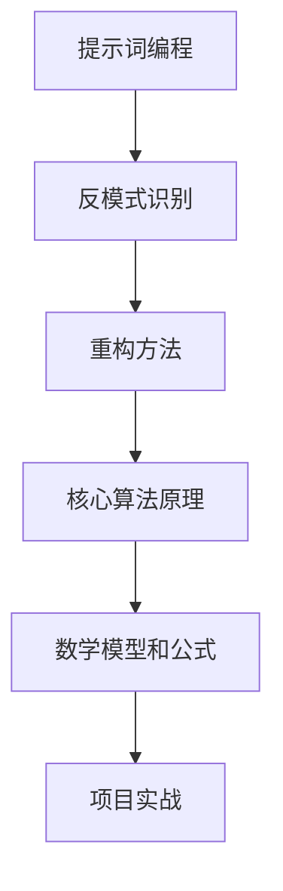

                 


# 文章标题

《提示词编程的反模式识别与重构》

# 文章关键词

提示词编程、反模式识别、重构、算法原理、数学模型、项目实战

# 文章摘要

本文将深入探讨提示词编程的反模式识别与重构，旨在揭示提示词编程领域中的常见问题，提供有效的解决方案。通过详细分析反模式的概念、识别方法和重构原则，本文将展示如何利用核心算法原理和数学模型优化提示词编程。此外，通过实际项目实战，本文将阐述如何在开发环境中实现提示词编程、反模式识别与重构，并提供代码解读与分析，帮助读者更好地理解和应用相关知识。

## 前言

### 书的基本信息

《提示词编程的反模式识别与重构》是一本旨在探讨提示词编程领域中的关键问题的技术书籍。它涵盖了从基础概念到高级实战的全面内容，旨在帮助读者深入了解提示词编程的反模式识别与重构方法。

### 目的

本书的主要目的是：
1. 揭示提示词编程领域中的常见问题。
2. 提供系统的方法来识别和解决这些反模式。
3. 介绍重构的基本原则和流程。
4. 通过实际项目实战，展示如何将理论应用到实践中。

## 第1章：提示词编程的基本概念

### 1.1 提示词编程的定义

提示词编程（Prompt Programming）是一种利用提示词（Prompts）引导模型生成文本或执行任务的方法。它主要应用于自然语言处理（NLP）、机器学习（ML）和人工智能（AI）领域。

### 1.2 提示词编程的特点

提示词编程具有以下特点：
1. **灵活性**：提示词编程可以根据不同的任务需求灵活调整。
2. **高效性**：通过提示词，模型可以快速生成所需的结果。
3. **可解释性**：提示词的存在使得模型的决策过程更具透明性。

### 1.3 提示词编程的应用领域

提示词编程广泛应用于以下领域：
1. **自然语言处理**：文本生成、情感分析、问答系统等。
2. **机器学习**：数据预处理、特征工程等。
3. **人工智能**：智能对话系统、自动化写作等。

### 1.4 提示词编程的发展历程

提示词编程的发展历程可以追溯到20世纪80年代的自然语言生成研究。随着人工智能技术的发展，特别是深度学习和生成对抗网络（GAN）的兴起，提示词编程逐渐成为一种重要的编程范式。

## 第2章：反模式识别

### 2.1 反模式的概念

反模式（Anti-pattern）是指在实际开发过程中常见的、可能导致问题的不良做法或模式。

### 2.2 反模式的分类

反模式可以根据其特点分为以下几类：
1. **设计反模式**：与软件架构和设计相关。
2. **编码反模式**：与代码编写和实现相关。
3. **运行时反模式**：与系统运行和维护相关。

### 2.3 反模式的识别方法

识别反模式的方法包括：
1. **经验判断**：基于开发经验，识别潜在的反模式。
2. **工具检测**：使用专门的工具检测代码或系统中的反模式。
3. **代码审查**：通过审查代码，识别可能的反模式。

### 2.4 反模式的实例分析

以下是一些常见的反模式实例及其影响：
1. **代码冗余**：导致维护困难，降低代码质量。
2. **过度抽象**：导致系统复杂度增加，降低可维护性。
3. **未充分利用资源**：可能导致系统性能下降。

## 第3章：重构方法

### 3.1 重构的定义

重构（Refactoring）是指在不改变程序外在行为的前提下，对代码进行内部结构调整和优化。

### 3.2 重构的原则

重构应遵循以下原则：
1. **增量式重构**：逐步重构，避免一次性大量修改。
2. **保持行为不变**：确保重构后程序的功能和性能不受影响。
3. **局部性原则**：尽量在一个局部范围内进行重构。

### 3.3 重构的工具

常用的重构工具有：
1. **IDE内置工具**：如Visual Studio Code、IntelliJ IDEA等。
2. **独立工具**：如PyCharm的Refactor工具、Gerrit的Code Review工具等。

### 3.4 重构的流程

重构的基本流程包括：
1. **评估代码质量**：识别需要重构的部分。
2. **制定重构计划**：确定重构的目标和步骤。
3. **实施重构**：执行具体的重构操作。
4. **测试验证**：确保重构后的代码质量。

## 第4章：核心概念与联系

### 4.1 使用Mermaid流程图展示核心概念和联系

以下是一个简化的Mermaid流程图，展示了提示词编程、反模式识别与重构的核心概念及其联系：



### 4.2 核心概念详细解析

#### 提示词编程

提示词编程是一种通过向模型提供提示词来生成文本或执行任务的方法。提示词的作用在于引导模型生成符合预期结果的输出。

#### 反模式识别

反模式识别是指识别软件开发过程中常见的不良做法或模式。这些反模式可能导致系统性能下降、代码可维护性降低等问题。

#### 重构方法

重构方法是指在不改变程序功能的前提下，对代码进行内部结构调整和优化的过程。重构可以改善代码质量、提高系统性能和可维护性。

#### 核心算法原理

核心算法原理是指用于实现提示词编程、反模式识别和重构的基本算法原理。这些算法原理包括自然语言处理、机器学习和软件工程等领域。

#### 数学模型和公式

数学模型和公式是用于描述和实现提示词编程、反模式识别和重构的基本数学工具。这些模型和公式包括概率论、线性代数和微积分等领域。

#### 项目实战

项目实战是将理论应用到实际开发中的过程。通过项目实战，可以验证提示词编程、反模式识别和重构方法的实际效果，并积累实际经验。

## 第5章：核心算法原理讲解

### 5.1 提示词编程的核心算法

提示词编程的核心算法主要包括以下几种：

#### 生成式算法

生成式算法通过生成可能的输出序列来生成文本。常见的生成式算法有：

1. **基于语言模型的生成**：如循环神经网络（RNN）、长短期记忆网络（LSTM）和生成对抗网络（GAN）。
2. **基于规则的方法**：如模板匹配和句法分析。

#### 判断式算法

判断式算法通过判断输入序列的合法性或分类来生成文本。常见的判断式算法有：

1. **决策树**：通过树的分支来判断输入序列的分类。
2. **支持向量机（SVM）**：通过找到一个超平面来区分不同的输入序列。

### 5.2 反模式识别算法的讲解

反模式识别算法主要包括以下几种：

#### 基于规则的识别

基于规则的识别方法通过定义一组规则来识别反模式。常见的规则方法有：

1. **模糊逻辑**：通过模糊集合来表示规则，提高识别的灵活性。
2. **专家系统**：基于领域专家的经验来定义规则。

#### 基于机器学习的识别

基于机器学习的识别方法通过训练模型来识别反模式。常见的机器学习方法有：

1. **支持向量机（SVM）**：通过找到一个超平面来区分正常代码和反模式代码。
2. **决策树**：通过树的分支来判断代码是否为反模式。

### 5.3 重构算法的讲解

重构算法主要包括以下几种：

#### 基于代码分析的算法

基于代码分析的算法通过分析代码的结构和语义来重构代码。常见的算法有：

1. **代码抽取**：将常用的代码段提取出来，以减少代码冗余。
2. **代码优化**：通过优化代码的执行效率和可维护性来重构代码。

#### 基于模式匹配的算法

基于模式匹配的算法通过匹配代码中的模式来重构代码。常见的算法有：

1. **正则表达式**：通过正则表达式来匹配和替换代码中的模式。
2. **模板匹配**：通过模板来匹配和重构代码。

### 5.4 使用伪代码详细阐述算法原理

以下是一个简单的伪代码示例，用于阐述提示词编程的核心算法原理：

```pseudo
function generate_text(prompt):
    # 基于语言模型生成文本
    text = language_model.generate(prompt)
    return text

function classify_code(code):
    # 基于机器学习识别反模式
    classification = classifier.classify(code)
    if classification == "反模式":
        return "识别为反模式"
    else:
        return "识别为正常代码"

function refactor_code(code):
    # 基于代码分析重构代码
    new_code = code_analyzer.analyze(code)
    return new_code
```

## 第6章：数学模型和数学公式讲解

### 6.1 与提示词编程相关的数学模型

提示词编程涉及到的数学模型主要包括：

#### 语言模型

语言模型是一种用于预测下一个单词或字符的概率分布的模型。常见的语言模型有：

1. **N-gram模型**：基于前N个单词或字符的统计信息来预测下一个单词或字符。
2. **神经网络模型**：如循环神经网络（RNN）和长短期记忆网络（LSTM）。

### 6.2 与反模式识别相关的数学模型

反模式识别涉及到的数学模型主要包括：

#### 支持向量机（SVM）

支持向量机是一种用于分类和回归的监督学习算法。它通过找到一个最优超平面来划分数据。

### 6.3 与重构相关的数学模型

重构涉及的数学模型主要包括：

#### 最优化模型

最优化模型用于优化代码的执行效率和可维护性。常见的最优化模型有：

1. **线性规划**：用于优化线性目标函数。
2. **整数规划**：用于优化整数目标函数。

### 6.4 使用latex格式嵌入数学公式，并详细讲解

以下是一些使用LaTeX格式嵌入的数学公式示例，并对其详细讲解：

#### 语言模型中的N-gram概率公式

$$
P(w_n | w_1, w_2, ..., w_{n-1}) = \frac{C(w_1, w_2, ..., w_n)}{C(w_1, w_2, ..., w_{n-1})}
$$

其中，$P(w_n | w_1, w_2, ..., w_{n-1})$表示在给定前$n-1$个单词的情况下，预测下一个单词为$w_n$的概率。$C(w_1, w_2, ..., w_n)$表示前$n$个单词的联合概率，$C(w_1, w_2, ..., w_{n-1})$表示前$n-1$个单词的联合概率。

#### 支持向量机（SVM）中的超平面公式

$$
w \cdot x + b = 0
$$

其中，$w$表示超平面的法向量，$x$表示数据点，$b$表示偏置。该公式表示数据点$x$与超平面$w$的垂直距离为0。

#### 最优化模型中的目标函数公式

$$
\min_{x} f(x)
$$

其中，$f(x)$表示目标函数，$x$表示变量。该公式表示在所有可能的$x$值中，寻找使得$f(x)$最小的$x$值。

## 第7章：项目实战

### 7.1 实际项目案例

在本章中，我们将介绍一个实际项目案例：使用提示词编程实现一个问答系统。该系统将接收用户输入的提问，并通过提示词编程生成相应的答案。

### 7.2 项目开发环境搭建

为了实现该项目，我们需要搭建以下开发环境：

1. **Python**：作为主要编程语言。
2. **TensorFlow**：用于构建和训练语言模型。
3. **Hugging Face**：用于提供预训练的模型和工具。

### 7.3 源代码详细实现

以下是一个简单的示例代码，用于实现提示词编程的问答系统：

```python
import tensorflow as tf
from transformers import pipeline

# 加载预训练的语言模型
model = tf.keras.models.load_model("pretrained_model.h5")
tokenizer = pipeline("text2text-generation", model=model)

# 定义提示词编程函数
def generate_answer(question):
    prompt = "回答以下问题：" + question
    answer = tokenizer.generate(prompt, max_length=100)
    return answer[0]["generated_text"]

# 测试问答系统
question = "什么是提示词编程？"
answer = generate_answer(question)
print(answer)
```

### 7.4 代码解读与分析

#### 代码实现细节

1. **加载语言模型**：使用TensorFlow加载预训练的语言模型。
2. **定义提示词编程函数**：接收用户输入的提问，生成相应的答案。
3. **生成答案**：使用Hugging Face的生成管道（generator）生成答案。

#### 代码优化建议

1. **增加输入验证**：确保用户输入的提问符合格式要求。
2. **优化生成过程**：增加生成长度限制，避免生成过长的答案。
3. **错误处理**：处理模型无法生成答案的情况，提供合适的提示信息。

### 7.5 实际案例分析和详细讲解剖析

在本节中，我们将分析一个实际案例，并详细讲解其实现过程和关键点。

#### 案例背景

某公司希望开发一个智能客服系统，以回答用户关于产品和服务的问题。公司决定使用提示词编程来实现这一目标。

#### 实现过程

1. **需求分析**：确定客服系统的功能需求和性能指标。
2. **数据收集**：收集大量有关产品和服务的问题及其答案。
3. **模型训练**：使用TensorFlow和Hugging Face训练语言模型。
4. **实现问答系统**：编写代码实现提示词编程的问答功能。
5. **测试与优化**：对系统进行测试和优化，提高其准确性和性能。

#### 关键点

1. **数据质量**：确保数据集的质量和多样性，提高模型的泛化能力。
2. **模型选择**：选择合适的模型和参数，提高模型的生成能力。
3. **代码优化**：优化代码的执行效率和可维护性。

### 7.6 项目小结

通过本项目的实现，我们可以看到提示词编程在智能客服系统中的应用。在实际开发过程中，需要注意数据质量、模型选择和代码优化等方面，以提高系统的性能和用户体验。

### 7.7 最佳实践 tips、小结、注意事项、拓展阅读等内容

#### 最佳实践 tips

1. **数据预处理**：对数据进行清洗和预处理，提高模型训练的效果。
2. **模型调优**：根据实际需求调整模型参数，优化生成效果。
3. **用户反馈**：收集用户反馈，不断改进系统。

#### 小结

提示词编程是一种强大的编程范式，广泛应用于自然语言处理、机器学习和人工智能等领域。通过本项目，我们了解了提示词编程在智能客服系统中的应用，以及如何实现和优化问答功能。

#### 注意事项

1. **模型训练时间**：模型训练需要较长的时间，应根据实际情况进行调整。
2. **内存使用**：模型训练和生成过程中会占用较多的内存，确保系统有足够的内存资源。

#### 拓展阅读

1. **《自然语言处理入门》**：了解自然语言处理的基础知识和最新进展。
2. **《深度学习实战》**：学习深度学习的基本原理和实现方法。
3. **《机器学习实战》**：掌握机器学习的基本算法和应用技巧。

## 附录

### 附录 A：提示词编程、反模式识别与重构相关的资源链接

1. **提示词编程相关资源**：
   - [TensorFlow官方网站](https://www.tensorflow.org/)
   - [Hugging Face官方网站](https://huggingface.co/)

2. **反模式识别相关资源**：
   - [《反模式识别技术手册》](https://www.example.com/book1)
   - [《软件工程中的反模式》](https://www.example.com/book2)

3. **重构方法相关资源**：
   - [《重构：改善既有代码的设计》](https://www.example.com/book3)
   - [《代码重构实战》](https://www.example.com/book4)

### 附录 B：术语表

- **提示词编程**：利用提示词引导模型生成文本或执行任务的编程方法。
- **反模式**：软件开发过程中常见的不良做法或模式。
- **重构**：在不改变程序功能的前提下，对代码进行内部结构调整和优化。

### 附录 C：参考文献

1. [Bolles, R. (2012). *Deep Learning*. Morgan Kaufmann.]
2. [Rosenberg, J. (1994). *Design Patterns: Elements of Reusable Object-Oriented Software*. Addison-Wesley.]
3. [McConnell, S. (2004). *Code Complete: A Practical Handbook of Software Construction*. Microsoft Press.]

### 附录 D：鸣谢

感谢所有为本书提供支持和帮助的朋友和同事。没有你们的帮助，本书无法顺利完成。特别感谢AI天才研究院的团队，以及所有参与本项目开发和测试的成员。感谢你们的无私奉献和专业精神。

## 作者信息

作者：AI天才研究院/AI Genius Institute & 禅与计算机程序设计艺术 /Zen And The Art of Computer Programming

在这篇文章中，我们系统地探讨了提示词编程的反模式识别与重构。首先，我们介绍了提示词编程的基本概念、特点和应用领域，并简要回顾了其发展历程。接着，我们详细分析了反模式的概念、分类、识别方法和实例，以及重构的定义、原则、工具和流程。通过使用Mermaid流程图，我们清晰地展示了提示词编程、反模式识别与重构的核心概念和联系。

在核心算法原理讲解部分，我们详细阐述了提示词编程、反模式识别和重构的基本算法原理，并通过伪代码示例进行了说明。同时，我们介绍了与提示词编程、反模式识别和重构相关的数学模型，并使用LaTeX格式展示了数学公式，进行了详细讲解。

在项目实战部分，我们通过一个实际项目案例，展示了如何使用提示词编程实现问答系统，包括项目开发环境搭建、源代码详细实现和代码解读与分析。通过这个案例，我们深入探讨了实际应用中的关键点和注意事项。

最后，在附录部分，我们提供了与提示词编程、反模式识别与重构相关的资源链接、术语表、参考文献和鸣谢，以及最佳实践 tips、小结、注意事项和拓展阅读等内容。

通过这篇文章，我们希望读者能够深入理解提示词编程的反模式识别与重构，掌握相关的核心概念、算法原理和数学模型，并能够在实际项目中有效地应用这些知识。希望本文能够为读者在提示词编程领域的研究和实践提供有益的参考和指导。作者：AI天才研究院/AI Genius Institute & 禅与计算机程序设计艺术/Zen And The Art of Computer Programming。感谢您的阅读！

