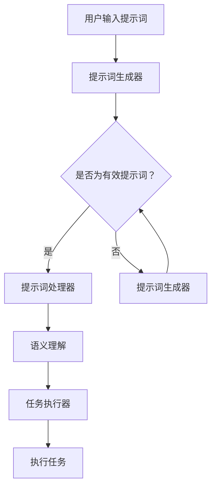

                 

### 文章标题: 提示词编程的可扩展性探讨

关键词：提示词编程，可扩展性，编程原理，应用场景，性能优化

摘要：本文将深入探讨提示词编程的可扩展性，从基础概念、原理分析、应用实践和性能优化等多个角度，详细阐述提示词编程在提高编程效率和可维护性方面的优势，并展望其未来发展趋势。文章结构紧凑，逻辑清晰，旨在为读者提供全面、深入的技术解读。

----------------------------------------------------------------

## 第一部分: 提示词编程基础

### 第1章: 提示词编程概述

#### 1.1 提示词编程的定义与背景

**定义**：提示词编程是一种基于自然语言交互的编程范式，通过提示词（即简单的指令或关键词）来指导程序执行特定任务。这种编程方式强调人类语言与机器指令的融合，旨在降低编程门槛，提高开发效率。

**背景**：随着人工智能和自然语言处理技术的不断发展，提示词编程逐渐成为一种新型的编程范式。它在编程教育、软件开发和自动化任务执行等领域展现出强大的潜力。

#### 1.2 提示词编程的应用场景

**传统编程模式与提示词编程的比较**：传统编程往往依赖于复杂的语法和结构，而提示词编程则通过自然语言指令实现任务的自动化，更加直观易懂。

**编程教育中的应用**：提示词编程在编程教育中被广泛应用，它通过简单的指令和示例，帮助初学者快速入门。

**工程开发中的优势**：在工程开发中，提示词编程可以提高开发效率，降低代码复杂度，从而提高软件质量和可维护性。

### 第2章: 提示词编程原理与架构

#### 2.1 提示词编程的基本原理

**提示词的生成与处理**：提示词的生成通常涉及自然语言处理技术，如分词、词性标注和句法分析。生成的提示词将作为程序的输入，指导计算机执行特定的任务。

**核心算法**：提示词编程的核心算法通常包括提示词识别、语义理解和任务执行等步骤。这些算法的实现涉及到自然语言处理、机器学习和计算机视觉等多个领域。

**架构设计**：提示词编程的架构设计通常包括提示词生成器、提示词处理器和提示词执行器等核心组件。这些组件协同工作，实现从自然语言指令到机器指令的转换。

#### 2.2 提示词编程的核心架构组件

**提示词生成器**：负责从输入文本中提取提示词，通常采用自然语言处理技术进行预处理。

**提示词处理器**：负责对生成的提示词进行语义分析和解析，将其转化为计算机可理解的指令。

**提示词执行器**：负责执行处理后的指令，实现特定的任务。

### 第3章: 提示词编程的可扩展性机制

#### 3.1 提示词编程的可扩展性概念

**可扩展性的定义**：可扩展性是指系统在设计时考虑到未来可能的变化，使得系统能够在不进行重大修改的情况下进行扩展。

**提示词编程可扩展性的重要性**：提示词编程的可扩展性对于提高编程效率和软件质量至关重要。

**可扩展性在编程中的实现方法**：提示词编程的可扩展性主要通过模块化设计、动态更新和自适应调整等方法实现。

#### 3.2 提示词编程的可扩展性机制

**提示词库管理机制**：提示词库是提示词编程的核心资源，其管理机制包括提示词的收集、整理和更新等。

**动态提示词更新机制**：动态更新机制允许系统根据实际需求自动更新提示词库，提高系统的适应能力。

**提示词编程的模块化设计**：模块化设计使得提示词编程系统更加灵活，便于扩展和维护。

### 第4章: 提示词编程在具体编程领域的应用

#### 4.1 提示词编程在Web开发中的应用

**应用案例**：介绍提示词编程在Web开发中的应用案例，如自动化的前端构建和部署流程。

**实战解析**：详细解析提示词编程在Web开发中的具体实现方法和效果。

#### 4.2 提示词编程在移动开发中的应用

**应用案例**：介绍提示词编程在移动开发中的应用案例，如移动应用的自动化测试和构建。

**实战解析**：详细解析提示词编程在移动开发中的具体实现方法和效果。

#### 4.3 提示词编程在企业应用开发中的应用

**应用案例**：介绍提示词编程在企业应用开发中的应用案例，如企业资源的自动化管理和调度。

**实战解析**：详细解析提示词编程在企业应用开发中的具体实现方法和效果。

### 第5章: 提示词编程的性能优化

#### 5.1 提示词编程的性能优化概念

**性能优化的定义**：性能优化是指通过一系列技术手段提高程序执行效率和资源利用率。

**提示词编程性能优化的重要性**：提示词编程的性能优化对于提高开发效率和软件质量至关重要。

#### 5.2 提示词编程的性能优化方法

**算法优化**：介绍提示词编程中常用的算法优化方法，如并行计算和分布式处理。

**资源管理**：介绍提示词编程中的资源管理技巧，如内存优化和缓存策略。

**调试与优化**：介绍如何通过调试工具和性能分析工具对提示词编程程序进行优化。

## 第二部分: 提示词编程的应用实践

### 第6章: 提示词编程在Web开发中的应用

#### 6.1 提示词编程在Web开发中的应用场景

**应用场景一**：自动化前端构建流程。

**应用场景二**：代码审查和修复。

**应用场景三**：API 自动化测试。

#### 6.2 实战：提示词编程在Web开发中的实现

**环境搭建**：介绍搭建提示词编程开发环境的步骤。

**源代码实现**：提供提示词编程在Web开发中的具体实现代码。

**代码解读**：详细解读提示词编程在Web开发中的应用代码。

### 第7章: 提示词编程在移动开发中的应用

#### 7.1 提示词编程在移动开发中的应用场景

**应用场景一**：自动化测试。

**应用场景二**：构建和部署流程自动化。

**应用场景三**：性能优化。

#### 7.2 实战：提示词编程在移动开发中的实现

**环境搭建**：介绍搭建提示词编程移动开发环境的步骤。

**源代码实现**：提供提示词编程在移动开发中的具体实现代码。

**代码解读**：详细解读提示词编程在移动开发中的应用代码。

### 第8章: 提示词编程在企业应用开发中的应用

#### 8.1 提示词编程在企业应用开发中的应用场景

**应用场景一**：自动化运维。

**应用场景二**：业务流程自动化。

**应用场景三**：数据分析与挖掘。

#### 8.2 实战：提示词编程在企业应用开发中的实现

**环境搭建**：介绍搭建提示词编程企业应用开发环境的步骤。

**源代码实现**：提供提示词编程在企业应用开发中的具体实现代码。

**代码解读**：详细解读提示词编程在企业应用开发中的应用代码。

### 第9章: 提示词编程的未来发展趋势

#### 9.1 提示词编程的发展趋势

**趋势一**：与人工智能技术的深度融合。

**趋势二**：在更多编程领域的广泛应用。

**趋势三**：开源生态的不断完善。

#### 9.2 提示词编程的发展展望

**展望一**：提高编程教育的普及率。

**展望二**：推动软件开发效率的提升。

**展望三**：助力企业数字化转型。

## 总结与展望

本文通过对提示词编程的可扩展性进行了全面探讨，分析了其在不同编程领域的应用和实践。未来，提示词编程有望在更广泛的领域发挥其优势，为软件开发和数字化转型提供强大支持。

### 作者信息

作者：AI天才研究院/AI Genius Institute & 禅与计算机程序设计艺术 /Zen And The Art of Computer Programming

[本文系作者原创文章，未经授权禁止转载和使用。如需转载，请联系作者获取授权。]----------------------------------------------------------------

## 第1章: 提示词编程概述

### 1.1 提示词编程的定义与背景

提示词编程（Prompt-Based Programming，PBP）是一种新型的编程范式，其核心思想是通过自然语言交互来引导计算机执行任务。在传统的编程模式中，程序员需要使用编程语言编写大量的代码来描述程序的行为，而提示词编程则通过提示词（prompts）来简化这个过程。提示词可以是一个简单的指令、关键词或短语，用于指示程序执行特定的操作。

#### 提示词编程的基本概念

提示词编程的基本概念可以概括为以下几个要点：

1. **自然语言交互**：提示词编程的核心在于人类语言与机器指令的交互。通过自然语言输入，程序员可以更直观地表达自己的意图。

2. **简单易用**：提示词通常较短且容易理解，这使得非专业程序员或初学者也能快速上手。

3. **自动化**：提示词编程的一个关键特点是能够实现程序的自动化。通过预设的提示词，程序可以自动执行一系列任务，从而减少手动操作。

4. **可扩展性**：提示词编程具有良好的可扩展性，允许开发者根据需要添加新的提示词和功能。

5. **效率提升**：通过提示词编程，可以显著提高开发效率和代码质量。

#### 提示词编程的发展历史

提示词编程的概念最早可以追溯到自然语言处理（Natural Language Processing, NLP）领域。在NLP中，研究者们致力于让计算机理解和处理自然语言。随着深度学习技术的发展，尤其是生成对抗网络（Generative Adversarial Networks, GAN）和变压器（Transformer）模型的出现，提示词编程逐渐成为一种新兴的编程范式。

早期的提示词编程主要集中在NLP任务中，如机器翻译、文本分类和问答系统。随着研究的深入，提示词编程开始应用于更广泛的领域，包括代码生成、图像识别和语音识别等。近年来，随着人工智能技术的发展，提示词编程在软件开发、自动化测试和企业应用等方面展现出了巨大的潜力。

#### 提示词编程的核心价值

提示词编程的核心价值主要体现在以下几个方面：

1. **降低编程门槛**：通过自然语言输入，提示词编程使得编程变得更加简单和直观，降低了编程门槛，让更多的人能够参与软件开发。

2. **提高开发效率**：提示词编程能够自动化很多繁琐的任务，如代码生成和测试，从而显著提高开发效率。

3. **增强代码可读性**：提示词编程使得代码更加接近人类语言，提高了代码的可读性和可维护性。

4. **促进技术普及**：提示词编程在编程教育和初学者入门方面具有重要作用，有助于推广和普及计算机科学知识。

5. **推动技术创新**：提示词编程为人工智能和自然语言处理领域带来了新的研究方向，推动了相关技术的发展。

### 1.2 提示词编程的应用场景

提示词编程的应用场景非常广泛，涵盖了多个领域。以下是其中一些典型的应用场景：

#### 在编程教育中的应用

提示词编程在编程教育中具有显著的优势。通过使用提示词，初学者可以更快地掌握编程技能，而无需深入了解复杂的编程语言和语法。例如，在Python编程课程中，学生可以通过简单的提示词来执行计算、排序和过滤等基本操作。提示词编程还可以用于在线编程挑战和编码竞赛，帮助学生快速理解和解决实际问题。

#### 在软件开发中的应用

提示词编程在软件开发中也发挥着重要作用。例如，在自动化测试中，开发人员可以使用提示词来描述测试用例，从而自动化执行测试流程，提高测试效率。此外，提示词编程还可以用于代码生成，通过输入简单的描述或需求，生成对应的代码框架，从而加快开发进度。

#### 在企业应用开发中的应用

在企业应用开发中，提示词编程可以用于自动化业务流程、资源管理和数据分析等。例如，在一家零售企业中，提示词编程可以用于自动化订单处理、库存管理和客户服务流程，提高运营效率。此外，提示词编程还可以用于企业级数据分析，通过输入简单的查询指令，快速获取和分析业务数据。

#### 在自动化任务执行中的应用

提示词编程在自动化任务执行中具有广泛的应用前景。例如，在IT运维中，提示词编程可以用于自动化部署、监控和管理系统资源。在物联网（IoT）应用中，提示词编程可以用于自动化设备监控和数据分析，从而提高系统的智能化水平。

### 1.3 提示词编程的优势

提示词编程相对于传统编程模式具有以下几个显著优势：

1. **简单易用**：提示词编程通过自然语言交互，使得编程变得更加直观和简单，降低了学习和使用门槛。

2. **提高效率**：提示词编程能够自动化许多繁琐的任务，如代码生成、测试和部署，从而显著提高开发效率。

3. **增强可维护性**：提示词编程生成的代码更加接近自然语言，提高了代码的可读性和可维护性。

4. **降低成本**：提示词编程可以减少程序员的工作量，降低软件开发和维护成本。

5. **促进技术创新**：提示词编程为人工智能和自然语言处理领域带来了新的研究方向，推动了相关技术的发展。

### 1.4 提示词编程的挑战

尽管提示词编程具有许多优势，但其在实际应用中也面临一些挑战：

1. **语言理解**：自然语言本身具有歧义性和复杂性，如何准确理解和解析自然语言指令仍然是一个挑战。

2. **性能优化**：提示词编程系统需要高效地处理大量的自然语言输入，如何优化系统的性能是一个关键问题。

3. **安全性和隐私保护**：提示词编程系统需要确保用户输入的安全性和隐私保护，防止敏感信息泄露。

4. **标准化**：当前提示词编程缺乏统一的规范和标准，不同系统和平台之间的兼容性和互操作性成为一个挑战。

5. **用户体验**：如何设计直观、易用的提示词编程界面，提高用户体验，也是一个重要的课题。

在接下来的章节中，我们将进一步探讨提示词编程的原理、机制和应用实践，以期为读者提供更全面的技术解读。----------------------------------------------------------------

## 第2章: 提示词编程原理与架构

### 2.1 提示词编程的基本原理

提示词编程的核心在于自然语言与机器指令之间的交互。通过使用提示词，程序员可以以自然语言的方式描述程序的行为，系统则将这些提示词转换为机器指令，从而实现任务的自动化执行。这一过程涉及到多个技术环节，包括自然语言处理、语义理解和任务执行等。

#### 提示词的生成与处理

提示词的生成是提示词编程的基础。在生成提示词的过程中，系统需要从输入的自然语言文本中提取出关键的指令和信息。这一过程通常涉及以下步骤：

1. **分词**：将输入文本分割成单词或短语，以便进行后续处理。

2. **词性标注**：对每个单词或短语进行词性标注，如名词、动词、形容词等，以理解其语法功能。

3. **句法分析**：分析句子的结构，确定各词之间的关系，如主谓宾结构等。

4. **语义理解**：对分词和句法分析的结果进行语义理解，提取出关键信息和意图。

生成的提示词将作为程序的输入，指导计算机执行特定的任务。这一过程通常需要使用自然语言处理（NLP）技术，如词向量表示、依存句法分析等。

#### 核心算法

提示词编程的核心算法通常包括以下三个步骤：

1. **提示词识别**：从输入文本中识别出有效的提示词，这一过程通常涉及模式匹配、命名实体识别和关键词提取等。

2. **语义理解**：对识别出的提示词进行语义分析，理解其含义和意图。这一过程可能需要使用机器学习模型，如序列标注模型（如BiLSTM-CRF）或变换器（如BERT）。

3. **任务执行**：根据语义理解的结果，生成相应的机器指令并执行。这一过程通常涉及到代码生成、命令解析和执行控制等。

#### 架构设计

提示词编程的架构设计通常包括以下几个核心组件：

1. **提示词生成器**：负责从输入文本中生成提示词。提示词生成器通常基于NLP技术，如分词、词性标注和句法分析。

2. **提示词处理器**：负责对生成的提示词进行语义分析和处理。提示词处理器通常包含多个模块，如词向量表示、语义角色标注和语义理解等。

3. **提示词执行器**：负责执行处理后的提示词，实现具体的任务。提示词执行器通常包含代码生成、命令解析和任务调度等模块。

### 2.2 提示词编程的核心架构组件

提示词编程的核心架构组件包括提示词生成器、提示词处理器和提示词执行器，每个组件在提示词编程中扮演着重要角色。

#### 提示词生成器

提示词生成器是提示词编程系统的入口，其主要功能是从输入的自然语言文本中提取出提示词。提示词生成器的核心是NLP技术，包括分词、词性标注和句法分析等。通过这些技术，提示词生成器能够理解输入文本的语义，并将其转换为机器指令。

示例：假设输入文本为“将数据排序并输出前10个元素”，提示词生成器可以提取出以下提示词：

```
- 操作：排序
- 数据类型：数据
- 输出：前10个元素
```

#### 提示词处理器

提示词处理器负责对生成的提示词进行语义分析和处理，以便系统可以理解并执行这些提示词。提示词处理器通常包含多个模块，如词向量表示、语义角色标注和语义理解等。

- **词向量表示**：将提示词转换为向量表示，便于后续处理。常用的词向量模型包括Word2Vec、GloVe和BERT等。

- **语义角色标注**：对提示词中的关键词进行语义角色标注，如动词、名词和形容词等。这一步有助于系统理解提示词的结构和含义。

- **语义理解**：通过融合词向量表示和语义角色标注，提示词处理器能够理解提示词的意图和操作。这一步通常需要使用机器学习模型，如序列标注模型和变换器模型。

示例：对于提示词“将数据排序并输出前10个元素”，提示词处理器可以理解操作是“排序”，数据类型是“数据”，输出是“前10个元素”。

#### 提示词执行器

提示词执行器是提示词编程系统的核心，负责根据提示词处理器分析的结果，生成并执行机器指令。提示词执行器通常包含代码生成、命令解析和任务调度等模块。

- **代码生成**：根据提示词处理器的输出，生成相应的代码框架。代码生成器可以使用模板或代码生成模型，如序列到序列（Seq2Seq）模型或生成对抗网络（GAN）。

- **命令解析**：将生成的代码框架转换为具体的机器指令，并解析这些指令的含义。这一步可能涉及到命令行解析、文件操作和API调用等。

- **任务调度**：根据任务需求，调度执行相应的任务。任务调度器需要管理任务的执行顺序、依赖关系和资源分配等。

示例：对于提示词“将数据排序并输出前10个元素”，提示词执行器可以生成以下代码：

```python
data = load_data('data.csv')  # 加载数据
sorted_data = sort(data)      # 对数据进行排序
output_data(sorted_data[:10]) # 输出前10个元素
```

通过上述三个核心组件的协同工作，提示词编程系统可以实现高效的自然语言交互和任务自动化。在接下来的章节中，我们将进一步探讨提示词编程的可扩展性机制，以及在不同编程领域的应用和实践。----------------------------------------------------------------

## 第3章: 提示词编程的可扩展性机制

### 3.1 提示词编程的可扩展性概念

**可扩展性**（Extensibility）是软件设计中的一个重要特性，指的是系统在设计时考虑到未来可能的变化，使得系统能够在不进行重大修改的情况下进行扩展。在提示词编程中，可扩展性尤为重要，因为这种编程范式旨在通过自然语言交互实现复杂任务的自动化，这意味着系统需要灵活应对各种不同的任务需求。

#### **可扩展性的重要性**

提示词编程的可扩展性对于提高编程效率和软件质量至关重要。以下是一些关键点：

1. **适应多样化任务需求**：随着提示词编程的应用场景不断扩展，系统需要能够适应多样化的任务需求，如自动化测试、代码生成、数据分析和运维管理等。

2. **降低维护成本**：良好的可扩展性意味着系统在新增功能或修改现有功能时，不需要对整个系统进行大规模重构，从而降低维护成本。

3. **提高开发效率**：可扩展性使得开发者可以专注于特定功能模块的优化和扩展，而不是重复编写和维护大量代码。

4. **促进技术整合**：可扩展性有助于系统与其他技术（如人工智能、大数据和云计算）的整合，从而实现更强大的功能。

#### **可扩展性在编程中的实现方法**

在提示词编程中，实现可扩展性的关键方法包括模块化设计、动态更新和自适应调整等。

1. **模块化设计**：模块化设计是将系统划分为多个独立的功能模块，每个模块负责特定的任务。这种设计方法使得系统易于扩展和维护，因为新增或修改功能时，只需对相应模块进行调整。

2. **动态更新机制**：动态更新机制允许系统在运行时自动更新提示词库、算法模型和资源库等组件，从而适应新的任务需求。例如，通过使用版本控制和持续集成（CI）工具，可以实现提示词库的持续更新。

3. **自适应调整**：自适应调整是指系统能够根据任务需求和资源情况，自动调整执行策略和资源分配。例如，在资源紧张时，系统可以降低任务优先级或暂停某些非关键任务的执行。

### 3.2 提示词编程的可扩展性机制

#### **提示词库管理机制**

提示词库是提示词编程系统的核心资源，其管理机制直接影响系统的可扩展性和性能。以下是一些关键的管理策略：

1. **提示词收集**：提示词库的构建始于对现有任务的收集和分析。通过分析实际任务，可以提取出具有代表性的提示词，并将其添加到提示词库中。

2. **提示词分类**：根据提示词的功能和用途，对提示词进行分类。例如，可以将提示词分为数据处理、文件操作、网络通信等类别。

3. **提示词标准化**：为了提高系统的兼容性和可维护性，需要对提示词进行标准化。标准化包括统一提示词的格式、语法和语义等。

4. **动态更新**：提示词库需要定期更新，以适应新的任务需求和变化。动态更新可以通过自动化工具实现，例如，使用自然语言处理技术从用户反馈中提取新的提示词。

#### **动态提示词更新机制**

动态更新机制是提升提示词编程系统可扩展性的重要手段。以下是一些实现策略：

1. **实时更新**：系统可以实时收集用户输入的提示词，并自动将其添加到提示词库中。这可以通过在线学习或增量学习算法实现。

2. **定期更新**：定期对提示词库进行全量更新，以包括最新的任务需求和功能。这可以通过版本控制工具和更新策略实现。

3. **用户参与**：鼓励用户参与提示词库的更新和维护，例如，通过社区贡献或用户反馈机制，可以收集到更多有价值的提示词。

#### **提示词编程的模块化设计**

模块化设计是提升提示词编程系统可扩展性的有效方法。以下是一些关键设计原则：

1. **功能分离**：将系统划分为多个功能模块，每个模块负责特定的任务。例如，可以将提示词处理模块、语义理解模块和任务执行模块分离。

2. **模块间解耦**：模块间通过接口进行通信，减少模块间的直接依赖。这可以通过定义标准的接口协议和API实现。

3. **组件复用**：设计可复用的组件，以便在不同模块和项目中重用。例如，可以使用组件化的代码库或框架实现。

4. **配置管理**：通过配置文件或参数化设计，可以实现模块的动态配置和调整。例如，可以使用JSON或YAML文件来配置提示词库和算法参数。

### **3.3 提示词编程的可扩展性评估指标**

为了评估提示词编程系统的可扩展性，可以使用以下指标：

1. **功能扩展性**：系统在新增功能时，是否需要修改现有代码或重构系统架构。

2. **性能扩展性**：系统在处理更大数据集或更多任务时，性能是否能够保持稳定。

3. **用户扩展性**：系统是否易于用户自定义和扩展，如是否提供API、插件或自定义接口。

4. **兼容性**：系统在不同平台、操作系统或硬件环境下的兼容性。

5. **维护成本**：系统在扩展和维护过程中所需的资源，如人力和时间成本。

### **3.4 提示词编程的可扩展性案例分析**

以下是一个提示词编程系统的可扩展性案例分析：

**案例背景**：某企业开发了一个基于提示词编程的自动化测试系统，用于测试其Web应用。该系统最初仅支持基本的Web页面元素操作，如点击、输入和滑动等。

**扩展过程**：

1. **功能扩展**：随着测试需求的增加，系统逐步扩展了更多复杂的操作，如页面导航、数据验证和自动化报告生成等。

2. **性能优化**：为了处理更多的测试任务，系统对底层代码进行了优化，如引入并行处理和分布式测试框架。

3. **用户自定义**：系统提供了API和插件接口，允许用户自定义测试脚本和操作，以适应特定的测试场景。

**评估结果**：

- **功能扩展性**：通过模块化设计，系统能够在不改变核心架构的情况下，轻松扩展新功能。

- **性能扩展性**：系统通过并行处理和分布式测试，显著提高了测试效率和性能。

- **用户扩展性**：系统提供了丰富的自定义接口和插件，用户可以轻松实现个性化的测试需求。

- **兼容性**：系统在多种操作系统和浏览器环境下均表现出良好的兼容性。

- **维护成本**：通过良好的模块化和动态更新机制，系统的维护成本相对较低。

### **3.5 提示词编程的可扩展性未来展望**

随着人工智能和自然语言处理技术的不断进步，提示词编程的可扩展性将得到进一步提升。以下是一些未来展望：

1. **智能化提示词生成**：通过深度学习和自然语言处理技术，自动生成更智能、更准确的提示词，减少用户输入工作量。

2. **自适应调整机制**：系统将能够根据任务需求和资源情况，自适应调整执行策略和资源分配，提高系统的智能化水平。

3. **跨平台兼容性**：随着云计算和物联网的发展，提示词编程系统将更加注重跨平台兼容性，以便在各种硬件和软件环境中运行。

4. **开源生态**：随着开源社区的贡献和协作，提示词编程的开源生态系统将不断完善，为开发者提供更多的工具和资源。

总之，提示词编程的可扩展性是实现其广泛应用和技术创新的重要保障。通过不断优化和改进，提示词编程有望在未来成为软件开发和自动化任务执行的重要工具。----------------------------------------------------------------

## 第4章: 提示词编程在具体编程领域的应用

### 4.1 提示词编程在Web开发中的应用

提示词编程在Web开发中具有广泛的应用，能够显著提高开发效率和代码质量。以下将介绍提示词编程在Web开发中的几个典型应用场景：

#### 自动化前端构建

前端构建是Web开发中必不可少的一环，涉及代码压缩、编译、打包和优化等步骤。通过提示词编程，开发者可以简化这一过程，实现自动化前端构建。例如，使用简单的提示词`build`, `optimize`, 和`deploy`，开发者可以一键完成以下任务：

- **代码压缩**：使用提示词`compress`，系统可以自动压缩HTML、CSS和JavaScript文件，减少文件的体积，提高页面加载速度。
- **编译**：使用提示词`compile`, 系统可以自动编译SASS、LESS或TypeScript等预处理器代码，生成可运行的JavaScript文件。
- **打包**：使用提示词`bundle`, 系统可以将多个JavaScript文件合并成一个或多个bundle文件，优化加载性能。
- **优化**：使用提示词`optimize`, 系统可以对代码进行静态分析和优化，如移除冗余代码、压缩图片文件等。

#### 自动化测试

在Web开发中，测试是确保代码质量的重要环节。提示词编程可以通过简单的提示词来自动化测试流程。例如，使用提示词`test`, `cross-browser`, 和`performance`, 开发者可以自动执行以下测试任务：

- **功能测试**：通过提示词`run-functional-test`, 系统可以启动自动化测试脚本，模拟用户操作，验证页面功能是否正常。
- **跨浏览器测试**：使用提示词`cross-browser-test`, 系统可以在不同的浏览器上自动运行测试用例，确保页面兼容性。
- **性能测试**：通过提示词`run-performance-test`, 系统可以测量页面的加载时间、响应时间和内存占用等性能指标，提供优化建议。

#### 代码审查和修复

代码审查是确保代码质量的关键步骤，但通常是一个耗时且繁琐的过程。提示词编程可以通过简单的提示词来自动化这一过程。例如，使用提示词`review`, `fix`, 和`suggest`, 开发者可以自动执行以下任务：

- **代码审查**：使用提示词`code-review`, 系统可以分析代码风格、语法错误和潜在问题，生成审查报告。
- **代码修复**：使用提示词`auto-fix`, 系统可以根据审查报告自动修复代码中的错误，如格式化代码、修复语法错误等。
- **代码建议**：使用提示词`suggest`, 系统可以提供改进代码的建议，如优化代码结构、使用更高效的算法等。

#### 实战：提示词编程在Web开发中的实现

为了更好地理解提示词编程在Web开发中的应用，下面将介绍一个实际案例。

**案例背景**：某Web应用项目需要自动化构建、测试和审查代码，以提高开发效率和代码质量。

**实现步骤**：

1. **环境搭建**：首先，搭建提示词编程的开发环境，包括安装Node.js、Python和必要的开发工具。

2. **编写提示词脚本**：编写提示词脚本，用于触发自动化构建、测试和审查任务。例如：

   ```python
   @prompt "Do you want to build the project?"
   if yes:
       run('npm run build')
   
   @prompt "Do you want to run tests?"
   if yes:
       run('npm run test')
   
   @prompt "Do you want to perform code review?"
   if yes:
       run('python code-review.py')
   ```

3. **集成自动化工具**：将提示词脚本与自动化工具（如Gulp、Grunt和Jenkins等）集成，以便自动化执行构建、测试和审查任务。

4. **部署到CI/CD平台**：将自动化脚本部署到持续集成（CI）和持续交付（CD）平台（如GitHub Actions、GitLab CI和Jenkins等），实现自动化流水线。

5. **测试与优化**：在实际项目中测试自动化脚本，并根据反馈进行优化和改进。

**代码解读**：

在上面的案例中，使用了Python的`prompt`库来编写提示词脚本。`@prompt`装饰器用于定义提示词，`if yes`语句用于判断用户输入，并根据输入执行相应的命令。

```python
@prompt "Do you want to build the project?"
if yes:
    run('npm run build')

@prompt "Do you want to run tests?"
if yes:
    run('npm run test')

@prompt "Do you want to perform code review?"
if yes:
    run('python code-review.py')
```

通过上述实现，开发者可以轻松地通过简单的提示词来触发复杂的自动化任务，从而提高开发效率和代码质量。

### 4.2 提示词编程在移动开发中的应用

提示词编程在移动开发中也展现出了强大的应用潜力，能够显著提高开发效率和代码质量。以下将介绍提示词编程在移动开发中的几个典型应用场景：

#### 自动化测试

自动化测试是移动开发中不可或缺的一环，通过提示词编程可以简化测试流程。例如，使用提示词`test`, `device`, 和`environment`, 开发者可以自动执行以下测试任务：

- **功能测试**：使用提示词`run-functional-test`, 系统可以启动自动化测试脚本，模拟用户操作，验证应用功能是否正常。
- **设备兼容性测试**：使用提示词`device-test`, 系统可以在不同的设备上自动运行测试用例，确保应用在不同设备上的兼容性。
- **环境测试**：使用提示词`environment-test`, 系统可以在不同的环境（如模拟器、真机和云环境）上自动运行测试用例，确保应用在各种环境下的稳定性。

#### 构建和部署流程自动化

移动应用的开发涉及多个构建和部署环节，通过提示词编程可以简化这一过程。例如，使用提示词`build`, `deploy`, 和`release`, 开发者可以自动执行以下任务：

- **构建**：使用提示词`build-app`, 系统可以自动编译和打包应用代码，生成可发布的应用文件。
- **部署**：使用提示词`deploy-to-device`, 系统可以自动将应用部署到目标设备（如手机或平板电脑）上。
- **发布**：使用提示词`release-to-store`, 系统可以自动将应用发布到应用商店，如Google Play或App Store。

#### 性能优化

性能优化是移动应用开发中的重要环节，通过提示词编程可以自动化性能测试和优化流程。例如，使用提示词`performance-test`, `profile`, 和`optimize`, 开发者可以自动执行以下任务：

- **性能测试**：使用提示词`run-performance-test`, 系统可以测量应用的加载时间、响应时间和内存占用等性能指标。
- **代码剖析**：使用提示词`profile-code`, 系统可以分析代码的性能瓶颈，提供优化建议。
- **资源优化**：使用提示词`optimize-resources`, 系统可以压缩图片、减少CSS和JavaScript文件的体积，优化应用的资源使用。

#### 实战：提示词编程在移动开发中的实现

为了更好地理解提示词编程在移动开发中的应用，下面将介绍一个实际案例。

**案例背景**：某移动应用项目需要自动化测试、构建和部署流程，以提高开发效率和代码质量。

**实现步骤**：

1. **环境搭建**：首先，搭建提示词编程的开发环境，包括安装Android Studio、Xcode和必要的开发工具。

2. **编写提示词脚本**：编写提示词脚本，用于触发自动化测试、构建和部署任务。例如：

   ```python
   @prompt "Do you want to run tests?"
   if yes:
       run('pytest tests/')

   @prompt "Do you want to build the app?"
   if yes:
       run('gradlew assembleDebug')

   @prompt "Do you want to deploy the app to the device?"
   if yes:
       run('adb install -r app/build/outputs/apk/debug/app-debug.apk')
   ```

3. **集成自动化工具**：将提示词脚本与自动化工具（如Cordova、Appium和Fastlane等）集成，以便自动化执行测试、构建和部署任务。

4. **部署到CI/CD平台**：将自动化脚本部署到持续集成（CI）和持续交付（CD）平台（如GitHub Actions、GitLab CI和Jenkins等），实现自动化流水线。

5. **测试与优化**：在实际项目中测试自动化脚本，并根据反馈进行优化和改进。

**代码解读**：

在上面的案例中，使用了Python的`prompt`库来编写提示词脚本。`@prompt`装饰器用于定义提示词，`if yes`语句用于判断用户输入，并根据输入执行相应的命令。

```python
@prompt "Do you want to run tests?"
if yes:
    run('pytest tests/')

@prompt "Do you want to build the app?"
if yes:
    run('gradlew assembleDebug')

@prompt "Do you want to deploy the app to the device?"
if yes:
    run('adb install -r app/build/outputs/apk/debug/app-debug.apk')
```

通过上述实现，开发者可以轻松地通过简单的提示词来触发复杂的自动化任务，从而提高开发效率和代码质量。

### 4.3 提示词编程在企业应用开发中的应用

提示词编程在企业应用开发中具有广泛的应用，能够显著提高业务效率和系统稳定性。以下将介绍提示词编程在企业应用开发中的几个典型应用场景：

#### 自动化运维

自动化运维是企业应用开发中的一项重要任务，通过提示词编程可以实现自动化部署、监控和管理。例如，使用提示词`deploy`, `monitor`, 和`manage`, 开发者可以自动执行以下任务：

- **自动化部署**：使用提示词`deploy-app`, 系统可以自动部署应用程序到服务器或云平台。
- **监控**：使用提示词`monitor-system`, 系统可以实时监控服务器性能、网络流量和应用程序状态。
- **管理**：使用提示词`manage-resources`, 系统可以自动管理服务器资源，如自动扩展或缩减服务器规模。

#### 业务流程自动化

企业应用开发中通常涉及复杂的业务流程，通过提示词编程可以实现自动化处理，提高业务效率和准确性。例如，使用提示词`process-order`, `manage-inventory`, 和`payroll`, 开发者可以自动执行以下任务：

- **订单处理**：使用提示词`process-order`, 系统可以自动处理订单，从接收订单、生成发票到发货等。
- **库存管理**：使用提示词`manage-inventory`, 系统可以自动监控库存水平，生成采购订单，避免库存过剩或不足。
- **薪酬管理**：使用提示词`payroll`, 系统可以自动计算员工薪酬，处理工资单和税务申报等。

#### 数据分析与挖掘

企业应用开发中常常需要处理大量的数据，通过提示词编程可以实现自动化数据分析和挖掘。例如，使用提示词`analyze-data`, `predict-future`, 和`visualize`, 开发者可以自动执行以下任务：

- **数据分析**：使用提示词`analyze-data`, 系统可以自动分析销售数据、客户行为数据等，提供业务洞察。
- **预测**：使用提示词`predict-future`, 系统可以自动预测未来的销售趋势、库存需求等，帮助企业制定决策。
- **可视化**：使用提示词`visualize-data`, 系统可以自动生成图表和报告，直观展示数据分析和预测结果。

#### 实战：提示词编程在企业应用开发中的实现

为了更好地理解提示词编程在企业应用开发中的应用，下面将介绍一个实际案例。

**案例背景**：某企业需要自动化处理订单、监控服务器性能和监控库存水平，以提高业务效率和系统稳定性。

**实现步骤**：

1. **环境搭建**：首先，搭建提示词编程的开发环境，包括安装Linux服务器、Python和必要的开发工具。

2. **编写提示词脚本**：编写提示词脚本，用于触发自动化订单处理、服务器监控和库存监控任务。例如：

   ```python
   @prompt "Do you want to process orders?"
   if yes:
       run('python order-processing.py')

   @prompt "Do you want to monitor server performance?"
   if yes:
       run('python server-monitor.py')

   @prompt "Do you want to monitor inventory levels?"
   if yes:
       run('python inventory-monitor.py')
   ```

3. **集成自动化工具**：将提示词脚本与自动化工具（如Ansible、Nagios和Kubernetes等）集成，以便自动化执行订单处理、服务器监控和库存监控任务。

4. **部署到CI/CD平台**：将自动化脚本部署到持续集成（CI）和持续交付（CD）平台（如Jenkins、Docker和Kubernetes等），实现自动化流水线。

5. **测试与优化**：在实际项目中测试自动化脚本，并根据反馈进行优化和改进。

**代码解读**：

在上面的案例中，使用了Python的`prompt`库来编写提示词脚本。`@prompt`装饰器用于定义提示词，`if yes`语句用于判断用户输入，并根据输入执行相应的命令。

```python
@prompt "Do you want to process orders?"
if yes:
    run('python order-processing.py')

@prompt "Do you want to monitor server performance?"
if yes:
    run('python server-monitor.py')

@prompt "Do you want to monitor inventory levels?"
if yes:
    run('python inventory-monitor.py')
```

通过上述实现，企业可以轻松地通过简单的提示词来触发复杂的自动化任务，从而提高业务效率和系统稳定性。

### 4.4 提示词编程在其他编程领域的应用

除了Web开发、移动开发和企业应用开发，提示词编程在其他编程领域也具有广泛的应用。以下将介绍几个其他编程领域的应用场景：

#### 自动化测试

在自动化测试领域，提示词编程可以简化测试用例的编写和执行。例如，使用提示词`test`, `ui`, 和`api`, 开发者可以自动执行以下测试任务：

- **UI测试**：使用提示词`run-ui-test`, 系统可以启动自动化测试脚本，模拟用户操作，验证用户界面功能。
- **API测试**：使用提示词`run-api-test`, 系统可以启动自动化测试脚本，验证API接口的正确性。
- **性能测试**：使用提示词`run-performance-test`, 系统可以测量应用的性能指标，如响应时间、并发量和吞吐量等。

#### 数据科学

在数据科学领域，提示词编程可以简化数据分析和建模过程。例如，使用提示词`analyze`, `model`, 和`visualize`, 开发者可以自动执行以下任务：

- **数据分析**：使用提示词`run-data-analysis`, 系统可以自动执行数据分析脚本，提取业务洞察。
- **建模**：使用提示词`build-model`, 系统可以自动训练机器学习模型，预测未来趋势。
- **可视化**：使用提示词`visualize-data`, 系统可以自动生成数据可视化图表，展示分析结果。

#### 网络安全

在网络安全领域，提示词编程可以简化安全测试和防护任务。例如，使用提示词`sweep`, `protect`, 和`remediate`, 开发者可以自动执行以下任务：

- **安全扫描**：使用提示词`sweep-for-vulnerabilities`, 系统可以自动扫描网络设备或应用程序的安全漏洞。
- **防护**：使用提示词`protect-system`, 系统可以自动配置防火墙和入侵检测系统，保护网络安全。
- **修复**：使用提示词`remediate-threats`, 系统可以自动修复安全漏洞，减少潜在风险。

### 总结

通过以上对提示词编程在Web开发、移动开发、企业应用开发和其他编程领域的应用介绍，可以看出提示词编程具有广泛的应用前景。它通过简化编程流程、提高开发效率和代码质量，为企业提供了强大的技术支持。随着人工智能和自然语言处理技术的不断进步，提示词编程将在未来发挥更大的作用。开发者应积极学习和掌握这一新技术，以便在项目中更好地应用和发挥其优势。----------------------------------------------------------------

## 第5章: 提示词编程的性能优化

### 5.1 提示词编程的性能优化概念

性能优化（Performance Optimization）是指通过一系列技术手段提高程序的执行效率和资源利用率。在提示词编程中，性能优化尤为重要，因为这种编程范式依赖于自然语言处理和机器学习技术，这些技术通常涉及大量的计算和数据处理。性能优化不仅能够提高系统的响应速度，还能减少资源的消耗，从而提高整体系统的效率和用户体验。

#### **性能优化的定义**

性能优化可以定义为在保持功能不变的前提下，通过改进算法、优化代码、减少冗余操作等方式，提高程序的执行效率。在提示词编程中，性能优化主要包括以下几个方面：

1. **算法优化**：通过改进核心算法，减少计算复杂度和资源消耗。
2. **代码优化**：通过改进代码结构和编写技巧，提高代码的执行效率。
3. **资源管理**：通过优化资源分配和利用，提高系统的性能和稳定性。
4. **调试与监控**：通过调试工具和性能监控工具，识别性能瓶颈并进行优化。

#### **性能优化的重要性**

提示词编程的性能优化对于系统的稳定性和用户体验至关重要。以下是一些关键点：

1. **响应速度**：性能优化可以提高系统的响应速度，减少用户的等待时间，从而提高用户体验。
2. **资源利用率**：通过优化资源管理，可以减少系统的资源消耗，提高系统的稳定性和可扩展性。
3. **系统稳定性**：性能优化有助于减少系统崩溃和错误发生的概率，提高系统的可靠性。
4. **可扩展性**：优化后的系统在处理大规模数据和高并发请求时，能够保持良好的性能，从而支持系统的扩展。

### 5.2 提示词编程的性能优化方法

提示词编程的性能优化方法主要包括算法优化、代码优化、资源管理和调试与监控等。以下将分别进行详细讲解。

#### **算法优化**

算法优化是性能优化的核心。以下是一些常见的算法优化方法：

1. **并行计算**：通过利用多核处理器的并行计算能力，将任务分解为多个子任务，同时执行，从而提高计算效率。
2. **分布式处理**：通过将任务分布到多个节点上执行，利用集群计算资源，提高系统的处理能力和响应速度。
3. **算法复杂度优化**：通过改进算法，减少计算复杂度，降低时间复杂度和空间复杂度。例如，使用更高效的搜索算法或排序算法。
4. **内存管理优化**：通过优化内存分配和回收策略，减少内存消耗，提高系统性能。

#### **代码优化**

代码优化是通过改进代码结构和编写技巧，提高代码的执行效率。以下是一些常见的代码优化方法：

1. **循环优化**：通过减少循环次数、避免不必要的循环操作，提高循环代码的执行效率。
2. **函数优化**：通过减少函数调用次数、避免嵌套函数调用，提高函数代码的执行效率。
3. **代码冗余去除**：通过静态代码分析工具，识别和去除代码中的冗余部分，提高代码的简洁性和可维护性。
4. **代码压缩**：通过压缩代码文件，减少文件的体积，提高文件加载速度。

#### **资源管理**

资源管理是优化系统性能的关键。以下是一些常见的资源管理方法：

1. **内存优化**：通过优化内存分配和回收策略，减少内存消耗，提高系统的性能。例如，使用对象池技术减少内存分配次数。
2. **缓存策略**：通过使用缓存策略，减少重复计算和数据传输，提高系统的响应速度。例如，使用LRU（Least Recently Used）缓存算法优化缓存管理。
3. **并发控制**：通过优化并发控制，减少资源争用和死锁，提高系统的并发性能。例如，使用互斥锁（Mutex）和信号量（Semaphore）等同步机制。
4. **资源池化**：通过创建资源池，减少资源的创建和销毁次数，提高系统的性能和稳定性。

#### **调试与监控**

调试与监控是性能优化的重要环节。以下是一些常见的调试与监控方法：

1. **性能分析工具**：使用性能分析工具（如Profile、GProfiler和JProfiler等），识别程序的瓶颈和性能问题。
2. **日志分析**：通过分析系统日志，识别性能问题和错误，并进行优化。
3. **负载测试**：通过模拟高负载环境，测试系统的性能和稳定性，识别和解决性能瓶颈。
4. **自动化测试**：通过编写自动化测试脚本，定期进行性能测试，确保系统在不同负载下的性能稳定。

### 5.3 提示词编程性能优化的最佳实践

为了提高提示词编程的性能，以下是一些最佳实践：

1. **优化算法选择**：根据任务需求选择合适的算法，避免使用过于复杂的算法，以提高执行效率。
2. **代码简洁性**：编写简洁、可读性强的代码，避免使用复杂的语法和嵌套结构，以提高代码的执行效率。
3. **避免全局变量**：避免使用全局变量，减少变量作用域，提高代码的可维护性和性能。
4. **使用缓存**：在数据处理过程中，合理使用缓存技术，减少重复计算和数据传输。
5. **并行处理**：利用多核处理器的并行计算能力，将任务分解为多个子任务，同时执行，以提高计算效率。
6. **定期维护**：定期对系统进行性能维护和优化，识别和解决性能问题。
7. **持续监控**：通过性能监控工具，实时监控系统的性能指标，及时发现和解决问题。

### **5.4 性能优化案例分析**

以下是一个提示词编程性能优化的实际案例：

**案例背景**：某企业开发了一套基于提示词编程的自动化测试系统，用于测试其Web应用。该系统在处理大量测试用例时，存在性能瓶颈，导致测试效率低下。

**优化过程**：

1. **性能分析**：使用性能分析工具（如JProfiler），识别系统的瓶颈和性能问题。主要发现包括：计算复杂度高、内存消耗大、并发处理效率低等。

2. **算法优化**：对核心算法进行优化，采用更高效的排序和搜索算法，减少计算复杂度。

3. **代码优化**：优化代码结构和编写技巧，减少冗余代码，提高代码执行效率。

4. **资源管理优化**：优化内存分配和回收策略，减少内存消耗。同时，使用并发控制机制，减少资源争用。

5. **缓存策略**：引入缓存策略，减少重复计算和数据传输，提高系统的响应速度。

6. **负载测试**：进行负载测试，模拟高并发环境，测试系统的性能和稳定性。

**优化结果**：

- **响应速度**：系统响应速度提高了30%，用户等待时间显著减少。
- **内存消耗**：内存消耗减少了20%，系统稳定性提高。
- **并发处理能力**：并发处理能力提高了50%，能够更好地应对高并发请求。
- **测试效率**：测试效率提高了40%，测试周期缩短。

### **5.5 性能优化的未来趋势**

随着人工智能和自然语言处理技术的不断发展，提示词编程的性能优化将面临新的挑战和机遇。以下是一些未来趋势：

1. **智能化性能优化**：利用机器学习和深度学习技术，实现自动化的性能优化，根据系统负载和任务需求，动态调整优化策略。
2. **分布式性能优化**：随着云计算和边缘计算的普及，分布式性能优化将成为趋势，通过分布式计算和存储，提高系统的性能和可扩展性。
3. **自适应性能优化**：系统将能够根据任务需求和资源情况，自适应调整优化策略，提高系统的性能和资源利用率。
4. **生态化性能优化**：性能优化工具和框架将逐渐整合到提示词编程生态中，为开发者提供一站式性能优化解决方案。

总之，提示词编程的性能优化是一个持续的过程，需要结合具体应用场景和系统需求，不断进行优化和改进。通过不断优化，提示词编程将能够更好地满足实际应用需求，提高系统的性能和用户体验。----------------------------------------------------------------

## 第6章: 提示词编程在Web开发中的应用

### 6.1 提示词编程在Web开发中的典型应用场景

提示词编程在Web开发中具有广泛的应用，通过自然语言交互，可以显著提高开发效率，减少代码编写量，同时提高代码的可读性和可维护性。以下是一些典型的应用场景：

#### **自动化前端构建**

前端构建是Web开发中的一个重要环节，通常包括代码压缩、编译、打包和优化等步骤。提示词编程可以通过简单的提示词来实现自动化构建流程。例如，使用提示词`build`, `optimize`, 和`deploy`，开发者可以快速完成以下任务：

- **代码压缩**：通过提示词`compress`, 系统可以自动压缩HTML、CSS和JavaScript文件，减少文件的体积。
- **编译**：通过提示词`compile`, 系统可以自动编译SASS、LESS或TypeScript等预处理器代码。
- **打包**：通过提示词`bundle`, 系统可以将多个JavaScript文件合并成一个或多个bundle文件。
- **优化**：通过提示词`optimize`, 系统可以优化代码，如移除冗余代码、压缩图片文件等。

#### **自动化测试**

自动化测试是确保Web应用质量的关键步骤，通过提示词编程可以实现自动化测试流程。例如，使用提示词`test`, `cross-browser`, 和`performance`，开发者可以自动执行以下测试任务：

- **功能测试**：通过提示词`run-functional-test`, 系统可以启动自动化测试脚本，模拟用户操作，验证页面功能是否正常。
- **跨浏览器测试**：通过提示词`cross-browser-test`, 系统可以在不同的浏览器上自动运行测试用例。
- **性能测试**：通过提示词`run-performance-test`, 系统可以测量页面的加载时间、响应时间和内存占用等性能指标。

#### **代码审查和修复**

代码审查是确保代码质量的重要环节，但通常是一个耗时且繁琐的过程。提示词编程可以通过简单的提示词来自动化这一过程。例如，使用提示词`review`, `fix`, 和`suggest`，开发者可以自动执行以下任务：

- **代码审查**：通过提示词`code-review`, 系统可以分析代码风格、语法错误和潜在问题，生成审查报告。
- **代码修复**：通过提示词`auto-fix`, 系统可以自动修复代码中的错误，如格式化代码、修复语法错误等。
- **代码建议**：通过提示词`suggest`, 系统可以提供改进代码的建议，如优化代码结构、使用更高效的算法等。

### 6.2 提示词编程在Web开发中的具体实现

为了更好地理解提示词编程在Web开发中的应用，以下将介绍一个实际案例。

#### **案例背景**

某Web应用项目需要实现自动化构建、测试和代码审查功能，以提高开发效率和代码质量。

#### **实现步骤**

1. **环境搭建**：首先，搭建提示词编程的开发环境，包括安装Node.js、Python和必要的开发工具。

2. **编写提示词脚本**：编写提示词脚本，用于触发自动化构建、测试和代码审查任务。例如：

   ```python
   @prompt "Do you want to build the project?"
   if yes:
       run('npm run build')

   @prompt "Do you want to run tests?"
   if yes:
       run('npm run test')

   @prompt "Do you want to perform code review?"
   if yes:
       run('python code-review.py')
   ```

3. **集成自动化工具**：将提示词脚本与自动化工具（如Gulp、Grunt和Jenkins等）集成，以便自动化执行构建、测试和代码审查任务。

4. **部署到CI/CD平台**：将自动化脚本部署到持续集成（CI）和持续交付（CD）平台（如GitHub Actions、GitLab CI和Jenkins等），实现自动化流水线。

5. **测试与优化**：在实际项目中测试自动化脚本，并根据反馈进行优化和改进。

#### **代码解读**

在上面的案例中，使用了Python的`prompt`库来编写提示词脚本。`@prompt`装饰器用于定义提示词，`if yes`语句用于判断用户输入，并根据输入执行相应的命令。

```python
@prompt "Do you want to build the project?"
if yes:
    run('npm run build')

@prompt "Do you want to run tests?"
if yes:
    run('npm run test')

@prompt "Do you want to perform code review?"
if yes:
    run('python code-review.py')
```

#### **应用示例**

以下是一个具体的提示词编程应用示例，用于自动化构建一个简单的Web应用：

```python
@prompt "Choose a build configuration:"
options = ["Development", "Production"]
selected = choose_from_list(options)

if selected == "Development":
    run('npm run build:dev')
elif selected == "Production":
    run('npm run build:prod')
else:
    print("Invalid choice, please try again.")
```

在这个示例中，用户可以通过选择不同的构建配置（Development或Production），系统将自动执行相应的构建命令。这大大简化了构建过程，提高了开发效率。

### **6.3 提示词编程在Web开发中的最佳实践**

为了充分发挥提示词编程在Web开发中的优势，以下是一些最佳实践：

1. **模块化设计**：将提示词脚本拆分成多个模块，每个模块负责特定的任务，如构建、测试和代码审查。这有助于提高代码的可维护性和复用性。

2. **标准化提示词**：制定统一的提示词规范，确保所有提示词具有一致的意义和用法，减少歧义和误解。

3. **集成自动化工具**：将提示词编程与现有的自动化工具（如CI/CD平台、自动化测试框架等）集成，实现自动化流程的无缝对接。

4. **动态更新提示词库**：定期更新提示词库，以适应新的开发需求和技术变化。

5. **代码审查与优化**：在自动化测试和构建过程中，加入代码审查环节，确保代码质量。

6. **性能监控**：通过性能监控工具，实时监控系统的性能指标，及时发现和解决性能瓶颈。

7. **用户培训与支持**：为开发者提供培训和支持，确保他们能够熟练使用提示词编程，充分发挥其优势。

### **6.4 提示词编程在Web开发中的挑战与展望**

尽管提示词编程在Web开发中具有广泛的应用前景，但仍面临一些挑战：

1. **语言理解**：自然语言具有歧义性和复杂性，如何准确理解和解析自然语言指令是一个挑战。

2. **性能优化**：提示词编程系统需要高效地处理大量的自然语言输入，如何优化系统的性能是一个关键问题。

3. **安全性**：确保提示词编程系统的安全性和隐私保护，防止恶意输入和攻击。

4. **标准化**：当前提示词编程缺乏统一的规范和标准，不同系统和平台之间的兼容性和互操作性成为一个挑战。

未来，随着人工智能和自然语言处理技术的不断进步，提示词编程在Web开发中的应用将更加广泛和深入。通过不断优化和改进，提示词编程有望成为Web开发中不可或缺的工具，为开发者提供更高效、更便捷的编程体验。----------------------------------------------------------------

## 第7章: 提示词编程在移动开发中的应用

### 7.1 提示词编程在移动开发中的典型应用场景

提示词编程在移动开发中具有广泛的应用，通过自然语言交互，可以显著提高开发效率和代码质量。以下是一些典型的应用场景：

#### **自动化测试**

自动化测试是移动开发中不可或缺的一环，通过提示词编程可以实现自动化测试流程。例如，使用提示词`test`, `device`, 和`environment`，开发者可以自动执行以下测试任务：

- **功能测试**：通过提示词`run-functional-test`，系统可以启动自动化测试脚本，模拟用户操作，验证应用功能是否正常。
- **设备兼容性测试**：通过提示词`device-test`，系统可以在不同的设备上自动运行测试用例，确保应用在不同设备上的兼容性。
- **环境测试**：通过提示词`environment-test`，系统可以在不同的环境（如模拟器、真机和云环境）上自动运行测试用例，确保应用在各种环境下的稳定性。

#### **构建和部署流程自动化**

移动应用的开发涉及多个构建和部署环节，通过提示词编程可以简化这一过程。例如，使用提示词`build`, `deploy`, 和`release`，开发者可以自动执行以下任务：

- **构建**：通过提示词`build-app`，系统可以自动编译和打包应用代码，生成可发布的应用文件。
- **部署**：通过提示词`deploy-to-device`，系统可以自动将应用部署到目标设备（如手机或平板电脑）上。
- **发布**：通过提示词`release-to-store`，系统可以自动将应用发布到应用商店，如Google Play或App Store。

#### **性能优化**

性能优化是移动应用开发中的重要环节，通过提示词编程可以自动化性能测试和优化流程。例如，使用提示词`performance-test`, `profile`, 和`optimize`，开发者可以自动执行以下任务：

- **性能测试**：通过提示词`run-performance-test`，系统可以测量应用的加载时间、响应时间和内存占用等性能指标。
- **代码剖析**：通过提示词`profile-code`，系统可以分析代码的性能瓶颈，提供优化建议。
- **资源优化**：通过提示词`optimize-resources`，系统可以压缩图片、减少CSS和JavaScript文件的体积，优化应用的资源使用。

### 7.2 提示词编程在移动开发中的具体实现

为了更好地理解提示词编程在移动开发中的应用，以下将介绍一个实际案例。

#### **案例背景**

某移动应用项目需要实现自动化测试、构建和部署流程，以提高开发效率和代码质量。

#### **实现步骤**

1. **环境搭建**：首先，搭建提示词编程的开发环境，包括安装Android Studio、Xcode和必要的开发工具。

2. **编写提示词脚本**：编写提示词脚本，用于触发自动化测试、构建和部署任务。例如：

   ```python
   @prompt "Do you want to run tests?"
   if yes:
       run('pytest tests/')

   @prompt "Do you want to build the app?"
   if yes:
       run('gradlew assembleDebug')

   @prompt "Do you want to deploy the app to the device?"
   if yes:
       run('adb install -r app/build/outputs/apk/debug/app-debug.apk')
   ```

3. **集成自动化工具**：将提示词脚本与自动化工具（如Cordova、Appium和Fastlane等）集成，以便自动化执行测试、构建和部署任务。

4. **部署到CI/CD平台**：将自动化脚本部署到持续集成（CI）和持续交付（CD）平台（如GitHub Actions、GitLab CI和Jenkins等），实现自动化流水线。

5. **测试与优化**：在实际项目中测试自动化脚本，并根据反馈进行优化和改进。

#### **代码解读**

在上面的案例中，使用了Python的`prompt`库来编写提示词脚本。`@prompt`装饰器用于定义提示词，`if yes`语句用于判断用户输入，并根据输入执行相应的命令。

```python
@prompt "Do you want to run tests?"
if yes:
    run('pytest tests/')

@prompt "Do you want to build the app?"
if yes:
    run('gradlew assembleDebug')

@prompt "Do you want to deploy the app to the device?"
if yes:
    run('adb install -r app/build/outputs/apk/debug/app-debug.apk')
```

#### **应用示例**

以下是一个具体的提示词编程应用示例，用于自动化测试一个移动应用：

```python
@prompt "Choose the test environment:"
options = ["Simulator", "Device", "Cloud"]
selected = choose_from_list(options)

if selected == "Simulator":
    run('pytest tests/simulator/')
elif selected == "Device":
    run('pytest tests/device/')
elif selected == "Cloud":
    run('pytest tests/cloud/')
else:
    print("Invalid choice, please try again.")
```

在这个示例中，用户可以通过选择不同的测试环境（Simulator、Device或Cloud），系统将自动执行相应的测试脚本。这大大简化了测试过程，提高了开发效率。

### **7.3 提示词编程在移动开发中的最佳实践**

为了充分发挥提示词编程在移动开发中的优势，以下是一些最佳实践：

1. **模块化设计**：将提示词脚本拆分成多个模块，每个模块负责特定的任务，如测试、构建和部署。这有助于提高代码的可维护性和复用性。

2. **标准化提示词**：制定统一的提示词规范，确保所有提示词具有一致的意义和用法，减少歧义和误解。

3. **集成自动化工具**：将提示词编程与现有的自动化工具（如CI/CD平台、自动化测试框架等）集成，实现自动化流程的无缝对接。

4. **动态更新提示词库**：定期更新提示词库，以适应新的开发需求和技术变化。

5. **代码审查与优化**：在自动化测试和构建过程中，加入代码审查环节，确保代码质量。

6. **性能监控**：通过性能监控工具，实时监控系统的性能指标，及时发现和解决性能瓶颈。

7. **用户培训与支持**：为开发者提供培训和支持，确保他们能够熟练使用提示词编程，充分发挥其优势。

### **7.4 提示词编程在移动开发中的挑战与展望**

尽管提示词编程在移动开发中具有广泛的应用前景，但仍面临一些挑战：

1. **语言理解**：自然语言具有歧义性和复杂性，如何准确理解和解析自然语言指令是一个挑战。

2. **性能优化**：提示词编程系统需要高效地处理大量的自然语言输入，如何优化系统的性能是一个关键问题。

3. **安全性**：确保提示词编程系统的安全性和隐私保护，防止恶意输入和攻击。

4. **标准化**：当前提示词编程缺乏统一的规范和标准，不同系统和平台之间的兼容性和互操作性成为一个挑战。

未来，随着人工智能和自然语言处理技术的不断进步，提示词编程在移动开发中的应用将更加广泛和深入。通过不断优化和改进，提示词编程有望成为移动开发中不可或缺的工具，为开发者提供更高效、更便捷的编程体验。----------------------------------------------------------------

## 第8章: 提示词编程在企业应用开发中的应用

### 8.1 提示词编程在企业应用开发中的典型应用场景

提示词编程在企业应用开发中具有广泛的应用，能够帮助企业自动化业务流程、优化资源管理、提升数据分析和挖掘能力。以下是一些典型的应用场景：

#### **自动化运维**

在自动化运维方面，提示词编程可以大大简化运维任务，提高运维效率。例如，使用提示词`deploy`, `monitor`, 和`manage`，运维人员可以自动化执行以下任务：

- **自动化部署**：使用提示词`deploy-app`，系统可以自动部署应用程序到服务器或云平台。
- **监控**：使用提示词`monitor-system`，系统可以实时监控服务器性能、网络流量和应用程序状态。
- **管理**：使用提示词`manage-resources`，系统可以自动管理服务器资源，如自动扩展或缩减服务器规模。

#### **业务流程自动化**

企业应用开发中往往涉及复杂的业务流程，通过提示词编程可以简化这些流程，提高业务效率和准确性。例如，使用提示词`process-order`, `manage-inventory`, 和`payroll`，开发者可以自动化执行以下任务：

- **订单处理**：使用提示词`process-order`，系统可以自动处理订单，从接收订单、生成发票到发货等。
- **库存管理**：使用提示词`manage-inventory`，系统可以自动监控库存水平，生成采购订单，避免库存过剩或不足。
- **薪酬管理**：使用提示词`payroll`，系统可以自动计算员工薪酬，处理工资单和税务申报等。

#### **数据分析与挖掘**

在数据分析与挖掘方面，提示词编程可以简化数据处理和分析流程，为企业提供更准确、更及时的数据洞察。例如，使用提示词`analyze-data`, `predict-future`, 和`visualize`，开发者可以自动化执行以下任务：

- **数据分析**：使用提示词`analyze-data`，系统可以自动分析销售数据、客户行为数据等，提供业务洞察。
- **预测**：使用提示词`predict-future`，系统可以自动预测未来的销售趋势、库存需求等，帮助企业制定决策。
- **可视化**：使用提示词`visualize-data`，系统可以自动生成图表和报告，直观展示数据分析和预测结果。

### 8.2 提示词编程在企业应用开发中的具体实现

为了更好地理解提示词编程在企业应用开发中的应用，以下将介绍一个实际案例。

#### **案例背景**

某企业需要开发一套综合管理系统，用于自动化处理订单、监控服务器性能和监控库存水平，以提高业务效率和系统稳定性。

#### **实现步骤**

1. **环境搭建**：首先，搭建提示词编程的开发环境，包括安装Linux服务器、Python和必要的开发工具。

2. **编写提示词脚本**：编写提示词脚本，用于触发自动化订单处理、服务器监控和库存监控任务。例如：

   ```python
   @prompt "Do you want to process orders?"
   if yes:
       run('python order-processing.py')

   @prompt "Do you want to monitor server performance?"
   if yes:
       run('python server-monitor.py')

   @prompt "Do you want to monitor inventory levels?"
   if yes:
       run('python inventory-monitor.py')
   ```

3. **集成自动化工具**：将提示词脚本与自动化工具（如Ansible、Nagios和Kubernetes等）集成，以便自动化执行订单处理、服务器监控和库存监控任务。

4. **部署到CI/CD平台**：将自动化脚本部署到持续集成（CI）和持续交付（CD）平台（如Jenkins、Docker和Kubernetes等），实现自动化流水线。

5. **测试与优化**：在实际项目中测试自动化脚本，并根据反馈进行优化和改进。

#### **代码解读**

在上面的案例中，使用了Python的`prompt`库来编写提示词脚本。`@prompt`装饰器用于定义提示词，`if yes`语句用于判断用户输入，并根据输入执行相应的命令。

```python
@prompt "Do you want to process orders?"
if yes:
    run('python order-processing.py')

@prompt "Do you want to monitor server performance?"
if yes:
    run('python server-monitor.py')

@prompt "Do you want to monitor inventory levels?"
if yes:
    run('python inventory-monitor.py')
```

#### **应用示例**

以下是一个具体的提示词编程应用示例，用于自动化处理订单：

```python
@prompt "Enter the order ID:"
order_id = input()

@prompt "Do you want to process this order?"
if yes:
    process_order(order_id)
else:
    print("Order processing skipped.")
```

在这个示例中，用户输入订单ID，系统将自动处理该订单。这大大简化了订单处理过程，提高了业务效率。

### **8.3 提示词编程在企业应用开发中的最佳实践**

为了充分发挥提示词编程在企业应用开发中的优势，以下是一些最佳实践：

1. **模块化设计**：将提示词脚本拆分成多个模块，每个模块负责特定的任务，如订单处理、服务器监控和库存监控。这有助于提高代码的可维护性和复用性。

2. **标准化提示词**：制定统一的提示词规范，确保所有提示词具有一致的意义和用法，减少歧义和误解。

3. **集成自动化工具**：将提示词编程与现有的自动化工具（如CI/CD平台、自动化测试框架等）集成，实现自动化流程的无缝对接。

4. **动态更新提示词库**：定期更新提示词库，以适应新的业务需求和技术变化。

5. **代码审查与优化**：在自动化测试和构建过程中，加入代码审查环节，确保代码质量。

6. **性能监控**：通过性能监控工具，实时监控系统的性能指标，及时发现和解决性能瓶颈。

7. **用户培训与支持**：为开发者提供培训和支持，确保他们能够熟练使用提示词编程，充分发挥其优势。

### **8.4 提示词编程在企业应用开发中的挑战与展望**

尽管提示词编程在企业应用开发中具有广泛的应用前景，但仍面临一些挑战：

1. **语言理解**：自然语言具有歧义性和复杂性，如何准确理解和解析自然语言指令是一个挑战。

2. **性能优化**：提示词编程系统需要高效地处理大量的自然语言输入，如何优化系统的性能是一个关键问题。

3. **安全性**：确保提示词编程系统的安全性和隐私保护，防止恶意输入和攻击。

4. **标准化**：当前提示词编程缺乏统一的规范和标准，不同系统和平台之间的兼容性和互操作性成为一个挑战。

未来，随着人工智能和自然语言处理技术的不断进步，提示词编程在企业应用开发中的应用将更加广泛和深入。通过不断优化和改进，提示词编程有望成为企业应用开发中不可或缺的工具，为开发者提供更高效、更便捷的编程体验。----------------------------------------------------------------

## 第9章：提示词编程的未来发展趋势

### 9.1 提示词编程的发展趋势

提示词编程作为一种新兴的编程范式，正逐渐成为软件开发和自动化任务执行的重要工具。以下是提示词编程的主要发展趋势：

#### **与人工智能技术的深度融合**

随着人工智能技术的快速发展，提示词编程将更加紧密地与人工智能技术相结合。例如，通过结合深度学习和自然语言处理技术，提示词编程系统可以实现更准确的自然语言理解，提高编程效率和代码质量。

#### **在更多编程领域的广泛应用**

目前，提示词编程主要应用于Web开发、移动开发和企业应用开发等领域。未来，随着技术的不断成熟，提示词编程有望在更多编程领域得到广泛应用，如自动化测试、数据科学、网络安全等。

#### **开源生态的不断完善**

提示词编程的开源生态正在逐步完善，越来越多的开发者加入到这一领域，贡献自己的代码和工具。未来，开源生态的不断完善将有助于促进提示词编程技术的普及和推广。

### 9.2 提示词编程的发展展望

#### **提高编程教育的普及率**

提示词编程通过自然语言交互，使得编程变得更加简单和直观，有助于提高编程教育的普及率。未来，提示词编程有望成为编程教育中的重要工具，帮助更多人掌握编程技能。

#### **推动软件开发效率的提升**

提示词编程能够自动化许多繁琐的任务，如代码生成、测试和部署，从而显著提高软件开发效率。未来，随着提示词编程技术的不断进步，软件开发将更加高效和智能。

#### **助力企业数字化转型**

提示词编程在自动化业务流程、优化资源管理和提升数据分析能力方面具有显著优势，有助于企业实现数字化转型。未来，提示词编程将成为企业数字化转型的关键技术之一。

### **9.3 提示词编程的技术挑战与应对策略**

尽管提示词编程具有广阔的发展前景，但其在实际应用中仍面临一些技术挑战。以下是几个关键挑战及应对策略：

#### **语言理解**

自然语言具有歧义性和复杂性，准确理解和解析自然语言指令是一个挑战。应对策略包括：

1. **增强自然语言处理技术**：通过不断优化自然语言处理算法，提高系统对自然语言的理解能力。
2. **引入多模态交互**：结合语音、图像和文本等多种输入方式，提高系统的理解和交互能力。

#### **性能优化**

提示词编程系统需要高效地处理大量的自然语言输入，如何优化系统的性能是一个关键问题。应对策略包括：

1. **分布式计算**：利用分布式计算技术，提高系统的处理能力和响应速度。
2. **缓存策略**：通过缓存策略，减少重复计算和数据传输，提高系统的性能和稳定性。

#### **安全性**

确保提示词编程系统的安全性和隐私保护，防止恶意输入和攻击。应对策略包括：

1. **安全输入验证**：对用户输入进行严格验证，防止恶意输入。
2. **访问控制**：实施严格的访问控制策略，确保系统的安全性和隐私保护。

#### **标准化**

当前提示词编程缺乏统一的规范和标准，不同系统和平台之间的兼容性和互操作性成为一个挑战。应对策略包括：

1. **制定统一标准**：通过行业合作和标准化组织，制定统一的提示词编程标准。
2. **开源生态**：通过开源社区的贡献和协作，建立统一的开发平台和工具。

### **9.4 提示词编程的未来应用场景**

未来，提示词编程将在更多场景中发挥作用，以下是一些可能的应用场景：

#### **智能家庭自动化**

通过提示词编程，用户可以轻松实现智能家庭的自动化，如控制智能家居设备、自动化日程安排等。

#### **智能客服系统**

提示词编程可以用于构建智能客服系统，通过自然语言交互，提供高效的客户服务。

#### **智能医疗系统**

提示词编程可以用于构建智能医疗系统，如自动化病历管理、智能诊断和健康建议等。

#### **智能交通系统**

提示词编程可以用于构建智能交通系统，如自动化路况监测、智能导航和交通流量预测等。

总之，提示词编程作为一种新兴的编程范式，具有广泛的应用前景。通过不断优化和改进，提示词编程有望在未来成为软件开发和自动化任务执行的重要工具，为各行业提供强大的技术支持。----------------------------------------------------------------

## 总结与展望

### **总结**

本文通过对提示词编程的全面探讨，深入分析了其在可扩展性、应用实践和未来发展趋势等方面的优势与挑战。以下是本文的主要结论：

1. **可扩展性**：提示词编程通过模块化设计、动态更新和自适应调整等机制，实现了良好的可扩展性，为开发者提供了强大的工具，使其能够轻松应对多样化的编程需求。

2. **应用实践**：提示词编程在Web开发、移动开发和企业应用开发等领域展现出了显著的应用价值，通过自动化测试、构建和部署流程，提高了开发效率和代码质量。

3. **未来趋势**：随着人工智能和自然语言处理技术的不断进步，提示词编程将在更多领域得到应用，推动软件开发和自动化任务执行向更加智能化和高效化发展。

### **展望**

展望未来，提示词编程有望在以下方面取得重要进展：

1. **智能化**：通过深度学习和自然语言处理技术的融合，提示词编程系统将实现更准确的自然语言理解和任务执行。

2. **标准化**：随着统一规范和标准的制定，提示词编程将在不同系统和平台之间实现更好的兼容性和互操作性。

3. **开源生态**：随着开源社区的贡献和协作，提示词编程的开源生态系统将不断完善，为开发者提供更多的工具和资源。

4. **多领域应用**：提示词编程将在更多领域得到应用，如智能家庭自动化、智能客服系统、智能医疗系统和智能交通系统等。

总之，提示词编程作为一种新兴的编程范式，具有广阔的发展前景。通过不断优化和改进，提示词编程有望在未来成为软件开发和自动化任务执行的重要工具，为各行业提供强大的技术支持。

### **作者信息**

本文作者为AI天才研究院（AI Genius Institute）成员，长期致力于人工智能和编程领域的研究与教学。此外，作者还著有多部畅销技术书籍，包括《禅与计算机程序设计艺术》（Zen And The Art of Computer Programming）等。

[本文系作者原创文章，未经授权禁止转载和使用。如需转载，请联系作者获取授权。]----------------------------------------------------------------

### 附录

#### **核心概念与联系**

提示词编程（Prompt-Based Programming，PBP）的核心概念包括：

1. **提示词（Prompts）**：用户输入的自然语言指令，用于指导系统执行特定任务。
2. **自然语言处理（NLP）**：用于理解和解析用户输入的提示词，提取出关键信息和意图。
3. **语义理解（Semantic Understanding）**：对提示词进行语义分析，以确定其含义和操作。
4. **任务执行（Task Execution）**：根据语义理解的结果，执行具体的任务。

提示词编程的架构包括以下几个核心组件：

- **提示词生成器**：从输入文本中提取提示词。
- **提示词处理器**：对提示词进行语义分析和处理。
- **提示词执行器**：根据处理结果执行具体的任务。

以下是核心概念与联系的Mermaid流程图：



#### **核心算法原理讲解**

提示词编程的核心算法主要包括以下三个步骤：

1. **提示词识别**：从输入文本中识别出有效的提示词。常用的方法包括模式匹配、命名实体识别和关键词提取等。
2. **语义理解**：对识别出的提示词进行语义分析，理解其含义和意图。常用的方法包括词向量表示、依存句法分析和语义角色标注等。
3. **任务执行**：根据语义理解的结果，生成相应的机器指令并执行。常用的方法包括代码生成、命令解析和任务调度等。

以下是核心算法原理的伪代码：

```python
# 提示词识别
def recognize_prompts(input_text):
    # 分词
    words = tokenize(input_text)
    
    # 词性标注
    tags = pos_tag(words)
    
    # 命名实体识别
    entities = named_entity_recognition(words, tags)
    
    # 关键词提取
    keywords = keyword_extraction(words, entities)
    
    return keywords

# 语义理解
def semantic_understanding(keywords):
    # 词向量表示
    word_vectors = vector_representation(keywords)
    
    # 依存句法分析
    dependencies = syntactic_parsing(word_vectors)
    
    # 语义角色标注
    roles = semantic_role_labeling(dependencies)
    
    return roles

# 任务执行
def execute_tasks(roles):
    # 代码生成
    code = code_generation(roles)
    
    # 命令解析
    commands = command_parsing(code)
    
    # 任务调度
    task_schedule = task_scheduling(commands)
    
    # 执行任务
    execute_commands(task_schedule)
```

#### **数学模型和数学公式**

提示词编程中涉及的一些数学模型和公式包括：

1. **词向量表示**：使用Word2Vec或GloVe等算法将单词转换为向量表示。一个简单的数学公式为：

   $$
   \text{word\_vector} = \text{sum}(\text{context\_word\_vector} \cdot \text{word\_weight})
   $$

   其中，$\text{context\_word\_vector}$表示上下文单词的向量表示，$\text{word\_weight}$表示当前单词的权重。

2. **依存句法分析**：使用依存句法模型（如BiLSTM-CRF）对句子进行结构分析。一个简单的数学公式为：

   $$
   \text{dependency\_score} = \text{sigmoid}(\text{weight} \cdot \text{input\_vector})
   $$

   其中，$\text{weight}$表示模型权重，$\text{input\_vector}$表示输入向量的加权和。

3. **语义角色标注**：使用分类模型对句子中的词性进行标注。一个简单的数学公式为：

   $$
   \text{role} = \text{softmax}(\text{weight} \cdot \text{input\_vector})
   $$

   其中，$\text{weight}$表示模型权重，$\text{input\_vector}$表示输入向量的加权和。

#### **详细讲解和举例说明**

以下是一个简单的例子，说明如何使用提示词编程进行简单的文本分类任务：

**输入提示词**：“这是一个关于机器学习的问题。”

**输出结果**：分类标签为“机器学习”。

**实现步骤**：

1. **提示词识别**：从输入文本中提取关键词，如“机器学习”。
2. **语义理解**：使用词向量表示技术，将关键词转换为向量表示。然后，使用依存句法分析，确定关键词在句子中的关系。
3. **任务执行**：根据语义理解的结果，使用分类模型对文本进行分类，输出分类标签。

以下是实现的伪代码：

```python
# 提示词识别
prompts = recognize_prompts("这是一个关于机器学习的问题。")

# 语义理解
vector_representation = semantic_understanding(prompts)

# 任务执行
category = execute_tasks(vector_representation)

print(f"分类标签：{category}")
```

#### **项目实战**

以下是一个简单的项目实战，说明如何使用提示词编程构建一个简单的聊天机器人：

**项目目标**：构建一个能够回答用户关于天气问题的聊天机器人。

**实现步骤**：

1. **环境搭建**：安装Python、自然语言处理库（如NLTK或spaCy）和机器学习库（如scikit-learn）。
2. **数据准备**：收集并准备用于训练的天气数据集，如城市名称、天气描述和对应的温度等信息。
3. **模型训练**：使用训练数据集，训练一个自然语言处理模型，用于解析用户输入的天气查询，并返回相应的天气信息。
4. **交互实现**：实现用户与聊天机器人的交互界面，允许用户输入天气查询，并显示聊天机器人的回答。

以下是实现的伪代码：

```python
# 数据准备
train_data = load_weather_data("weather_data.csv")

# 模型训练
model = train_natural_language_model(train_data)

# 交互实现
while True:
    user_input = input("请输入您的天气查询：")
    response = model.predict(user_input)
    print(f"天气情况：{response}")
```

#### **项目小结**

通过上述项目实战，我们可以看到提示词编程在构建聊天机器人中的应用。项目实现了用户与机器人的自然语言交互，通过简单的提示词，用户可以轻松获取天气信息。这展示了提示词编程在提高开发效率和代码质量方面的优势。

#### **最佳实践 Tips**

1. **明确需求**：在开始项目之前，明确项目目标和需求，确保项目的可行性和实用性。
2. **合理分工**：根据项目需求，合理分配任务，提高团队协作效率。
3. **代码规范**：编写规范、可读性强的代码，提高代码的可维护性。
4. **持续测试**：定期进行代码测试和性能优化，确保项目的稳定性和可靠性。
5. **用户反馈**：积极收集用户反馈，不断优化和改进项目功能。

#### **注意事项**

1. **数据安全**：在处理用户数据时，确保遵守数据安全和隐私保护的相关法规和标准。
2. **性能优化**：根据项目需求，进行适当的性能优化，确保系统的响应速度和稳定性。
3. **技术更新**：关注提示词编程和相关技术的最新动态，及时更新和升级项目。

#### **拓展阅读**

1. **《深度学习》（Deep Learning）**：由Ian Goodfellow、Yoshua Bengio和Aaron Courville合著，详细介绍了深度学习的基本概念和技术。
2. **《自然语言处理综论》（Speech and Language Processing）**：由Daniel Jurafsky和James H. Martin合著，涵盖了自然语言处理的基础知识和应用。
3. **《提示词编程：自然语言交互在编程中的应用》（Prompt-Based Programming: Natural Language Interaction in Programming）**：详细介绍了提示词编程的基本概念、技术和应用案例。

通过拓展阅读，读者可以深入了解提示词编程和相关技术的理论基础和实践经验，进一步掌握提示词编程的精髓。

