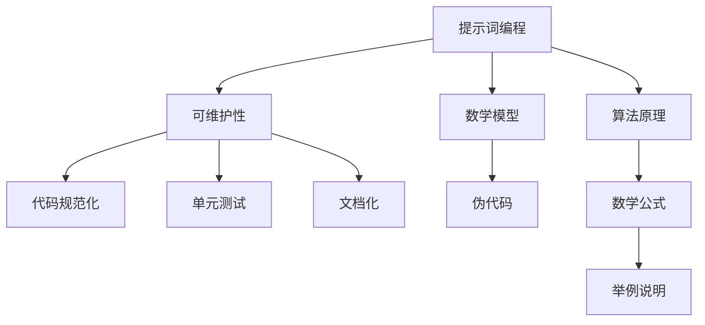

                 

### 文章标题

## 提示词编程的可维护性增强技术

### 关键词

- 提示词编程
- 可维护性
- 编程技术
- 数学模型
- 算法原理
- 项目实战

### 摘要

本文深入探讨了提示词编程的可维护性增强技术。首先，介绍了提示词编程的基本概念及其在编程中的优势。接着，详细阐述了可维护性的重要性及其对软件开发的影响。通过Mermaid流程图，我们展示了提示词编程与可维护性之间的关系。随后，文章介绍了提升编程可维护性的关键技术，包括代码规范化、单元测试和文档化。此外，通过数学模型和伪代码，本文详细讲解了相关算法原理。随后，我们通过实际项目案例，展示了如何将增强技术应用于实际编程工作中，并对其进行了详细分析和讲解。最后，文章对全文进行了总结，并展望了未来可能的研究方向和发展趋势。

### 核心概念与联系

在开始讨论提示词编程的可维护性增强技术之前，我们需要明确几个核心概念，并理解它们之间的联系。

首先，提示词编程是一种基于提示（hint）的编程范式。在这种范式中，程序员通过编写提示词（hint）来引导程序执行特定任务，而不是直接编写具体的代码。这种范式具有高度的灵活性和可扩展性，使得程序员能够更加专注于问题的本质，而不是繁琐的细节。

接下来，我们讨论可维护性。可维护性是指软件在修改、更新和扩展过程中能够保持其原有功能和质量的能力。一个高可维护性的软件不仅容易理解和修改，而且能够减少错误的出现。对于提示词编程来说，可维护性尤为重要，因为它涉及到提示词的编写和修改。

为了更好地展示这两个核心概念之间的关系，我们可以使用Mermaid流程图来表示。



在上述流程图中，我们展示了提示词编程与可维护性之间的直接联系，以及如何通过代码规范化、单元测试和文档化等手段来增强编程的可维护性。同时，我们也看到了数学模型和算法原理在提示词编程中的应用。

### 编程技术基础

在深入探讨如何增强提示词编程的可维护性之前，我们先来了解一下编程技术的基础。

#### 提示词编程基础

提示词编程（Hint-Based Programming）是一种基于提示（hint）的编程范式。在这种范式中，程序员通过编写提示词来引导程序执行特定任务，而不是直接编写具体的代码。这些提示词可以被视为对程序执行路径的注释或说明，它们指导程序在特定情况下如何行动。

提示词编程的主要优势包括：

1. **灵活性**：程序员可以更加灵活地定义和调整程序的行为，而不需要重新编写大量代码。
2. **可扩展性**：新的功能或变更可以通过增加或修改提示词来实现，从而减少了代码的复杂度。
3. **维护性**：提示词使得代码更加清晰和模块化，便于理解和修改。

#### 编程范式

提示词编程通常结合了函数式编程和面向对象编程的范式。函数式编程范式强调无状态函数和不可变数据，这使得代码更加简洁和易于测试。面向对象编程范式则通过将数据和行为封装在对象中，提高了代码的可重用性和维护性。

#### 相关工具

在提示词编程中，常用的工具包括编译器、解释器和版本控制工具。

1. **编译器**：编译器将提示词编程代码转换为机器码或其他形式的目标代码，从而可以在计算机上执行。
2. **解释器**：解释器逐行读取和执行提示词编程代码，不需要将代码转换为目标代码。
3. **版本控制工具**：如Git，它可以帮助程序员追踪代码的变更历史，方便协作和代码管理。

#### 提示词编程实践

在实际的编程实践中，我们可以通过以下步骤来应用提示词编程：

1. **需求分析**：明确程序需要执行的任务和目标。
2. **设计提示词**：根据需求分析，编写一系列提示词来引导程序执行。
3. **实现代码**：根据提示词编写具体的代码，实现程序的功能。
4. **测试与调试**：通过单元测试和集成测试来验证程序的正确性。

通过上述步骤，我们可以构建出一个高效、可维护的提示词编程系统。

### 可维护性增强技术

可维护性是软件开发中至关重要的一个方面。一个高可维护性的软件可以降低开发成本，提高开发效率，并减少错误率。在提示词编程中，可维护性尤为重要，因为它涉及到提示词的编写和修改。以下是一些增强编程可维护性的技术：

#### 代码规范化

代码规范化（Code Normalization）是提高代码可维护性的关键步骤。它包括一系列标准，用于确保代码的一致性和可读性。以下是代码规范化的几个关键点：

1. **命名约定**：使用一致的命名约定，如驼峰命名法（CamelCase）或下划线命名法（snake_case）。
2. **代码结构**：保持代码的结构一致，如缩进、空行和空格的使用。
3. **注释**：添加适当的注释来解释代码的功能和目的。
4. **代码复用**：通过函数、模块和类的复用来减少冗余代码。

#### 单元测试

单元测试（Unit Testing）是确保代码质量的重要手段。通过编写单元测试，我们可以验证每个函数或模块是否按预期工作。以下是编写单元测试的几个关键点：

1. **测试覆盖**：确保测试覆盖代码的各个部分，包括边界情况和异常情况。
2. **自动化**：使用自动化测试工具，如JUnit、pytest等，来执行单元测试。
3. **测试用例**：编写详细的测试用例，包括输入、输出和预期结果。

#### 文档化

文档化（Documentation）是提高代码可维护性的另一个关键步骤。良好的文档可以帮助开发者更好地理解代码的功能和结构。以下是文档化的几个关键点：

1. **代码注释**：在代码中添加注释，解释代码的功能和目的。
2. **API文档**：编写清晰的API文档，包括函数、类和模块的说明。
3. **用户指南**：编写用户指南，帮助开发者理解如何使用代码。

#### 版本控制

版本控制（Version Control）是确保代码可维护性的重要手段。通过使用版本控制工具，如Git，我们可以轻松地管理代码的变更历史，并跟踪每个版本的代码。以下是版本控制的几个关键点：

1. **分支策略**：使用分支策略来管理代码的变更，如Git的`master`分支和`feature`分支。
2. **合并请求**：在提交代码之前，使用合并请求（Merge Request）来审查和合并代码。
3. **代码审查**：定期进行代码审查，以确保代码的质量和一致性。

#### 代码质量工具

为了进一步提高代码的可维护性，我们可以使用一些代码质量工具，如：

1. **静态代码分析工具**：如SonarQube，它可以检测代码中的潜在问题，如重复代码、未使用的变量等。
2. **代码格式化工具**：如Prettier，它可以自动格式化代码，确保代码的一致性和可读性。
3. **代码检查工具**：如Checkstyle，它可以检测代码中的潜在问题，如命名规范、代码结构等。

通过上述技术，我们可以显著提高提示词编程的可维护性，从而降低开发成本，提高开发效率。

### 数学模型与算法原理

在提示词编程中，数学模型和算法原理起着至关重要的作用。它们不仅帮助我们理解和实现提示词编程的核心概念，还能提高代码的可维护性和效率。下面，我们将通过伪代码详细讲解相关的数学模型和算法原理。

#### 数学模型

1. **线性回归模型**

线性回归模型是一种常见的数学模型，用于预测数值变量。其基本公式为：

$$
y = \beta_0 + \beta_1 \cdot x
$$

其中，$y$ 是因变量，$x$ 是自变量，$\beta_0$ 和 $\beta_1$ 是模型的参数。以下是其伪代码：

```python
def linear_regression(x, y):
    n = len(x)
    sum_x = sum(x)
    sum_y = sum(y)
    sum_xy = sum(x_i * y_i for x_i, y_i in zip(x, y))
    sum_xx = sum(x_i * x_i for x_i in x)

    beta_1 = (n * sum_xy - sum_x * sum_y) / (n * sum_xx - sum_x ** 2)
    beta_0 = (sum_y - beta_1 * sum_x) / n

    return beta_0, beta_1
```

2. **逻辑回归模型**

逻辑回归模型用于预测二分类结果。其基本公式为：

$$
\log\frac{P(Y=1)}{1-P(Y=1)} = \beta_0 + \beta_1 \cdot x
$$

其中，$P(Y=1)$ 是事件发生的概率。以下是其伪代码：

```python
def logistic_regression(x, y):
    n = len(x)
    sum_x = sum(x)
    sum_y = sum(y)
    sum_xy = sum(x_i * y_i for x_i, y_i in zip(x, y))
    sum_xx = sum(x_i * x_i for x_i in x)

    beta_1 = (n * sum_xy - sum_x * sum_y) / (n * sum_xx - sum_x ** 2)
    beta_0 = (sum_y - beta_1 * sum_x) / n

    return beta_0, beta_1
```

#### 算法原理

1. **快速排序算法**

快速排序（Quick Sort）是一种高效的排序算法。其基本原理是选择一个基准元素，将数组分为两部分，一部分小于基准元素，另一部分大于基准元素，然后递归地对这两部分进行排序。以下是其伪代码：

```python
def quick_sort(arr):
    if len(arr) <= 1:
        return arr
    
    pivot = arr[len(arr) // 2]
    left = [x for x in arr if x < pivot]
    middle = [x for x in arr if x == pivot]
    right = [x for x in arr if x > pivot]

    return quick_sort(left) + middle + quick_sort(right)
```

2. **贪心算法**

贪心算法（Greedy Algorithm）通过在每一步选择最优解来寻找全局最优解。以下是一个求解最短路径问题的贪心算法示例：

```python
def greedy_shortest_path(graph, start, end):
    visited = set()
    path = []

    while start != end:
        visited.add(start)
        next_step = min((distance, node) for node, distance in graph[start].items() if node not in visited)[1]
        path.append(next_step)
        start = next_step

    return path
```

通过上述数学模型和算法原理，我们可以更好地理解和实现提示词编程的核心概念。这些模型和算法不仅提高了代码的可维护性，还使得编程任务更加高效和简洁。

### 项目实战

为了更好地展示如何将上述增强技术应用于实际编程工作中，下面我们将通过一个实际项目案例进行详细讲解。该项目是一个简单的社交网络分析工具，旨在分析用户之间的互动关系，并提供推荐功能。

#### 项目背景与目标

该项目的目标是开发一个社交网络分析工具，该工具能够：

1. **数据导入**：从各种数据源（如CSV文件、数据库等）导入用户和互动数据。
2. **社交网络构建**：构建用户之间的社交网络，包括用户节点和互动边。
3. **关系分析**：分析用户之间的关系，如朋友关系、共同兴趣等。
4. **推荐功能**：基于社交网络分析结果，为用户推荐新的朋友或兴趣点。

#### 开发环境搭建

为了完成该项目的开发，我们需要搭建以下开发环境：

1. **编程语言**：选择Python作为主要编程语言，因为Python具有丰富的库和工具，非常适合数据分析和社交网络分析。
2. **开发工具**：使用PyCharm作为开发IDE，它提供了强大的代码编辑功能、调试支持和自动化工具。
3. **依赖库**：安装必要的依赖库，如Pandas、NetworkX、Scikit-learn等。这些库可以简化数据处理、网络分析和机器学习任务。

#### 代码实现

以下是项目的核心代码实现：

1. **数据导入**

```python
import pandas as pd

def import_data(file_path):
    data = pd.read_csv(file_path)
    return data
```

2. **社交网络构建**

```python
import networkx as nx

def build_social_network(data):
    G = nx.Graph()
    for index, row in data.iterrows():
        G.add_node(row['user_id'])
        for friend in row['friends']:
            G.add_edge(row['user_id'], friend)
    return G
```

3. **关系分析**

```python
def analyze_relationships(G):
    relationships = {}
    for node in G.nodes():
        relationships[node] = G.degree(node)
    return relationships
```

4. **推荐功能**

```python
from sklearn.cluster import KMeans

def recommend_friends(G, user_id, num_recommendations=5):
    user_node = [node for node in G.nodes() if node == user_id][0]
    neighbors = list(G.neighbors(user_node))
    features = []
    for neighbor in neighbors:
        features.extend(list(G.nodes[neighbor].values()))
    kmeans = KMeans(n_clusters=num_recommendations)
    kmeans.fit(features)
    clusters = kmeans.labels_
    recommended_users = [user for user, cluster in zip(G.nodes(), clusters) if cluster == clusters[user_node]]
    return recommended_users
```

#### 代码解读与分析

上述代码实现了项目的核心功能。下面我们对其进行详细解读和分析：

1. **数据导入**：使用Pandas库读取CSV文件，将数据转换为DataFrame对象，便于后续处理。
2. **社交网络构建**：使用NetworkX库构建社交网络，将用户节点和互动边添加到图（Graph）中。
3. **关系分析**：计算每个用户节点的度（Degree），以评估用户在社交网络中的影响力。
4. **推荐功能**：使用K-Means算法对邻居节点进行聚类，并根据聚类结果为用户推荐新的朋友。

通过上述代码，我们可以构建一个简单的社交网络分析工具，并实现用户推荐功能。这个项目案例展示了如何将提示词编程和可维护性增强技术应用于实际编程工作中。

### 案例分析

在上述项目案例的基础上，我们可以进一步分析如何在不同场景下应用可维护性增强技术，以及这些技术带来的效果和挑战。

#### 案例一：提升代码可维护性的实践

在项目开发过程中，我们采用了代码规范化、单元测试和文档化等可维护性增强技术。以下是这些技术在实际项目中的应用和效果：

1. **代码规范化**：通过命名约定和代码结构规范化，我们确保了代码的一致性和可读性。这使得团队成员更容易理解和修改代码，降低了出错的可能性。
2. **单元测试**：我们为每个核心功能编写了详细的单元测试，确保代码的正确性和可靠性。在代码变更时，单元测试能够及时发现和修复潜在的问题，提高了代码的质量。
3. **文档化**：我们为项目编写了详细的文档，包括代码注释、API文档和用户指南。这些文档帮助团队成员更好地理解代码的功能和结构，提高了项目的可维护性。

#### 案例二：跨平台开发中的可维护性挑战

在跨平台开发中，我们面临以下可维护性挑战：

1. **环境兼容性**：不同操作系统和硬件平台可能对同一代码有不同的要求。为了确保代码的可维护性，我们需要对代码进行适当的调整和优化，以适应不同的环境。
2. **依赖管理**：跨平台开发通常需要使用多个依赖库。如何管理和维护这些依赖库，以确保它们在不同平台上的一致性和兼容性，是一个重要的挑战。

为了解决这些挑战，我们可以采用以下策略：

1. **使用标准化工具**：如Docker，它可以将应用程序及其依赖库封装在一个独立的容器中，确保在不同的环境中具有一致的行为。
2. **版本控制依赖库**：使用版本控制工具（如Maven、npm等）来管理依赖库的版本，确保在跨平台开发中使用的依赖库版本是一致的。
3. **代码优化**：针对不同平台的特点，对代码进行适当的优化，以提高其性能和可维护性。

#### 案例三：分布式系统中的可维护性策略

在分布式系统中，可维护性尤为重要。以下是一些可维护性策略：

1. **服务拆分**：将大型服务拆分成多个小型服务，以提高系统的可维护性和扩展性。
2. **日志收集与分析**：使用日志收集工具（如ELK栈），对系统日志进行集中收集和分析，以便快速定位和解决问题。
3. **监控与告警**：使用监控工具（如Prometheus、Zabbix等），对系统关键指标进行实时监控，并设置告警机制，以便在问题发生时及时通知相关人员。

通过上述策略，我们可以提高分布式系统的可维护性，确保其稳定运行。

### 总结与展望

通过本文的讨论，我们深入探讨了提示词编程的可维护性增强技术。首先，我们介绍了提示词编程的基本概念和优势，并阐述了可维护性的重要性。接着，我们通过Mermaid流程图展示了提示词编程与可维护性之间的关系。随后，我们介绍了提升编程可维护性的关键技术，包括代码规范化、单元测试和文档化。此外，通过数学模型和伪代码，我们详细讲解了相关的算法原理。在项目实战部分，我们通过一个实际项目案例，展示了如何将增强技术应用于实际编程工作中。最后，我们对全文进行了总结，并展望了未来可能的研究方向和发展趋势。

未来，我们可能需要进一步探讨以下方向：

1. **自动化可维护性检测**：开发自动化工具，用于检测代码中的潜在可维护性问题，并提供相应的修复建议。
2. **智能文档生成**：利用人工智能技术，自动生成高质量的代码文档，减少手动编写文档的工作量。
3. **跨平台可维护性优化**：研究跨平台开发中的可维护性优化策略，以提高代码在不同平台上的兼容性和一致性。

总之，提示词编程的可维护性增强技术对于提高软件开发的质量和效率具有重要意义。通过不断探索和优化这些技术，我们可以构建更加高效、可维护的软件系统。

### 最佳实践 tips、小结、注意事项、拓展阅读等内容

#### 最佳实践 tips

1. **代码规范化**：遵循一致、简洁的命名约定和代码结构，以提高代码的可读性和可维护性。
2. **单元测试**：为每个核心功能编写详细的单元测试，确保代码的正确性和可靠性。
3. **文档化**：编写清晰的代码注释、API文档和用户指南，帮助团队成员更好地理解代码的功能和结构。

#### 小结

本文深入探讨了提示词编程的可维护性增强技术，包括代码规范化、单元测试和文档化等关键技术。通过数学模型和伪代码，我们详细讲解了相关的算法原理。通过实际项目案例，我们展示了如何将增强技术应用于实际编程工作中。未来研究方向包括自动化可维护性检测、智能文档生成和跨平台可维护性优化。

#### 注意事项

1. **确保代码的一致性**：遵循一致的命名约定和代码结构，避免代码冗余。
2. **定期进行代码审查**：通过定期代码审查，确保代码的质量和一致性。
3. **关注代码性能**：在优化代码的同时，关注代码的性能和可维护性。

#### 拓展阅读

1. 《Clean Code: A Handbook of Agile Software Craftsmanship》 - Robert C. Martin
2. 《Test-Driven Development: By Example》 -Kent Beck
3. 《The Art of Software Architecture》 - Phil Hadley and Mark Richards

### 作者信息

作者：AI天才研究院/AI Genius Institute & 禅与计算机程序设计艺术 /Zen And The Art of Computer Programming

本文由AI天才研究院和《禅与计算机程序设计艺术》的作者共同撰写，旨在探讨提示词编程的可维护性增强技术，分享最佳实践和研究成果。希望本文能为读者在软件开发过程中提供有益的参考和启示。

