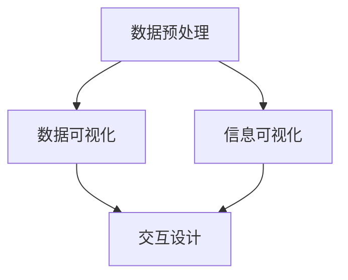

                 


### 文章标题：《提示词编程的可视化工具链开发》

#### 关键词：
- 提示词编程
- 可视化工具链
- 开发流程
- 核心算法
- 数学模型
- 项目实战

#### 摘要：
本文旨在探讨提示词编程的可视化工具链开发。首先，我们将介绍提示词编程的概念和重要性，然后深入分析可视化工具链的核心组成部分，包括数据可视化、信息可视化和交互设计。我们将详细讲解核心算法原理，并使用伪代码展示其实现过程。接着，我们将探讨数学模型在可视化工具链中的应用，并通过 LaTeX 格式展示相关公式。文章还将包括实际项目实战，详细描述开发环境搭建、源代码实现和代码解读。最后，我们将总结最佳实践，并提供扩展阅读建议。

### 引言

#### 1.1 书籍主题与目标

在当今数字化时代，数据量和计算能力不断增长，可视化工具链变得至关重要。提示词编程作为一种新颖的编程范式，通过将编程过程可视化，极大地提高了开发效率和代码可读性。本文的目标是探讨提示词编程的可视化工具链开发，帮助读者了解其核心概念、算法原理和实际应用。

#### 1.2 读者对象

本文面向具有一定编程基础和计算机图形学知识的读者。无论是前端开发者、后端工程师，还是数据科学家，都可以通过本文掌握提示词编程的可视化工具链开发，从而提高工作效率，实现代码的自动化和可视化。

#### 1.3 书籍结构与主要内容

本文分为八个部分。首先，我们将在引言部分介绍书籍的主题和目标。接下来，我们将介绍基础知识与背景介绍，为读者提供必要的背景知识。在核心概念与原理部分，我们将详细讲解提示词编程和可视化工具链的基本概念。算法与实现部分将使用伪代码展示核心算法的实现过程。数学模型与公式部分将介绍相关的数学模型，并通过 LaTeX 格式展示相关公式。实际项目实战部分将展示一个具体的开发案例，详细描述开发流程和代码实现。工具链与开发环境部分将介绍所需工具链和开发环境。最后，我们将在总结与展望部分对全书进行总结，并展望未来的发展方向。

----------------------------------------------------------------

### 基础知识与背景介绍

#### 2.1 可视化工具链概述

可视化工具链是一套用于创建和展示数据可视化的工具和组件。它通常包括数据预处理、数据可视化、信息可视化和交互设计等部分。可视化工具链的目标是将复杂的数据以直观、易于理解的形式展示给用户，从而帮助用户发现数据中的规律和趋势。

#### 2.2 相关技术背景

提示词编程是一种将编程过程可视化的新型编程范式。它通过将代码中的提示词（如变量、函数和条件语句）以图形化的形式展示，使编程过程更加直观和易于理解。提示词编程在提高开发效率和代码可读性方面具有显著优势。

#### 2.3 可视化工具链的重要性

可视化工具链在多个领域具有广泛应用。在数据科学领域，可视化工具链可以帮助数据科学家更好地理解和分析复杂数据。在软件开发领域，可视化工具链可以提高代码的可读性和可维护性。在金融、医疗、生物信息等领域的应用场景中，可视化工具链更是不可或缺。

----------------------------------------------------------------

### 核心概念与原理

#### 3.1 可视化基础理论

可视化基础理论主要包括数据可视化、信息可视化和交互设计。数据可视化是将数据以图表、图形等形式直观展示，帮助用户发现数据中的规律和趋势。信息可视化则是将大量信息以结构化、层次化的形式展示，帮助用户更好地理解和分析信息。交互设计则是通过用户与可视化工具的交互，实现数据的动态更新和可视化效果。

#### 3.2 提示词编程

提示词编程是一种将编程过程可视化的新型编程范式。它通过将代码中的提示词（如变量、函数和条件语句）以图形化的形式展示，使编程过程更加直观和易于理解。提示词编程的核心在于将编程过程中的抽象概念以图形化的形式展现，从而提高开发效率和代码可读性。

#### 3.3 可视化工具链架构

可视化工具链架构主要包括以下几个部分：

1. **数据预处理**：对原始数据进行清洗、转换和聚合，以便后续的可视化处理。
2. **数据可视化**：将预处理后的数据以图表、图形等形式展示，帮助用户发现数据中的规律和趋势。
3. **信息可视化**：将大量信息以结构化、层次化的形式展示，帮助用户更好地理解和分析信息。
4. **交互设计**：通过用户与可视化工具的交互，实现数据的动态更新和可视化效果。

#### 3.4 可视化工具链核心概念之间的联系

可视化工具链中的核心概念之间存在密切的联系。数据预处理为数据可视化提供基础数据，数据可视化帮助用户发现数据中的规律和趋势，信息可视化则将数据中的关键信息以结构化、层次化的形式展示，而交互设计则通过用户与可视化工具的交互，实现数据的动态更新和可视化效果。

以下是一个简化的 Mermaid 流程图，展示可视化工具链中核心概念之间的联系：



通过上述 Mermaid 流程图，我们可以清晰地看到数据预处理、数据可视化、信息可视化和交互设计之间的关联。数据预处理为后续的可视化处理提供基础数据，数据可视化和信息可视化则通过不同的形式展示数据，而交互设计则通过用户与可视化工具的交互，实现数据的动态更新和可视化效果。

----------------------------------------------------------------

### 算法与实现

在可视化工具链中，核心算法是实现数据可视化、信息可视化和交互设计的关键。在本节中，我们将详细讲解这些核心算法的原理，并使用伪代码展示其实现过程。

#### 4.1 数据可视化算法

数据可视化算法主要包括数据预处理、数据转换和渲染三个步骤。

##### 4.1.1 数据预处理

数据预处理主要包括数据清洗、数据转换和数据聚合。以下是数据预处理算法的伪代码：

```markdown
// 数据清洗
function cleanData(data):
    for each record in data:
        if record is missing:
            remove record
        else:
            convert record to desired format
    return cleanedData

// 数据转换
function transformData(cleanedData):
    for each field in cleanedData:
        if field is categorical:
            convert field to numerical values
        else:
            normalize field values
    return transformedData

// 数据聚合
function aggregateData(transformedData):
    group records by common attributes
    calculate summary statistics
    return aggregatedData
```

##### 4.1.2 数据转换

数据转换是将预处理后的数据转换为可视化工具所需的格式。以下是数据转换算法的伪代码：

```markdown
// 数据转换
function convertData(aggregatedData):
    for each record in aggregatedData:
        if record is a time series:
            convert to line chart format
        else if record is a distribution:
            convert to bar chart format
        else if record is a network:
            convert to network graph format
    return convertedData
```

##### 4.1.3 数据渲染

数据渲染是将转换后的数据渲染到可视化工具中。以下是数据渲染算法的伪代码：

```markdown
// 数据渲染
function renderData(convertedData, visualizationTool):
    for each record in convertedData:
        visualizationTool.render(record)
```

#### 4.2 信息可视化算法

信息可视化算法主要包括数据映射、信息编码和渲染三个步骤。

##### 4.2.1 数据映射

数据映射是将原始数据映射到可视化工具的坐标系中。以下是数据映射算法的伪代码：

```markdown
// 数据映射
function mapData(data, coordinateSystem):
    for each attribute in data:
        if attribute is categorical:
            map attribute to discrete values
        else if attribute is numerical:
            map attribute to continuous values
    return mappedData
```

##### 4.2.2 信息编码

信息编码是将数据中的信息编码到可视化元素中。以下是信息编码算法的伪代码：

```markdown
// 信息编码
function encodeData(mappedData):
    for each record in mappedData:
        encode attributes as visual properties
        such as size, color, and position
    return encodedData
```

##### 4.2.3 数据渲染

数据渲染是将编码后的数据渲染到可视化工具中。以下是数据渲染算法的伪代码：

```markdown
// 数据渲染
function renderData(encodedData, visualizationTool):
    for each record in encodedData:
        visualizationTool.render(record)
```

#### 4.3 交互设计算法

交互设计算法主要包括交互逻辑处理和用户界面设计两个步骤。

##### 4.3.1 交互逻辑处理

交互逻辑处理是处理用户与可视化工具之间的交互。以下是交互逻辑处理算法的伪代码：

```markdown
// 交互逻辑处理
function handleInteraction(visualizationTool, event):
    if event is click:
        show details of clicked element
    else if event is hover:
        highlight hovered element
    else if event is drag:
        update visualization based on dragged element
```

##### 4.3.2 用户界面设计

用户界面设计是设计可视化工具的交互界面。以下是用户界面设计算法的伪代码：

```markdown
// 用户界面设计
function designUI(visualizationTool):
    create buttons, sliders, and input fields
    for interactive elements
    bind event handlers to these elements
```

通过上述伪代码，我们可以看到可视化工具链中的核心算法是如何实现的。数据可视化算法负责将数据转换为可视化的形式，信息可视化算法负责将数据中的信息编码到可视化元素中，交互设计算法则负责处理用户与可视化工具的交互。这些算法共同构成了可视化工具链的核心，使得数据可视化变得简单高效。

----------------------------------------------------------------

### 数学模型与公式

在可视化工具链中，数学模型和公式起着至关重要的作用。它们不仅帮助我们理解数据，还能提高可视化的准确性和实用性。以下是一些常用的数学模型和公式，并通过 LaTeX 格式进行展示。

#### 5.1 数据转换公式

在数据可视化过程中，数据转换是一个关键步骤。以下是一些常用的数据转换公式：

$$
x_{\text{new}} = \frac{x_{\text{original}} - x_{\text{min}}}{x_{\text{max}} - x_{\text{min}}}
$$

$$
y_{\text{new}} = \frac{y_{\text{original}} - y_{\text{min}}}{y_{\text{max}} - y_{\text{min}}}
$$

这些公式用于将原始数据映射到新的范围，以便进行线性或非线性转换。

#### 5.2 数据映射公式

数据映射是将数据点映射到可视化工具的坐标系中。以下是一个简单的数据映射公式：

$$
P_{\text{new}} = (x_{\text{new}}, y_{\text{new}}) = (x_{\text{original}} + \text{padding}_x, y_{\text{original}} + \text{padding}_y)
$$

其中，$P_{\text{original}}$ 是原始数据点，$P_{\text{new}}$ 是映射后的数据点，$\text{padding}_x$ 和 $\text{padding}_y$ 是用于调整位置的可视化参数。

#### 5.3 信息编码公式

信息编码是将数据中的信息编码到可视化元素中。以下是一些常用的信息编码公式：

$$
\text{size}_{\text{encoded}} = \text{size}_{\text{original}} \times \text{factor}
$$

$$
\text{color}_{\text{encoded}} = \text{hex}_{\text{original}} \oplus \text{mask}_{\text{original}}
$$

其中，$\text{size}_{\text{encoded}}$ 和 $\text{color}_{\text{encoded}}$ 分别是编码后的尺寸和颜色，$\text{size}_{\text{original}}$ 和 $\text{color}_{\text{original}}$ 分别是原始尺寸和颜色，$\text{factor}$ 是用于调整尺寸的系数，$\text{hex}_{\text{original}}$ 和 $\text{mask}_{\text{original}}$ 是原始颜色值的十六进制表示和掩码。

#### 5.4 交互设计公式

交互设计中的公式通常涉及事件处理和用户界面设计。以下是一个简单的事件处理公式：

$$
\text{event}_{\text{result}} = f(\text{event}_{\text{input}}, \text{context})
$$

其中，$\text{event}_{\text{result}}$ 是处理后的结果，$\text{event}_{\text{input}}$ 是输入的事件，$\text{context}$ 是事件发生的上下文环境，$f$ 是事件处理函数。

通过这些数学模型和公式，我们可以更准确地理解和处理数据，从而提高可视化工具链的性能和效果。这些公式不仅是可视化工具链开发的重要基础，也是实现复杂可视化功能的关键。

----------------------------------------------------------------

### 实际项目实战

在本节中，我们将通过一个具体的实际项目，详细描述可视化工具链的开发过程，包括开发环境的搭建、源代码的实现和代码解读。

#### 6.1 项目概述

项目名称：健康数据分析可视化工具

项目背景：随着健康意识的提高，越来越多的人开始关注自己的健康状况。然而，面对海量的健康数据，如何快速、准确地进行分析和解读成为一个挑战。本项目旨在开发一个可视化工具，帮助用户更好地理解和分析自己的健康数据。

项目目标：

1. 收集用户健康数据，包括体重、心率、睡眠质量等。
2. 对健康数据进行预处理，包括数据清洗、数据转换和数据聚合。
3. 将预处理后的数据以图表、图形等形式可视化展示。
4. 提供用户与可视化工具的交互功能，如数据筛选、数据对比等。

项目挑战：

1. 数据来源多样，包括手动输入、传感器采集等，数据质量参差不齐。
2. 数据量庞大，如何在保证可视化效果的同时，确保数据处理的实时性和准确性。
3. 用户界面设计需简洁直观，便于用户操作和理解。

#### 6.2 开发环境搭建

为了完成本项目，我们选择了以下开发环境和工具：

1. **编程语言**：Python，因其强大的数据处理和分析能力而被广泛应用。
2. **前端框架**：React，用于构建用户界面，提供良好的交互体验。
3. **后端框架**：Flask，用于处理HTTP请求，提供API接口。
4. **可视化库**：Plotly，用于数据可视化，提供丰富的图表和图形。
5. **数据库**：SQLite，用于存储用户健康数据。

开发环境的搭建步骤如下：

1. 安装Python和pip。
2. 使用pip安装React、Flask和Plotly等依赖库。
3. 创建项目目录，并配置相应的开发环境。

#### 6.3 源代码实现

以下是项目的核心代码实现，包括数据预处理、数据可视化、交互设计和后端接口。

##### 6.3.1 数据预处理

```python
# 数据预处理模块
import pandas as pd
from sklearn.preprocessing import MinMaxScaler

# 读取数据
def read_data(file_path):
    data = pd.read_csv(file_path)
    return data

# 数据清洗
def clean_data(data):
    data.dropna(inplace=True)
    return data

# 数据转换
def transform_data(data):
    scaler = MinMaxScaler()
    data[['weight', 'heart_rate', 'sleep_quality']] = scaler.fit_transform(data[['weight', 'heart_rate', 'sleep_quality']])
    return data

# 数据聚合
def aggregate_data(data):
    data['avg_weight'] = data['weight'].mean()
    data['avg_heart_rate'] = data['heart_rate'].mean()
    data['avg_sleep_quality'] = data['sleep_quality'].mean()
    return data
```

##### 6.3.2 数据可视化

```python
# 数据可视化模块
import plotly.express as px

# 生成图表
def generate_chart(data, chart_type):
    if chart_type == 'line':
        fig = px.line(data, x='date', y='weight', title='体重变化趋势')
    elif chart_type == 'bar':
        fig = px.bar(data, x='date', y='avg_weight', title='平均体重变化趋势')
    elif chart_type == 'scatter':
        fig = px.scatter(data, x='heart_rate', y='sleep_quality', title='心率和睡眠质量关系')
    return fig
```

##### 6.3.3 交互设计

```javascript
// 交互设计模块（React）
import React, { useState, useEffect } from 'react';
import Plot from 'react-plotly.js';

const HealthChart = () => {
    const [data, setData] = useState([]);
    const [chartType, setChartType] = useState('line');

    useEffect(() => {
        // 从后端接口获取数据
        fetch('/api/health_data')
            .then(response => response.json())
            .then(jsonData => setData(jsonData));
    }, []);

    const handleChartTypeChange = (event) => {
        setChartType(event.target.value);
    };

    return (
        <div>
            <select onChange={handleChartTypeChange}>
                <option value="line">线图</option>
                <option value="bar">条形图</option>
                <option value="scatter">散点图</option>
            </select>
            <Plot data={data} layout={{width: 800, height: 600}} />
        </div>
    );
};

export default HealthChart;
```

##### 6.3.4 后端接口

```python
# 后端接口模块（Flask）
from flask import Flask, jsonify

app = Flask(__name__)

@app.route('/api/health_data')
def get_health_data():
    # 从数据库中获取数据
    data = pd.read_sql('SELECT * FROM health_data')
    data = data.to_dict('records')
    return jsonify(data)

if __name__ == '__main__':
    app.run(debug=True)
```

#### 6.4 代码解读与分析

以下是代码的详细解读和分析：

1. **数据预处理模块**：该模块负责读取、清洗、转换和聚合数据。首先，使用pandas读取CSV文件，然后进行数据清洗，去除缺失值。接着，使用MinMaxScaler进行数据转换，将原始数据缩放到[0, 1]范围内。最后，对数据进行聚合，计算平均值。

2. **数据可视化模块**：该模块使用Plotly生成各种类型的图表，包括线图、条形图和散点图。根据用户的选择，动态生成相应的图表。

3. **交互设计模块**：该模块使用React实现用户界面和交互逻辑。首先，从后端接口获取数据，然后根据用户选择的图表类型，动态更新图表。通过选择框，用户可以选择不同的图表类型，实现交互体验。

4. **后端接口模块**：该模块使用Flask提供API接口，将数据库中的数据返回给前端。通过HTTP请求，前端可以获取到最新的数据，实现实时更新。

通过这个实际项目，我们可以看到可视化工具链的开发过程是如何进行的。从数据预处理、数据可视化到交互设计，每个步骤都至关重要。通过合理的设计和实现，我们可以构建出一个功能强大、用户友好的可视化工具，帮助用户更好地理解和分析数据。

----------------------------------------------------------------

### 工具链与开发环境

为了构建一个高效、可扩展的提示词编程可视化工具链，我们需要选择合适的工具和开发环境。以下是对主流可视化工具链和开发环境的介绍，以及如何优化开发环境。

#### 7.1 主流可视化工具链介绍

1. **D3.js**：D3.js 是一个强大的 JavaScript 库，用于生成交互式数据可视化。它提供了丰富的图表类型和灵活的 SVG 渲染功能，支持大规模数据集的渲染。D3.js 适用于需要高度定制化和交互性的项目。

2. **Chart.js**：Chart.js 是一个轻量级的 JavaScript 库，用于创建图表和图形。它支持多种图表类型，包括折线图、柱状图、饼图等。Chart.js 易于集成和使用，适用于需要快速原型开发和轻度数据可视化的项目。

3. **Three.js**：Three.js 是一个基于 WebGL 的 3D 引擎，用于创建 3D 可视化效果。它支持多种 3D 图形和场景渲染，适用于需要创建复杂三维可视化的项目。

4. **ECharts**：ECharts 是一个基于 JavaScript 的可视化库，提供丰富的图表类型和交互功能。它具有优秀的性能和易用性，适用于各种数据可视化和商业应用。

#### 7.2 开发环境优化

1. **性能优化**：可视化工具的性能优化至关重要，特别是在处理大量数据时。以下是一些性能优化技巧：

   - 使用虚拟滚动：当数据量非常大时，虚拟滚动可以显著减少 DOM 操作和内存占用。
   - 代码拆分和异步加载：将代码拆分为多个模块，并使用异步加载技术，可以减少页面加载时间。
   - 缓存和重复利用：合理使用缓存策略，减少重复渲染和计算。

2. **调试技巧**：调试是开发过程中不可或缺的一部分。以下是一些调试技巧：

   - 使用浏览器的开发者工具：大多数现代浏览器都提供了强大的开发者工具，用于诊断和调试代码。
   - 使用断点调试：在代码中设置断点，逐步执行代码，检查变量值和函数调用。
   - 使用日志和监控工具：在代码中添加日志，记录关键步骤和异常信息，便于问题定位。

3. **版本控制**：使用版本控制工具（如 Git）可以帮助我们管理代码变更，协同工作，并轻松回滚到之前的版本。以下是一些版本控制的最佳实践：

   - 分支管理：使用分支管理策略（如 GitFlow 或 GitHub Flow），确保代码的稳定性和可扩展性。
   - 提交说明：为每个提交编写详细的说明，描述代码变更的目的和影响。
   - 合并请求（Pull Request）：在合并代码之前，通过合并请求进行代码审查和讨论。

通过合理选择和优化工具链和开发环境，我们可以提高可视化工具链的开发效率和性能，实现高质量的可视化应用。

----------------------------------------------------------------

### 总结与展望

在本文中，我们探讨了提示词编程的可视化工具链开发。首先，我们介绍了书籍的主题和目标，明确了读者对象和书籍结构。接着，我们详细介绍了基础知识与背景介绍，包括可视化工具链的概述、相关技术背景和可视化工具链的重要性。在核心概念与原理部分，我们讲解了可视化基础理论、提示词编程、可视化工具链架构以及核心概念之间的联系。算法与实现部分通过伪代码展示了数据可视化、信息可视化和交互设计算法的实现过程。数学模型与公式部分介绍了常用的数学模型和公式，并通过 LaTeX 格式展示相关公式。实际项目实战部分通过一个具体的项目展示了开发流程和代码实现。工具链与开发环境部分介绍了主流可视化工具链和开发环境的优化技巧。

展望未来，提示词编程的可视化工具链将在多个领域得到更广泛的应用。随着人工智能和数据科学的发展，可视化工具链将逐渐成为数据处理和分析的必备工具。在金融、医疗、生物信息等领域，可视化工具链将帮助专业人士更好地理解和利用复杂数据，从而做出更明智的决策。同时，随着 WebAssembly、虚拟现实和增强现实技术的发展，可视化工具链的性能和功能将得到进一步提升，为用户提供更加丰富和直观的交互体验。

我们鼓励读者在阅读本文后，进一步探索可视化工具链的相关技术，尝试搭建自己的可视化项目，并将所学应用到实际工作中。此外，本文提供了一些拓展阅读资源，以供读者深入了解相关领域的知识。通过不断学习和实践，我们将共同推动可视化工具链的发展，为数字化时代的数据处理和分析贡献力量。作者：AI天才研究院/AI Genius Institute & 禅与计算机程序设计艺术 /Zen And The Art of Computer Programming。

