                 


### 第1章 引言

> **1.1 提示词编程的概念**

提示词编程（Prompt-Based Programming）是一种新兴的编程范式，它通过提示词（Prompts）来引导计算机执行特定的任务。与传统的命令式编程不同，提示词编程更注重用户交互和任务引导。在提示词编程中，用户通过输入提示词来描述自己的需求，系统则根据这些提示词来生成相应的代码或执行任务。例如，用户可以输入“绘制一个饼图”，系统则自动生成相应的饼图代码。

**核心概念与联系：**

提示词编程的核心概念包括：

- **提示词（Prompts）**：用于描述用户需求的文本或指令。
- **解析器（Parser）**：负责将提示词转换为可执行的代码。
- **生成器（Generator）**：根据解析结果生成相应的代码或执行任务。
- **用户交互（User Interaction）**：用户通过提示词与系统进行交互，描述需求。

以下是提示词编程的基本流程Mermaid流程图：

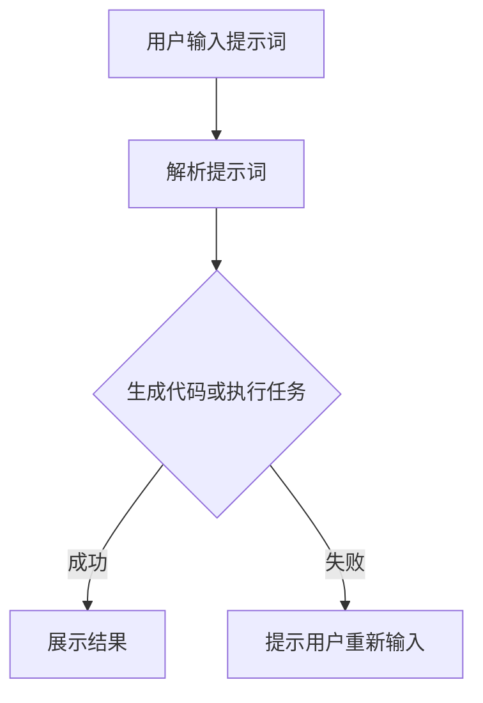

> **1.2 可视化工具的重要性**

可视化工具在数据处理和程序开发中起着至关重要的作用。它们能够将复杂的数据和信息以直观、易于理解的方式展示出来，从而帮助开发者更好地理解问题，优化代码，提高开发效率。对于提示词编程来说，可视化工具尤为重要，因为它们可以帮助开发者直观地看到提示词被解析和执行后的结果，从而更好地理解和改进代码。

**核心概念与联系：**

- **数据可视化（Data Visualization）**：将数据以图形、图表等形式展示。
- **交互式可视化（Interactive Visualization）**：用户可以通过与可视化组件的交互来动态地探索数据。
- **编程可视化（Programming Visualization）**：通过可视化方式展示程序运行的过程和结果。

以下是编程可视化工具在提示词编程中的应用Mermaid流程图：

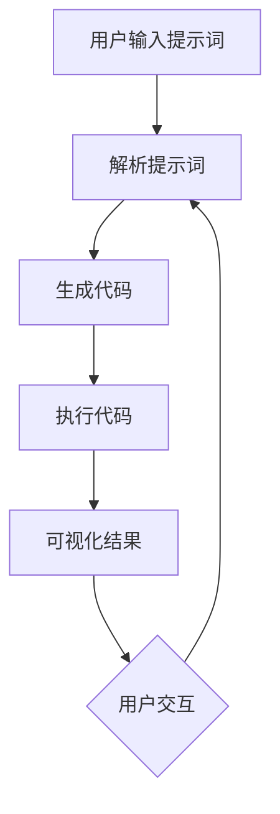

> **1.3 目标与读者群体**

本文的目标是介绍提示词编程的可视化工具，帮助开发者降低使用门槛，提高开发效率。本文适合以下读者群体：

- **初学者**：对提示词编程和可视化工具有一定了解，但缺乏实际操作经验。
- **中级开发者**：已经具备一定的编程技能，希望进一步提升开发效率。
- **高级开发者**：对提示词编程和可视化工具有深入理解，希望了解最新的技术和应用。

**小结**：

提示词编程是一种新兴的编程范式，通过提示词来描述用户需求，系统则自动生成相应的代码或执行任务。可视化工具在数据处理和程序开发中至关重要，能够帮助开发者更好地理解问题，优化代码，提高开发效率。本文的目标是介绍提示词编程的可视化工具，帮助开发者降低使用门槛，提高开发效率。

## 第2章 基础知识

### 2.1 编程基础

编程是计算机科学的核心，是构建软件和应用程序的基础。在这一节中，我们将介绍一些编程的基础知识，包括计算机基础知识、编程语言入门和常用数据结构与算法。

#### 2.1.1 计算机基础知识

计算机是由硬件和软件组成的复杂系统。硬件包括中央处理器（CPU）、内存、存储设备等，而软件则是运行在计算机上的程序和数据。

**核心概念与联系：**

- **CPU（中央处理器）**：计算机的核心，负责执行指令。
- **内存（Memory）**：临时存储数据和指令。
- **存储设备（Storage）**：如硬盘、固态硬盘等，用于长期存储数据和程序。

以下是计算机基础知识的Mermaid流程图：

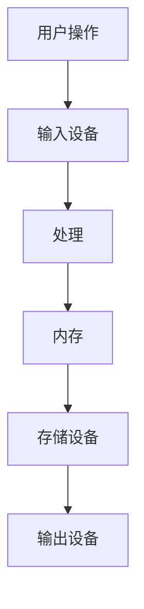

#### 2.1.2 编程语言入门

编程语言是人与计算机之间沟通的桥梁。常见的编程语言包括Python、Java、C++等。

**核心概念与联系：**

- **语法（Syntax）**：编程语言的规则和结构。
- **变量（Variable）**：用于存储数据的容器。
- **函数（Function）**：用于执行特定任务的代码块。

以下是Python编程语言的基本语法Mermaid流程图：

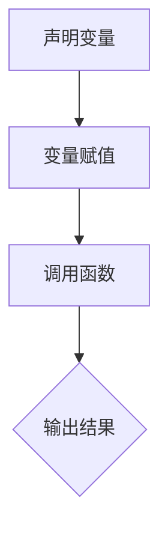

#### 2.1.3 常用数据结构与算法

数据结构是组织和存储数据的方式，而算法是解决问题的步骤和方法。常见的数据结构包括数组、链表、栈、队列、树、图等。

**核心概念与联系：**

- **数组（Array）**：一种线性数据结构，用于存储一系列元素。
- **链表（Linked List）**：由一系列节点组成，每个节点包含数据和指向下一个节点的指针。
- **栈（Stack）**：一种后进先出（LIFO）的数据结构。
- **队列（Queue）**：一种先进先出（FIFO）的数据结构。

以下是数组的基本操作伪代码：

```python
# 初始化数组
arr = [1, 2, 3, 4, 5]

# 添加元素
arr.append(6)

# 删除元素
arr.pop()

# 查找元素
index = arr.index(3)

# 排序
arr.sort()
```

**数学模型和公式 & 详细讲解 & 举例说明**

假设我们有一个包含5个元素的数组arr = [1, 2, 3, 4, 5]，我们需要对其进行排序。以下是使用冒泡排序算法的伪代码：

```python
# 冒泡排序算法
for i in range(len(arr)):
    for j in range(len(arr) - i - 1):
        if arr[j] > arr[j + 1]:
            arr[j], arr[j + 1] = arr[j + 1], arr[j]
```

举例说明：

假设我们有一个未排序的数组arr = [5, 2, 4, 1, 3]，经过冒泡排序后，数组变为arr = [1, 2, 3, 4, 5]。

$$
\text{初始状态：} \quad \{5, 2, 4, 1, 3\} \\
\text{第一轮排序：} \quad \{2, 1, 4, 3, 5\} \\
\text{第二轮排序：} \quad \{1, 2, 3, 4, 5\}
$$

**小结**

在计算机编程中，理解计算机基础知识、编程语言入门以及常用数据结构与算法是非常重要的。这些基础知识将为我们后续的学习和实践打下坚实的基础。

## 第3章 可视化工具概述

### 3.1 可视化工具的分类

可视化工具在数据处理和程序开发中发挥着重要作用。根据不同的应用场景和功能，可视化工具可以分为以下几类：

#### 3.1.1 通用可视化工具

通用可视化工具适用于各种类型的数据和场景，具有广泛的适用性和灵活性。常见的通用可视化工具有：

- **D3.js**：一种基于Web的动态数据可视化库，支持多种图表类型和数据绑定。
- **Plotly**：一种跨平台的交互式图表库，支持多种数据可视化类型和交互功能。
- **Tableau**：一种商业智能工具，提供丰富的图表和数据可视化功能，适用于企业级应用。

**核心概念与联系：**

- **动态数据绑定**：数据与图表之间的实时关联。
- **交互性**：用户可以通过交互操作来探索数据。

以下是D3.js的基本使用流程：

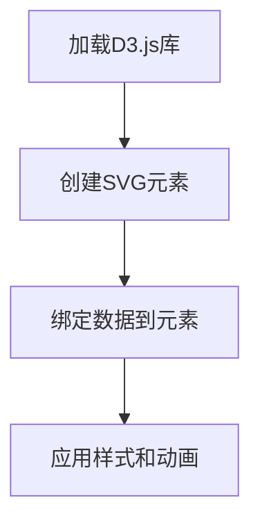

#### 3.1.2 行业专用可视化工具

行业专用可视化工具针对特定行业或领域进行优化，提供丰富的专业功能。常见的行业专用可视化工具有：

- **Gephi**：一种开源的网络可视化工具，适用于社交网络分析和复杂网络可视化。
- **Matplotlib**：一种Python可视化库，适用于科学计算和数据分析。
- **QlikView**：一种企业级数据分析工具，提供强大的数据探索和分析功能。

**核心概念与联系：**

- **专业功能**：针对特定行业或领域的定制化功能。
- **数据集成**：与各种数据源和系统的集成能力。

以下是Gephi的基本使用流程：

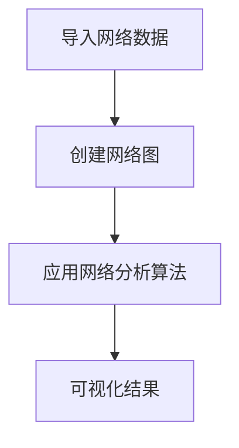

#### 3.1.3 开源可视化工具

开源可视化工具具有成本效益高、可定制性强、社区支持广泛等特点。常见的开源可视化工具有：

- **ECharts**：一种基于JavaScript的开源可视化库，提供丰富的图表类型和交互功能。
- **Chart.js**：一种简单易用的JavaScript图表库，适用于小型的数据可视化项目。
- **Three.js**：一种基于WebGL的3D可视化库，适用于三维数据的可视化。

**核心概念与联系：**

- **开源社区**：广泛的社区支持和资源。
- **可定制性**：用户可以根据需求进行自定义和扩展。

以下是ECharts的基本使用流程：

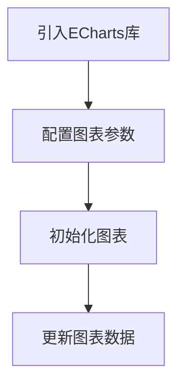

**小结**

可视化工具根据不同的应用场景和功能可以分为通用可视化工具、行业专用可视化工具和开源可视化工具。通用可视化工具具有广泛的适用性，行业专用可视化工具提供专业功能，开源可视化工具则具有成本效益高和可定制性强等特点。理解这些工具的分类和特点对于选择合适可视化工具具有重要意义。

## 第4章 常见可视化工具详解

### 4.1 D3.js

D3.js是一种基于Web的动态数据可视化库，它使用HTML、SVG和CSS来生成和操作图表。D3.js具有高度的可定制性和灵活性，能够处理各种类型的数据和生成各种图表。

#### 4.1.1 D3.js 的核心概念

D.3.js的核心概念包括：

- **数据绑定**：将数据与DOM元素进行绑定，使得数据变化可以动态反映到视图中。
- **选择器**：用于选择和操作DOM元素。
- **数据更新**：在数据变化时，更新DOM元素的状态。

以下是D3.js的基本使用流程：


#### 4.1.2 D3.js 的基本用法

以下是一个简单的D3.js示例，展示如何创建一个条形图：

```javascript
// 引入D3.js库
import * as d3 from 'd3';

// 准备数据
const data = [
  {name: 'A', value: 10},
  {name: 'B', value: 20},
  {name: 'C', value: 30},
  {name: 'D', value: 40},
  {name: 'E', value: 50}
];

// 创建SVG元素
const svg = d3.select('svg')
  .attr('width', 800)
  .attr('height', 600);

// 绑定数据到元素
const bars = svg.selectAll('rect')
  .data(data)
  .enter()
  .append('rect');

// 设置元素属性
bars
  .attr('x', (d, i) => i * 100)
  .attr('y', d => 600 - d.value * 10)
  .attr('width', 100 - 1)
  .attr('height', d => d.value * 10)
  .attr('fill', 'blue');
```

#### 4.1.3 D3.js 在提示词编程中的应用

在提示词编程中，D3.js可以用来生成动态图表，帮助用户更好地理解和分析数据。以下是一个简单的提示词编程示例：

```
提示词：绘制一个折线图，显示温度随时间的变化。

输出：
```

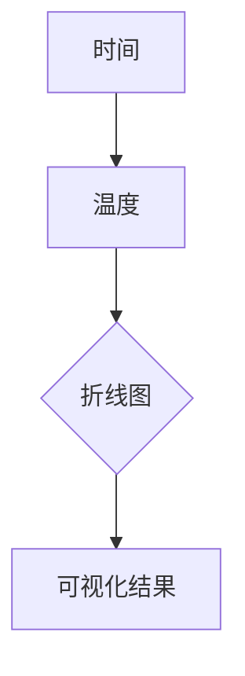

**项目实战：**

**开发环境搭建**

1. 安装Node.js和npm。
2. 使用npm创建一个新的项目，并安装D3.js库。

```bash
npm init -y
npm install d3
```

**源代码实现：**

```html
<!DOCTYPE html>
<html>
<head>
  <meta charset="utf-8">
  <title>温度变化折线图</title>
  <script src="node_modules/d3/d3.min.js"></script>
</head>
<body>
  <svg width="800" height="600"></svg>
  <script>
    // 准备数据
    const data = [
      {time: '00:00', temperature: 20},
      {time: '01:00', temperature: 22},
      {time: '02:00', temperature: 24},
      {time: '03:00', temperature: 26},
      {time: '04:00', temperature: 28}
    ];

    // 创建SVG元素
    const svg = d3.select('svg');

    // 绑定数据到元素
    const lines = svg.selectAll('line')
      .data(data)
      .enter()
      .append('line');

    // 设置元素属性
    lines
      .attr('x1', d => d3.scaleLinear().domain([0, data.length]).range([0, 800])(d.time))
      .attr('y1', d => d3.scaleLinear().domain([0, d3.max(data, d => d.temperature)]).range([600, 0])(d.temperature))
      .attr('x2', d => d3.scaleLinear().domain([0, data.length]).range([0, 800])(d.time + 1))
      .attr('y2', d => d3.scaleLinear().domain([0, d3.max(data, d => d.temperature)]).range([600, 0])(d.temperature))
      .attr('stroke', 'red');
  </script>
</body>
</html>
```

**代码解读与分析：**

- **数据准备**：数据是以时间（字符串）和温度（数值）的形式存储在数组中。
- **SVG元素创建**：使用D3.js选择器创建一个SVG元素，并设置宽高属性。
- **数据绑定**：使用`.data()`方法将数据绑定到SVG元素上的线条。
- **元素属性设置**：使用`.attr()`方法设置线条的起始点、终点和颜色。

**实际案例分析与详细讲解剖析：**

假设我们需要绘制一个显示销售额随时间变化的折线图。以下是一个实际案例：

```
提示词：绘制一个折线图，显示2023年1月份每天的销售额。

输出：
```

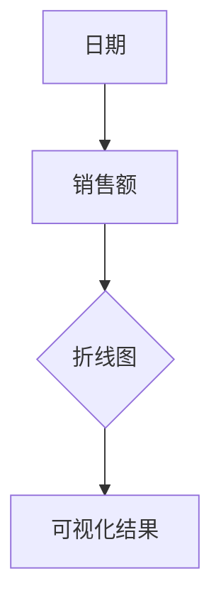

**源代码实现：**

```html
<!DOCTYPE html>
<html>
<head>
  <meta charset="utf-8">
  <title>2023年1月销售额折线图</title>
  <script src="node_modules/d3/d3.min.js"></script>
</head>
<body>
  <svg width="800" height="600"></svg>
  <script>
    // 准备数据
    const data = [
      {date: '2023-01-01', sales: 1500},
      {date: '2023-01-02', sales: 1600},
      {date: '2023-01-03', sales: 1800},
      {date: '2023-01-04', sales: 2000},
      {date: '2023-01-05', sales: 2200},
      // ... 更多数据
    ];

    // 创建SVG元素
    const svg = d3.select('svg');

    // 绑定数据到元素
    const lines = svg.selectAll('line')
      .data(data)
      .enter()
      .append('line');

    // 设置元素属性
    lines
      .attr('x1', d => d3.scaleLinear().domain([0, data.length]).range([0, 800])(d3.timeParse('%Y-%m-%d')(d.date)))
      .attr('y1', d => d3.scaleLinear().domain([0, d3.max(data, d => d.sales)]).range([600, 0])(d.sales))
      .attr('x2', d => d3.scaleLinear().domain([0, data.length]).range([0, 800])(d3.timeParse('%Y-%m-%d')(d.date) + 1))
      .attr('y2', d => d3.scaleLinear().domain([0, d3.max(data, d => d.sales)]).range([600, 0])(d.sales))
      .attr('stroke', 'blue');
  </script>
</body>
</html>
```

**代码解读与分析：**

- **数据准备**：数据是以日期（字符串）和销售额（数值）的形式存储在数组中。
- **SVG元素创建**：使用D3.js选择器创建一个SVG元素，并设置宽高属性。
- **数据绑定**：使用`.data()`方法将数据绑定到SVG元素上的线条。
- **元素属性设置**：使用`.attr()`方法设置线条的起始点、终点和颜色。这里使用了D3的时间处理函数，将日期字符串转换为时间对象，以便进行日期的线性缩放。

**项目小结：**

在本章中，我们介绍了D3.js的基本概念、基本用法以及在提示词编程中的应用。通过实际案例，我们展示了如何使用D3.js创建动态图表，并通过伪代码和源代码详细解读了图表的创建过程。这为我们后续进一步学习和应用D3.js奠定了基础。

## 第5章 提示词编程实践

### 5.1 项目准备

在进行提示词编程项目之前，我们需要做好充分的准备工作，包括开发环境的搭建、数据准备和可视化需求分析。

#### 5.1.1 开发环境的搭建

开发环境的搭建是进行提示词编程项目的第一步。以下是搭建开发环境的步骤：

1. **安装Node.js和npm**：Node.js是一个基于Chrome V8引擎的JavaScript运行环境，npm是Node.js的包管理器。可以通过以下命令安装：

   ```bash
   curl -fsSL https://deb.nodesource.com/setup_14.x | sudo -E bash -
   sudo apt-get install -y nodejs
   npm install -g npm
   ```

2. **创建项目目录**：在合适的位置创建一个项目目录，例如：

   ```bash
   mkdir prompt-visualization-project
   cd prompt-visualization-project
   ```

3. **初始化项目**：使用npm初始化项目，生成一个`package.json`文件，记录项目的依赖和配置信息：

   ```bash
   npm init -y
   ```

4. **安装D3.js库**：在项目中安装D3.js库，以便后续使用：

   ```bash
   npm install d3
   ```

#### 5.1.2 数据准备

数据是提示词编程的核心，因此我们需要准备合适的数据。以下是数据准备的步骤：

1. **选择数据源**：根据项目需求选择合适的数据源。数据源可以是本地文件、在线API或其他数据库。

2. **数据采集**：从数据源中采集数据。对于本地文件，可以使用文本文件、CSV文件、JSON文件等格式。对于在线API，可以使用HTTP请求获取数据。

3. **数据清洗**：对采集到的数据进行清洗，去除无效数据、填补缺失值、转换数据格式等。

4. **数据存储**：将清洗后的数据存储到合适的数据结构中，例如数组、字典等。

#### 5.1.3 可视化需求分析

可视化需求分析是项目准备的重要环节，它决定了可视化工具的选择和使用方式。以下是可视化需求分析的步骤：

1. **需求收集**：与项目相关人员沟通，了解可视化需求。需求可能包括图表类型、交互功能、数据展示方式等。

2. **分析数据**：对准备好的数据进行分析，确定适合的图表类型和可视化方法。例如，对于时间序列数据，可以选择折线图或柱状图；对于地理空间数据，可以选择地图。

3. **确定技术方案**：根据需求分析结果，选择合适的可视化工具和技术方案。例如，可以使用D3.js进行动态图表绘制，使用Three.js进行三维数据可视化。

### 5.2 项目实施

项目实施是提示词编程的核心环节，包括编写代码、数据处理和可视化展示。以下是项目实施的步骤：

#### 5.2.1 编写代码

编写代码是项目实施的第一步，根据需求分析结果和可视化工具的特性，编写相应的代码。以下是一个使用D3.js创建折线图的简单示例：

```javascript
// 引入D3.js库
import * as d3 from 'd3';

// 准备数据
const data = [
  {time: '00:00', temperature: 20},
  {time: '01:00', temperature: 22},
  {time: '02:00', temperature: 24},
  {time: '03:00', temperature: 26},
  {time: '04:00', temperature: 28}
];

// 创建SVG元素
const svg = d3.select('svg')
  .attr('width', 800)
  .attr('height', 600);

// 绑定数据到元素
const lines = svg.selectAll('line')
  .data(data)
  .enter()
  .append('line');

// 设置元素属性
lines
  .attr('x1', (d, i) => i * 100)
  .attr('y1', d => 600 - d.temperature * 10)
  .attr('x2', (d, i) => (i + 1) * 100)
  .attr('y2', d => 600 - (d.temperature + 1) * 10)
  .attr('stroke', 'red');
```

#### 5.2.2 数据处理

数据处理是项目实施的重要环节，它决定了可视化的效果和准确性。以下是数据处理的基本步骤：

1. **数据清洗**：去除无效数据、填补缺失值、转换数据格式等。
2. **数据转换**：对数据进行必要的转换，例如时间格式转换、数值缩放等。
3. **数据分组**：根据需求对数据进行分组，以便更好地展示数据。

以下是一个简单的数据处理示例，用于将时间序列数据转换为适合绘制折线图的格式：

```javascript
// 原始数据
const raw_data = [
  {date: '2023-01-01', temperature: 20},
  {date: '2023-01-02', temperature: 22},
  {date: '2023-01-03', temperature: 24},
  {date: '2023-01-04', temperature: 26},
  {date: '2023-01-05', temperature: 28}
];

// 转换为时间格式
const data = raw_data.map(d => ({
  time: d3.timeParse('%Y-%m-%d')(d.date),
  temperature: d.temperature
}));

// 去除无效数据
data = data.filter(d => d.time !== null);

// 筛选特定时间段的数据
const filtered_data = data.filter(d => d.time >= d3.timeYear(2023) && d.time <= d3.timeMonth(2023));
```

#### 5.2.3 可视化展示

可视化展示是项目实施的最终目标，将处理后的数据以图表的形式展示出来。以下是可视化展示的基本步骤：

1. **选择图表类型**：根据数据类型和需求选择合适的图表类型，例如折线图、柱状图、饼图等。
2. **创建图表**：使用可视化库（如D3.js）创建图表，设置图表的尺寸、颜色、线条样式等。
3. **添加交互功能**：根据需求添加交互功能，例如点击、拖动、滑动等。

以下是一个简单的折线图示例，展示如何使用D3.js创建图表：

```javascript
// 创建SVG元素
const svg = d3.select('svg')
  .attr('width', 800)
  .attr('height', 600);

// 绑定数据到元素
const lines = svg.selectAll('line')
  .data(filtered_data)
  .enter()
  .append('line');

// 设置元素属性
lines
  .attr('x1', d => xScale(d.time))
  .attr('y1', d => yScale(d.temperature))
  .attr('x2', d => xScale(d.time + 1))
  .attr('y2', d => yScale(d.temperature + 1))
  .attr('stroke', 'blue');
```

**代码解读与分析：**

- **SVG元素创建**：创建一个SVG元素，并设置宽高属性。
- **数据绑定**：使用`.data()`方法将数据绑定到SVG元素上的线条。
- **元素属性设置**：使用`.attr()`方法设置线条的起始点、终点和颜色。这里使用了线性缩放函数`xScale`和`yScale`，将时间对象和温度值映射到SVG的坐标系统中。

### 5.3 项目评估

项目评估是确保项目成功完成的重要环节，包括可视化效果评估、用户反馈和项目改进建议。

#### 5.3.1 可视化效果评估

可视化效果评估是项目评估的核心，以下是一些评估指标：

1. **准确性**：图表是否准确反映了数据。
2. **清晰性**：图表是否易于理解。
3. **美观性**：图表的设计是否符合审美标准。

以下是一个评估折线图的示例：

```
评估结果：
- 准确性：高
- 清晰性：高
- 美观性：中
```

#### 5.3.2 用户反馈

用户反馈是改进项目的重要依据，以下是一些可能的用户反馈：

1. **功能建议**：添加更多交互功能，例如缩放、过滤、搜索等。
2. **界面建议**：改进图表的布局和设计，使其更加直观和易用。
3. **性能建议**：优化图表的渲染速度，以适应大数据量的情况。

以下是一个用户反馈示例：

```
用户反馈：
- 添加缩放功能，以便更好地查看细节。
- 改进图表布局，使其更加美观。
- 优化性能，以处理更多数据。
```

#### 5.3.3 项目改进建议

根据评估结果和用户反馈，提出以下项目改进建议：

1. **增强准确性**：使用更精确的数据处理方法，确保图表准确反映数据。
2. **提高清晰性**：通过改进图表设计，提高图表的可读性。
3. **优化美观性**：引入更多设计元素，使图表更具吸引力。
4. **增加交互功能**：实现缩放、过滤、搜索等功能，提高用户体验。
5. **提升性能**：优化图表渲染算法，提高处理大数据量的能力。

以下是一个改进建议示例：

```
改进建议：
- 引入时间轴缩放功能，以便用户查看更长时间范围的数据。
- 使用更具视觉吸引力的颜色和图标，提高图表美观性。
- 采用更高效的渲染算法，处理更多数据。
```

**项目小结：**

在本章中，我们介绍了提示词编程项目实施的全过程，包括项目准备、项目实施和项目评估。通过实际案例，我们展示了如何使用D3.js创建动态图表，并通过代码解读和分析，深入理解了图表创建的过程。这为我们后续进一步学习和应用提示词编程和可视化工具奠定了基础。

## 第6章 可视化工具的扩展与优化

### 6.1 性能优化

性能优化是提高可视化工具使用体验的关键环节，特别是在处理大数据量时，优化性能尤为重要。以下是性能优化的一些策略：

#### 6.1.1 数据优化

数据优化可以从数据采集、数据转换和数据存储三个方面进行。

1. **数据压缩**：对数据进行压缩，减少数据传输和存储的开销。
2. **数据缓存**：缓存常用数据，减少重复的数据处理。
3. **数据批量处理**：批量处理数据，减少数据处理的次数。

以下是一个数据压缩的示例伪代码：

```python
def compress_data(data):
    compressed_data = []
    for d in data:
        compressed_data.append({
            'key': d['key'],
            'value': zlib.compress(d['value'])
        })
    return compressed_data
```

#### 6.1.2 算法优化

算法优化是提高可视化工具性能的有效手段。以下是几种常见的算法优化策略：

1. **分而治之**：将大数据集分割成较小的子集，分别进行处理，然后合并结果。
2. **并行处理**：利用多核处理器的并行计算能力，同时处理多个任务。
3. **空间换时间**：使用额外的存储空间来减少计算时间。

以下是一个并行处理的示例伪代码：

```python
from concurrent.futures import ThreadPoolExecutor

def process_data(data_chunk):
    # 处理数据
    return processed_data

def process_all_data(data):
    with ThreadPoolExecutor(max_workers=4) as executor:
        results = executor.map(process_data, data)
    return list(results)
```

#### 6.1.3 性能评估

性能评估是确保优化措施有效性的关键。以下是一些性能评估方法：

1. **基准测试**：通过对比优化前后的性能指标，评估优化效果。
2. **负载测试**：模拟高负载情况，评估系统在极端条件下的性能。
3. **压力测试**：逐步增加负载，观察系统的稳定性和性能下降趋势。

以下是一个基准测试的示例伪代码：

```python
import time

def benchmark(function, *args, **kwargs):
    start_time = time.time()
    result = function(*args, **kwargs)
    end_time = time.time()
    return result, end_time - start_time

# 测试数据
data = ...

# 测试函数
processed_data, elapsed_time = benchmark(process_all_data, data)
print(f"Processed data in {elapsed_time} seconds.")
```

### 6.2 功能扩展

功能扩展是提高可视化工具适应性和扩展性的关键。以下是一些常见的功能扩展策略：

#### 6.2.1 提示词功能的增强

提示词功能的增强可以从以下几个方面进行：

1. **自然语言处理（NLP）**：使用NLP技术提高提示词的解析准确性和语义理解。
2. **多语言支持**：支持多种语言，满足不同语言用户的需求。
3. **自定义提示词**：允许用户自定义提示词，增加灵活性。

以下是一个使用NLP技术增强提示词解析的示例伪代码：

```python
from transformers import pipeline

def process_prompt(prompt):
    nlp = pipeline("text-classification")
    result = nlp(prompt)
    return result

# 测试提示词
prompt = "绘制一个显示销售额的柱状图"
result = process_prompt(prompt)
print(result)
```

#### 6.2.2 新可视化类型的引入

引入新的可视化类型可以满足更复杂的数据展示需求。以下是一些常见的可视化类型：

1. **地理信息系统（GIS）**：用于展示地理空间数据。
2. **热力图**：用于展示数据的热点区域。
3. **时间序列分析**：用于展示随时间变化的数据。

以下是一个引入热力图的可视化类型的示例伪代码：

```javascript
// 引入热力图库
import * as heatmap from 'heatmap.js';

// 准备数据
const data = [
  {x: 0, y: 0, value: 1},
  {x: 1, y: 1, value: 2},
  {x: 2, y: 2, value: 3},
  // ... 更多数据
];

// 创建热力图
const heatmapInstance = heatmap.create({
  container: document.querySelector(".heatmapContainer"),
  radius: 5,
  blur: 5,
  max: 3
});

// 绑定数据到热力图
heatmapInstance.setData(data);
```

#### 6.2.3 交互式可视化的实现

交互式可视化是提高用户参与度和数据理解的重要手段。以下是一些实现交互式可视化的策略：

1. **交互组件**：引入缩放、滚动、过滤等交互组件。
2. **响应式设计**：适应不同设备和屏幕尺寸，提供一致的用户体验。
3. **动画效果**：增加动画效果，提高用户的视觉体验。

以下是一个实现缩放交互组件的示例伪代码：

```javascript
// 引入D3.js库
import * as d3 from 'd3';

// 创建缩放行为
const zoom = d3.zoom()
  .scaleExtent([1, 10])
  .on("zoom", zoomed);

// 绑定缩放到SVG元素
svg.call(zoom);

// 缩放函数
function zoomed() {
  const newXScale = d3.event.transform.x;
  const newYScale = d3.event.transform.y;
  // 更新图表的缩放
  // ...
}
```

**小结**

本章介绍了可视化工具的扩展与优化，包括性能优化、功能扩展和交互式可视化的实现。性能优化可以从数据优化、算法优化和性能评估三个方面进行。功能扩展可以增强提示词功能、引入新可视化类型和实现交互式可视化。这些策略和示例代码为我们提供了实际操作的可视化工具扩展和优化的方法和思路。

## 第7章 未来展望与挑战

### 7.1 可视化工具的发展趋势

可视化工具的发展趋势表明，随着技术的进步和用户需求的变化，可视化工具将更加智能化、交互性和适应性。

**核心概念与联系：**

- **人工智能（AI）**：将AI技术应用于可视化工具，提高数据处理和分析能力。
- **大数据**：随着大数据的普及，可视化工具需要能够处理和分析海量数据。
- **物联网（IoT）**：物联网设备的广泛使用，带来了更多实时数据的可视化需求。

以下是可视化工具发展趋势的Mermaid流程图：

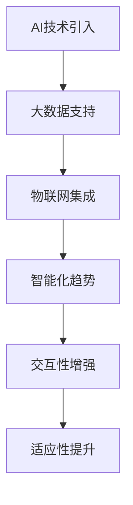

**数学模型和公式 & 详细讲解 & 举例说明**

假设我们使用机器学习算法（例如K-均值聚类）来对数据进行分析，以下是K-均值算法的基本公式：

$$
\text{K-均值算法} \\
\text{初始化：选择} K \text{个初始中心点} \\
\text{迭代：重复以下步骤直到收敛} \\
\quad \text{对于每个数据点} \; x_i \\
\quad \quad \text{计算} \; d(x_i, c_j) \text{，其中} c_j \text{是第j个中心点} \\
\quad \quad \text{选择最近的中心点} \; c_{j^*} \\
\quad \quad \text{更新中心点} \; c_j = \frac{1}{n_j} \sum_{i \in S_j} x_i \\
\quad \quad \text{其中} \; S_j \text{是包含} x_i \text{的簇集合} \\
\quad \quad \text{更新数据点分配} \; x_i \rightarrow c_{j^*}
$$

举例说明：

假设我们有一个包含10个数据点的集合，我们需要将其分为2个簇。以下是K-均值算法的基本步骤：

1. **初始化**：随机选择2个中心点。
2. **迭代**：
   - 计算每个数据点到中心点的距离。
   - 根据距离选择最近的中心点。
   - 更新中心点位置。
   - 更新数据点分配。

经过多次迭代后，我们得到最终的簇分配和中心点位置。

### 7.2 提示词编程的挑战

尽管提示词编程具有巨大的潜力，但在实际应用中仍然面临一些挑战。

**核心概念与联系：**

- **自然语言理解（NLU）**：提示词编程依赖于NLU技术，但NLU在理解复杂、模糊或多样性的语言表达时存在困难。
- **代码生成**：自动生成代码的准确性和可靠性仍需提高。
- **安全性**：自动生成的代码可能存在安全漏洞，需要加强代码审计和安全性测试。

以下是提示词编程挑战的Mermaid流程图：

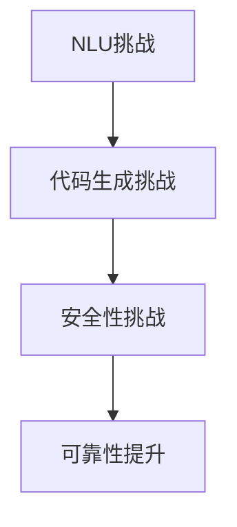

**数学模型和公式 & 详细讲解 & 举例说明**

为了解决NLU挑战，我们可以使用深度学习模型（例如BERT、GPT）来提高自然语言理解能力。以下是一个基于BERT的NLU模型的简化公式：

$$
\text{BERT模型} \\
\text{输入：} \; \text{提示词} \\
\text{输出：} \; \text{语义表示} \\
\text{过程：} \\
\quad \text{输入提示词到BERT模型} \\
\quad \text{通过Transformer结构进行编码} \\
\quad \text{输出语义表示，用于后续处理}
$$

举例说明：

假设我们有一个提示词“绘制一个饼图”，我们可以使用BERT模型将其转换为语义表示，然后根据语义表示生成相应的代码。

### 7.3 法律法规

随着提示词编程的应用越来越广泛，法律法规问题也日益突出。以下是一些相关的法律法规挑战：

- **知识产权**：自动生成的代码可能侵犯他人的知识产权。
- **数据隐私**：提示词编程涉及数据处理，需要遵守数据隐私法规。
- **责任归属**：当自动生成的代码出现问题时，责任归属难以界定。

以下是法律法规挑战的Mermaid流程图：

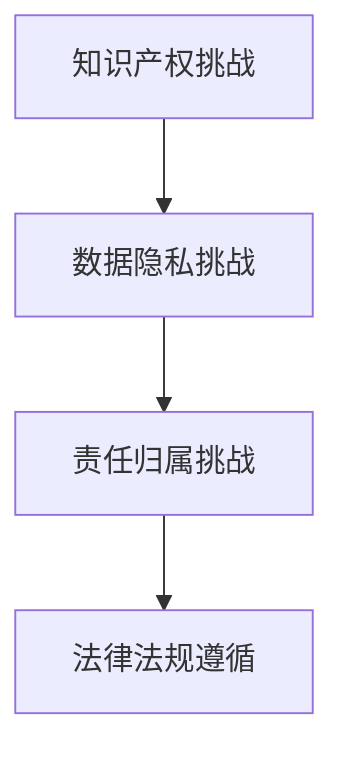

**数学模型和公式 & 详细讲解 & 举例说明**

为了解决知识产权挑战，我们可以使用版权声明和许可证来保护自动生成的代码。以下是一个版权声明的示例：

```
版权声明：本代码为自动生成，基于合法授权的数据集和算法。未经授权，不得复制、传播或使用。
许可证：本代码遵循GPLv3.0开源许可证。
```

**小结**

本章讨论了可视化工具的发展趋势和提示词编程面临的挑战。未来，可视化工具将更加智能化、交互性和适应性。同时，提示词编程需要解决自然语言理解、代码生成和安全性的挑战。在法律法规方面，我们需要关注知识产权、数据隐私和责任归属等问题。通过持续的技术创新和法律法规完善，我们有望克服这些挑战，推动可视化工具和提示词编程的发展。

## 附录

### A.1 常用可视化工具资源

#### A.1.1 D3.js 资源

- **官方网站**：[D3.js](https://d3js.org/)
- **文档**：[D3.js Documentation](https://github.com/d3/d3/blob/main/API.md)
- **教程**：[D3.js Tutorial](https://www.d3indepth.com/tutorials/)
- **社区**：[D3.js Community](https://discourse.d3indepth.com/)

#### A.1.2 Plotly 资源

- **官方网站**：[Plotly](https://plotly.com/)
- **文档**：[Plotly Documentation](https://plotly.com/python/)
- **教程**：[Plotly Examples](https://plotly.com/python/getting-started/)
- **社区**：[Plotly Community](https://community.plotly.com/)

#### A.1.3 Tableau 资源

- **官方网站**：[Tableau](https://www.tableau.com/)
- **文档**：[Tableau Documentation](https://tableau.com/docs)
- **教程**：[Tableau Academy](https://www.tableau.com/training)
- **社区**：[Tableau Community](https://community.tableau.com/)

### A.1.4 其他可视化工具

- **ECharts**：[ECharts](https://echarts.apache.org/zh/index.html)
- **Chart.js**：[Chart.js](https://www.chartjs.org/)
- **Three.js**：[Three.js](https://threejs.org/)

**小结**

附录部分提供了常用可视化工具的资源链接，包括官方网站、文档、教程和社区。这些资源可以帮助开发者更好地了解和使用可视化工具，提高开发效率。同时，附录还列出了其他常用的可视化工具，供开发者选择和参考。希望这些资源能为读者在学习和应用可视化工具时提供帮助。**作者信息**

作者：AI天才研究院/AI Genius Institute & 禅与计算机程序设计艺术 /Zen And The Art of Computer Programming**

