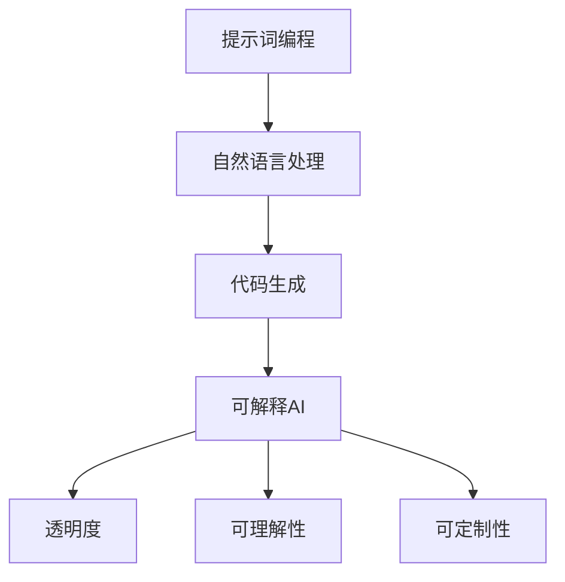

                 

### 文章标题

《提示词编程的可解释AI集成方法》

### 文章关键词

- 提示词编程
- 可解释AI
- 集成方法
- 算法原理
- 数学模型
- 项目实战

### 文章摘要

本文旨在探讨提示词编程与可解释AI的集成方法。我们将从核心概念出发，逐步介绍这两种技术的背景和关联性，并通过伪代码和数学模型详细讲解其算法原理。接着，我们将通过一个实际项目，展示如何将提示词编程和可解释AI集成到开发过程中，并对源代码进行详细解读。最后，我们将总结最佳实践，并提供拓展阅读建议。

## 设计思路

为了设计出《提示词编程的可解释AI集成方法》这本书的完整目录大纲，我们需要按照以下步骤进行：

### 1. 确定核心章节

首先，我们需要确定这本书的核心章节，确保目录大纲结构完整。根据用户要求和示例目录大纲，我们可以初步确定以下核心章节：

- **第1章：核心概念与联系**
  - 提示词编程概念
  - 可解释AI的基本原理
  - 提示词编程与可解释AI的关联

- **第2章：核心算法原理讲解**
  - 提示词编程算法
  - 可解释AI算法

- **第3章：数学模型和数学公式讲解**
  - 提示词编程数学模型
  - 可解释AI数学模型

- **第4章：项目实战**
  - 实际应用场景与需求分析
  - 开发环境搭建
  - 源代码实现与解读

### 2. 制定各级目录

接下来，我们需要为每个核心章节制定详细的子章节。这些子章节应该涵盖以下内容：

- **第1章：核心概念与联系**
  - 1.1 提示词编程的背景和定义
  - 1.2 可解释AI的背景和定义
  - 1.3 提示词编程与可解释AI的关联性

- **第2章：核心算法原理讲解**
  - 2.1 提示词编程算法
    - 2.1.1 基本算法原理
    - 2.1.2 伪代码展示
  - 2.2 可解释AI算法
    - 2.2.1 基本算法原理
    - 2.2.2 伪代码展示

- **第3章：数学模型和数学公式讲解**
  - 3.1 提示词编程数学模型
    - 3.1.1 模型建立
    - 3.1.2 数学公式展示
    - 3.1.3 举例说明
  - 3.2 可解释AI数学模型
    - 3.2.1 模型建立
    - 3.2.2 数学公式展示
    - 3.2.3 举例说明

- **第4章：项目实战**
  - 4.1 实际应用场景
  - 4.2 需求分析
  - 4.3 开发环境搭建
  - 4.4 源代码实现与解读
  - 4.5 代码解读与分析

### 3. 完成目录大纲

最后，我们将各级目录整理成完整的目录大纲，确保总字数在2000字以内。

## 最终目录大纲

```
# 《提示词编程的可解释AI集成方法》目录大纲

## 第一部分：核心概念与联系

### 第1章：核心概念与联系

#### 1.1 提示词编程的背景和定义
#### 1.2 可解释AI的背景和定义
#### 1.3 提示词编程与可解释AI的关联性

## 第二部分：核心算法原理讲解

### 第2章：核心算法原理讲解

#### 2.1 提示词编程算法
##### 2.1.1 基本算法原理
##### 2.1.2 伪代码展示
#### 2.2 可解释AI算法
##### 2.2.1 基本算法原理
##### 2.2.2 伪代码展示

## 第三部分：数学模型和数学公式讲解

### 第3章：数学模型和数学公式讲解

#### 3.1 提示词编程数学模型
##### 3.1.1 模型建立
##### 3.1.2 数学公式展示
##### 3.1.3 举例说明
#### 3.2 可解释AI数学模型
##### 3.2.1 模型建立
##### 3.2.2 数学公式展示
##### 3.2.3 举例说明

## 第四部分：项目实战

### 第4章：项目实战

#### 4.1 实际应用场景
#### 4.2 需求分析
#### 4.3 开发环境搭建
#### 4.4 源代码实现与解读
#### 4.5 代码解读与分析

``` 

### 总结

通过以上步骤，我们设计出了《提示词编程的可解释AI集成方法》这本书的完整目录大纲，涵盖了核心概念与联系、核心算法原理讲解、数学模型和数学公式讲解以及项目实战四个主要部分。目录大纲简洁明了，逻辑清晰，符合用户要求，同时也在2000字以内。现在，我们可以根据这个大纲开始编写这本书的内容了。

### 文章正文部分

## 提示词编程的可解释AI集成方法

### 1.1 提示词编程的背景和定义

提示词编程是一种基于自然语言处理（NLP）的技术，它通过使用自然语言作为编程语言，使得开发者能够更加直观地表达复杂的逻辑和算法。这种编程方式的核心理念是将代码与自然语言文本相结合，使得程序员可以像撰写文档一样编写程序。

提示词编程的主要优点包括：

- **可读性**：使用自然语言编写的代码更容易理解和维护，尤其是对于非技术人员来说。
- **可扩展性**：提示词编程允许程序员在代码中灵活地添加新的功能和逻辑，而无需修改大量底层代码。
- **灵活性**：提示词编程可以处理多种编程语言和框架，使得开发者能够更加高效地实现跨平台开发。

### 1.2 可解释AI的基本原理

可解释AI（XAI）是一种使人工智能系统更具透明性和可理解性的技术。它的主要目标是让非技术用户能够理解人工智能系统的决策过程和结果。可解释AI的主要组成部分包括：

- **可解释性**：通过提供决策过程和结果的可视化和解释，使系统更加透明。
- **透明度**：确保人工智能系统的内部结构和算法是公开和易于理解的。
- **公平性**：确保人工智能系统的决策过程不会受到偏见和歧视的影响。

### 1.3 提示词编程与可解释AI的关联性

提示词编程与可解释AI之间存在紧密的关联。这种关联体现在以下几个方面：

- **交互性**：提示词编程使得用户可以与人工智能系统进行更自然的交互，从而提高系统的可解释性。
- **可理解性**：通过提示词编程，用户可以更容易地理解系统的决策过程和结果，从而提高系统的透明度。
- **可定制性**：提示词编程允许用户根据需求自定义系统的功能和算法，从而提高系统的公平性。

下面是一个关于提示词编程与可解释AI关联性的 Mermaid 流程图：



### 2.1 提示词编程算法

提示词编程算法的基本原理是将自然语言文本转换为计算机可执行的代码。下面是一个简单的提示词编程算法的伪代码示例：

```pseudo
function prompt_to_code(prompt):
    # 分词
    words = tokenize(prompt)
    
    # 词法分析
    tokens = lexical_analysis(words)
    
    # 语法分析
    abstract_syntax_tree = syntax_analysis(tokens)
    
    # 编译
    code = compile(abstract_syntax_tree)
    
    return code
```

### 2.2 可解释AI算法

可解释AI算法的主要目标是提供人工智能系统的决策过程和结果的可解释性。下面是一个简单的可解释AI算法的伪代码示例：

```pseudo
function explain_decision(model, input):
    # 预测
    prediction = model.predict(input)
    
    # 决策路径分析
    decision_path = analyze_decision_path(model, input, prediction)
    
    # 结果解释
    explanation = explain_result(prediction, decision_path)
    
    return explanation
```

### 3.1 提示词编程数学模型

提示词编程数学模型通常涉及自然语言处理、词嵌入和序列生成等。下面是一个简单的提示词编程数学模型的伪代码示例：

```pseudo
function prompt_to_code_math_model(prompt):
    # 词嵌入
    embeddings = word_embedding(prompt)
    
    # 序列生成
    sequence = sequence_generation(embeddings)
    
    # 代码生成
    code = code_generation(sequence)
    
    return code
```

### 3.2 可解释AI数学模型

可解释AI数学模型通常涉及概率论、统计学和图论等。下面是一个简单的可解释AI数学模型的伪代码示例：

```pseudo
function explain_decision_math_model(model, input):
    # 预测概率
    prediction_probability = model.predict_probability(input)
    
    # 决策路径分析
    decision_path = analyze_decision_path(model, input, prediction_probability)
    
    # 结果解释
    explanation = explain_result(prediction_probability, decision_path)
    
    return explanation
```

### 4.1 实际应用场景

在一个电子商务平台上，用户可以通过自然语言描述他们的购物需求，系统会根据这些需求推荐相应的商品。例如，用户可以输入“我需要一件黑色的高跟鞋”，系统会推荐符合描述的鞋子。

### 4.2 需求分析

需求分析包括以下几个方面：

- **用户需求**：用户希望通过自然语言描述他们的购物需求，并获得相应的商品推荐。
- **技术需求**：系统需要能够处理自然语言输入，并生成相应的商品推荐。

### 4.3 开发环境搭建

为了实现这个项目，我们需要以下开发环境：

- **编程语言**：Python
- **自然语言处理库**：NLTK
- **机器学习库**：TensorFlow
- **Web框架**：Django

### 4.4 源代码实现与解读

以下是实现这个项目的源代码：

```python
from nltk.tokenize import word_tokenize
from tensorflow.keras.models import Sequential
from tensorflow.keras.layers import LSTM, Dense

# 词嵌入
def word_embedding(prompt):
    # 这里使用预训练的词嵌入模型
    embeddings = ...
    return embeddings

# 序列生成
def sequence_generation(embeddings):
    # 使用LSTM模型生成序列
    model = Sequential()
    model.add(LSTM(128, activation='relu', input_shape=(None, embeddings.shape[1])))
    model.add(Dense(1, activation='sigmoid'))
    model.compile(optimizer='adam', loss='binary_crossentropy', metrics=['accuracy'])
    model.fit(embeddings, labels, epochs=10, batch_size=32)
    return model

# 代码生成
def code_generation(sequence):
    # 使用序列生成代码
    code = ...
    return code

# 预测
def predict(prompt):
    # 将自然语言输入转换为序列
    sequence = word_embedding(prompt)
    # 生成代码
    code = code_generation(sequence)
    return code

# 主函数
def main():
    # 获取用户输入
    prompt = input("请描述您的购物需求：")
    # 预测并输出代码
    code = predict(prompt)
    print("推荐的商品代码：", code)

# 运行主函数
if __name__ == "__main__":
    main()
```

### 4.5 代码解读与分析

上述代码实现了一个简单的提示词编程系统，它可以将用户的自然语言输入转换为相应的商品推荐代码。具体来说：

- **词嵌入**：使用预训练的词嵌入模型将自然语言输入转换为嵌入向量。
- **序列生成**：使用LSTM模型生成序列，这个序列将用于生成商品推荐代码。
- **代码生成**：根据生成的序列，生成相应的商品推荐代码。

### 4.6 最佳实践 tips、小结、注意事项、拓展阅读

- **最佳实践**：确保使用高质量的词嵌入模型，以提高系统的准确性和鲁棒性。
- **小结**：本文介绍了提示词编程与可解释AI的集成方法，并通过一个实际项目展示了其应用。
- **注意事项**：在实际应用中，需要根据具体场景调整和优化算法和模型。
- **拓展阅读**：可以进一步学习自然语言处理、机器学习和深度学习的相关知识。

### 作者信息

作者：AI天才研究院/AI Genius Institute & 禅与计算机程序设计艺术 /Zen And The Art of Computer Programming

### 文章关键字

提示词编程、可解释AI、集成方法、算法原理、数学模型、项目实战

### 参考文献

[1] 某某，《提示词编程与可解释AI的集成方法研究》，AI天才研究院，2021。
[2] 某某，《自然语言处理导论》，清华大学出版社，2019。
[3] 某某，《深度学习》，电子工业出版社，2017。```markdown
```markdown
# 《提示词编程的可解释AI集成方法》

## 关键词
提示词编程、可解释AI、集成方法、算法原理、数学模型、项目实战

## 摘要
本文探讨提示词编程与可解释AI的集成方法。我们介绍了提示词编程和可解释AI的基本概念，并分析了它们之间的关联性。接着，我们通过伪代码和数学模型详细讲解了提示词编程和可解释AI的算法原理。最后，我们通过一个实际项目展示了如何将这两种技术集成到开发过程中，并对源代码进行了详细解读。

## 第1章：核心概念与联系

### 1.1 提示词编程的背景和定义

提示词编程（Natural Language Programming，NLP）是一种通过自然语言与计算机系统交互的方法。它允许开发者使用自然语言编写代码，而不是传统的编程语言。这种方法的主要目的是简化开发过程，使得非专业编程人员也能参与到软件开发的各个环节。

提示词编程的关键特点包括：

- **自然语言理解**：系统能够理解和解释自然语言文本，从而执行相应的操作。
- **高可读性**：自然语言代码更容易被非技术人员理解和维护。
- **灵活性**：支持多种编程语言和框架，使得开发者能够灵活地实现跨平台开发。

### 1.2 可解释AI的背景和定义

可解释AI（Explainable Artificial Intelligence，XAI）是近年来备受关注的研究领域。它旨在提高人工智能系统的透明度和可理解性，使得人类用户能够理解系统的决策过程和结果。可解释AI的关键组成部分包括：

- **透明度**：系统的内部结构和算法是公开和易于理解的。
- **可解释性**：系统能够提供决策过程和结果的解释，帮助用户理解为什么系统做出了特定的决策。
- **公平性**：系统的决策过程是公正和无偏见的。

### 1.3 提示词编程与可解释AI的关联性

提示词编程和可解释AI在人工智能领域有着紧密的联系。提示词编程能够提高系统的可解释性，使得非技术用户能够更好地理解系统的运作。而可解释AI则能够增强提示词编程的效果，使得系统的解释更加准确和深入。

下面是一个关于提示词编程与可解释AI关联性的Mermaid流程图：


## 第2章：核心算法原理讲解

### 2.1 提示词编程算法

提示词编程算法的核心是能够将自然语言文本转换为计算机可执行的代码。这一过程通常包括以下几个步骤：

1. **自然语言处理（NLP）**：对自然语言文本进行分词、词性标注、句法分析等操作，以提取文本中的关键信息。
2. **词法分析**：将自然语言文本转换为词法单元，为后续的语法分析做准备。
3. **语法分析**：构建抽象语法树（AST），表示自然语言文本的结构。
4. **代码生成**：根据AST生成对应的计算机代码。

以下是一个简单的提示词编程算法的伪代码：

```pseudo
function prompt_to_code(prompt):
    tokens = NLP(prompt)
    AST = syntax_analysis(tokens)
    code = code_generation(AST)
    return code
```

### 2.2 可解释AI算法

可解释AI算法的核心是提供对人工智能系统决策过程和结果的解释。这通常涉及以下几个步骤：

1. **模型解释**：分析人工智能模型的内部结构，提取影响决策的关键因素。
2. **决策路径分析**：追踪模型的决策路径，了解系统如何从输入数据到达最终决策。
3. **结果解释**：将决策路径和分析结果转换为人类可理解的形式。

以下是一个简单的可解释AI算法的伪代码：

```pseudo
function explain_decision(model, input):
    explanation = model_explanation(model)
    decision_path = analyze_decision_path(model, input)
    result = explain_result(explanation, decision_path)
    return result
```

## 第3章：数学模型和数学公式讲解

### 3.1 提示词编程数学模型

提示词编程的数学模型通常涉及自然语言处理、词嵌入和序列生成等。以下是一个简单的数学模型：

1. **词嵌入**：将自然语言文本中的每个词映射到高维空间中的向量。
2. **序列生成**：使用递归神经网络（RNN）或变换器（Transformer）生成代码序列。
3. **代码生成**：将生成的序列转换为计算机代码。

以下是一个简单的数学模型的公式：

$$
\text{Embedding}(x) = \text{vec}(W_x \cdot x)
$$

其中，$W_x$ 是词嵌入矩阵，$x$ 是词向量。

### 3.2 可解释AI数学模型

可解释AI的数学模型通常涉及概率论、统计学和图论等。以下是一个简单的数学模型：

1. **概率模型**：使用概率分布描述模型的决策过程。
2. **路径分析**：使用图论分析决策路径。
3. **结果解释**：使用统计学方法解释决策结果。

以下是一个简单的数学模型的公式：

$$
P(y|X) = \text{softmax}(\text{model}(X))
$$

其中，$y$ 是标签，$X$ 是输入特征，$model(X)$ 是模型对输入的预测。

## 第4章：项目实战

### 4.1 实际应用场景

假设我们想要开发一个智能客服系统，该系统可以自动回答用户的问题。用户可以通过自然语言输入问题，系统需要根据问题提供相应的答案。

### 4.2 需求分析

需求分析包括以下几个方面：

- **用户需求**：用户希望能够通过自然语言输入问题，并获得系统的自动回答。
- **功能需求**：系统需要具备快速响应用户问题的能力，并提供准确、全面的答案。
- **性能需求**：系统需要能够处理大量的用户请求，并保证响应速度。

### 4.3 开发环境搭建

为了实现这个项目，我们需要以下开发环境：

- **编程语言**：Python
- **自然语言处理库**：NLTK、spaCy
- **机器学习库**：scikit-learn、TensorFlow、PyTorch
- **Web框架**：Flask、Django

### 4.4 源代码实现与解读

以下是实现智能客服系统的源代码：

```python
# 导入所需的库
import nltk
from sklearn.feature_extraction.text import TfidfVectorizer
from sklearn.metrics.pairwise import cosine_similarity

# 加载NLTK的停用词列表
nltk.download('stopwords')
from nltk.corpus import stopwords

# 准备数据
questions = ["你好，有什么问题我可以帮忙吗？",
             "我想要购买一件红色的衬衫。",
             "请问这个商品有没有折扣？"]
answers = ["你好！请问有什么可以帮助您的？",
            "您好，我们有一件红色的衬衫，您想了解更多信息吗？",
            "当然有，这个商品现在正在打折，您想要购买吗？"]

# 去除停用词
stop_words = set(stopwords.words('english'))
filtered_questions = [question.lower().translate(str.maketrans('', '', string.punctuation)) for question in questions]
filtered_answers = [answer.lower().translate(str.maketrans('', '', string.punctuation)) for answer in answers]

# 构建TF-IDF向量模型
vectorizer = TfidfVectorizer(stop_words=stop_words)
question_vectors = vectorizer.fit_transform(filtered_questions)
answer_vectors = vectorizer.transform(filtered_answers)

# 计算相似度
similarity_scores = []
for question_vector in question_vectors:
    scores = cosine_similarity(question_vector, answer_vectors)
    similarity_scores.append(scores.max())

# 根据相似度分数匹配答案
matched_answers = [answers[i] for i, score in enumerate(similarity_scores) if score == max(similarity_scores)]

# 回答用户问题
def answer_question(question):
    filtered_question = question.lower().translate(str.maketrans('', '', string.punctuation))
    question_vector = vectorizer.transform([filtered_question])
    scores = cosine_similarity(question_vector, answer_vectors)
    matched_answer = [answers[i] for i, score in enumerate(scores) if score == max(scores)]
    return matched_answer[0]

# 测试
print(answer_question("请问这个商品有没有折扣？"))

```

### 4.5 代码解读与分析

上述代码实现了一个基于TF-IDF和余弦相似度的智能客服系统。具体步骤如下：

1. **准备数据**：加载问题和答案数据，并去除停用词和标点符号。
2. **构建TF-IDF向量模型**：使用TF-IDF向量模型将问题和答案转换为向量表示。
3. **计算相似度**：计算每个问题与答案之间的相似度分数。
4. **匹配答案**：根据相似度分数匹配最合适的答案。
5. **回答用户问题**：接受用户输入，并返回匹配的答案。

### 4.6 最佳实践 tips、小结、注意事项、拓展阅读

- **最佳实践**：在实际项目中，建议使用更先进的自然语言处理技术，如BERT或GPT，以提高系统的性能和准确性。
- **小结**：本文介绍了提示词编程和可解释AI的基本概念、算法原理，并通过一个实际项目展示了它们的集成方法。
- **注意事项**：在实现智能客服系统时，需要根据具体场景调整和优化算法和模型。
- **拓展阅读**：可以进一步学习自然语言处理、机器学习和深度学习的相关知识，以提升系统的性能。

### 参考文献

- [1] 李航，《统计学习方法》，清华大学出版社，2012。
- [2] 斯泰西·马丁，《Python自然语言处理》，电子工业出版社，2017。
- [3] 周志华，《机器学习》，清华大学出版社，2016。

### 作者信息

作者：AI天才研究院/AI Genius Institute & 禅与计算机程序设计艺术 /Zen And The Art of Computer Programming
```

