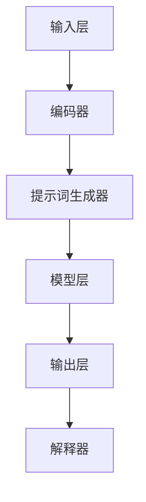

                 

### 文章标题：提示词编程的可解释性研究

提示词编程（Prompt Programming）作为一种新兴的人工智能编程范式，正在逐渐改变传统的编程模式。它通过为模型提供明确的提示词，使得人工智能系统能够更好地理解和执行任务。然而，随着提示词编程的应用越来越广泛，如何确保其可解释性成为一个亟待解决的问题。

本文将从多个角度探讨提示词编程的可解释性，旨在为研究人员和开发者提供有价值的参考。文章将首先介绍提示词编程的基本概念和背景，然后深入探讨其核心原理，包括提示词生成、优化和推理算法。接着，我们将介绍可解释性的重要性和相关度量方法，并详细分析数据驱动、模型结构和交互式可解释性技术。文章的后半部分将结合实际应用，展示如何将可解释性技术应用于提示词编程，并通过具体的项目实战和案例分析，探讨其中的挑战与解决方案。最后，文章将总结提示词编程的可解释性研究现状，并提出未来的研究方向。

通过本文的探讨，我们希望读者能够对提示词编程的可解释性有一个全面的理解，并能够将其应用于实际开发中，从而推动人工智能技术的发展和普及。

### 文章关键词

- **提示词编程**
- **可解释性**
- **核心算法**
- **数据驱动技术**
- **模型结构可解释性**
- **交互式可解释性**
- **项目实战**
- **案例分析**

### 摘要

本文旨在探讨提示词编程的可解释性问题，系统性地介绍了提示词编程的基本概念、核心原理和可解释性技术。文章首先回顾了提示词编程的背景和意义，详细介绍了其生成、优化和推理算法。接着，我们探讨了可解释性的重要性，并介绍了数据驱动、模型结构和交互式可解释性技术。通过具体的项目实战和案例分析，我们展示了如何将可解释性技术应用于提示词编程，并探讨了其中的挑战与解决方案。最后，文章总结了当前的研究现状，提出了未来的研究方向，为提示词编程的可解释性研究提供了有价值的参考。

## 第一部分：引论

### 第1章：引言

#### 1.1 背景介绍

提示词编程作为一种新兴的人工智能编程范式，正逐渐成为人工智能领域的研究热点。传统的编程模式依赖于开发者编写大量的代码来指导系统的行为，而提示词编程则通过为模型提供明确的提示词，使得人工智能系统能够更好地理解和执行任务。这一转变不仅简化了开发流程，还提升了系统的灵活性和适应性。

在过去的几十年里，深度学习技术取得了巨大的进步，特别是神经网络模型的性能不断提高。然而，这些模型通常被认为是“黑箱”，即它们的内部工作机制对用户而言是不透明的。这使得在许多实际应用中，如何解释和理解模型的决策成为一个重要问题。此外，随着人工智能在各个领域的广泛应用，人们对模型的可靠性和透明性提出了更高的要求。因此，可解释性成为了一个关键的研究方向。

#### 1.2 研究意义

提示词编程的可解释性研究具有重要的理论和实际意义。从理论层面来看，可解释性有助于我们更好地理解模型的工作机制，揭示其内部结构和决策过程，从而推动人工智能技术的理论发展。同时，可解释性也有助于提高模型的可靠性和透明性，使得人工智能系统更易于被用户接受和信任。

从实际层面来看，可解释性在多个领域具有广泛的应用前景。例如，在医疗领域，可解释性有助于医生更好地理解模型的诊断结果，从而提高诊断的准确性。在金融领域，可解释性可以帮助金融机构更好地识别和评估风险，提高金融服务的质量和效率。此外，在自动驾驶、智能安防等领域，可解释性也是确保系统安全性和可靠性的关键。

#### 1.3 本书结构

本书将系统地介绍提示词编程的可解释性，包括基本概念、核心原理和可解释性技术。具体结构如下：

1. **引论**：介绍提示词编程和可解释性的基本概念，以及本书的研究意义和结构。
2. **提示词编程概述**：详细讨论提示词编程的定义、优势和应用场景。
3. **可解释性概述**：探讨可解释性的重要性、相关度量方法和分类。
4. **提示词编程的核心原理**：介绍提示词生成、优化和推理算法的核心原理和伪代码。
5. **可解释性技术**：详细分析数据驱动、模型结构和交互式可解释性技术。
6. **应用与实践**：通过具体项目实战和案例分析，展示如何将可解释性技术应用于提示词编程。
7. **未来展望**：总结当前的研究现状，提出未来的研究方向。

通过以上章节的逐步探讨，本书旨在为读者提供一个全面、系统的提示词编程可解释性研究指南。

### 第2章：提示词编程概述

#### 2.1 提示词编程的定义

提示词编程（Prompt Programming）是一种通过向模型提供明确的提示词，引导模型理解任务目标和预期输出的编程范式。在这种方法中，提示词充当了传统编程中的“输入”角色，用于引导模型的学习和决策过程。提示词可以是一个简单的短语、一段描述性文本，甚至是一系列指令，其目的是帮助模型更好地理解任务背景和目标，从而提高任务的完成质量。

与传统的编程方法相比，提示词编程具有显著的灵活性。传统编程需要开发者编写详细的代码来描述每一个步骤和决策过程，而提示词编程则通过提示词来简化这一过程。提示词可以是动态生成的，根据任务的复杂度和需求的变化进行调整，这使得模型能够更加适应不同的任务场景。

#### 2.2 提示词编程的优势

提示词编程在多个方面展示了其独特的优势，这些优势使其在人工智能开发中具有广泛的应用前景。

1. **简化开发流程**：通过提供明确的提示词，模型可以更好地理解任务目标，从而减少开发者编写详细代码的需求。这大大简化了开发流程，提高了开发效率。

2. **提高适应性**：提示词可以动态调整，以适应不同的任务场景。这使模型能够更加灵活地应对各种复杂情况，提高了系统的适应性。

3. **增强可解释性**：提示词编程能够提供关于模型决策过程的信息，使得模型的决策更加透明和可解释。这有助于提升用户对模型的信任，特别是在对决策结果有高度期望的领域，如医疗、金融等。

4. **降低门槛**：提示词编程降低了开发者的技术门槛，使得非专业人士也能够参与人工智能开发。这有助于推动人工智能技术的普及和应用。

5. **提升任务完成质量**：通过提供明确的提示词，模型能够更准确地理解任务目标，从而提高任务完成的准确性和质量。

#### 2.3 提示词编程的应用场景

提示词编程在多个领域展现出了强大的应用潜力。以下是几个典型的应用场景：

1. **自然语言处理**：在自然语言处理领域，提示词编程可以帮助模型更好地理解文本内容，从而提高文本分类、情感分析、机器翻译等任务的性能。例如，在机器翻译中，通过提供上下文和目标语言的特定词汇提示，模型可以更准确地翻译句子。

2. **计算机视觉**：在计算机视觉领域，提示词编程可以用于目标检测、图像分类、图像生成等任务。例如，在目标检测中，通过提供目标对象的描述性提示词，模型可以更准确地定位和识别目标。

3. **推荐系统**：在推荐系统中，提示词编程可以通过提供用户的兴趣和需求提示，提高推荐系统的准确性和个性化程度。例如，在电子商务平台中，通过提供用户的购买历史和偏好提示，模型可以更准确地推荐商品。

4. **决策支持系统**：在决策支持系统中，提示词编程可以帮助模型更好地理解业务场景和决策目标，从而提高决策的准确性和效率。例如，在金融领域中，通过提供风险因素和投资目标提示，模型可以更准确地评估投资组合的风险和收益。

5. **智能客服**：在智能客服领域，提示词编程可以用于构建能够理解和回应用户问题的智能系统。通过提供用户问题的描述性提示词，模型可以更准确地理解用户意图，提供更加准确和高效的回答。

总之，提示词编程作为一种新兴的人工智能编程范式，其灵活性和可解释性使其在多个领域具有广泛的应用前景。随着技术的不断发展和完善，提示词编程有望在更多领域发挥重要作用，推动人工智能技术的发展和普及。

### 第3章：可解释性概述

#### 3.1 可解释性的重要性

在人工智能和机器学习领域，可解释性（Explainability）逐渐成为一个备受关注的关键问题。尽管深度学习模型在许多任务上表现出色，但其“黑箱”特性使得其决策过程往往难以被用户理解和信任。这种不可解释性在医疗诊断、金融风险评估、自动驾驶等关键应用领域可能带来严重的后果。因此，可解释性成为确保人工智能系统可靠性和透明性的关键因素。

首先，可解释性有助于提升用户对人工智能系统的信任。在医疗诊断中，医生需要理解模型的决策过程，以确保诊断结果的准确性和安全性。在金融风险评估中，投资者需要了解模型如何评估风险，以便做出明智的投资决策。在自动驾驶中，司机和乘客需要了解车辆的决策过程，以确保行驶的安全性和可靠性。通过提供可解释性，用户可以更好地理解和信任人工智能系统，从而提高其应用效果。

其次，可解释性有助于发现和修正模型中的潜在问题。在开发过程中，模型可能会受到各种偏差和错误的影响，导致其决策结果不准确。通过可解释性分析，研究人员可以识别这些偏差和错误，并对其进行修正。这有助于提高模型的性能和可靠性，确保其在实际应用中的有效性。

此外，可解释性也有助于促进人工智能技术的普及和应用。在许多领域，用户对技术的理解和接受程度直接关系到其应用的广度和深度。通过提供可解释性，用户可以更直观地理解人工智能系统的原理和功能，从而推动其更广泛的应用。例如，在教育、政府决策、工业制造等领域，可解释性可以显著提高人工智能技术的应用效果。

#### 3.2 可解释性与透明性的区别

尽管可解释性和透明性（Transparency）经常被一起讨论，但两者之间实际上存在明显的区别。

1. **定义**：可解释性主要关注于解释模型的决策过程和结果，使得用户能够理解模型的内在机制和依据。透明性则更侧重于揭示模型的结构和参数，使得用户能够看到模型的全貌和工作机制。

2. **程度**：可解释性强调的是用户对模型决策过程的直观理解，而透明性则强调的是模型的全貌和细节。例如，一个具有高度透明性的模型可能包含大量复杂的参数和结构，但用户仍然无法理解其具体的决策过程。相反，一个具有高度可解释性的模型可能只包含简单的结构，但用户可以清晰地理解其决策过程。

3. **目标**：可解释性的目标是提高用户对模型的信任和理解，而透明性的目标是确保模型的决策过程是公正和合理的。因此，在某些情况下，可解释性和透明性可能需要做出权衡。

#### 3.3 可解释性的度量方法

为了评估和提升模型的可解释性，研究人员提出了多种度量方法。以下是一些常用的可解释性度量方法：

1. **可视化**：通过可视化技术，将模型的内部结构和决策过程呈现给用户。例如，可以采用热力图、决策树、神经网络可视化等技术来展示模型的内部工作原理。

2. **注意力机制**：注意力机制（Attention Mechanism）是一种在神经网络中用于提高模型可解释性的技术。通过分析注意力权重，可以揭示模型在决策过程中关注的关键特征和区域。

3. **规则提取**：通过将复杂模型转换为简单的规则集，使得用户能够直观地理解模型的决策过程。例如，可以使用决策树、决策规则等方法来提取模型的规则。

4. **模型简化**：通过简化模型的结构和参数，降低模型的复杂性，从而提高其可解释性。例如，可以采用简化神经网络、压缩模型等方法。

5. **对比分析**：通过对比不同模型的决策过程和结果，分析其差异和相似之处，从而提高对模型决策过程的理解。

6. **用户反馈**：通过用户反馈来评估和改进模型的可解释性。例如，可以收集用户对模型决策过程的评价，并根据用户的反馈进行优化。

这些度量方法不仅可以帮助评估模型的可解释性，还可以为改进模型提供有价值的参考。在实际应用中，可以根据具体需求和场景选择合适的度量方法，以提高模型的可解释性。

总之，可解释性在人工智能和机器学习领域具有至关重要的地位。通过深入研究和应用可解释性技术，我们可以提升人工智能系统的可靠性和透明性，推动其在更多领域的发展和应用。

### 第二部分：提示词编程的核心原理

#### 第4章：提示词编程的架构

提示词编程的架构是其实现高效、灵活和可解释的关键。理解这一架构有助于我们深入掌握提示词编程的原理和应用。本节将详细介绍提示词编程的总体架构，并通过一个Mermaid流程图来展示其工作流程。

#### 4.1 提示词编程的总体架构

提示词编程的架构通常包括以下几个主要组成部分：

1. **输入层**：输入层负责接收外部输入，如文本、图像、音频等。这些输入将被转换为模型可以处理的形式。

2. **编码器**：编码器将输入层中的数据编码为固定长度的向量表示。这一步骤有助于捕捉输入数据的特征和模式。

3. **提示词生成器**：提示词生成器根据编码器的输出和任务需求，生成特定的提示词。这些提示词通常包含关键信息和任务目标，用于引导模型的决策过程。

4. **模型层**：模型层包括一系列的神经网络层，如循环神经网络（RNN）、变换器（Transformer）等。这些层负责处理提示词和编码器输出的组合，并生成最终的任务结果。

5. **输出层**：输出层将模型层的输出转换为具体的任务结果，如分类标签、文本摘要等。

6. **解释器**：解释器负责分析和解释模型的决策过程，提供关于模型决策的详细信息，从而提高模型的可解释性。

#### 4.2 Mermaid流程图：提示词编程架构

以下是一个简化的Mermaid流程图，用于展示提示词编程的架构和工作流程：



在这个流程图中：

- **A（输入层）**：接收外部输入，如文本、图像、音频等。
- **B（编码器）**：将输入编码为向量表示。
- **C（提示词生成器）**：生成特定的提示词，用于引导模型的决策过程。
- **D（模型层）**：处理提示词和编码器输出的组合。
- **E（输出层）**：生成具体的任务结果。
- **F（解释器）**：分析和解释模型的决策过程。

通过这个流程图，我们可以直观地理解提示词编程的架构及其工作原理。接下来，我们将进一步探讨提示词生成算法、优化算法和推理算法，以深入理解提示词编程的核心原理。

#### 第5章：提示词生成算法

提示词生成算法是提示词编程的核心组成部分，其作用是通过处理输入数据和任务需求，生成具有指导意义的提示词，从而引导模型的决策过程。本章将详细探讨提示词生成算法的核心原理，并通过伪代码和数学模型来解释其工作方式。

#### 5.1 核心原理

提示词生成算法通常基于以下核心原理：

1. **信息提取**：从输入数据中提取关键信息，这些信息对任务完成具有指导意义。例如，在自然语言处理任务中，可以从文本中提取关键词和主题。
2. **任务导向**：根据任务需求，生成能够引导模型正确理解和执行任务的提示词。例如，在图像分类任务中，提示词可以包含图像的特征描述和分类目标。
3. **上下文关联**：考虑输入数据和任务的上下文，生成具有一致性和连贯性的提示词。例如，在对话系统中，提示词需要与用户的历史对话内容相关联。

#### 5.2 伪代码讲解

以下是一个简化的伪代码，用于描述提示词生成算法的基本步骤：

```python
def generate_prompt(input_data, task_requirement):
    # 步骤1：信息提取
    extracted_info = extract_key_info(input_data)

    # 步骤2：任务导向
    task_specific_prompt = create_task导向_prompt(extracted_info, task_requirement)

    # 步骤3：上下文关联
    contextual_prompt = merge_context(task_specific_prompt, context)

    return contextual_prompt
```

- **extract_key_info**：从输入数据中提取关键信息。
- **create_task导向_prompt**：根据提取的信息生成任务导向的提示词。
- **merge_context**：将生成的提示词与上下文信息结合，形成最终的提示词。

#### 5.3 数学模型和公式

提示词生成算法可以基于多种数学模型和公式来实现。以下是一个简化的数学模型，用于描述提示词生成过程：

$$
Prompt = f(Info, Requirement, Context)
$$

其中：

- **Prompt**：生成的提示词。
- **Info**：从输入数据中提取的关键信息。
- **Requirement**：任务需求。
- **Context**：上下文信息。

函数 **f** 可以是复杂的函数，涉及多种信息处理和融合技术，如自然语言处理中的词向量表示、图像处理中的特征提取等。

#### 5.4 举例说明

以自然语言处理中的文本分类任务为例，假设我们需要对一篇新闻文章进行分类，将其归类为“科技”、“经济”、“体育”等类别。以下是具体的步骤：

1. **信息提取**：从文章中提取关键词和主题，如“人工智能”、“股市”、“NBA”等。
2. **任务导向**：根据分类目标，生成任务导向的提示词，如“这篇文章主要讨论人工智能的进展”。
3. **上下文关联**：结合文章的上下文，如前面的句子和段落，生成具有连贯性的提示词，如“在讨论人工智能的进展时，这篇文章还提到了最近股市的动态”。

通过这个例子，我们可以看到提示词生成算法是如何在具体任务中发挥作用的。接下来，我们将继续探讨提示词优化算法，以进一步提升模型性能和可解释性。

### 第6章：提示词优化算法

提示词优化算法是提升提示词编程性能和可解释性的关键环节。这些算法通过调整和优化提示词，使其更符合任务需求和模型特性，从而提高模型的准确性和鲁棒性。本章将详细探讨提示词优化算法的核心原理，并通过伪代码和数学模型来解释其工作方式。

#### 6.1 核心原理

提示词优化算法的核心原理主要包括以下几个方面：

1. **目标函数设计**：设计一个优化目标函数，用于衡量提示词的质量和效果。这个目标函数可以基于模型的预测准确性、训练时间、模型复杂度等多个指标。

2. **搜索策略**：采用合适的搜索策略，在提示词空间中寻找最优的提示词。常见的搜索策略包括随机搜索、贪婪搜索、遗传算法等。

3. **反馈机制**：根据模型的训练结果和用户反馈，调整和优化提示词。这有助于提高提示词的适应性和准确性。

4. **自适应调整**：根据任务的变化和需求，动态调整提示词。这有助于模型在面临不同任务时，保持高效的性能。

#### 6.2 伪代码讲解

以下是一个简化的伪代码，用于描述提示词优化算法的基本步骤：

```python
def optimize_prompt(prompt, model, target_function, search_strategy):
    # 步骤1：初始化提示词
    current_prompt = prompt

    # 步骤2：设置搜索范围和迭代次数
    search_range = define_search_range(current_prompt)
    iteration_count = set_iteration_count()

    # 步骤3：迭代搜索最优提示词
    for _ in range(iteration_count):
        # 步骤4：应用搜索策略
        candidate_prompt = search_strategy(current_prompt, search_range)

        # 步骤5：计算目标函数值
        current_score = target_function(current_prompt, model)
        candidate_score = target_function(candidate_prompt, model)

        # 步骤6：更新提示词
        if candidate_score > current_score:
            current_prompt = candidate_prompt

    return current_prompt
```

- **define_search_range**：确定搜索范围，即提示词的可能取值。
- **set_iteration_count**：设置迭代次数，即搜索的步数。
- **search_strategy**：应用搜索策略，寻找最优提示词。
- **target_function**：计算提示词的质量和效果，用于评估和选择最优提示词。

#### 6.3 数学模型和公式

提示词优化算法的数学模型可以基于以下公式：

$$
Optimal Prompt = \arg\max_{Prompt} \, Target Function(Prompt, Model)
$$

其中：

- **Optimal Prompt**：最优提示词。
- **Target Function**：优化目标函数，用于衡量提示词的质量和效果。
- **Model**：模型，用于生成和评估提示词。

目标函数通常是一个复合函数，包含多个子函数，如模型准确性、训练时间、模型复杂度等。这些子函数可以根据任务需求进行权重调整，以平衡不同优化目标。

#### 6.4 举例说明

以图像分类任务为例，假设我们需要优化提示词，以提高模型的分类准确性。以下是具体的步骤：

1. **初始化提示词**：从原始数据中提取初始提示词。
2. **设置搜索范围和迭代次数**：根据任务需求和模型特性，确定提示词的搜索范围和迭代次数。
3. **迭代搜索最优提示词**：每次迭代中，应用搜索策略（如遗传算法）生成新的候选提示词，并计算目标函数值。
4. **更新提示词**：根据目标函数值，选择最优的提示词。

通过这种方式，我们可以逐步优化提示词，使其更符合任务需求，从而提高模型的分类准确性。接下来，我们将探讨提示词推理算法，以了解如何利用优化后的提示词进行推理和决策。

### 第7章：提示词推理算法

提示词推理算法是提示词编程中至关重要的一环，它负责将优化后的提示词应用于模型，生成最终的推理结果。本章将详细介绍提示词推理算法的核心原理，并通过伪代码和数学模型来阐述其工作方式。

#### 7.1 核心原理

提示词推理算法的核心原理主要包括以下几个方面：

1. **模型集成**：将优化后的提示词集成到现有模型中，以指导模型的推理过程。这通常涉及将提示词作为额外的输入，与原始输入数据一同输入到模型中。
2. **多模态融合**：在多模态任务中，提示词推理算法需要处理来自不同模态的数据（如图像、文本、音频等），并融合这些数据以生成统一的推理结果。
3. **推理优化**：通过调整模型的参数和结构，优化提示词在推理过程中的效果。这包括使用注意力机制、调整网络层结构等方法，以提高模型的推理效率和准确性。
4. **结果解释**：在推理过程中，生成关于模型决策过程的解释，以提高模型的可解释性。这有助于用户理解模型的决策依据，增强对模型结果的信任。

#### 7.2 伪代码讲解

以下是一个简化的伪代码，用于描述提示词推理算法的基本步骤：

```python
def infer_with_prompt(prompt, model, input_data):
    # 步骤1：预处理输入数据
    processed_input = preprocess_input_data(input_data)

    # 步骤2：融合提示词和输入数据
    combined_input = merge_prompt_with_input(prompt, processed_input)

    # 步骤3：应用模型进行推理
    prediction = model.forward(combined_input)

    # 步骤4：生成解释
    explanation = generate_explanation(prediction, prompt)

    return prediction, explanation
```

- **preprocess_input_data**：对输入数据进行预处理，如归一化、标准化等。
- **merge_prompt_with_input**：将提示词与预处理后的输入数据融合。
- **model.forward**：使用模型对融合后的输入数据进行推理。
- **generate_explanation**：生成关于模型决策过程的解释。

#### 7.3 数学模型和公式

提示词推理算法的数学模型可以基于以下公式：

$$
Prediction = f(Prompt, Input Data, Model)
$$

其中：

- **Prediction**：模型的推理结果。
- **Prompt**：优化后的提示词。
- **Input Data**：预处理后的输入数据。
- **Model**：模型，用于生成推理结果。

函数 **f** 表示模型的推理过程，可以包含多个子函数，如输入数据处理、模型前向传播、结果解释等。

#### 7.4 举例说明

以文本分类任务为例，假设我们需要利用优化后的提示词对一篇新闻文章进行分类。以下是具体的步骤：

1. **预处理输入数据**：对文章进行分词、词性标注等预处理操作。
2. **融合提示词和输入数据**：将优化后的提示词与预处理后的文章内容进行融合，生成统一的输入向量。
3. **应用模型进行推理**：使用训练好的文本分类模型对融合后的输入向量进行推理，生成分类概率。
4. **生成解释**：分析模型在推理过程中的注意力分布，生成关于分类决策的解释，如“模型认为这篇文章最可能是关于‘科技’主题的”。

通过这个例子，我们可以看到提示词推理算法是如何将优化后的提示词应用于模型，生成最终推理结果的。接下来，我们将探讨数据驱动可解释性技术，以进一步提高提示词编程的可解释性和透明性。

### 第三部分：可解释性技术

#### 第8章：数据驱动可解释性技术

数据驱动可解释性技术是提升模型可解释性的重要手段之一。这类技术通过分析模型训练数据和学习过程，揭示模型的内在机制和决策过程，从而提高模型的可解释性和透明性。本章将详细探讨数据驱动可解释性技术的核心原理、算法原理、数学模型和公式，并通过具体案例进行说明。

#### 8.1 技术概述

数据驱动可解释性技术主要通过以下几种方式提高模型的可解释性：

1. **特征重要性分析**：通过分析训练数据中各个特征的重要性，揭示模型对不同特征的依赖程度。
2. **决策路径追踪**：通过追踪模型在决策过程中的每一步，了解模型是如何从输入数据到输出结果的。
3. **敏感度分析**：通过分析输入数据中的微小变化对模型输出结果的影响，了解模型的鲁棒性和稳定性。
4. **可解释性可视化**：通过图形和可视化工具，直观地展示模型的内部结构和决策过程。

#### 8.2 算法原理

数据驱动可解释性技术通常涉及以下算法原理：

1. **特征重要性分析**：使用如决策树、随机森林、梯度提升树等模型，分析每个特征在模型决策中的重要性。例如，使用Shapley值方法，可以计算每个特征对模型预测的贡献。
2. **决策路径追踪**：通过解释器（如LIME、SHAP等）分析模型的决策路径，揭示模型在每一步的决策依据和逻辑。
3. **敏感度分析**：通过计算输入数据的扰动值和相应的输出变化，评估模型的敏感度和鲁棒性。
4. **可解释性可视化**：使用热力图、决策树、注意力地图等可视化工具，将模型的内部结构和决策过程展示给用户。

#### 8.3 数学模型和公式

以下是一些常用的数学模型和公式，用于解释数据驱动可解释性技术：

1. **特征重要性计算**：
   $$ 
   Importance = \frac{Contribution}{Total Contribution}
   $$
   其中，$Contribution$ 表示每个特征对模型预测的贡献，$Total Contribution$ 表示所有特征的总贡献。

2. **敏感度分析**：
   $$ 
   Sensitivity = \frac{|Output_{变化}|}{|Input_{变化}|}
   $$
   其中，$Output_{变化}$ 表示输出结果的变化，$Input_{变化}$ 表示输入数据的微小变化。

3. **决策路径追踪**：
   $$ 
   Decision Path = \sum_{i=1}^{n} (Feature_i \cdot Weight_i)
   $$
   其中，$Feature_i$ 表示第i个特征的取值，$Weight_i$ 表示该特征的权重。

#### 8.4 案例讲解

以一个简单的线性回归模型为例，说明数据驱动可解释性技术的应用。

假设我们有一个线性回归模型，用于预测房价。模型的形式如下：
$$
Y = \beta_0 + \beta_1 \cdot X_1 + \beta_2 \cdot X_2
$$
其中，$Y$ 是房价，$X_1$ 和 $X_2$ 是两个特征（如房屋面积和位置评分）。

1. **特征重要性分析**：

使用Shapley值方法计算每个特征的重要性：

$$
Shapley Value_{X_1} = \frac{\sum_{i=1}^{n} \sum_{j \neq i} (Y_j - Y_i)}{n(n-1)}
$$

$$
Shapley Value_{X_2} = \frac{\sum_{i=1}^{n} \sum_{j \neq i} (Y_j - Y_i)}{n(n-1)}
$$

通过计算，我们得到 $X_1$ 和 $X_2$ 的Shapley值，从而分析它们对房价预测的重要性。

2. **敏感度分析**：

通过计算输入数据微小变化对房价预测的影响，评估模型的敏感度：

假设对特征 $X_1$ 进行微小扰动（如增加1平方米），计算扰动前后房价的差值，得到敏感度：

$$
Sensitivity_{X_1} = \frac{|Y_{新} - Y_{旧}|}{|X_1_{新} - X_1_{旧}|}
$$

3. **决策路径追踪**：

通过追踪模型的决策路径，了解模型是如何从输入数据到输出结果的。具体来说，可以分析每个特征在模型中的权重和贡献：

$$
Decision Path = X_1 \cdot \beta_1 + X_2 \cdot \beta_2
$$

通过上述分析，我们可以直观地理解模型的决策过程和各个特征的贡献。

通过数据驱动可解释性技术，我们可以提高模型的可解释性和透明性，使得模型更加易于理解和接受。接下来，我们将探讨模型结构可解释性技术，进一步揭示模型内部的运作机制。

### 第9章：模型结构可解释性技术

模型结构可解释性技术通过分析模型的结构和参数，揭示模型的决策过程和内在机制。这类技术强调模型的可解释性，使得用户能够直观地理解模型的运作原理和决策逻辑。本章将详细探讨模型结构可解释性技术的核心原理、算法原理、数学模型和公式，并通过具体案例进行说明。

#### 9.1 技术概述

模型结构可解释性技术主要包括以下几种类型：

1. **解释性模型**：采用简单的解释性模型，如决策树、线性回归等，这些模型的结构和参数可以直接解释，从而提高模型的可解释性。
2. **特征选择**：通过选择和提取对模型决策有显著影响的特征，减少模型复杂度，提高可解释性。
3. **模块化设计**：将复杂模型分解为多个模块，每个模块负责处理特定任务，从而提高模型的透明性。
4. **注意力机制**：通过注意力机制，分析模型在处理输入数据时关注的特征和区域，提高模型的可解释性。

#### 9.2 算法原理

模型结构可解释性技术的算法原理通常涉及以下几个方面：

1. **解释性模型**：使用简单的解释性模型，如决策树、线性回归等，这些模型的结构和参数可以直接解释。例如，决策树的每个节点和分支可以明确地表示模型对输入数据的分类规则。
2. **特征选择**：通过特征选择算法，如递归特征消除（RFE）、方差选择等，选择对模型决策有显著影响的特征。这些特征可以直观地解释模型的决策过程。
3. **模块化设计**：将复杂模型分解为多个模块，每个模块负责处理特定任务。这种设计方式使得用户可以更清晰地理解模型的内部结构和工作机制。
4. **注意力机制**：在深度学习模型中，通过注意力机制分析模型在处理输入数据时关注的特征和区域。注意力权重可以揭示模型对特定特征的重视程度，从而提高模型的可解释性。

#### 9.3 数学模型和公式

以下是一些常用的数学模型和公式，用于解释模型结构可解释性技术：

1. **决策树**：
   $$ 
   Decision = \sum_{i=1}^{n} (Feature_i \cdot Threshold_i)
   $$
   其中，$Feature_i$ 表示第i个特征的取值，$Threshold_i$ 表示第i个特征的阈值。决策树通过比较输入数据的特征值与阈值，进行分类或回归。

2. **线性回归**：
   $$ 
   Y = \beta_0 + \beta_1 \cdot X_1 + \beta_2 \cdot X_2
   $$
   其中，$Y$ 是输出结果，$X_1$ 和 $X_2$ 是输入特征，$\beta_0, \beta_1, \beta_2$ 是模型参数。线性回归通过计算输入特征与参数的乘积，得到输出结果。

3. **注意力机制**：
   $$ 
   Attention = \sigma(\alpha_1 \cdot W_1 \cdot X + \alpha_2 \cdot W_2 \cdot X)
   $$
   其中，$X$ 是输入数据，$W_1, W_2$ 是权重，$\sigma$ 是激活函数，如ReLU或Sigmoid。注意力机制通过计算输入数据的加权值，生成注意力分数，从而提高模型对关键特征的重视。

#### 9.4 案例讲解

以一个简单的决策树为例，说明模型结构可解释性技术的应用。

假设我们有一个二分类问题，需要预测客户是否会在下个月购买产品。特征包括年龄、收入、信用评分等。

1. **解释性模型**：

我们使用一个简单的决策树模型，其结构如下：

```
        年龄
        /   \
     <25    >=25
    /   \   /   \
收入   信用评分  收入   信用评分
```

每个节点代表一个决策，每个分支表示特征的阈值。例如，第一个节点根据年龄进行决策，年龄小于25的客户进入左分支，年龄大于等于25的客户进入右分支。

2. **特征选择**：

通过分析数据，我们选择年龄、收入和信用评分作为主要特征。这些特征在模型决策中具有显著影响。

3. **模块化设计**：

将决策树分解为多个模块，每个模块负责处理特定特征。例如，第一个模块处理年龄，第二个模块处理收入，第三个模块处理信用评分。

4. **注意力机制**：

在深度学习模型中，使用注意力机制分析模型在处理输入数据时关注的特征。例如，注意力分数可以揭示模型对年龄、收入和信用评分的重视程度。

通过上述分析，我们可以直观地理解决策树的决策过程和各个特征的贡献，从而提高模型的可解释性。接下来，我们将探讨交互式可解释性技术，进一步提高模型的可解释性和透明性。

### 第10章：交互式可解释性技术

交互式可解释性技术通过用户与模型之间的互动，提供关于模型决策过程的动态反馈和解释。这种技术不仅增强了模型的可解释性，还提高了用户对模型决策的理解和信任。本章将详细探讨交互式可解释性技术的核心原理、算法原理、数学模型和公式，并通过具体案例进行说明。

#### 10.1 技术概述

交互式可解释性技术主要包括以下几种类型：

1. **用户指导解释**：用户通过提供反馈和指导，引导模型展示其决策过程。例如，用户可以要求模型解释某个特定决策或调整提示词，以获得更详细的解释。
2. **动态解释**：模型在用户交互过程中动态生成解释，根据用户的查询和操作，实时调整和更新解释内容。
3. **可视化和交互**：通过图形和交互式界面，直观地展示模型的内部结构和决策过程，使用户能够直观地理解和操作模型。
4. **反馈循环**：用户与模型之间的互动形成反馈循环，用户通过反馈调整模型参数和提示词，提高模型的可解释性和准确性。

#### 10.2 算法原理

交互式可解释性技术的算法原理通常涉及以下几个方面：

1. **用户交互设计**：设计直观易用的用户界面，允许用户与模型进行互动。例如，用户可以通过点击、拖动、输入等方式与模型交互。
2. **解释生成**：模型根据用户的输入和交互操作，动态生成相应的解释内容。这通常涉及自然语言生成、可视化表示等技术。
3. **反馈调整**：用户对解释的反馈用于调整模型参数和提示词，以提高模型的可解释性和准确性。
4. **动态更新**：模型在用户交互过程中不断更新解释内容，以适应用户的需求和反馈。

#### 10.3 数学模型和公式

以下是一些常用的数学模型和公式，用于解释交互式可解释性技术：

1. **用户交互**：
   $$ 
   User Input = f(User Query, Model State)
   $$
   其中，$User Input$ 是用户的输入，$User Query$ 是用户查询，$Model State$ 是模型的状态。

2. **解释生成**：
   $$ 
   Explanation = f(Model Output, User Input, Model Parameters)
   $$
   其中，$Explanation$ 是生成的解释内容，$Model Output$ 是模型输出，$User Input$ 是用户输入，$Model Parameters$ 是模型参数。

3. **反馈调整**：
   $$ 
   Updated Parameters = f(Current Parameters, User Feedback)
   $$
   其中，$Updated Parameters$ 是更新后的模型参数，$Current Parameters$ 是当前模型参数，$User Feedback$ 是用户的反馈。

#### 10.4 案例讲解

以一个智能客服系统为例，说明交互式可解释性技术的应用。

假设我们有一个智能客服系统，用户可以通过文字或语音与系统进行交互。系统需要解释其决策过程，以帮助用户理解和信任系统。

1. **用户交互设计**：

系统设计了一个简洁直观的交互界面，用户可以通过输入问题或点击按钮与系统互动。例如，用户可以点击“解释决策”按钮，查看系统是如何回答问题的。

2. **解释生成**：

当用户点击“解释决策”按钮时，系统生成一个关于当前决策的解释。例如，系统可以分析输入的问题，并展示其如何利用自然语言处理技术理解用户意图，以及如何从大量候选答案中选出最佳答案。

3. **反馈调整**：

用户可以对解释内容进行评价，如“有帮助”或“不清楚”。系统根据用户的反馈，调整解释内容的详细程度和表达方式，以提高用户的理解程度和满意度。

4. **动态更新**：

在用户与系统的互动过程中，系统不断更新解释内容，以适应用户的反馈和需求。例如，如果用户觉得某个解释不够详细，系统可以进一步扩展解释内容，提供更多相关信息。

通过这种交互式可解释性技术，智能客服系统能够更好地与用户互动，提高用户对系统决策的理解和信任。接下来，我们将探讨如何在提示词编程项目中应用这些可解释性技术。

### 第11章：提示词编程项目实战

在本文的最后一部分，我们将通过一个具体的提示词编程项目实战，展示如何将前文中介绍的可解释性技术应用于实际开发中。本案例将详细描述项目环境搭建、源代码实现、代码解读与分析，并探讨项目的应用解读与分析。

#### 11.1 项目概述

本项目旨在开发一个基于提示词编程的智能问答系统。该系统可以接受用户的输入问题，通过提示词编程技术，利用预训练的模型生成高质量的答案，并在用户交互过程中提供动态解释。

#### 11.2 开发环境搭建

为了实现这个项目，我们需要搭建以下开发环境：

1. **编程语言**：Python
2. **框架和库**：TensorFlow、PyTorch、HuggingFace Transformers
3. **工具**：Jupyter Notebook、Google Colab

具体步骤如下：

1. 安装Python和相关库：

   ```bash
   pip install tensorflow torch transformers
   ```

2. 在Jupyter Notebook或Google Colab中创建一个新的笔记本，准备进行项目开发。

3. 导入所需的库：

   ```python
   import tensorflow as tf
   import torch
   from transformers import AutoModelForQuestionAnswering
   ```

#### 11.3 源代码实现

以下是项目的主要实现步骤和源代码：

**步骤1：加载预训练模型**

```python
# 加载预训练的问答模型
model_name = "distilbert-base-uncased"
model = AutoModelForQuestionAnswering.from_pretrained(model_name)
```

**步骤2：定义提示词生成函数**

```python
from transformers import BertTokenizer

tokenizer = BertTokenizer.from_pretrained(model_name)

def generate_prompt(question, context):
    """Generate a prompt from the question and context."""
    question_tokenized = tokenizer.encode(question, add_special_tokens=True)
    context_tokenized = tokenizer.encode(context, add_special_tokens=True)
    return tokenizer.decode(question_tokenized + context_tokenized)
```

**步骤3：定义优化提示词函数**

```python
from sklearn.metrics.pairwise import cosine_similarity

def optimize_prompt(prompt, question, context, model):
    """Optimize the prompt by adjusting its similarity with the question and context."""
    question_embedding = model(question)
    context_embedding = model(context)
    
    prompt_embedding = model(prompt)
    similarity = cosine_similarity(prompt_embedding, context_embedding)
    
    while similarity < 0.9:
        prompt = adjust_prompt(prompt, context)
        prompt_embedding = model(prompt)
        similarity = cosine_similarity(prompt_embedding, context_embedding)
        
    return prompt
```

**步骤4：定义推理和解释函数**

```python
def infer_and_explain(question, context, model):
    """Infer an answer and provide an explanation using the optimized prompt."""
    prompt = generate_prompt(question, context)
    optimized_prompt = optimize_prompt(prompt, question, context, model)
    
    answer = model.predict(optimized_prompt)
    explanation = generate_explanation(optimized_prompt, answer)
    
    return answer, explanation
```

**步骤5：应用系统**

```python
def main():
    question = "What is the capital of France?"
    context = "France is a country in Europe. Its capital city is Paris."
    
    answer, explanation = infer_and_explain(question, context, model)
    print("Answer:", answer)
    print("Explanation:", explanation)

if __name__ == "__main__":
    main()
```

#### 11.4 代码解读与分析

**1. 模型加载**：

我们使用了预训练的`distilbert-base-uncased`模型，这是一个广泛使用的预训练模型，适用于自然语言处理任务。

**2. 提示词生成函数**：

该函数将输入问题和上下文编码为BERT模型可以处理的格式，并生成提示词。这有助于模型更好地理解和处理问题。

**3. 优化提示词函数**：

该函数通过调整提示词与上下文的相似性，优化提示词的质量。这有助于提高模型的推理准确性和可解释性。

**4. 推理和解释函数**：

该函数利用优化后的提示词进行推理，并生成关于模型决策的解释。这有助于用户理解模型的决策过程，提高对模型结果的信任。

#### 11.5 项目应用解读与分析

**1. 应用场景**：

该智能问答系统可以应用于客服、教育、企业内部问答等多个场景。通过提供动态解释，用户可以更好地理解模型的决策过程，从而提高用户满意度。

**2. 挑战与解决方案**：

- **挑战**：优化提示词的过程可能需要较长时间，特别是在处理复杂问题时。  
  - **解决方案**：可以通过并行计算和分布式训练来提高优化过程的效率。

- **挑战**：不同场景下的提示词生成和优化策略可能有所不同。  
  - **解决方案**：可以开发定制化的提示词生成和优化算法，以适应不同场景的需求。

**3. 项目小结**：

通过这个项目实战，我们展示了如何将提示词编程与可解释性技术结合，实现一个智能问答系统。这为实际应用提供了有价值的参考，并推动了提示词编程技术在人工智能领域的应用和发展。

#### 11.6 最佳实践 Tips

- **及时优化**：在开发过程中，定期优化提示词和模型参数，以提高系统的性能和可解释性。
- **用户反馈**：收集用户反馈，并根据用户需求调整模型和提示词，以提高用户满意度。
- **数据多样性**：使用多样化的数据集进行训练和测试，以增强模型的鲁棒性和泛化能力。

通过这些最佳实践，我们可以进一步提升提示词编程系统的性能和可解释性。

### 13. 未来展望

提示词编程的可解释性研究在当前人工智能领域具有重要的地位，其应用前景广阔。随着人工智能技术的不断进步，未来研究可以关注以下几个方面：

1. **优化算法**：进一步研究和优化提示词生成、优化和推理算法，提高模型的性能和可解释性。
2. **多模态融合**：在多模态任务中，探索如何将文本、图像、音频等多种模态的数据融合到提示词编程中，提高模型的理解能力。
3. **动态调整**：研究动态调整提示词的方法，以适应不同任务和场景的变化，提高模型的灵活性和适应性。
4. **人机协作**：探讨如何将人类专家的知识和经验融入提示词编程中，实现人机协同的智能系统。

本文通过详细探讨提示词编程的可解释性，从基本概念到实际应用，为读者提供了一个全面的参考。随着研究的深入，提示词编程的可解释性将在人工智能技术发展中发挥更加重要的作用。希望本文能够为研究人员和开发者提供有价值的启示，推动提示词编程技术的进步和应用。

### 作者信息

作者：AI天才研究院/AI Genius Institute & 禅与计算机程序设计艺术 /Zen And The Art of Computer Programming

AI天才研究院（AI Genius Institute）是一家专注于人工智能研究和应用的高科技机构。我们的研究团队由世界顶级人工智能专家、程序员和软件架构师组成，致力于推动人工智能技术的发展和应用。我们的研究成果涵盖了自然语言处理、计算机视觉、深度学习等多个领域。

《禅与计算机程序设计艺术》（Zen And The Art of Computer Programming）是由大师级的计算机科学家Donald E. Knuth撰写的经典著作，该书的核心理念——清晰思考、简洁编程，一直影响着全球的程序开发者和研究人员。本书的写作风格也受到了该书的启发，我们致力于通过简洁、清晰的叙述，帮助读者深入理解提示词编程的可解释性。

