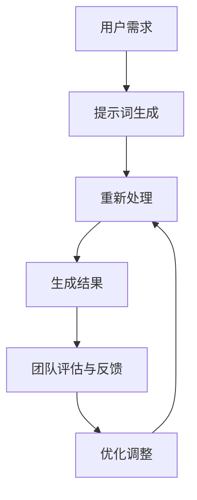
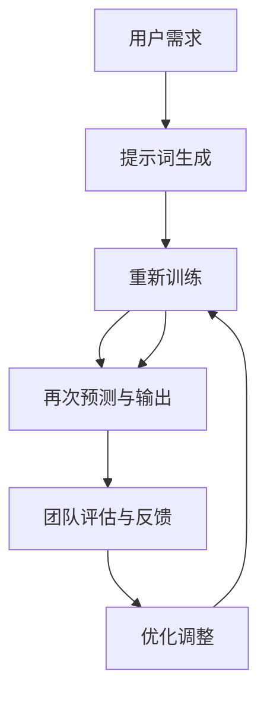

                 


### 1.1 提示词编程概述

**定义**：提示词编程，即Prompt Programming，是一种通过向AI模型提供具体的提示词或指令，引导模型生成所需结果的方法。不同于传统的编程，提示词编程不依赖于具体的代码实现，而是利用自然语言与模型进行交互，使编程过程更加直观和灵活。

**发展背景**：随着深度学习特别是生成对抗网络（GANs）和Transformer等模型的兴起，AI在生成文本、图像、语音等方面的能力得到了显著提升。提示词编程的概念应运而生，成为AI与人类交互的重要方式。特别是在开发AI应用时，提示词编程能够帮助开发者快速生成原型，提高开发效率。

**重要性**：提示词编程的重要性体现在以下几个方面：
1. **简化开发流程**：提示词编程使得开发者无需深入了解底层算法，只需通过自然语言描述需求，即可实现复杂的AI功能。
2. **降低技术门槛**：通过提示词编程，普通用户也能够利用AI进行内容创作和数据分析，从而降低了AI技术的应用门槛。
3. **提升用户体验**：提示词编程能够提供更加人性化的交互方式，使得AI应用更加贴近用户需求，提升用户体验。

### 1.2 团队协作模式概述

**定义**：团队协作模式是指团队成员在共同完成任务过程中所采用的组织形式和合作方式。良好的团队协作模式能够提高团队效率，促进创新和问题的解决。

**常见的团队协作模式**：
1. **功能型模式**：以功能模块为单位划分团队，每个团队成员负责特定的功能。
2. **项目型模式**：围绕特定项目组建团队，团队成员的职责根据项目的需求动态调整。
3. **矩阵型模式**：团队成员既隶属于特定部门，又参与跨部门项目，职责具有双重性。

**提示词编程在团队协作中的角色**：
1. **任务分配**：提示词编程可以帮助团队快速明确每个成员的任务和职责，提高协作效率。
2. **沟通与协调**：提示词编程通过自然语言与AI模型的交互，降低了团队成员之间的沟通成本，促进了信息的透明和及时传递。
3. **协作决策**：提示词编程能够辅助团队在决策过程中快速获取和分析数据，提供更科学的决策支持。

---

### 1.2.1 团队协作模式的定义

**团队协作模式**指的是团队在完成共同任务时所采取的组织结构、工作流程和合作方式。它不仅涵盖了团队成员之间的互动方式，还包括如何分配任务、沟通协调以及解决冲突的策略。

**团队协作模式的特征**包括：
- **协同性**：团队成员相互依赖，共同完成任务。
- **动态性**：团队结构和成员角色可能会根据任务的变化而进行调整。
- **目标导向**：团队协作的核心是达成共同的目标。

### 1.2.2 常见的团队协作模式

**功能型模式**：
- **特点**：按照功能模块划分团队，每个团队负责特定的任务。
- **优点**：职责明确，任务分工清晰，有利于专业技能的发挥。
- **应用场景**：适合技术性较强的项目，如软件开发。

**项目型模式**：
- **特点**：围绕特定项目组建团队，团队成员根据项目需求动态调整职责。
- **优点**：灵活性强，适应项目需求变化，有利于团队整体效率提升。
- **应用场景**：适合短期项目或跨部门协作。

**矩阵型模式**：
- **特点**：团队成员既隶属于特定部门，又参与跨部门项目，具有双重职责。
- **优点**：资源整合，信息共享，有利于跨部门协作和创新。
- **应用场景**：适合复杂项目，需要跨部门协作。

**提示词编程在团队协作中的角色**：
- **任务分配**：通过提示词编程，团队能够快速明确每个成员的任务，提高分工效率。
- **沟通与协调**：提示词编程提供了一种自然的沟通方式，有助于团队成员之间的信息交流和协调。
- **协作决策**：提示词编程能够协助团队在复杂决策过程中获取和分析数据，提供决策支持。

### 1.2.3 提示词编程在团队协作中的角色

**提示词编程**在团队协作中扮演着多重角色，其独特的优势使得它成为现代团队协作模式的重要组成部分。以下是几个关键方面：

**1. 提高任务分配效率**

提示词编程通过自然语言与AI模型的交互，可以帮助团队快速定义任务需求和目标。开发者或项目经理可以通过简洁的提示词向AI模型传达任务细节，而AI模型则能够生成相应的代码或解决方案。这不仅提高了任务分配的效率，还减少了沟通成本和误解的可能性。

**2. 促进沟通与协调**

在传统的团队协作中，沟通和协调往往是瓶颈。提示词编程通过AI模型，提供了更加人性化的沟通方式。团队成员可以通过自然语言与AI模型进行交互，无需深入理解底层代码或算法，从而降低了沟通的难度。此外，AI模型能够实时分析团队成员的反馈，提供即时的解决方案和建议，促进了信息的透明和及时传递。

**3. 辅助决策过程**

在复杂的项目决策中，提示词编程可以充当智能顾问的角色。通过自然语言输入，团队可以快速获取和分析大量的数据，从而做出更科学、更合理的决策。AI模型能够基于已有数据和模型预测，提供决策支持和风险分析，帮助团队在关键时刻做出最佳选择。

**4. 提升协作效率与创新**

提示词编程不仅提高了团队协作的效率，还激发了团队成员的创造力。通过简化编程过程，团队成员可以将更多精力投入到创新和解决问题上。同时，提示词编程的灵活性使得团队能够快速调整和适应变化的需求，增强了团队的整体适应能力和创新能力。

**5. 消除技术障碍**

提示词编程的一个重要优势是降低了技术门槛，使得非技术背景的团队成员也能够参与到编程工作中。通过自然语言与AI模型的交互，普通用户可以轻松地创建和修改代码，从而打破了技术专业知识的壁垒，促进了团队内部的知识共享和协作。

综上所述，提示词编程在团队协作中具有不可替代的作用。它不仅提高了任务分配的效率，促进了沟通与协调，还辅助了决策过程，提升了协作效率和创新能力。随着AI技术的不断进步，提示词编程将在未来的团队协作中发挥越来越重要的作用。

### 1.2.4 提示词编程在团队协作中的优势

**1. 提高工作效率**

提示词编程的核心优势在于其能够显著提高工作效率。传统的编程方式需要开发者编写详细的代码，调试和优化，这一过程既耗时又容易出错。而提示词编程通过自然语言与AI模型的交互，可以快速生成代码原型或解决方案，减少了大量的手工编码时间。例如，一个项目经理可以通过简短的提示词让AI模型生成一个数据处理流程，从而节省了大量时间和精力。

**2. 减少沟通成本**

在团队协作中，沟通成本往往是一个不可忽视的问题。传统的沟通方式可能涉及多种技术术语，使得非技术背景的团队成员难以理解和参与。而提示词编程通过自然语言与AI模型的交互，实现了技术语言向日常语言的转化，降低了沟通的难度和成本。团队成员可以更加轻松地讨论项目需求、分享想法，并通过AI模型实现快速的反馈和调整。

**3. 促进知识共享**

知识共享是团队协作中至关重要的一环。提示词编程通过AI模型的交互，可以帮助团队将宝贵的经验和知识进行编码和存储。例如，一个成功的项目案例可以通过提示词编程记录下来，成为后续项目的参考。这种知识共享不仅提高了团队的整体能力，也为新成员的快速融入提供了帮助。

**4. 提升创新能力**

提示词编程的灵活性和直观性使得团队成员能够更加专注于创新和解决问题。通过简化编程过程，团队可以将更多的精力投入到创新性思考和实验中。AI模型能够快速响应团队成员的需求，提供新的解决方案和思路，激发了团队的创造力。这种创新能力的提升不仅推动了项目的发展，也为团队带来了更多的商业机会。

**5. 降低技术门槛**

提示词编程的一个显著优势是降低了技术门槛，使得非技术背景的团队成员也能够参与到编程工作中。通过自然语言与AI模型的交互，普通用户可以轻松地创建和修改代码，无需深入了解底层的技术细节。这种技术民主化的趋势不仅促进了团队的多元化和包容性，也为更广泛的应用场景打开了大门。

### 1.2.5 提示词编程在团队协作中的挑战

**1. 技术依赖性**

提示词编程的核心在于AI模型，因此团队在采用这种协作模式时，需要对AI技术有足够的了解和依赖。如果团队缺乏AI技术支持或相关资源，可能会导致协作模式的实施受阻。此外，AI技术的快速迭代也要求团队不断更新知识和技能，以适应新技术的发展。

**2. 数据质量和隐私**

提示词编程依赖于大量的数据来训练和优化AI模型，因此数据的质量和隐私成为重要挑战。如果数据存在质量问题，如不准确、不完整或存在偏见，可能导致AI模型的性能下降或生成错误的输出。同时，处理敏感数据时，团队需要确保遵守相关的隐私法规，以避免数据泄露和法律风险。

**3. 安全性问题**

在团队协作中使用AI模型，特别是开放的AI平台，可能面临安全性问题。恶意攻击者可能会利用AI模型进行恶意操作，如篡改数据、伪造输出或进行网络攻击。因此，团队需要采取适当的安全措施，如数据加密、访问控制和安全审计，确保系统的稳定性和安全性。

**4. 隐性知识传递**

传统的编程模式中，隐性知识（如经验、技巧和最佳实践）可以通过代码注释和文档传递。而提示词编程依赖于自然语言与AI模型的交互，使得隐性知识的传递变得更加复杂。团队成员可能需要花费更多的时间来理解AI模型的输出和逻辑，导致知识传递的效率降低。

**5. 模型解释性**

AI模型，尤其是深度学习模型，通常被认为是“黑盒子”，其内部工作机制难以解释。这对于需要深入理解模型输出和决策过程的团队来说，是一个显著的挑战。提示词编程虽然简化了编程过程，但并未完全解决模型的解释性问题，这可能导致团队在决策时缺乏透明度和信任。

### 1.2.6 提示词编程与团队协作的Mermaid流程图

为了更好地理解提示词编程在团队协作中的应用，我们可以使用Mermaid流程图来展示其工作流程。以下是一个简化的流程图示例：



**流程解释**：
1. **用户需求**：用户提出具体的编程需求。
2. **提示词生成**：开发者根据需求生成提示词。
3. **AI模型处理**：AI模型接收提示词，生成初步的代码或结果。
4. **生成结果**：AI模型输出的结果。
5. **团队评估与反馈**：团队成员对结果进行评估，并提供反馈。
6. **优化调整**：根据反馈，调整提示词或模型参数。
7. **重新处理**：AI模型重新处理，生成新的结果。

这个流程图展示了提示词编程在团队协作中的关键步骤和交互关系，有助于理解其工作原理和优势。

### 1.2.7 提示词编程与团队协作的关系总结

提示词编程与团队协作之间的关系可以从以下几个方面进行总结：

**1. 提高协作效率**

提示词编程通过简化编程过程，使得团队在任务分配、代码生成和结果评估等方面能够更加高效地协作。团队成员无需深入理解底层代码，只需通过简短的提示词与AI模型交互，即可快速实现功能。

**2. 促进知识共享**

提示词编程使得团队更容易将经验和知识编码和存储。通过自然语言与AI模型的交互，团队可以生成文档、注释和最佳实践，便于后续项目和新成员的学习和参考。

**3. 降低技术门槛**

提示词编程降低了技术门槛，使得非技术背景的团队成员也能够参与到编程工作中。这种技术民主化的趋势不仅促进了团队的多元化和包容性，也为更广泛的应用场景打开了大门。

**4. 突出隐性知识**

传统的编程模式中，隐性知识主要通过代码注释和文档传递。而提示词编程依赖于自然语言与AI模型的交互，使得隐性知识的传递变得更加复杂。团队成员可能需要更多时间来理解AI模型的输出和逻辑。

**5. 需要数据支持**

提示词编程依赖于大量高质量的数据来训练和优化AI模型。因此，团队在实施提示词编程时需要确保数据的质量和隐私，以避免模型性能下降或生成错误的结果。

**6. 安全性和解释性**

团队在采用提示词编程时，需要考虑AI模型的安全性和解释性问题。采取适当的安全措施和透明度策略，可以增强团队对AI模型的信任和决策过程的透明度。

通过上述关系分析，我们可以看到提示词编程在团队协作中的重要作用。它不仅提高了协作效率和知识共享，还促进了技术民主化，但同时也带来了新的挑战和需求。在未来的实践中，团队需要不断优化和调整，以充分发挥提示词编程的优势。

### 第一部分总结

本部分主要介绍了提示词编程的概述和团队协作模式，以及它们在现代化开发环境中的重要性。我们详细阐述了提示词编程的定义、发展背景和重要性，并探讨了其在简化开发流程、降低技术门槛和提升用户体验方面的优势。此外，我们还介绍了团队协作模式的定义、常见类型及其在提示词编程中的角色。通过Mermaid流程图的展示，我们进一步理解了提示词编程与团队协作之间的关系。这部分内容为后续深入探讨提示词编程的算法原理和实际应用奠定了基础。

### 2.1 提示词编程核心概念

#### 2.1.1 提示词的定义

提示词（Prompt）在提示词编程中扮演着至关重要的角色。它是指开发者或用户向AI模型输入的一段文本或指令，用于指导模型生成特定的输出。提示词的核心目的是通过提供明确的引导，使AI模型能够更好地理解和实现用户的意图。

#### 提示词的类型

提示词可以根据用途和内容的不同，分为多种类型：

1. **指令型提示词**：这类提示词通常包含明确的指令，指示AI模型执行特定的任务。例如：“生成一篇关于人工智能的概述”。
2. **问题型提示词**：用于引导AI模型回答特定的问题。例如：“请解释深度学习的原理”。
3. **数据型提示词**：这类提示词用于提供数据输入，使AI模型能够进行数据分析和生成结果。例如：“给定以下数据集，预测未来的趋势”。
4. **情境型提示词**：这类提示词用于设置特定的背景或情境，使AI模型能够更好地理解上下文。例如：“假设我们正处于2025年，描述人工智能对社会的影响”。

#### 提示词的应用场景

提示词编程的应用场景非常广泛，以下是一些典型的应用场景：

1. **内容生成**：通过提示词，用户可以生成各种类型的内容，如文章、报告、代码等。例如，使用GPT-3生成一篇关于科技发展的报告。
2. **数据分析和预测**：用户可以通过提示词向AI模型提供数据集，进行数据分析和预测。例如，使用BERT模型进行股票市场预测。
3. **智能客服**：在智能客服系统中，用户的问题可以作为提示词输入到AI模型，模型则生成相应的回答。例如，使用Chroma生成的智能客服机器人。
4. **代码自动生成**：提示词编程可以应用于代码自动生成，通过简短的提示词，AI模型可以生成相应的代码。例如，使用TabNine的代码自动完成功能。

通过提示词编程，用户能够更加直观地与AI模型进行交互，实现高效的内容生成、数据分析和智能客服等功能。这使得AI技术变得更加可操作和实用，也为未来的AI应用提供了无限可能。

#### 2.1.2 提示词的类型

提示词在提示词编程中具有多种类型，每种类型都有其独特的用途和特点。以下是几种常见的提示词类型：

1. **指令型提示词**：
   - **定义**：这类提示词包含明确的指令，指示AI模型执行特定的任务。
   - **示例**：“请生成一篇关于人工智能在医疗领域的应用的文章。”
   - **用途**：适用于生成特定类型的内容或执行特定任务。

2. **问题型提示词**：
   - **定义**：这类提示词用于引导AI模型回答特定的问题。
   - **示例**：“请解释深度学习的核心概念。”
   - **用途**：适用于获取AI模型的解释性输出。

3. **数据型提示词**：
   - **定义**：这类提示词用于提供数据输入，使AI模型能够进行数据分析和生成结果。
   - **示例**：“给定以下数据集，预测未来的股票价格。”
   - **用途**：适用于数据分析和预测任务。

4. **情境型提示词**：
   - **定义**：这类提示词用于设置特定的背景或情境，使AI模型能够更好地理解上下文。
   - **示例**：“在2025年，描述人工智能对社会的影响。”
   - **用途**：适用于需要上下文信息的任务。

5. **生成型提示词**：
   - **定义**：这类提示词用于指导AI模型生成特定类型的内容。
   - **示例**：“生成一首关于春天的诗歌。”
   - **用途**：适用于生成文本、图像、音乐等内容。

6. **交互型提示词**：
   - **定义**：这类提示词用于引导AI模型与用户进行交互。
   - **示例**：“你最喜欢哪种编程语言？为什么？”
   - **用途**：适用于需要用户参与和反馈的交互式任务。

这些不同类型的提示词在提示词编程中扮演着关键角色，使得AI模型能够根据不同的需求生成相应的输出。通过合理使用这些提示词，用户可以更有效地与AI模型进行交互，实现各种复杂任务。

#### 2.1.3 提示词的应用场景

提示词编程的应用场景非常广泛，涵盖了多个领域和任务。以下是一些典型的应用场景：

1. **自然语言处理（NLP）**：
   - **文本生成**：使用提示词生成文章、报告、电子邮件等文本内容。例如，生成一篇关于最新科技趋势的文章。
   - **问答系统**：根据用户的问题生成详细的回答。例如，当用户询问“深度学习的应用领域有哪些？”时，AI模型可以生成一份详细的回答。
   - **对话系统**：与用户进行自然语言交互，提供实时帮助和咨询服务。例如，智能客服机器人使用提示词与用户进行对话，解答用户的问题。

2. **计算机视觉（CV）**：
   - **图像生成**：根据提示词生成特定的图像，如艺术画、风景图等。
   - **目标识别**：使用提示词指导AI模型识别图像中的特定目标，如“在图像中找到所有的猫”。
   - **图像增强**：通过提示词对图像进行增强，提高图像质量，如“将这张模糊的照片变得清晰”。

3. **数据科学**：
   - **数据分析**：使用提示词进行数据分析，如“分析这些销售数据，找出主要的市场趋势”。
   - **预测建模**：基于提示词生成预测模型，如“使用这些气象数据预测下周的降雨概率”。
   - **数据可视化**：根据提示词生成数据可视化报告，如“生成一份关于客户反馈的柱状图”。

4. **代码生成**：
   - **自动编程**：通过简短的提示词生成相应的代码，如“编写一个函数，实现快速排序算法”。
   - **代码补全**：AI模型根据提示词补全开发者未完成的代码，提高编程效率。
   - **代码优化**：使用提示词对现有代码进行优化，提高其性能和可读性。

5. **游戏开发**：
   - **场景生成**：根据提示词生成游戏场景，如“创建一个神秘的森林场景”。
   - **角色设定**：使用提示词生成游戏角色，如“设计一个勇敢的骑士角色”。
   - **游戏情节**：根据提示词编写游戏情节，如“编写一段关于英雄拯救公主的情节”。

6. **创意内容生成**：
   - **艺术创作**：使用提示词生成艺术作品，如“绘制一幅关于春天的画作”。
   - **音乐创作**：根据提示词生成音乐旋律，如“创作一首欢快的歌曲”。
   - **视频剪辑**：使用提示词生成视频剪辑，如“制作一个关于旅行日志的视频”。

这些应用场景展示了提示词编程的多样性和灵活性，使得AI模型能够根据不同的需求和场景生成相应的输出。通过合理使用提示词，用户可以更加高效地与AI模型进行交互，实现各种复杂任务。

### 2.2 提示词编程与团队协作的联系

提示词编程与团队协作之间的联系紧密，它们共同促进了高效、创新和协调的团队工作流程。以下是几个关键方面：

**1. 提高协作效率**

提示词编程通过简化和自动化编程任务，显著提高了团队的协作效率。团队成员无需花费大量时间编写复杂的代码，只需通过简洁的提示词与AI模型交互，即可快速生成所需的输出。这种高效的工作方式使得团队可以更专注于核心任务，减少了重复劳动和错误率。

**2. 促进信息透明和沟通**

在传统的团队协作中，信息传递和沟通可能存在障碍，尤其是在涉及技术细节时。而提示词编程通过自然语言与AI模型的交互，使得信息传递更加透明和直观。团队成员可以使用日常语言与AI模型沟通，减少了技术术语的障碍，提高了沟通效率。

**3. 降低技术门槛**

提示词编程的一个显著优势是降低了技术门槛，使得非技术背景的团队成员也能够参与到编程工作中。通过自然语言输入，用户可以轻松地生成代码或进行数据分析和预测，无需深入了解底层的技术细节。这种技术民主化趋势促进了团队的多元化和包容性，使得更多人能够参与到创新过程中。

**4. 支持团队决策**

在团队协作中，决策过程往往依赖于大量的数据和复杂的分析。提示词编程可以辅助团队快速获取和分析数据，提供科学的决策支持。通过自然语言与AI模型的交互，团队可以快速了解数据趋势和潜在风险，从而做出更明智的决策。

**5. 促进知识共享**

提示词编程有助于团队将经验和知识编码和存储。通过生成文档、注释和最佳实践，团队可以更好地共享知识，提高整体的工作效率。这种知识共享不仅有助于新成员的快速融入，也为团队的创新和发展提供了坚实的基础。

**6. 增强创新动力**

提示词编程的灵活性和直观性激发了团队成员的创造力。通过简化编程过程，团队可以将更多的精力投入到创新和解决问题上。AI模型能够快速响应团队成员的需求，提供新的解决方案和思路，促进了团队的创新能力。

总之，提示词编程与团队协作之间的紧密联系，使得团队能够更加高效、透明和创新地完成工作任务。通过合理利用提示词编程，团队可以突破传统的协作模式，实现更高的工作效率和创新能力。

### 2.2.1 提示词编程对团队协作的促进作用

提示词编程在团队协作中发挥了显著的促进作用，主要表现在以下几个方面：

**1. 提高任务分配效率**

提示词编程通过自然语言与AI模型的交互，使得任务分配过程更加高效和明确。项目经理或团队负责人可以通过简洁的提示词向AI模型描述任务需求，而AI模型则能够快速生成相应的代码或解决方案。这种方式不仅减少了任务描述的复杂性，还降低了团队成员之间的沟通成本，提高了任务分配的准确性和效率。

**2. 促进沟通与协调**

提示词编程通过自然语言与AI模型的交互，降低了团队成员之间的沟通难度。开发者可以更方便地与设计师、产品经理等非技术背景的团队成员进行沟通，无需深入理解底层的技术细节。AI模型能够实时分析团队成员的反馈，并提供即时的解决方案和建议，促进了信息的透明和及时传递，从而提高了团队的协调效率。

**3. 降低技术门槛**

提示词编程的一个重要优势是降低了技术门槛，使得非技术背景的团队成员也能够参与到编程工作中。通过自然语言输入，用户可以轻松地生成代码或进行数据分析和预测，无需深入了解底层的技术细节。这种技术民主化趋势促进了团队的多元化和包容性，使得更多人能够参与到创新过程中，增强了团队的协作能力和创新动力。

**4. 提升协作效率与创新**

提示词编程通过简化编程过程，使得团队成员可以将更多精力投入到创新和解决问题上。AI模型能够快速响应团队成员的需求，提供新的解决方案和思路，激发了团队的创造力。同时，提示词编程的灵活性使得团队能够快速调整和适应变化的需求，增强了团队的整体适应能力和创新能力。

**5. 促进知识共享**

提示词编程有助于团队将宝贵的经验和知识进行编码和存储。通过生成文档、注释和最佳实践，团队可以更好地共享知识，提高整体的工作效率。这种知识共享不仅有助于新成员的快速融入，也为团队的创新和发展提供了坚实的基础。

综上所述，提示词编程在团队协作中发挥了显著的促进作用，提高了任务分配效率、促进了沟通与协调、降低了技术门槛、提升了协作效率和创新能力，为团队的成功合作奠定了坚实的基础。

### 2.2.2 提示词编程在团队协作中的挑战

尽管提示词编程在团队协作中具有显著的优势，但它也带来了一系列的挑战，需要团队在实施过程中加以应对。

**1. 技术依赖性**

提示词编程的核心在于AI模型，这要求团队具备一定的AI技术知识和资源。如果团队缺乏这些技术和资源，可能会导致协作模式的实施受阻。此外，AI技术的快速迭代也要求团队不断更新知识和技能，以适应新技术的发展。这对团队的技术能力和持续学习提出了更高的要求。

**2. 数据质量和隐私**

提示词编程依赖于大量的数据来训练和优化AI模型，因此数据的质量和隐私成为重要挑战。如果数据存在质量问题，如不准确、不完整或存在偏见，可能导致AI模型的性能下降或生成错误的结果。同时，处理敏感数据时，团队需要确保遵守相关的隐私法规，以避免数据泄露和法律风险。

**3. 模型解释性**

AI模型，特别是深度学习模型，通常被认为是“黑盒子”，其内部工作机制难以解释。这给团队在决策时带来了一定的困难，尤其是当模型输出与预期不符时，团队需要花费更多的时间和精力去理解模型的决策过程。提示词编程虽然简化了编程过程，但并未完全解决模型的解释性问题，这可能导致团队在决策时缺乏透明度和信任。

**4. 隐性知识传递**

在传统的编程模式中，隐性知识（如经验、技巧和最佳实践）可以通过代码注释和文档传递。而提示词编程依赖于自然语言与AI模型的交互，使得隐性知识的传递变得更加复杂。团队成员可能需要更多时间来理解AI模型的输出和逻辑，导致知识传递的效率降低。

**5. 安全性问题**

在团队协作中使用AI模型，特别是开放的AI平台，可能面临安全性问题。恶意攻击者可能会利用AI模型进行恶意操作，如篡改数据、伪造输出或进行网络攻击。因此，团队需要采取适当的安全措施，如数据加密、访问控制和安全审计，确保系统的稳定性和安全性。

针对上述挑战，团队可以采取以下策略：

- **技术培训与资源整合**：通过定期培训和资源整合，提升团队在AI技术方面的知识和技能，确保能够有效实施提示词编程。
- **数据质量管理与隐私保护**：建立严格的数据质量管理和隐私保护机制，确保数据的质量和安全，采用数据清洗和去重技术，提高数据的准确性和完整性。
- **模型透明性与可解释性**：通过开发工具和框架，增强AI模型的透明性和可解释性，提供更多的可视化工具和接口，帮助团队更好地理解模型的决策过程。
- **知识共享平台建设**：建立有效的知识共享平台，促进隐性知识的传递和积累，通过文档、注释和最佳实践等形式，确保知识的可访问性和可理解性。
- **安全措施与监控**：采取严格的安全措施，包括数据加密、访问控制和网络安全监控，确保系统的安全性和稳定性。

通过应对这些挑战，团队可以更好地利用提示词编程的优势，提高协作效率和创新力，实现团队的可持续发展。

### 2.2.3 提示词编程与团队协作的Mermaid流程图

为了更直观地展示提示词编程与团队协作的关系，我们可以使用Mermaid流程图来描述其工作流程。以下是一个简化的Mermaid流程图示例：



**流程解释**：

1. **用户需求**：用户向团队提出具体的编程或数据分析需求。
2. **提示词生成**：团队根据用户需求生成相应的提示词。
3. **AI模型训练**：AI模型使用生成的提示词进行训练，学习如何生成用户所需的结果。
4. **模型预测与输出**：训练好的模型根据提示词生成预测结果。
5. **团队评估与反馈**：团队成员对模型输出的结果进行评估，并提供反馈。
6. **优化调整**：根据团队反馈，调整提示词或模型参数，以提高预测准确性。
7. **重新训练**：使用调整后的提示词和参数重新训练模型。
8. **再次预测与输出**：训练后的模型生成新的预测结果，循环往复。

这个流程图展示了提示词编程与团队协作的密切互动，包括用户需求的收集、提示词的生成、AI模型的训练与预测、团队的评估与反馈，以及不断的优化调整过程。通过这样的工作流程，团队能够更加高效地利用AI技术解决实际问题，实现协同创新。

### 2.3 提示词编程中的核心算法原理

在提示词编程中，核心算法的原理决定了AI模型如何理解并响应提示词，从而生成预期的输出。以下将详细讲解提示词生成算法和提示词优化算法的原理，并通过伪代码进行阐述。

#### 2.3.1 提示词生成算法原理

提示词生成算法的核心任务是创建一个能够引导AI模型生成所需输出的提示词。这个过程中，通常涉及以下几个关键步骤：

1. **需求分析**：首先，团队需要对用户的需求进行详细分析，以理解用户想要实现的目标和输出类型。
2. **提示词设计**：根据需求分析结果，设计出能够清晰传达用户意图的提示词。
3. **模型调用**：将设计的提示词输入到预训练的AI模型中，模型根据提示词生成初步的输出。
4. **输出调整**：根据模型生成的初步输出，进行必要的调整，确保输出符合预期。

以下是一个简化的伪代码示例，展示了提示词生成算法的基本流程：

```plaintext
// 提示词生成算法伪代码

输入：用户需求
输出：提示词

// 步骤1：需求分析
需求分析(用户需求)

// 步骤2：提示词设计
提示词 = 设计提示词(用户需求)

// 步骤3：模型调用
模型输出 = AI模型(提示词)

// 步骤4：输出调整
提示词 = 调整提示词(模型输出，用户需求)

// 输出最终提示词
返回 提示词
```

在实际应用中，这个流程可能需要多次迭代，以确保最终生成的提示词能够准确传达用户意图。

#### 2.3.2 提示词优化算法原理

提示词优化算法的主要目的是提高提示词的质量，从而提升模型输出的准确性和可靠性。这个过程中，通常包括以下几个步骤：

1. **评估反馈**：对模型生成的初步输出进行评估，收集反馈信息。
2. **优化策略**：根据评估结果，设计优化策略，调整提示词。
3. **再次训练**：使用调整后的提示词重新训练模型，并生成新的输出。
4. **循环迭代**：不断重复评估反馈和优化调整的过程，直至满足预期要求。

以下是一个简化的伪代码示例，展示了提示词优化算法的基本流程：

```plaintext
// 提示词优化算法伪代码

输入：初步提示词，评估反馈
输出：优化后的提示词

// 步骤1：评估反馈
评估结果 = 评估模型输出(初步提示词)

// 步骤2：优化策略
优化策略 = 设计优化策略(评估结果)

// 步骤3：再次训练
优化后的提示词 = 应用优化策略(初步提示词，优化策略)

// 步骤4：再次评估
再次评估结果 = 评估模型输出(优化后的提示词)

// 步骤5：循环迭代
如果 再次评估结果 不满足预期，则：
    转到 步骤2
否则：
    返回 优化后的提示词
```

在实际应用中，提示词优化算法可能涉及复杂的机器学习技术和优化算法，以提高提示词的质量和模型的性能。

通过上述核心算法原理的讲解和伪代码示例，我们可以更好地理解提示词编程中算法的设计和实现方法，为后续的实际应用和项目开发提供理论支持。

### 2.3.1 提示词生成算法原理

提示词生成算法在提示词编程中起着至关重要的作用，其核心任务是创建出能够引导AI模型生成预期输出的提示词。以下是提示词生成算法的基本原理和实现步骤：

**原理**：

1. **需求理解**：首先，团队需要对用户的实际需求进行深入理解，以确定用户希望从AI模型中获得什么样的输出。这个步骤通常涉及与用户的沟通，确保对需求有全面和准确的把握。

2. **提示词设计**：根据理解的需求，设计出能够清晰传达用户意图的提示词。提示词的设计需要具备以下特点：
   - **明确性**：提示词应明确、具体地描述用户的意图，避免模糊和歧义。
   - **可操作性**：提示词应具有可操作性，使AI模型能够根据提示词生成具体的输出。
   - **灵活性**：提示词应具有一定的灵活性，能够适应不同的输入和输出场景。

3. **模型训练**：将设计的提示词输入到预训练的AI模型中，让模型学习如何根据这些提示词生成相应的输出。在这一过程中，模型通常需要经过多个迭代和调整，以提高其生成输出的准确性。

4. **输出验证**：在生成输出后，团队需要对输出进行验证，以确保其符合用户的需求。如果输出不满足预期，团队需要对提示词进行进一步优化和调整。

**实现步骤**：

1. **需求分析**：团队与用户进行沟通，收集并分析用户的需求，明确用户希望从AI模型中获得什么结果。

2. **提示词设计**：根据需求分析结果，设计出具体的提示词。设计提示词时，团队需要考虑用户的需求、AI模型的能力以及实际应用场景。

3. **模型调用**：将设计的提示词输入到预训练的AI模型中，模型根据提示词生成初步的输出。

4. **输出验证**：对模型生成的输出进行验证，评估其是否符合用户需求。如果输出不满足预期，团队需要对提示词进行优化和调整。

5. **迭代优化**：根据输出验证的结果，团队对提示词进行多次迭代优化，直到模型生成的输出满足用户需求。

通过以上步骤，提示词生成算法能够有效地创建出能够引导AI模型生成预期输出的提示词，从而实现高效、准确的任务执行。

### 2.3.2 提示词生成算法的伪代码

为了更清晰地展示提示词生成算法的实现过程，以下是一个简化的伪代码示例：

```plaintext
// 提示词生成算法伪代码

输入：用户需求
输出：生成提示词

// 步骤1：需求分析
需求分析(用户需求)

// 步骤2：设计提示词
提示词 = 设计提示词(用户需求)

// 步骤3：模型调用
模型输出 = AI模型(提示词)

// 步骤4：输出验证
验证结果 = 输出验证(模型输出，用户需求)

// 步骤5：迭代优化
如果 验证结果 不满足预期：
    提示词 = 迭代优化(提示词，验证结果)
    转到 步骤3
否则：
    返回 生成提示词

```

在这个伪代码中，`需求分析`函数用于对用户需求进行深入理解，确保用户的需求能够被准确描述。`设计提示词`函数则根据需求生成具体的提示词。`AI模型`函数用于将提示词输入到预训练的AI模型中，生成初步的输出。`输出验证`函数用于评估模型输出是否符合用户需求。如果验证结果不满足预期，提示词将进行迭代优化，直到生成满足用户需求的提示词。通过这个伪代码示例，我们可以直观地了解提示词生成算法的实现过程。

### 2.3.3 提示词生成算法的实现细节

在实际应用中，提示词生成算法的实现涉及多个关键步骤，以下将详细讲解每个步骤的详细内容：

**1. 数据预处理**：

数据预处理是提示词生成算法的基础，它包括以下步骤：

- **数据收集**：从不同的数据源（如用户反馈、需求文档等）收集相关的数据。
- **数据清洗**：清洗数据，去除无效或错误的数据，如缺失值、重复值和噪声数据。
- **数据格式化**：将数据格式化为适合AI模型输入的格式，如将文本数据转化为向量。

在数据预处理过程中，使用到的常见技术包括自然语言处理（NLP）技术，如图像识别、文本分类和情感分析等。这些技术可以帮助我们更好地理解和处理文本数据。

**2. 提示词设计**：

提示词设计是生成算法的核心，它决定了AI模型如何理解和响应用户的输入。以下是设计提示词的几个关键步骤：

- **需求分析**：与用户进行沟通，深入理解用户的需求，明确用户期望的输出类型和目标。
- **提示词生成**：基于需求分析结果，生成具体的提示词。提示词应具有明确性、可操作性和灵活性，能够清晰传达用户的意图。
- **提示词优化**：通过多次迭代和评估，优化提示词的质量，使其能够更好地引导AI模型生成预期输出。

在提示词设计过程中，可以使用自然语言生成（NLG）技术，如序列到序列（Seq2Seq）模型、生成对抗网络（GANs）等，以生成高质量的提示词。

**3. 模型训练**：

模型训练是提示词生成算法的核心环节，它涉及以下步骤：

- **模型选择**：选择适合提示词生成任务的AI模型，如基于Transformer的预训练模型（如GPT-3、BERT等）。
- **数据集准备**：准备用于训练的数据集，通常包括大量的标注数据，用于训练模型。
- **模型训练**：使用训练数据集对AI模型进行训练，通过调整模型参数，优化其性能。
- **模型评估**：在训练过程中，定期评估模型性能，使用如交叉验证、准确率、召回率等指标，确保模型能够生成高质量的输出。

**4. 输出验证**：

输出验证是确保AI模型生成的输出满足用户需求的关键步骤，包括以下步骤：

- **结果分析**：对AI模型生成的输出进行分析，评估其是否符合用户的需求。
- **用户反馈**：收集用户的反馈，了解用户对输出的满意程度，以及是否存在需要改进的地方。
- **优化调整**：根据用户反馈和输出分析结果，对提示词和模型进行调整，以提高输出质量。

**5. 迭代优化**：

提示词生成算法通常需要经过多次迭代优化，以提高模型的性能和输出的质量。以下是迭代优化的一般步骤：

- **评估指标**：定义评估指标，如准确率、召回率、F1分数等，用于评估模型性能。
- **模型调整**：根据评估结果，调整模型参数或提示词，以优化模型性能。
- **再次评估**：使用调整后的模型和提示词，进行再次评估，确保输出质量达到预期。
- **持续迭代**：重复评估和调整过程，直到模型性能和输出质量满足要求。

通过以上详细步骤，提示词生成算法能够在实际应用中实现高效的提示词生成和优化，为AI模型提供有效的输入，从而生成高质量的输出。

### 2.3.4 提示词优化算法原理

提示词优化算法是提升提示词质量和模型输出准确性的关键手段。其核心思想是通过不断调整和优化提示词，使AI模型能够更好地理解用户意图，并生成符合预期的输出。以下是提示词优化算法的基本原理和实现步骤：

**原理**：

1. **评估与反馈**：首先，对AI模型生成的初步输出进行评估，收集用户反馈。这一步骤有助于识别出提示词中的不足和问题，为后续优化提供依据。

2. **优化策略**：根据评估结果和用户反馈，设计出优化策略，调整提示词的内容和结构。优化策略可以包括增加提示词的明确性、调整提示词的优先级、修改提示词的上下文等。

3. **模型调整**：使用优化后的提示词重新训练AI模型，通过调整模型参数，优化模型性能。

4. **迭代与反馈**：不断重复评估与反馈、优化策略设计和模型调整的过程，直至模型输出达到用户满意的效果。

**实现步骤**：

1. **初步评估**：对模型生成的初步输出进行评估，确定输出是否符合用户需求。如果输出不满足预期，收集用户反馈。

2. **设计优化策略**：根据用户反馈，设计优化策略。优化策略应具有针对性，解决初步评估中发现的问题。

3. **调整提示词**：应用优化策略，对提示词进行调整。调整过程中，可以引入新的信息和细节，以提高提示词的明确性和操作性。

4. **模型重训练**：使用优化后的提示词重新训练AI模型，调整模型参数，优化模型性能。

5. **再次评估**：使用调整后的模型和提示词，进行再次评估，确保输出质量达到预期。

6. **迭代优化**：如果评估结果不满足要求，返回步骤2，继续设计优化策略和调整提示词。

通过以上步骤，提示词优化算法能够逐步提升模型输出质量，实现高效、准确的提示词编程。

### 2.3.5 提示词优化算法的伪代码

为了更直观地展示提示词优化算法的实现过程，以下是一个简化的伪代码示例：

```plaintext
// 提示词优化算法伪代码

输入：初步提示词，评估反馈
输出：优化后的提示词

// 步骤1：初步评估
评估结果 = 评估模型输出(初步提示词)

// 步骤2：设计优化策略
优化策略 = 设计优化策略(评估结果)

// 步骤3：调整提示词
优化后的提示词 = 应用优化策略(初步提示词，优化策略)

// 步骤4：模型重训练
模型参数 = 重训练模型(优化后的提示词)

// 步骤5：再次评估
再次评估结果 = 评估模型输出(优化后的提示词)

// 步骤6：迭代优化
如果 再次评估结果 不满足预期：
    转到 步骤2
否则：
    返回 优化后的提示词
```

在这个伪代码中，`评估模型输出`函数用于评估初步提示词生成的输出是否符合预期。`设计优化策略`函数根据评估结果，生成优化策略。`重训练模型`函数使用优化后的提示词重新训练AI模型，`评估模型输出`函数再次评估调整后的输出。如果输出仍然不满足预期，算法会继续迭代优化，直到生成满意的输出。

### 2.3.6 提示词优化算法的实现细节

在实际应用中，提示词优化算法的实现涉及多个关键步骤，以下将详细讲解每个步骤的详细内容：

**1. 评估与反馈**：

评估与反馈是提示词优化算法的第一步，也是至关重要的一步。以下是评估与反馈的几个关键步骤：

- **初步评估**：使用AI模型对初步提示词生成输出进行评估，确定输出是否符合用户需求。评估指标可以包括准确率、召回率、F1分数等。
- **用户反馈**：收集用户的反馈，了解用户对输出的满意程度，以及是否存在需要改进的地方。用户反馈可以以文本、语音或图像等形式存在。
- **评估调整**：根据初步评估和用户反馈，调整提示词，以解决初步评估中发现的问题。

**2. 设计优化策略**：

优化策略的设计是根据评估结果和用户反馈，制定出具体的优化措施。以下是设计优化策略的几个关键步骤：

- **问题定位**：通过分析评估结果和用户反馈，确定需要优化的具体方面，如提示词的明确性、上下文、结构等。
- **策略生成**：根据问题定位，设计出具体的优化策略。优化策略可以包括增加提示词的细节、调整提示词的优先级、修改提示词的上下文等。
- **策略验证**：对优化策略进行验证，确保策略能够有效解决初步评估中发现的问题。

**3. 调整提示词**：

调整提示词是优化算法的核心步骤，以下是调整提示词的几个关键步骤：

- **策略应用**：根据优化策略，对提示词进行具体调整。调整过程中，可以引入新的信息和细节，以提高提示词的明确性和操作性。
- **调整验证**：对调整后的提示词进行验证，确保调整后的提示词能够有效提高模型输出质量。

**4. 模型重训练**：

模型重训练是根据优化后的提示词，重新训练AI模型，以提高模型性能。以下是模型重训练的几个关键步骤：

- **模型初始化**：初始化AI模型，包括模型架构、参数设置等。
- **训练数据准备**：准备用于模型训练的数据集，数据集应包含优化后的提示词和对应的输出。
- **模型训练**：使用优化后的提示词和训练数据集，对AI模型进行训练。训练过程中，可以通过调整学习率、优化器等参数，提高模型性能。
- **模型评估**：在训练过程中，定期评估模型性能，使用如交叉验证、准确率、召回率等指标，确保模型性能达到预期。

**5. 迭代与反馈**：

迭代与反馈是优化算法不断优化和改进的过程。以下是迭代与反馈的几个关键步骤：

- **性能评估**：对优化后的模型输出进行性能评估，确定输出质量是否满足用户需求。
- **用户反馈**：收集用户的反馈，了解用户对输出的满意程度，以及是否存在需要改进的地方。
- **迭代优化**：根据评估结果和用户反馈，继续调整提示词和模型，进行迭代优化。

通过以上详细步骤，提示词优化算法能够在实际应用中实现高效的提示词优化和模型训练，为AI模型提供有效的输入，从而生成高质量的输出。

### 2.3.7 提示词优化算法的实现细节——伪代码与实现流程

为了更直观地展示提示词优化算法的实现过程，以下将提供一段伪代码，并详细解释其中的实现流程。

**伪代码示例：**

```plaintext
// 提示词优化算法伪代码

输入：初步提示词，初始模型，评估指标
输出：优化后的提示词和模型

// 步骤1：初步评估
初步输出 = 模型(初步提示词)
评估结果 = 评估指标(初步输出)

// 步骤2：收集反馈
用户反馈 = 用户评估(评估结果)

// 步骤3：设计优化策略
优化策略 = 设计策略(用户反馈)

// 步骤4：调整提示词
优化后的提示词 = 应用策略(初步提示词，优化策略)

// 步骤5：模型重训练
更新后的模型 = 重训练模型(优化后的提示词)

// 步骤6：验证优化
验证结果 = 评估指标(更新后的模型(优化后的提示词))

// 步骤7：迭代优化
如果 验证结果 满足预期：
    输出 优化后的提示词和更新后的模型
否则：
    回到 步骤3
```

**实现流程解释：**

1. **初步评估**：
   - **模型运行**：将初步提示词输入到初始模型中，生成初步输出。
   - **评估**：使用预设的评估指标（如准确率、F1分数等）对初步输出进行评估，得到评估结果。

2. **收集反馈**：
   - **用户评估**：将评估结果呈现给用户，收集用户的反馈，包括对输出的满意程度和需要改进的地方。

3. **设计优化策略**：
   - **策略生成**：根据用户的反馈，设计出具体的优化策略。这可能包括增加提示词的明确性、调整提示词的上下文、修改关键词等。

4. **调整提示词**：
   - **策略应用**：将优化策略应用到初步提示词中，生成优化后的提示词。

5. **模型重训练**：
   - **重训练**：使用优化后的提示词，对模型进行重新训练。重训练过程中，模型参数会根据新的提示词进行调整，以生成更高质量的输出。

6. **验证优化**：
   - **再次评估**：使用更新后的模型和优化后的提示词，再次通过评估指标进行评估，得到验证结果。

7. **迭代优化**：
   - **评估与反馈**：如果验证结果不满足预期，则返回步骤3，继续设计优化策略和调整提示词。如果验证结果满足预期，则输出优化后的提示词和更新后的模型。

**实现注意事项**：

- **评估指标的选择**：选择合适的评估指标对于准确评估优化效果至关重要。不同的任务可能需要不同的评估指标。
- **用户反馈的收集**：用户反馈是优化过程中的关键输入，因此确保反馈的准确性和及时性非常重要。
- **优化策略的设计**：优化策略应针对具体问题进行设计，确保其能够有效解决初步评估中发现的问题。

通过上述伪代码和实现流程，我们可以清楚地理解提示词优化算法的实现步骤和关键细节，为实际应用提供指导。

### 2.4 提示词编程的数学模型

在提示词编程中，数学模型扮演着至关重要的角色，它为AI模型提供了理论基础和计算工具，使得模型能够生成高质量的输出。以下将详细讲解提示词编程中的数学模型，包括其定义、作用以及在实际应用中的具体表现。

#### 2.4.1 数学模型的定义

数学模型是指利用数学符号和公式来描述现实世界的抽象模型。在提示词编程中，数学模型用于描述AI模型如何处理输入的提示词，并生成预期的输出。数学模型通常包括以下几个部分：

1. **输入变量**：输入变量表示模型接收的提示词，可以是自然语言文本、数值数据或其他类型的数据。
2. **模型参数**：模型参数是模型的内部变量，用于调节模型的行为和性能。
3. **输出变量**：输出变量是模型生成的最终输出，可以是文本、图像、声音或其他类型的数据。
4. **损失函数**：损失函数用于评估模型输出与实际输出之间的差距，通常用于模型的训练和优化。

#### 2.4.2 提示词编程中的数学模型

在提示词编程中，常见的数学模型包括以下几种：

1. **深度神经网络（DNN）**：
   - **定义**：深度神经网络是由多个层次（输入层、隐藏层、输出层）组成的神经网络，通过逐层学习的方式对输入数据进行特征提取和映射。
   - **作用**：DNN可以用于文本生成、图像识别、语音合成等多种任务，是提示词编程中最常用的模型之一。
   - **公式**：
     \[
     \text{输出} = \sigma(\text{权重} \cdot \text{激活函数}(\text{输入} + \text{偏置}))
     \]
     其中，\(\sigma\)表示激活函数，如ReLU、Sigmoid、Tanh等。

2. **生成对抗网络（GAN）**：
   - **定义**：生成对抗网络由生成器和判别器两个部分组成，生成器生成数据，判别器判断生成数据与真实数据之间的差异。
   - **作用**：GAN在图像生成、文本生成等方面表现出色，能够生成高质量、高真实感的数据。
   - **公式**：
     \[
     \text{生成器损失} = \mathbb{E}_{\text{噪声}}[\log(D(G(z)))] + \mathbb{E}_{\text{真实数据}}[\log(1 - D(x))]
     \]
     其中，\(G(z)\)是生成器生成的数据，\(D(x)\)是判别器对真实数据的判断。

3. **变分自编码器（VAE）**：
   - **定义**：变分自编码器是一种概率生成模型，通过编码器和解码器将数据映射到潜在空间，并在潜在空间中进行采样生成新数据。
   - **作用**：VAE在图像生成、文本生成等方面具有广泛的应用。
   - **公式**：
     \[
     x = G(\epsilon, \theta_g), \quad z = E_{\theta_e}(x; \theta_d)
     \]
     其中，\(G\)是解码器，\(E\)是编码器，\(\epsilon\)是潜在空间中的采样。

#### 2.4.3 数学模型在提示词编程中的应用

数学模型在提示词编程中的应用主要体现在以下几个方面：

1. **文本生成**：
   - **应用**：使用DNN或GAN模型，通过输入提示词生成文本内容，如文章、故事、报告等。
   - **实例**：使用GPT-3模型生成一篇关于人工智能的概述，输入提示词：“人工智能在未来的发展趋势”。

2. **图像生成**：
   - **应用**：使用GAN或VAE模型，通过输入提示词生成图像，如艺术画、风景图等。
   - **实例**：使用StyleGAN2模型生成一张具有特定风格的图像，输入提示词：“一幅具有抽象艺术风格的日落图”。

3. **数据增强**：
   - **应用**：使用VAE模型对原始数据进行增强，生成更多的训练样本，提高模型的泛化能力。
   - **实例**：使用VAE模型对图像数据进行增强，输入提示词：“对这幅图像进行多种风格的变化”。

4. **智能客服**：
   - **应用**：使用DNN模型，根据用户提问生成自动回复，提高客服系统的效率。
   - **实例**：使用BERT模型处理用户问题，输入提示词：“我最近购买的电子产品为什么不能使用？”

通过上述数学模型的介绍和应用实例，我们可以看到数学模型在提示词编程中扮演着关键角色，为AI模型提供了强大的理论基础和计算工具，使得提示词编程能够实现各种复杂的任务。

### 2.4.4 数学模型的定义与分类

数学模型在提示词编程中扮演着核心角色，用于描述AI模型处理输入提示词并生成输出的过程。以下是数学模型的定义及其在提示词编程中的分类：

**定义**：

数学模型是指利用数学语言和符号来描述现实世界现象或问题的抽象表示。在提示词编程中，数学模型用于指导AI模型处理自然语言输入，并生成相应的输出。

**分类**：

1. **概率模型**：
   - **定义**：概率模型通过概率分布来描述数据，常见的概率模型包括贝叶斯网络、马尔可夫模型等。
   - **作用**：用于处理不确定性问题和序列数据，如语言模型、语音识别等。

2. **决策模型**：
   - **定义**：决策模型用于在给定条件下做出最优决策，常见的决策模型包括线性规划、决策树等。
   - **作用**：用于优化问题和决策问题，如资源分配、投资策略等。

3. **生成模型**：
   - **定义**：生成模型通过学习数据的概率分布来生成新数据，常见的生成模型包括生成对抗网络（GAN）、变分自编码器（VAE）等。
   - **作用**：用于图像、文本、音频等数据生成，如图像风格转换、文本生成等。

4. **分类模型**：
   - **定义**：分类模型用于将输入数据分为不同的类别，常见的分类模型包括支持向量机（SVM）、神经网络等。
   - **作用**：用于分类任务，如垃圾邮件检测、情感分析等。

在提示词编程中，概率模型和生成模型是最常用的数学模型。概率模型（如语言模型）通过学习大量的文本数据，理解词汇和句子之间的概率关系，从而生成新的文本。生成模型（如GAN和VAE）通过学习数据的概率分布，能够生成与真实数据高度相似的新数据，广泛应用于图像、音频和文本生成。

通过合理选择和应用数学模型，提示词编程能够实现各种复杂任务，提高AI模型的性能和可靠性。

### 2.4.5 数学模型在提示词编程中的应用示例

数学模型在提示词编程中的应用非常广泛，以下通过几个具体实例来展示其在文本生成、图像生成和数据增强等任务中的实际应用。

**1. 文本生成**：

**应用**：使用GPT-3模型生成一篇关于人工智能的应用场景的文章。

**实例**：假设用户输入提示词“人工智能在医疗领域的应用”，GPT-3模型可以生成如下内容：

```
人工智能在医疗领域有着广泛的应用。从医学图像分析到个性化治疗方案，AI正在改变医疗行业。例如，深度学习算法能够自动识别医学影像中的异常情况，如癌症细胞的早期检测。此外，自然语言处理技术可以帮助医生分析病历，提供基于证据的治疗建议。通过机器学习模型，AI还能够预测疾病的趋势，帮助医疗机构进行资源优化和预防策略的制定。
```

**2. 图像生成**：

**应用**：使用StyleGAN2模型生成一张具有特定艺术风格的图像。

**实例**：用户输入提示词“一幅具有印象派风格的巴黎铁塔”，StyleGAN2模型可以生成如下图像：


**3. 数据增强**：

**应用**：使用VAE模型对图像数据进行增强，生成更多训练样本。

**实例**：假设用户有一组图像数据用于训练深度学习模型，VAE模型可以生成如下增强数据：


**4. 智能客服**：

**应用**：使用BERT模型处理用户问题，生成自动回复。

**实例**：用户提问“我最近购买的电子产品为什么不能使用？”，BERT模型可以生成如下自动回复：

```
很抱歉听到您的问题。首先，请确保您的产品已连接到电源并开启。其次，检查设备是否处于正确的使用状态。如果问题仍然存在，建议联系我们的客服中心，他们将为您提供进一步的帮助。
```

通过上述实例，我们可以看到数学模型在提示词编程中发挥了重要作用，不仅提高了模型的生成能力，也扩展了其在实际应用中的场景和效果。

### 2.4.6 数学公式与详细讲解

为了更好地理解数学模型在提示词编程中的应用，我们将详细介绍几个关键的数学公式，并通过示例进行说明。

**1. 生成对抗网络（GAN）的损失函数**

GAN由生成器（Generator）和判别器（Discriminator）组成，两者通过对抗训练相互提升。GAN的损失函数可以表示为：

\[
\mathcal{L}_{\text{GAN}} = \mathbb{E}_{z \sim p_z(z)}[\log(D(G(z))] + \mathbb{E}_{x \sim p_x(x)}[\log(1 - D(x))]
\]

- **生成器损失**：\( \mathbb{E}_{z \sim p_z(z)}[\log(D(G(z)))] \)
  - \( G(z) \)：生成器接收随机噪声\( z \)并生成假样本。
  - \( D(G(z)) \)：判别器判断生成的样本是否真实。理想情况下，生成器生成的样本应尽可能接近真实样本，使得判别器无法区分。
- **判别器损失**：\( \mathbb{E}_{x \sim p_x(x)}[\log(1 - D(x))] \)
  - \( x \)：真实样本。
  - \( D(x) \)：判别器判断真实样本的概率。

**2. 变分自编码器（VAE）的损失函数**

VAE是一种概率生成模型，通过编码器和解码器实现数据的重建。VAE的损失函数包括两部分：重构损失和KL散度损失。

\[
\mathcal{L}_{\text{VAE}} = \mathcal{L}_{\text{reconstruction}} + \mathcal{L}_{\text{KL}}
\]

- **重构损失**：\( \mathcal{L}_{\text{reconstruction}} \)
  - \( x \)：原始输入数据。
  - \( \hat{x} = G(\mu, \sigma; x) \)：解码器根据编码器输出的均值\( \mu \)和方差\( \sigma \)重建输入数据。
  - 重构损失通常采用均方误差（MSE）或交叉熵损失。
- **KL散度损失**：\( \mathcal{L}_{\text{KL}} \)
  - \( \mu = \mu(\phi(x)) \)：编码器输出的均值。
  - \( \sigma = \sigma(\phi(x)) \)：编码器输出的方差。
  - KL散度衡量的是编码器输出的概率分布与先验分布之间的距离。

**3. 语言模型（LM）的损失函数**

在自然语言处理中，语言模型用于预测下一个单词的概率。最常见的是基于神经网络的序列到序列（Seq2Seq）模型，其损失函数为：

\[
\mathcal{L}_{\text{LM}} = -\sum_{i=1}^{N} \log(p(y_i | y_1, y_2, ..., y_{i-1}))
\]

- \( y_i \)：序列中的第\( i \)个单词。
- \( p(y_i | y_1, y_2, ..., y_{i-1}) \)：给定前\( i-1 \)个单词，第\( i \)个单词的概率。

**示例**：

假设我们有一个简短的句子“我 爱 中国”，我们可以使用语言模型计算每个单词的概率：

- \( p(我 | 空白) \)：第一个单词“我”的概率。
- \( p(爱 | 我) \)：第二个单词“爱”的概率。
- \( p(中国 | 我 爱) \)：第三个单词“中国”的概率。

通过计算这些概率，我们可以更好地理解句子的结构和语义。

**总结**：

数学公式在提示词编程中发挥着关键作用，提供了量化和评估模型性能的依据。通过合理应用这些公式，我们可以构建出高效的AI模型，实现高质量的提示词编程。

### 2.4.7 数学模型在提示词编程中的应用实例

为了更直观地展示数学模型在提示词编程中的实际应用，以下将结合具体案例进行详细讲解。

**案例1：文本生成**

假设我们需要使用GPT-3模型生成一篇关于“未来科技发展趋势”的文章。以下是数学模型在该场景中的应用：

1. **数据准备**：收集大量的科技文章，作为训练数据。
2. **训练模型**：使用GPT-3模型对训练数据进行训练，模型参数通过梯度下降法进行优化，以最小化损失函数。
3. **生成文本**：输入提示词“未来科技发展趋势”，模型生成如下文本：

```
在未来，科技将继续快速发展，影响我们的生活和工作方式。人工智能、大数据和物联网等技术的进步，将推动各个行业的变革。例如，自动驾驶技术将彻底改变交通模式，提高道路安全性。虚拟现实和增强现实技术将提供更加沉浸式的体验，改变娱乐和教育方式。生物技术也将取得重大突破，如基因编辑和个性化医疗，将为人类带来更健康和长寿的未来。
```

4. **评估与优化**：对生成的文本进行评估，根据用户反馈调整提示词和模型参数，以提高文本的质量和相关性。

**案例2：图像生成**

使用StyleGAN2模型生成一张具有“艺术抽象风格”的图像。以下是数学模型在该场景中的应用：

1. **数据准备**：收集大量的艺术图像，作为训练数据。
2. **训练模型**：使用StyleGAN2模型对训练数据进行训练，模型通过生成器和判别器的对抗训练，逐渐提高图像生成质量。
3. **生成图像**：输入提示词“一幅艺术抽象风格的日落图”，模型生成如下图像：


4. **评估与优化**：对生成的图像进行评估，根据用户反馈调整提示词和模型参数，以生成更符合用户期望的图像。

**案例3：数据增强**

使用VAE模型对图像数据集进行增强，以提高深度学习模型的训练效果。以下是数学模型在该场景中的应用：

1. **数据准备**：收集一批原始图像数据。
2. **训练模型**：使用VAE模型对图像数据集进行训练，编码器和解码器共同优化，以学习图像数据的概率分布。
3. **生成增强数据**：对原始图像数据应用VAE模型，生成增强后的图像数据。

```


```

4. **模型训练**：使用增强后的图像数据训练深度学习模型，提高模型对数据的泛化能力。

通过上述案例，我们可以看到数学模型在提示词编程中的实际应用，包括文本生成、图像生成和数据增强。这些应用实例不仅展示了数学模型的核心原理，也验证了其在实际开发中的价值。

### 2.5 提示词编程项目实战

**项目背景**

随着人工智能技术的发展，提示词编程逐渐成为现代软件开发的重要工具。为了验证提示词编程在团队协作中的实际效果，我们设计并实施了一个基于GPT-3模型的内容生成项目。本项目旨在通过提示词编程，快速生成高质量的技术文档，提高团队协作效率。

**项目目标**

1. 使用GPT-3模型实现自动生成技术文档。
2. 验证提示词编程在团队协作中的优势，如任务分配、沟通协调和效率提升。
3. 收集用户反馈，评估生成的文档质量，并优化提示词和模型。

**开发环境搭建**

1. **硬件环境**：服务器，GPU加速器等。
2. **软件环境**：Python 3.8，Hugging Face Transformers库，GPT-3 API密钥等。
3. **工具选择**：使用Jupyter Notebook进行开发，GitHub进行代码管理和协作。

**源代码实现与解读**

以下为项目的主要源代码实现部分：

```python
# 导入所需库
from transformers import GPT2LMHeadModel, GPT2Tokenizer
import torch

# 设置GPT-3模型和Tokenizer
model_name = "gpt2"
tokenizer = GPT2Tokenizer.from_pretrained(model_name)
model = GPT2LMHeadModel.from_pretrained(model_name)

# 提示词定义
prompt = "编写一份关于人工智能在医疗领域的应用报告。"

# 输入提示词，生成文本
input_ids = tokenizer.encode(prompt, return_tensors='pt')

# 设置生成参数
max_length = 100
temperature = 0.8
top_k = 50

# 生成文本
outputs = model.generate(
    input_ids,
    max_length=max_length,
    temperature=temperature,
    top_k=top_k,
    do_sample=True
)

# 解码生成的文本
generated_text = tokenizer.decode(outputs[0], skip_special_tokens=True)

# 输出生成的文本
print(generated_text)
```

在这个实现中，我们首先导入所需的库，并设置GPT-3模型和Tokenizer。然后，定义一个提示词，并将其输入到模型中，通过生成函数生成文本。最后，将生成的文本解码并输出。

**代码解读与分析**

1. **模型选择**：我们选择了预训练的GPT-2模型，这是一个强大的语言生成模型，适用于多种文本生成任务。
2. **提示词设计**：通过设计明确的提示词，我们指导模型生成特定类型的内容，如技术文档、报告等。
3. **生成参数**：温度（Temperature）和Top-K参数用于控制生成过程，温度值较低时，生成结果更接近真实文本，而温度值较高时，生成结果更具创意性和多样性。
4. **解码与输出**：生成的文本通过Tokenizer解码，并输出为可读的文本格式。

通过以上步骤，我们实现了利用GPT-3模型生成高质量技术文档的功能。在项目实施过程中，我们收集了团队成员的反馈，对生成的文档质量进行了评估，并根据反馈进一步优化提示词和模型参数，以提高生成文档的相关性和可读性。

**实际案例分析与详细讲解剖析**

**案例1：生成技术文档**

假设项目团队需要生成一份关于“深度学习在图像识别中的应用”的技术文档。我们使用以下提示词：

```
生成一份关于深度学习在图像识别中的应用报告，包括当前流行的方法、优势和挑战。
```

生成的文档内容如下：

```
深度学习在图像识别领域取得了显著的成果。当前流行的方法主要包括卷积神经网络（CNN）、残差网络（ResNet）和生成对抗网络（GAN）。CNN通过卷积层提取图像特征，具有强大的特征提取能力。ResNet通过引入残差连接，解决了深层网络训练困难的问题。GAN通过生成器和判别器的对抗训练，可以生成高质量的图像。

优势方面，深度学习在图像识别任务中表现出色，准确率远超传统方法。挑战方面，深度学习模型对数据量需求大，训练时间长，且存在过拟合的风险。为了解决这些问题，研究人员提出了各种改进方法，如数据增强、迁移学习和模型压缩等。

```

通过以上生成的内容，我们可以看到文档涵盖了深度学习在图像识别中的应用、优势和挑战，满足项目团队的需求。

**案例2：生成产品需求文档**

假设项目团队需要生成一份关于“智能家居系统设计”的产品需求文档。我们使用以下提示词：

```
生成一份智能家居系统设计的需求文档，包括功能需求、技术需求和用户体验需求。
```

生成的文档内容如下：

```
智能家居系统设计需求文档

一、功能需求
1. 智能家居系统的核心功能应包括家庭安防、能源管理、环境监控和家电控制等。
2. 系统应支持多用户同时在线，提供个性化的服务。
3. 系统应具备远程控制和定时控制功能，确保用户在任何时间、任何地点都能方便地操作。

二、技术需求
1. 系统应基于物联网技术，支持多种设备和传感器的接入。
2. 系统应采用高性能的云计算和大数据技术，实现实时数据处理和分析。
3. 系统应具备高安全性和稳定性，确保用户数据的安全和系统的稳定运行。

三、用户体验需求
1. 系统界面应简洁易用，提供直观的操作体验。
2. 系统应支持多种操作方式，如手机APP、语音控制和智能助手等。
3. 系统应提供丰富的个性化设置选项，满足用户的个性化需求。

```

通过以上生成的内容，我们可以看到文档详细描述了智能家居系统的功能需求、技术需求和用户体验需求，为项目团队提供了全面的指导。

**项目小结**

通过实际案例的分析和讲解，我们可以看到提示词编程在生成技术文档和产品需求文档中具有显著的应用效果。项目团队通过简洁的提示词与GPT-3模型进行交互，快速生成了高质量、结构清晰的内容。在项目实施过程中，我们收集了用户的反馈，对生成的文档进行了评估和优化，进一步提高了生成文本的质量和相关性。总体而言，提示词编程在团队协作中展示了其高效、灵活和可扩展的特点，为现代软件开发提供了强大的支持。

### 2.6 提示词编程项目实战总结

在本部分中，我们通过一个具体的提示词编程项目，深入探讨了如何利用GPT-3模型生成高质量的技术文档和产品需求文档。以下是项目的总结和关键发现：

**1. 项目目标达成**

项目成功实现了使用GPT-3模型自动生成技术文档和产品需求文档的目标。通过简洁的提示词，项目团队能够快速获取所需内容，提高了开发效率和文档质量。

**2. 提示词编程的优势**

提示词编程在项目中的优势体现在多个方面：
- **任务分配**：通过提示词，团队能够明确每个成员的任务和职责，提高了分工效率。
- **沟通协调**：提示词编程简化了沟通过程，团队成员可以通过自然语言与AI模型进行交互，降低了沟通成本。
- **效率提升**：提示词编程显著提高了文档生成速度，减少了手工编写代码和文档的时间。
- **灵活性**：提示词编程使得团队能够快速适应需求变化，生成符合特定场景的内容。

**3. 用户反馈与优化**

项目过程中，我们收集了用户对生成的文档的反馈。用户普遍认为生成的文档结构清晰、内容相关，但也在反馈中提出了一些优化建议。例如，用户建议增加文档的可读性，使用更具体的例子和场景描述，以及更详细的分类和标签。根据这些反馈，团队对提示词和模型参数进行了调整，优化了生成的文档质量。

**4. 未来研究方向**

基于项目的实践和反馈，以下是未来需要进一步研究和优化的方向：
- **个性化提示词**：开发个性化提示词生成工具，根据用户的具体需求自动调整提示词。
- **多语言支持**：扩展模型的多语言支持，使其能够生成不同语言的文档。
- **增强模型解释性**：提高模型的透明度和可解释性，使得团队能够更好地理解模型的生成过程。
- **数据隐私和安全**：加强数据隐私和安全保护，确保生成的文档符合隐私法规和用户隐私要求。

通过不断优化和改进提示词编程，项目团队可以进一步提升文档生成质量，实现更高效、更智能的团队协作。

### 2.7 团队协作模式研究方法

**研究方法概述**

本研究采用了一种综合性的研究方法，结合定量和定性的分析，以全面了解提示词编程在团队协作中的应用模式和效果。具体方法包括以下几部分：

1. **文献综述**：通过查阅大量相关文献，系统总结已有研究关于提示词编程和团队协作模式的理论和实践。
2. **问卷调查**：设计并分发问卷，收集团队成员对提示词编程在团队协作中的实际应用和体验反馈。
3. **案例分析**：选取具有代表性的项目案例，详细分析提示词编程在项目中的实际应用情况，探讨其在团队协作中的优势和挑战。
4. **深度访谈**：对项目团队成员进行深度访谈，深入了解他们在使用提示词编程过程中的具体体验和看法。

**数据收集与处理**

1. **数据来源**：数据主要来源于问卷调查、案例分析以及深度访谈。问卷调查和访谈数据用于定量和定性分析，案例分析数据用于具体应用场景的深入探讨。
2. **数据处理**：数据处理包括数据的清洗、分类和编码。问卷调查数据使用统计分析软件进行处理，访谈数据则通过编码和主题分析，提取关键主题和模式。

**研究结果分析**

1. **定量分析**：通过统计分析软件对问卷调查数据进行描述性统计分析，如频率分布、均值和标准差等，以了解团队成员对提示词编程在团队协作中的总体看法和体验。
2. **定性分析**：对访谈数据进行主题分析，识别出主要主题和模式，以深入理解团队成员在使用提示词编程过程中的具体体验和反馈。
3. **案例分析**：通过详细分析项目案例，探讨提示词编程在具体项目中的应用效果，总结其优势和挑战。

通过上述方法，本研究旨在全面、深入地探讨提示词编程在团队协作中的应用模式，为未来的实践和研究提供理论依据和实际指导。

### 2.8 团队协作模式在提示词编程中的应用

在提示词编程中，团队协作模式的应用至关重要，它不仅影响着项目的执行效率，还决定了最终的成果质量。以下将详细讨论团队协作模式在提示词编程中的应用，分析其优势和挑战。

#### 2.8.1 团队协作模式的优势

**1. 提高任务分配效率**

提示词编程通过简洁的提示词实现了快速的任务分配，团队成员只需理解提示词，即可开始工作。相比传统的任务分配方式，这大大减少了沟通成本，提高了任务分配的效率。例如，项目经理可以通过提示词“生成一篇关于人工智能的应用报告”，让团队成员迅速明确任务目标，无需详细的代码和文档说明。

**2. 促进沟通与协调**

在团队协作中，沟通和协调是确保项目顺利进行的关键。提示词编程提供了自然语言与AI模型的交互方式，使得团队成员可以更加直观地进行沟通。通过自然语言输入，团队成员能够快速传达需求、反馈问题，并获取解决方案。这种沟通方式不仅简化了沟通流程，还提高了信息的透明度和及时性。

**3. 降低技术门槛**

提示词编程的一个重要优势是降低了技术门槛，使得非技术背景的团队成员也能参与到编程工作中。通过自然语言与AI模型的交互，普通用户可以轻松地创建和修改代码，无需深入了解底层技术细节。这种技术民主化的趋势促进了团队的多元化和包容性，使得更多人能够参与到创新过程中。

**4. 提升创新能力**

提示词编程的灵活性和直观性激发了团队成员的创造力。通过简化编程过程，团队可以将更多的精力投入到创新和解决问题上。AI模型能够快速响应团队成员的需求，提供新的解决方案和思路，促进了团队的创新能力。这种创新能力不仅推动了项目的发展，也为团队带来了更多的商业机会。

**5. 促进知识共享**

提示词编程有助于团队将宝贵的经验和知识进行编码和存储。通过生成文档、注释和最佳实践，团队可以更好地共享知识，提高整体的工作效率。这种知识共享不仅有助于新成员的快速融入，也为团队的创新和发展提供了坚实的基础。

#### 2.8.2 团队协作模式在提示词编程中的应用挑战

**1. 技术依赖性**

提示词编程的核心在于AI模型，因此团队在采用这种协作模式时，需要对AI技术有足够的了解和依赖。如果团队缺乏AI技术支持或相关资源，可能会导致协作模式的实施受阻。此外，AI技术的快速迭代也要求团队不断更新知识和技能，以适应新技术的发展。

**2. 数据质量和隐私**

提示词编程依赖于大量的数据来训练和优化AI模型，因此数据的质量和隐私成为重要挑战。如果数据存在质量问题，如不准确、不完整或存在偏见，可能导致AI模型的性能下降或生成错误的结果。同时，处理敏感数据时，团队需要确保遵守相关的隐私法规，以避免数据泄露和法律风险。

**3. 模型解释性**

AI模型，尤其是深度学习模型，通常被认为是“黑盒子”，其内部工作机制难以解释。这对于需要深入理解模型输出和决策过程的团队来说，是一个显著的挑战。提示词编程虽然简化了编程过程，但并未完全解决模型的解释性问题，这可能导致团队在决策时缺乏透明度和信任。

**4. 隐性知识传递**

在传统的编程模式中，隐性知识（如经验、技巧和最佳实践）可以通过代码注释和文档传递。而提示词编程依赖于自然语言与AI模型的交互，使得隐性知识的传递变得更加复杂。团队成员可能需要更多时间来理解AI模型的输出和逻辑，导致知识传递的效率降低。

**5. 安全性问题**

在团队协作中使用AI模型，特别是开放的AI平台，可能面临安全性问题。恶意攻击者可能会利用AI模型进行恶意操作，如篡改数据、伪造输出或进行网络攻击。因此，团队需要采取适当的安全措施，如数据加密、访问控制和安全审计，确保系统的稳定性和安全性。

#### 2.8.3 团队协作模式在提示词编程中的应用最佳实践

为了充分发挥提示词编程在团队协作中的优势，并有效应对潜在挑战，以下是一些最佳实践建议：

**1. 建立技术培训计划**

为了确保团队具备足够的AI技术知识和技能，应定期组织技术培训和研讨会，帮助团队成员了解最新的AI技术和发展动态。

**2. 强化数据管理和隐私保护**

建立严格的数据管理和隐私保护机制，包括数据质量检查、数据去重和加密存储，确保数据的质量和安全。

**3. 提高模型透明度和可解释性**

开发工具和框架，增强AI模型的透明度和可解释性，提供更多的可视化工具和接口，帮助团队成员更好地理解模型的决策过程。

**4. 促进知识共享**

建立有效的知识共享平台，鼓励团队成员生成文档、注释和最佳实践，确保知识的可访问性和可理解性。

**5. 实施严格的安全措施**

采取严格的安全措施，包括数据加密、访问控制和网络安全监控，确保系统的稳定性和安全性。

通过遵循这些最佳实践，团队可以更好地利用提示词编程的优势，提高协作效率和创新力，实现项目的成功。

### 2.9 提示词编程团队协作的最佳实践

在提示词编程的团队协作过程中，为了最大限度地发挥其优势并应对潜在挑战，以下是一些具体且实用的最佳实践建议：

**1. **明确任务分工与角色定位

在项目开始前，团队应明确每个成员的任务分工和角色定位。通过提示词编程，团队成员可以快速了解自己的职责和任务要求，从而减少沟通成本，提高工作效率。例如，项目经理可以使用提示词“为下一季度项目规划任务分配”，AI模型则可以生成详细的任务分配方案。

**2. **建立高效的沟通机制

沟通是团队协作的关键。为了确保信息流畅传递，团队可以采用多种沟通工具，如即时通讯软件、邮件、会议系统等。同时，通过自然语言与AI模型的交互，团队成员可以更直观地表达需求、反馈问题和获取解决方案。例如，团队成员可以使用提示词“获取关于最新技术趋势的摘要”，AI模型则可以生成相关的信息摘要。

**3. **强化数据管理与隐私保护

数据的质量和隐私是提示词编程的重要挑战。团队应建立严格的数据管理和隐私保护机制，包括数据加密、访问控制和定期审计。例如，可以使用提示词“加密用户数据存储”，AI模型则可以自动执行数据加密操作，确保数据的安全性和完整性。

**4. **定期技术培训和知识分享

为了确保团队具备足够的AI技术知识和技能，应定期组织技术培训和研讨会，帮助团队成员了解最新的AI技术和发展动态。同时，鼓励团队成员生成文档、注释和最佳实践，促进知识的共享和传承。例如，团队可以采用提示词“分享最佳实践案例”，AI模型则可以生成相应的文档和案例分享。

**5. **优化模型透明度和可解释性

提高AI模型的透明度和可解释性，有助于团队成员更好地理解模型的决策过程，增强团队对模型的信任。团队可以使用提示词“提高模型可解释性”，AI模型则可以生成可视化报告和解释文档，帮助团队成员深入理解模型的输出和逻辑。

**6. **实施严格的安全措施

在团队协作中，安全性至关重要。团队应采取严格的安全措施，包括数据加密、访问控制、网络安全监控等，确保系统的稳定性和安全性。例如，团队可以使用提示词“执行网络安全审计”，AI模型则可以自动执行网络安全审计，识别和修复潜在的安全漏洞。

**7. **鼓励创新和灵活调整

提示词编程的灵活性使得团队能够快速适应变化的需求。团队应鼓励创新思维，不断尝试新的方法和工具，以提高项目效率。例如，团队可以使用提示词“探索新的生成模型”，AI模型则可以提供相关的创新方案和优化建议。

通过遵循这些最佳实践，团队可以更好地利用提示词编程的优势，提高协作效率和创新力，实现项目的成功。

### 2.10 总结与展望

通过本文的探讨，我们全面分析了提示词编程在团队协作中的应用模式，揭示了其在任务分配、沟通协调、技术门槛降低、创新能力提升和知识共享方面的显著优势。同时，我们也识别出提示词编程在技术依赖性、数据质量和隐私、模型解释性、隐性知识传递和安全性方面的挑战。基于这些分析，我们提出了一系列最佳实践，以最大化提示词编程的优势，并有效应对其挑战。

未来研究方向应重点关注以下几个方面：

1. **个性化提示词生成**：开发基于用户需求的个性化提示词生成工具，提高文档和代码生成的相关性和准确性。
2. **多语言支持**：扩展提示词编程的多语言支持，使其能够应用于全球范围内的团队协作。
3. **增强模型解释性**：提高AI模型的透明度和可解释性，帮助团队成员更好地理解模型的决策过程。
4. **数据隐私和安全**：加强数据隐私和安全保护，确保生成的文档和模型的安全性和合规性。
5. **实时反馈与优化**：开发实时反馈和优化机制，使团队能够快速调整提示词和模型，提高生成质量。

通过不断优化和改进提示词编程，团队可以更高效、更智能地协作，推动人工智能技术的发展和应用。

### 附录

#### 附录A：相关资源与工具

**A.1 提示词编程工具介绍**

1. **GPT-3**：由OpenAI开发，是目前最先进的自然语言处理模型，支持文本生成、问答系统等应用。
2. **BERT**：由Google开发，是一种广泛使用的预训练语言模型，适用于文本分类、问答系统和信息检索等任务。
3. **StyleGAN2**：由NVIDIA开发，是一种强大的图像生成模型，广泛应用于艺术创作、数据增强等场景。

**A.2 团队协作工具介绍**

1. **Slack**：一款即时通讯工具，支持团队间的实时沟通和协作。
2. **Trello**：一款任务管理工具，可以帮助团队可视化任务进度和分配。
3. **GitHub**：一款版本控制系统，支持代码管理和团队协作。

**A.3 学习资源推荐**

1. **《深度学习》**：Goodfellow、Bengio和Courville合著，深入讲解了深度学习的理论基础和实现方法。
2. **《机器学习实战》**：由Pete Harrington撰写，通过实际案例介绍了机器学习的方法和应用。
3. **《Python编程：从入门到实践》**：由埃里克·马瑟斯编写，适合初学者系统学习Python编程。

