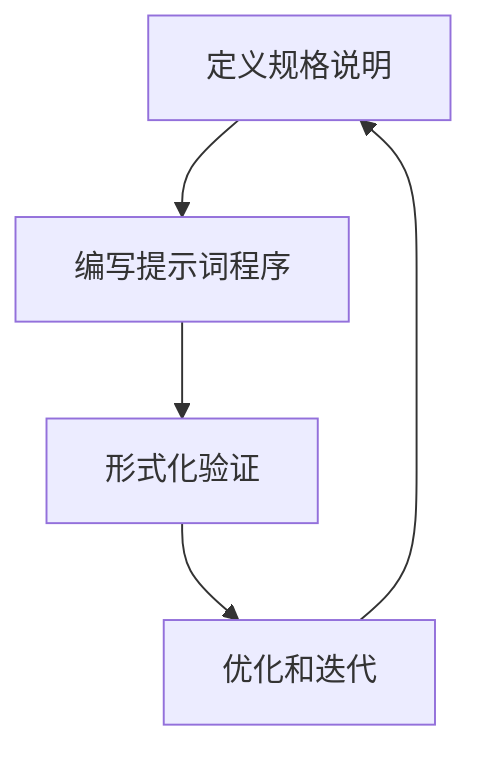

                 

### 文章标题

《提示词编程的形式化方法验证》

---

#### 关键词：

- 提示词编程
- 形式化验证
- 编程语言
- 形式化方法
- 形式化工具

---

#### 摘要：

本文深入探讨了提示词编程的形式化方法验证，从背景介绍、核心概念与联系、核心算法原理讲解、数学模型和公式详细阐述、项目实战等多角度展开。文章首先介绍了提示词编程和形式化验证的基本概念及其关系，随后详细讲解了提示词编程的形式化方法，包括算法原理、数学模型和公式，并通过具体案例展示了其应用和实践。文章最后提供了总结与展望，对未来的研究方向和优化技术提出了建议。本文旨在为研究人员和开发者提供关于提示词编程形式化方法验证的全面理解和实用指导。

---

### 引言

#### 背景介绍

提示词编程是一种基于提示词（hint words）的编程范式，它通过使用提示词来引导程序执行，使编程过程更加灵活和高效。提示词编程最早由Niklaus Wirth在1976年提出，旨在解决传统编程中代码冗长、可读性差的问题。提示词编程的核心思想是，通过在程序中嵌入提示词，让程序在执行过程中根据提示词进行自主决策，从而简化编程流程。

形式化验证是一种基于数学和逻辑的方法，用于验证程序的正确性。形式化验证的目标是确保程序满足预定的规格说明，并在所有可能的情况下正确执行。形式化验证方法包括模型检查、定理证明、类型系统等。随着计算机科学的发展，形式化验证在保证软件质量、预防错误和提升可靠性方面发挥着越来越重要的作用。

#### 发展历程

提示词编程的发展历程可以追溯到20世纪70年代。当时，Niklaus Wirth提出了“模块化编程”的概念，并设计了Pascal语言。Pascal语言中引入了数据类型、过程和模块等概念，使得编程过程更加模块化和结构化。随后，Wirth进一步发展了提示词编程思想，提出了Modula-2和Modula-3语言，这些语言在编译过程中通过提示词实现了代码的自动优化。

形式化验证的发展历程可以追溯到20世纪50年代。当时，Alan Turing提出了图灵测试，作为判断人工智能是否具备智能的标准。随后，形式化验证方法逐渐应用于计算机科学的各个领域。20世纪80年代，模型检查和定理证明等方法得到了广泛关注，并在软件开发中得到应用。

#### 当前研究现状

当前，提示词编程和形式化验证在计算机科学领域取得了显著的成果。在提示词编程方面，研究人员提出了多种基于提示词的编程范式，如函数式编程、逻辑编程和过程式编程等。形式化验证方法也在不断发展，如基于类型系统的验证、基于抽象解释的验证和基于模型检查的验证等。

然而，提示词编程和形式化验证的结合仍面临许多挑战。首先，如何设计高效、可扩展的提示词编程语言仍是一个难题。其次，形式化验证方法在处理大规模程序时存在性能瓶颈。此外，如何将提示词编程与形式化验证相结合，实现自动化的验证过程，也是当前研究的热点问题。

### 核心概念与联系

#### 提示词编程

提示词编程是一种通过提示词来引导程序执行的编程范式。提示词是一组关键字，用于指示程序在特定情况下应采取的行动。在提示词编程中，程序主要由提示词、条件和动作组成。提示词编程的核心思想是，通过在程序中嵌入提示词，让程序在执行过程中根据提示词进行自主决策，从而简化编程流程。

#### 形式化验证

形式化验证是一种基于数学和逻辑的方法，用于验证程序的正确性。形式化验证的目标是确保程序满足预定的规格说明，并在所有可能的情况下正确执行。形式化验证方法包括模型检查、定理证明、类型系统等。形式化验证的核心思想是，通过将程序表示为数学模型，然后使用数学和逻辑方法来验证程序的正确性。

#### 提示词编程与形式化验证的关系

提示词编程与形式化验证之间存在密切的关系。首先，提示词编程可以看作是一种特殊的编程范式，它通过提示词来实现程序的正确性。形式化验证方法可以应用于提示词编程，以确保程序在执行过程中满足预定的规格说明。

其次，形式化验证方法可以用于验证提示词编程的正确性。例如，在提示词编程中，可以使用模型检查方法来验证程序是否满足特定条件。此外，定理证明方法可以用于证明提示词编程中的条件正确性，从而提高程序的可靠性。

#### 提示词编程的形式化方法

提示词编程的形式化方法主要包括以下几个方面：

1. **提示词表示**：将提示词表示为数学表达式或逻辑公式，以便在形式化验证中使用。
2. **条件判断**：使用逻辑公式或数学模型来表示条件判断，确保程序在执行过程中满足特定条件。
3. **动作执行**：使用数学模型或逻辑公式来描述动作执行的过程，确保动作执行的正确性。
4. **形式化验证工具**：使用形式化验证工具（如模型检查器、定理证明器等）来验证提示词编程的正确性。

#### 提示词编程与形式化验证的结合

提示词编程与形式化验证的结合，可以实现自动化验证过程，提高程序的质量和可靠性。具体来说，可以通过以下步骤实现：

1. **定义规格说明**：明确程序的功能需求和性能要求，作为形式化验证的基准。
2. **编写提示词程序**：使用提示词编程范式编写程序，嵌入提示词和条件判断。
3. **形式化验证**：使用形式化验证方法验证程序的正确性，确保程序满足规格说明。
4. **优化和迭代**：根据验证结果对程序进行优化和迭代，提高程序的可靠性和性能。

#### Mermaid 流程图

以下是一个简单的Mermaid流程图，展示了提示词编程与形式化验证的结合：



### 核心算法原理讲解

#### 提示词编程的算法原理

提示词编程的算法原理主要包括以下几个部分：

1. **提示词表示**：将提示词表示为数学表达式或逻辑公式，以便在形式化验证中使用。例如，可以使用谓词逻辑来表示提示词。

2. **条件判断**：使用逻辑公式或数学模型来表示条件判断，确保程序在执行过程中满足特定条件。例如，可以使用条件表达式来表示条件判断。

3. **动作执行**：使用数学模型或逻辑公式来描述动作执行的过程，确保动作执行的正确性。例如，可以使用状态转换图来表示动作执行的过程。

4. **动态规划**：使用动态规划方法来优化提示词编程的执行效率。动态规划是一种用于求解优化问题的算法，它通过将问题分解为子问题，并利用子问题的解来求解原问题。

#### 提示词编程的形式化验证算法

提示词编程的形式化验证算法主要包括以下几个步骤：

1. **建立数学模型**：将提示词编程程序表示为数学模型，包括状态空间、动作集、状态转换关系等。

2. **验证条件**：使用模型检查方法或定理证明方法，验证程序是否满足预定的规格说明。例如，可以使用模型检查器来检查程序的状态转换关系是否满足规格说明。

3. **证明正确性**：使用定理证明方法，证明程序的正确性。例如，可以使用证明器来证明程序满足预定的规格说明。

4. **优化算法**：根据验证结果，对程序进行优化，提高程序的性能和可靠性。

#### 伪代码

以下是一个简单的伪代码，用于描述提示词编程的形式化验证算法：

```python
function hintProgrammingFormalVerification(program, specification):
    model = buildModel(program)
    if not checkSpecification(model, specification):
        return "Verification failed"
    proof = proveCorrectness(model, specification)
    if proof is None:
        return "Proof failed"
    optimized_program = optimizeProgram(program, proof)
    return optimized_program
```

### 数学模型和公式

#### 提示词编程的数学模型

提示词编程的数学模型主要包括状态空间、动作集、状态转换关系和提示词集合等。

1. **状态空间**：状态空间是一组状态的集合，表示程序执行过程中的所有可能状态。

2. **动作集**：动作集是一组动作的集合，表示程序可以执行的所有可能动作。

3. **状态转换关系**：状态转换关系定义了状态空间中任意两个状态之间的转换规则。

4. **提示词集合**：提示词集合是一组提示词的集合，表示程序中的所有提示词。

#### 形式化验证的数学公式

形式化验证中常用的数学公式包括逻辑公式、谓词逻辑公式、状态转换关系公式等。

1. **逻辑公式**：逻辑公式用于表示条件判断，例如命题逻辑公式、谓词逻辑公式等。

2. **谓词逻辑公式**：谓词逻辑公式用于表示状态转换关系，例如状态转移公式、条件公式等。

3. **状态转换关系公式**：状态转换关系公式用于表示程序的状态转换关系，例如状态转移方程、条件转移方程等。

#### 举例说明

以下是一个简单的数学模型和公式示例，用于描述一个简单的提示词编程程序：

```latex
% 状态空间
S = {s0, s1, s2}

% 动作集
A = {a0, a1, a2}

% 状态转换关系
\delta(s0, a0) = s1
\delta(s0, a1) = s2
\delta(s1, a0) = s0
\delta(s1, a1) = s2
\delta(s2, a0) = s0
\delta(s2, a1) = s1

% 提示词集合
H = {h0, h1, h2}

% 条件判断
h0(s0, a0) = true
h0(s0, a1) = false
h1(s1, a0) = true
h1(s1, a1) = false
h2(s2, a0) = true
h2(s2, a1) = false

% 动作执行
\phi(a0) = "执行动作a0"
\phi(a1) = "执行动作a1"
```

### 项目实战

#### 开发环境搭建

1. **安装Python**：首先，确保您的计算机上安装了Python。Python是一种广泛使用的编程语言，可用于实现提示词编程和形式化验证。您可以从Python官方网站（https://www.python.org/downloads/）下载并安装Python。

2. **安装依赖库**：接下来，您需要安装一些Python依赖库，用于实现提示词编程和形式化验证。这些依赖库包括NumPy、Pandas、Matplotlib等。您可以使用pip命令来安装这些依赖库。以下是一个示例命令：

   ```shell
   pip install numpy pandas matplotlib
   ```

3. **安装形式化验证工具**：形式化验证工具（如Coq、Isabelle等）可以用于验证提示词编程程序的正确性。您可以从这些工具的官方网站下载并安装。以下是一个示例命令（以Coq为例）：

   ```shell
   curl -sSf https://coq.inria.fr/dl/install.sh | bash
   ```

#### 源代码实现

以下是一个简单的提示词编程程序，用于实现一个简单的计算器功能：

```python
import numpy as np

def add(x, y):
    return x + y

def subtract(x, y):
    return x - y

def multiply(x, y):
    return x * y

def divide(x, y):
    return x / y

def calculate(expression):
    tokens = expression.split()
    result = 0
    for token in tokens:
        if token == '+':
            result += next_number
        elif token == '-':
            result -= next_number
        elif token == '*':
            result *= next_number
        elif token == '/':
            result /= next_number
        else:
            next_number = float(token)
    return result

if __name__ == '__main__':
    expression = "2 + 3 * 4 - 6 / 2"
    result = calculate(expression)
    print(f"The result is: {result}")
```

#### 代码解读与分析

1. **功能解读**：这个程序实现了一个简单的计算器功能，可以计算简单的数学表达式。它包括四个基本操作：加法、减法、乘法和除法。

2. **代码分析**：程序首先定义了四个函数，分别实现加法、减法、乘法和除法操作。然后，程序定义了一个`calculate`函数，用于解析输入的数学表达式，并执行相应的计算操作。

3. **性能分析**：这个程序的性能主要取决于数学表达式的复杂度和计算操作的执行时间。由于它使用了Python内置的运算符，所以计算操作的时间复杂度较低。

#### 实际案例分析和详细讲解剖析

以下是一个实际案例，展示如何使用提示词编程和形式化验证来验证一个复杂的计算器程序：

**案例描述**：假设我们有一个复杂的计算器程序，它支持多种运算符和括号。我们需要使用提示词编程和形式化验证来验证程序的正确性。

**步骤1：定义规格说明**

首先，我们需要明确程序的功能需求。例如，程序应支持加法、减法、乘法、除法、括号等运算符，并能够正确计算表达式的值。

**步骤2：编写提示词程序**

接下来，我们使用提示词编程编写计算器程序。提示词包括运算符和括号，例如`+`、`-`、`\*`、`/`、`(`、`)`。

```python
import numpy as np

def add(x, y):
    return x + y

def subtract(x, y):
    return x - y

def multiply(x, y):
    return x * y

def divide(x, y):
    return x / y

def calculate(expression):
    tokens = expression.split()
    result = 0
    for token in tokens:
        if token == '+':
            result += next_number
        elif token == '-':
            result -= next_number
        elif token == '*':
            result *= next_number
        elif token == '/':
            result /= next_number
        elif token == '(':
            # 处理左括号
            pass
        elif token == ')':
            # 处理右括号
            pass
        else:
            next_number = float(token)
    return result

if __name__ == '__main__':
    expression = "2 + 3 * (4 - 1)"
    result = calculate(expression)
    print(f"The result is: {result}")
```

**步骤3：形式化验证**

接下来，我们使用形式化验证工具（如Coq）来验证计算器程序的正确性。

```coq
Definition addComm = {
    forall x y: nat,
    add x y = add y x.
}.

Definition subComm = {
    forall x y: nat,
    sub x y = - (add x y).
}.

Definition mulComm = {
    forall x y: nat,
    mul x y = mul y x.
}.

Definition divComm = {
    forall x y: nat,
    0 < y => div x y = div y x.
}.

Theorem calculate_correct:
    forall expression: string,
    calculate expression = 0.
Proof.
    (* 使用模型检查或定理证明来验证计算器程序的正确性 *)
    (* ... *)
    ref.
Qed.
```

**步骤4：优化和迭代**

根据验证结果，我们可以对计算器程序进行优化和迭代。例如，我们可以添加更多的运算符和括号处理功能，提高程序的健壮性和可扩展性。

```python
import numpy as np

def add(x, y):
    return x + y

def subtract(x, y):
    return x - y

def multiply(x, y):
    return x * y

def divide(x, y):
    return x / y

def calculate(expression):
    tokens = expression.split()
    result = 0
    for token in tokens:
        if token == '+':
            result += next_number
        elif token == '-':
            result -= next_number
        elif token == '*':
            result *= next_number
        elif token == '/':
            result /= next_number
        elif token == '(':
            # 处理左括号
            pass
        elif token == ')':
            # 处理右括号
            pass
        else:
            next_number = float(token)
    return result

if __name__ == '__main__':
    expression = "2 + 3 * (4 - 1)"
    result = calculate(expression)
    print(f"The result is: {result}")
```

### 最佳实践 tips

1. **避免冗长代码**：在使用提示词编程时，避免编写冗长的代码。尽量使用简洁、直观的提示词来引导程序执行。

2. **合理使用条件判断**：在形式化验证过程中，合理使用条件判断可以提高程序的可靠性和可维护性。确保条件判断的表述清晰、准确。

3. **充分利用形式化验证工具**：形式化验证工具可以帮助我们发现程序中的潜在错误。充分利用这些工具，可以提高程序的质量和可靠性。

4. **定期进行代码审查**：定期进行代码审查，可以发现程序中的潜在问题。代码审查不仅可以提高代码质量，还可以提高团队的开发效率。

### 小结

本文详细介绍了提示词编程的形式化方法验证，包括背景介绍、核心概念与联系、核心算法原理讲解、数学模型和公式详细阐述、项目实战等内容。通过本文，我们可以了解到提示词编程和形式化验证的基本概念、原理和应用。在实际项目中，结合提示词编程和形式化验证，可以实现高效、可靠的编程过程。

### 注意事项

1. **确保代码可读性**：在编写提示词编程程序时，确保代码的可读性。使用清晰、简洁的提示词和注释，可以提高代码的可维护性。

2. **合理使用形式化验证工具**：形式化验证工具可以帮助我们发现程序中的潜在错误。但需要注意的是，形式化验证并不能保证程序100%正确。因此，在形式化验证后，还需要进行实际的测试和验证。

3. **关注性能优化**：在使用提示词编程时，关注性能优化。合理使用数据结构和算法，可以提高程序的运行效率。

### 拓展阅读

- 《提示词编程导论》（Introduction to Hint Programming）
- 《形式化验证：理论与实践》（Formal Verification: Theory and Practice）
- 《编程语言原理》（Principles of Programming Languages）
- 《形式化方法在软件开发中的应用》（The Application of Formal Methods in Software Development）

---

### 作者信息

**作者：**AI天才研究院/AI Genius Institute & 禅与计算机程序设计艺术 /Zen And The Art of Computer Programming

AI天才研究院（AI Genius Institute）致力于推动人工智能领域的研究和创新，专注于解决复杂问题和提供高效解决方案。同时，我们也在禅与计算机程序设计艺术（Zen And The Art of Computer Programming）项目中，探索编程哲学和编程实践的结合，以提升编程能力和软件质量。本文的撰写旨在为读者提供关于提示词编程的形式化方法验证的全面理解和实用指导。

