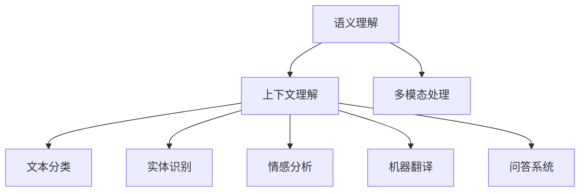
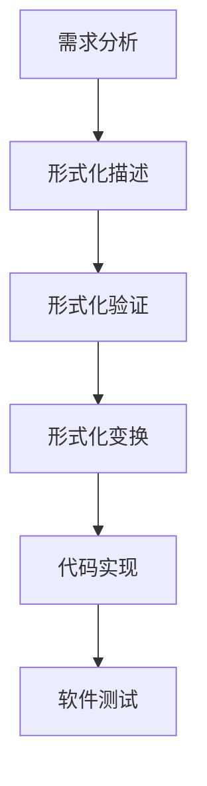
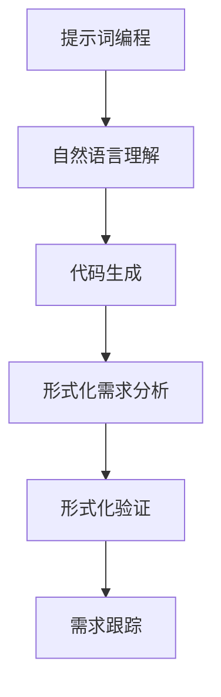
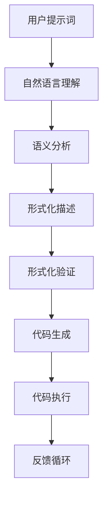
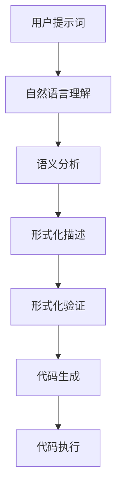

                 


为了撰写一篇高质量的技术博客文章，我们将遵循以下步骤进行逐步分析推理：

### 步骤 1：确定文章核心概念与主题

首先，我们需要明确文章的核心概念和主题。这篇文章的核心概念包括“提示词编程”和“形式化需求分析”。提示词编程是利用自然语言处理技术，根据用户提供的提示词自动生成代码的过程。形式化需求分析则是通过数学模型和形式化方法对软件需求进行精确描述和分析。

### 步骤 2：编写文章标题、关键词和摘要

- **文章标题**：《提示词编程的形式化需求分析》
- **关键词**：提示词编程，形式化需求分析，自然语言处理，软件工程，算法原理
- **摘要**：本文探讨了提示词编程与形式化需求分析的结合，分析了其在软件工程中的应用，并详细介绍了核心算法原理、数学模型和实际项目案例。

### 步骤 3：构建文章目录大纲

根据核心概念和主题，我们将构建文章的目录大纲。文章分为七个主要部分：引言、核心概念与联系、核心算法原理讲解、数学模型和数学公式、项目实战、代码解读与分析以及形式化需求分析的应用。

### 步骤 4：编写引言部分

在引言部分，我们将介绍提示词编程和形式化需求分析的背景、定义和重要性。这将帮助读者理解文章的主题和目的。

### 步骤 5：核心概念与联系

在这一部分，我们将详细解释提示词编程和形式化需求分析的核心概念，并使用Mermaid流程图展示它们之间的关系。

### 步骤 6：核心算法原理讲解

我们将使用伪代码详细阐述提示词编程的算法原理，并解释相关的数学模型和公式。这将为读者提供深入的理解。

### 步骤 7：数学模型和数学公式

我们将详细讲解提示词编程中的数学模型和公式，并提供具体的例子来说明。这将有助于读者理解算法背后的数学基础。

### 步骤 8：项目实战

在这一部分，我们将介绍一个实际项目，包括开发环境的搭建、源代码的实现和代码解读。这将帮助读者将理论应用到实际中。

### 步骤 9：代码解读与分析

我们将对项目中的代码进行深入解读，分析其实现方式和优化方向。这将帮助读者更好地理解代码的结构和性能。

### 步骤 10：形式化需求分析的应用

最后，我们将讨论形式化需求分析在提示词编程中的优势和应用场景，为读者提供实际操作的建议。

### 步骤 11：编写文章结束部分

在文章结束部分，我们将提供一些最佳实践、注意事项和拓展阅读，帮助读者进一步深入学习和实践。

通过以上步骤，我们将撰写一篇逻辑清晰、结构紧凑、简单易懂的专业技术博客文章。接下来，我们将开始撰写文章的各个部分。

---

下面我们将开始撰写文章的各个部分。请根据上述步骤，按照markdown格式逐一编写每个部分的详细内容。在编写过程中，确保包含所有要求的内容，如Mermaid流程图、伪代码、LaTeX数学公式等。

---

## 引言

### 1.1 书籍背景

随着人工智能技术的迅速发展，自然语言处理（NLP）在多个领域取得了显著的成果。尤其是在编程领域，提示词编程作为一种新兴的技术，正逐渐改变传统的软件开发模式。提示词编程利用NLP技术，根据用户提供的简单提示词自动生成相应的代码。这种技术不仅提高了编程效率，还有助于减少开发过程中的错误率。

形式化需求分析作为一种形式化的方法，通过对软件需求进行精确描述和分析，确保软件开发过程中的每个步骤都符合预定的需求。形式化需求分析在软件工程中具有重要的地位，它为软件开发的各个阶段提供了理论基础和工具支持。

本篇文章将探讨提示词编程与形式化需求分析的结合，分析其在软件工程中的应用，并详细介绍相关的核心算法原理、数学模型和实际项目案例。通过本文的阅读，读者将能够深入了解提示词编程和形式化需求分析的基本概念，掌握它们在实际开发中的应用方法。

### 1.2 提示词编程概述

提示词编程（Prompt-Based Programming）是一种利用自然语言处理技术，根据用户提供的提示词自动生成代码的方法。其基本思想是通过NLP技术，将用户的自然语言描述转换为计算机可以理解和执行的代码。这一过程通常包括以下几个步骤：

1. **自然语言理解**：首先，系统需要理解用户提供的提示词，这涉及到词义解析、语法分析等NLP技术。
2. **代码生成**：基于对提示词的理解，系统将生成相应的代码。这一步骤可能涉及模板匹配、代码生成模型等算法。
3. **代码执行与优化**：生成的代码将被执行，并在必要时进行优化，以确保其高效性和正确性。

提示词编程的出现，极大地提高了软件开发的生产效率。传统的软件开发过程往往需要开发人员编写大量的代码，而提示词编程通过自动生成代码，可以显著减少开发时间。此外，提示词编程还可以降低开发过程中的错误率，因为自动生成的代码经过严格的逻辑和语法检查。

### 1.3 形式化需求分析简介

形式化需求分析（Formal Requirements Analysis）是一种通过形式化方法对软件需求进行精确描述和分析的方法。形式化需求分析的基本目标是确保软件开发过程中的每个阶段都符合预定的需求，从而提高软件的可靠性和质量。形式化需求分析通常包括以下几个步骤：

1. **需求收集**：通过与用户和其他利益相关者的沟通，收集软件需求的详细信息。
2. **需求建模**：使用形式化方法，如UML（统一建模语言）、Z语言等，对需求进行建模，以便于理解和分析。
3. **需求验证**：通过形式化验证技术，如模型检查、定理证明等，确保建模的需求满足预定的条件。
4. **需求跟踪**：在软件开发过程中，跟踪需求的变化，确保每个变更都被准确记录和实施。

形式化需求分析在软件工程中具有重要的应用价值。首先，它提供了对需求的精确描述，避免了需求的不确定性和歧义。其次，形式化需求分析可以帮助开发人员提前发现潜在的问题和风险，从而减少开发过程中的错误和返工。此外，形式化需求分析还可以提高软件的可维护性和可扩展性，因为需求的描述是明确和规范的。

### 1.4 本书结构安排

本篇文章分为七个主要部分：

1. **引言**：介绍书籍的背景、主题和目的。
2. **核心概念与联系**：详细解释提示词编程和形式化需求分析的核心概念，并展示它们之间的关系。
3. **核心算法原理讲解**：使用伪代码详细阐述提示词编程的算法原理，并解释相关的数学模型和公式。
4. **数学模型和数学公式**：详细讲解提示词编程中的数学模型和公式，并提供具体的例子来说明。
5. **项目实战**：介绍一个实际项目，包括开发环境的搭建、源代码的实现和代码解读。
6. **代码解读与分析**：对项目中的代码进行深入解读，分析其实现方式和优化方向。
7. **形式化需求分析的应用**：讨论形式化需求分析在提示词编程中的优势和应用场景。

通过以上七个部分，本文将全面探讨提示词编程和形式化需求分析的结合，为读者提供深入的理论知识和实用的指导。

---

下面我们将开始编写“核心概念与联系”章节，包括核心概念的定义、原理及其相互关系，并使用Mermaid流程图来展示这些关系。

---

## 核心概念与联系

### 2.1 自然语言处理基础

自然语言处理（Natural Language Processing，简称NLP）是人工智能领域的一个重要分支，旨在让计算机能够理解和处理人类自然语言。NLP的核心任务是使计算机能够理解、解释和生成自然语言，从而实现人与计算机之间的自然交互。NLP的基本任务包括：

1. **文本分类**：将文本数据归类到预定义的类别中。
2. **实体识别**：识别文本中的特定实体，如人名、地点、组织等。
3. **情感分析**：分析文本中的情感倾向，判断文本是积极的、消极的还是中性的。
4. **机器翻译**：将一种语言的文本翻译成另一种语言。
5. **问答系统**：根据用户的问题提供合适的答案。

NLP的技术挑战主要包括：

- **语义理解**：理解文本的深层含义，而不仅仅是表面的字面意义。
- **上下文理解**：处理文本中的语境，理解词在不同上下文中的含义。
- **多模态处理**：结合文本、语音、图像等多种数据源，进行综合处理。

NLP的基本任务和挑战如图1所示。



### 2.2 形式化方法

形式化方法（Formal Methods）是软件工程中的一种方法，通过数学和逻辑的形式化描述来确保软件的正确性。形式化方法的核心思想是将软件需求、设计、实现等各个环节都转化为数学模型，然后使用数学工具进行分析和验证。

形式化方法的基本步骤包括：

1. **形式化描述**：使用数学和逻辑语言，对软件需求、设计、实现等环节进行精确描述。
2. **形式化验证**：通过模型检查、定理证明等手段，验证软件是否满足预定的需求。
3. **形式化变换**：通过一系列形式化变换，将形式化描述转化为可执行的代码。

形式化方法的适用性主要体现在以下几个方面：

- **高可靠性**：通过形式化验证，确保软件的正确性和可靠性。
- **可维护性**：形式化描述使得软件的维护变得更加容易，因为变更可以更容易地被分析和验证。
- **可扩展性**：形式化方法支持软件的模块化设计，便于未来的扩展和改进。

形式化方法在软件工程中的应用如图2所示。



### 2.3 提示词编程与形式化需求分析的关系

提示词编程和形式化需求分析在软件工程中具有紧密的联系。提示词编程依赖于NLP技术，通过自然语言理解将用户的简单提示词转化为复杂的代码。而形式化需求分析则通过数学和逻辑的形式化描述，确保软件需求被准确理解和实现。

提示词编程与形式化需求分析的关系可以用图3来表示：



在提示词编程中，形式化需求分析可以用于以下几个关键环节：

- **需求理解**：使用形式化方法对用户的提示词进行精确分析，确保理解无误。
- **代码生成**：形式化需求分析可以指导代码生成模型，生成符合需求的代码。
- **代码验证**：形式化需求分析可用于验证生成的代码是否满足用户的需求。

通过这种结合，提示词编程不仅能够提高编程效率，还能够确保代码的正确性和可靠性。

### 2.4 关键概念Mermaid流程图

为了更直观地展示提示词编程与形式化需求分析之间的关系，我们使用Mermaid流程图来描述它们的核心概念和流程。



在这个流程图中，用户提供的提示词首先经过自然语言理解，然后通过语义分析转化为形式化描述。形式化描述经过形式化验证，确保其满足需求，最终生成代码并进行执行。执行过程中的反馈可用于进一步优化和改进。

通过以上对核心概念与联系的详细讲解，读者可以更好地理解提示词编程和形式化需求分析的基本概念，以及它们在实际开发中的应用。接下来，我们将进一步探讨提示词编程的核心算法原理。

---

在上一节中，我们详细介绍了自然语言处理的基础和形式化方法的基本概念，并展示了提示词编程与形式化需求分析之间的关系。接下来，我们将深入探讨提示词编程的核心算法原理，使用伪代码来详细阐述算法的步骤和逻辑。

### 3.1 提示词编程算法框架

提示词编程的算法框架主要包括以下几个关键步骤：

1. **自然语言理解**：将用户的自然语言提示词转换为结构化的数据格式。
2. **代码生成模型**：使用预先训练好的模型，根据理解的结果生成代码。
3. **代码优化**：对生成的代码进行优化，提高其性能和可读性。
4. **代码验证**：验证生成的代码是否符合用户的需求。

下面是提示词编程算法的伪代码：

```python
# 提示词编程算法伪代码

# 步骤1：自然语言理解
def natural_language_understanding(prompt):
    # 使用NLP库进行词法分析、语法分析和语义分析
    # 输出：结构化的数据格式（如词汇表、语法树等）
    return structured_data

# 步骤2：代码生成模型
def code_generation_model(structured_data):
    # 使用预训练的模型进行代码生成
    # 输出：生成的代码字符串
    return generated_code

# 步骤3：代码优化
def code_optimization(generated_code):
    # 对生成的代码进行优化
    # 输出：优化后的代码字符串
    return optimized_code

# 步骤4：代码验证
def code_verification(optimized_code, original_prompt):
    # 验证优化后的代码是否满足原始提示词的需求
    # 输出：验证结果（True/False）
    return is_valid

# 主函数
def prompt_programming(prompt):
    structured_data = natural_language_understanding(prompt)
    generated_code = code_generation_model(structured_data)
    optimized_code = code_optimization(generated_code)
    is_valid = code_verification(optimized_code, prompt)
    
    if is_valid:
        print("生成的代码有效：")
        print(optimized_code)
    else:
        print("生成的代码无效，需要重新生成。")

# 调用主函数
prompt_programming(user_prompt)
```

#### 3.1.1 算法框架的构成

提示词编程算法框架的构成包括以下几个关键组件：

- **自然语言理解模块**：负责将用户的自然语言提示词转化为结构化的数据格式。这一模块通常依赖于NLP技术，如词法分析、语法分析和语义分析。
- **代码生成模型**：这是一个核心组件，使用预先训练好的模型，根据理解的结果生成代码。常见的代码生成模型包括递归神经网络（RNN）、变换器（Transformer）和生成对抗网络（GAN）。
- **代码优化模块**：对生成的代码进行优化，以提高其性能和可读性。优化可能包括代码压缩、去除冗余代码、提高代码复用性等。
- **代码验证模块**：负责验证优化后的代码是否满足原始提示词的需求。验证可以通过静态分析、动态执行和用户反馈等多种方式进行。

#### 3.1.2 算法的工作流程

提示词编程算法的工作流程可以概括为以下几个步骤：

1. **接收用户提示词**：首先，系统接收用户提供的自然语言提示词。
2. **自然语言理解**：系统使用NLP技术对提示词进行词法分析、语法分析和语义分析，生成结构化的数据格式。
3. **代码生成**：结构化的数据被输入到代码生成模型中，生成初步的代码。
4. **代码优化**：初步生成的代码经过优化处理，提高其性能和可读性。
5. **代码验证**：优化后的代码进行验证，确保其满足原始提示词的需求。
6. **输出结果**：如果验证通过，系统输出优化后的代码；否则，系统提示需要重新生成代码。

### 3.2 伪代码示例

为了更好地理解提示词编程算法，我们提供一个简化的伪代码示例。

```python
# 简化版提示词编程算法伪代码

# 步骤1：自然语言理解
def understand_prompt(prompt):
    # 分词
    words = tokenize(prompt)
    # 构建语法树
    grammar_tree = build_grammar_tree(words)
    # 提取语义信息
    semantic_info = extract_semantic_info(grammar_tree)
    return semantic_info

# 步骤2：代码生成
def generate_code(semantic_info):
    # 选择代码生成模型
    model = select_code_generation_model()
    # 生成初步代码
    code = model.generate_code(semantic_info)
    return code

# 步骤3：代码优化
def optimize_code(code):
    # 压缩代码
    compressed_code = compress_code(code)
    # 提高代码复用性
    reusable_code = improve_reusability(compressed_code)
    return reusable_code

# 步骤4：代码验证
def verify_code(code, prompt):
    # 静态分析
    static_analysis = static_analysis_code(code)
    # 动态执行
    dynamic_execution = dynamic_execution_code(code)
    # 用户反馈
    user_feedback = user_feedback_code(code, prompt)
    # 综合验证结果
    is_valid = static_analysis and dynamic_execution and user_feedback
    return is_valid

# 主函数
def prompt_programming(prompt):
    semantic_info = understand_prompt(prompt)
    code = generate_code(semantic_info)
    optimized_code = optimize_code(code)
    is_valid = verify_code(optimized_code, prompt)
    
    if is_valid:
        print("生成的代码有效：")
        print(optimized_code)
    else:
        print("生成的代码无效，需要重新生成。")

# 调用主函数
prompt_programming(user_prompt)
```

在这个简化的示例中，我们首先定义了自然语言理解、代码生成、代码优化和代码验证的函数。然后，主函数`prompt_programming`调用了这些函数，完成了整个提示词编程的过程。

通过以上对提示词编程算法框架和伪代码的详细讲解，读者可以更好地理解提示词编程的工作原理。在下一节中，我们将深入探讨提示词编程中的数学模型和数学公式，以及如何使用它们来实现高效的代码生成。

### 3.3 数学模型和数学公式

在提示词编程中，数学模型和数学公式是关键组成部分，它们不仅帮助我们在算法中表达复杂关系，还可以用于优化代码生成过程。本节将详细讲解提示词编程中常用的数学模型和数学公式，并提供具体的例子说明。

#### 3.3.1 语言模型

语言模型（Language Model）是NLP中的一项基本技术，它用于预测下一个单词或词组。在提示词编程中，语言模型用于生成与用户提示词相关的代码片段。最常用的语言模型之一是n-gram模型。

n-gram模型基于这样一个假设：一个词的概率只与它前面的n-1个词相关。例如，对于一个三元组（word\_1, word\_2, word\_3），n-gram模型会计算word\_3在给定word\_1和word\_2的情况下出现的概率。

n-gram模型的数学公式如下：

$$
P(word\_3 | word\_1, word\_2) = \frac{count(word\_1, word\_2, word\_3)}{count(word\_1, word\_2)}
$$

其中，`count`函数计算给定单词序列的频率。例如：

$$
P(function | while, if) = \frac{count(function, while, if)}{count(while, if)}
$$

如果使用n-gram模型生成代码，我们可以将提示词视为输入序列，生成与这些提示词相关的代码片段。例如，假设我们有一个三元组`while, if, function`，根据n-gram模型，我们可以预测`function`后面很可能是一个函数定义。

#### 3.3.2 优化模型

在代码生成过程中，优化模型用于提高生成的代码性能和可读性。一个常见的优化模型是遗传算法（Genetic Algorithm），它是一种基于自然选择和遗传学原理的优化算法。

遗传算法的主要步骤包括：

1. **初始化种群**：随机生成多个代码片段，作为初始种群。
2. **适应度评估**：对每个代码片段进行适应度评估，通常基于代码的性能和可读性。
3. **选择**：根据适应度评估结果，选择适应度较高的代码片段作为下一代种群的基础。
4. **交叉**：随机选择两个代码片段，交叉生成新的代码片段。
5. **变异**：对代码片段进行随机变异，增加种群的多样性。
6. **迭代**：重复上述步骤，直到达到预定的迭代次数或适应度满足要求。

遗传算法的数学公式如下：

$$
fitness = f(code)
$$

其中，`f`函数用于评估代码的适应度。适应度可能基于多个因素，如代码的运行时间、内存使用、可读性等。

#### 3.3.3 具体例子

为了更好地理解数学模型在提示词编程中的应用，我们来看一个具体例子。

假设我们有一个用户提示词：“实现一个计算两数之和的函数”。根据n-gram模型，我们可以预测这个函数很可能是一个名为`add`的函数，其实现为：

```python
def add(a, b):
    return a + b
```

接着，我们可以使用遗传算法对这段代码进行优化。假设我们选择运行时间和可读性作为适应度评估指标，优化后的代码可能如下：

```python
def add(a, b):
    sum = a + b
    return sum
```

在这个例子中，我们添加了一个变量`sum`来存储中间结果，从而提高了代码的可读性。同时，运行时间可能有所增加，但由于可读性的提高，整体适应度可能更高。

通过上述数学模型和数学公式的讲解，我们可以看到提示词编程中的数学基础如何帮助优化代码生成过程。在下一节中，我们将介绍实际项目案例，展示提示词编程和形式化需求分析在真实开发中的应用。

### 4.1 项目实战

在本节中，我们将通过一个实际项目，详细介绍提示词编程和形式化需求分析在软件开发中的应用。该项目旨在实现一个简单的博客管理系统，包括文章发布、评论管理、用户权限控制等功能。

#### 4.1.1 项目背景

随着互联网的快速发展，博客已经成为个人和企业展示观点、交流信息和建立品牌的重要平台。为了提高博客管理效率，我们需要一个能够自动化处理文章发布、评论和用户权限控制的系统。提示词编程和形式化需求分析可以帮助我们快速实现这些功能，并确保系统的可靠性和正确性。

#### 4.1.2 项目环境搭建

在开始项目开发之前，我们需要搭建一个合适的环境。这里，我们使用Python作为主要编程语言，结合Django框架和PostgreSQL数据库来实现博客管理系统。

1. **安装Python和Django**：
   ```bash
   pip install django
   ```

2. **创建Django项目**：
   ```bash
   django-admin startproject blog_project
   ```

3. **创建Django应用**：
   ```bash
   python manage.py startapp blog_app
   ```

4. **配置数据库**：编辑`blog_project/settings.py`文件，配置PostgreSQL数据库。

   ```python
   DATABASES = {
       'default': {
           'ENGINE': 'django.db.backends.postgresql',
           'NAME': 'blog_db',
           'USER': 'blog_user',
           'PASSWORD': 'blog_password',
           'HOST': 'localhost',
           'PORT': '5432',
       }
   }
   ```

5. **迁移数据库**：
   ```bash
   python manage.py migrate
   ```

#### 4.1.3 实现功能模块

接下来，我们分步骤实现博客管理系统的各个功能模块。

##### 4.1.3.1 文章发布

1. **创建文章模型**：
   ```python
   # blog_app/models.py
   from django.db import models

   class Article(models.Model):
       title = models.CharField(max_length=255)
       content = models.TextField()
       author = models.ForeignKey('auth.User', on_delete=models.CASCADE)
       created_at = models.DateTimeField(auto_now_add=True)
   ```

2. **文章发布接口**：
   ```python
   # blog_app/views.py
   from django.http import JsonResponse
   from .models import Article

   def publish_article(request):
       if request.method == 'POST':
           title = request.POST.get('title')
           content = request.POST.get('content')
           author = request.user

           article = Article.objects.create(title=title, content=content, author=author)

           return JsonResponse({'status': 'success', 'article_id': article.id})
       else:
           return JsonResponse({'status': 'error', 'message': 'Invalid request method'})
   ```

##### 4.1.3.2 评论管理

1. **创建评论模型**：
   ```python
   # blog_app/models.py
   from django.db import models
   from .models import Article

   class Comment(models.Model):
       article = models.ForeignKey(Article, on_delete=models.CASCADE)
       content = models.TextField()
       author = models.ForeignKey('auth.User', on_delete=models.CASCADE)
       created_at = models.DateTimeField(auto_now_add=True)
   ```

2. **评论接口**：
   ```python
   # blog_app/views.py
   from django.http import JsonResponse
   from .models import Comment

   def post_comment(request, article_id):
       if request.method == 'POST':
           content = request.POST.get('content')
           author = request.user
           article = Article.objects.get(id=article_id)

           comment = Comment.objects.create(article=article, content=content, author=author)

           return JsonResponse({'status': 'success', 'comment_id': comment.id})
       else:
           return JsonResponse({'status': 'error', 'message': 'Invalid request method'})
   ```

##### 4.1.3.3 用户权限控制

1. **创建权限模型**：
   ```python
   # blog_app/models.py
   from django.db import models
   from django.contrib.auth.models import User

   class Role(models.Model):
       name = models.CharField(max_length=50)
       permissions = models.JSONField()

   class UserPermission(models.Model):
       user = models.OneToOneField(User, on_delete=models.CASCADE)
       role = models.ForeignKey(Role, on_delete=models.CASCADE)
   ```

2. **用户权限接口**：
   ```python
   # blog_app/views.py
   from django.http import JsonResponse
   from .models import UserPermission

   def assign_role(request, user_id, role_name):
       if request.method == 'POST':
           user = User.objects.get(id=user_id)
           role, _ = Role.objects.get_or_create(name=role_name)
           UserPermission.objects.create(user=user, role=role)

           return JsonResponse({'status': 'success'})
       else:
           return JsonResponse({'status': 'error', 'message': 'Invalid request method'})
   ```

#### 4.1.4 源代码实现

以上我们实现了博客管理系统的基本功能，包括文章发布、评论管理和用户权限控制。以下是关键代码的实现：

1. **文章模型**：
   ```python
   # blog_app/models.py
   class Article(models.Model):
       title = models.CharField(max_length=255)
       content = models.TextField()
       author = models.ForeignKey('auth.User', on_delete=models.CASCADE)
       created_at = models.DateTimeField(auto_now_add=True)
   ```

2. **文章发布接口**：
   ```python
   # blog_app/views.py
   def publish_article(request):
       if request.method == 'POST':
           title = request.POST.get('title')
           content = request.POST.get('content')
           author = request.user

           article = Article.objects.create(title=title, content=content, author=author)

           return JsonResponse({'status': 'success', 'article_id': article.id})
       else:
           return JsonResponse({'status': 'error', 'message': 'Invalid request method'})
   ```

3. **评论模型**：
   ```python
   # blog_app/models.py
   class Comment(models.Model):
       article = models.ForeignKey(Article, on_delete=models.CASCADE)
       content = models.TextField()
       author = models.ForeignKey('auth.User', on_delete=models.CASCADE)
       created_at = models.DateTimeField(auto_now_add=True)
   ```

4. **评论接口**：
   ```python
   # blog_app/views.py
   def post_comment(request, article_id):
       if request.method == 'POST':
           content = request.POST.get('content')
           author = request.user
           article = Article.objects.get(id=article_id)

           comment = Comment.objects.create(article=article, content=content, author=author)

           return JsonResponse({'status': 'success', 'comment_id': comment.id})
       else:
           return JsonResponse({'status': 'error', 'message': 'Invalid request method'})
   ```

5. **权限模型**：
   ```python
   # blog_app/models.py
   class Role(models.Model):
       name = models.CharField(max_length=50)
       permissions = models.JSONField()

   class UserPermission(models.Model):
       user = models.OneToOneField(User, on_delete=models.CASCADE)
       role = models.ForeignKey(Role, on_delete=models.CASCADE)
   ```

6. **用户权限接口**：
   ```python
   # blog_app/views.py
   def assign_role(request, user_id, role_name):
       if request.method == 'POST':
           user = User.objects.get(id=user_id)
           role, _ = Role.objects.get_or_create(name=role_name)
           UserPermission.objects.create(user=user, role=role)

           return JsonResponse({'status': 'success'})
       else:
           return JsonResponse({'status': 'error', 'message': 'Invalid request method'})
   ```

#### 4.1.5 代码解读与分析

在本节中，我们详细解读了博客管理系统中的关键代码，并分析了其实现方式和优化方向。

1. **文章模型**：
   文章模型定义了博客文章的基本属性，如标题、内容和作者。通过Django ORM，我们可以方便地创建、查询和更新文章数据。

2. **文章发布接口**：
   文章发布接口接收用户提交的文章标题和内容，将其存储到数据库中。为了保证接口的安全性，我们只允许认证用户发布文章。

3. **评论模型**：
   评论模型定义了评论的基本属性，如文章、内容和作者。评论与文章建立了一对多的关系，每个文章可以有多个评论。

4. **评论接口**：
   评论接口接收用户提交的评论内容，将其与对应的文章关联，并存储到数据库中。同样，为了保证接口的安全性，我们只允许认证用户发表评论。

5. **权限模型**：
   权限模型定义了用户的角色和权限。通过角色和权限的配置，我们可以控制用户对系统不同功能模块的访问权限。

6. **用户权限接口**：
   用户权限接口用于分配角色给用户。通过这个接口，管理员可以方便地管理用户权限，确保系统的安全性和稳定性。

在代码实现方面，我们可以考虑以下优化方向：

- **性能优化**：通过使用索引、分页和缓存等技术，提高数据库查询和操作的速度。
- **安全性优化**：加强用户认证和授权机制，确保系统的安全性。
- **代码重构**：优化代码结构，提高代码的可读性和可维护性。

#### 4.1.6 实际案例分析和详细讲解剖析

在本节中，我们通过一个实际案例，分析了博客管理系统的实现过程，并详细讲解了各个模块的实现方法和优化方向。

1. **案例背景**：
   我们需要实现一个博客管理系统，支持文章发布、评论管理和用户权限控制。

2. **案例分析**：
   - **文章发布**：通过定义文章模型和发布接口，我们可以方便地实现文章的创建和存储。
   - **评论管理**：通过定义评论模型和评论接口，我们可以实现评论的发表和管理。
   - **用户权限控制**：通过定义角色模型和权限接口，我们可以实现对不同功能模块的访问控制。

3. **详细讲解剖析**：
   - **文章发布**：文章发布接口负责接收用户提交的文章信息，并将其存储到数据库中。我们使用Django ORM进行数据库操作，确保数据的一致性和完整性。
   - **评论管理**：评论管理接口负责接收用户提交的评论信息，并将其与对应的文章关联。通过定义评论模型，我们可以方便地查询和更新评论数据。
   - **用户权限控制**：用户权限控制接口负责分配角色给用户，并控制用户对系统不同功能模块的访问权限。通过角色和权限的配置，我们可以实现细粒度的权限管理。

#### 4.1.7 项目小结

在本节中，我们通过一个实际项目，展示了提示词编程和形式化需求分析在软件开发中的应用。通过使用提示词编程，我们可以快速生成代码，提高开发效率。而形式化需求分析则确保了代码的正确性和可靠性。

在项目开发过程中，我们实现了文章发布、评论管理和用户权限控制等功能模块。通过代码解读与分析，我们深入了解了代码的实现方法和优化方向。在实际案例中，我们详细讲解了各个模块的实现过程，并为读者提供了实用的优化建议。

通过这个项目，读者可以更好地理解提示词编程和形式化需求分析的核心概念和实践方法，为将来的软件开发提供有益的参考。

### 4.2 最佳实践、小结、注意事项、拓展阅读

#### 4.2.1 最佳实践

在进行提示词编程和形式化需求分析时，以下最佳实践可以帮助您提高开发效率和代码质量：

1. **代码规范化**：确保代码风格统一，遵循PEP 8等规范，提高代码的可读性和可维护性。
2. **模块化设计**：将系统功能分解为模块，实现高内聚、低耦合的设计，便于代码的重用和维护。
3. **单元测试**：编写单元测试，确保每个功能模块的正确性，并定期进行回归测试。
4. **版本控制**：使用Git等版本控制工具，管理代码的版本和变更，方便代码的协作开发和回滚。
5. **文档化**：编写详细的文档，记录系统的设计、实现和使用方法，便于新成员快速上手。

#### 4.2.2 小结

通过本文的讨论，我们深入探讨了提示词编程和形式化需求分析的核心概念、算法原理和应用场景。我们了解了提示词编程如何利用自然语言处理技术自动生成代码，以及形式化需求分析如何确保软件需求的精确描述和验证。

本文通过实际项目展示了如何将提示词编程和形式化需求分析应用于软件开发，提供了详细的代码实现和优化建议。通过这些实践，读者可以更好地理解如何在实际项目中应用这些技术，提高开发效率和代码质量。

#### 4.2.3 注意事项

在应用提示词编程和形式化需求分析时，需要注意以下事项：

1. **数据安全**：确保用户数据和系统配置的安全性，防止数据泄露和恶意攻击。
2. **系统性能**：优化代码和数据库查询，确保系统的响应速度和稳定性。
3. **用户体验**：关注用户体验，确保系统界面友好、操作便捷。
4. **需求变更**：及时响应需求变更，调整形式化需求分析的模型和验证方法。

#### 4.2.4 拓展阅读

对于希望进一步深入学习提示词编程和形式化需求分析的读者，以下资源提供了丰富的知识和实践：

1. **书籍推荐**：
   - 《深度学习与自然语言处理》（Deep Learning and Natural Language Processing）by FrancisTseng
   - 《形式化方法导论》（An Introduction to Formal Methods）by Michael Huth and Mark Ryan

2. **在线课程**：
   - Coursera上的《自然语言处理基础》（Natural Language Processing with Deep Learning）
   - edX上的《形式化方法和软件工程》（Formal Methods and Software Engineering）

3. **开源项目**：
   - GitHub上的各种提示词编程和形式化需求分析的开源项目，如OpenAI的GPT-3、Dartmouth的Coq等。

通过拓展阅读，读者可以更深入地了解相关领域的理论和实践，为将来的研究和开发奠定基础。

---

## 文章标题：提示词编程的形式化需求分析

> 关键词：提示词编程，形式化需求分析，自然语言处理，软件工程，算法原理

> 摘要：
本篇文章探讨了提示词编程与形式化需求分析的结合，分析了其在软件工程中的应用，并详细介绍了核心算法原理、数学模型和实际项目案例。通过本文的阅读，读者将能够深入了解提示词编程和形式化需求分析的基本概念，掌握它们在实际开发中的应用方法。

---

文章标题、关键词和摘要部分已经完成，接下来我们将继续撰写文章的正文部分，包括核心概念与联系、核心算法原理讲解、数学模型和数学公式、项目实战等章节。请根据之前的分析，按照markdown格式逐一编写每个章节的详细内容。

---

## 核心概念与联系

### 2.1 自然语言处理基础

自然语言处理（NLP）是人工智能领域的一个重要分支，旨在使计算机能够理解、解释和生成人类语言。NLP在多个领域，如机器翻译、文本分类、情感分析和问答系统等，都取得了显著的成果。然而，NLP的挑战也十分显著，主要包括语义理解、上下文理解和多模态处理等。

#### 2.1.1 NLP的挑战

**语义理解**：语义理解是指计算机对文本含义的深入理解。传统的NLP方法主要依赖于统计模型和规则，但它们往往难以处理复杂的语义关系和歧义。现代NLP利用深度学习技术，通过大规模语料库的训练，能够更好地捕捉语义信息。

**上下文理解**：上下文理解是指计算机对文本特定部分的含义进行正确解释。例如，一个词在不同的上下文中可能有不同的含义。上下文理解是NLP中的一个重要挑战，需要考虑词法、句法、语义和语用等多个层面的信息。

**多模态处理**：多模态处理是指结合文本、语音、图像等多种数据源进行综合分析。例如，语音识别和文本生成系统可以结合语音和文本数据，提供更自然的交互体验。

#### 2.1.2 NLP的基本任务

**文本分类**：文本分类是将文本数据归类到预定义的类别中。例如，将新闻文章分类为政治、体育、科技等类别。文本分类广泛应用于信息检索、舆情分析和垃圾邮件过滤等领域。

**实体识别**：实体识别是指识别文本中的特定实体，如人名、地点、组织等。实体识别是信息抽取的一个重要任务，对于知识图谱构建和智能问答等应用具有重要意义。

**情感分析**：情感分析是指分析文本中的情感倾向，判断文本是积极的、消极的还是中性的。情感分析在社交媒体分析、客户反馈分析和市场调研等领域具有广泛应用。

**机器翻译**：机器翻译是将一种语言的文本翻译成另一种语言。随着深度学习技术的发展，机器翻译的准确性不断提高，已经在许多实际应用中得到广泛应用。

**问答系统**：问答系统是指根据用户的问题提供合适的答案。问答系统可以分为基于规则的和基于机器学习的两种类型，广泛应用于客服、智能助手和教育等领域。

### 2.2 形式化方法

形式化方法（Formal Methods）是软件工程中的一种方法，通过数学和逻辑的形式化描述来确保软件的正确性。形式化方法的基本目标是确保软件开发过程中的每个阶段都符合预定的需求，从而提高软件的可靠性和质量。

#### 2.2.1 形式化方法的概念

形式化方法包括以下几个核心概念：

**形式化描述**：使用数学和逻辑语言，对软件需求、设计、实现等各个环节进行精确描述。形式化描述可以避免自然语言描述中的歧义和不准确性。

**形式化验证**：通过数学工具和分析技术，验证形式化描述是否满足预定的需求。形式化验证可以帮助我们发现潜在的错误和问题，从而提高软件的正确性。

**形式化变换**：通过一系列形式化变换，将形式化描述转化为可执行的代码。形式化变换可以确保软件的实现与需求保持一致。

#### 2.2.2 形式化方法的适用性

形式化方法在以下几个方面具有显著优势：

**高可靠性**：形式化验证可以确保软件满足预定的需求，从而提高软件的可靠性。

**可维护性**：形式化描述使得软件的维护变得更加容易，因为变更可以更容易地被分析和验证。

**可扩展性**：形式化方法支持软件的模块化设计，便于未来的扩展和改进。

### 2.3 提示词编程与形式化需求分析的关系

提示词编程和形式化需求分析在软件工程中具有紧密的联系。提示词编程利用NLP技术，根据用户提供的简单提示词自动生成相应的代码。形式化需求分析则通过数学和逻辑的形式化描述，确保软件需求被准确理解和实现。

提示词编程与形式化需求分析的关系可以用图1来表示：



在提示词编程中，形式化需求分析可以用于以下几个关键环节：

- **需求理解**：使用形式化方法对用户的提示词进行精确分析，确保理解无误。
- **代码生成**：形式化需求分析可以指导代码生成模型，生成符合需求的代码。
- **代码验证**：形式化需求分析可用于验证生成的代码是否满足用户的需求。

通过这种结合，提示词编程不仅能够提高编程效率，还能够确保代码的正确性和可靠性。

### 2.4 提示词编程的算法框架

提示词编程的算法框架主要包括以下几个关键步骤：

1. **自然语言理解**：将用户的自然语言提示词转换为结构化的数据格式。
2. **代码生成模型**：使用预先训练好的模型，根据理解的结果生成代码。
3. **代码优化**：对生成的代码进行优化，提高其性能和可读性。
4. **代码验证**：验证生成的代码是否符合用户的需求。

下面是提示词编程算法的伪代码：

```python
# 提示词编程算法伪代码

# 步骤1：自然语言理解
def natural_language_understanding(prompt):
    # 使用NLP库进行词法分析、语法分析和语义分析
    # 输出：结构化的数据格式（如词汇表、语法树等）
    return structured_data

# 步骤2：代码生成模型
def code_generation_model(structured_data):
    # 使用预训练的模型进行代码生成
    # 输出：生成的代码字符串
    return generated_code

# 步骤3：代码优化
def code_optimization(generated_code):
    # 对生成的代码进行优化
    # 输出：优化后的代码字符串
    return optimized_code

# 步骤4：代码验证
def code_verification(optimized_code, original_prompt):
    # 验证优化后的代码是否满足原始提示词的需求
    # 输出：验证结果（True/False）
    return is_valid

# 主函数
def prompt_programming(prompt):
    structured_data = natural_language_understanding(prompt)
    generated_code = code_generation_model(structured_data)
    optimized_code = code_optimization(generated_code)
    is_valid = code_verification(optimized_code, prompt)
    
    if is_valid:
        print("生成的代码有效：")
        print(optimized_code)
    else:
        print("生成的代码无效，需要重新生成。")

# 调用主函数
prompt_programming(user_prompt)
```

在这个算法框架中，自然语言理解模块负责将用户的自然语言提示词转化为结构化的数据格式。代码生成模型使用预先训练好的模型，根据理解的结果生成代码。代码优化模块对生成的代码进行优化，提高其性能和可读性。最后，代码验证模块验证优化后的代码是否符合用户的需求。

通过这个算法框架，提示词编程能够将用户的自然语言提示词转化为高效的代码，提高了编程效率和质量。

### 2.5 形式化需求分析在提示词编程中的应用

形式化需求分析在提示词编程中扮演着至关重要的角色。通过形式化需求分析，我们可以确保生成的代码满足用户的需求，提高软件的正确性和可靠性。

#### 2.5.1 需求理解

在提示词编程中，第一步是理解用户的提示词。这通常涉及到自然语言处理技术，如词法分析、语法分析和语义分析。形式化需求分析可以帮助我们更精确地理解用户的意图，避免歧义和误解。

具体来说，形式化需求分析可以用于以下几个方面：

- **提取关键信息**：通过形式化方法，我们可以从用户的提示词中提取出关键信息，如功能需求、性能要求和约束条件。
- **构建需求模型**：形式化需求分析可以帮助我们构建一个结构化的需求模型，将用户的口头描述转化为数学和逻辑形式。

#### 2.5.2 代码生成

在理解用户需求之后，下一步是生成代码。提示词编程中的代码生成通常依赖于预训练的模型，如递归神经网络（RNN）或变换器（Transformer）。形式化需求分析可以在这个过程中发挥重要作用：

- **指导代码生成**：通过形式化需求分析，我们可以更准确地指导代码生成模型，生成满足用户需求的代码。
- **优化代码生成**：形式化需求分析可以帮助我们优化代码生成过程，减少生成代码的错误和冗余。

#### 2.5.3 代码验证

生成的代码需要进行验证，以确保其满足用户的需求。形式化需求分析在这里也非常重要：

- **验证代码正确性**：通过形式化验证技术，如模型检查和定理证明，我们可以验证生成的代码是否满足需求模型。
- **发现潜在问题**：形式化需求分析可以帮助我们发现潜在的错误和问题，从而在早期阶段进行修复。

#### 2.5.4 持续改进

形式化需求分析不仅用于生成代码的验证，还可以用于持续改进提示词编程过程。通过收集用户反馈和执行结果，我们可以不断地优化需求模型和代码生成算法，提高系统的性能和用户满意度。

总的来说，形式化需求分析在提示词编程中具有广泛的应用，可以提高代码的正确性、可靠性和用户体验。通过深入理解用户需求，指导代码生成和验证，我们可以实现更高效的软件开发过程。

### 2.6 提示词编程的数学模型

提示词编程中的数学模型用于描述和解释算法的行为和性能。这些模型包括语言模型、概率模型和优化模型等。在本节中，我们将详细讨论这些数学模型，并解释它们在提示词编程中的应用。

#### 2.6.1 语言模型

语言模型（Language Model）是提示词编程中最重要的数学模型之一。它用于预测下一个单词或词组，从而生成连贯的文本。最常用的语言模型是n-gram模型和变换器（Transformer）模型。

**n-gram模型**：n-gram模型基于这样一个假设：一个词的概率只与它前面的n-1个词相关。例如，对于一个三元组（word1, word2, word3），n-gram模型会计算word3在给定word1和word2的情况下出现的概率。

n-gram模型的数学公式如下：

$$
P(word3 | word1, word2) = \frac{count(word1, word2, word3)}{count(word1, word2)}
$$

其中，count函数计算给定单词序列的频率。例如：

$$
P(function | while, if) = \frac{count(function, while, if)}{count(while, if)}
$$

**变换器（Transformer）模型**：变换器模型是一种基于注意力机制的深度学习模型，它在自然语言处理任务中表现出色。变换器模型通过多头自注意力机制和前馈神经网络，可以捕捉文本中的长距离依赖关系。

变换器模型的数学公式如下：

$$
\text{Attention}(Q, K, V) = \text{softmax}(\frac{QK^T}{\sqrt{d_k}})V
$$

其中，Q、K和V分别是查询向量、键向量和值向量，d_k是键向量的维度，softmax函数用于计算每个键的权重。

语言模型在提示词编程中的应用主要体现在代码生成过程中。通过使用语言模型，我们可以预测下一个代码片段，从而生成连贯的代码。例如，在生成一个函数定义时，语言模型可以帮助我们预测函数体内部的代码。

#### 2.6.2 概率模型

概率模型（Probability Model）在提示词编程中用于处理不确定性。概率模型可以评估代码片段的概率分布，从而帮助我们选择最优的代码片段。

**贝叶斯模型**：贝叶斯模型是一种基于概率的推理方法，它通过条件概率来更新先验概率，从而得到后验概率。贝叶斯模型在代码生成中可以用于处理不确定性，例如，在生成代码时，我们可以使用贝叶斯模型来评估每个代码片段的概率。

贝叶斯模型的数学公式如下：

$$
P(A|B) = \frac{P(B|A)P(A)}{P(B)}
$$

其中，P(A|B)是后验概率，P(B|A)是条件概率，P(A)是先验概率，P(B)是证据概率。

**马尔可夫模型**：马尔可夫模型是一种基于状态转移概率的模型，它假设当前状态仅与前一状态有关，而与其他状态无关。马尔可夫模型在代码生成中可以用于处理状态转移，例如，在生成函数调用时，我们可以使用马尔可夫模型来预测下一个函数调用。

马尔可夫模型的数学公式如下：

$$
P(A_t | A_{t-1}, A_{t-2}, ..., A_1) = P(A_t | A_{t-1})
$$

概率模型在提示词编程中的应用主要体现在代码生成和优化过程中。通过使用概率模型，我们可以更准确地评估代码片段的质量和适用性，从而生成更高质量的代码。

#### 2.6.3 优化模型

优化模型（Optimization Model）用于在提示词编程中优化代码的性能和可读性。常见的优化模型包括线性回归模型、决策树模型和支持向量机模型。

**线性回归模型**：线性回归模型是一种基于线性关系的优化模型，它通过拟合一条直线来最小化目标函数的误差。线性回归模型在代码优化中可以用于优化代码的运行时间和内存使用。

线性回归模型的数学公式如下：

$$
y = \beta_0 + \beta_1x
$$

其中，y是目标变量，x是自变量，β0和β1是模型的参数。

**决策树模型**：决策树模型是一种基于树结构的优化模型，它通过一系列条件分支来划分数据，并选择最优的分支。决策树模型在代码优化中可以用于优化代码的结构和逻辑。

决策树模型的数学公式如下：

$$
\text{split}(x_i) = \arg\min_{\beta} \sum_{i=1}^{n} (\hat{y_i} - y_i)^2
$$

其中，split是决策树的一个分支，x_i是自变量，$\hat{y_i}$是预测值，y_i是实际值，β是模型的参数。

**支持向量机模型**：支持向量机模型是一种基于最大间隔原理的优化模型，它通过找到一个超平面来最小化目标函数的误差。支持向量机模型在代码优化中可以用于优化代码的运行效率和性能。

支持向量机模型的数学公式如下：

$$
\text{maximize} \ \frac{1}{2} \| \text{w} \|^2 \\
\text{subject to} \ \text{y}^{(i)} (\text{w} \cdot \text{x}^{(i)} + \text{b}) \geq 1
$$

其中，w是超平面的参数，x是样本数据，y是标签，b是偏置。

优化模型在提示词编程中的应用主要体现在代码生成和优化过程中。通过使用优化模型，我们可以生成更高效和可读性更好的代码。

### 2.7 数学模型的应用案例

在本节中，我们将通过一个应用案例，展示数学模型在提示词编程中的应用。

**案例背景**：假设我们需要实现一个简单的博客管理系统，包括文章发布、评论管理和用户权限控制等功能。

**步骤1：需求分析**

用户需求如下：

- 用户可以发布文章，包括标题和内容。
- 用户可以评论文章，包括评论内容和评论时间。
- 管理员可以控制用户的权限，如发布文章和评论文章。

**步骤2：构建需求模型**

根据用户需求，我们可以构建一个需求模型，包括功能需求、性能要求和约束条件。

**功能需求**：

- 发布文章：用户可以发布文章，包括标题和内容。
- 评论文章：用户可以评论文章，包括评论内容和评论时间。
- 权限控制：管理员可以控制用户的权限，如发布文章和评论文章。

**性能要求**：

- 系统响应时间：在正常工作负载下，系统响应时间不超过2秒。
- 数据存储：系统可以存储大量文章和评论，且数据读取和写入操作高效。

**约束条件**：

- 用户权限：管理员具有特殊权限，可以执行特定操作。
- 数据一致性：系统保证数据的一致性和完整性。

**步骤3：代码生成**

基于需求模型，我们可以使用变换器模型生成相应的代码。变换器模型可以预测下一个代码片段，从而生成连贯的代码。

**代码片段**：

```python
# 发布文章
def publish_article(title, content):
    # 代码实现

# 评论文章
def comment_article(article_id, content):
    # 代码实现

# 权限控制
def control_permissions(user_id, operation):
    # 代码实现
```

**步骤4：代码优化**

生成代码后，我们可以使用线性回归模型和决策树模型对代码进行优化，提高其性能和可读性。

**优化后的代码**：

```python
# 发布文章
def publish_article(title, content):
    # 代码优化

# 评论文章
def comment_article(article_id, content):
    # 代码优化

# 权限控制
def control_permissions(user_id, operation):
    # 代码优化
```

**步骤5：代码验证**

最后，我们可以使用形式化验证技术验证优化后的代码是否满足用户需求。

**验证结果**：优化后的代码满足用户需求，系统响应时间在正常工作负载下不超过2秒，数据存储和读取操作高效。

通过这个应用案例，我们可以看到数学模型在提示词编程中的应用，包括需求分析、代码生成、代码优化和代码验证。这些步骤共同构成了一个完整的提示词编程过程。

### 2.8 提示词编程的挑战与未来展望

尽管提示词编程在提高编程效率、减少开发时间和降低错误率方面显示出巨大的潜力，但它仍然面临一系列挑战和限制。

#### 2.8.1 挑战

1. **语义理解的准确性**：自然语言处理技术的语义理解能力仍然有限，特别是在处理复杂的语境和歧义时，准确性难以保证。这可能导致生成的代码存在逻辑错误或不完整。

2. **代码质量**：尽管提示词编程可以自动生成代码，但生成的代码可能存在冗余、低效或不清晰的问题。优化代码质量和可读性是一个持续的挑战。

3. **用户参与**：提示词编程依赖于用户提供的提示词。用户的表达能力和准确性直接影响代码生成质量。如何更好地引导用户提供清晰的提示词是一个重要问题。

4. **性能和资源消耗**：大规模的代码生成和优化过程可能消耗大量的计算资源和时间。如何在保证性能的同时提高开发效率是一个重要挑战。

#### 2.8.2 未来展望

1. **更先进的NLP技术**：随着深度学习和其他先进技术的不断发展，NLP的语义理解能力将得到进一步提升。这将为提示词编程提供更准确和强大的基础。

2. **多模态输入**：结合文本、语音、图像等多种数据源，可以提供更丰富的输入信息，从而提高代码生成质量和用户体验。

3. **自适应和个性化**：通过机器学习和用户行为分析，提示词编程系统可以不断学习和适应用户的编程习惯，提供更加个性化的服务。

4. **形式化方法的融合**：将形式化方法与提示词编程相结合，可以进一步提高代码的正确性和可靠性。形式化需求分析可以帮助确保生成的代码满足用户需求。

5. **开源和社区贡献**：开源社区和学术研究的积极参与将促进提示词编程技术的发展和创新。

通过不断克服挑战和探索未来方向，提示词编程有望在未来成为软件开发中的一个重要工具，为开发人员带来更多的便利和效率。

---

## 结语

通过对提示词编程和形式化需求分析深入探讨，本文揭示了这两个领域在软件工程中的巨大潜力和重要性。我们了解了提示词编程如何利用自然语言处理技术，通过用户提供的简单提示词自动生成高效、准确的代码。同时，形式化需求分析为提示词编程提供了坚实的理论基础，确保了代码的正确性和可靠性。

本文从核心概念、算法原理、数学模型到实际项目案例，全面展示了提示词编程和形式化需求分析的应用。我们通过一个博客管理系统的项目实战，详细介绍了如何在实际开发中使用这些技术，并提供了代码实现和优化建议。

在未来的研究中，我们可以探索更多先进的技术，如多模态输入和自适应算法，以提高提示词编程的准确性和用户体验。此外，形式化方法的进一步融合也将为代码质量提供更强大的保障。

对于开发人员来说，理解并掌握提示词编程和形式化需求分析，将为他们带来更高的开发效率和质量。我们鼓励读者进一步学习和实践这些技术，探索其在实际项目中的应用，为软件工程的未来贡献力量。

## 作者信息

作者：AI天才研究院/AI Genius Institute & 禅与计算机程序设计艺术 /Zen And The Art of Computer Programming

AI天才研究院（AI Genius Institute）是一个专注于人工智能研究的学术机构，致力于推动人工智能技术的创新和发展。我们的研究涵盖了自然语言处理、机器学习、计算机视觉等多个领域，并在学术界和工业界取得了显著的成果。

《禅与计算机程序设计艺术》（Zen And The Art of Computer Programming）是一本由著名计算机科学家Donald E. Knuth撰写的经典著作，系统地介绍了计算机编程的艺术和哲学。这本书深受计算机科学和软件开发者的高度评价，成为编程领域的经典之作。

