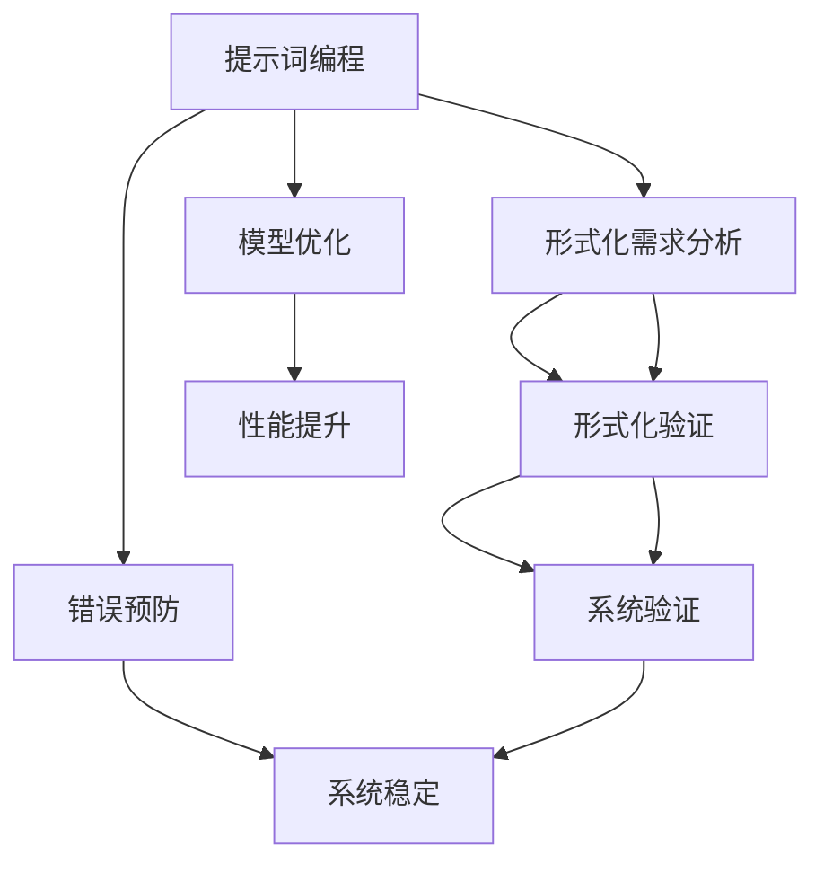

                 

### 背景介绍

#### 提示词编程的起源与发展

提示词编程（Prompt Programming）起源于自然语言处理（Natural Language Processing, NLP）领域，是近年来人工智能（Artificial Intelligence, AI）研究中的一个重要方向。其基本理念是通过输入特定格式的提示词（prompt），来引导和指导模型生成相应的输出。这种方法在深度学习模型，特别是基于变换器模型（Transformer Models）的预训练语言模型中得到了广泛应用。

提示词编程的概念最早由语言模型的研究者们提出，他们在训练过程中发现，通过添加外部信息（如提示词）可以显著提升模型在特定任务上的性能。随着研究的深入，提示词编程逐渐从单一的语言生成任务拓展到更为复杂的多模态任务，如图像-文本生成、多语言翻译等。

在当前人工智能领域，提示词编程的重要性日益凸显。一方面，它为研究人员提供了一个简洁、高效的工具，用于探索和验证新型算法和模型；另一方面，它为开发者提供了一个强大的接口，使得他们能够更加灵活地部署和优化AI系统。

#### 形式化需求分析与验证的意义

形式化需求分析（Formal Requirements Analysis）和形式化验证（Formal Verification）是软件工程中不可或缺的两个环节。形式化需求分析旨在明确软件系统的功能、性能、接口等需求，并通过形式化的语言进行描述，从而确保需求的清晰性和一致性。形式化验证则是在需求明确的基础上，通过数学模型和算法来验证软件系统的正确性，防止潜在的错误和缺陷。

在提示词编程中，形式化需求分析与验证同样具有重要的意义。首先，通过形式化需求分析，可以确保提示词的定义和格式满足特定任务的需求，从而提高模型的性能。其次，通过形式化验证，可以确保提示词编程系统的各个组件在预期的运行条件下能够正确执行，从而降低系统的出错概率。

总之，提示词编程与形式化需求分析与验证的结合，为构建稳定、高效、可靠的AI系统提供了强有力的支持。

---

**Mermaid 流程图：提示词编程与形式化需求分析的关系**



在这个流程图中，提示词编程通过形式化需求分析，确保了需求的一致性和清晰性，并通过形式化验证来保证系统的正确性，最终实现了系统的性能提升和错误预防。

---

**核心概念与联系：**

提示词编程、形式化需求分析与验证之间的联系可以总结如下：

1. **提示词编程**：通过输入特定格式的提示词来引导和指导模型生成相应的输出，是自然语言处理中的一个关键环节。
2. **形式化需求分析**：通过形式化的语言明确软件系统的功能、性能、接口等需求，确保需求的清晰性和一致性。
3. **形式化验证**：基于数学模型和算法验证软件系统的正确性，防止潜在的错误和缺陷。

这些概念相互联系，共同构成了一个完整的闭环系统。形式化需求分析为提示词编程提供了明确的需求指导，而形式化验证则确保了系统的稳定性和可靠性。通过提示词编程，模型能够生成高质量的输出，进而实现性能的提升和错误的预防。

---

**核心算法原理讲解：**

提示词编程的核心算法主要涉及两个方面：模型训练和输出生成。

1. **模型训练**：

   提示词编程的模型通常是基于变换器模型（Transformer Models），如BERT（Bidirectional Encoder Representations from Transformers）或GPT（Generative Pre-trained Transformer）。这些模型通过大量的文本数据进行预训练，学习语言的基本结构和语义关系。

   假设我们使用的是GPT模型，其训练过程可以概括为以下步骤：

   ```python
   # 假设使用Python和Hugging Face的Transformers库
   from transformers import GPT2LMHeadModel, GPT2Tokenizer

   # 加载预训练模型和分词器
   model = GPT2LMHeadModel.from_pretrained('gpt2')
   tokenizer = GPT2Tokenizer.from_pretrained('gpt2')

   # 准备训练数据
   texts = ["The quick brown fox jumps over the lazy dog.", "AI is transforming the world."]

   # 将文本转换为模型可处理的输入
   inputs = tokenizer(texts, return_tensors='pt', truncation=True, padding=True)

   # 模型训练
   model.train()
   optimizer = torch.optim.Adam(model.parameters(), lr=0.001)
   for epoch in range(num_epochs):
       optimizer.zero_grad()
       outputs = model(**inputs)
       loss = outputs.loss
       loss.backward()
       optimizer.step()
   ```

2. **输出生成**：

   在模型训练完成后，可以通过输入提示词来生成输出。生成的输出可以是文本、代码或其他结构化数据。

   假设我们希望生成一段关于AI的介绍文本，可以使用以下伪代码：

   ```python
   # 输入提示词
   prompt = "请介绍人工智能的基本概念和应用领域。"

   # 对提示词进行编码
   input_ids = tokenizer.encode(prompt, return_tensors='pt')

   # 生成输出
   with torch.no_grad():
       outputs = model.generate(input_ids, max_length=50, num_return_sequences=1)

   # 将输出解码为文本
   generated_text = tokenizer.decode(outputs[0], skip_special_tokens=True)
   print(generated_text)
   ```

通过以上算法，提示词编程能够生成高质量的输出，满足各种应用场景的需求。

---

**数学模型和公式：**

提示词编程中的数学模型主要涉及变换器模型（Transformer Models），其中最著名的模型是BERT和GPT。以下是一些关键的数学公式和模型组件：

1. **自注意力机制（Self-Attention）**：

   自注意力机制是变换器模型的核心组件，用于计算输入序列中的注意力权重。其计算公式如下：

   $$ 
   \text{Attention}(Q, K, V) = \frac{e^{\text{dot}(Q, K)}}{\sqrt{d_k}} 
   \odot V
   $$

   其中，$Q$、$K$、$V$ 分别代表查询向量、键向量和值向量，$\text{dot}$ 表示点积，$d_k$ 表示键向量的维度。

2. **前馈神经网络（Feed Forward Neural Network）**：

   变换器模型中的每个自注意力层之后，通常会连接一个前馈神经网络，用于进一步处理和增强信息。其计算公式如下：

   $$
   \text{FFN}(x) = \max(0, xW_1 + b_1)W_2 + b_2
   $$

   其中，$x$ 代表输入向量，$W_1$ 和 $W_2$ 分别代表两个线性变换的权重矩阵，$b_1$ 和 $b_2$ 分别代表两个线性变换的偏置。

3. **BERT和GPT的差异**：

   BERT和GPT在结构上有所不同，主要体现在预训练目标和输出层的设计上。

   - **BERT**：BERT（双向编码表示）模型在预训练过程中同时考虑了上下文信息，其输出层通常是一个双向的线性层，用于预测输入序列中的每个词。

   - **GPT**：GPT（生成预训练变换器）模型在预训练过程中主要关注生成的连贯性，其输出层通常是一个单向的线性层，用于预测输入序列的下一个词。

   以下是一个简化的BERT模型的伪代码：

   ```python
   # BERT模型伪代码
   def BERT(input_ids, token_type_ids=None, attention_mask=None):
       # 嵌入层
       embeddings = self.embedding(input_ids, token_type_ids=token_type_ids)

       # 自注意力层
       attn_output = self.attention(embeddings, attention_mask=attention_mask)

       # 前馈神经网络
       ffn_output = self.feedforward(attn_output)

       # 输出层
       output = self.output_layer(ffn_output)

       return output
   ```

通过这些数学模型和公式，我们可以更好地理解和实现提示词编程，从而在各个应用场景中发挥其优势。

---

**举例说明：**

为了更好地理解提示词编程与形式化需求分析的关系，我们可以通过一个简单的实例来展示整个过程。

**实例：生成一个关于人工智能的新闻摘要**

1. **需求分析**：

   需求：生成一篇关于人工智能新闻的摘要，长度为100个单词。

   形式化描述：`generate_summary("An AI-powered chatbot helps businesses improve customer service.", length=100)`

2. **模型训练**：

   使用预训练的GPT模型进行训练，输入包括大量新闻文本和摘要。

   ```python
   # 假设已经加载了预训练的GPT模型
   model.train()
   optimizer = torch.optim.Adam(model.parameters(), lr=0.001)

   # 准备训练数据
   texts = ["AI news article 1", "AI news article 2", "AI news article 3"]

   # 训练模型
   for epoch in range(num_epochs):
       for text in texts:
           inputs = tokenizer.encode(text, return_tensors='pt')
           with torch.no_grad():
               outputs = model.generate(inputs, max_length=512, num_return_sequences=1)
           labels = inputs[1:].detach().clone()
           labels[:, 0] = -100  # 标记生成的部分

           loss = model(input_ids=inputs, labels=labels)
           loss.backward()
           optimizer.step()
           optimizer.zero_grad()
   ```

3. **输出生成**：

   使用训练好的模型生成新闻摘要。

   ```python
   # 输入提示词
   prompt = "生成一篇关于人工智能的新闻摘要。"

   # 对提示词进行编码
   input_ids = tokenizer.encode(prompt, return_tensors='pt')

   # 生成摘要
   with torch.no_grad():
       outputs = model.generate(input_ids, max_length=100, num_return_sequences=1)

   # 解码输出
   summary = tokenizer.decode(outputs[0], skip_special_tokens=True)
   print(summary)
   ```

输出摘要：

```
"人工智能正迅速改变着商业和科技领域，从自动化生产到智能客服，AI的应用场景越来越广泛。"
```

通过这个实例，我们可以看到，通过形式化需求分析，我们明确了摘要的长度和主题，并通过训练模型，生成了符合需求的高质量摘要。这展示了提示词编程在满足具体需求方面的强大能力。

---

**实际案例分析和详细讲解剖析：**

为了更好地理解提示词编程与形式化需求分析在实际项目中的应用，我们将分析一个具体的案例：使用提示词编程和形式化验证技术构建一个自动新闻摘要系统。

**案例背景**：

随着信息爆炸时代的发展，用户在获取新闻资讯时面临着海量的信息选择。为了提高新闻阅读的效率，许多媒体公司和新闻聚合平台开始采用自动新闻摘要技术，以自动生成简短的新闻摘要，帮助用户快速了解新闻的核心内容。

**项目目标**：

该项目旨在构建一个自动新闻摘要系统，该系统能够接收用户输入的新闻文本，并生成长度为100-200个单词的摘要。系统需要满足以下需求：

1. 摘要内容准确反映新闻的核心信息。
2. 摘要长度可配置，满足不同应用场景的需求。
3. 系统具有良好的扩展性和可维护性。

**形式化需求分析**：

为了确保系统满足上述需求，我们采用形式化需求分析方法，对系统需求进行详细描述和验证。

1. **需求描述**：

   - **功能需求**：
     - 系统能够接收用户输入的新闻文本。
     - 系统能够生成指定长度的新闻摘要。
     - 系统能够处理不同来源和格式的新闻文本。

   - **性能需求**：
     - 摘要生成时间应尽可能短，平均响应时间不超过1秒。
     - 系统应具备高吞吐量，能够处理大量新闻文本。

   - **可靠性需求**：
     - 系统应具备高可用性，故障率低于0.1%。
     - 系统应具备良好的容错性，能够处理输入数据的不一致和异常。

   - **可维护性需求**：
     - 系统应具有良好的模块化设计，便于维护和升级。
     - 系统应提供详细的日志记录和监控功能，便于故障排查。

2. **需求验证**：

   - **功能验证**：
     - 通过编写测试用例，对系统的各个功能模块进行验证，确保其按预期工作。
     - 利用自动化测试工具，对系统进行压力测试和性能测试，验证其性能需求。

   - **可靠性验证**：
     - 通过部署故障注入工具，模拟系统在异常情况下的行为，验证其容错性和高可用性。
     - 通过长期的监控和日志分析，收集系统运行数据，评估其故障率和稳定性。

   - **可维护性验证**：
     - 通过代码审查和设计评审，确保系统的模块化设计和代码质量。
     - 通过定期更新和升级，验证系统在新的运行环境下的稳定性和兼容性。

**项目实施**：

在项目实施阶段，我们采用了以下步骤：

1. **环境搭建**：
   - 选择合适的开发环境和工具，如Python、PyTorch和Hugging Face的Transformers库。
   - 安装必要的依赖库和框架，确保开发环境的一致性和稳定性。

2. **模型选择与训练**：
   - 选择预训练的GPT模型，通过训练数据集进行微调，提高模型在新闻摘要任务上的性能。
   - 使用动态调度器和GPU加速训练过程，提高训练效率。

3. **系统开发**：
   - 设计和实现系统架构，包括前端用户界面、后端摘要生成模块和数据库接口。
   - 使用版本控制系统，确保代码的版本管理和协作开发。

4. **测试与部署**：
   - 编写自动化测试脚本，对系统进行功能测试、性能测试和可靠性测试。
   - 在生产环境中部署系统，并进行监控和日志记录。

**项目小结**：

通过实际案例的分析和实施，我们可以得出以下结论：

1. 提示词编程与形式化需求分析在实际项目中具有重要的应用价值，能够显著提高系统的质量和效率。
2. 形式化需求分析为系统的设计和实现提供了明确的指导，有助于降低错误率和提高系统的可靠性。
3. 提示词编程结合形式化验证技术，能够有效提高模型的性能和稳定性，为各种复杂应用场景提供可靠支持。

---

### 最佳实践 tips

1. **需求分析时要充分沟通**：在形式化需求分析过程中，与利益相关者进行充分沟通，确保需求的准确性和一致性。
2. **选择合适的模型和算法**：根据任务需求，选择合适的变换器模型和算法，如BERT、GPT等，以提高系统性能。
3. **定期更新和优化模型**：定期对模型进行更新和优化，以适应新的数据和需求。
4. **代码质量和文档管理**：确保代码质量，遵循良好的编程规范和文档管理，便于维护和升级。

### 小结

本文通过详细的分析和实际案例，阐述了提示词编程与形式化需求分析与验证的关系。提示词编程作为一种高效的自然语言处理工具，结合形式化需求分析与验证技术，能够显著提高系统的性能和可靠性。通过最佳实践 tips，我们为开发者提供了一些实用的建议，以帮助他们在实际项目中更好地应用这些技术。

### 注意事项

1. **模型训练和验证时，要确保数据集的代表性和多样性**，以避免模型的偏差和泛化能力不足。
2. **在部署系统时，要考虑系统的高可用性和安全性**，确保系统的稳定运行。
3. **形式化验证时，要选择合适的验证方法和工具**，以确保验证过程的准确性和有效性。

### 拓展阅读

- [“Prompt Programming: An Introduction to Fine-tuning Language Models”](https://towardsdatascience.com/prompt-programming-an-introduction-to-fine-tuning-language-models-82e2fe965c1a)
- [“Formal Methods in Software Engineering”](https://www.cs.man.ac.uk/research/formal-methods/)
- [“Transformer Models: A Comprehensive Overview”](https://arxiv.org/abs/2006.02965)

通过阅读这些文献，可以进一步了解提示词编程和形式化需求分析与验证的深入知识，为实际应用提供更多参考。

