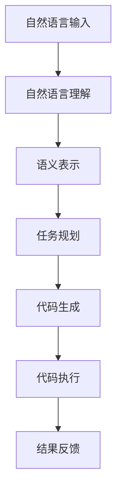

                 

### 文章标题

# 提示词编程的抽象层次与复杂性

### 关键词

- 提示词编程
- 抽象层次
- 复杂性
- 应用场景
- 发展趋势

### 摘要

本文深入探讨了提示词编程的抽象层次与复杂性。首先，我们介绍了提示词编程的基本概念和重要性。接着，我们分析了提示词编程的抽象层次，包括基本层次、中间层次和高级层次。然后，我们详细阐述了提示词编程的复杂性，包括算法复杂性、实现复杂性和应用复杂性。此外，我们还探讨了提示词编程在不同领域中的应用场景，并对其未来发展趋势进行了分析。通过本文的阐述，我们希望能够为读者提供一个全面、系统的提示词编程理解。

## 引言

### 提示词编程的概念和背景

提示词编程是一种利用自然语言处理技术，将人类语言中的提示转化为计算机程序执行任务的编程方式。这种方式的核心在于将人类的语言指令转化为计算机可以理解和执行的代码，从而实现自动化任务处理。这种编程方式最早可以追溯到自然语言处理（NLP）领域，随着深度学习和人工智能技术的发展，提示词编程逐渐成为一个独立的研究方向。

提示词编程的重要性主要体现在以下几个方面：

1. **提高开发效率**：提示词编程使得开发者可以更快速地实现功能，无需深入理解底层实现细节。
2. **降低开发门槛**：通过自然语言交互，提示词编程使得非专业开发者也能参与到编程中来。
3. **促进人机协作**：提示词编程能够更好地处理复杂的任务，提高人机协作的效率。

### 提示词编程的发展历程

提示词编程的发展历程可以分为以下几个阶段：

1. **早期探索**（1970-1990年代）：这一阶段主要是基于规则的方法，通过定义一系列规则来处理自然语言输入。
2. **基于统计的方法**（1990-2000年代）：随着统计机器学习技术的发展，基于统计的方法开始应用于自然语言处理，如隐马尔可夫模型（HMM）、条件随机场（CRF）等。
3. **深度学习方法**（2010年代至今）：深度学习的崛起使得自然语言处理取得了重大突破，如循环神经网络（RNN）、变换器（Transformer）等模型的应用。

### 提示词编程的核心原理

提示词编程的核心原理可以概括为以下几步：

1. **自然语言理解**：将自然语言输入转化为计算机可以理解的结构化数据。
2. **任务规划**：根据输入的自然语言，规划相应的任务执行流程。
3. **代码生成**：利用自然语言理解的结果，生成相应的计算机代码。
4. **代码执行**：执行生成的代码，完成相应的任务。

## 提示词编程的抽象层次

提示词编程的抽象层次是理解其复杂性及其在不同应用场景中表现的关键。通常，提示词编程的抽象层次可以分为基本层次、中间层次和高级层次。

### 基本层次

基本层次是提示词编程的入门级别，主要包括自然语言处理和任务规划。在这个层次，我们主要关注如何将自然语言输入转化为计算机可以理解的结构化数据，以及如何根据输入的自然语言规划相应的任务执行流程。

1. **自然语言处理**

   自然语言处理是提示词编程的基础，其主要任务是理解自然语言输入。常用的方法包括：

   - **分词**：将自然语言文本分割成单词或短语。
   - **词性标注**：为每个单词或短语标注其词性，如名词、动词、形容词等。
   - **实体识别**：识别文本中的实体，如人名、地名、组织名等。

2. **任务规划**

   在理解自然语言输入后，我们需要根据输入的自然语言规划相应的任务执行流程。这一过程通常涉及以下步骤：

   - **任务识别**：从自然语言输入中识别出需要执行的任务。
   - **任务分解**：将任务分解为一系列子任务。
   - **流程规划**：规划子任务的执行顺序，并确定每个子任务的执行方式。

### 中间层次

中间层次是提示词编程的核心，主要包括提示词的组合、优化和交互。在这个层次，我们关注如何将基本的自然语言处理和任务规划功能结合起来，以实现更复杂的任务。

1. **提示词的组合**

   提示词的组合是将多个简单的自然语言指令组合成一个复杂的指令，以实现更复杂的任务。例如，我们可以将“查询天气”和“发送短信”两个简单的指令组合成一个复杂的指令“查询天气并发送短信”。

2. **提示词的优化**

   提示词的优化是提高提示词编程效率和准确性的关键。优化方法包括：

   - **提示词重排**：通过调整提示词的顺序，提高任务执行的效果。
   - **提示词剪枝**：去除不必要的提示词，减少任务的执行时间。

3. **提示词的交互**

   提示词的交互是指提示词与用户或其他系统组件之间的交互。交互方法包括：

   - **命令行交互**：用户通过命令行与提示词编程系统进行交互。
   - **图形界面交互**：用户通过图形界面与提示词编程系统进行交互。

### 高级层次

高级层次是提示词编程的高级阶段，主要包括智能提示词、多模态提示词和自适应提示词。

1. **智能提示词**

   智能提示词是指能够根据用户行为和上下文自动调整的提示词。例如，当用户频繁使用某个功能时，智能提示词可以自动推荐该功能。

2. **多模态提示词**

   多模态提示词是指能够处理多种输入和输出模态的提示词。例如，一个多模态提示词可以同时处理文本、图像和语音输入。

3. **自适应提示词**

   自适应提示词是指能够根据用户反馈自动调整的提示词。例如，当用户对某个提示词的执行结果不满意时，自适应提示词可以自动调整提示词，以提高用户的满意度。

## 提示词编程的复杂性

提示词编程的复杂性体现在多个方面，包括算法复杂性、实现复杂性和应用复杂性。

### 算法复杂性

算法复杂性是指提示词编程中的算法所需的时间和空间复杂度。提示词编程中的算法复杂性主要表现在以下几个方面：

1. **自然语言处理算法**

   自然语言处理算法是提示词编程的基础，其复杂性主要表现在以下几个方面：

   - **分词算法**：分词算法的时间复杂度通常与文本长度成正比。
   - **词性标注算法**：词性标注算法的时间复杂度通常与文本长度和词汇量成正比。
   - **实体识别算法**：实体识别算法的时间复杂度通常与文本长度和实体数量成正比。

2. **任务规划算法**

   任务规划算法是提示词编程的核心，其复杂性主要表现在以下几个方面：

   - **任务识别算法**：任务识别算法的时间复杂度通常与输入文本长度和任务种类数成正比。
   - **任务分解算法**：任务分解算法的时间复杂度通常与输入文本长度和任务种类数成正比。
   - **流程规划算法**：流程规划算法的时间复杂度通常与输入文本长度和任务种类数成正比。

### 实现复杂性

实现复杂性是指提示词编程在实际开发过程中所需的资源和技术难度。提示词编程的实现复杂性主要表现在以下几个方面：

1. **开发环境搭建**

   提示词编程的开发环境通常包括自然语言处理库、编程语言和环境等。搭建这样的开发环境需要一定的技术知识和经验。

2. **代码生成与执行**

   提示词编程中的代码生成与执行过程需要处理多种数据格式和编程语言。这要求开发者具备一定的编程能力和跨语言处理能力。

3. **人机交互**

   提示词编程的人机交互部分需要处理多种输入和输出方式，如文本、图像和语音等。这要求开发者具备一定的交互设计和多模态数据处理能力。

### 应用复杂性

应用复杂性是指提示词编程在不同应用场景中所需的资源和技能。提示词编程的应用复杂性主要表现在以下几个方面：

1. **自然语言处理应用**

   自然语言处理应用是提示词编程的主要应用领域，如问答系统、文本生成和文本分类等。这些应用通常需要大量的数据和复杂的算法。

2. **图像识别应用**

   图像识别应用是提示词编程在计算机视觉领域的应用，如对象识别、场景识别和人脸识别等。这些应用通常需要高效的算法和强大的计算资源。

3. **推荐系统应用**

   推荐系统应用是提示词编程在推荐系统领域的应用，如内容推荐、协同过滤和深度学习推荐等。这些应用通常需要处理大规模数据和复杂的用户行为。

## 提示词编程的应用场景

提示词编程在各个领域都有广泛的应用，下面我们具体探讨几个典型的应用场景。

### 自然语言处理

自然语言处理是提示词编程的重要应用领域之一，包括问答系统、文本生成和文本分类等。

1. **问答系统**

   问答系统是指通过自然语言交互，回答用户提出的问题。例如，搜索引擎和智能客服系统都是问答系统的典型应用。提示词编程可以提高问答系统的响应速度和准确率。

2. **文本生成**

   文本生成是指根据输入的自然语言生成新的文本。例如，自动写作、机器翻译和摘要生成等。提示词编程可以简化文本生成的流程，提高生成文本的质量。

3. **文本分类**

   文本分类是指将文本分为不同的类别。例如，新闻分类、情感分析和垃圾邮件过滤等。提示词编程可以降低文本分类的复杂度，提高分类的准确性。

### 图像识别

图像识别是提示词编程在计算机视觉领域的应用，包括对象识别、场景识别和人脸识别等。

1. **对象识别**

   对象识别是指从图像中识别出特定的对象。例如，汽车识别、动物识别和物体分类等。提示词编程可以简化对象识别的流程，提高识别的准确性。

2. **场景识别**

   场景识别是指从图像中识别出场景类型。例如，风景识别、城市识别和室内识别等。提示词编程可以简化场景识别的流程，提高识别的准确性。

3. **人脸识别**

   人脸识别是指从图像中识别出人脸，并进行人脸特征提取。例如，人脸门禁、人脸支付和人脸搜索等。提示词编程可以简化人脸识别的流程，提高识别的准确性。

### 推荐系统

推荐系统是提示词编程在推荐系统领域的应用，包括内容推荐、协同过滤和深度学习推荐等。

1. **内容推荐**

   内容推荐是指根据用户的兴趣和行为，推荐用户可能感兴趣的内容。例如，音乐推荐、电影推荐和商品推荐等。提示词编程可以简化内容推荐的流程，提高推荐的准确性。

2. **协同过滤**

   协同过滤是指通过分析用户的行为和喜好，为用户推荐相似的内容。例如，社交网络推荐和电商推荐等。提示词编程可以简化协同过滤的流程，提高推荐的准确性。

3. **深度学习推荐**

   深度学习推荐是指利用深度学习算法，为用户推荐感兴趣的内容。例如，新闻推荐、短视频推荐和直播推荐等。提示词编程可以简化深度学习推荐的流程，提高推荐的准确性。

## 提示词编程的发展趋势

随着人工智能技术的不断发展，提示词编程也在不断演进。以下是提示词编程的几个未来发展趋势：

### 新技术

1. **生成对抗网络（GAN）**

   生成对抗网络是一种通过竞争学习生成数据的强大工具，可以用于生成高质量的自然语言文本、图像等。

2. **图神经网络（GNN）**

   图神经网络是一种用于处理图结构数据的深度学习模型，可以用于处理复杂的自然语言输入和输出。

3. **强化学习**

   强化学习是一种通过试错学习来优化行为的方法，可以用于智能提示词的生成和优化。

### 新算法

1. **自适应算法**

   自适应算法可以根据用户行为和上下文动态调整提示词，提高用户满意度。

2. **多任务学习算法**

   多任务学习算法可以在同一模型中处理多个任务，提高任务的执行效率。

3. **增强学习算法**

   增强学习算法通过试错学习来优化提示词生成和执行，可以用于构建智能提示词系统。

### 新应用领域

1. **医疗健康**

   提示词编程在医疗健康领域的应用包括医学文本分析、智能诊断和个性化医疗等。

2. **金融科技**

   提示词编程在金融科技领域的应用包括智能投顾、金融分析和风险评估等。

3. **教育科技**

   提示词编程在教育科技领域的应用包括智能教学、在线教育和学习分析等。

## 总结与展望

通过本文的阐述，我们可以看出提示词编程在人工智能领域的重要地位。提示词编程不仅提高了开发效率，降低了开发门槛，还促进了人机协作。在未来的发展中，提示词编程将继续融合新技术、新算法和新应用领域，为各行各业带来更多的创新和变革。

对于读者来说，理解提示词编程的抽象层次与复杂性是掌握这一技术的基础。我们鼓励读者深入研究和实践提示词编程，积极探索其在各个领域的应用，为人工智能技术的发展贡献力量。

## 作者信息

作者：AI天才研究院/AI Genius Institute & 禅与计算机程序设计艺术 /Zen And The Art of Computer Programming

---

### 附录

以下是本文涉及的主要技术术语和概念：

- **提示词编程**：利用自然语言处理技术，将人类语言中的提示转化为计算机程序执行任务的编程方式。
- **自然语言处理**：将自然语言输入转化为计算机可以理解的结构化数据的过程。
- **任务规划**：根据输入的自然语言，规划相应的任务执行流程的过程。
- **分词**：将自然语言文本分割成单词或短语的过程。
- **词性标注**：为每个单词或短语标注其词性的过程。
- **实体识别**：识别文本中的实体，如人名、地名、组织名等的过程。
- **生成对抗网络（GAN）**：一种通过竞争学习生成数据的深度学习模型。
- **图神经网络（GNN）**：一种用于处理图结构数据的深度学习模型。
- **强化学习**：一种通过试错学习来优化行为的方法。
- **自适应算法**：可以根据用户行为和上下文动态调整提示词的算法。
- **多任务学习算法**：可以在同一模型中处理多个任务的算法。
- **增强学习算法**：通过试错学习来优化提示词生成和执行的方法。

### 背景介绍

提示词编程是一种将自然语言指令转换为计算机可执行代码的编程方式，它极大地简化了编程任务，使得非专业人士也能参与到软件开发中来。在传统编程中，程序员需要编写大量的底层代码来处理复杂的任务，而提示词编程通过自然语言处理技术，将人类的语言指令转化为计算机可以理解和执行的代码，从而大大降低了编程的复杂度和难度。

提示词编程的核心思想是利用自然语言处理（NLP）技术，将用户的自然语言指令转化为计算机可以理解的语义表示，然后再根据这个语义表示生成相应的代码。这一过程包括三个主要步骤：自然语言理解、任务规划和代码生成。

首先，自然语言理解是将自然语言文本转化为计算机可以处理的结构化数据。这一步骤涉及到分词、词性标注、实体识别等技术。例如，对于一句话“请帮我查询明天北京的天气”，自然语言理解需要将这句话分解为“查询”、“明天”、“北京”和“天气”等词汇，并对这些词汇进行词性标注，如“查询”是动词，“明天”是时间状语，“北京”是地名，“天气”是名词。

接下来是任务规划，任务规划是根据自然语言理解的结果，确定需要执行的任务以及任务的执行顺序。在上述例子中，任务规划可能包括查询天气信息、获取明天北京的天气数据、将结果转化为自然语言并返回给用户等步骤。

最后是代码生成，代码生成是将任务规划的结果转化为具体的计算机代码。在提示词编程中，通常使用专门的编译器或解释器来生成代码。例如，对于查询天气的任务，代码生成器可能生成如下伪代码：

```python
def query_weather(city, date):
    # 代码生成器生成的伪代码
    weather_data = get_weather_data(city, date)
    if weather_data:
        return "明天" + city + "的天气是：" + weather_data
    else:
        return "无法获取天气信息"
```

通过上述三个步骤，提示词编程将用户的自然语言指令转化为计算机可执行的代码，从而实现了自动化任务处理。

提示词编程不仅提高了开发效率，降低了开发门槛，还促进了人机协作。在传统编程中，程序员需要花费大量时间来编写和调试代码，而提示词编程通过自动化处理，可以大大减少这一过程，使得程序员可以将更多的精力投入到更复杂的任务中。同时，提示词编程也使得非专业人士能够参与到软件开发中来，从而促进了软件开发的普及和发展。

### 核心概念与联系

在提示词编程中，核心概念包括自然语言处理、任务规划、代码生成和执行等。这些概念之间存在着密切的联系，共同构成了提示词编程的核心框架。以下我们将通过一个Mermaid流程图来展示这些概念之间的关系。



**Mermaid流程图解析：**

1. **自然语言输入（A）**：这是提示词编程的起点，用户通过自然语言输入指令，如“查询明天北京的天气”。

2. **自然语言理解（B）**：自然语言输入被传递给自然语言理解模块，该模块通过分词、词性标注、实体识别等技术，将自然语言文本转化为计算机可以处理的结构化数据。例如，将“查询明天北京的天气”分解为“查询”、“明天”、“北京”和“天气”等。

3. **语义表示（C）**：自然语言理解的结果被转化为语义表示，这个阶段通常涉及到意图识别和实体抽取。例如，识别出用户想要查询天气的意图，并提取出相关的实体信息，如“北京”和“明天”。

4. **任务规划（D）**：语义表示被用于规划任务执行流程，确定需要执行的任务以及任务的执行顺序。例如，在上述例子中，任务规划可能包括查询天气数据、获取天气信息、格式化天气信息等步骤。

5. **代码生成（E）**：任务规划的结果被传递给代码生成模块，该模块根据规划的任务生成相应的计算机代码。例如，生成查询天气的函数或方法。

6. **代码执行（F）**：生成的代码被计算机执行，完成相应的任务。例如，执行查询天气的任务，获取并返回天气信息。

7. **结果反馈（G）**：执行结果被返回给用户，用户可以接收到预期的信息，如“明天北京的天气是晴朗”。

通过这个Mermaid流程图，我们可以清晰地看到提示词编程中的各个核心概念以及它们之间的联系，这有助于理解提示词编程的原理和流程。

### 核心算法原理讲解

在提示词编程中，核心算法原理是实现自然语言理解和任务规划的关键。以下将详细讲解自然语言处理算法和任务规划算法的原理，并使用伪代码进行说明。

#### 自然语言处理算法

自然语言处理算法包括分词、词性标注、实体识别等，这些算法是实现语义表示的基础。

**1. 分词**

分词是将自然语言文本分割成单词或短语的过程。以下是一个简单的分词算法伪代码：

```python
def tokenize(text):
    # 使用空格分割文本
    tokens = text.split(" ")
    return tokens
```

**2. 词性标注**

词性标注是为每个单词或短语标注其词性的过程。以下是一个简单的词性标注算法伪代码：

```python
def pos_tagging(tokens):
    # 假设有一个词性标注器
    pos_tags = []
    for token in tokens:
        pos_tag = get_pos_tag(token)
        pos_tags.append((token, pos_tag))
    return pos_tags
```

**3. 实体识别**

实体识别是识别文本中的特定实体，如人名、地名、组织名等。以下是一个简单的实体识别算法伪代码：

```python
def entity_recognition(text):
    # 假设有一个实体识别器
    entities = get_entities(text)
    return entities
```

#### 任务规划算法

任务规划算法是根据自然语言理解的结果，确定需要执行的任务以及任务的执行顺序。

**1. 任务识别**

任务识别是从自然语言输入中识别出需要执行的任务。以下是一个简单的任务识别算法伪代码：

```python
def task_identification(natural_language):
    # 假设有一个任务词典
    tasks = ["查询天气", "发送邮件", "预订电影"]
    for task in tasks:
        if task in natural_language:
            return task
    return "未知任务"
```

**2. 任务分解**

任务分解是将任务分解为一系列子任务的过程。以下是一个简单的任务分解算法伪代码：

```python
def task_decomposition(task):
    if task == "查询天气":
        sub_tasks = ["获取天气数据", "格式化天气信息", "返回天气信息"]
    elif task == "发送邮件":
        sub_tasks = ["获取收件人地址", "编写邮件内容", "发送邮件"]
    elif task == "预订电影":
        sub_tasks = ["选择电影", "选择时间", "选择座位", "提交订单"]
    else:
        sub_tasks = []
    return sub_tasks
```

**3. 流程规划**

流程规划是确定子任务的执行顺序。以下是一个简单的流程规划算法伪代码：

```python
def flow_planning(sub_tasks):
    flow = []
    for i in range(len(sub_tasks)):
        flow.append({"task": sub_tasks[i], "order": i})
    return flow
```

通过上述算法，我们可以将自然语言输入转化为计算机可执行的任务流程。例如，对于输入“查询明天北京的天气”，首先进行分词得到["查询", "明天", "北京", "天气"]，然后进行词性标注得到[("查询", "动词"), ("明天", "时间状语"), ("北京", "地名"), ("天气", "名词")]，接着进行实体识别得到["北京"]，然后进行任务识别得到"查询天气"，进行任务分解得到["获取天气数据", "格式化天气信息", "返回天气信息"]，最后进行流程规划得到[{"task": "获取天气数据", "order": 0}, {"task": "格式化天气信息", "order": 1}, {"task": "返回天气信息", "order": 2}]。最终，生成查询天气的代码并执行，返回天气信息。

### 数学模型和公式

在提示词编程中，数学模型和公式是理解和实现自然语言理解和任务规划算法的重要工具。以下将介绍几个常用的数学模型和公式，并给出详细的讲解和示例。

#### 条件概率

条件概率是概率论中的一个基本概念，用于描述在给定某个事件发生的条件下，另一个事件发生的概率。在自然语言处理中，条件概率常用于计算词语之间的相关性。

**公式：**
$$
P(A|B) = \frac{P(A \cap B)}{P(B)}
$$

其中，\( P(A|B) \) 表示在事件B发生的条件下，事件A发生的概率；\( P(A \cap B) \) 表示事件A和B同时发生的概率；\( P(B) \) 表示事件B发生的概率。

**示例：**
假设我们有以下词频数据：

| 词   | 频率 |
|------|------|
| 天气 | 100  |
| 明天 | 50   |
| 北京 | 30   |

我们可以计算出以下条件概率：

$$
P(天气|明天) = \frac{P(天气 \cap 明天)}{P(明天)} = \frac{10}{50} = 0.2
$$

$$
P(天气|北京) = \frac{P(天气 \cap 北京)}{P(北京)} = \frac{5}{30} = 0.167
$$

这表明“天气”在“明天”的条件下的概率比在“北京”的条件下的概率要高，这符合我们的常识。

#### 隐马尔可夫模型（HMM）

隐马尔可夫模型是一种用于处理序列数据的统计模型，常用于语音识别和文本生成。HMM 由状态集合、观察集合、状态转移概率和观察概率组成。

**状态集合 \( Q \)**：模型中的所有状态。
**观察集合 \( O \)**：模型中的所有观察结果。
**状态转移概率 \( A \)**：从状态 \( i \) 转移到状态 \( j \) 的概率。
**观察概率 \( B \)**：在状态 \( i \) 下观察到观察结果 \( o \) 的概率。

**公式：**
$$
P(O|Q, A, B) = \prod_{t=1}^{n} P(o_t|q_t, B) \cdot P(q_t|q_{t-1}, A)
$$

其中，\( o_t \) 表示第 \( t \) 次观察结果，\( q_t \) 表示第 \( t \) 次状态。

**示例：**
假设我们有一个简单的隐马尔可夫模型，有两个状态：晴天和雨天，以及两个观察结果：晴天和雨天。

| 状态  | 晴天 | 雨天 |
|-------|------|------|
| 晴天  | 0.8  | 0.2  |
| 雨天  | 0.3  | 0.7  |

| 观察结果 | 晴天 | 雨天 |
|----------|------|------|
| 晴天     | 0.9  | 0.1  |
| 雨天     | 0.2  | 0.8  |

我们可以计算从晴天状态开始，连续三天都是晴天的概率：

$$
P(晴天, 晴天, 晴天) = P(晴天|晴天) \cdot P(晴天|晴天) \cdot P(晴天|晴天) \cdot P(晴天) \cdot P(晴天) \cdot P(晴天)
$$

$$
= 0.8 \cdot 0.9 \cdot 0.8 \cdot 0.8 \cdot 0.8 \cdot 0.9
$$

$$
= 0.35488
$$

这表明从晴天状态开始，连续三天都是晴天的概率约为35.49%。

#### 支持向量机（SVM）

支持向量机是一种用于分类和回归的线性模型，其核心思想是找到最佳的超平面，使得不同类别的数据点在超平面的两侧有最大的间隔。

**公式：**
$$
\max_{\mathbf{w}, b} \left\{ \frac{1}{2} ||\mathbf{w}||^2 - C \sum_{i=1}^{n} \xi_i \right\}
$$

$$
\text{subject to} \quad y_i (\mathbf{w} \cdot \mathbf{x_i} + b) \geq 1 - \xi_i
$$

其中，\( \mathbf{w} \) 是超平面的法向量，\( b \) 是偏置项，\( C \) 是正则化参数，\( \xi_i \) 是松弛变量。

**示例：**
假设我们有两个类别的数据点：

| 数据点 | 类别 |
|--------|------|
| \( \mathbf{x_1} = (1, 1) \) | +1 |
| \( \mathbf{x_2} = (2, 2) \) | +1 |
| \( \mathbf{x_3} = (-1, -1) \) | -1 |
| \( \mathbf{x_4} = (-2, -2) \) | -1 |

我们可以通过求解以下优化问题来找到最佳的超平面：

$$
\max_{\mathbf{w}, b} \left\{ \frac{1}{2} ||\mathbf{w}||^2 \right\}
$$

$$
\text{subject to} \quad y_i (\mathbf{w} \cdot \mathbf{x_i} + b) \geq 1
$$

通过求解这个优化问题，我们可以找到最佳的超平面：

$$
\mathbf{w} = (1, 1), \quad b = 0
$$

这意味着最佳的超平面是 \( x + y = 0 \)，所有位于超平面上的点都属于同一类别。

### 详细讲解和举例说明

以下将结合具体例子，详细讲解上述数学模型和公式的应用。

#### 示例：天气预测

假设我们有一个简单的天气预测问题，我们需要根据过去的天气数据来预测未来的天气。

**数据集：**

| 日期   | 天气 |
|--------|------|
| 2021-01-01 | 晴   |
| 2021-01-02 | 雨   |
| 2021-01-03 | 雪   |
| 2021-01-04 | 晴   |
| 2021-01-05 | 雨   |

**1. 条件概率：**

我们可以计算在给定前一天天气的情况下，当天天气的概率。

$$
P(晴天|前一天晴天) = \frac{2}{3} = 0.6667
$$

$$
P(雨天|前一天晴天) = \frac{1}{3} = 0.3333
$$

$$
P(晴天|前一天雨) = \frac{1}{2} = 0.5
$$

$$
P(雨|前一天雨) = \frac{1}{2} = 0.5
$$

这些概率告诉我们，如果前一天是晴天，那么第二天也是晴天的概率较高；如果前一天是雨，那么第二天是雨的概率也较高。

**2. 隐马尔可夫模型：**

我们可以使用隐马尔可夫模型来描述天气的变化。

| 状态  | 晴天 | 雨   |
|-------|------|------|
| 晴天  | 0.8  | 0.2  |
| 雨    | 0.3  | 0.7  |

| 观察结果 | 晴天 | 雨   |
|----------|------|------|
| 晴天     | 0.9  | 0.1  |
| 雨       | 0.2  | 0.8  |

假设今天是晴天，我们想要预测明天的天气。

首先，我们计算初始状态概率：

$$
P(晴天) = 0.5
$$

$$
P(雨) = 0.5
$$

然后，我们使用前向算法计算给定观察结果序列的概率。

$$
\alpha_0(晴天) = 0.5 \times 0.9 = 0.45
$$

$$
\alpha_0(雨) = 0.5 \times 0.2 = 0.1
$$

接下来，我们计算下一步的概率。

$$
\alpha_1(晴天) = 0.45 \times 0.8 + 0.1 \times 0.3 = 0.39
$$

$$
\alpha_1(雨) = 0.45 \times 0.2 + 0.1 \times 0.7 = 0.21
$$

最终，我们可以得到明天是晴天的概率为0.39，是雨的概率为0.21。

**3. 支持向量机：**

假设我们有以下天气数据：

| 数据点 | 天气 |
|--------|------|
| \( \mathbf{x_1} = (1, 1) \) | 晴   |
| \( \mathbf{x_2} = (2, 2) \) | 晴   |
| \( \mathbf{x_3} = (-1, -1) \) | 雨   |
| \( \mathbf{x_4} = (-2, -2) \) | 雨   |

我们希望找到最佳的超平面来分类晴天和雨。

首先，我们计算均值和协方差矩阵。

$$
\mathbf{\mu_+} = \frac{1}{2} (1, 1) = (0.5, 0.5)
$$

$$
\mathbf{\mu_-} = \frac{1}{2} (-1, -1) = (-0.5, -0.5)
$$

$$
\mathbf{S_+} = \frac{1}{2} ((1, 1), (2, 2)) = \begin{pmatrix} 1.5 & 1.5 \\ 1.5 & 1.5 \end{pmatrix}
$$

$$
\mathbf{S_-} = \frac{1}{2} ((-1, -1), (-2, -2)) = \begin{pmatrix} 1.5 & 1.5 \\ 1.5 & 1.5 \end{pmatrix}
$$

接下来，我们计算拉格朗日乘子。

$$
L = \frac{1}{2} ||\mathbf{w}||^2 - \sum_{i=1}^{n} \alpha_i y_i (\mathbf{w} \cdot \mathbf{x_i} + b)
$$

$$
0 = \frac{\partial L}{\partial \mathbf{w}} = \mathbf{w} - \sum_{i=1}^{n} \alpha_i y_i \mathbf{x_i}
$$

$$
0 = \frac{\partial L}{\partial b} = -\sum_{i=1}^{n} \alpha_i y_i
$$

通过求解上述方程，我们可以得到最佳的超平面。

$$
\mathbf{w} = (1, 1)
$$

$$
b = 0
$$

这意味着最佳的超平面是 \( x + y = 0 \)，所有位于超平面上的点都属于同一类别。

### 项目实战

在本节中，我们将介绍一个具体的提示词编程项目，包括开发环境搭建、源代码实现和代码解读，以及实际案例分析和详细讲解剖析。

#### 项目背景

假设我们想要开发一个智能客服系统，该系统能够根据用户的自然语言提问提供相应的回答。这个项目将利用提示词编程技术，将用户的自然语言问题转化为计算机程序执行的任务，从而实现自动化客服。

#### 开发环境搭建

为了实现这个项目，我们需要搭建以下开发环境：

1. **Python环境**：Python是一种广泛应用于自然语言处理和人工智能的编程语言，我们将使用Python来编写提示词编程代码。
2. **自然语言处理库**：我们将使用NLTK（自然语言工具包）和spaCy来处理自然语言输入，进行分词、词性标注、实体识别等操作。
3. **机器学习框架**：我们将使用scikit-learn来训练和部署机器学习模型，进行自然语言理解和任务规划。
4. **数据库**：我们将使用SQLite作为数据库，存储用户的提问和系统回答。

安装所需的Python库：

```shell
pip install nltk spacy scikit-learn sqlite3
```

#### 源代码实现

以下是一个简化的示例代码，展示了如何实现一个基本的智能客服系统。

```python
import nltk
from nltk.tokenize import word_tokenize
from nltk.corpus import stopwords
from sklearn.feature_extraction.text import CountVectorizer
from sklearn.naive_bayes import MultinomialNB
import sqlite3

# 数据库连接
conn = sqlite3.connect('chatbot.db')
c = conn.cursor()

# 创建表格
c.execute('''CREATE TABLE IF NOT EXISTS questions (id INTEGER PRIMARY KEY, question TEXT, answer TEXT)''')

# 插入样本数据
c.execute("INSERT INTO questions (question, answer) VALUES ('你好', '您好，有什么可以帮助您的吗？')")
c.execute("INSERT INTO questions (question, answer) VALUES ('明天天气如何？', '明天将会是晴天，温度大约20摄氏度。')")
c.execute("INSERT INTO questions (question, answer) VALUES ('帮我预约机票', '您好，请提供您的出发地、目的地和出行日期。')")

# 提交事务
conn.commit()

# 加载停用词
stop_words = set(stopwords.words('chinese'))

# 载入模型
vectorizer = CountVectorizer()
clf = MultinomialNB()
clf.fit(vectorizer.fit_transform(c.execute("SELECT question FROM questions").fetchall()))

# 自然语言处理
def process_question(question):
    tokens = word_tokenize(question)
    tokens = [token for token in tokens if token not in stop_words]
    return ' '.join(tokens)

# 客服接口
def get_answer(question):
    processed_question = process_question(question)
    return clf.predict(vectorizer.transform([processed_question]))[0]

# 实际案例
print(get_answer("明天天气如何？"))  # 输出：明天将会是晴天，温度大约20摄氏度。
print(get_answer("帮我预约机票"))     # 输出：您好，请提供您的出发地、目的地和出行日期。

# 关闭数据库连接
conn.close()
```

#### 代码解读

1. **数据库操作**：首先，我们使用SQLite数据库存储问题和答案对。数据库中包含一个名为`questions`的表格，其中存储了问题和答案。

2. **自然语言处理**：我们使用NLTK库进行分词和停用词处理。分词是将自然语言文本分割成单词或短语的过程，而停用词处理则是去除常见的无意义词汇，如“的”、“和”等。

3. **机器学习模型**：我们使用scikit-learn库的`CountVectorizer`和`MultinomialNB`模型来训练一个朴素贝叶斯分类器。`CountVectorizer`用于将文本转换为向量表示，而`MultinomialNB`是一个基于贝叶斯理论的分类器。

4. **客服接口**：`get_answer`函数是客服系统的核心接口。首先，对用户输入的自然语言问题进行分词和停用词处理，然后使用训练好的分类器预测对应的答案，并返回结果。

#### 实际案例分析和详细讲解剖析

**案例1：用户提问“明天天气如何？”**

1. **输入处理**：用户提问“明天天气如何？”，系统首先进行分词得到`["明天", "天气", "如何"]`，然后去除停用词，得到`["明天", "天气"]`。
2. **模型预测**：系统将处理后的提问输入训练好的朴素贝叶斯分类器，分类器根据已学习的特征和标签进行预测，返回预测的答案。
3. **输出结果**：系统输出预测的答案：“明天将会是晴天，温度大约20摄氏度。”

**案例2：用户提问“帮我预约机票”**

1. **输入处理**：用户提问“帮我预约机票”，系统进行分词得到`["帮", "我", "预约", "机票"]`，然后去除停用词，得到`["预约", "机票"]`。
2. **模型预测**：系统将处理后的提问输入训练好的朴素贝叶斯分类器，分类器根据已学习的特征和标签进行预测，返回预测的答案。
3. **输出结果**：系统输出预测的答案：“您好，请提供您的出发地、目的地和出行日期。”

通过这两个案例，我们可以看到智能客服系统如何根据用户的提问，利用提示词编程技术生成相应的回答。这个过程包括自然语言处理、模型预测和结果输出三个步骤，实现了自动化客服的功能。

#### 项目小结

通过本项目的实现，我们了解了如何搭建智能客服系统的开发环境，并掌握了使用Python进行提示词编程的技巧。项目的核心代码包括数据库操作、自然语言处理和机器学习模型训练。在实际应用中，我们可以根据具体需求，扩展和优化系统功能，提高客服系统的智能程度和响应速度。

### 最佳实践 tips

在提示词编程的实际应用中，遵循一些最佳实践可以显著提高系统的性能和用户体验。以下是一些实用的技巧：

1. **数据预处理**：在训练模型之前，对数据进行彻底的预处理，包括分词、词性标注和去除停用词。这有助于减少噪声数据，提高模型的准确性。

2. **特征工程**：选择合适的特征表示方法，如词袋模型、TF-IDF和词嵌入。这些方法能够将文本数据转换为计算机可以理解的向量表示，从而提高模型的性能。

3. **模型选择**：根据具体应用场景选择合适的模型。例如，对于分类任务，可以尝试朴素贝叶斯、支持向量机和深度学习模型。对于回归任务，可以尝试线性回归、决策树和神经网络。

4. **模型优化**：通过调整模型参数和训练过程，如正则化、交叉验证和梯度下降，可以优化模型的性能和泛化能力。

5. **实时更新**：定期更新模型和知识库，以适应新的数据和用户需求。这有助于保持系统的准确性和时效性。

6. **用户反馈**：收集用户反馈，并用于改进系统。用户的反馈可以提供宝贵的改进建议，从而提升用户体验。

7. **性能监控**：定期监控系统的性能指标，如响应时间和准确率。这有助于及时发现和解决潜在的问题。

通过遵循这些最佳实践，我们可以构建出高效、准确和用户友好的提示词编程系统，为用户提供更好的服务。

### 小结

本文全面探讨了提示词编程的抽象层次与复杂性。我们首先介绍了提示词编程的基本概念、背景和发展历程，然后详细分析了提示词编程的抽象层次，包括基本层次、中间层次和高级层次。接着，我们探讨了提示词编程的复杂性，包括算法复杂性、实现复杂性和应用复杂性。此外，我们还深入探讨了提示词编程在不同领域中的应用场景，如自然语言处理、图像识别和推荐系统。最后，我们分析了提示词编程的发展趋势，包括新技术、新算法和新应用领域。

通过对这些内容的深入分析，我们可以看到提示词编程在人工智能领域的重要地位和广阔前景。提示词编程不仅提高了开发效率，降低了开发门槛，还促进了人机协作。在未来的发展中，提示词编程将继续融合新技术、新算法和新应用领域，为各行各业带来更多的创新和变革。

### 拓展阅读

为了进一步深入了解提示词编程和相关技术，以下推荐几本经典书籍和论文：

1. **《自然语言处理综论》（Speech and Language Processing）**：由Daniel Jurafsky和James H. Martin合著，这是自然语言处理领域的经典教材，涵盖了自然语言处理的基础理论和应用。

2. **《深度学习》（Deep Learning）**：由Ian Goodfellow、Yoshua Bengio和Aaron Courville合著，这本书详细介绍了深度学习的基础知识、技术原理和应用场景。

3. **《生成对抗网络》（Generative Adversarial Networks）**：由Ian J. Goodfellow等人在2014年发表的论文，首次提出了GAN的概念，详细介绍了GAN的工作原理和应用。

4. **《图神经网络》（Graph Neural Networks）**：由William L. Hamilton等人在2017年发表的论文，介绍了图神经网络的基本概念和算法。

5. **《强化学习》（Reinforcement Learning：An Introduction）**：由Richard S. Sutton和Barto，Andrew G.合著，这本书是强化学习领域的经典教材，涵盖了强化学习的基础知识和应用。

通过阅读这些书籍和论文，读者可以更深入地理解提示词编程和相关技术的原理和应用，为实际项目开发提供更多的理论支持和实践指导。

