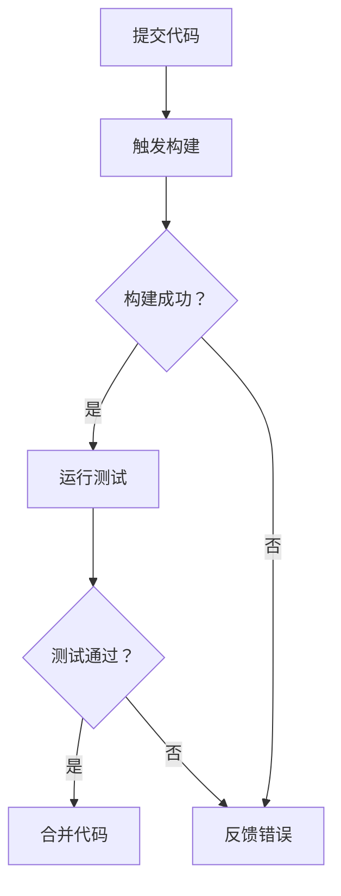
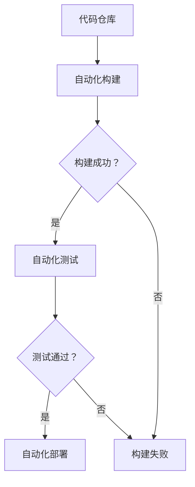
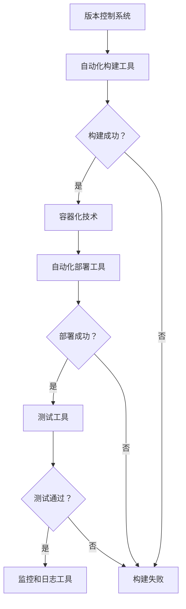

                 

### 文章标题：提示词编程的持续集成与部署

持续集成（Continuous Integration，CI）与持续部署（Continuous Deployment，CD）是现代软件开发中不可或缺的实践，它们能够显著提高软件开发的效率和可靠性。而提示词编程（Prompt Programming）作为人工智能领域的一种重要技术，与CI/CD的结合日益受到关注。本文将深入探讨提示词编程的持续集成与部署，通过详细的讲解和实际案例，帮助读者全面理解这一重要主题。

### 关键词

- 提示词编程
- 持续集成
- 持续部署
- 自动化构建
- 容器化技术
- 版本控制

### 摘要

本文旨在详细阐述提示词编程在持续集成与持续部署中的应用。首先，我们将介绍持续集成与持续部署的基本概念及其重要性。随后，将重点探讨提示词编程的核心原理和应用场景。接着，我们将通过具体的架构设计和流程图，展示CI/CD与提示词编程的融合。最后，通过实际项目实战，提供详细的源代码实现、代码解读和案例分析，以帮助读者掌握这一领域的最佳实践。

### 第1章：引言

持续集成与持续部署是现代软件开发过程中不可或缺的环节。持续集成通过自动化测试和构建，确保代码库中的每个提交都是可合并的。持续部署则通过自动化部署流程，实现软件的快速迭代和发布。两者共同目标是减少软件发布周期，提高软件质量和开发效率。

提示词编程是一种基于提示（prompt）的人工智能技术，通过输入特定的提示，引导模型生成预期的输出。这种技术在自然语言处理、机器学习等领域有广泛应用。将提示词编程与持续集成和持续部署相结合，可以进一步提升软件开发的智能化水平。

本文将围绕以下主题展开：

1. 持续集成与持续部署的基本原理和实践。
2. 提示词编程的核心概念和实现机制。
3. CI/CD与提示词编程的融合架构设计。
4. 实际项目中的CI/CD与提示词编程应用实践。
5. 最佳实践、注意事项和拓展阅读。

### 第2章：持续集成

持续集成（Continuous Integration，CI）是一种软件开发实践，通过频繁地将代码更改合并到主干分支，并自动运行一系列测试，确保代码质量。CI的基本原理如下：

1. **频繁提交**：开发人员频繁提交代码，保持分支与主干的一致性。
2. **自动化测试**：每次提交后，自动运行一系列预定义的测试，包括单元测试、集成测试等。
3. **快速反馈**：测试结果迅速反馈给开发者，发现问题及时修复。

#### 核心概念与联系

持续集成的核心概念包括：

- **版本控制**：使用版本控制系统（如Git）管理代码，确保代码库的一致性和可追溯性。
- **自动化构建**：使用自动化工具（如Jenkins、GitLab CI/CD）构建和测试代码。
- **持续测试**：自动化运行测试，确保代码质量。

这些概念之间的联系可以通过以下Mermaid流程图展示：



#### 持续集成的优势

- **提高代码质量**：通过自动化测试，早期发现并修复缺陷。
- **缩短发布周期**：频繁集成和发布，降低大规模集成时的风险。
- **团队协作**：促进团队成员之间的沟通和协作。

#### 持续集成的实现

持续集成的实现通常包括以下步骤：

1. **配置版本控制系统**：设置Git仓库，并配置分支策略。
2. **编写测试用例**：编写单元测试、集成测试等。
3. **配置自动化构建工具**：设置Jenkins、GitLab CI/CD等。
4. **执行构建和测试**：每次提交代码后，自动化工具会执行构建和测试。
5. **反馈结果**：将测试结果反馈给开发者，包括通过和失败的测试。

#### 持续集成的工具

常用的持续集成工具包括：

- **Jenkins**：开源的持续集成服务器，支持多种插件。
- **GitLab CI/CD**：GitLab内置的CI/CD工具，简单易用。
- **Travis CI**：基于GitHub的持续集成服务。
- **CircleCI**：云端的持续集成服务。

### 第3章：持续部署

持续部署（Continuous Deployment，CD）是持续集成（CI）的延伸，通过自动化流程实现软件的持续交付和发布。CD的基本原理如下：

1. **自动化构建**：从版本控制系统获取代码，并自动构建出可执行的软件包。
2. **自动化测试**：构建完成后，自动运行一系列测试，确保软件质量。
3. **自动化部署**：测试通过后，自动将软件部署到生产环境。

#### 核心概念与联系

持续部署的核心概念包括：

- **自动化构建**：使用构建工具（如Maven、Gradle）自动化构建项目。
- **自动化测试**：使用自动化测试工具（如JUnit、Selenium）执行测试。
- **自动化部署**：使用部署工具（如Ansible、Kubernetes）自动化部署软件。

这些概念之间的联系可以通过以下Mermaid流程图展示：



#### 持续部署的优势

- **快速交付**：自动化流程缩短了软件交付周期。
- **减少错误**：自动化测试和部署减少了人为错误。
- **增强稳定性**：通过持续部署，快速修复缺陷，提高软件稳定性。

#### 持续部署的实现

持续部署的实现通常包括以下步骤：

1. **选择部署工具**：根据项目需求选择合适的部署工具（如Kubernetes、Docker）。
2. **配置自动化流程**：编写部署脚本，配置自动化流程。
3. **执行部署**：自动化工具会根据配置的流程执行部署。
4. **监控和反馈**：部署完成后，监控软件状态，并反馈给相关人员。

#### 持续部署的策略

常见的持续部署策略包括：

- **蓝绿部署**：同时运行两个环境（蓝环境和绿环境），逐步切换流量。
- **灰度发布**：将新版本部署到部分用户，观察效果后再全面上线。
- **滚动更新**：逐步更新实例，确保服务不中断。

### 第4章：提示词编程

提示词编程（Prompt Programming）是一种通过输入提示（prompt）来引导模型生成预期输出的方法。它广泛应用于自然语言处理、机器学习等领域。以下是提示词编程的基本概念和原理。

#### 核心概念

- **提示（Prompt）**：输入给模型的一段文本或数据，用于引导模型生成预期的输出。
- **模型（Model）**：用于处理提示并生成输出的算法或神经网络。
- **响应（Response）**：模型根据提示生成的输出。

#### 提示词的构成

提示词通常包括以下部分：

- **问题或任务**：明确指定需要解决的问题或任务。
- **背景信息**：提供与任务相关的背景信息，帮助模型更好地理解任务。
- **约束条件**：指定任务需要满足的条件或限制。
- **示例**：提供与任务相关的示例，帮助模型更好地理解任务。

#### 提示词的分类

根据用途和形式，提示词可以分为以下几类：

- **简单提示**：直接给出问题或任务。
- **复杂提示**：包括背景信息、约束条件和示例。
- **交互式提示**：通过与用户的交互逐步获取提示信息。

#### 提示词编程的应用场景

提示词编程在以下应用场景中具有显著优势：

- **自然语言处理**：用于生成文本摘要、翻译、问答系统等。
- **机器学习**：用于训练模型、调整参数、优化性能等。
- **自动化编程**：通过生成代码模板，辅助开发人员编写代码。

#### 提示词编程的挑战

- **准确性**：确保提示词能够准确引导模型生成预期的输出。
- **灵活性**：提示词需要能够适应不同的任务和场景。
- **可解释性**：提高提示词编程的可解释性，便于开发者理解和调试。

### 第5章：架构设计

持续集成与持续部署的架构设计对于实现高效、可靠的软件交付至关重要。在本章中，我们将探讨CI/CD与提示词编程的融合架构设计，包括系统的总体架构、组件之间的交互关系以及关键流程。

#### 系统总体架构

持续集成与持续部署的系统架构通常包括以下组件：

- **版本控制系统**：如Git，用于管理代码和版本。
- **自动化构建工具**：如Jenkins、GitLab CI/CD，用于自动化构建和测试。
- **容器化技术**：如Docker，用于打包和部署应用程序。
- **自动化部署工具**：如Kubernetes，用于自动化部署和管理应用程序。
- **测试工具**：如JUnit、Selenium，用于执行自动化测试。
- **监控和日志工具**：如Prometheus、Grafana，用于监控应用程序的状态和性能。

这些组件共同构成了一个自动化、可扩展的软件交付系统。

#### 组件之间的交互关系

组件之间的交互关系可以通过以下Mermaid流程图展示：



#### 关键流程

持续集成与持续部署的关键流程包括：

1. **代码提交**：开发人员将代码提交到版本控制系统。
2. **构建和测试**：自动化构建工具根据提交的代码执行构建和测试。
3. **部署**：构建和测试通过后，自动化部署工具将应用程序部署到生产环境。
4. **监控和日志**：监控和日志工具实时监控应用程序的状态和性能。

#### 架构设计原则

在架构设计时，应遵循以下原则：

- **可扩展性**：系统应能够轻松扩展以适应增加的负载和需求。
- **灵活性**：系统应能够灵活适应不同的应用场景和需求。
- **高效性**：系统应能够高效地执行构建、测试和部署过程。
- **安全性**：确保系统中的数据和代码的安全性。

### 第6章：工具与平台

在实现持续集成与持续部署的过程中，选择合适的工具和平台至关重要。本章将介绍几种常用的工具和平台，包括版本控制系统、自动化构建工具、容器化技术、自动化部署工具以及测试工具。

#### 版本控制系统

版本控制系统是持续集成与持续部署的核心组件之一。以下是一些常用的版本控制系统：

- **Git**：开源的分布式版本控制系统，支持分支管理和合并操作。
- **SVN**：集中式的版本控制系统，适用于小型团队。
- **Mercurial**：开源的分布式版本控制系统，与Git兼容。

#### 自动化构建工具

自动化构建工具用于自动化构建和测试代码。以下是一些常用的自动化构建工具：

- **Jenkins**：开源的持续集成服务器，支持多种插件和构建策略。
- **GitLab CI/CD**：GitLab内置的持续集成与持续部署工具，简单易用。
- **Travis CI**：基于GitHub的持续集成服务，支持多种编程语言。
- **CircleCI**：云端的持续集成服务，提供高性能和可扩展性。

#### 容器化技术

容器化技术用于打包和部署应用程序。以下是一些常用的容器化技术：

- **Docker**：开源的容器化平台，用于创建、运行和分发容器。
- **Kubernetes**：开源的容器编排平台，用于自动化部署、扩展和管理容器。
- **Podman**：开源的容器平台，与Docker兼容。

#### 自动化部署工具

自动化部署工具用于自动化部署应用程序。以下是一些常用的自动化部署工具：

- **Ansible**：开源的自动化部署工具，基于Python编写，支持Linux、Windows等操作系统。
- **Puppet**：开源的自动化部署工具，用于配置管理和部署。
- **Chef**：开源的自动化部署工具，支持多种编程语言。

#### 测试工具

测试工具用于执行自动化测试，确保代码质量和应用程序性能。以下是一些常用的测试工具：

- **JUnit**：Java编写的开源测试框架，用于编写和执行单元测试。
- **Selenium**：开源的自动化测试工具，用于Web应用程序的测试。
- **TestNG**：Java编写的开源测试框架，用于编写和执行测试用例。

#### 平台选择与配置

在选择平台时，需要考虑以下因素：

- **团队规模**：小型团队可以选择GitLab CI/CD等简单易用的平台，大型团队可以选择Jenkins等灵活的平台。
- **开发语言**：根据项目使用的编程语言选择相应的构建和测试工具。
- **扩展性**：选择能够轻松扩展和定制化的平台。

在配置平台时，需要遵循以下原则：

- **简洁性**：简化配置，减少出错的可能性。
- **可维护性**：配置易于维护和更新。
- **安全性**：确保配置符合安全标准，防止安全漏洞。

#### 平台扩展与优化

平台扩展与优化包括以下方面：

- **性能优化**：通过调整配置和资源分配，提高平台性能。
- **监控与日志**：实时监控平台状态和性能，并记录日志以便分析。
- **自动化**：使用脚本和工具自动化日常任务，提高工作效率。
- **备份与恢复**：定期备份配置和数据，确保数据安全。

### 第7章：项目实战

在本章中，我们将通过一个实际项目，展示如何搭建持续集成与持续部署流程，并实现提示词编程。这个项目将使用Python作为主要编程语言，并基于Docker进行容器化。

#### 实战一：搭建CI/CD流程

1. **环境准备**

   首先，我们需要准备一个基于Docker的Python开发环境。在本地计算机上安装Docker，并创建一个名为`python-app`的Docker镜像。

   ```bash
   docker build -t python-app .
   ```

2. **编写测试用例**

   接下来，编写一个简单的Python测试用例，用于测试我们的应用程序。将测试用例保存在一个名为`tests.py`的文件中。

   ```python
   # tests.py
   import unittest
   from app import calculate

   class TestCalculate(unittest.TestCase):
       def test_add(self):
           self.assertEqual(calculate(2, 3), 5)
       def test_sub(self):
           self.assertEqual(calculate(5, 2), 3)
   
   if __name__ == '__main__':
       unittest.main()
   ```

3. **配置Jenkins**

   在本地计算机上安装Jenkins，并配置一个名为`CI/CD`的工作流。工作流将包含以下步骤：

   - 从Git仓库获取代码。
   - 构建Docker镜像。
   - 运行测试用例。

   Jenkinsfile配置如下：

   ```groovy
   pipeline {
       agent any
       stages {
           stage('Checkout') {
               checkout([
                   $class: 'GitSCM',
                   branches: [[name: 'master']],
                   url: 'https://github.com/your_username/your_project.git'
               ])
           }
           stage('Build') {
               container('python-app') {
                   sh 'docker build -t python-app .'
               }
           }
           stage('Test') {
               container('python-app') {
                   sh 'docker run --rm python-app pytest tests.py'
               }
           }
       }
       post {
           success {
               echo 'CI/CD流程成功完成'
           }
           failure {
               echo 'CI/CD流程失败'
           }
       }
   }
   ```

4. **执行CI/CD流程**

   在Jenkins中触发CI/CD流程，并查看构建日志。如果测试通过，Jenkins会成功构建并运行测试用例。

#### 实战二：实现提示词编程

1. **编写提示词**

   根据项目需求，编写一个简单的提示词，用于训练我们的模型。将提示词保存在一个名为`prompt.txt`的文件中。

   ```plaintext
   请编写一个函数，实现以下功能：
   - 输入两个整数a和b。
   - 返回它们的和。
   示例：
   - calculate(2, 3) 应返回 5。
   - calculate(5, 2) 应返回 3。
   ```

2. **训练模型**

   使用提示词编程框架（如Hugging Face的Transformers），训练一个简单的神经网络模型。以下是一个Python代码示例：

   ```python
   from transformers import TrainingArguments, TrainingLoop
   from transformers import GPT2ForSequenceClassification
   import torch
   
   # 加载预训练模型
   model = GPT2ForSequenceClassification.from_pretrained('gpt2')
   
   # 定义训练参数
   training_args = TrainingArguments(
       output_dir='./results',
       num_train_epochs=3,
       per_device_train_batch_size=8,
       save_steps=2000,
   )
   
   # 定义训练循环
   training_loop = TrainingLoop(
       model=model,
       args=training_args,
       train_dataloader=None,
       eval_dataloader=None,
   )
   
   # 训练模型
   training_loop.train()
   ```

3. **生成代码**

   使用训练好的模型，生成实现计算功能的Python代码。以下是一个Python代码示例：

   ```python
   from transformers import GPT2LMHeadModel
   import torch
   
   # 加载训练好的模型
   model = GPT2LMHeadModel.from_pretrained('gpt2')
   
   # 定义输入文本
   input_text = "请编写一个函数，实现以下功能：\n - 输入两个整数a和b。\n - 返回它们的和。\n 示例：\n - calculate(2, 3) 应返回 5。\n - calculate(5, 2) 应返回 3。"
   
   # 生成代码
   with torch.no_grad():
       output = model.generate(torch.tensor([model.tokenizer.encode(input_text)]), max_length=50)
   
   # 解码输出文本
   code = model.tokenizer.decode(output, skip_special_tokens=True)
   print(code)
   ```

4. **部署代码**

   将生成的代码部署到生产环境，使用Docker容器运行。以下是一个Dockerfile示例：

   ```Dockerfile
   FROM python:3.8-slim
   WORKDIR /app
   COPY . .
   RUN pip install -r requirements.txt
   ENTRYPOINT ["python", "app.py"]
   ```

   构建并运行Docker容器：

   ```bash
   docker build -t python-app .
   docker run -d -p 8080:8080 python-app
   ```

   访问`http://localhost:8080`，测试计算功能。

#### 项目小结

通过本项目的实践，我们成功地搭建了持续集成与持续部署流程，并实现了提示词编程。以下是一些项目小结和注意事项：

- **CI/CD流程**：CI/CD流程是确保代码质量和快速迭代的关键。我们需要确保构建和测试步骤自动化，并实时反馈结果。
- **提示词编程**：提示词编程是一种高效的人工智能技术，可以用于生成代码、优化模型等。但我们需要注意提示词的准确性和灵活性。
- **容器化技术**：容器化技术可以简化部署和运维，提高系统的可扩展性和可靠性。我们需要合理使用Docker等工具，确保应用程序能够在不同的环境中稳定运行。
- **最佳实践**：在实际项目中，我们需要遵循最佳实践，包括代码规范、测试覆盖率和文档编写等。这些最佳实践有助于提高代码质量和团队协作效率。

#### 拓展阅读

- **持续集成与持续部署**：
  - 《持续集成实战》作者：Paul M. Duvall、Steve Matyas、Andrew Glover
  - 《Jenkins实战》作者：云动架构组
- **提示词编程**：
  - 《提示词编程：原理与实践》作者：李航
  - 《自然语言处理实战》作者：Peter Harrington
- **容器化技术**：
  - 《Docker实战》作者：Jason Priestley
  - 《Kubernetes实战》作者：Kelsey Hightower、 Brendan Burns、Joe Beda

### 附录

#### 附录一：参考资料

- 《持续集成实战》
- 《Jenkins实战》
- 《提示词编程：原理与实践》
- 《自然语言处理实战》
- 《Docker实战》
- 《Kubernetes实战》

#### 附录二：扩展阅读

- [Jenkins官方文档](https://www.jenkins.io/doc/)
- [GitLab CI/CD官方文档](https://docs.gitlab.com/ee/ci/)
- [Docker官方文档](https://docs.docker.com/)
- [Kubernetes官方文档](https://kubernetes.io/docs/)
- [Hugging Face官方文档](https://huggingface.co/transformers)

### 作者

**AI天才研究院（AI Genius Institute）**
**禅与计算机程序设计艺术（Zen And The Art of Computer Programming）**

