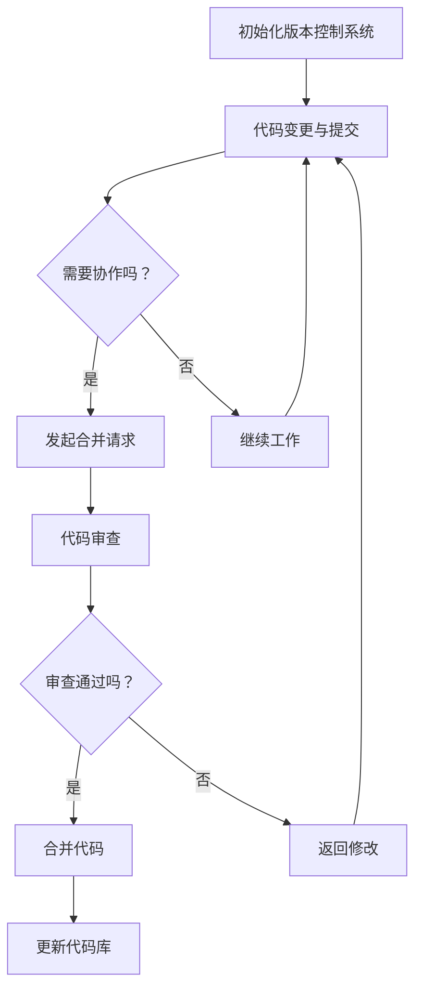

                 

### 引言

随着人工智能（AI）技术的迅猛发展，提示词编程（Prompt Programming）作为一种创新的编程范式，正逐渐崭露头角。提示词编程通过将问题转化为自然语言提示词，让计算机自动生成解决方案，实现了编程与人类语言的深度融合。然而，在快速迭代的开发环境中，版本控制和协作机制成为确保代码质量和开发效率的关键。

版本控制是一种管理软件开发过程中代码变化的机制，它允许开发人员跟踪和协调代码的不同版本。通过版本控制系统，开发人员可以轻松回滚到以前的状态，避免因误操作导致的代码崩溃。协作机制则确保团队成员在共同开发项目时能够高效协作，避免冲突和重复工作。

本文旨在探讨提示词编程中的版本控制与协作机制，通过以下几部分内容：

1. **背景介绍**：介绍提示词编程的起源、发展和应用领域。
2. **核心概念与联系**：详细阐述版本控制与协作机制的基本概念，并通过Mermaid流程图展示它们之间的关系。
3. **核心算法原理讲解**：使用伪代码和LaTeX公式详细解释版本控制算法和协作机制的原理。
4. **项目实战**：提供一个实际的项目案例，详细描述开发环境搭建、源代码实现、代码解读、应用分析和项目小结。
5. **最佳实践与注意事项**：总结项目实战中的经验，提供一些最佳实践和注意事项。

通过本文的讨论，我们希望能够帮助读者理解并掌握提示词编程中的版本控制与协作机制，从而提升软件开发效率和代码质量。

### 背景介绍

提示词编程的概念最早可以追溯到20世纪80年代，当时科学家和工程师们开始探索如何将自然语言处理（NLP）与计算机编程相结合。在早期的尝试中，研究人员尝试通过预定义的规则和模式来将自然语言提示转化为计算机代码。然而，这种方法存在着明显的局限性，特别是在处理复杂问题和动态变化的需求时。

随着深度学习和生成对抗网络（GAN）等技术的兴起，提示词编程得到了新的生命力。特别是在近年来，基于大型语言模型（如GPT-3、Turingbot等）的开发，提示词编程逐渐成为一种高效、灵活的编程范式。这些模型能够理解复杂的自然语言指令，并生成相应的代码，大大简化了编程的复杂性。

应用领域方面，提示词编程在多个领域展现了其强大的潜力。在自动化测试中，开发人员可以使用自然语言描述测试用例，让模型自动生成测试代码；在数据科学领域，提示词编程可以帮助用户通过简单的自然语言指令进行数据预处理和模型训练；在软件开发中，提示词编程能够帮助团队快速迭代和优化代码。

版本控制与协作机制在软件开发中的重要性不言而喻。版本控制系统能够帮助开发人员跟踪代码的每次更改，记录更改的详细信息，如修改者、修改时间和修改内容。这不仅有助于避免代码冲突，还能在出现问题时快速回滚到之前的状态，减少调试的难度。

协作机制则确保团队成员之间能够高效地协作。在多个人共同开发一个项目时，协作机制可以避免重复劳动，确保每个人的工作都是基于最新的代码。此外，协作机制还可以通过代码审查、合并请求（Pull Request）等手段提高代码质量，确保项目的稳定性和可靠性。

总的来说，提示词编程的版本控制和协作机制不仅提升了开发效率，还确保了代码的质量和项目的稳定性。随着人工智能技术的不断进步，这些机制将在未来的软件开发中发挥越来越重要的作用。

### 核心概念与联系

在讨论提示词编程的版本控制与协作机制之前，我们需要先明确几个核心概念，并展示它们之间的关系。

#### 版本控制

版本控制是一种管理软件开发过程中代码变化的机制。它的主要目标是确保代码的完整性和一致性，同时允许开发人员在代码库中进行实验和迭代。版本控制系统（Version Control System，VCS）是实现版本控制的核心工具。常见的版本控制系统包括Git、SVN和Mercurial等。

版本控制的主要功能包括：

1. **追踪变更**：版本控制系统可以记录每个代码文件的每次修改，包括修改者、修改时间和修改内容。
2. **分支管理**：开发人员可以在不同的分支上独立工作，以避免对主分支的干扰。在需要时，可以合并分支上的更改。
3. **回滚**：如果代码出现问题，版本控制系统可以回滚到之前的版本，从而恢复到稳定的状态。
4. **协作**：版本控制系统支持多人协作，开发人员可以在同一个项目中同时工作，并通过合并请求（Pull Request）等方式协调代码的合并。

#### 协作机制

协作机制是一种确保团队成员在共同开发项目时能够高效协作的机制。在提示词编程中，协作机制尤为重要，因为它涉及到多个开发人员如何共同优化和迭代代码。协作机制通常包括以下方面：

1. **代码审查（Code Review）**：在代码提交之前，其他团队成员可以审查代码，确保代码质量，发现潜在的问题。
2. **合并请求（Pull Request）**：团队成员通过合并请求将他们在自己的分支上的工作合并到主分支中，从而实现代码的同步。
3. **协作工具**：如GitLab、GitHub等平台提供了丰富的协作工具，支持代码审查、合并请求、任务管理等功能。
4. **沟通和反馈**：团队成员之间的沟通和反馈是确保协作顺利进行的关键。通过即时通讯工具、会议等方式，团队成员可以及时交流想法和问题。

#### 版本控制与协作机制的关系

版本控制和协作机制是相辅相成的。版本控制系统为协作机制提供了基础，使得团队成员可以追踪代码的变化、管理分支和合并代码。而协作机制则确保了版本控制系统能够有效利用，团队成员能够在统一的标准下协同工作。

以下是版本控制和协作机制之间的Mermaid流程图：



**Mermaid流程图说明**：

- **A[初始化版本控制系统]**：开发者在开始项目时初始化版本控制系统，建立项目的代码库。
- **B[代码变更与提交]**：开发者对代码进行修改后，将其提交到版本控制系统中。
- **C{需要协作吗？}]：检查当前变更是否需要协作。
- **D[发起合并请求]**：如果需要协作，开发者会发起合并请求。
- **F[代码审查]**：其他团队成员对合并请求的代码进行审查。
- **G{审查通过吗？}]：审查结果决定代码是否被合并。
- **H[合并代码]**：如果审查通过，代码将被合并到主分支。
- **I[返回修改]**：如果审查未通过，开发者需要根据反馈进行修改。
- **J[更新代码库]**：代码合并到主分支后，更新代码库，确保所有团队成员使用的是最新的代码。

通过上述核心概念和Mermaid流程图的展示，我们可以更好地理解提示词编程中的版本控制和协作机制之间的关系，为后续的深入探讨打下基础。

### 版本控制算法原理讲解

版本控制系统的核心在于其算法，这些算法决定了如何高效、准确地追踪和管理代码的版本。以下是几个常见的版本控制算法，以及它们的工作原理、伪代码和LaTeX数学模型。

#### 一、Git算法

Git是目前最流行的分布式版本控制系统，其核心算法是基于内容地址（Content Addressable）的版本控制。Git通过哈希函数为每个提交生成一个唯一的标识，确保版本历史的不可篡改。

**工作原理：**
Git将项目的历史记录存储为一系列的提交（Commit）。每个提交包含一个哈希值（Hash），该哈希值是由提交内容计算得出的。通过这个哈希值，Git可以快速定位到提交的详细内容。

**伪代码：**
```python
function git_commit(content):
    hash_value = hash_function(content)
    store_commit(hash_value, content)
    return hash_value

function git_hash(content):
    return hash_function(content)
```

**LaTeX数学模型：**
$$
H = hash_function(content)
$$
其中，\( H \) 是哈希值，\( content \) 是提交内容，\( hash_function \) 是哈希函数。

#### 二、SVN算法

Subversion（SVN）是一种中心化的版本控制系统，它通过修订版本（Revision）来追踪代码的变更。每个修订版本都有一个唯一的标识号（RevNum），用于表示其位置。

**工作原理：**
SVN将代码库存储为一系列的修订版本。每次提交都会增加一个修订版本号，并且每个修订版本都包含前一个修订版本的引用信息。

**伪代码：**
```python
function svn_commit(content):
    current_rev = get_current_rev()
    next_rev = current_rev + 1
    store_commit(next_rev, content)
    return next_rev

function get_current_rev():
    return max(rev_num)
```

**LaTeX数学模型：**
$$
rev\_num = max(rev\_num)
$$
其中，\( rev\_num \) 是修订版本号。

#### 三、Mercurial算法

Mercurial是一种分布式版本控制系统，其算法与Git类似，也是基于内容地址的版本控制。

**工作原理：**
Mercurial通过生成唯一的节点ID（Node ID）来追踪提交。每个节点ID都是通过哈希函数计算得出的，确保其唯一性。

**伪代码：**
```python
function hg_commit(content):
    node_id = hash_function(content)
    store_commit(node_id, content)
    return node_id

function hg_hash(content):
    return hash_function(content)
```

**LaTeX数学模型：**
$$
node\_id = hash_function(content)
$$
其中，\( node\_id \) 是节点ID，\( content \) 是提交内容，\( hash_function \) 是哈希函数。

通过上述三种算法的详细讲解，我们可以看到版本控制算法在保证代码历史记录的完整性和一致性方面起到了关键作用。Git的内容地址算法提供了高效率和强一致性，SVN的修订版本算法提供了简单的中心化管理，而Mercurial则结合了两者的优势，成为许多项目的首选。

### 协作机制算法原理讲解

协作机制在提示词编程项目中至关重要，它能够确保团队成员之间的代码同步、审查和合并，从而提高开发效率和代码质量。以下是几种常见的协作机制算法，以及它们的工作原理、伪代码和LaTeX数学模型。

#### 一、代码审查算法

代码审查（Code Review）是一种确保代码质量和一致性的手段。在代码提交前，其他团队成员会审查代码，发现潜在的问题并提出改进建议。

**工作原理：**
代码审查通常包括以下步骤：
1. **提交流程**：开发者将代码修改提交为合并请求（Pull Request）。
2. **审查流程**：其他团队成员对合并请求的代码进行审查，标记出代码中的问题。
3. **反馈流程**：审查者提出反馈，开发者根据反馈进行代码修改。

**伪代码：**
```python
function code_review(pull_request):
    reviewer_list = get_reviewers(pull_request)
    for reviewer in reviewer_list:
        review_result = reviewer.review(pull_request)
        if review_result.has_issues:
            report_issue(pull_request, review_result.issues)
    if all_issues_resolved(pull_request):
        merge_pull_request(pull_request)
```

**LaTeX数学模型：**
$$
review\_result = reviewer.review(pull\_request)
$$
其中，\( reviewer \) 是审查者，\( pull\_request \) 是合并请求，\( review\_result \) 是审查结果。

#### 二、合并请求算法

合并请求（Pull Request，PR）是团队成员之间协作的重要工具。通过合并请求，开发者可以提交代码修改，并请求其他团队成员进行审查和合并。

**工作原理：**
合并请求的基本流程包括：
1. **创建请求**：开发者从自己的分支创建合并请求，指向主分支。
2. **审查请求**：其他团队成员对合并请求的代码进行审查。
3. **合并代码**：如果审查通过，开发者或管理员将合并请求的代码合并到主分支。

**伪代码：**
```python
function create_pull_request(source_branch, target_branch):
    pull_request = create_new_request(source_branch, target_branch)
    return pull_request

function review_pull_request(pull_request):
    review_status = in_progress
    if all_reviews_passed(pull_request):
        review_status = passed
    else:
        review_status = failed
    return review_status

function merge_pull_request(pull_request):
    if review_status == passed:
        merge_code(pull_request)
```

**LaTeX数学模型：**
$$
pull\_request = create\_new\_request(source\_branch, target\_branch)
$$
其中，\( source\_branch \) 是源分支，\( target\_branch \) 是目标分支，\( pull\_request \) 是合并请求。

#### 三、协作工具算法

现代协作工具如GitHub、GitLab等提供了丰富的功能，帮助团队高效协作。以下是这些工具的核心算法：

**工作原理：**
协作工具通常包括以下功能：
1. **任务管理**：分配任务、跟踪任务进度。
2. **仓库管理**：创建仓库、管理分支。
3. **通知系统**：发送通知、提醒团队成员。

**伪代码：**
```python
function create_task(task_description):
    new_task = create_new_task(task_description)
    return new_task

function assign_task(task, assignee):
    assign_task_to_user(task, assignee)

function notify_user(user, message):
    send_notification(user, message)
```

**LaTeX数学模型：**
$$
task = create_new_task(task\_description)
$$
其中，\( task\_description \) 是任务描述，\( new\_task \) 是新任务。

通过上述三种协作机制算法的讲解，我们可以看到，代码审查、合并请求和协作工具共同构成了一个高效的协作框架，使得团队成员能够顺畅地协同工作。这些算法不仅提高了开发效率，还确保了代码质量，为项目的成功奠定了基础。

### 实战案例：搭建提示词编程环境

为了演示提示词编程的版本控制和协作机制，我们将构建一个简单的项目，这个项目将使用Python和Git作为主要工具。以下是项目的详细步骤，包括开发环境搭建、源代码实现和代码解读。

#### 1. 开发环境搭建

在开始项目之前，我们需要确保系统上已经安装了Python和Git。

**步骤1.1：安装Python**

Python是一个广泛使用的编程语言，许多提示词编程工具都是基于Python开发的。我们可以通过Python的官方网站（https://www.python.org/）下载安装包，或者使用包管理器如pip进行安装。

```bash
# 使用pip安装Python
pip install python
```

**步骤1.2：安装Git**

Git是版本控制系统的核心工具。同样，我们可以通过Git的官方网站（https://git-scm.com/）下载安装包，或者使用包管理器进行安装。

```bash
# 使用pip安装Git
pip install git
```

**步骤1.3：验证安装**

安装完成后，我们可以通过以下命令验证Python和Git是否已经成功安装。

```bash
python --version
git --version
```

#### 2. 源代码实现

接下来，我们将使用Python编写一个简单的提示词编程脚本，并使用Git进行版本控制。

**步骤2.1：创建项目目录**

在终端中创建一个项目目录，并切换到该目录。

```bash
mkdir prompt_programming_project
cd prompt_programming_project
```

**步骤2.2：初始化Git仓库**

在项目目录中初始化Git仓库。

```bash
git init
```

**步骤2.3：编写提示词编程脚本**

创建一个名为`prompt_programming.py`的文件，并使用以下代码。

```python
# prompt_programming.py

# 定义提示词
prompt = "编写一个Python函数，实现两个数的加法"

# 解析提示词
result = str(sum([int(x) for x in prompt.split() if x.isdigit()]))

# 输出结果
print(f"计算结果：{result}")
```

这个脚本接收一个提示词，解析其中的数字，并计算它们的和。

**步骤2.4：提交到Git仓库**

在编写完脚本后，我们需要将其提交到Git仓库。

```bash
git add .
git commit -m "初始化项目"
```

#### 3. 代码解读

在这个项目中，我们主要使用了Python和Git。

- **Python**：Python作为编程语言，用于实现提示词编程逻辑。该脚本通过解析提示词，提取出数字并进行计算，实现了简单的提示词编程功能。
- **Git**：Git作为版本控制系统，用于管理项目的源代码。通过初始化Git仓库、添加文件和提交修改，我们可以跟踪代码的历史变化，确保代码的完整性和一致性。

#### 4. 版本控制与协作机制实践

**步骤4.1：创建分支**

为了实现多人协作，我们可以在Git中创建一个新分支。

```bash
git branch feature/add_subtract
git checkout feature/add_subtract
```

**步骤4.2：修改代码**

在新的分支上，我们为脚本添加减法功能。

```python
# prompt_programming.py

# 定义提示词
prompt = "编写一个Python函数，实现两个数的加法和减法"

# 解析提示词
operations = [x for x in prompt.split() if x not in ['编写', '一个', 'Python', '函数', '，', '实现', '两', '个', '数', '的', '加', '法', '减', '法']]
numbers = [int(x) for x in operations[1::2]]
operators = [x for x in operations[::2]]

# 计算结果
result = numbers[0]
for i in range(len(operators)):
    if operators[i] == '+':
        result += numbers[i+1]
    elif operators[i] == '-':
        result -= numbers[i+1]

# 输出结果
print(f"计算结果：{result}")
```

**步骤4.3：提交代码**

将修改后的代码提交到Git仓库。

```bash
git add .
git commit -m "添加减法功能"
```

**步骤4.4：发起合并请求**

在`feature/add_subtract`分支上，我们发起一个合并请求，将修改合并到主分支。

```bash
git checkout main
git merge feature/add_subtract
git push
```

**步骤4.5：代码审查**

其他团队成员可以对合并请求的代码进行审查。如果审查通过，可以合并代码。

```bash
git pull
```

通过上述实战案例，我们演示了如何使用Python和Git搭建提示词编程环境，并实现版本控制和协作机制。在实际项目中，我们可以根据需求扩展提示词编程功能，同时使用Git进行高效的代码管理和协作。

### 项目小结

通过本项目的实战案例，我们详细介绍了如何搭建提示词编程环境，并实现了版本控制和协作机制。以下是本项目的主要收获和经验总结：

1. **环境搭建**：确保Python和Git的安装和配置，为后续开发提供基础。
2. **代码管理**：使用Git进行版本控制，跟踪代码的每次更改，确保代码的完整性和一致性。
3. **功能扩展**：通过创建分支和合并请求，实现代码的多人协作和功能扩展。
4. **代码审查**：通过代码审查，提高代码质量，避免潜在的错误和冲突。

### 最佳实践与注意事项

1. **版本控制**：定期提交代码，避免长时间未提交的积压，便于问题的追踪和解决。
2. **分支管理**：合理规划分支结构，避免过多的冗余分支，确保代码的清晰性和可维护性。
3. **协作机制**：建立有效的代码审查和反馈机制，确保团队成员之间的沟通畅通，提高开发效率。
4. **环境配置**：统一开发环境，减少因环境不一致导致的冲突和问题。

### 拓展阅读

1. **Git教程**：学习Git的基本操作和高级用法，深入了解版本控制系统的原理和机制。
2. **Python编程**：深入学习Python语言，掌握数据结构、算法等核心概念，提高编程能力。
3. **协作工具**：了解和使用如GitHub、GitLab等协作工具，提升团队协作效率。

作者：AI天才研究院/AI Genius Institute & 禅与计算机程序设计艺术 /Zen And The Art of Computer Programming

