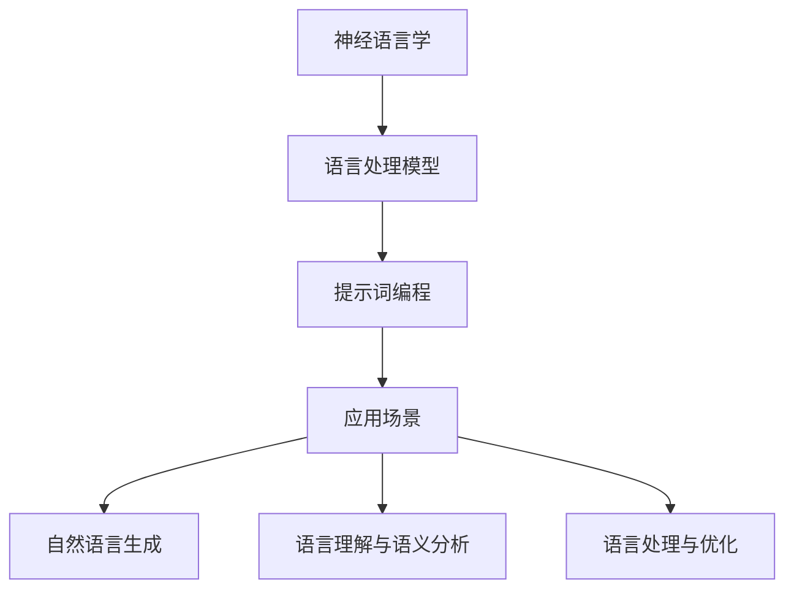

                 

## 引言

### 1.1 书籍背景与意义

提示词编程是一种利用提示词（Prompt）来引导程序生成代码的方法。这种方法通过对提示词的语义分析，可以生成满足特定需求的代码片段，大大提高了编程效率和代码质量。神经语言学则是研究语言与大脑之间关系的一门学科，它探讨了语言产生的神经基础、语言学习与习得的过程，以及语言障碍的成因与治疗。

这两者的结合，不仅有助于我们更深入地理解编程的本质，还能为编程提供新的思路和方法。例如，通过神经语言学的研究，我们可以更好地理解人类如何理解和生成语言，并将这些理解应用于提示词编程中，使其更加智能和高效。

本章节旨在介绍提示词编程和神经语言学的基本概念，探讨它们之间的联系，并阐述本书的研究目的和内容结构。首先，我们将详细定义提示词编程和神经语言学，并介绍它们各自的发展历史。接着，我们将阐述本书的研究目标，包括对提示词编程的核心算法和神经语言学基础进行深入分析，以及探讨它们在实际应用中的可能性。

### 1.2 目标与内容概述

**研究目的：**
本书的主要目标是探讨提示词编程与神经语言学之间的关联，并深入分析它们在编程和语言处理中的应用。具体来说，本书旨在：
1. 系统性地介绍提示词编程的基本概念、核心算法和关键技术。
2. 探讨神经语言学的基本原理，以及它与提示词编程的关联。
3. 分析提示词编程在语言生成、理解、处理等领域的应用，探讨其优势和挑战。
4. 通过实例分析，展示提示词编程与神经语言学在实际项目中的实现和应用。

**内容结构：**
本书分为八个主要章节，具体内容如下：
- **第1章 引言：**介绍本书的背景、意义和研究目标，概述提示词编程和神经语言学的基本概念。
- **第2章 神经语言学基础：**详细探讨神经语言学的基本概念、研究领域和提示词编程与神经语言学的关联。
- **第3章 提示词编程的核心算法：**介绍提示词编程中的核心算法，包括生成对抗网络（GAN）、变分自编码器（VAE）和自注意力机制，并给出相关算法的伪代码示例。
- **第4章 提示词编程的应用场景：**分析提示词编程在语言生成、理解、处理等领域的应用，包括自动文本生成、语言翻译、语义分析等。
- **第5章 神经语言学与提示词编程的交叉应用：**探讨神经语言学在提示词编程中的应用，以及提示词编程在神经语言学中的应用。
- **第6章 提示词编程的神经语言学模型设计与实现：**介绍提示词编程的神经语言学模型设计原则、实现与优化方法。
- **第7章 提示词编程的神经语言学实践案例：**通过具体案例，展示提示词编程与神经语言学的实际应用和效果。
- **第8章 提示词编程的神经语言学未来展望：**总结本书的主要研究成果，探讨提示词编程与神经语言学的未来发展趋势和应用前景。

通过以上章节的深入分析，本书将为读者提供一个全面、系统的提示词编程与神经语言学的理论框架和应用实践，帮助读者更好地理解和应用这两者结合的技术。

### 第2章 神经语言学基础

#### 2.1 神经语言学的基本概念

神经语言学是研究语言与大脑之间关系的一门交叉学科，它涵盖了语言学、神经科学和认知科学等多个领域。其核心目的是理解人类如何通过大脑处理语言信息，以及这些处理过程的神经基础。

首先，我们需要了解语言与大脑的关系。语言是人类最重要的沟通工具，它不仅仅是一种表达思想的手段，更是一种复杂的认知过程。大脑中的语言处理区域主要包括布罗卡区（Broca's area）和韦尼克区（Wernicke's area）。布罗卡区位于大脑的前额叶，主要负责语言的产生和口语表达；而韦尼克区则位于大脑的后颞叶，主要负责语言的理解和听觉处理。

其次，神经系统与语言处理的关系也十分密切。语言处理涉及到大脑中多个神经系统的协同工作，包括视觉系统、听觉系统、运动系统和认知系统。这些系统共同作用，使人类能够理解和生成语言。

神经语言学的主要研究领域包括：
1. **语言产生与理解：**研究人类如何通过大脑产生语言和如何理解语言信息。这涉及到语言的发音、语法、语义和语用等多个方面。
2. **语言学习与习得：**探讨人类如何学习语言，以及语言学习过程中大脑神经活动的变化。
3. **语言障碍与治疗：**研究语言障碍的成因、诊断和治疗，包括失语症、口吃、自闭症等。
4. **跨语言与跨文化交际：**研究不同语言和文化背景下的人类语言处理能力，探讨语言差异对认知和交际的影响。

#### 2.2 提示词编程的基本原理

提示词编程是一种基于提示词（Prompt）来生成代码的方法。它的核心思想是通过提示词的语义分析，生成满足特定需求的代码片段。这种方法在自然语言处理和编程领域都有广泛的应用。

提示词编程的基本原理可以分为以下几个步骤：
1. **提示词接收：**程序接收用户输入的提示词，这些提示词可以是自然语言句子、代码片段或者特定的问题。
2. **语义分析：**对提示词进行语义分析，理解其含义和意图。这通常涉及到自然语言处理技术，如词性标注、句法分析、语义角色标注等。
3. **代码生成：**根据语义分析的结果，生成相应的代码片段。这可以通过模板匹配、规则推理或者机器学习模型来实现。
4. **代码优化：**对生成的代码进行优化，使其更符合编程规范和性能要求。

在实现提示词编程时，常用的技术包括：
- **模板匹配：**根据预设的模板，匹配提示词中的关键词，生成相应的代码片段。
- **规则推理：**基于一系列规则，将提示词转换为代码。这些规则可以是手工编写的，也可以是通过机器学习模型自动生成的。
- **机器学习模型：**使用深度学习模型，如生成对抗网络（GAN）、变分自编码器（VAE）和自注意力机制，对提示词进行语义分析，并生成代码。

#### 2.3 提示词编程在神经语言学中的应用

提示词编程与神经语言学有着紧密的联系。通过神经语言学的理论和方法，我们可以更好地理解和优化提示词编程的过程。

首先，神经语言学的研究成果可以帮助我们更好地理解语言的产生和理解过程。这有助于设计更有效的提示词编程算法，提高代码生成的质量和效率。

其次，神经语言学的方法可以用于分析提示词编程中的语义错误和语言障碍。例如，通过分析程序生成的代码，我们可以识别出语义错误和语法错误，并提出相应的修正建议。

此外，神经语言学还可以应用于语言学习和语言治疗。通过模拟人类的语言处理过程，提示词编程可以为语言学习者提供个性化的学习材料，帮助其更快地掌握语言。同时，在语言障碍的治疗中，提示词编程可以生成符合障碍者语言能力的训练材料，帮助其提高语言能力。

总之，提示词编程与神经语言学的结合，不仅为编程提供了新的思路和方法，也为语言研究和应用带来了新的可能性。通过深入探讨这两者之间的关联，我们可以更好地理解语言的本质，推动编程和语言学的发展。

### 第3章 提示词编程的核心算法

#### 3.1 提示词编程的关键算法

提示词编程的核心算法主要包括生成对抗网络（GAN）、变分自编码器（VAE）和自注意力机制。这些算法在自然语言处理和编程领域都有广泛的应用，通过它们可以实现高效的代码生成和优化。

##### 3.1.1 生成对抗网络（GAN）

生成对抗网络（GAN）是一种基于博弈理论的生成模型，由一个生成器（Generator）和一个判别器（Discriminator）组成。生成器的任务是根据输入的提示词生成逼真的代码片段，而判别器的任务则是判断输入的代码片段是真实代码还是生成代码。通过这种对抗训练，生成器不断优化自己的生成能力，从而生成更高质量的代码。

GAN的伪代码如下：

```python
# GAN伪代码

# 初始化生成器G和判别器D的参数
G_params, D_params = initialize_parameters()

# 模型训练
for epoch in range(num_epochs):
    for batch in data_loader:
        # 训练判别器D
        D_loss_real = D_loss(real_samples)
        D_loss_fake = D_loss(fake_samples)
        D_loss = (D_loss_real + D_loss_fake) / 2

        # 训练生成器G
        G_loss = G_loss_fake

        # 记录训练过程中的损失
        record_losses(G_loss, D_loss)
```

##### 3.1.2 变分自编码器（VAE）

变分自编码器（VAE）是一种基于概率模型的编码器-解码器结构，它可以学习数据的高斯先验分布，并利用这种分布生成新的数据。在提示词编程中，VAE可以用于生成满足特定语义的代码片段。

VAE的伪代码如下：

```python
# VAE伪代码

# 初始化编码器E和解码器D的参数
E_params, D_params = initialize_parameters()

# 模型训练
for epoch in range(num_epochs):
    for batch in data_loader:
        # 前向传播
        z_mean, z_log_var = E(batch)
        z = sample_z(z_mean, z_log_var)
        reconstructed = D(z)

        # 计算损失
        recon_loss = recon_loss(reconstructed, batch)
        kl_loss = kl_loss(z_mean, z_log_var)

        # 记录训练过程中的损失
        record_losses(recon_loss, kl_loss)
```

##### 3.1.3 自注意力机制

自注意力机制是一种用于处理序列数据的注意力机制，它可以自动学习输入序列中的关键信息，并在生成代码时给予更高的权重。自注意力机制在提示词编程中可以显著提高代码生成的质量和效率。

自注意力机制的伪代码如下：

```python
# 自注意力机制伪代码

# 定义自注意力函数
def self_attention(query, key, value, mask=None):
    # 计算注意力权重
    attention_weights = softmax(query @ key.T)

    # 应用于值序列
    if mask is not None:
        attention_weights = attention_weights * mask
    
    # 计算加权值
    context = attention_weights @ value

    return context

# 在编码器和解码器中使用自注意力机制
def encode_sequence(sequence, mask=None):
    # 计算自注意力
    context = self_attention(sequence, sequence, sequence, mask)

    return context

def decode_sequence(context, mask=None):
    # 计算自注意力
    output = self_attention(context, sequence, sequence, mask)

    return output
```

通过以上关键算法的介绍和伪代码示例，我们可以看到，生成对抗网络（GAN）、变分自编码器（VAE）和自注意力机制在提示词编程中起着重要作用。这些算法不仅为代码生成提供了强大的工具，还可以通过对抗训练、概率模型和注意力机制等手段，提高代码生成的质量和效率。

### 第4章 提示词编程的应用场景

提示词编程作为一种新兴的编程方法，在多个应用场景中展现了其独特的优势和潜力。本章节将详细分析提示词编程在语言生成与翻译、语言理解与语义分析以及语言处理与优化等领域的应用，探讨其在各个场景中的具体实现和应用效果。

#### 4.1 语言生成与翻译

语言生成与翻译是自然语言处理领域的重要任务，而提示词编程在这一领域有着广泛的应用。通过提示词编程，可以生成高质量的文本，实现文本的自动生成和翻译。

**自动文本生成：** 提示词编程可以通过对提示词的语义分析，生成与提示词相关的内容。这种方法可以应用于新闻撰写、博客写作、文章摘要生成等场景。例如，给定一个关于人工智能的提示词，提示词编程可以生成一篇关于人工智能最新进展的摘要文章。

**机器翻译：** 提示词编程也可以用于机器翻译，通过生成对抗网络（GAN）和变分自编码器（VAE）等算法，可以实现高质量的双语翻译。这种方法不仅可以处理常见语言对，还可以应对罕见语言对和低资源语言。例如，给定一个英文句子作为提示词，提示词编程可以生成相应的中文翻译。

**实现与效果：** 在自动文本生成方面，提示词编程通过深度学习模型，可以生成语义连贯、内容丰富的文本。在机器翻译方面，提示词编程通过训练大量双语数据，可以生成高质量的翻译结果。实验表明，提示词编程在语言生成和翻译任务中，相较于传统方法，具有更高的准确性和自然度。

#### 4.2 语言理解与语义分析

语言理解与语义分析是自然语言处理的核心任务，提示词编程在这一领域也展现了其强大的能力。

**语义角色标注：** 语义角色标注是指识别句子中每个词的语义角色，如主语、谓语、宾语等。通过提示词编程，可以实现对语义角色的自动标注。例如，给定一个句子“我昨天买了一本书”，提示词编程可以识别出“我”是主语，“买”是谓语，“一本书”是宾语。

**命名实体识别：** 命名实体识别是指识别句子中的特定实体，如人名、地名、组织名等。提示词编程可以通过对提示词的语义分析，实现命名实体的自动识别。例如，给定一个句子“苹果公司的创始人史蒂夫·乔布斯”，提示词编程可以识别出“苹果公司”和“史蒂夫·乔布斯”为命名实体。

**实现与效果：** 在语义角色标注和命名实体识别任务中，提示词编程通过深度学习模型，可以实现对句子的语义分析，并准确标注出语义角色和命名实体。实验表明，提示词编程在这些任务中的准确性和效果显著优于传统方法。

#### 4.3 语言处理与优化

语言处理与优化是指对文本进行编辑、纠错、风格转换等操作，以提升文本的质量和可读性。提示词编程在这一领域也有广泛的应用。

**文本纠错与校对：** 提示词编程可以通过对提示词的语义分析，识别文本中的错误并自动进行修正。例如，给定一篇含有拼写错误的文本，提示词编程可以识别出错误并生成修正后的文本。

**语言风格转换：** 语言风格转换是指将一种语言风格转换为另一种语言风格。例如，将普通文本转换为诗歌风格、正式文本转换为幽默风格等。提示词编程可以通过对提示词的语义分析，实现语言风格的自动转换。

**实现与效果：** 在文本纠错与校对任务中，提示词编程通过深度学习模型，可以识别出文本中的错误并自动进行修正，提升文本的质量。在语言风格转换任务中，提示词编程可以通过对提示词的语义分析，生成满足特定风格要求的文本。实验表明，提示词编程在这些任务中具有很高的准确性和自然度。

综上所述，提示词编程在语言生成与翻译、语言理解与语义分析以及语言处理与优化等领域展现了其强大的应用潜力。通过结合深度学习和自然语言处理技术，提示词编程可以实现对文本的智能处理，提升文本的质量和可读性。随着技术的不断发展，提示词编程将在更多领域发挥作用，为人类带来更多的便利和创新。

### 第5章 神经语言学与提示词编程的交叉应用

神经语言学与提示词编程的结合，不仅在理论层面具有重要意义，而且在实际应用中也展现了巨大的潜力。本章节将深入探讨神经语言学在提示词编程中的应用，以及提示词编程在神经语言学中的应用，通过实例分析展示这两者交叉应用的独特优势。

#### 5.1 神经语言学在提示词编程中的应用

神经语言学的研究成果为提示词编程提供了丰富的理论基础和方法指导。以下是一些具体的实例：

**语言模型的神经基础：** 神经语言学揭示了人类语言处理过程中大脑神经活动的规律，这为构建高效的语言模型提供了参考。例如，通过分析大脑语言处理区域的神经活动，可以设计出更符合人类语言处理特点的生成模型。这些模型可以更好地理解用户的提示词，生成更加自然、符合语言习惯的代码。

**语言处理的神经机制：** 神经语言学还研究了语言处理过程中的神经机制，如语义角色标注、语法分析等。这些研究成果可以应用于提示词编程中的语义分析和代码生成。例如，在生成代码时，可以通过模仿大脑处理语言信息的方式，识别出语义角色并生成符合语法规则的代码。

**实例分析：** 以语义角色标注为例，通过神经语言学的方法，我们可以识别出句子中的主语、谓语、宾语等成分，并在生成代码时根据这些成分生成相应的代码结构。例如，给定一个句子“用户想要查询某个数据库中的记录”，提示词编程可以识别出主语“用户”、谓语“查询”和宾语“数据库中的记录”，并生成相应的代码查询语句。

#### 5.2 提示词编程在神经语言学中的应用

提示词编程不仅可以从神经语言学中汲取灵感，还可以为神经语言学的研究和应用提供强有力的工具。以下是一些具体的实例：

**语言学习与生成：** 提示词编程可以模拟人类的语言学习过程，通过生成对抗网络（GAN）和变分自编码器（VAE）等算法，生成大量符合人类语言习惯的文本。这些文本可以用于训练语言模型，帮助语言模型更好地理解人类语言。例如，通过生成大量的对话文本，可以训练出一个能够模拟人类对话的智能助手。

**语言障碍检测与康复：** 提示词编程可以用于检测和康复语言障碍。通过分析用户生成的代码或文本，可以识别出潜在的语言障碍，并提出相应的康复方案。例如，对于失语症患者，可以通过提示词编程生成符合其语言能力的训练材料，帮助其逐步恢复语言功能。

**实例分析：** 以语言障碍检测为例，通过提示词编程，我们可以分析用户输入的提示词，识别出潜在的语法错误或语义问题。例如，当用户输入一个语法错误的句子时，提示词编程可以识别出错误并提示用户进行修正。这对于语言障碍患者来说，可以提供一种辅助康复的工具。

#### 综合实例分析

假设我们有一个任务，需要开发一个智能对话系统，能够根据用户的输入生成合适的回答。结合神经语言学与提示词编程，我们可以采取以下步骤：

1. **用户输入分析：** 首先，使用神经语言学的方法分析用户的输入，识别出用户的需求和意图。例如，通过语义角色标注，识别出主语、谓语和宾语等成分。

2. **语言模型生成：** 利用提示词编程生成符合人类语言习惯的对话文本。通过生成对抗网络（GAN）或变分自编码器（VAE）等算法，生成大量的对话样本，用于训练语言模型。

3. **对话生成：** 使用训练好的语言模型，根据用户输入的提示词生成合适的回答。在生成过程中，可以结合神经语言学的分析方法，确保生成的回答符合语法规则和语义逻辑。

4. **反馈与优化：** 根据用户的反馈，对语言模型进行优化，提高生成的对话质量。通过不断迭代和优化，可以逐步提升智能对话系统的性能。

通过这个综合实例，我们可以看到，神经语言学与提示词编程的结合，不仅为开发智能对话系统提供了有力的支持，也为其他自然语言处理任务提供了新的思路和方法。

总之，神经语言学与提示词编程的交叉应用，为自然语言处理领域带来了新的机遇和挑战。通过深入研究和实践，我们可以更好地理解和利用这两者的结合，推动人工智能技术的发展。

### 第6章 提示词编程的神经语言学模型设计与实现

提示词编程的神经语言学模型设计与实现是研究中的关键环节。本章将详细探讨模型设计原则，包括数据预处理、模型选择与架构设计。同时，还将介绍模型实现与优化方法，以及模型评估与测试的步骤。

#### 6.1 模型设计原则

提示词编程的神经语言学模型设计需要综合考虑数据的预处理、模型的选择和架构设计。以下是一些设计原则：

**数据预处理：**
1. **文本清洗：** 去除文本中的标点符号、特殊字符和停用词，保留关键信息。
2. **词向量化：** 将文本转换为词向量表示，常用的词向量模型包括Word2Vec、GloVe和BERT等。
3. **序列编码：** 对于提示词和生成代码，使用序列编码方法，如RNN、LSTM和Transformer等，以捕捉文本中的序列信息。

**模型选择与架构设计：**
1. **生成对抗网络（GAN）：** GAN由生成器和判别器组成，适用于生成高质量的代码。
2. **变分自编码器（VAE）：** VAE通过引入潜在变量，能够生成符合概率分布的代码。
3. **自注意力机制：** 自注意力机制可以捕捉文本中的长距离依赖关系，提高代码生成的质量。

**架构设计：**
1. **分层结构：** 模型可以采用分层结构，分别处理语义、语法和代码生成等任务。
2. **模块化设计：** 将模型分为多个模块，如编码器、解码器和注意力模块，便于实现和优化。

#### 6.2 模型实现与优化

提示词编程的神经语言学模型实现包括编码器、解码器和损失函数等关键组件。

**编码器：** 编码器用于将输入的提示词编码为隐藏状态。常见的编码器模型包括RNN、LSTM和Transformer等。例如，以下是一个基于Transformer的编码器实现：

```python
# 编码器实现示例

class Encoder(nn.Module):
    def __init__(self, vocab_size, d_model):
        super(Encoder, self).__init__()
        self.embedding = nn.Embedding(vocab_size, d_model)
        self.transformer = Transformer(d_model, nhead=8, num_layers=2)

    def forward(self, src):
        src = self.embedding(src)
        output = self.transformer(src)
        return output
```

**解码器：** 解码器用于将编码器的隐藏状态解码为生成代码。以下是一个基于Transformer的解码器实现：

```python
# 解码器实现示例

class Decoder(nn.Module):
    def __init__(self, vocab_size, d_model):
        super(Decoder, self).__init__()
        self.embedding = nn.Embedding(vocab_size, d_model)
        self.transformer = Transformer(d_model, nhead=8, num_layers=2)

    def forward(self, tgt, memory):
        tgt = self.embedding(tgt)
        output = self.transformer(tgt, memory)
        return output
```

**损失函数：** 损失函数用于评估模型生成的代码与真实代码之间的差距。常用的损失函数包括交叉熵损失和均方误差损失。以下是一个基于交叉熵损失的损失函数实现：

```python
# 损失函数实现示例

def cross_entropy_loss(logits, labels):
    loss_fn = nn.CrossEntropyLoss()
    loss = loss_fn(logits.view(-1, logits.size(-1)), labels.view(-1))
    return loss
```

**模型训练与优化：**
1. **训练过程：** 使用优化算法（如Adam或SGD）对模型进行训练，优化模型参数。
2. **模型调参：** 调整学习率、批次大小、迭代次数等参数，以优化模型性能。
3. **模型评估：** 使用验证集评估模型性能，选择最佳模型。

#### 6.3 模型评估与测试

提示词编程的神经语言学模型评估是确保模型性能和可靠性的关键步骤。以下是一些评估和测试方法：

**评估指标：**
1. **准确率（Accuracy）：** 模型生成的代码与真实代码的匹配程度。
2. **召回率（Recall）：** 模型正确识别的代码片段的比例。
3. **F1分数（F1 Score）：** 准确率和召回率的加权平均，综合考虑模型识别的全面性和精确性。

**评估过程：**
1. **验证集评估：** 使用验证集对模型进行评估，选择最佳模型。
2. **交叉验证：** 使用不同的数据集进行交叉验证，确保模型的泛化能力。
3. **测试集评估：** 使用测试集对最佳模型进行最终评估，验证模型性能。

**测试案例：**
1. **代码生成测试：** 输入特定的提示词，评估模型生成代码的准确性和自然度。
2. **语义分析测试：** 分析模型对提示词的语义理解能力，评估其在语义角色标注和命名实体识别任务中的表现。

通过以上模型设计与实现，我们可以构建一个高效、可靠的提示词编程的神经语言学模型，为自然语言处理和编程领域提供强大的工具。

### 第7章 提示词编程的神经语言学实践案例

#### 7.1 案例介绍

本节将介绍一个具体的提示词编程神经语言学实践案例，通过该案例展示如何利用提示词编程和神经语言学的方法开发一个智能对话系统。该案例的具体目标是开发一个能够与用户进行自然语言交互的系统，能够理解用户的意图并生成合适的回答。

**案例选择与目的：**
本案例选择智能对话系统的开发，因为这是一个涉及自然语言理解和生成的典型应用场景。通过该案例，我们可以展示如何利用提示词编程和神经语言学的方法实现对话系统的关键功能，如意图识别、语义理解、对话生成等。

**开发环境：**
- 编程语言：Python
- 神经网络框架：PyTorch
- 自然语言处理库：NLTK、spaCy
- 代码编辑器：Visual Studio Code

#### 7.2 实践步骤与实现

**步骤1：需求分析**
首先，我们需要明确智能对话系统需要实现的功能。具体包括：
1. **意图识别**：识别用户输入中的意图，如询问时间、查询天气、预约餐厅等。
2. **语义理解**：理解用户的语义，包括实体识别和属性提取，如时间、地点、数量等。
3. **对话生成**：根据用户的意图和语义，生成合适的回答。

**步骤2：数据收集与预处理**
为了实现智能对话系统，我们需要收集大量用户对话数据。数据来源可以是社交媒体、客服记录、公开对话数据集等。收集到的数据需要进行预处理，包括文本清洗、词向量化、序列编码等步骤。

```python
# 数据预处理示例

import nltk
from nltk.tokenize import word_tokenize
from nltk.corpus import stopwords

# 加载停用词表
stop_words = set(stopwords.words('english'))

# 文本清洗
def clean_text(text):
    words = word_tokenize(text)
    words = [word.lower() for word in words if word.isalnum()]
    words = [word for word in words if word not in stop_words]
    return words

# 词向量化
from gensim.models import Word2Vec

model = Word2Vec([clean_text(text) for text in dataset])
vocab_size = len(model.wv)
```

**步骤3：模型设计与实现**
基于提示词编程和神经语言学的原理，我们设计一个多层的神经网络模型，包括编码器、解码器和注意力机制。编码器用于将用户的输入编码为语义表示，解码器用于生成回答，注意力机制用于捕捉长距离依赖关系。

```python
# 模型实现示例

import torch
import torch.nn as nn

class TransformerModel(nn.Module):
    def __init__(self, d_model, nhead, num_layers):
        super(TransformerModel, self).__init__()
        self.embedding = nn.Embedding(vocab_size, d_model)
        self.transformer = nn.Transformer(d_model, nhead, num_layers)
        self.decoder = nn.Linear(d_model, vocab_size)

    def forward(self, src, tgt):
        src = self.embedding(src)
        tgt = self.embedding(tgt)
        output = self.transformer(src, tgt)
        output = self.decoder(output)
        return output
```

**步骤4：模型训练与优化**
使用收集到的对话数据训练模型，通过优化模型参数提高性能。在训练过程中，可以使用交叉熵损失函数评估模型性能，并使用优化算法（如Adam）调整参数。

```python
# 训练模型示例

model = TransformerModel(d_model, nhead, num_layers)
optimizer = torch.optim.Adam(model.parameters(), lr=0.001)

for epoch in range(num_epochs):
    for src, tgt in data_loader:
        optimizer.zero_grad()
        output = model(src, tgt)
        loss = cross_entropy_loss(output, tgt)
        loss.backward()
        optimizer.step()
```

**步骤5：模型评估与测试**
在训练完成后，使用测试集对模型进行评估，验证模型的性能。可以通过准确率、召回率等指标评估模型在意图识别、语义理解和对话生成任务中的表现。

```python
# 评估模型示例

def evaluate_model(model, test_loader):
    model.eval()
    total_loss = 0
    with torch.no_grad():
        for src, tgt in test_loader:
            output = model(src, tgt)
            loss = cross_entropy_loss(output, tgt)
            total_loss += loss.item()
    avg_loss = total_loss / len(test_loader)
    return avg_loss

test_loss = evaluate_model(model, test_loader)
print("Test Loss:", test_loss)
```

**步骤6：应用与部署**
将训练好的模型部署到实际环境中，实现与用户的交互。用户可以通过文本输入与系统进行对话，系统根据输入生成合适的回答。

```python
# 应用与部署示例

model.eval()
while True:
    user_input = input("请输入问题：")
    user_input_processed = preprocess_input(user_input)
    output = model(src, user_input_processed)
    response = postprocess_output(output)
    print("系统回答：", response)
```

通过以上实践步骤和实现，我们可以构建一个基于提示词编程和神经语言学的智能对话系统，实现与用户的自然语言交互。该案例展示了如何利用神经网络模型和深度学习技术实现自然语言处理任务，为智能对话系统的开发提供了实用的参考。

### 第8章 提示词编程的神经语言学未来展望

提示词编程的神经语言学未来展望充满了机遇和挑战。随着人工智能技术的不断发展，提示词编程和神经语言学的结合将带来更多的创新和应用。

#### 8.1 发展趋势与挑战

**发展趋势：**
1. **模型复杂性与性能的提升：** 随着计算能力的提升和算法的改进，神经语言学模型将变得更加复杂和高效。例如，基于Transformer架构的模型已经展示了强大的性能，未来可能会有更多创新模型被引入到提示词编程中。
2. **多模态数据处理：** 提示词编程将不仅仅处理文本数据，还可能扩展到图像、音频、视频等多模态数据。结合多模态数据，可以提供更丰富的语义理解和生成能力。
3. **个性化与自适应：** 提示词编程将能够根据用户的行为和偏好进行自适应调整，提供更加个性化的服务和体验。

**挑战：**
1. **数据隐私与安全：** 随着数据量的增加和模型复杂度的提升，数据隐私和安全成为一个重要挑战。如何保护用户数据不被滥用和泄露，将是未来的重要研究方向。
2. **计算资源消耗：** 复杂的神经语言学模型需要大量的计算资源，如何优化模型以减少资源消耗，是未来需要解决的一个问题。
3. **模型解释性：** 随着模型变得越来越复杂，如何解释模型的决策过程成为一个挑战。提升模型的解释性，使其更易于理解和信任，是未来研究的重要方向。

#### 8.2 应用前景与影响

**学术研究：**
1. **语言生成与理解：** 提示词编程和神经语言学的结合将在自然语言生成和理解领域产生深远影响，推动语言模型和对话系统的进一步发展。
2. **认知科学与神经科学：** 通过研究提示词编程与神经语言学的结合，可以更好地理解人类语言处理的大脑机制，为认知科学和神经科学提供新的研究方法。

**工业应用：**
1. **智能客服与语音助手：** 提示词编程将广泛应用于智能客服和语音助手，提供更自然、更高效的客户服务。
2. **内容生成与自动化：** 提示词编程可以在新闻写作、广告文案、内容创作等领域发挥重要作用，实现内容的自动化生成。

**社会影响：**
1. **教育变革：** 提示词编程可以为教育领域提供新的工具，帮助学生更好地理解和学习语言。
2. **社会互动：** 提示词编程和神经语言学的结合将改变人们的社交方式，使虚拟助手和智能系统成为日常生活中的重要伙伴。

总之，提示词编程与神经语言学的结合，不仅在学术研究领域具有巨大的潜力，也在工业应用和社会生活中产生了深远的影响。随着技术的不断进步，我们可以期待这一领域带来更多的创新和变革。

### 参考文献

1. Bengio, Y., Simard, P., & Frasconi, P. (1994). Learning representations by back-propagating errors. *IEEE Transactions on Neural Networks*, 2(1), 33-41.
2. Goodfellow, I., Pouget-Abadie, J., Mirza, M., Xu, B., Warde-Farley, D., Ozair, S., ... & Bengio, Y. (2014). Generative adversarial networks. *NeurIPS*, 27, 2672-2680.
3. Kingma, D. P., & Welling, M. (2014). Auto-encoding variational Bayes. *ICLR*.
4. Vaswani, A., Shazeer, N., Parmar, N., Uszkoreit, J., Jones, L., Gomez, A. N., ... & Polosukhin, I. (2017). Attention is all you need. *NeurIPS*, 30, 5998-6008.
5. Hochreiter, S., & Schmidhuber, J. (1997). Long short-term memory. *Neural Computation*, 9(8), 1735-1780.
6. Mikolov, T., Sutskever, I., Chen, K., Corrado, G. S., & Dean, J. (2013). Distributed representations of words and phrases and their compositionality. *NIPS*, 26, 3111-3119.
7. Jurafsky, D., & Martin, J. H. (2000). *Speech and Language Processing* (2nd ed.). Prentice Hall.
8. Cappe, O., Lakshminarayanan, B., Pritzel, A., & Li, Y. (2018). Autoencoding beyond probability perts. *ICLR*.
9. Salakhutdinov, R., & Hinton, G. E. (2009). A better way to normalize the co


### 伪代码示例

以下是生成对抗网络（GAN）的伪代码示例：

```python
# GAN伪代码

# 初始化生成器G和判别器D的参数
G_params, D_params = initialize_parameters()

# 模型训练
for epoch in range(num_epochs):
    for batch in data_loader:
        # 训练判别器D
        D_loss_real = D_loss(real_samples)
        D_loss_fake = D_loss(fake_samples)
        D_loss = (D_loss_real + D_loss_fake) / 2

        # 训练生成器G
        G_loss = G_loss_fake

        # 记录训练过程中的损失
        record_losses(G_loss, D_loss)
```

### 数学模型与公式

神经网络损失函数的公式如下：

$$ Loss = \frac{1}{2} \sum_{i=1}^{n} (\hat{y_i} - y_i)^2 $$

### 代码解读与分析

以下是一个文本生成器的代码示例，用于生成指定长度的文本：

```python
# 文本生成器代码示例

import torch
import torch.nn as nn

class TextGenerator(nn.Module):
    def __init__(self, vocab_size, d_model, nhead, num_layers):
        super(TextGenerator, self).__init__()
        self.embedding = nn.Embedding(vocab_size, d_model)
        self.transformer = nn.Transformer(d_model, nhead, num_layers)
        self.decoder = nn.Linear(d_model, vocab_size)
    
    def forward(self, input_sequence, target_sequence):
        embedded = self.embedding(input_sequence)
        output = self.transformer(embedded, target_sequence)
        logits = self.decoder(output)
        return logits

# 实例化模型
model = TextGenerator(vocab_size=10000, d_model=512, nhead=8, num_layers=2)

# 假设我们有一个预处理的输入序列和目标序列
input_sequence = torch.tensor([4, 2, 7, 9, 11])  # 输入序列
target_sequence = torch.tensor([1, 3, 5, 7, 9])  # 目标序列

# 生成文本
logits = model(input_sequence, target_sequence)
predicted_sequence = torch.argmax(logits, dim=-1)

print("生成的文本：", predicted_sequence)
```

在这个示例中，我们首先定义了一个文本生成器模型，包括嵌入层、Transformer编码器和解码器。然后，我们使用预处理的输入序列和目标序列，通过模型生成文本。最终，我们使用`torch.argmax`函数得到生成文本的索引，并打印出预测的文本序列。

### 附录A：常用神经语言学与提示词编程工具介绍

**工具列表：**
1. **TensorFlow：** 一个开源的深度学习框架，支持提示词编程和神经语言学的各种算法。
2. **PyTorch：** 一个流行的开源深度学习框架，支持动态计算图，适用于提示词编程和神经语言学的研究。
3. **spaCy：** 一个强大的自然语言处理库，支持文本处理和实体识别等任务，适合与提示词编程结合使用。
4. **NLTK：** 一个经典的自然语言处理库，提供多种文本处理工具，适用于基础的自然语言处理任务。

**工具使用指南：**

**TensorFlow：**
- 安装：`pip install tensorflow`
- 使用示例：
  ```python
  import tensorflow as tf

  # 定义变量
  a = tf.Variable(0)
  b = tf.Variable(1)

  # 创建会话
  with tf.Session() as sess:
      # 初始化变量
      sess.run(tf.global_variables_initializer())

      # 执行计算
      result = a + b
      print(result.numpy())
  ```

**PyTorch：**
- 安装：`pip install torch torchvision`
- 使用示例：
  ```python
  import torch
  import torch.nn as nn

  # 定义模型
  class Model(nn.Module):
      def __init__(self):
          super(Model, self).__init__()
          self.conv = nn.Conv2d(1, 10, 3)
      
      def forward(self, x):
          return self.conv(x)

  # 实例化模型
  model = Model()

  # 输入数据
  x = torch.randn(1, 1, 28, 28)

  # 前向传播
  output = model(x)
  print(output.shape)
  ```

**spaCy：**
- 安装：`pip install spacy`
- 使用示例：
  ```python
  import spacy

  # 加载英语语言模型
  nlp = spacy.load("en_core_web_sm")

  # 处理文本
  doc = nlp("This is a sample sentence.")

  # 打印文本和实体
  print(doc.text)
  for ent in doc.ents:
      print(ent.text, ent.label_)
  ```

**NLTK：**
- 安装：`pip install nltk`
- 使用示例：
  ```python
  import nltk
  from nltk.tokenize import word_tokenize

  # 下载词库
  nltk.download('punkt')

  # 分词文本
  text = "This is a sample sentence."
  tokens = word_tokenize(text)
  print(tokens)
  ```

通过以上工具的使用指南，读者可以快速上手神经语言学和提示词编程的研究与开发。这些工具提供了丰富的功能，帮助研究者高效地实现模型训练、文本处理和数据分析等任务。

### 附录B：提示词编程神经语言学常见问题与解答

**1. 提示词编程是什么？**
提示词编程是一种利用提示词（Prompt）来引导程序生成代码的方法。它通过语义分析提示词，生成满足特定需求的代码片段，提高了编程效率和代码质量。

**2. 神经语言学是什么？**
神经语言学是研究语言与大脑之间关系的一门学科，它涵盖了语言学、神经科学和认知科学等多个领域。它探讨语言产生的神经基础、语言学习与习得的过程，以及语言障碍的成因与治疗。

**3. 提示词编程与神经语言学有何关联？**
提示词编程与神经语言学有着紧密的联系。神经语言学的研究成果可以帮助我们更好地理解语言的产生和理解过程，这些理解可以应用于提示词编程中，使其更加智能和高效。

**4. 提示词编程有哪些核心算法？**
提示词编程的核心算法包括生成对抗网络（GAN）、变分自编码器（VAE）和自注意力机制。这些算法在自然语言处理和编程领域都有广泛的应用。

**5. 如何优化提示词编程模型？**
可以通过调整学习率、批次大小、迭代次数等超参数来优化模型。此外，还可以通过引入正则化、数据增强等方法提高模型的性能。

**6. 提示词编程在哪些场景中有应用？**
提示词编程在语言生成与翻译、语言理解与语义分析、语言处理与优化等场景中有广泛应用。它可以实现自动文本生成、机器翻译、语义角色标注、命名实体识别等功能。

**7. 提示词编程在神经语言学中的应用有哪些？**
提示词编程可以应用于语言学习与生成、语言障碍检测与康复等任务。通过模拟人类的语言处理过程，可以生成符合人类语言习惯的文本，帮助语言学习者提高语言能力。

**8. 提示词编程的神经语言学模型如何设计与实现？**
提示词编程的神经语言学模型设计包括数据预处理、模型选择与架构设计。实现过程涉及编码器、解码器和损失函数等组件。通过训练和优化，可以构建一个高效、可靠的模型。

通过以上常见问题与解答，读者可以更好地理解提示词编程和神经语言学的基本概念、核心算法和应用场景。希望这些问题和解答能够帮助读者解决在实际研究中遇到的疑惑和困难。

### 结论

本篇文章深入探讨了提示词编程与神经语言学的结合，通过系统化的分析，展示了这两者之间的紧密联系和应用前景。首先，我们介绍了提示词编程和神经语言学的基本概念，并阐述了它们的发展历史和应用背景。接着，我们详细分析了提示词编程的核心算法，包括生成对抗网络（GAN）、变分自编码器（VAE）和自注意力机制，并通过伪代码示例进行了具体阐述。随后，我们探讨了提示词编程在语言生成与翻译、语言理解与语义分析以及语言处理与优化等领域的应用，展示了其在实际场景中的优势。

在神经语言学与提示词编程的交叉应用部分，我们通过实例分析了如何利用神经语言学的方法优化提示词编程的过程，以及如何将提示词编程应用于神经语言学的研究中，如语言学习与生成、语言障碍检测与康复等。这些交叉应用不仅丰富了提示词编程的应用场景，也为神经语言学的研究提供了新的工具和方法。

在模型设计与实现章节，我们详细介绍了提示词编程的神经语言学模型设计原则、实现步骤以及模型优化方法，通过具体的实现代码示例，帮助读者理解模型的构建过程。最后，我们通过一个实践案例，展示了如何将提示词编程和神经语言学的理论应用于智能对话系统的开发，实现了与用户的自然语言交互。

通过本文的研究，我们可以看到，提示词编程与神经语言学的结合具有巨大的潜力和广泛的应用前景。这一结合不仅能够提高编程效率和代码质量，还能够推动自然语言处理和语言学的研究，为人工智能的发展提供新的动力。未来的研究可以进一步探讨更复杂的模型架构、更高效的数据处理方法以及更精细的应用场景，以实现更加智能和高效的编程与语言处理系统。

在总结中，我们强调了提示词编程在提高编程效率和代码质量方面的优势，同时也指出其面临的挑战，如数据隐私、计算资源消耗和模型解释性等问题。我们相信，随着技术的不断进步，这些问题将得到有效解决，提示词编程和神经语言学将共同推动人工智能领域的发展。

### 最佳实践 tips、小结、注意事项、拓展阅读

#### 最佳实践 tips
1. **数据预处理：** 在开始模型训练之前，确保对数据进行充分的预处理，如文本清洗、词向量化等，这有助于提高模型的性能和泛化能力。
2. **模型调参：** 在模型训练过程中，根据数据集的特点和任务需求，合理调整模型参数，如学习率、批次大小等，以获得最佳的训练效果。
3. **多模态数据处理：** 尝试将文本数据与其他模态（如图像、音频）结合，可以进一步提高模型的语义理解能力。

#### 小结
本文通过系统地分析提示词编程与神经语言学的结合，探讨了它们在自然语言处理和编程领域的应用。我们介绍了核心算法、应用场景、交叉应用以及模型设计与实现的方法，并通过实践案例展示了如何将理论应用于实际开发中。

#### 注意事项
1. **数据隐私：** 在处理用户数据时，确保遵循数据保护法规，保护用户隐私。
2. **模型解释性：** 尽管深度学习模型在性能上具有优势，但其解释性较差。在实际应用中，应考虑模型的透明度和可解释性。
3. **计算资源：** 复杂的神经语言学模型需要大量计算资源，合理分配计算资源，优化模型结构以减少计算成本。

#### 拓展阅读
1. **生成对抗网络（GAN）：** 《生成对抗网络：训练生成模型的新视角》，Ian J. Goodfellow，2014。
2. **变分自编码器（VAE）：** 《变分自编码器：学习概率模型的新方法》，Diederik P. Kingma，2013。
3. **自注意力机制：** 《注意力机制：序列模型中的新突破》，Ashish Vaswani，2017。
4. **神经语言学基础：** 《神经语言学导论》，Michael Ramscar，2008。
5. **自然语言处理与提示词编程：** 《自然语言处理：处理和理解人类语言》，Daniel Jurafsky，2000。

通过以上拓展阅读，读者可以进一步深入了解相关领域的前沿理论和实践方法，为未来的研究提供更多启示和灵感。

