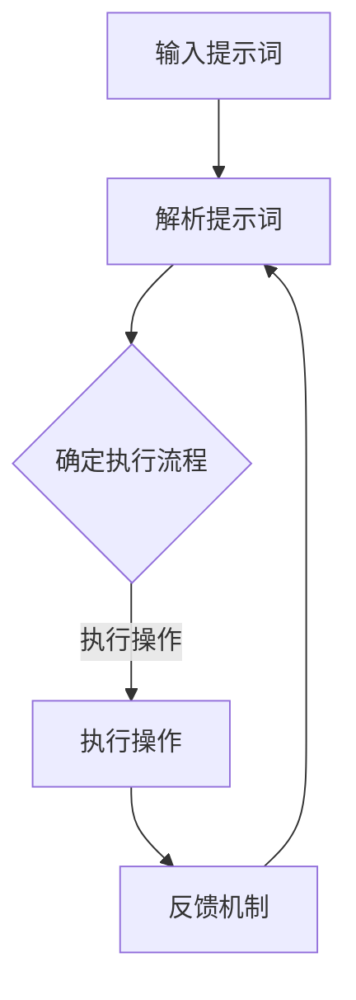
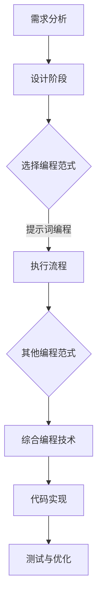

                 

## 文章标题：提示词编程的程序综合技术

### 关键词：提示词编程、程序综合技术、算法原理、实际应用、优化策略

> 摘要：本文旨在探讨提示词编程的程序综合技术，从基础理论到实际应用，逐步解析这一新兴编程领域。通过深入剖析提示词编程的概念、基本原理、编程技术、应用实例以及高级技术，本文将帮助读者全面掌握提示词编程的核心技术和应用场景，为未来编程技术的发展提供新的思路。

---

## 前言与简介

### 1.1 书籍目的与读者对象

**提示词编程**，作为一种新兴的编程范式，正逐渐受到开发者和研究者的关注。其核心思想是通过提示词（Prompt）引导程序执行，实现更灵活、更高效的编程。本书旨在为广大编程爱好者、开发者和研究者提供一个系统性的学习资源，帮助大家深入理解并掌握提示词编程的程序综合技术。

本书的读者对象主要包括：
- 初学者：对编程有一定了解，希望系统学习提示词编程的新手。
- 开发者：希望在现有编程技能基础上，拓展新的编程范式。
- 研究者：对编程语言和算法设计有兴趣，希望了解提示词编程的原理和应用。

### 1.2 内容结构概述

本书分为七个主要章节，每个章节的内容概述如下：

1. **基础理论**：介绍提示词编程的基础概念和原理，帮助读者建立初步认识。
2. **编程技术**：讲解如何在实际编程中使用提示词编程，包括基本语法、应用场景和编程技巧。
3. **应用实例**：通过具体的编程实例，展示提示词编程在实际项目中的应用，帮助读者理解其工作原理。
4. **高级技术**：深入探讨提示词编程的高级技术，如优化策略和错误处理，提升编程效率。
5. **综合实践**：提供综合性的编程项目和案例，帮助读者理解并应用所学知识。
6. **总结与展望**：总结全书内容，并对提示词编程的未来发展进行展望。

## 基础理论

### 2.1 提示词编程的概念

**提示词编程**（Prompt-Based Programming）是一种以提示词为核心思想的编程范式。在这种范式中，程序不是通过固定的逻辑流程来执行，而是通过外部输入的提示词来引导执行。

**定义**：提示词编程是一种编程范式，它通过外部输入的提示词来引导程序的执行流程，从而实现更灵活、更高效的编程。

**特点**：
- **灵活性**：通过提示词，程序可以根据不同的输入进行灵活调整，适应不同的应用场景。
- **高效性**：提示词编程减少了代码的复杂性，提高了编程效率。

### 2.2 提示词编程的基本原理

提示词编程的基本原理可以概括为以下几个方面：

1. **输入提示词**：程序在执行过程中，需要接收外部输入的提示词。
2. **解析提示词**：程序对输入的提示词进行解析，确定执行流程。
3. **执行流程**：根据解析结果，程序执行相应的操作。
4. **反馈机制**：程序在执行过程中，可以实时反馈执行结果，供用户调整提示词。

#### Mermaid 流程图

以下是一个简化的提示词编程流程图：

### 2.3 提示词编程与程序综合技术的联系

提示词编程与程序综合技术有着密切的联系。程序综合技术是指通过多种编程范式和技术，实现复杂程序的设计和开发。而提示词编程作为其中一种新的编程范式，可以与传统的编程范式相结合，提高编程的灵活性和效率。

#### Mermaid 流程图

以下是一个简化的程序综合技术流程图，展示了提示词编程与其他编程范式的结合：

通过结合提示词编程和程序综合技术，开发者可以设计出更加灵活、高效的程序。

---

[续...] 

