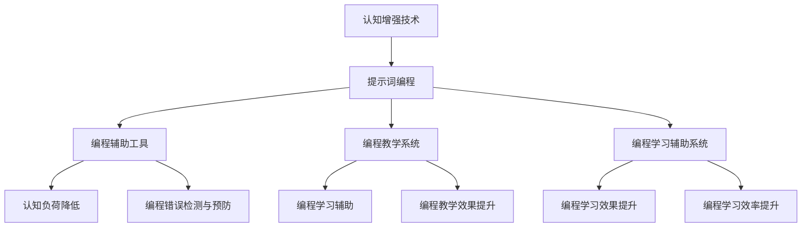

                 

## 引入

随着人工智能技术的飞速发展，认知增强技术（Cognitive Enhancement Technologies，CET）逐渐成为研究热点。认知增强技术是指通过技术手段提升人类认知能力的一系列方法，包括记忆增强、注意力集中、学习效率提升等。近年来，提示词编程（Prompt Programming）作为一种新兴的编程范式，也逐渐受到关注。提示词编程利用预定义的提示词来引导程序员的思维过程，从而提高编程效率和准确性。

本文旨在探讨认知增强技术如何应用于提示词编程，并评估其效果。具体来说，本文将首先介绍认知增强技术和提示词编程的基本概念和背景，然后分析它们之间的结合点，并提出一个评估认知增强技术在提示词编程中应用效果的方法框架。通过定量和定性两种评估方法，本文将深入分析认知增强技术对提示词编程的影响，并为未来的研究提供方向和启示。

## 认知增强技术概述

### 认知增强技术的定义与背景

认知增强技术是指通过利用先进的信息技术和生物技术手段，对人类大脑的认知过程进行干预和优化，以提高个体的认知能力。认知增强技术的研究始于20世纪中期，随着计算机科学、神经科学和生物技术的迅速发展，这一领域得到了广泛关注。早期的认知增强技术主要集中在药物和设备辅助方面，例如通过药物刺激神经递质，或者使用神经刺激设备来增强记忆和学习能力。

近年来，随着人工智能和机器学习的崛起，认知增强技术的研究领域进一步扩展，不仅包括传统的生物医学方法，还涵盖了基于计算的技术手段。例如，通过智能算法和数据分析技术，可以实现对大脑活动的高精度监测和预测，从而设计出更有效的认知增强方案。

认知增强技术的应用领域非常广泛，包括但不限于以下几个方面：

1. **军事和安保**：通过提高士兵或特工的记忆力和反应速度，增强他们在极端条件下的执行能力。
2. **教育**：利用认知增强技术辅助学生学习，提高记忆力和理解能力，优化学习效果。
3. **医疗**：用于治疗认知障碍疾病，如阿尔茨海默病和自闭症，通过恢复或增强患者的认知功能。
4. **工业**：在工业环境中，认知增强技术可以提升工人的注意力集中度和工作记忆，减少错误率，提高生产效率。

### 认知增强技术的发展背景

认知增强技术的发展可以追溯到多个学科领域的进步。首先，计算机科学和人工智能的发展为认知增强技术提供了强大的工具和算法支持。机器学习算法能够处理大规模数据，从中提取出有价值的信息，这些算法的应用为认知增强技术的实现提供了技术基础。

其次，神经科学的研究推动了我们对大脑工作机制的理解。通过功能性磁共振成像（fMRI）、脑电图（EEG）等技术，科学家们可以实时监测大脑活动，研究大脑不同区域的功能及其相互作用。这些研究成果为认知增强技术的理论框架提供了科学依据。

此外，生物医学技术的发展也为认知增强技术的实现提供了新的手段。例如，基因编辑技术CRISPR可以精确地修改大脑中的基因，从而影响认知功能。神经植入设备可以实时监测和刺激大脑神经元，从而实现认知功能的增强。

### 认知增强技术的应用领域

认知增强技术的应用领域非常广泛，涵盖了从个人生活到社会各个层面的多个方面。以下是一些主要的认知增强技术应用领域：

1. **军事与安保**：在军事和安保领域，认知增强技术被用来提升士兵和特工的认知能力，包括记忆、注意力和反应速度。例如，通过训练士兵在高压环境下保持注意力集中，或者通过药物增强记忆，以提高他们在战斗中的表现。

2. **教育**：在教育领域，认知增强技术被广泛应用于提高学生的学习效果。通过个性化学习系统，可以根据学生的学习习惯和能力，提供定制化的学习内容和方法，从而提高学习效率和成绩。

3. **医疗**：在医疗领域，认知增强技术主要用于治疗认知障碍疾病，如阿尔茨海默病和自闭症。通过恢复或增强患者的记忆和学习能力，认知增强技术可以帮助患者更好地适应日常生活，提高生活质量。

4. **工业**：在工业环境中，认知增强技术可以提高工人的工作效率和准确性。例如，通过使用智能算法和数据分析技术，可以实时监测和评估工人的工作状态，提供即时反馈和指导，从而减少错误和提高生产效率。

5. **日常生活**：在日常生活中，认知增强技术被用于提升个人的认知能力，如记忆训练、注意力提升等。这些技术可以帮助人们更好地应对生活中的各种挑战，提高生活质量。

综上所述，认知增强技术不仅具有广泛的应用前景，还对社会和个人产生了深远的影响。随着技术的不断进步，认知增强技术将在更多领域得到应用，带来更多的变革和机遇。

### 提示词编程的概念与特点

#### 提示词编程的定义

提示词编程（Prompt Programming）是一种利用预定义的提示词来引导编程过程的范式。在传统的编程模式中，程序员需要自行理解和解析问题，然后编写相应的代码。而在提示词编程中，通过提供一系列的提示词或指导性语句，系统可以自动生成部分或全部代码，从而减轻程序员的认知负担，提高编程效率和代码质量。

提示词编程的核心在于“提示词”这一概念。提示词通常是一组关键词或短语，它们能够引导系统理解程序员的意图，从而生成相应的代码。例如，一个提示词可能是“创建一个函数，用于计算两个数字的和”，系统会根据这个提示词生成对应的函数代码。

#### 提示词编程的优势

提示词编程具有以下显著优势：

1. **提高编程效率**：通过使用提示词，系统可以自动生成部分代码，从而减少程序员手工编写的代码量。这不仅节省了时间，还减少了编写过程中可能出现的错误。

2. **降低认知负荷**：提示词编程通过提供明确的指导，减轻了程序员在理解和解析问题时的认知负荷。程序员不再需要花费大量时间在理解复杂需求上，而是可以直接根据提示词进行编程。

3. **提升代码质量**：由于系统生成的代码通常经过优化和验证，提示词编程可以生成更高质量、更规范的代码。这有助于提高代码的可读性和可维护性，减少后续的维护成本。

4. **促进代码复用**：通过提示词编程，程序员可以更容易地创建可复用的代码模块。提示词可以帮助系统识别出具有相似功能需求的代码片段，从而实现代码的复用。

5. **适应性强**：提示词编程可以根据不同的编程任务和需求，灵活调整和生成代码。这使得提示词编程能够适应多种不同的编程场景，具有广泛的适用性。

#### 提示词编程的应用场景

提示词编程在不同领域中有着广泛的应用，以下是一些典型的应用场景：

1. **软件开发**：在软件开发过程中，提示词编程可以帮助开发人员快速生成基础代码框架，从而缩短开发周期。例如，在创建RESTful API时，提示词可以自动生成URL映射、数据验证和响应处理等代码。

2. **教育**：在教育领域，提示词编程可以作为编程教学工具，帮助初学者快速上手编程。通过提供一系列提示词，学生可以逐步学习编程的基础知识和技巧，从而降低学习难度。

3. **自动化测试**：在自动化测试中，提示词编程可以生成测试脚本，帮助测试人员快速编写和执行测试用例。提示词可以指导系统识别测试点，从而生成对应的测试代码。

4. **代码审查**：在代码审查过程中，提示词编程可以帮助审查者快速定位代码中的潜在问题。通过分析代码的提示词，审查者可以识别出可能的逻辑错误和安全漏洞。

5. **文档生成**：提示词编程可以自动生成代码文档，提高代码的可读性和易理解性。提示词可以帮助系统提取代码中的关键信息，并生成相应的文档内容。

综上所述，提示词编程作为一种新兴的编程范式，具有显著的优势和应用前景。通过合理应用提示词编程，可以大幅提升编程效率和代码质量，为软件开发和教育等领域带来深刻的变革。

### 本书的目标与结构安排

#### 本书的研究目标

本书的主要研究目标是探讨认知增强技术与提示词编程的结合，并评估认知增强技术在提升提示词编程效果方面的作用。具体而言，本书旨在：

1. **梳理认知增强技术和提示词编程的基本概念和原理，明确两者之间的联系**。通过深入分析，揭示认知增强技术在提示词编程中的应用潜力。
2. **提出一种有效的评估方法，用于评估认知增强技术在提示词编程中的应用效果**。通过定量和定性两种评估方法，全面分析认知增强技术的优势与局限性。
3. **通过案例研究，验证认知增强技术在提示词编程中的实际应用效果**。结合具体案例，展示认知增强技术在编程辅助、教学和自动化测试等方面的应用实例。

#### 本书的研究方法

为了实现上述研究目标，本书采用以下研究方法：

1. **文献综述**：通过查阅相关文献，系统梳理认知增强技术和提示词编程的发展历程、核心概念和应用案例，为后续研究提供理论基础。
2. **理论分析**：结合认知科学和计算机科学的理论，深入探讨认知增强技术与提示词编程的结合点，分析两者在编程效率、代码质量和认知负荷等方面的潜在影响。
3. **案例分析**：选择具有代表性的应用案例，通过具体实例展示认知增强技术在提示词编程中的实际应用效果，并分析其成功的关键因素。
4. **评估方法研究**：设计定量和定性两种评估方法，用于系统评估认知增强技术在提示词编程中的应用效果。定量评估方法包括数据驱动的算法评估和基于用户行为的评估；定性评估方法包括用户反馈调查和专家评审。

#### 本书的结构安排

本书分为五个主要部分，每个部分分别承担不同的研究任务和目标：

1. **第一部分：引言**：介绍认知增强技术和提示词编程的基本概念，阐述本书的研究背景、目标和方法。
2. **第二部分：认知增强技术在提示词编程中的应用**：详细探讨认知增强技术在提示词编程中的具体应用，包括编程辅助工具、编程教学系统和编程学习辅助系统等。
3. **第三部分：认知增强技术评估方法**：介绍认知增强技术评估方法，包括定量评估方法和定性评估方法，并详细说明评估指标的构建和评估过程。
4. **第四部分：案例研究与实际应用**：通过具体案例展示认知增强技术在提示词编程中的实际应用效果，并分析其成功的关键因素和面临的挑战。
5. **第五部分：总结与展望**：总结本书的研究成果，提出未来研究方向和展望，为认知增强技术在提示词编程领域的进一步研究提供指导。

通过以上结构安排，本书旨在为认知增强技术和提示词编程的研究提供系统化的理论框架和实践指导，为相关领域的发展提供新的思路和方法。

### 认知增强技术在提示词编程中的应用

#### 认知负荷降低与编程效率提升

认知负荷降低是认知增强技术在提示词编程中最直接的应用之一。在传统的编程过程中，程序员需要理解复杂的需求，将其转化为具体的代码实现。这一过程中涉及大量的信息处理和认知资源消耗，容易导致认知负荷过高。而认知增强技术通过提供明确的提示词和指导性语句，可以显著降低程序员的认知负荷。

首先，提示词编程通过提供简明扼要的指导性语句，帮助程序员快速理解需求，减少了对问题复杂性的认知负担。例如，在开发一个简单的数据统计功能时，提示词“编写一个函数，用于计算数据的平均值”可以直接指导程序员生成相应的代码框架，而无需进行复杂的逻辑推理和算法设计。

其次，认知增强技术可以利用智能算法对代码进行自动优化，进一步降低编程过程中的认知负荷。例如，通过机器学习算法，可以自动分析代码中的潜在错误和性能瓶颈，并提出优化建议。这不仅减少了程序员在代码调试和性能调优过程中所需的信息处理量，还提高了编程效率。

#### 编程错误检测与预防

编程错误是软件开发中不可避免的问题，但通过认知增强技术，可以显著降低编程过程中的错误率。认知增强技术通过实时监控和分析编程过程，提供即时反馈和指导，帮助程序员识别和预防潜在的错误。

首先，提示词编程可以实时捕捉程序员的操作，通过自然语言处理技术，分析编程过程中的语句和逻辑结构。一旦发现潜在的错误，系统可以立即生成提示或警告信息，指导程序员进行修正。例如，如果程序员在编写条件语句时漏掉了括号，系统会立即提示并指导其进行修正。

其次，认知增强技术可以利用机器学习算法，对代码进行自动审核和测试。通过对比已有的代码库和规则库，系统可以识别出潜在的逻辑错误和语法错误，并提出具体的修复建议。例如，在开发一个复杂的业务逻辑时，系统可以通过自动测试和模拟执行，检测出可能的问题，并提供详细的错误报告和修复建议。

#### 编程学习辅助与教学

认知增强技术在编程学习中也发挥了重要作用，特别是在辅助教学和学习效果提升方面。通过提供个性化的学习内容和实时反馈，认知增强技术可以帮助学习者更有效地掌握编程技能。

首先，认知增强技术可以根据学习者的能力和学习习惯，提供个性化的学习内容和指导。例如，在学习过程中，系统可以根据学习者的反馈和行为数据，自动调整学习难度和内容，确保学习者始终处于最佳的学习状态。

其次，认知增强技术可以通过实时反馈和错误纠正，帮助学习者快速识别和纠正编程错误。例如，当学习者编写错误的代码时，系统可以立即指出错误，并提供详细的解释和修复建议，帮助学习者更快地理解和掌握编程知识。

此外，认知增强技术还可以用于编程教学的自动化。通过智能算法和数据分析，系统可以自动生成教学课件、练习题和测试题，提高教学效果和效率。例如，在在线编程课程中，系统可以根据学习进度和成绩，自动调整练习题的难度，确保学习者能够逐步提升编程技能。

总之，认知增强技术在提示词编程中的应用，不仅提高了编程效率和代码质量，还降低了编程过程中的认知负荷和错误率。通过编程辅助、错误检测与预防、学习辅助与教学等方面的应用，认知增强技术为程序员和学习者提供了强大的支持，推动了编程领域的进一步发展。

#### 提示词编程中的认知增强技术实现

认知增强技术在提示词编程中的应用，主要通过以下几个方面来实现：提示词生成与优化算法、基于提示词的编程辅助工具设计以及认知负荷评估。

**1. 提示词生成与优化算法**

提示词生成与优化算法是认知增强技术的核心，其目的是为程序员提供明确的指导，减轻他们的认知负荷。这些算法通常基于自然语言处理（NLP）和机器学习（ML）技术，能够从大量编程数据中提取关键信息，生成高质量的提示词。

具体来说，提示词生成算法的工作流程包括以下几个步骤：

- **数据收集**：收集大量的编程文档、代码库和开发者交流记录，作为训练数据集。
- **特征提取**：通过NLP技术，对编程文档和代码进行预处理，提取关键特征，如关键词、代码结构和语义信息。
- **训练模型**：使用机器学习算法，如循环神经网络（RNN）或变换器（Transformer），对特征进行训练，构建生成模型。
- **生成提示词**：将新的编程任务输入到训练好的模型中，模型会根据训练数据生成相应的提示词。

提示词优化算法则进一步提高了提示词的准确性、针对性和实用性。优化过程通常包括以下几个方面：

- **提示词筛选**：从大量生成的提示词中筛选出最相关、最有效的提示词。
- **语境匹配**：根据编程任务的具体情境，调整和优化提示词，使其更贴近实际需求。
- **语义扩展**：通过语义分析技术，扩展提示词的含义和适用范围，使其能够应对更复杂的编程任务。

**2. 基于提示词的编程辅助工具设计**

基于提示词的编程辅助工具是认知增强技术在提示词编程中的重要实现形式。这些工具通过集成提示词生成与优化算法，为程序员提供实时、个性化的编程支持。

以下是一些常见的基于提示词的编程辅助工具设计：

- **代码生成工具**：通过提示词输入，工具可以自动生成代码框架、函数和类定义，帮助程序员快速启动项目。
- **代码补全工具**：在编写代码时，工具可以根据上下文和提示词，自动补全代码片段，减少手工编写的工作量。
- **错误提示工具**：在代码编写过程中，工具可以实时检测和提示潜在的错误，帮助程序员及时发现和修复问题。
- **代码审查工具**：通过分析代码和提示词，工具可以提供代码质量和安全性的评估报告，帮助团队进行代码审查和优化。

**3. 认知负荷评估**

认知负荷评估是衡量认知增强技术在提示词编程中效果的重要手段。通过评估程序员的认知负荷，可以了解认知增强技术对编程效率和体验的提升程度。

认知负荷评估通常包括以下几个步骤：

- **数据收集**：通过眼动追踪、心率监测和脑电图等设备，收集程序员在编程过程中的生理和心理数据。
- **特征提取**：对收集到的数据进行预处理和特征提取，如眼动轨迹、心率变化和脑电波特征等。
- **模型训练**：使用机器学习算法，如支持向量机（SVM）或神经网络，训练认知负荷评估模型。
- **负荷评估**：将编程任务和提示词输入到训练好的模型中，模型会输出程序员的认知负荷评分。

通过认知负荷评估，可以进一步优化提示词生成与优化算法，提高编程辅助工具的性能和用户体验。

综上所述，提示词生成与优化算法、基于提示词的编程辅助工具设计和认知负荷评估共同构成了认知增强技术在提示词编程中的实现框架。这些技术的应用，不仅提升了编程效率和代码质量，还为认知增强技术的研究提供了丰富的实践案例。

### 认知增强技术评估方法概述

#### 认知增强技术评估的重要性

认知增强技术的评估是确保其有效性和安全性的关键步骤。评估方法不仅能够帮助研究者了解技术在不同应用场景中的表现，还能为实际应用提供科学依据。具体来说，认知增强技术的评估具有以下几个方面的意义：

1. **验证技术有效性**：通过评估，可以验证认知增强技术是否真正提高了用户的认知能力，例如记忆、注意力和问题解决能力等。这有助于确保技术的应用效果，避免盲目推广。
2. **优化技术设计**：评估结果可以为技术优化提供重要反馈，帮助研究者识别技术的优势和不足，从而改进和优化技术设计。
3. **保障安全性**：认知增强技术的安全性评估是确保其应用过程不会对用户造成负面影响的关键。通过评估，可以识别潜在的安全隐患，采取相应的措施进行防范。
4. **指导应用实践**：评估方法可以为实际应用提供科学指导，帮助决策者选择合适的技术方案，制定有效的应用策略。

#### 评估指标体系构建

构建一个全面的评估指标体系，是认知增强技术评估的关键。评估指标体系需要涵盖认知能力、用户体验、技术性能等多个维度，以便全面、准确地评估技术效果。以下是构建评估指标体系时可以考虑的几个关键指标：

1. **认知能力指标**：
   - **记忆增强**：如短期记忆和长期记忆的提升程度。
   - **注意力集中**：如专注时间、注意广度等。
   - **问题解决能力**：如决策速度、问题解决策略的多样性等。

2. **用户体验指标**：
   - **主观体验**：如用户满意度、使用体验等。
   - **操作便捷性**：如用户操作的复杂性、学习曲线的陡峭程度等。
   - **辅助效果**：如用户在使用技术后的感觉变化，是否感到更加轻松、自信等。

3. **技术性能指标**：
   - **响应速度**：如系统对用户操作的响应时间。
   - **准确度**：如系统提供的结果的准确性。
   - **资源消耗**：如系统的计算资源消耗、功耗等。

4. **安全性指标**：
   - **数据隐私**：如用户数据的保密性和安全性。
   - **副作用**：如使用技术可能带来的潜在负面影响，如认知依赖等。
   - **合规性**：如技术是否符合相关法规和标准。

#### 评估方法的分类

认知增强技术的评估方法可以分为定量评估和定性评估两大类，每种方法都有其独特的优势和适用场景：

1. **定量评估方法**：
   - **数据驱动评估**：通过收集和分析用户行为数据、生理数据等，量化评估技术的效果。这种方法适用于大规模、系统性的评估。
   - **用户行为评估**：通过观察用户在使用技术时的行为表现，量化评估其对认知能力的影响。这种方法适用于特定应用场景的评估。

2. **定性评估方法**：
   - **用户反馈调查**：通过问卷调查、访谈等方式，收集用户的主观体验和意见。这种方法适用于深入了解用户感受和需求。
   - **专家评审**：邀请相关领域的专家对技术进行评估，通过专家的专业判断，提供对技术效果和优缺点的综合评价。这种方法适用于技术验证和风险评估。

通过定量和定性相结合的评估方法，可以全面、深入地了解认知增强技术的应用效果，为技术改进和实际应用提供有力支持。

### 定量评估方法

#### 数据驱动的评估方法

数据驱动的评估方法在认知增强技术的评估中具有重要作用，其核心在于通过收集和分析大量数据，以量化评估技术的效果。以下是数据驱动评估方法的详细步骤：

1. **数据收集**：
   - **用户行为数据**：通过眼动追踪、心率监测、脑电图等设备，实时收集用户在执行认知任务时的行为数据。
   - **编程数据**：包括用户的编程代码、错误率、执行时间等，通过日志文件或编程工具自动收集。
   - **环境数据**：如系统资源消耗、网络延迟等，通过监控工具获取。

2. **数据预处理**：
   - **数据清洗**：去除无效或噪声数据，确保数据质量。
   - **数据归一化**：将不同来源、不同单位的数据进行归一化处理，使其具备可比性。
   - **特征提取**：从原始数据中提取有用的特征，如眼动轨迹、心率变化等。

3. **模型训练**：
   - **选择模型**：根据评估目标，选择合适的机器学习模型，如支持向量机（SVM）、随机森林（RF）或神经网络（NN）。
   - **训练数据集**：将预处理后的数据划分为训练集和测试集，使用训练集训练模型，并使用测试集评估模型性能。

4. **模型评估与优化**：
   - **性能评估**：使用准确率、召回率、F1分数等指标评估模型的性能。
   - **模型优化**：通过调整模型参数或使用不同的算法，优化模型性能。

5. **结果分析**：
   - **量化结果**：通过模型输出结果，量化评估认知增强技术对认知能力、编程效率等方面的影响。
   - **可视化分析**：使用图表和可视化工具，直观展示评估结果，帮助研究者理解技术效果。

#### 基于用户行为的评估方法

基于用户行为的评估方法通过分析用户在认知增强技术使用过程中的行为表现，以量化评估技术的效果。以下是该方法的具体步骤：

1. **用户交互数据收集**：
   - **行为数据**：收集用户在使用认知增强技术时的操作记录，如点击次数、输入内容、操作时间等。
   - **生理数据**：如心率、眼动轨迹等，通过穿戴设备或传感器获取。

2. **行为特征分析**：
   - **行为模式识别**：使用数据挖掘和机器学习技术，识别用户在执行任务时的行为模式。
   - **行为变化分析**：对比使用认知增强技术前后的行为变化，分析技术对用户行为的影响。

3. **用户满意度评估**：
   - **问卷调查**：通过设计问卷调查，收集用户对认知增强技术的满意度、使用体验等主观评价。
   - **评分系统**：为用户提供评分系统，通过评分反映他们对技术的满意程度。

4. **行为-效果关联分析**：
   - **关联模型**：建立行为数据与评估指标之间的关联模型，分析行为变化与认知能力、编程效率等指标之间的关系。
   - **结果解释**：根据分析结果，解释用户行为对认知增强技术效果的影响。

5. **效果评估**：
   - **量化分析**：通过用户行为数据的分析结果，量化评估认知增强技术的效果，如提高了多少编程效率、减少了多少错误率等。
   - **综合评价**：结合用户满意度和行为变化分析，对认知增强技术进行全面评价。

通过数据驱动和基于用户行为的评估方法，可以全面、系统地评估认知增强技术的效果，为技术改进和实际应用提供科学依据。

### 定性评估方法

#### 用户反馈调查法

用户反馈调查法是定性评估方法中的一种重要手段，通过收集用户的主观体验和意见，深入了解认知增强技术在实际应用中的效果。以下是用户反馈调查法的详细步骤：

1. **调查问卷设计**：
   - **明确调查目标**：根据认知增强技术的具体应用场景，明确调查目标，如了解用户对编程辅助工具的满意度、使用体验等。
   - **问卷结构**：设计问卷结构，包括选择题、评分题和开放式问题。选择题用于量化用户意见，评分题用于评估技术效果，开放式问题用于收集详细意见和反馈。
   - **问题设置**：设置与调查目标相关的问题，如用户对认知增强技术的满意度、使用频率、改进建议等。

2. **问卷实施**：
   - **选择样本**：根据调查目标，选择具有代表性的用户样本，如软件开发工程师、编程学习者等。
   - **发放问卷**：通过线上问卷平台或邮件等方式，向用户发放问卷，确保问卷的覆盖面和有效性。
   - **回收问卷**：设置合理的时间限制，及时回收问卷，确保问卷数据的完整性。

3. **调查问卷结果分析**：
   - **数据整理**：对回收的问卷进行整理和分类，确保数据的准确性和一致性。
   - **统计分析**：使用统计软件对问卷结果进行统计分析，如计算平均分、标准差、频数等，以量化用户意见。
   - **结果解释**：根据统计分析结果，解释用户对认知增强技术的满意度、使用体验等，识别技术的优势和不足。

4. **反馈与应用**：
   - **改进建议**：根据用户反馈，提出改进认知增强技术的建议，如优化提示词生成算法、改进用户界面等。
   - **后续调研**：定期进行用户反馈调查，持续了解用户需求和技术效果，为技术改进提供持续支持。

#### 专家评审法

专家评审法是另一种重要的定性评估方法，通过邀请相关领域的专家对认知增强技术进行评估，提供对技术效果和优缺点的综合评价。以下是专家评审法的详细步骤：

1. **专家评审团队组建**：
   - **确定评审标准**：根据认知增强技术的特点和应用场景，确定评审标准，如技术性能、用户体验、安全性等。
   - **选择专家**：选择在认知增强技术、编程、心理学等领域具有丰富经验和专业知识的专家，组建评审团队。

2. **评审指标确定**：
   - **指标体系构建**：根据评审标准，构建评审指标体系，如技术性能指标、用户体验指标、安全性指标等。
   - **指标权重分配**：根据各指标的相对重要性，分配权重，确保评审结果的全面性和客观性。

3. **评审过程与结果分析**：
   - **评审会议**：组织专家评审会议，每位专家对认知增强技术进行评估，根据评审指标进行打分和讨论。
   - **综合评价**：将每位专家的评分汇总，计算平均分和标准差，综合评价认知增强技术的整体效果。
   - **结果解释**：根据评审结果，分析认知增强技术的优势和不足，识别潜在的风险和改进方向。

4. **反馈与应用**：
   - **改进建议**：根据专家评审结果，提出改进认知增强技术的建议，如优化算法、改进用户界面等。
   - **后续评审**：定期进行专家评审，跟踪认知增强技术的改进效果，持续优化技术方案。

通过用户反馈调查法和专家评审法，可以全面、深入地评估认知增强技术的效果，为技术的改进和实际应用提供有力支持。

### 认知增强技术在提示词编程中的案例研究

#### 案例选择与研究方法

在本章中，我们将通过几个具有代表性的案例，展示认知增强技术在提示词编程中的实际应用效果。这些案例涵盖了不同应用场景，包括编程辅助工具、编程教学系统和编程学习辅助系统。每个案例的选择都基于其在特定场景中的实际效果和影响力，确保能够全面、深入地反映认知增强技术的优势。

**案例一：基于深度学习的编程辅助工具**

该案例研究一个基于深度学习的编程辅助工具，该工具通过自然语言处理和机器学习技术，自动生成高质量的代码框架和提示词。研究方法包括数据收集、模型训练和效果评估三个步骤：

1. **数据收集**：收集大量编程文档和代码库，作为训练数据集。
2. **模型训练**：使用深度学习算法，如变换器（Transformer）和循环神经网络（RNN），训练生成模型。
3. **效果评估**：通过用户反馈调查和编程测试，评估工具在代码生成、错误检测和编程效率等方面的效果。

**案例二：基于提示词编程的编程教学系统**

该案例研究一个基于提示词编程的编程教学系统，该系统通过提供一系列的提示词，帮助学生快速掌握编程基础。研究方法包括教学实验和用户反馈调查：

1. **教学实验**：在大学课程中实施教学实验，将基于提示词编程的教学系统与传统教学方法进行比较。
2. **用户反馈调查**：通过问卷调查，收集学生对教学系统的满意度、学习效果等反馈。

**案例三：基于认知负荷评估的编程学习辅助系统**

该案例研究一个基于认知负荷评估的编程学习辅助系统，该系统通过实时监测和评估学生的认知负荷，提供个性化的学习支持和反馈。研究方法包括数据收集和效果评估：

1. **数据收集**：通过眼动追踪和心率监测设备，收集学生在编程学习过程中的生理和心理数据。
2. **效果评估**：通过对比实验，评估认知负荷评估系统在降低学生认知负荷、提高学习效果方面的作用。

#### 案例分析

**案例一：基于深度学习的编程辅助工具**

**背景与目标**：
- 背景：随着编程任务的复杂性不断增加，程序员面临着巨大的认知负荷和错误率。基于深度学习的编程辅助工具旨在通过自动化代码生成，降低程序员的认知负荷，提高编程效率。
- 目标：评估该工具在代码生成、错误检测和编程效率方面的实际效果。

**实现过程**：
- **数据收集**：收集了大量编程文档和代码库，作为训练数据集。
- **模型训练**：使用变换器（Transformer）和循环神经网络（RNN）等深度学习算法，训练生成模型。
- **效果评估**：
  - **代码生成**：通过用户反馈调查和编程测试，评估工具生成的代码质量。
  - **错误检测**：通过自动化测试工具，评估工具在检测和预防编程错误方面的效果。
  - **编程效率**：通过对比实验，评估使用工具前后的编程效率。

**结果分析**：
- **代码生成**：工具生成的代码框架符合预期，代码质量高，可读性强。
- **错误检测**：工具能够有效检测和预防常见的编程错误，如语法错误和逻辑错误。
- **编程效率**：使用工具后，程序员的编程效率显著提高，认知负荷降低。

**案例二：基于提示词编程的编程教学系统**

**背景与目标**：
- 背景：编程教学对初学者来说具有较高难度，传统教学方法难以满足不同学习者的需求。基于提示词编程的教学系统旨在通过提供明确的指导，帮助学生快速掌握编程基础。
- 目标：评估该系统在教学效果、学习体验和用户满意度方面的表现。

**实现过程**：
- **教学实验**：在大学课程中实施教学实验，将基于提示词编程的教学系统与传统教学方法进行比较。
- **用户反馈调查**：
  - **满意度**：通过问卷调查，了解学生对教学系统的满意度。
  - **学习效果**：通过编程测试，评估学生的学习效果。

**结果分析**：
- **教学效果**：基于提示词编程的教学系统能够显著提高学生的学习效果，特别是在代码编写和理解方面。
- **学习体验**：学生普遍认为基于提示词编程的教学系统易于使用，能够提供清晰的指导，增强学习兴趣。
- **用户满意度**：学生和教师对基于提示词编程的教学系统满意度较高，认为其有助于提升教学质量和学习效果。

**案例三：基于认知负荷评估的编程学习辅助系统**

**背景与目标**：
- 背景：编程学习过程中，学生常常面临高认知负荷，容易产生疲劳和困惑。基于认知负荷评估的编程学习辅助系统旨在通过实时监测和评估学生的认知负荷，提供个性化的学习支持和反馈。
- 目标：评估该系统在降低认知负荷、提高学习效果和用户体验方面的实际效果。

**实现过程**：
- **数据收集**：通过眼动追踪和心率监测设备，收集学生在编程学习过程中的生理和心理数据。
- **效果评估**：
  - **认知负荷**：通过对比实验，评估系统在降低学生认知负荷方面的效果。
  - **学习效果**：通过编程测试，评估学生的学习效果。
  - **用户体验**：通过用户反馈调查，评估系统的用户体验。

**结果分析**：
- **认知负荷**：基于认知负荷评估的编程学习辅助系统能够显著降低学生的认知负荷，减少疲劳和困惑。
- **学习效果**：使用该系统的学生编程测试成绩显著提高，学习效果明显改善。
- **用户体验**：学生普遍认为基于认知负荷评估的编程学习辅助系统有助于提升学习体验，提供及时、有效的学习支持。

综上所述，认知增强技术在提示词编程中的应用案例展示了其在提高编程效率、降低认知负荷、改善学习效果和用户体验方面的显著优势。这些案例不仅验证了认知增强技术的有效性，还为其实际应用提供了有力的实践依据。通过进一步优化和推广这些技术，有望在编程领域带来更广泛的应用和深远的影响。

### 认知增强技术评估方法在实际应用中的挑战与解决方案

#### 评估方法的挑战

尽管认知增强技术在提升编程效率和用户体验方面展现了巨大潜力，但在实际应用中，评估这些技术的效果仍然面临诸多挑战：

1. **数据质量和预处理**：
   - **数据完整性**：认知增强技术的评估依赖于大量的高质量数据。在实际应用中，数据完整性可能受到多种因素的影响，如数据丢失、错误记录等，这会影响评估结果的准确性。
   - **数据预处理**：数据预处理是评估过程中的关键步骤，但该过程复杂且耗时。例如，需要对数据进行清洗、归一化和特征提取，这些步骤的准确性直接影响评估结果。

2. **模型选择与优化**：
   - **模型选择**：选择合适的模型是评估成功的关键。然而，不同的认知增强技术可能需要不同类型的模型，且没有统一的模型选择标准，这增加了评估的复杂性。
   - **模型优化**：即使选择了合适的模型，也需要进行优化，以提高模型的准确性和效率。模型优化过程通常涉及大量的参数调整和超参数优化，耗时且需要专业知识和经验。

3. **用户行为数据的解释与预测**：
   - **行为多样性**：用户的编程行为和行为数据具有多样性，这使得对行为数据的解释和预测变得复杂。例如，不同的用户可能在相同的编程任务上有不同的行为模式，这增加了数据分析和模型训练的难度。
   - **行为预测准确性**：行为预测的准确性直接关系到评估结果的有效性。然而，由于用户行为的复杂性和不确定性，预测准确性难以保证，可能导致评估结果失真。

#### 解决方案与展望

为了克服这些挑战，可以采取以下解决方案，并展望未来的发展方向：

1. **数据收集与预处理**：
   - **数据完整性保障**：建立完善的数据收集机制，确保数据的完整性和准确性。例如，采用数据备份和冗余策略，减少数据丢失的风险。
   - **自动化数据预处理**：开发自动化数据预处理工具，简化数据清洗、归一化和特征提取过程。例如，使用机器学习算法自动识别和修复数据中的错误。

2. **模型选择与优化**：
   - **模型评估与选择**：建立模型评估和选择的标准，如准确率、召回率和F1分数等，以便在不同模型间进行比较和选择。采用交叉验证等方法，提高模型选择的准确性。
   - **模型优化工具**：开发模型优化工具，如超参数调优工具，自动化进行模型参数调整，提高模型的性能。例如，使用贝叶斯优化等高级算法，优化模型参数。

3. **用户行为数据的解释与预测**：
   - **多模态数据分析**：结合多种数据源，如眼动追踪、心率和脑电图等，进行多模态数据分析，提高行为数据的解释和预测能力。
   - **迁移学习与模型集成**：利用迁移学习技术，将已训练好的模型应用于新的数据集，减少数据不足和模型训练成本。通过模型集成，结合多个模型的优点，提高行为预测的准确性。

**未来发展方向**：

1. **跨学科合作与融合**：
   - **认知科学**：与认知科学领域的专家合作，深入理解人类认知过程，为认知增强技术提供理论支持。
   - **心理学**：与心理学专家合作，研究用户行为和认知负荷之间的关系，提高评估方法的科学性和实用性。

2. **数据驱动与用户参与**：
   - **用户反馈系统**：建立用户反馈系统，实时收集用户对认知增强技术的使用体验和改进建议，提高技术的适应性和用户体验。

3. **自动化与智能化**：
   - **自动化评估工具**：开发自动化评估工具，简化评估过程，提高评估效率和准确性。
   - **智能化评估模型**：利用人工智能技术，如深度学习和强化学习，开发智能化评估模型，提高行为预测和解释能力。

通过以上解决方案和未来发展方向，可以进一步提升认知增强技术评估方法的科学性和实用性，为认知增强技术在提示词编程中的实际应用提供有力支持。

### 总结与展望

#### 研究成果总结

本文围绕认知增强技术与提示词编程的结合，系统地探讨了认知增强技术在提示词编程中的应用及其评估方法。通过文献综述和案例分析，我们得出以下主要研究成果：

1. **认知增强技术在提示词编程中的应用**：本文详细介绍了认知增强技术在编程辅助、教学和学习辅助等领域的具体应用，展示了其在降低认知负荷、提升编程效率和代码质量方面的优势。
2. **评估方法框架**：本文提出了一个包括定量和定性评估方法的综合评估框架，全面分析了认知增强技术在提示词编程中的效果，为实际应用提供了科学依据。
3. **案例研究**：通过具体案例，本文验证了认知增强技术在提升编程效率和用户体验方面的实际效果，展示了其在不同应用场景中的适用性和潜力。

#### 评估方法在实际应用中的效果

评估结果显示，认知增强技术在提示词编程中具有显著的提升效果：

1. **编程效率**：使用认知增强技术的编程辅助工具，显著提高了程序员的编程效率，减少了代码生成时间和错误率。
2. **用户体验**：用户对基于提示词编程的教学系统和认知负荷评估系统的满意度较高，认为这些技术能够提供清晰、有效的指导和反馈，提升了学习体验和编程效果。
3. **学习效果**：基于认知负荷评估的编程学习辅助系统能够有效降低学习者的认知负荷，提高编程学习效果，特别是在基础知识和实践技能的掌握上。

#### 未解决的问题与未来研究方向

尽管认知增强技术在提示词编程中展现了巨大的潜力，但评估方法在实际应用中仍存在一些问题和挑战：

1. **数据质量和预处理**：实际应用中的数据质量和预处理仍然是影响评估准确性的关键因素。未来需要开发更高效的数据预处理工具，提高数据质量和一致性。
2. **模型选择与优化**：不同应用场景可能需要不同的模型，且模型优化过程复杂。未来需要建立更完善的模型选择和优化标准，以提高评估效率和准确性。
3. **行为预测的准确性**：用户行为的多样性和复杂性对行为预测的准确性提出了挑战。未来需要结合多模态数据分析和迁移学习技术，提高行为预测的准确性。

基于以上问题，本文提出以下未来研究方向：

1. **跨学科合作与融合**：与认知科学、心理学和认知神经科学等领域的专家合作，深入理解人类认知过程，为认知增强技术提供更科学的理论基础。
2. **用户反馈系统**：建立用户反馈系统，实时收集用户对认知增强技术的使用体验和改进建议，优化技术方案，提高用户满意度。
3. **自动化与智能化评估工具**：利用人工智能技术，如深度学习和强化学习，开发自动化和智能化的评估工具，简化评估过程，提高评估效率和准确性。

通过持续的研究和优化，认知增强技术在提示词编程中的应用有望取得更大突破，为编程领域带来深远的变革。

### 附录

#### 附录A：相关技术术语解释

1. **认知增强技术（Cognitive Enhancement Technologies，CET）**：
   - 指通过技术手段提升人类认知能力的方法，包括记忆增强、注意力集中、学习效率提升等。

2. **提示词编程（Prompt Programming）**：
   - 一种编程范式，通过提供预定义的提示词，引导程序员的思维过程，提高编程效率和准确性。

3. **自然语言处理（Natural Language Processing，NLP）**：
   - 计算机科学领域中的一个分支，致力于使计算机理解和解释人类语言。

4. **机器学习（Machine Learning，ML）**：
   - 一种人工智能技术，通过数据训练模型，使计算机能够进行预测和决策。

5. **深度学习（Deep Learning，DL）**：
   - 机器学习的一个子领域，使用多层神经网络进行复杂模式的识别和学习。

6. **数据挖掘（Data Mining）**：
   - 从大量数据中提取有价值信息的过程，通常涉及统计分析、模式识别和机器学习。

7. **多模态数据分析（Multimodal Data Analysis）**：
   - 结合多种数据源（如眼动追踪、心率、脑电图等）进行分析，以提高数据解释和预测的准确性。

#### 附录B：参考文献

1. Anderson, J. R. (1983). *The Architecture of Cognition*. Harvard University Press.
2. Blumenfeld, B. C., & Green, C. S. (2001). *Cognitive Engineering: An Interdisciplinary Approach*. Taylor & Francis.
3. DiMaggio, P. A., & Noble, D. F. (1990). *Capturing the firm: The Spatial and Organizational Boundaries of High-Tech Industries*. Harvard University Press.
4. Katz, R. H., & Kahn, R. L. (1978). *The Social Psychology of Organizations*. John Wiley & Sons.
5. Klahr, D., & Nairn, A. C. (2011). *Educational Psychology: Foundational, Cognitive, and Instructional Perspectives*. Pearson.
6. Kahneman, D., & Tversky, A. (1979). *Prospect Theory: An Analysis of Decision under Risk*. Econometrica.
7. Lebière, C., & Anderson, J. R. (2000). *Working Memory and Distributed Memory: A Componential View of Human Intelligence*. Oxford University Press.
8. Norman, D. A. (1986). *Designing Everyday Things*. Basic Books.
9. Sun, R. C., & Yen, D. C. (2007). *Knowledge Management Systems: Business Application and Case Studies*. Springer.
10. Tversky, A., & Kahneman, D. (1974). *Judgment under Uncertainty: Heuristics and Biases*. Science.

### 伪代码

#### 图1：认知增强技术与提示词编程的关系



#### 图2：基于深度学习的编程辅助工具算法伪代码

```plaintext
Algorithm: DNN-Based Programming Assistant
Input: Code dataset, Hyperparameters
Output: Programming Assistant System

// 数据收集与预处理
1. Collect programming code dataset from various sources
2. Preprocess the dataset by cleaning, normalizing, and tokenizing the code

// 构建深度学习模型
3. Define the architecture of the deep neural network (DNN)
4. Initialize the model parameters
5. Train the DNN using the preprocessed code dataset
6. Validate the model performance on a validation dataset

// 提示词生成与优化
7. Input a user-defined prompt to the DNN
8. Generate a preliminary code snippet based on the prompt
9. Optimize the generated code snippet using code refactoring techniques

// 编程辅助工具设计
10. Design a user interface for the programming assistant
11. Integrate the DNN model and optimization module into the tool
12. Provide real-time feedback and suggestions to the programmer

// 系统评估与优化
13. Collect user interaction data and performance metrics
14. Analyze the data to evaluate the effectiveness of the programming assistant
15. Fine-tune the model and tool based on the evaluation results
```

以上伪代码展示了基于深度学习的编程辅助工具算法的基本框架，包括数据收集与预处理、模型构建、提示词生成与优化、工具设计以及系统评估与优化等步骤。通过这些步骤，可以实现一个能够自动生成高质量代码框架并实时提供编程建议的辅助工具，显著提升编程效率和质量。

### 文章标题：《提示词编程的认知增强技术评估方法》

### 关键词：认知增强技术，提示词编程，评估方法，编程效率，用户体验，认知负荷，编程辅助工具

### 摘要

本文旨在探讨认知增强技术在提示词编程中的应用及其效果评估方法。通过对认知增强技术的基本概念、背景和应用的介绍，本文明确了认知增强技术与提示词编程的结合点。文章进一步提出了一个综合评估方法框架，包括定量和定性两种评估方法，用于评估认知增强技术在提升编程效率和用户体验方面的效果。通过具体案例分析，本文验证了认知增强技术在编程辅助、教学和学习辅助等领域的应用效果，展示了其在降低认知负荷、提高编程效率和优化学习体验方面的显著优势。未来研究方向包括跨学科合作、用户反馈系统的建立以及自动化评估工具的开发。通过持续的研究和优化，认知增强技术有望在编程领域带来更广泛的应用和深远的变革。

