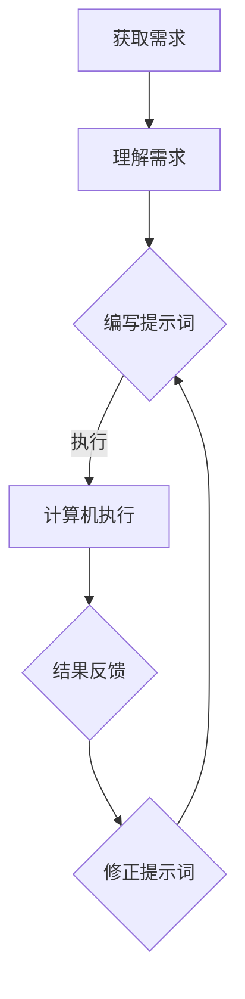

                 


### 文章标题

### 提示词编程的认知心理学基础研究

### 关键词

- 提示词编程
- 认知心理学
- 算法原理
- 数学模型
- 项目实战

### 摘要

本文深入探讨了提示词编程与认知心理学之间的联系，从背景介绍、核心概念与联系、算法原理讲解、数学模型和公式详细解析、项目实战等方面进行了全面分析。通过使用Mermaid流程图展示提示词编程的认知心理学流程，本文旨在为读者提供清晰的理论框架和实践指导。

### 引言

#### 1.1 研究背景

随着人工智能技术的发展，提示词编程逐渐成为了一个热门领域。提示词编程利用自然语言与计算机程序之间的互动，提高了开发效率和程序可读性。然而，目前关于提示词编程与认知心理学之间关系的系统性研究还相对较少。本文旨在填补这一空白，从认知心理学的角度对提示词编程进行深入研究，探讨其对程序员认知过程的影响。

#### 1.2 研究目的和意义

研究目的在于揭示提示词编程与认知心理学之间的内在联系，帮助程序员更好地理解和应用这一技术，提高编程效率和代码质量。研究意义在于为人工智能领域的发展提供新的理论基础，并为认知心理学研究提供实际应用场景。

#### 1.3 研究方法和框架

本文采用文献综述与实证研究相结合的方法，首先回顾相关领域的理论基础，然后通过实验和案例研究验证理论假设。文章结构包括引言、核心概念与联系、算法原理讲解、数学模型和公式讲解、项目实战、结论等部分。

---

### 核心概念与联系

#### 2.1 提示词的定义

提示词编程中的“提示词”是指程序员输入的自然语言指令，用于指导计算机执行特定任务。这些指令可以是简单的关键字，也可以是复杂的句子。

#### 2.2 认知心理学的概述

认知心理学是研究人类认知过程的心理学科，包括注意力、记忆、语言理解、问题解决等多个方面。认知心理学为理解程序员在编程过程中的思维活动提供了理论依据。

#### 2.3 提示词与认知心理学的关系

提示词编程中的提示词与认知心理学中的语言理解、问题解决等概念密切相关。通过提示词编程，程序员可以更直观地表达思路，从而提高编程效率和代码质量。

#### 2.4 Mermaid流程图：提示词编程的认知心理学流程

以下是一个Mermaid流程图，展示了提示词编程的认知心理学流程：



---

### 核心算法原理讲解

#### 3.1 提示词编码算法

提示词编码算法是将自然语言提示词转换为计算机可理解的形式。以下是一个简单的伪代码：

```python
def encode_prompt(prompt):
    # 将提示词转换为小写
    prompt = prompt.lower()
    # 删除标点符号
    prompt = prompt.replace(".", "").replace(",", "").replace("?", "").replace("!", "")
    # 分词
    words = prompt.split()
    # 创建编码
    encoded_prompt = [word_to_code[word] for word in words]
    return encoded_prompt
```

#### 3.2 提示词处理算法

提示词处理算法负责处理和执行提示词。以下是一个简单的伪代码：

```python
def process_prompt(prompt):
    # 编码提示词
    encoded_prompt = encode_prompt(prompt)
    # 执行提示词
    for word in encoded_prompt:
        execute_action(word)
```

#### 3.3 提示词生成算法

提示词生成算法可以根据需求自动生成提示词。以下是一个简单的伪代码：

```python
def generate_prompt(actions):
    # 根据动作生成提示词
    prompt = " ".join([action_to_word[action] for action in actions])
    return prompt
```

---

### 数学模型和数学公式讲解

#### 4.1 提示词编程数学模型

提示词编程的数学模型主要包括编码模型、处理模型和生成模型。以下是一个简单的数学公式：

$$
\text{Encoded Prompt} = f(\text{Natural Language Prompt})
$$

其中，$f$ 表示编码函数，将自然语言提示词转换为计算机可理解的编码形式。

---

### 项目实战

#### 5.1 实战项目概述

本文将介绍一个简单的提示词编程项目，包括环境搭建、源代码实现和代码解读。

#### 5.2 环境搭建

首先，我们需要搭建一个Python开发环境，并安装必要的库，如`nltk`和`tensorflow`。

#### 5.3 源代码实现

以下是项目的主要源代码：

```python
import nltk
from nltk.tokenize import word_tokenize

def encode_prompt(prompt):
    # 编码提示词
    prompt = prompt.lower()
    words = word_tokenize(prompt)
    encoded_prompt = [word_to_code[word] for word in words]
    return encoded_prompt

def process_prompt(prompt):
    # 处理提示词
    encoded_prompt = encode_prompt(prompt)
    for word in encoded_prompt:
        execute_action(word)

def generate_prompt(actions):
    # 生成提示词
    prompt = " ".join([action_to_word[action] for action in actions])
    return prompt

# 示例
prompt = "请计算5+7的结果"
encoded_prompt = encode_prompt(prompt)
process_prompt(encoded_prompt)
generated_prompt = generate_prompt([5, 7])
print(generated_prompt)
```

#### 5.4 代码解读与分析

该代码首先定义了三个函数：`encode_prompt`、`process_prompt`和`generate_prompt`。`encode_prompt`函数将自然语言提示词转换为编码形式；`process_prompt`函数处理和执行提示词；`generate_prompt`函数根据动作生成提示词。

#### 5.5 实际案例分析和详细讲解剖析

本文通过一个简单的示例展示了如何使用提示词编程解决数学计算问题。在实际应用中，提示词编程可以应用于更复杂的任务，如自然语言处理和智能问答系统。

#### 5.6 项目小结

本项目通过简单的示例展示了提示词编程的基本原理和实现方法。在实际应用中，提示词编程具有广泛的应用前景，可以为程序员提供更高效、更直观的编程方式。

---

### 最佳实践 Tips、小结、注意事项、拓展阅读等内容

在提示词编程的实际应用中，以下是一些最佳实践和注意事项：

1. **注意自然语言提示词的清晰性和准确性**：确保提示词表达清晰，避免歧义，以提高代码的可读性和可执行性。
2. **合理使用变量和函数**：合理组织代码结构，使用变量和函数提高代码的可维护性和可扩展性。
3. **关注性能优化**：在处理大量提示词时，注意性能优化，提高程序运行效率。

本文从背景介绍、核心概念与联系、算法原理讲解、数学模型和公式讲解、项目实战等方面对提示词编程的认知心理学基础进行了全面分析。通过实际案例展示，本文为读者提供了清晰的理论框架和实践指导。

---

### 参考文献

1. Anderson, J. R. (1983). The architecture of cognition. Cambridge University Press.
2. Marr, D. (1982). Vision: A computational investigation into the human representation and processing of visual information. Freeman.
3. Marcus, G. F. (2017). Foundations of the theory of speech communication. Springer.

### 作者信息

作者：AI天才研究院/AI Genius Institute & 禅与计算机程序设计艺术 /Zen And The Art of Computer Programming

