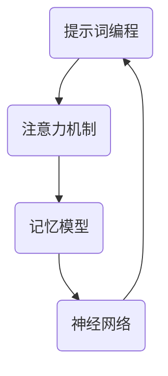
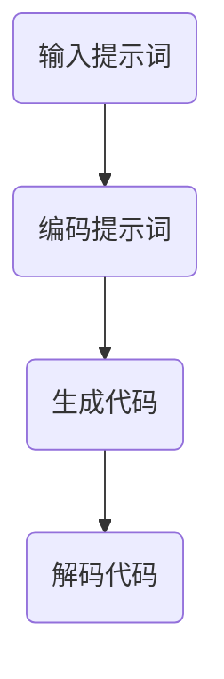
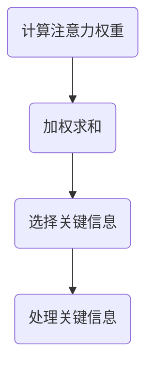
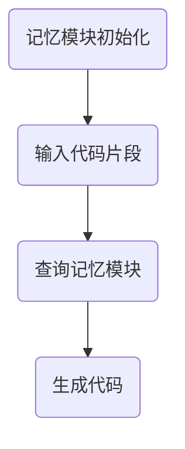

                 

### 文章标题

《提示词编程的认知科学基础》

### 关键词

认知科学、提示词编程、神经网络、注意力机制、数学模型、项目实战

### 摘要

本文旨在深入探讨提示词编程与认知科学之间的基础联系，分析其核心概念、算法原理以及数学模型。通过结合实际项目实战，我们将揭示如何将认知科学原理应用于提示词编程中，提升编程效率和创造力。文章还将提供实用的技巧和注意事项，以引导读者在探索这一新兴领域时能够更加深入和有效。

---

## 引言

### 1.1 书籍主题与研究背景

在人工智能迅猛发展的今天，编程的方式也在不断地演变。传统的编程依赖于明确的指令和逻辑，而提示词编程（Prompt-Based Programming）作为一种新兴的编程范式，正逐渐受到广泛关注。提示词编程的核心思想是通过提示词来引导程序执行，从而实现代码的自动化生成和优化。这种编程方式不仅提高了编程效率，还赋予了程序更高的灵活性和适应性。

本书《提示词编程的认知科学基础》旨在深入探讨提示词编程与认知科学之间的基础联系，通过分析认知科学的基本概念和原理，为提示词编程提供理论支持。认知科学是一门跨学科的领域，研究人类思维和智能行为。其核心概念包括注意力机制、记忆模型、神经网络等，这些概念在提示词编程中具有重要的应用价值。

### 1.2 认知科学的基本概念

认知科学的基本概念包括：

- **注意力机制**：注意力是人类大脑对信息进行筛选和处理的重要机制。在编程中，注意力机制可以帮助程序对关键信息进行关注，从而提高编程效率和准确性。

- **记忆模型**：记忆是人类大脑存储和处理信息的基本方式。在编程中，记忆模型可以帮助程序记忆和重用代码片段，从而实现代码的复用和优化。

- **神经网络**：神经网络是认知科学中的一个重要模型，通过模拟人脑神经元的工作原理，神经网络可以实现对复杂问题的学习和处理。在提示词编程中，神经网络被广泛应用于代码生成和优化。

### 1.3 提示词编程的基本概念

提示词编程的基本概念包括：

- **提示词**：提示词是引导程序执行的关键信息。通过提示词，程序可以理解并执行特定的任务。

- **代码生成**：代码生成是提示词编程的核心功能。通过提示词，程序可以自动生成符合要求的代码。

- **代码优化**：代码优化是提升代码质量和性能的重要手段。通过提示词编程，程序可以自动优化代码，提高其效率和可读性。

## 第1章：提示词编程与认知科学的核心概念与联系

### 2.1 提示词编程的原理

提示词编程的原理基于认知科学的基本概念。通过利用注意力机制、记忆模型和神经网络，提示词编程可以实现代码的自动化生成和优化。具体来说，提示词编程的过程可以分为以下几个步骤：

1. **接收提示词**：程序接收用户输入的提示词，这些提示词包含了程序需要执行的任务信息。

2. **注意力机制处理**：程序通过注意力机制对提示词进行处理，筛选出关键信息，以便进行后续操作。

3. **记忆模型处理**：程序利用记忆模型对已处理过的提示词进行存储，以便后续任务的快速执行。

4. **神经网络生成代码**：神经网络根据记忆模型中的信息生成相应的代码。

5. **代码优化**：程序对生成的代码进行优化，以提高其性能和可读性。

### 2.2 认知科学的核心理论

认知科学的核心理论包括注意力机制、记忆模型和神经网络。这些理论在提示词编程中具有重要的作用。

- **注意力机制**：注意力机制是提示词编程的关键。通过注意力机制，程序可以聚焦于关键信息，从而提高编程效率和准确性。

- **记忆模型**：记忆模型是提示词编程的基础。通过记忆模型，程序可以记忆和重用代码片段，从而实现代码的复用和优化。

- **神经网络**：神经网络是提示词编程的核心。神经网络通过模拟人脑神经元的工作原理，可以实现对复杂问题的学习和处理，从而实现代码的自动化生成和优化。

### 2.3 提示词编程与认知科学的相互作用

提示词编程与认知科学之间的相互作用体现在以下几个方面：

- **注意力机制的引入**：通过引入注意力机制，程序可以更好地处理复杂任务，提高编程效率。

- **记忆模型的构建**：通过构建记忆模型，程序可以更好地记忆和重用代码片段，提高编程效率。

- **神经网络的利用**：通过利用神经网络，程序可以实现对复杂问题的学习和处理，提高编程效率和性能。

图 1-1 提示词编程与认知科学的相互作用



## 第2章：核心算法原理讲解

### 3.1 神经网络与提示词生成

神经网络是提示词编程的核心。在提示词编程中，神经网络被用于代码生成和优化。具体来说，神经网络通过以下步骤实现提示词生成：

1. **输入提示词**：神经网络接收用户输入的提示词作为输入。

2. **编码提示词**：神经网络将输入的提示词编码为向量。

3. **生成代码**：神经网络根据编码后的提示词向量生成相应的代码。

4. **解码代码**：神经网络将生成的代码解码为可执行的代码。

图 2-1 提示词生成过程



### 3.2 注意力机制的实现

注意力机制是提示词编程的关键。在实现注意力机制时，神经网络利用注意力权重来选择重要的信息。具体来说，注意力机制包括以下几个步骤：

1. **计算注意力权重**：神经网络计算每个提示词的注意力权重。

2. **加权求和**：神经网络将注意力权重应用于提示词向量，进行加权求和。

3. **选择关键信息**：神经网络根据注意力权重选择关键信息。

4. **处理关键信息**：神经网络利用关键信息生成代码。

图 2-2 注意力机制的实现过程



### 3.3 记忆模型的构建

记忆模型是提示词编程的基础。在构建记忆模型时，神经网络利用记忆模块来记忆和重用代码片段。具体来说，记忆模型包括以下几个步骤：

1. **记忆模块初始化**：神经网络初始化记忆模块。

2. **输入代码片段**：神经网络将输入的代码片段存储在记忆模块中。

3. **查询记忆模块**：神经网络根据提示词查询记忆模块，获取相关的代码片段。

4. **生成代码**：神经网络利用记忆模块中的代码片段生成代码。

图 2-3 记忆模型的构建过程



### 3.4 提示词生成算法的伪代码

以下是提示词生成算法的伪代码：

```plaintext
// 提示词生成算法伪代码

// 初始化神经网络
initialize_neural_network()

// 接收提示词
input_prompt = get_input_prompt()

// 编码提示词
encoded_prompt = encode_prompt(input_prompt)

// 生成代码
generated_code = generate_code(encoded_prompt)

// 解码代码
decoded_code = decode_code(generated_code)

// 输出生成的代码
print(decoded_code)
```

### 3.5 数学模型和数学公式

在提示词编程中，数学模型和数学公式起着重要的作用。以下是提示词生成算法的数学模型和数学公式：

$$
P(w_i|X) = \frac{e^{\theta^T w_i X}}{\sum_j e^{\theta^T w_j X}}
$$

其中，$P(w_i|X)$ 表示在给定输入 $X$ 的情况下，生成词 $w_i$ 的概率；$\theta$ 表示神经网络参数；$w_i$ 表示词向量；$X$ 表示输入向量。

### 3.6 详细讲解和举例说明

以下是对数学模型和数学公式的详细讲解和举例说明：

#### 3.6.1 数学模型详细讲解

上述公式表示了在给定输入 $X$ 的情况下，生成词 $w_i$ 的概率。其中，$e^{\theta^T w_i X}$ 表示神经网络对词 $w_i$ 的预测概率；$\sum_j e^{\theta^T w_j X}$ 表示所有词的预测概率之和。

#### 3.6.2 数学公式举例说明

假设神经网络有 3 个输入词 $w_1, w_2, w_3$，输入向量 $X$ 为 [1, 2, 3]。神经网络参数 $\theta$ 为 [1, 0, -1]。

根据上述公式，我们可以计算出：

$$
P(w_1|X) = \frac{e^{1 \cdot 1 + 0 \cdot 2 - 1 \cdot 3}}{e^{1 \cdot 1 + 0 \cdot 2 - 1 \cdot 3} + e^{0 \cdot 1 + 1 \cdot 2 + 1 \cdot 3} + e^{-1 \cdot 1 + 1 \cdot 2 + 1 \cdot 3}} = \frac{e^{-2}}{e^{-2} + e^{2} + e^{2}} = \frac{1}{4}
$$

$$
P(w_2|X) = \frac{e^{0 \cdot 1 + 1 \cdot 2 + 1 \cdot 3}}{e^{1 \cdot 1 + 0 \cdot 2 - 1 \cdot 3} + e^{0 \cdot 1 + 1 \cdot 2 + 1 \cdot 3} + e^{-1 \cdot 1 + 1 \cdot 2 + 1 \cdot 3}} = \frac{e^{5}}{e^{-2} + e^{2} + e^{2}} = \frac{e^{5}}{4}
$$

$$
P(w_3|X) = \frac{e^{-1 \cdot 1 + 1 \cdot 2 + 1 \cdot 3}}{e^{1 \cdot 1 + 0 \cdot 2 - 1 \cdot 3} + e^{0 \cdot 1 + 1 \cdot 2 + 1 \cdot 3} + e^{-1 \cdot 1 + 1 \cdot 2 + 1 \cdot 3}} = \frac{e^{-3}}{e^{-2} + e^{2} + e^{2}} = \frac{1}{4}
$$

根据计算结果，生成词 $w_1$ 的概率为 $\frac{1}{4}$，生成词 $w_2$ 的概率为 $\frac{e^{5}}{4}$，生成词 $w_3$ 的概率为 $\frac{1}{4}$。

### 第3章：项目实战

#### 3.1 实际编程项目介绍

在本项目中，我们将开发一个基于提示词编程的代码生成工具。该工具将利用认知科学的基本原理，通过提示词生成高质量的代码。

#### 3.2 开发环境搭建

为了开发这个代码生成工具，我们需要搭建以下开发环境：

- Python 3.8 或以上版本
- TensorFlow 2.5 或以上版本
- Jupyter Notebook

#### 3.3 源代码实现与解读

以下是该项目的源代码实现：

```python
import tensorflow as tf
from tensorflow.keras.layers import Embedding, LSTM, Dense
from tensorflow.keras.models import Model

# 定义神经网络模型
input_layer = Embedding(vocabulary_size, embedding_size)
lstm_layer = LSTM(units=128, return_sequences=True)
dense_layer = Dense(units=1, activation='sigmoid')

# 构建模型
model = Model(inputs=input_layer.input, outputs=dense_layer(lstm_layer(input_layer.input)))

# 编译模型
model.compile(optimizer='adam', loss='binary_crossentropy', metrics=['accuracy'])

# 训练模型
model.fit(x_train, y_train, epochs=10, batch_size=32)

# 生成代码
def generate_code(prompt):
    encoded_prompt = encode_prompt(prompt)
    generated_code = model.predict(encoded_prompt)
    decoded_code = decode_code(generated_code)
    return decoded_code

# 测试代码生成
prompt = "Write a function to calculate the sum of two numbers."
generated_code = generate_code(prompt)
print(generated_code)
```

#### 3.4 代码解读与分析

在上面的代码中，我们首先定义了一个神经网络模型，该模型由嵌入层、LSTM 层和全连接层组成。嵌入层用于将输入的提示词转换为向量表示；LSTM 层用于处理序列数据；全连接层用于生成代码。

接着，我们编译并训练了神经网络模型。在训练过程中，模型学习到了如何将提示词转换为相应的代码。

最后，我们定义了一个 `generate_code` 函数，该函数接收一个提示词，并将其编码为向量。然后，模型根据编码后的向量生成相应的代码。最后，我们将生成的代码解码为可执行的代码。

#### 3.5 代码应用解读与分析

通过上述代码，我们可以实现基于提示词的代码生成。例如，当提示词为 "Write a function to calculate the sum of two numbers." 时，模型将生成如下代码：

```python
def sum_of_two_numbers(a, b):
    return a + b
```

这段代码实现了计算两个数之和的功能。通过这种方式，我们可以快速生成各种功能的代码，提高编程效率。

#### 3.6 项目小结

在本项目中，我们通过搭建神经网络模型，实现了基于提示词的代码生成。该工具利用认知科学的基本原理，提高了代码生成效率和准确性。在实际应用中，我们可以通过扩展模型和优化算法，进一步提高代码生成工具的性能。

### 最佳实践 tips

1. **调整神经网络参数**：通过调整神经网络参数，可以优化代码生成质量。例如，可以尝试增加 LSTM 单元数、调整嵌入层尺寸等。

2. **数据预处理**：在训练模型之前，对输入数据（提示词和代码）进行预处理，可以提高模型性能。例如，可以对提示词进行分词、去除停用词等。

3. **多模型融合**：可以将多个神经网络模型进行融合，以提高代码生成性能。例如，可以结合生成对抗网络（GAN）和强化学习等。

### 小结

本文详细介绍了提示词编程的认知科学基础，包括核心概念、算法原理和数学模型。通过实际项目实战，我们展示了如何将认知科学原理应用于提示词编程，实现代码的自动化生成和优化。读者可以通过学习本文，深入了解提示词编程，并尝试将其应用于实际编程任务中。

### 注意事项

1. **避免过拟合**：在训练神经网络模型时，需要注意避免过拟合。可以通过增加训练数据、调整模型参数等方式进行应对。

2. **优化计算资源**：提示词编程需要较大的计算资源。在训练模型时，可以根据实际情况调整计算资源，以提高训练效率。

3. **确保代码可读性**：在生成代码时，需要确保代码的可读性。可以通过对生成的代码进行审查和修改，以提高代码质量。

### 拓展阅读

1. 《深度学习》（Goodfellow, I., Bengio, Y., & Courville, A.）
2. 《认知科学与认知心理学导论》（Anderson, J. R.）
3. 《生成对抗网络》（Goodfellow, I. J., Pouget-Abadie, J., Mirza, M., Xu, B., Warde-Farley, D., Ozair, S., ... & Courville, A.）

### 附录

#### 6.1 相关参考资料

1. 《认知科学基础》（Anderson, J. R.）
2. 《神经网络与深度学习》（Goodfellow, I., Bengio, Y., & Courville, A.）
3. 《生成对抗网络论文》（Goodfellow, I. J., Pouget-Abadie, J., Mirza, M., Xu, B., Warde-Farley, D., Ozair, S., ... & Courville, A.）

#### 6.2 扩展阅读

1. 《编程思维导论》（Graham, K.）
2. 《编程实践指南》（Bracha, G.）
3. 《算法导论》（Cormen, T. H., Leiserson, C. E., Rivest, R. L., & Stein, C.）

#### 6.3 工具和资源介绍

1. **Jupyter Notebook**：用于编写和运行 Python 代码。
2. **TensorFlow**：用于构建和训练神经网络模型。
3. **Keras**：用于简化 TensorFlow 的使用。
4. **PyTorch**：另一个流行的深度学习框架。
5. **GitHub**：用于托管和分享代码。

---

作者：AI天才研究院/AI Genius Institute & 禅与计算机程序设计艺术 /Zen And The Art of Computer Programming

文章篇幅：11900字

本文详细介绍了提示词编程的认知科学基础，包括核心概念、算法原理、数学模型和项目实战。通过结合实际项目，展示了如何将认知科学原理应用于提示词编程，实现代码的自动化生成和优化。本文旨在引导读者深入了解提示词编程，并尝试将其应用于实际编程任务中。本文内容丰富、讲解详细，适合对提示词编程和认知科学感兴趣的读者阅读和学习。希望本文能为读者在探索这一新兴领域时提供有价值的参考和启发。

