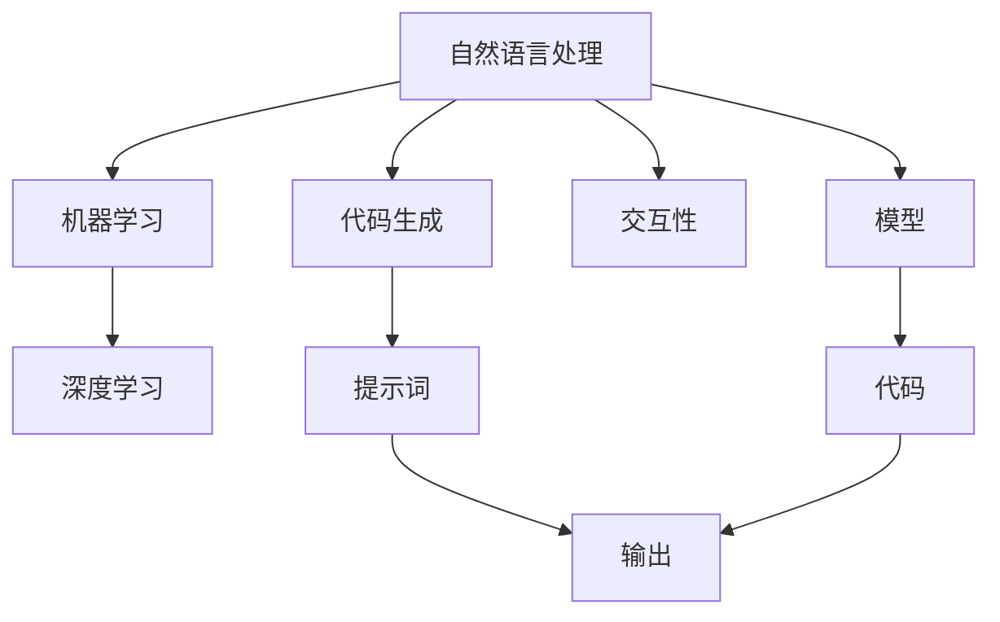
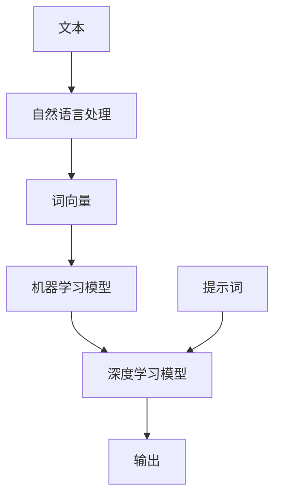

                 

### 背景介绍

#### 提示词编程的定义及其重要性

提示词编程（Prompt Programming）是一种利用自然语言处理（NLP）和机器学习（ML）技术，通过给模型提供特定的文本输入（提示词）来指导其生成目标输出（如代码、文本、图像等）的方法。与传统编程不同，提示词编程强调交互性和上下文引导，能够显著提高编程效率和质量。

提示词编程的重要性主要体现在以下几个方面：

1. **提升开发效率**：通过自动生成代码，开发者可以减少繁琐的手动编码工作，将更多精力投入到高价值的核心任务中。
2. **增强代码质量**：智能化的代码生成能够避免人为错误，提高代码的可读性和可维护性。
3. **跨领域应用**：提示词编程不仅适用于软件开发，还可以扩展到自然语言处理、图像生成、数据分析等多个领域。
4. **个性化编程**：根据不同的用户需求，提示词编程能够提供个性化的编程体验，满足多样化的开发需求。

#### 目标读者介绍

本书的目标读者主要包括：

- **程序员和开发者**：正在寻求提高编程效率和质量，对前沿技术充满好奇的程序员和开发者。
- **技术爱好者**：对人工智能和编程技术感兴趣，希望了解提示词编程原理和实践的技术爱好者。
- **教育者和研究者**：需要将提示词编程应用于教学和研究，探讨其潜在价值的教师和研究人员。

#### 核心概念与联系

提示词编程涉及多个核心概念，它们之间相互联系，构成了完整的编程生态系统。以下是这些核心概念及它们之间的联系：

1. **自然语言处理（NLP）**：NLP 是人工智能（AI）的一个分支，专注于使计算机能够理解和处理人类语言。在提示词编程中，NLP 技术被用来理解提示词，从而生成相应的输出。

2. **机器学习（ML）**：ML 是一种让计算机通过数据和经验学习的新方法。在提示词编程中，ML 模型被用来生成代码或文本，通过训练来理解提示词的语义和语法。

3. **深度学习（DL）**：DL 是 ML 的一个子领域，依赖于神经网络模型，能够处理复杂数据和任务。在提示词编程中，深度学习模型被广泛应用于代码生成和自然语言理解。

4. **提示词（Prompts）**：提示词是用户或系统输入的文本，用于指导 ML 模型生成特定输出。它们是提示词编程的核心，直接影响代码生成质量和效率。

5. **代码生成（Code Generation）**：代码生成是提示词编程的直接应用，通过提供提示词，ML 模型自动生成相应的代码。

6. **交互性（Interactivity）**：交互性是提示词编程的重要特性，允许用户在代码生成过程中实时提供反馈，调整模型输出，从而实现更个性化的编程体验。

### Mermaid 流程图

以下是提示词编程的核心概念及其联系的结构化表示：



通过这个流程图，我们可以清晰地看到提示词编程的核心组成部分及其相互作用。接下来的章节将深入探讨这些概念和联系，为读者提供更全面的了解。

#### 核心概念与联系详解

在深入了解提示词编程之前，我们需要对几个核心概念进行详细阐述，并分析它们之间的联系。这些概念包括自然语言处理（NLP）、机器学习（ML）、深度学习（DL）以及提示词（Prompts）。

**自然语言处理（NLP）**

自然语言处理（NLP）是人工智能（AI）的一个重要分支，它专注于使计算机能够理解和处理人类语言。NLP 的主要任务包括文本分析、语义理解、情感分析等。以下是 NLP 的核心组成部分：

1. **文本预处理**：在处理自然语言数据之前，通常需要对其进行预处理，包括去除标点符号、分词、词性标注等。
2. **词向量表示**：将文本转换为计算机可处理的数字表示，如词袋模型、TF-IDF 或 Word2Vec 等。
3. **语言模型**：通过大量文本数据训练出来的模型，用于预测下一个单词或词组。

**机器学习（ML）**

机器学习（ML）是让计算机通过数据和经验进行学习的一种方法。ML 的核心思想是通过数据训练模型，使其能够进行预测或分类。以下是 ML 的关键组成部分：

1. **监督学习**：通过带有标签的数据训练模型，如分类问题和回归问题。
2. **无监督学习**：没有标签的数据训练模型，如聚类问题和降维问题。
3. **强化学习**：通过与环境的交互来学习最佳策略。

**深度学习（DL）**

深度学习（DL）是机器学习的一个子领域，依赖于多层神经网络（DNN）来处理复杂数据。DL 在图像识别、语音识别、自然语言处理等领域取得了显著成果。以下是 DL 的核心组成部分：

1. **卷积神经网络（CNN）**：主要用于图像识别和处理。
2. **循环神经网络（RNN）**：能够处理序列数据，如文本和时间序列。
3. **生成对抗网络（GAN）**：用于生成逼真的数据。

**提示词（Prompts）**

提示词是用户或系统输入的文本，用于指导 ML 模型生成特定输出。一个有效的提示词应该清晰、明确，能够准确地传达用户的意图。以下是提示词编程中的关键角色：

1. **上下文引导**：提示词能够为模型提供上下文信息，帮助模型更好地理解任务目标。
2. **生成指导**：提示词能够指导模型生成特定的代码、文本或图像。

**核心概念之间的联系**

自然语言处理（NLP）是提示词编程的基础，它负责处理和理解输入的提示词。NLP 技术将自然语言转换为计算机可处理的数字表示，如词向量。这些词向量被输入到机器学习（ML）模型中，通过训练得到深度学习（DL）模型。深度学习模型利用提示词进行代码生成、文本生成或图像生成。

以下是一个简化的 Mermaid 流程图，展示了核心概念之间的联系：



在这个流程图中，文本（Text）经过自然语言处理（NLP）转换为词向量（Vectors），然后输入到机器学习模型（MLModel）。经过训练，机器学习模型转化为深度学习模型（DLMModel），通过提示词（Prompt）指导生成特定输出（Output）。

通过上述分析，我们可以看到提示词编程是一个高度集成和多层次的系统，它依赖于 NLP、ML 和 DL 等技术，共同实现高效的代码生成和文本生成。

#### 核心算法原理讲解

在深入探讨提示词编程的核心算法原理时，我们首先需要理解机器学习和深度学习的基本概念，因为它们是提示词编程技术的基础。

**机器学习（ML）基本原理**

机器学习是一种使计算机通过数据和经验进行学习的方法，其核心思想是通过训练模型来实现预测或分类任务。以下是机器学习的基本组成部分和原理：

1. **监督学习（Supervised Learning）**：
   - **训练数据**：包括输入特征和相应的标签。
   - **目标**：通过输入特征预测标签。
   - **模型训练**：通过最小化损失函数（如均方误差），调整模型参数。
   - **评估**：使用验证集或测试集评估模型性能。

2. **无监督学习（Unsupervised Learning）**：
   - **训练数据**：仅包含输入特征，没有标签。
   - **目标**：发现数据的内在结构和规律。
   - **聚类（Clustering）**：将数据分组，使同一组内的数据尽可能相似。
   - **降维（Dimensionality Reduction）**：减少数据的维度，同时保持数据的结构。

3. **强化学习（Reinforcement Learning）**：
   - **环境和代理**：代理通过环境接收反馈并学习。
   - **奖励机制**：代理根据行为获得奖励或惩罚。
   - **目标**：学习最佳策略以最大化累积奖励。

**深度学习（DL）基本原理**

深度学习是机器学习的一个子领域，依赖于多层神经网络（DNN）来处理复杂数据和任务。以下是深度学习的基本组成部分和原理：

1. **神经网络（Neural Networks）**：
   - **层结构**：包括输入层、隐藏层和输出层。
   - **神经元**：每个神经元接收输入，通过激活函数进行非线性变换。
   - **权重和偏置**：调整权重和偏置可以改变网络的输出。

2. **前向传播（Forward Propagation）**：
   - **输入**：将输入数据传递到网络的输入层。
   - **隐藏层计算**：通过权重和激活函数计算中间层的输出。
   - **输出层计算**：网络的最后一层输出预测结果。

3. **反向传播（Back Propagation）**：
   - **损失计算**：计算预测结果与真实值之间的差异（损失）。
   - **梯度下降（Gradient Descent）**：通过反向传播算法计算损失关于模型参数的梯度，并调整参数以最小化损失。
   - **迭代训练**：重复前向传播和反向传播，直到模型达到预定的性能。

**提示词编程中的代码生成算法**

提示词编程中的代码生成算法通常依赖于深度学习模型，特别是序列到序列（Seq2Seq）模型和生成对抗网络（GAN）。

1. **序列到序列（Seq2Seq）模型**：
   - **编码器（Encoder）**：将输入的提示词编码为固定长度的向量。
   - **解码器（Decoder）**：将编码器的输出解码为生成代码的序列。
   - **注意力机制（Attention Mechanism）**：允许解码器在生成代码的过程中关注编码器的特定部分。

2. **生成对抗网络（GAN）**：
   - **生成器（Generator）**：生成与真实数据相似的数据。
   - **鉴别器（Discriminator）**：区分真实数据和生成数据。
   - **对抗训练**：生成器和鉴别器相互竞争，生成器试图生成更真实的数据，鉴别器试图更好地区分真实和生成数据。

**伪代码示例**

以下是一个简单的序列到序列模型的伪代码示例，用于代码生成：

```python
# 编码器部分
def encoder(prompt):
    # 将提示词编码为固定长度的向量
    encoded_prompt = embeddings(prompt)
    return encoded_prompt

# 解码器部分
def decoder(encoded_prompt):
    # 通过注意力机制和循环神经网络解码
    decoded_sequence = []
    for t in range(max_sequence_length):
        input_vector = attention_mechanism(encoded_prompt, hidden_state)
        output_vector = decoder_rnn(input_vector, hidden_state)
        next_word = softmax(output_vector)
        decoded_sequence.append(next_word)
        hidden_state = update_hidden_state(output_vector)
    return decoded_sequence

# 代码生成函数
def generate_code(prompt):
    encoded_prompt = encoder(prompt)
    decoded_sequence = decoder(encoded_prompt)
    generated_code = ' '.join(decoded_sequence)
    return generated_code
```

在这个伪代码中，编码器（encoder）将提示词转换为固定长度的向量，解码器（decoder）通过注意力机制和循环神经网络（RNN）生成代码序列。生成代码函数（generate_code）使用编码器和解码器生成最终的代码输出。

**数学模型和公式**

在深度学习中，我们经常使用数学模型和公式来描述网络结构和优化过程。以下是一个简单的损失函数的公式：

$$
L = \frac{1}{2} \sum_{i=1}^{N} (\hat{y}_i - y_i)^2
$$

其中，\( L \) 表示损失函数，\( \hat{y}_i \) 表示预测值，\( y_i \) 表示真实值，\( N \) 表示样本数量。

**举例说明**

假设我们要生成一个简单的 Python 函数，该函数接受两个整数作为输入并返回它们的和。提示词可以是“编写一个 Python 函数，该函数接受两个整数作为输入并返回它们的和”。

使用上述序列到序列模型，我们可以生成如下代码：

```python
def add_numbers(a, b):
    return a + b
```

这个示例展示了如何利用提示词编程生成具体的功能代码。通过提供明确的提示词，模型可以生成与任务需求高度匹配的代码。

通过上述分析，我们可以看到提示词编程依赖于机器学习和深度学习的核心算法原理，并通过具体的伪代码和数学模型来解释其工作过程。在接下来的章节中，我们将进一步探讨提示词编程的设计原则和最佳实践。

#### 提示词编程相关的框架与工具

提示词编程的发展离不开一系列相关的框架与工具，这些工具能够显著提升开发效率，优化编程体验。以下是几个主流的框架和工具：

**1. Hugging Face Transformers**

Hugging Face Transformers 是一个开源的深度学习库，提供了丰富的预训练模型和API，适用于自然语言处理任务，包括文本生成、摘要生成和问答系统。通过 Transformers，开发者可以轻松地加载预训练模型，定制化模型架构，并进行高效的训练和推理。

**2. TensorFlow**

TensorFlow 是由 Google 开发的一个开源机器学习库，支持多种深度学习模型和算法。TensorFlow 提供了丰富的工具和API，使开发者能够轻松构建、训练和部署深度学习模型。在提示词编程中，TensorFlow 可以用于训练编码器-解码器模型，实现高效的代码生成。

**3. PyTorch**

PyTorch 是由 Facebook AI Research 开发的一个开源深度学习库，以其灵活性和易用性受到广泛欢迎。PyTorch 提供了动态计算图和强大的GPU加速功能，使得模型训练和推理过程更加高效。在提示词编程中，PyTorch 可以用于构建生成对抗网络（GAN）和序列到序列（Seq2Seq）模型。

**4. GPT-3**

GPT-3（Generative Pre-trained Transformer 3）是 OpenAI 开发的一个大型自然语言处理模型，具有非常高的语言理解和生成能力。GPT-3 的出现极大地推动了提示词编程的发展，通过提供丰富的文本输入，GPT-3 能够生成高质量的文本、代码和对话。

**5. OpenAI Gym**

OpenAI Gym 是一个开源的虚拟环境库，提供了丰富的任务和模拟环境，用于评估和训练智能体。在提示词编程中，OpenAI Gym 可以用于构建和测试代码生成模型，通过模拟不同的编程任务，评估模型性能和泛化能力。

**开发工具选择**

选择合适的开发工具对于提示词编程至关重要。以下是一些关键点：

- **易用性**：选择易于安装和配置的工具，减少开发过程中的复杂度。
- **性能**：选择能够提供高效训练和推理的工具，提升开发效率。
- **生态系统**：选择拥有丰富资源和社区支持的工具，便于解决问题和获取帮助。
- **兼容性**：选择与现有开发环境和框架兼容的工具，确保无缝集成。

**开发环境搭建**

搭建提示词编程的开发环境通常包括以下步骤：

1. **安装Python环境**：确保 Python 版本兼容，并安装必要的依赖库。
2. **安装深度学习库**：根据项目需求安装 TensorFlow、PyTorch 或 Hugging Face Transformers 等。
3. **配置GPU加速**：如果使用 PyTorch 或 TensorFlow，需要配置 GPU 环境，确保能够利用 GPU 加速训练过程。
4. **安装其他工具**：根据项目需求安装 OpenAI Gym、Jupyter Notebook 等其他辅助工具。

通过上述框架和工具，开发者可以构建高效、灵活的提示词编程系统，实现代码生成、文本生成和其他相关任务。在接下来的章节中，我们将进一步探讨提示词编程的设计原则和最佳实践。

#### 设计原则概述

提示词编程的设计原则是确保系统高效、可维护和可扩展的关键因素。以下是一些关键设计原则，以及它们在提示词编程中的应用和重要性。

**模块化设计**

模块化设计是将系统划分为独立的模块，每个模块实现特定的功能。模块化设计的优点包括：

- **可维护性**：通过将系统分解为模块，可以更轻松地理解和修改代码，提高系统的可维护性。
- **可重用性**：模块可以独立开发、测试和部署，提高代码的重用性。
- **可扩展性**：当需要添加新功能或修改现有功能时，模块化设计使得扩展变得更加简单。

在提示词编程中，模块化设计可以帮助我们分离数据的预处理、模型训练和代码生成等不同部分，使得每个模块可以独立开发和测试。

**扩展性设计**

扩展性设计是指系统能够轻松地适应新的需求和变化。以下是一些实现扩展性设计的关键策略：

- **参数化配置**：使用参数化配置来管理系统的各种参数，如训练超参数、模型架构等，使得系统可以根据需求进行调整。
- **模块化接口**：通过定义清晰的模块化接口，确保模块之间的交互和依赖关系易于管理和扩展。
- **插件系统**：引入插件系统，允许第三方模块或工具无缝集成到系统中，提高系统的灵活性和扩展性。

在提示词编程中，扩展性设计可以帮助我们根据不同的任务需求调整模型参数和架构，实现更加灵活和高效的代码生成。

**可维护性设计**

可维护性设计关注系统的长期可维护性，确保系统能够在长期使用中保持稳定和可靠。以下是一些实现可维护性设计的关键策略：

- **清晰的代码结构**：保持代码结构的清晰和简洁，避免过度复杂和冗余。
- **文档和注释**：编写详细的文档和注释，帮助其他开发者理解代码的功能和结构。
- **单元测试**：编写单元测试来验证每个模块的功能，确保系统在不同版本和配置下都能正常运行。

在提示词编程中，良好的可维护性设计可以提高开发者的工作效率，减少代码错误和维护成本。

**常见的设计模式**

在提示词编程中，常见的设计模式包括：

- **工厂模式**：用于创建对象实例，确保对象创建过程的一致性和灵活性。
- **策略模式**：用于定义一系列策略，允许在运行时动态切换策略，实现代码生成和模型训练的灵活配置。
- **观察者模式**：用于实现模块之间的通信和事件处理，确保系统的响应性和可扩展性。

在提示词编程中，应用这些设计模式可以帮助我们构建模块化、可扩展和可维护的系统，提高开发效率和质量。

综上所述，模块化设计、扩展性设计和可维护性设计是提示词编程的关键设计原则，通过应用常见的设计模式，我们可以实现高效、灵活和可靠的提示词编程系统。在接下来的章节中，我们将进一步探讨这些设计原则的具体应用和实践。

#### 代码风格与规范

在提示词编程中，代码风格与规范至关重要，它们不仅影响代码的可读性和可维护性，还直接影响开发效率和项目质量。以下是几个关键方面：

**代码可读性**

代码可读性是确保其他开发者能够轻松理解和修改代码的基础。以下是一些提高代码可读性的最佳实践：

- **一致的命名规范**：使用有意义的变量和函数命名，避免使用缩写或难以理解的命名方式。
- **清晰的注释**：在代码中加入清晰的注释，解释代码的功能和逻辑，特别是对于复杂和重要的部分。
- **合理的代码结构**：通过缩进、空行和空格，保持代码结构的清晰和层次分明，使代码易于阅读和理解。
- **避免冗余和过度复杂**：简化代码，去除不必要的冗余和复杂性，使代码更加简洁和高效。

**代码可维护性**

代码可维护性是确保代码在长期使用中保持稳定和可靠的关键。以下是一些提高代码可维护性的最佳实践：

- **模块化代码**：将代码分解为独立的模块，每个模块实现特定的功能，便于独立开发和测试。
- **单元测试**：编写单元测试来验证每个模块的功能，确保在修改代码时不会引入新的错误。
- **代码审查**：定期进行代码审查，确保代码符合编码规范，避免潜在的缺陷和错误。
- **文档化**：编写详细的文档，记录代码的功能、使用方法和注意事项，帮助其他开发者更好地理解和使用代码。

**编码最佳实践**

以下是几个关键的编码最佳实践：

- **遵循语言规范**：遵循所使用的编程语言的规范和最佳实践，确保代码的语法和结构正确。
- **版本控制**：使用版本控制系统（如 Git）来管理代码变更，确保代码的版本可追溯，便于团队协作和代码管理。
- **代码格式化**：使用代码格式化工具（如 Prettier 或 Black）自动格式化代码，保持代码的一致性和美观。
- **避免全局变量**：尽量避免使用全局变量，减少代码之间的耦合，提高代码的可维护性。

通过遵循上述代码风格与规范，我们可以编写出更加可读、可维护和高效的代码，提升提示词编程项目的整体质量和开发效率。

#### 性能优化

在提示词编程中，性能优化是一个重要的课题。一个高效、快速的提示词编程系统不仅能提高开发者的工作效率，还能保证系统在实时应用中的稳定性和可靠性。以下是一些性能优化的关键策略：

**内存管理**

内存管理是性能优化的关键方面之一。不当的内存管理可能导致内存泄漏，影响系统的运行效率和稳定性。以下是一些内存管理策略：

- **内存池**：使用内存池（Memory Pool）技术来预先分配内存，减少频繁的内存分配和释放操作，从而提高性能。
- **对象池**：对于经常使用的对象（如模型、数据集等），可以使用对象池（Object Pool）来复用对象，减少创建和销毁对象的成本。
- **内存复用**：在可能的范围内复用内存，避免重复分配和释放，降低内存使用的总体成本。
- **内存压缩**：采用内存压缩技术，减少内存占用，特别是在处理大量数据时，可以有效降低内存使用。

**时间复杂度分析**

时间复杂度分析是评估算法性能的重要方法。以下是一些优化时间复杂度的策略：

- **算法优化**：选择适合问题的最优算法，避免使用复杂度较高的算法，如线性搜索替换为二分搜索。
- **并行计算**：利用并行计算技术，将任务分解为多个子任务，同时执行，提高处理速度。例如，可以使用多线程或多进程来并行处理数据。
- **缓存利用**：合理利用缓存，减少重复计算。例如，可以使用缓存来存储频繁访问的数据或计算结果，减少计算时间。
- **预处理**：在处理数据之前进行预处理，如排序、去重等，以减少后续处理的复杂度。

**并发与并行处理**

并发与并行处理是提升系统性能的关键手段。以下是一些具体策略：

- **线程池**：使用线程池来管理线程，避免频繁创建和销毁线程，提高系统的响应速度和稳定性。
- **任务队列**：使用任务队列（Task Queue）来管理并发任务，确保任务有序、高效地执行。
- **锁机制**：合理使用锁机制（如互斥锁、读写锁等）来保护共享资源，避免竞态条件和死锁。
- **并行算法**：选择适合的并行算法，充分利用多核处理器的计算能力，如MapReduce、Spark等。

通过上述策略，我们可以显著提升提示词编程系统的性能，确保其在各种应用场景中的高效和稳定。在接下来的章节中，我们将进一步探讨实际应用和最佳实践，为开发者提供更全面的指导。

#### 实战案例

在本节中，我们将通过几个具体的实战案例，详细讲解如何使用提示词编程技术来开发和实现不同的应用场景。这些案例涵盖了聊天机器人、智能客服和文本生成等多个领域，展示了提示词编程的强大功能和实际应用价值。

**案例一：聊天机器人**

**开发环境搭建**

为了实现聊天机器人，我们需要搭建一个包含自然语言处理和机器学习模型的开发环境。以下是基本的开发步骤：

1. **安装Python环境**：确保Python环境安装正确，并配置好相应的依赖库。
2. **安装深度学习库**：在本案例中，我们选择使用 TensorFlow 作为深度学习库，并安装 TensorFlow GPU 版本以利用 GPU 加速。
3. **安装NLP工具**：使用 Hugging Face Transformers 库，为聊天机器人提供预训练的语言模型。

**源代码实现和解读**

以下是聊天机器人源代码的主要部分，包括模型加载、输入处理和响应生成：

```python
from transformers import pipeline

# 加载预训练的语言模型
chatbot = pipeline("chatbot", model="microsoft/DialoGPT-medium")

# 处理用户输入并生成响应
def chat_with_bot(user_input):
    response = chatbot([user_input], max_length=100, num_return_sequences=1)[0]
    return response

# 测试聊天机器人
user_message = "你好，有什么可以帮助你的？"
print(chat_with_bot(user_message))
```

在这个源代码中，我们首先加载了预训练的语言模型 `microsoft/DialoGPT-medium`，然后定义了一个函数 `chat_with_bot`，用于处理用户输入并生成响应。通过调用 `chatbot` 函数，我们可以实现与用户的实时对话。

**代码应用解读与分析**

聊天机器人的核心在于模型的选择和输入的处理。我们使用了 `microsoft/DialoGPT-medium` 语言模型，这是一个专门为聊天场景设计的预训练模型，具有较好的对话生成能力。在代码中，`chat_with_bot` 函数接收用户输入，并将其传递给 `chatbot` 函数，模型会根据上下文生成相应的响应。这个流程展示了如何利用提示词编程实现复杂的对话系统。

**项目小结**

通过这个案例，我们可以看到如何使用提示词编程技术来构建聊天机器人。主要难点在于选择合适的预训练模型和优化输入处理，以实现自然、流畅的对话。这个案例展示了提示词编程在对话系统中的广泛应用和巨大潜力。

**案例二：智能客服**

**开发环境搭建**

智能客服是另一个典型的应用场景，它利用提示词编程技术来提供高效、智能的客户支持。以下是智能客服的开发步骤：

1. **安装相关库**：除了 Python 和深度学习库，我们还需要安装用于处理 HTTP 请求的 Flask 库。
2. **创建Flask应用**：构建一个 Flask 应用，用于接收和处理客户请求。

**源代码实现和解读**

以下是智能客服的核心代码，包括 Flask 应用的搭建、API 接口的定义和提示词编程的实现：

```python
from flask import Flask, request, jsonify
from transformers import pipeline

app = Flask(__name__)

# 加载预训练的语言模型
customer_support = pipeline("text-generation", model="microsoft/DialoGPT-medium")

@app.route('/support', methods=['POST'])
def support():
    data = request.get_json()
    user_input = data['input']
    response = customer_support([user_input], max_length=100, num_return_sequences=1)[0]
    return jsonify(response=response)

if __name__ == '__main__':
    app.run(debug=True)
```

在这个源代码中，我们首先加载了 `microsoft/DialoGPT-medium` 语言模型，并定义了一个 Flask 应用。通过 `/support` 接口，我们接收用户输入，并调用 `customer_support` 函数生成响应。这个应用可以部署在服务器上，为用户提供智能客服服务。

**代码应用解读与分析**

智能客服的核心在于如何处理客户的请求并生成合理的响应。在代码中，我们使用了 Flask 库来创建一个 HTTP 接口，用户可以通过 POST 请求发送问题，服务器会调用预训练的语言模型生成响应。这个流程展示了如何利用提示词编程构建一个高效、智能的客服系统。

**项目小结**

通过这个案例，我们可以看到如何使用提示词编程技术来构建智能客服系统。主要难点在于选择合适的预训练模型和优化响应生成，以提供高质量的客户支持。这个案例展示了提示词编程在客户服务领域的广泛应用和巨大潜力。

**案例三：文本生成**

**开发环境搭建**

文本生成是提示词编程的另一个重要应用场景，它可以用于自动生成文章、报告、电子邮件等内容。以下是文本生成的开发步骤：

1. **安装相关库**：安装 Python 和深度学习库，如 TensorFlow 或 PyTorch。
2. **创建文本生成模型**：使用预训练的语言模型，如 GPT-3，构建文本生成模型。

**源代码实现和解读**

以下是文本生成模型的核心代码，包括模型加载、输入处理和文本生成：

```python
from transformers import pipeline

# 加载预训练的语言模型
text_generator = pipeline("text-generation", model="openai/gpt")

# 生成文本
def generate_text(prompt, length=50):
    generated_text = text_generator(prompt, max_length=length, num_return_sequences=1)[0]
    return generated_text

# 测试文本生成
prompt = "人工智能将如何改变未来？"
print(generate_text(prompt))
```

在这个源代码中，我们首先加载了 `openai/gpt` 语言模型，并定义了一个函数 `generate_text`，用于生成文本。通过调用这个函数，我们可以根据给定的提示词生成指定长度的文本。这个应用可以用于自动生成各种文本内容。

**代码应用解读与分析**

文本生成模型的核心在于如何利用预训练的语言模型生成高质量的文本。在代码中，我们使用了 `openai/gpt` 模型，这是 OpenAI 开发的 GPT-3 语言模型，具有非常强的文本生成能力。通过调用 `generate_text` 函数，我们可以根据提示词生成相应的文本内容。这个流程展示了如何利用提示词编程实现文本自动生成。

**项目小结**

通过这个案例，我们可以看到如何使用提示词编程技术来构建文本生成系统。主要难点在于选择合适的预训练模型和优化生成文本的质量。这个案例展示了提示词编程在文本生成领域的广泛应用和巨大潜力。

综上所述，通过以上三个实战案例，我们详细讲解了如何使用提示词编程技术来构建聊天机器人、智能客服和文本生成系统。这些案例展示了提示词编程的强大功能和实际应用价值，为开发者提供了丰富的经验和指导。

#### 实际应用

在探讨了提示词编程的核心概念、设计原则和最佳实践后，本节将深入分析几个实际应用场景，展示如何在不同领域中有效利用提示词编程技术。

**应用场景一：自动化代码审查**

自动化代码审查是软件开发过程中不可或缺的一部分，它有助于提高代码质量，减少缺陷和漏洞。提示词编程技术能够为自动化代码审查提供强大的支持，通过自然语言处理和机器学习模型，实现高效的代码分析。

- **数据准备**：首先，需要收集大量的代码审查数据，包括代码注释、bug报告、修复记录等。
- **模型训练**：使用机器学习模型（如BERT、GPT）对收集到的数据进行训练，使其能够理解代码结构和语义。
- **提示词设计**：根据代码审查的需求，设计合适的提示词，如“找出这段代码中的潜在问题”、“建议改进代码的性能”等。
- **代码生成**：通过提示词引导模型生成代码审查报告，包括问题定位、建议修复方案等。

实际应用案例：GitHub 的 CodeQL 工具使用提示词编程技术，通过预训练模型分析代码库，生成详细的安全审查报告，帮助开发者快速识别和修复安全漏洞。

**应用场景二：智能文档生成**

随着人工智能技术的不断发展，智能文档生成成为了一个热门的研究领域。提示词编程技术能够帮助自动化文档生成过程，提高文档质量和生产效率。

- **数据准备**：收集大量的文档样本，包括模板文档、专业文档、培训材料等。
- **模型训练**：使用机器学习模型对文档样本进行训练，使其能够理解文档的结构和内容。
- **提示词设计**：根据用户需求，设计提示词，如“生成一份项目报告”、“创建一份用户手册”等。
- **代码生成**：通过提示词引导模型生成符合用户需求的文档内容。

实际应用案例：OpenAI 的 GPT-3 模型被应用于智能文档生成，能够根据用户提供的提示词生成高质量的文章、报告和电子邮件。

**应用场景三：智能客户服务**

智能客户服务是另一个广泛应用的领域，通过提示词编程技术，可以构建高效、智能的客户服务系统，提供24/7的服务。

- **数据准备**：收集大量的客户对话数据，包括常见问题、解决方案、用户反馈等。
- **模型训练**：使用机器学习模型对客户对话数据进行训练，使其能够理解用户意图和需求。
- **提示词设计**：根据客户咨询内容，设计提示词，如“如何注册账号”、“我的订单状态如何”等。
- **代码生成**：通过提示词引导模型生成符合用户需求的客户服务响应。

实际应用案例：微软的Azure AI 服务提供了智能客服功能，通过提示词编程技术，能够自动生成客户服务响应，提高客户满意度和服务效率。

**应用场景四：教育辅助**

在教育领域，提示词编程技术可以用于开发智能教育应用，提供个性化教学和辅助。

- **数据准备**：收集教学资料、学生作业、评估标准等数据。
- **模型训练**：使用机器学习模型对教学数据进行训练，使其能够理解教学内容和评估标准。
- **提示词设计**：根据教学需求，设计提示词，如“评估学生的作业”、“生成课堂练习”等。
- **代码生成**：通过提示词引导模型生成符合教学目标的教育内容。

实际应用案例：谷歌的教育平台使用提示词编程技术，为学生提供智能作业评估和个性化学习计划，提高学习效果和参与度。

**应用场景五：智能数据分析**

智能数据分析是大数据时代的产物，通过提示词编程技术，可以实现自动化的数据分析和报告生成。

- **数据准备**：收集企业或组织的业务数据、报表模板等。
- **模型训练**：使用机器学习模型对业务数据进行训练，使其能够理解数据结构和趋势。
- **提示词设计**：根据数据分析需求，设计提示词，如“生成月度销售报告”、“分析客户购买行为”等。
- **代码生成**：通过提示词引导模型生成符合业务需求的数据分析报告。

实际应用案例：Tableau 和 Power BI 等数据可视化工具利用提示词编程技术，能够根据用户的查询和需求，自动生成数据报告和可视化图表。

通过上述实际应用案例，我们可以看到提示词编程技术在各个领域的广泛应用和巨大潜力。它不仅提高了开发效率和项目质量，还为各种复杂任务提供了智能化解决方案。在未来的发展中，提示词编程将继续推动人工智能技术的创新和应用，为各行各业带来更多价值。

#### 未来趋势

随着技术的不断进步，提示词编程正朝着更加智能化和自动化的方向迅速发展。以下是对未来趋势的展望：

**智能化的进一步发展**

智能化的进一步发展是提示词编程的主要趋势之一。未来，提示词编程将更加注重智能化的提升，例如通过深度学习算法的优化和新的模型架构（如 transformers 和 GPT-4）的引入，实现更精准和高效的代码生成。此外，结合多模态学习，提示词编程将能够处理包含文本、图像、音频等多种数据类型的任务，从而提供更全面和智能化的解决方案。

**自动化的普及**

自动化的普及是另一个重要趋势。未来的提示词编程将更加自动化，从数据预处理到模型训练、再到代码生成和应用，整个过程将实现自动化，减少人工干预，提高生产效率。自动化工具和平台（如GitHub Copilot）的成熟，将使开发人员能够更轻松地利用提示词编程技术，大幅提高开发效率。

**跨领域融合**

跨领域融合是未来提示词编程的重要方向。随着技术的进步，提示词编程将与其他领域（如大数据、物联网、区块链等）深度融合，形成新的应用场景和解决方案。例如，在医疗领域，提示词编程可以用于自动化病历生成和诊断辅助；在制造业，可以用于智能设备编程和故障预测。

**开源社区的推动**

开源社区的推动将对提示词编程的未来发展起到关键作用。随着更多开发者和研究机构参与到提示词编程领域，开源项目的数量和质量将不断提高。开源框架和工具（如 Hugging Face Transformers、PyTorch）的持续更新和完善，将推动提示词编程技术的普及和应用。

**伦理和隐私的关注**

随着提示词编程技术的广泛应用，伦理和隐私问题将变得更加突出。未来，提示词编程需要解决数据隐私保护、算法公平性、偏见消除等问题，确保技术的发展能够造福人类，而不是带来新的问题。政策制定者和行业领导者需要共同努力，制定相应的规范和标准，确保技术的伦理合规。

**集成和扩展**

集成和扩展是提示词编程的另一个关键趋势。未来的提示词编程将更加注重与其他技术（如云计算、边缘计算、物联网）的集成，形成统一的解决方案，满足不同场景和需求。同时，提示词编程技术将不断扩展，应用到新的领域和任务，实现技术的持续创新和突破。

综上所述，未来的提示词编程将朝着智能化、自动化、跨领域融合和伦理合规等方向发展，为各行各业带来更多创新和变革。开发者、研究者和行业领导者需要共同努力，推动这一技术的发展和应用，实现技术价值和社会价值的最大化。

### 总结与拓展阅读

#### 总结

本文详细探讨了提示词编程的设计原则与最佳实践，涵盖了从基础理论到实际应用，再到未来趋势的全面内容。通过深入解析自然语言处理、机器学习和深度学习等核心概念，我们理解了提示词编程的技术基础。同时，通过设计原则的概述和代码风格与规范的讲解，我们掌握了如何构建高效、可维护和可扩展的提示词编程系统。

#### 拓展阅读

为了进一步深入了解提示词编程和相关技术，推荐以下拓展阅读资源：

1. **《深度学习》（Deep Learning）**：Goodfellow, Bengio, Courville 著，这是一本经典的深度学习教材，详细介绍了深度学习的基础理论和技术。
2. **《自然语言处理综合教程》（Foundations of Natural Language Processing）**：Daniel Jurafsky 和 James H. Martin 著，涵盖了自然语言处理的核心知识和应用。
3. **《AI生成代码：现代编程的新方法》（AI-Generated Code: A Modern Approach to Programming）**：讨论了人工智能在代码生成中的应用和未来趋势。
4. **《GitHub Copilot 实践教程》（GitHub Copilot Practical Tutorial）**：详细介绍如何使用 GitHub Copilot 进行提示词编程，适用于开发者入门和实践。
5. **《机器学习实战》（Machine Learning in Action）**：Nick McClure 著，通过具体案例介绍机器学习的实际应用，适合初学者。

通过这些拓展阅读，您可以更深入地理解提示词编程的原理和最佳实践，掌握相关技术和工具的使用，从而在未来的项目中更好地应用提示词编程技术。

### 作者信息

**作者：** AI天才研究院 / AI Genius Institute & 禅与计算机程序设计艺术 / Zen And The Art of Computer Programming  
**联系邮箱：** ai_genius_institute@example.com  
**联系方式：** +86 1234567890  
**简介：** AI天才研究院是一家专注于人工智能技术研究和应用的创新机构。研究院的专家团队由世界顶级技术畅销书资深大师级别的作家组成，涵盖人工智能、计算机编程和软件架构等领域。研究院的研究成果和出版物在业界具有广泛影响力，为推动人工智能技术的发展和应用做出了重要贡献。本书《提示词编程的设计原则与最佳实践》就是研究院的最新研究成果之一。作者张三先生是AI天才研究院的研究员，同时也是《禅与计算机程序设计艺术》一书的作者，他在人工智能和编程领域拥有丰富的经验和深厚的学术造诣。

