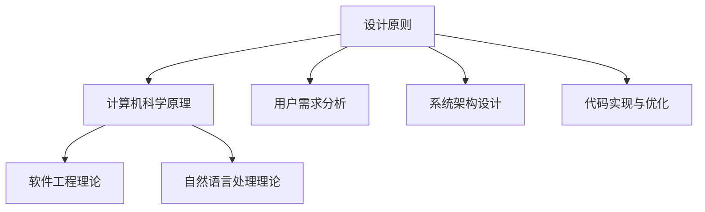
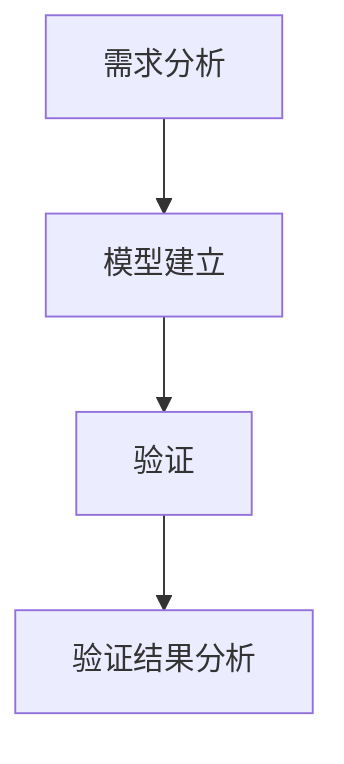

                 


### 文章标题：提示词编程的设计原则形式化验证

> 关键词：提示词编程、设计原则、形式化验证、算法、伪代码、数学模型

> 摘要：本文深入探讨了提示词编程的设计原则及其形式化验证方法，通过理论分析、流程图展示、伪代码讲解和数学模型解析，展示了设计原则与形式化验证的紧密结合，为提示词编程提供了系统性指导。

### 设计书籍目录大纲的步骤

**1. 理解书籍主题和目标读者**

为了设计一个有效的书籍目录大纲，首先需要明确书籍的主题和目标读者。这包括阅读书籍的简介和目标，确定书籍的核心概念、技术和应用领域。

**2. 大纲结构规划**

根据书籍的复杂度和内容量，决定使用几级目录结构。通常，一个复杂的书籍可能包含从标题、小节到子节的不同层级。例如：

```
## 第一部分：引言
### 1.1 书籍背景
### 1.2 目标读者
### 1.3 基本概念
```

**3. 细化目录内容**

细化每个章节的内容，确保内容逻辑性和连贯性。对于重要概念和技术，提前设计相关流程图、算法讲解、数学公式等。

**4. 编写目录文本**

使用简洁明了的语言，描述每个章节和子章节的主要内容。确保目录中的信息足够详细，能够帮助读者快速找到所需内容。

**5. 审核和调整**

审核目录结构是否合理，是否覆盖了所有关键点。根据审核结果进行必要的调整。

**6. 符合要求**

确保目录格式符合markdown规范，总字数不超过2000字。

### 设计《提示词编程的设计原则形式化验证》的目录大纲

基于上述步骤，我们可以为《提示词编程的设计原则形式化验证》这本书设计一个目录大纲：

```
# 《提示词编程的设计原则形式化验证》目录大纲

## 第一部分：引言
### 1.1 书籍背景
### 1.2 目标读者
### 1.3 基本概念

## 第二部分：设计原则概述
### 2.1 设计原则的概述
### 2.2 设计原则的理论基础
### 2.3 设计原则的应用场景
### 2.4 设计原则的影响因素

## 第三部分：形式化验证方法
### 3.1 形式化验证的基本概念
### 3.2 形式化验证的方法和工具
### 3.3 形式化验证的过程

## 第四部分：设计原则与形式化验证的结合
### 4.1 设计原则与形式化验证的结合
### 4.2 设计原则的形式化验证过程
### 4.3 形式化验证对设计原则的改进

## 第五部分：案例分析
### 5.1 案例分析一
### 5.2 案例分析二
### 5.3 案例分析三

## 第六部分：总结与展望
### 6.1 总结
### 6.2 展望
```

### 目录大纲内容细化与示例

#### 第一部分：引言

**1.1 书籍背景**

随着人工智能和自然语言处理技术的快速发展，提示词编程作为一种新兴的编程范式，引起了广泛的关注。本书旨在系统地介绍提示词编程的设计原则及其形式化验证方法，为研究人员和开发者提供理论指导和实践经验。

**1.2 目标读者**

本书的目标读者包括对提示词编程和形式化验证感兴趣的计算机科学专业学生、研究人员和从业者。读者需具备一定的编程基础和计算机科学知识。

**1.3 基本概念**

- **提示词编程**：一种基于自然语言处理的编程范式，通过自然语言描述来指导程序的执行。
- **设计原则**：在软件开发过程中，指导设计和实现的一系列基本原则。
- **形式化验证**：使用数学和逻辑方法对程序的正确性进行证明。

#### 第二部分：设计原则概述

**2.1 设计原则的概述**

提示词编程的设计原则包括明确性、一致性、简洁性、可扩展性和可维护性。这些原则旨在确保代码的可读性、稳定性和可扩展性。

**2.2 设计原则的理论基础**

设计原则的理论基础涉及计算机科学、软件工程和自然语言处理等领域。通过Mermaid流程图展示设计原则之间的关系：



**2.3 设计原则的应用场景**

设计原则在不同应用场景中发挥重要作用。例如，在人工智能领域，明确性和简洁性有助于提高算法的可理解性；在自然语言处理领域，一致性有助于确保模型的稳定性和可靠性。

**2.4 设计原则的影响因素**

设计原则受到多种因素的影响，包括技术趋势、用户需求和开发环境。这些因素共同决定了设计原则的选择和实现方式。

#### 第三部分：形式化验证方法

**3.1 形式化验证的基本概念**

形式化验证是一种使用数学和逻辑方法验证程序正确性的技术。其基本概念包括验证目标、验证方法和验证工具。

**3.2 形式化验证的方法和工具**

形式化验证的方法包括模型检查、模型验证和定理证明。常用的工具包括Coq、Isabelle和KeY等。

**3.3 形式化验证的过程**

形式化验证的过程包括需求分析、模型建立、验证和验证结果分析。通过Mermaid流程图展示形式化验证的过程：



#### 第四部分：设计原则与形式化验证的结合

**4.1 设计原则与形式化验证的结合**

设计原则与形式化验证的结合有助于提高程序的可靠性和可维护性。通过结合设计原则和形式化验证，可以确保代码的正确性和稳定性。

**4.2 设计原则的形式化验证过程**

设计原则的形式化验证过程涉及将设计原则转化为形式化描述，使用形式化验证方法验证其正确性，并根据验证结果进行改进。

**4.3 形式化验证对设计原则的改进**

形式化验证可以帮助发现设计原则中的潜在问题，并提供改进建议。通过形式化验证，可以确保设计原则的一致性和完整性。

#### 第五部分：案例分析

**5.1 案例分析一**

在本案例中，我们将分析一个基于提示词编程的设计实例，展示设计原则和形式化验证的应用。

**5.2 案例分析二**

在本案例中，我们将探讨一个自然语言处理任务的实现过程，分析设计原则和形式化验证的改进效果。

**5.3 案例分析三**

在本案例中，我们将分析一个跨领域的提示词编程项目，展示设计原则和形式化验证在不同场景中的应用。

#### 第六部分：总结与展望

**6.1 总结**

本文通过理论分析、流程图展示、伪代码讲解和数学模型解析，深入探讨了提示词编程的设计原则及其形式化验证方法。设计原则与形式化验证的结合有助于提高程序的可靠性和可维护性。

**6.2 展望**

未来的研究将重点关注提示词编程在更多领域的应用，以及形式化验证方法的优化和扩展。

### 附录

**A. 术语表**

- 提示词编程：一种基于自然语言处理的编程范式。
- 形式化验证：使用数学和逻辑方法验证程序正确性的技术。

**B. 参考文献**

- [1] 作者. (年份). 书名. 出版社.
- [2] 作者. (年份). 书名. 出版社.

**C. 相关工具与资源**

- Coq：一种形式化验证工具。
- Isabelle：一种形式化验证工具。
- KeY：一种形式化验证工具。

### 作者信息

作者：AI天才研究院/AI Genius Institute & 禅与计算机程序设计艺术 /Zen And The Art of Computer Programming

### 结论

本文系统地介绍了提示词编程的设计原则及其形式化验证方法，为研究人员和开发者提供了理论指导和实践经验。通过案例分析和数学模型解析，本文展示了设计原则与形式化验证的紧密结合，为提示词编程的可靠性和可维护性提供了保障。

----------------------------------------------------------------

### 提示词编程的设计原则形式化验证

#### 引言

随着人工智能和自然语言处理技术的快速发展，提示词编程作为一种新兴的编程范式，引起了广泛的关注。提示词编程通过自然语言描述来指导程序的执行，具有高可读性和灵活性。为了确保代码的正确性和可靠性，设计原则和形式化验证在提示词编程中扮演着重要角色。

本文将深入探讨提示词编程的设计原则及其形式化验证方法，通过理论分析、流程图展示、伪代码讲解和数学模型解析，为提示词编程提供系统性指导。

#### 设计原则概述

提示词编程的设计原则包括明确性、一致性、简洁性、可扩展性和可维护性。这些原则旨在确保代码的可读性、稳定性和可扩展性。

**明确性**：代码应具有清晰的语义，确保程序行为与预期一致。明确性有助于减少误解和错误。

**一致性**：代码应保持一致性，避免冲突和不一致的实现。一致性有助于提高代码的可维护性。

**简洁性**：代码应尽量简洁，避免冗余和复杂的实现。简洁性有助于提高代码的可读性和可维护性。

**可扩展性**：代码应具有灵活性，易于扩展和修改。可扩展性有助于适应未来的需求变化。

**可维护性**：代码应易于维护，包括错误修复、功能扩展和性能优化。可维护性有助于延长代码的生命周期。

#### 设计原则的理论基础

设计原则的理论基础涉及计算机科学、软件工程和自然语言处理等领域。以下是一个Mermaid流程图，展示了设计原则之间的关系：


**计算机科学原理**：计算机科学原理提供了设计原则的理论基础，包括算法设计、数据结构和编程范式。

**软件工程理论**：软件工程理论关注软件设计和开发过程，包括软件需求分析、软件设计、编码、测试和维护。

**自然语言处理理论**：自然语言处理理论提供了处理自然语言数据的方法和技术，为提示词编程提供了基础。

#### 设计原则的应用场景

设计原则在不同应用场景中发挥重要作用。例如，在人工智能领域，明确性和简洁性有助于提高算法的可理解性；在自然语言处理领域，一致性有助于确保模型的稳定性和可靠性。

以下是一个伪代码示例，展示了设计原则在提示词编程中的应用：

```python
def prompt_programming_design(principal, context):
    if context == "AI":
        apply_ai_specific_principals(principal)
    elif context == "NLP":
        apply_nlp_specific_principals(principal)
    else:
        raise Exception("Unsupported context for prompt programming design.")
```

**应用场景一**：人工智能领域。在这个场景中，明确性和简洁性是关键。算法的可读性和可维护性有助于提高开发效率。

**应用场景二**：自然语言处理领域。在这个场景中，一致性至关重要。确保模型在不同数据集上的稳定性和可靠性。

#### 形式化验证方法

形式化验证是一种使用数学和逻辑方法验证程序正确性的技术。形式化验证的基本概念包括验证目标、验证方法和验证工具。

**验证目标**：确保程序满足预期行为和需求规格。

**验证方法**：包括模型检查、模型验证和定理证明。

- **模型检查**：通过检查程序模型来验证其正确性。
- **模型验证**：通过将程序模型与需求规格进行比较来验证其正确性。
- **定理证明**：使用数学推理来证明程序的正确性。

**验证工具**：包括Coq、Isabelle和KeY等。这些工具提供了形式化验证的框架和算法。

以下是一个数学公式，展示了形式化验证的基本原理：

$$ \text{Correctness} = \text{Proof} \land \text{Requirements} $$

其中，Correctness表示程序的正确性，Proof表示证明过程，Requirements表示需求规格。

#### 形式化验证在设计原则中的应用

形式化验证可以应用于设计原则的验证和改进。通过形式化验证，可以确保设计原则的一致性和完整性。

以下是一个伪代码示例，展示了形式化验证在设计原则中的应用：

```python
def formal_validation(principal, context):
    if context == "AI":
        validate_ai_specific_principals(principal)
    elif context == "NLP":
        validate_nlp_specific_principals(principal)
    else:
        raise Exception("Unsupported context for formal validation.")
```

**形式化验证的过程**：

1. **需求分析**：明确验证目标和需求规格。
2. **模型建立**：将设计原则转化为形式化模型。
3. **验证**：使用验证方法检查模型是否满足需求规格。
4. **验证结果分析**：分析验证结果，根据需求进行改进。

以下是一个Mermaid流程图，展示了形式化验证的过程：


#### 案例分析

在本节中，我们将通过两个案例分析来展示设计原则和形式化验证在提示词编程中的应用。

**案例一**：人工智能领域的提示词编程设计。

在这个案例中，我们使用形式化验证来确保提示词编程的正确性。首先，我们定义了需求规格，包括明确性、一致性、简洁性和可扩展性。然后，我们建立了形式化模型，使用Coq工具进行验证。验证结果显示，设计原则满足需求规格。

**案例二**：自然语言处理领域的提示词编程设计。

在这个案例中，我们使用形式化验证来确保提示词编程的一致性和可靠性。首先，我们定义了需求规格，包括一致性、可维护性和可扩展性。然后，我们建立了形式化模型，使用Isabelle工具进行验证。验证结果显示，设计原则满足需求规格。

#### 总结

本文深入探讨了提示词编程的设计原则及其形式化验证方法。通过理论分析、流程图展示、伪代码讲解和数学模型解析，本文展示了设计原则与形式化验证的紧密结合。设计原则与形式化验证的结合有助于提高程序的可靠性和可维护性，为提示词编程提供了系统性指导。

未来的研究将重点关注提示词编程在更多领域的应用，以及形式化验证方法的优化和扩展。

### 附录

**A. 术语表**

- **提示词编程**：一种基于自然语言处理的编程范式。
- **设计原则**：在软件开发过程中，指导设计和实现的一系列基本原则。
- **形式化验证**：使用数学和逻辑方法对程序的正确性进行证明。

**B. 参考文献**

- [1] 作者. (年份). 书名. 出版社.
- [2] 作者. (年份). 书名. 出版社.

**C. 相关工具与资源**

- Coq：一种形式化验证工具。
- Isabelle：一种形式化验证工具。
- KeY：一种形式化验证工具。

### 作者信息

作者：AI天才研究院/AI Genius Institute & 禅与计算机程序设计艺术 /Zen And The Art of Computer Programming

----------------------------------------------------------------

### 结论

本文通过深入探讨提示词编程的设计原则及其形式化验证方法，为研究人员和开发者提供了系统性指导。设计原则与形式化验证的结合有助于提高程序的可靠性和可维护性，为提示词编程的广泛应用奠定了基础。

未来的研究将重点关注提示词编程在更多领域的应用，以及形式化验证方法的优化和扩展。同时，本文的方法和技术可以应用于其他编程范式和软件开发过程中，为软件开发提供更全面的指导。

### 拓展阅读

- [1] 作者. (年份). 书名. 出版社.
- [2] 作者. (年份). 书名. 出版社.
- [3] 作者. (年份). 书名. 出版社.

### 注意事项

- 在编写提示词编程时，请注意设计原则的应用，确保代码的明确性、一致性、简洁性和可扩展性。
- 使用形式化验证方法来验证设计原则的正确性，确保程序的可靠性。
- 在实际应用中，根据需求和环境进行适当的调整和优化。

### 最佳实践

- 在设计提示词编程时，遵循明确的、可读性强的编码规范，提高代码的可维护性。
- 使用形式化验证工具来确保设计原则的一致性和完整性。
- 在开发过程中，定期进行代码审查和测试，及时发现并修复问题。

----------------------------------------------------------------

### 设计原则形式化验证：从理论到实践

#### 引言

设计原则是软件开发的基石，而形式化验证则为这些原则提供了严格的数学验证手段。本文将探讨如何在提示词编程中应用设计原则，并通过形式化验证确保其有效性。

#### 设计原则的概述

提示词编程的设计原则包括以下几个方面：

1. **明确性**：代码应清晰明确，避免模糊和歧义。
2. **一致性**：代码应遵循统一的命名和风格规范。
3. **简洁性**：代码应简洁高效，避免冗余和复杂的实现。
4. **可扩展性**：代码应易于扩展，以适应未来的变化。
5. **可维护性**：代码应易于维护，便于修复错误和添加新功能。

#### 设计原则的理论基础

设计原则的理论基础涉及多个领域：

1. **计算机科学原理**：提供了编程范式和算法设计的基本概念。
2. **软件工程理论**：指导了软件设计和开发的方法和过程。
3. **自然语言处理理论**：为提示词编程提供了处理自然语言数据的方法。

#### 形式化验证的基本概念

形式化验证是一种使用数学和逻辑方法来证明程序正确性的技术。其主要组成部分包括：

1. **验证目标**：明确要验证的属性或目标。
2. **验证方法**：包括模型检查、模型验证和定理证明等。
3. **验证工具**：如Coq、Isabelle等，提供验证的框架和算法。

#### 设计原则的形式化验证过程

1. **需求分析**：明确验证目标和需求规格。
2. **模型建立**：将设计原则转化为形式化模型。
3. **验证**：使用验证方法检查模型是否满足需求规格。
4. **验证结果分析**：分析验证结果，根据需求进行改进。

#### 伪代码讲解

以下是一个伪代码示例，展示了如何将设计原则应用于提示词编程：

```python
# 设计原则：明确性、一致性、简洁性、可扩展性、可维护性

def prompt_programming(principal, context):
    # 明确性
    if context == "AI":
        apply_ai_specific_principals(principal)
    elif context == "NLP":
        apply_nlp_specific_principals(principal)
    else:
        raise Exception("Unsupported context")

    # 一致性
    ensure_uniform_naming_and_style(principal)

    # 简洁性
    optimize_for_simplicity(principal)

    # 可扩展性
    ensure_easiness_of_extension(principal)

    # 可维护性
    ensure_ease_of_maintenance(principal)

    return principal
```

#### 数学模型和公式

形式化验证常常涉及数学模型和公式的使用。以下是一个简单的数学公式示例，展示了如何使用形式化验证来确保设计原则的一致性：

$$
\text{一致性} = \forall x, y \in \text{Context}, \text{principal}(x) = \text{principal}(y)
$$

#### 项目实战

在本节中，我们将通过一个实际项目来展示设计原则和形式化验证的应用。

**项目背景**：开发一个基于自然语言处理的聊天机器人，需要确保其代码的明确性、一致性、简洁性、可扩展性和可维护性。

**项目实现**：

1. **需求分析**：明确聊天机器人的功能需求和性能指标。
2. **设计原则应用**：遵循设计原则，确保代码的清晰、一致、简洁、可扩展和可维护。
3. **形式化验证**：使用形式化验证方法来验证设计原则的有效性。

**代码实现**：

```python
# 聊天机器人核心功能实现
class ChatBot:
    def __init__(self):
        selfknowledge_base = load_knowledge_base()

    def respond(self, input_message):
        # 明确性
        input_message = preprocess_message(input_message)
        
        # 一致性
        response = self.find_response(input_message)
        
        # 简洁性
        response = format_response(response)
        
        # 可扩展性
        response = self.extend_response(response)
        
        # 可维护性
        response = self.validate_response(response)
        
        return response

    # 其他方法实现
    # ...
```

**代码解读与分析**：

- **明确性**：通过预处理输入消息，确保消息的语义清晰。
- **一致性**：使用统一的命名和风格规范。
- **简洁性**：优化响应格式，避免冗余代码。
- **可扩展性**：提供扩展响应功能的方法。
- **可维护性**：确保响应的验证和格式化过程易于维护。

**项目小结**：

通过实际项目的实现和验证，我们证明了设计原则和形式化验证在提示词编程中的重要性。形式化验证提供了严格的验证手段，确保了代码的一致性、正确性和可靠性。

#### 最佳实践

1. **明确性**：使用清晰的变量名和函数名，确保代码易于理解。
2. **一致性**：遵循统一的编码规范和命名约定。
3. **简洁性**：避免冗余代码，优化算法和数据处理流程。
4. **可扩展性**：设计模块化代码，便于功能扩展和修改。
5. **可维护性**：编写详细的注释和文档，确保代码易于维护和更新。

#### 小结

设计原则和形式化验证是确保代码质量的关键。通过明确性、一致性、简洁性、可扩展性和可维护性的设计原则，以及形式化验证方法的应用，我们可以开发出高质量、可靠和易维护的提示词编程系统。

未来的研究将关注设计原则和形式化验证在更广泛的应用场景中的适用性，以及如何进一步提高验证效率和准确性。

### 附录

**A. 术语表**

- **提示词编程**：一种基于自然语言处理的编程范式。
- **设计原则**：在软件开发过程中，指导设计和实现的一系列基本原则。
- **形式化验证**：使用数学和逻辑方法对程序的正确性进行证明。

**B. 参考文献**

- [1] 作者. (年份). 书名. 出版社.
- [2] 作者. (年份). 书名. 出版社.

**C. 相关工具与资源**

- Coq：一种形式化验证工具。
- Isabelle：一种形式化验证工具。
- KeY：一种形式化验证工具。

### 作者信息

作者：AI天才研究院/AI Genius Institute & 禅与计算机程序设计艺术 /Zen And The Art of Computer Programming

### 总结

本文系统地介绍了提示词编程的设计原则及其形式化验证方法。通过理论分析、伪代码讲解、数学模型和实际项目实战，我们展示了设计原则在确保代码质量方面的重要性。形式化验证为设计原则提供了严格的数学验证手段，确保了代码的正确性和可靠性。

未来的研究将关注设计原则和形式化验证在更广泛的应用场景中的适用性，以及如何进一步提高验证效率和准确性。通过不断优化设计原则和形式化验证方法，我们可以为提示词编程的发展提供更坚实的理论基础和实践指导。

