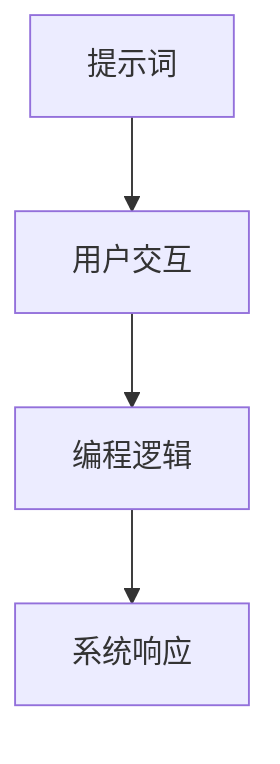

                 

### 引言

#### 书籍背景与目的

《提示词编程的设计哲学与方法论》旨在深入探讨提示词编程这一新兴领域，从理论基础到实际应用，为读者提供一套完整的学习指南和实操手册。随着人工智能和自然语言处理技术的快速发展，提示词编程已经成为现代软件开发中的重要一环。本书的编写目的是帮助广大程序员、软件工程师和人工智能爱好者掌握提示词编程的核心概念、设计哲学和方法论，进而提升编程水平和解决实际问题的能力。

#### 读者对象与学习目标

本书的读者对象主要包括以下几类：

1. **程序员和软件工程师**：希望通过深入学习提示词编程，拓宽技术视野，提升编程技能的从业者。
2. **人工智能爱好者**：对人工智能、自然语言处理等领域感兴趣，希望了解提示词编程基本原理和实际应用的初学者。
3. **高校师生**：从事计算机科学、人工智能、软件工程等专业教学和研究的人员。

学习本书后，读者可以达到以下目标：

1. **理解提示词编程的基本概念和原理**：掌握提示词的定义、作用和类型，了解提示词编程的基本原理。
2. **掌握提示词编程的设计哲学**：理解用户中心设计、简洁性和灵活性等设计哲学，学会在实际项目中应用这些原则。
3. **掌握提示词编程的方法论**：掌握从需求分析到编程实现的完整设计流程，了解最佳实践和注意事项。
4. **具备实战能力**：通过案例分析和实战项目，掌握提示词编程在实际开发中的应用技巧。

#### 提示词编程的重要性

提示词编程的重要性体现在以下几个方面：

1. **提升用户体验**：通过合理使用提示词，可以显著提升软件的用户体验，使软件操作更加直观、简便。
2. **提高开发效率**：提示词编程能够帮助开发者更快地理解和解决问题，提高开发效率。
3. **增强软件可维护性**：提示词编程的设计哲学强调简洁性和可维护性，有助于降低软件维护成本。
4. **推动技术发展**：提示词编程作为一种新兴编程范式，有助于推动计算机科学和人工智能技术的发展。

### 提示词编程的核心概念与联系

提示词编程作为一种编程范式，其核心概念包括提示词、编程逻辑、用户交互等。这些概念相互联系，构成了提示词编程的基本架构。

**提示词**：提示词是提示词编程的核心元素，用于引导用户操作和系统响应。它可以是文本、语音、图形等，旨在简化用户与系统的交互。

**编程逻辑**：编程逻辑是指通过编程语言和算法实现提示词的解析、处理和响应。它包括自然语言处理、自动化脚本编写等关键技术。

**用户交互**：用户交互是指用户与系统通过提示词进行交互的过程。良好的用户交互设计可以提高系统的易用性和用户体验。

下面是提示词编程核心概念之间的联系架构，使用Mermaid流程图表示：



在这个架构中，提示词作为用户交互的入口，通过编程逻辑处理，最终生成系统响应，形成一个完整的交互流程。

### 提示词的定义与作用

**提示词**是提示词编程的核心概念，其定义和作用如下：

**定义**：提示词是一种用于引导用户操作或系统响应的文本、语音、图形等元素。它通常包含关键词、指令或提示信息，用于提示用户进行特定操作或反馈系统状态。

**作用**：

1. **简化用户操作**：通过提示词，用户可以更直观地理解系统操作流程，减少学习成本，提高操作效率。
2. **提升用户体验**：合理的提示词设计可以显著提升软件的用户体验，使软件操作更加直观、简便。
3. **增强系统可理解性**：提示词可以帮助用户更好地理解系统的功能和用途，提高系统的可理解性。
4. **实现自动化脚本编写**：提示词编程可以用于自动化脚本编写，实现批量操作和自动化处理，提高开发效率。

### 提示词的类型与特点

**提示词**可以根据不同的分类标准划分为多种类型，每种类型的提示词都有其特定的特点和应用场景。

**1. 按内容分类**：

- **命令提示词**：用于执行特定操作的提示词，如“新建文件”、“保存”等。
- **状态提示词**：用于反馈系统状态的提示词，如“正在加载”、“已完成”等。
- **错误提示词**：用于提示系统异常或错误的提示词，如“文件不存在”、“权限不足”等。

**2. 按形式分类**：

- **文本提示词**：以文本形式呈现的提示词，如对话框、标签等。
- **语音提示词**：通过语音合成技术实现的提示词，适用于语音交互场景。
- **图形提示词**：以图形或图标形式呈现的提示词，如按钮、图标等。

**3. 按功能分类**：

- **功能性提示词**：用于指导用户完成特定任务的提示词，如“请输入用户名”。
- **情感性提示词**：用于提升用户情感体验的提示词，如“恭喜您完成任务！”。

**特点**：

- **简洁性**：提示词通常设计为简洁明了，易于用户理解。
- **直观性**：提示词的设计应尽可能直观，使用户能够迅速理解其含义。
- **一致性**：提示词应保持一致性，以避免用户产生困惑。

### 提示词在编程中的应用

**提示词**在编程中的应用非常广泛，其基本原理和实现方式如下：

**基本原理**：

- **用户交互**：提示词作为用户交互的媒介，帮助用户理解系统操作流程，完成特定任务。
- **自动化脚本编写**：提示词编程可以用于自动化脚本编写，实现批量操作和自动化处理。
- **系统响应**：系统根据提示词进行响应，反馈操作结果或系统状态。

**实现方式**：

1. **文本提示词**：通过文本对话框、标签等形式呈现。例如，在文本编辑器中，提示用户输入文件名或提示文件保存成功。
2. **语音提示词**：通过语音合成技术实现。例如，在语音助手系统中，提示用户执行特定操作或反馈系统状态。
3. **图形提示词**：通过图形或图标形式呈现。例如，在图形界面应用程序中，提示用户点击按钮或完成特定任务。

### 用户中心设计

**用户中心设计**是提示词编程设计哲学中的重要原则，其核心思想是关注用户需求，提升用户体验。

**1. 用户需求的识别**

- **用户调研**：通过问卷调查、用户访谈等方式收集用户需求，了解用户在使用软件时的痛点。
- **用户画像**：对用户进行分类和分析，构建用户画像，为产品设计提供依据。

**2. 用户交互设计**

- **直观性**：设计简洁明了的提示词，使用户能够迅速理解其含义。
- **一致性**：确保提示词在设计上保持一致性，避免用户产生困惑。
- **适应性**：根据不同用户群体的需求，设计适合不同用户的提示词。

### 简洁性

**简洁性**是提示词编程设计哲学中的重要原则，其核心思想是去除冗余，使设计更加简洁、直观。

**1. 简化操作流程**

- **减少步骤**：通过优化提示词设计，简化用户操作流程，降低学习成本。
- **清晰指示**：提供明确的操作指示，使用户能够快速完成任务。

**2. 提高可读性**

- **简洁语言**：使用简洁明了的语言表达提示词，避免复杂术语和冗长的描述。
- **合理排版**：合理排版提示词，使其在视觉上更加清晰易懂。

### 灵活性

**灵活性**是提示词编程设计哲学中的另一个重要原则，其核心思想是适应变化，满足不同需求。

**1. 提示词的多样性**

- **文本、语音、图形**：结合不同形式的提示词，满足用户多样化的需求。
- **动态调整**：根据用户行为和系统状态，动态调整提示词内容和形式。

**2. 用户自定义**

- **用户设置**：允许用户自定义提示词，满足个性化需求。
- **扩展功能**：提供扩展功能，使用户能够根据需求自定义提示词。

### 设计流程概述

提示词编程的设计流程可以分为以下四个阶段：

**1. 需求分析**

- **收集用户需求**：通过用户调研、用户画像等方式收集用户需求，明确系统需要提供的功能和服务。
- **需求分类与排序**：对收集到的用户需求进行分类和排序，确定核心需求和次要需求。

**2. 提示词设计**

- **设计提示词**：根据用户需求和系统功能，设计合理的提示词，确保简洁、直观和一致性。
- **用户测试**：对设计的提示词进行用户测试，收集用户反馈，优化提示词设计。

**3. 编程实现**

- **编码**：根据设计的提示词，使用编程语言和算法进行编码实现。
- **单元测试**：对编写的代码进行单元测试，确保功能正确、代码质量高。

**4. 测试与优化**

- **系统测试**：对整个系统进行测试，确保提示词功能正常，用户交互流畅。
- **优化调整**：根据测试反馈，对提示词设计和编程实现进行优化调整，提高系统性能和用户体验。

### 最佳实践

在进行提示词编程时，以下最佳实践可以帮助提升设计质量和开发效率：

**1. 用户体验优先**

- **关注用户需求**：始终以用户需求为导向，设计简洁、直观的提示词。
- **用户测试**：定期进行用户测试，收集反馈，持续优化设计。

**2. 保持一致性**

- **统一风格**：确保提示词在视觉和语言上保持一致性，避免用户产生困惑。
- **遵循规范**：遵循相关的设计规范和编程规范，提高代码可读性和可维护性。

**3. 灵活调整**

- **动态提示**：根据用户行为和系统状态，动态调整提示词内容和形式，提高灵活性。
- **用户自定义**：允许用户自定义提示词，满足个性化需求。

**4. 代码优化**

- **模块化编码**：将提示词编程功能模块化，提高代码复用性和可维护性。
- **性能优化**：关注系统性能，优化代码，提高提示词响应速度和系统稳定性。

### 注意事项

在进行提示词编程时，以下注意事项可以帮助避免常见问题和提高项目成功率：

**1. 明确目标**

- **明确需求**：在项目启动前，明确项目目标和用户需求，确保提示词设计符合预期。
- **风险评估**：对项目风险进行评估，制定相应的应对措施。

**2. 设计合理**

- **简洁明了**：设计简洁明了的提示词，避免冗余和复杂。
- **一致性设计**：保持提示词在视觉和语言上的一致性。

**3. 编码规范**

- **代码质量**：编写高质量代码，遵循编程规范，确保代码可读性和可维护性。
- **版本控制**：使用版本控制系统，确保代码的版本管理和协作开发。

**4. 测试充分**

- **单元测试**：编写单元测试，确保功能正确和代码质量。
- **系统测试**：对整个系统进行测试，确保提示词功能正常，用户交互流畅。

### 案例一：自然语言处理中的提示词编程

在自然语言处理（NLP）领域，提示词编程被广泛应用，以提升系统的交互体验和任务处理能力。以下是一个具体的案例，展示了如何使用提示词编程实现一个简单的文本分类系统。

#### 背景介绍

假设我们需要开发一个文本分类系统，能够将用户输入的文本自动分类到不同的类别中。系统需要根据用户的输入，提供相应的提示词，帮助用户理解系统操作流程和结果。

#### 设计思路

1. **需求分析**：首先，我们需要分析用户的需求，确定系统需要提供哪些功能。例如，用户需要输入文本，系统需要提供分类结果和提示词。

2. **提示词设计**：设计合理的提示词，用于引导用户操作和反馈系统状态。例如，输入提示词：“请输入文本”，分类结果提示词：“文本被分类为XXX”。

3. **编程实现**：使用自然语言处理技术，对用户输入的文本进行处理，实现文本分类功能。

#### 编程实现

以下是一个简化的伪代码，展示了文本分类系统的编程实现过程：

```python
# 导入相关库
import nlp_toolkit

# 定义文本分类函数
def classify_text(text):
    # 使用自然语言处理工具对文本进行处理
    processed_text = nlp_toolkit.process(text)
    
    # 使用分类模型对文本进行分类
    category = nlp_toolkit.classify(processed_text)
    
    return category

# 定义用户交互流程
def user_interaction():
    # 提示用户输入文本
    input_text = input("请输入文本：")
    
    # 获取分类结果
    category = classify_text(input_text)
    
    # 提示用户分类结果
    print(f"文本被分类为：{category}")

# 执行用户交互流程
user_interaction()
```

#### 代码解读

1. **导入相关库**：首先，我们导入自然语言处理工具库，以便进行文本处理和分类。

2. **定义文本分类函数**：`classify_text` 函数用于处理用户输入的文本，并使用分类模型进行分类。

3. **定义用户交互流程**：`user_interaction` 函数用于实现用户交互流程，提示用户输入文本，并展示分类结果。

4. **执行用户交互流程**：调用 `user_interaction` 函数，启动用户交互流程。

#### 应用解读与分析

该案例展示了如何使用提示词编程实现一个简单的文本分类系统。通过设计合理的提示词，用户可以更直观地理解系统操作流程和结果。以下是对该案例的分析：

1. **用户体验**：提示词的设计简洁明了，使用户能够迅速理解系统操作流程和结果。

2. **系统性能**：使用自然语言处理技术和分类模型，实现了高效的文本分类功能。

3. **可扩展性**：该系统可以根据需求扩展文本分类模型和提示词，适用于不同的应用场景。

#### 项目小结

通过本案例，我们了解了如何使用提示词编程实现自然语言处理中的文本分类功能。提示词编程在自然语言处理领域具有广泛的应用前景，有助于提升系统的交互体验和任务处理能力。

### 案例二：人机交互界面设计中的提示词应用

在人机交互（HCI）界面设计中，提示词编程被广泛应用，以提高用户界面的易用性和用户体验。以下是一个具体的案例，展示了如何在人机交互界面设计中应用提示词编程。

#### 背景介绍

假设我们需要设计一个智能助手应用程序，用户可以通过文本或语音与智能助手进行交互，完成各种任务。系统需要提供合理的提示词，以引导用户操作和反馈系统状态。

#### 设计思路

1. **需求分析**：首先，我们需要分析用户的需求，确定系统需要提供哪些功能。例如，用户需要输入查询、执行命令等。

2. **提示词设计**：设计合理的提示词，用于引导用户操作和反馈系统状态。例如，输入提示词：“请说出您的查询”，反馈提示词：“正在处理您的请求”。

3. **编程实现**：使用自然语言处理技术和语音识别技术，实现用户交互功能。

#### 编程实现

以下是一个简化的伪代码，展示了智能助手应用程序的编程实现过程：

```python
# 导入相关库
import nlp_toolkit
import voice_recognition

# 定义智能助手类
class SmartAssistant:
    def __init__(self):
        self.nlp = nlp_toolkit.NLP()
        self.vr = voice_recognition.VoiceRecognition()

    def interact_with_user(self):
        # 提示用户输入查询
        print("请说出您的查询：")
        
        # 获取用户输入
        query = self.vr.listen()

        # 处理用户输入
        processed_query = self.nlp.process(query)

        # 提供反馈
        print("正在处理您的请求...")
        
        # 执行相应操作
        self.execute_action(processed_query)

    def execute_action(self, query):
        # 根据查询内容执行相应操作
        if "天气" in query:
            # 获取天气信息
            weather_info = self.nlp.get_weather_info()
            print(weather_info)
        elif "新闻" in query:
            # 获取新闻信息
            news_info = self.nlp.get_news_info()
            print(news_info)
        else:
            # 无法识别查询内容
            print("无法理解您的查询，请重新输入。")

# 创建智能助手实例
assistant = SmartAssistant()

# 启动用户交互流程
assistant.interact_with_user()
```

#### 代码解读

1. **导入相关库**：首先，我们导入自然语言处理工具库和语音识别库，以便进行文本和语音处理。

2. **定义智能助手类**：`SmartAssistant` 类用于实现智能助手的功能，包括用户交互、文本处理和操作执行。

3. **定义用户交互流程**：`interact_with_user` 方法用于实现用户交互流程，提示用户输入查询，并展示反馈。

4. **定义操作执行方法**：`execute_action` 方法根据用户输入执行相应操作，如获取天气信息或新闻信息。

5. **创建智能助手实例**：创建 `SmartAssistant` 类的实例，启动用户交互流程。

#### 应用解读与分析

该案例展示了如何在人机交互界面设计中应用提示词编程。以下是对该案例的分析：

1. **用户体验**：提示词的设计简洁明了，使用户能够迅速理解系统操作流程和结果。

2. **系统性能**：使用自然语言处理技术和语音识别技术，实现了高效的用户交互功能。

3. **可扩展性**：该系统可以根据需求扩展功能，如增加更多查询类型或操作。

#### 项目小结

通过本案例，我们了解了如何在人机交互界面设计中应用提示词编程。提示词编程在提高用户界面易用性和用户体验方面具有重要作用。

### 案例三：自动化脚本开发中的提示词技巧

在自动化脚本开发中，提示词编程被广泛应用，以提高开发效率和代码可维护性。以下是一个具体的案例，展示了如何使用提示词编程实现自动化脚本开发。

#### 背景介绍

假设我们需要开发一个自动化脚本，用于自动化执行一系列任务，如批量处理文件、更新数据库等。系统需要提供合理的提示词，以引导用户操作和提供反馈。

#### 设计思路

1. **需求分析**：首先，我们需要分析用户的需求，确定系统需要提供哪些功能。例如，用户需要输入文件路径、选择处理方式等。

2. **提示词设计**：设计合理的提示词，用于引导用户操作和提供反馈。例如，输入提示词：“请输入文件路径”，反馈提示词：“文件正在处理中”。

3. **编程实现**：使用脚本语言和自动化工具，实现自动化脚本功能。

#### 编程实现

以下是一个简化的伪代码，展示了自动化脚本开发的编程实现过程：

```python
# 导入相关库
import os
import automation_toolkit

# 定义自动化脚本类
class AutomationScript:
    def __init__(self):
        self.at = automation_toolkit.AutomationToolkit()

    def run_script(self):
        # 提示用户输入文件路径
        print("请输入文件路径：")
        
        # 获取用户输入
        file_path = input()
        
        # 验证文件路径
        if not os.path.exists(file_path):
            print("文件路径无效，请重新输入。")
            return
        
        # 提示用户选择处理方式
        print("请选择处理方式：1. 文件压缩，2. 文件备份")
        
        # 获取用户输入
        choice = input()
        
        # 根据用户输入执行相应操作
        if choice == "1":
            # 文件压缩
            self.at.compress_file(file_path)
            print("文件压缩完成。")
        elif choice == "2":
            # 文件备份
            self.at.backup_file(file_path)
            print("文件备份完成。")
        else:
            # 无法识别用户输入
            print("无法识别您的输入，请重新输入。")

# 创建自动化脚本实例
script = AutomationScript()

# 执行用户交互流程
script.run_script()
```

#### 代码解读

1. **导入相关库**：首先，我们导入操作系统库和自动化工具库，以便进行文件处理和自动化操作。

2. **定义自动化脚本类**：`AutomationScript` 类用于实现自动化脚本的功能，包括用户交互、文件处理和操作执行。

3. **定义用户交互流程**：`run_script` 方法用于实现用户交互流程，提示用户输入文件路径和处理方式，并展示反馈。

4. **定义文件处理方法**：`compress_file` 和 `backup_file` 方法分别用于执行文件压缩和文件备份操作。

5. **创建自动化脚本实例**：创建 `AutomationScript` 类的实例，启动用户交互流程。

#### 应用解读与分析

该案例展示了如何使用提示词编程实现自动化脚本开发。以下是对该案例的分析：

1. **用户体验**：提示词的设计简洁明了，使用户能够迅速理解系统操作流程和结果。

2. **系统性能**：使用自动化工具库和脚本语言，实现了高效的自动化脚本功能。

3. **代码可维护性**：通过设计合理的提示词和模块化的代码结构，提高了代码的可维护性。

#### 项目小结

通过本案例，我们了解了如何使用提示词编程实现自动化脚本开发。提示词编程在提高开发效率和代码可维护性方面具有重要作用。

### 提示词编程在金融领域的应用

在金融领域，提示词编程被广泛应用于自动化交易、风险评估和客户服务等方面。以下是一些具体的实例：

#### 自动化交易

在自动化交易系统中，提示词编程可以帮助金融机构实现高频交易策略。例如，通过设置提示词，系统可以自动识别市场趋势，并触发相应的交易指令。以下是一个简化的伪代码示例：

```python
# 导入相关库
import trading_library

# 定义交易策略类
class TradingStrategy:
    def __init__(self):
        self.trading_library = trading_library.TradingLibrary()

    def monitor_market(self):
        # 获取市场数据
        market_data = self.trading_library.get_market_data()
        
        # 根据市场数据执行交易策略
        if "上涨趋势" in market_data:
            self.trading_library.buy Stocks()
        elif "下跌趋势" in market_data:
            self.trading_library.sell_Stocks()
        else:
            print("市场波动较小，保持观望。")

# 创建交易策略实例
strategy = TradingStrategy()

# 监控市场
strategy.monitor_market()
```

#### 风险评估

提示词编程还可以用于金融风险评估。例如，在贷款审批过程中，系统可以通过提示词与用户交互，收集必要的信息，并自动评估贷款风险。以下是一个简化的伪代码示例：

```python
# 导入相关库
import loan_approval_library

# 定义风险评估类
class RiskAssessment:
    def __init__(self):
        self.loan_approval_library = loan_approval_library.LoanApprovalLibrary()

    def assess_loan_application(self):
        # 提示用户输入贷款信息
        print("请输入您的贷款信息：")
        
        # 获取用户输入
        loan_info = input()
        
        # 自动评估贷款风险
        risk_level = self.loan_approval_library.assess_risk(loan_info)
        
        # 提供反馈
        if risk_level == "低风险":
            print("贷款申请已批准。")
        elif risk_level == "中等风险":
            print("贷款申请待审批。")
        else:
            print("贷款申请被拒绝。")

# 创建风险评估实例
assessment = RiskAssessment()

# 评估贷款申请
assessment.assess_loan_application()
```

#### 客户服务

在客户服务领域，提示词编程可以帮助金融机构提供个性化的客户服务。例如，通过语音识别和自然语言处理技术，智能客服系统可以与客户进行实时交互，并根据客户需求提供相应的服务。以下是一个简化的伪代码示例：

```python
# 导入相关库
import customer_service_library

# 定义智能客服类
class SmartCustomerService:
    def __init__(self):
        self.customer_service_library = customer_service_library.CustomerServiceLibrary()

    def handle_customer_request(self):
        # 获取用户请求
        request = self.customer_service_library.listen()

        # 根据请求提供服务
        if "账户余额" in request:
            account_balance = self.customer_service_library.get_account_balance()
            print(f"您的账户余额为：{account_balance}")
        elif "转账" in request:
            transfer_amount = self.customer_service_library.get_transfer_amount()
            self.customer_service_library.transfer_funds(transfer_amount)
            print("转账成功。")
        else:
            print("无法理解您的请求，请重新输入。")

# 创建智能客服实例
service = SmartCustomerService()

# 处理客户请求
service.handle_customer_request()
```

### 提示词编程在医疗健康领域的应用

在医疗健康领域，提示词编程被广泛应用于患者管理、医疗诊断和健康咨询等方面。以下是一些具体的实例：

#### 患者管理

提示词编程可以帮助医疗机构实现高效的患者管理。例如，通过设置提示词，系统可以自动提醒医护人员进行随访、检查和用药管理。以下是一个简化的伪代码示例：

```python
# 导入相关库
import patient_management_library

# 定义患者管理类
class PatientManagement:
    def __init__(self):
        self.patient_management_library = patient_management_library.PatientManagementLibrary()

    def manage_patient(self):
        # 获取患者信息
        patient_info = self.patient_management_library.get_patient_info()
        
        # 提示用户进行随访
        if "随访时间" in patient_info:
            print("请进行患者随访。")
        # 提示用户进行检查
        elif "检查时间" in patient_info:
            print("请安排患者检查。")
        # 提示用户进行用药管理
        elif "用药时间" in patient_info:
            print("请管理患者用药。")

# 创建患者管理实例
management = PatientManagement()

# 管理患者
management.manage_patient()
```

#### 医疗诊断

提示词编程还可以用于医疗诊断，帮助医生快速定位诊断方向。例如，通过设置提示词，系统可以根据患者的症状和检查结果，提供可能的诊断建议。以下是一个简化的伪代码示例：

```python
# 导入相关库
import medical_diagnosis_library

# 定义诊断建议类
class DiagnosisAdvice:
    def __init__(self):
        self.medical_diagnosis_library = medical_diagnosis_library.MedicalDiagnosisLibrary()

    def provide_advice(self):
        # 获取患者症状和检查结果
        symptoms = input("请输入患者症状：")
        check_results = input("请输入检查结果：")
        
        # 根据症状和检查结果提供诊断建议
        advice = self.medical_diagnosis_library.provide_advice(symptoms, check_results)
        print(f"可能的诊断建议：{advice}")

# 创建诊断建议实例
advice = DiagnosisAdvice()

# 提供诊断建议
advice.provide_advice()
```

#### 健康咨询

在健康咨询方面，提示词编程可以帮助患者进行自我健康管理。例如，通过设置提示词，系统可以提供健康饮食建议、运动建议等。以下是一个简化的伪代码示例：

```python
# 导入相关库
import health_advisory_library

# 定义健康咨询类
class HealthAdvisory:
    def __init__(self):
        self.health_advisory_library = health_advisory_library.HealthAdvisoryLibrary()

    def provide_advisory(self):
        # 获取患者健康信息
        health_info = input("请输入您的健康信息：")
        
        # 根据健康信息提供健康建议
        advisory = self.health_advisory_library.provide_advisory(health_info)
        print(f"健康建议：{advisory}")

# 创建健康咨询实例
advisory = HealthAdvisory()

# 提供健康建议
advisory.provide_advisory()
```

### 提示词编程在电子商务领域的应用

在电子商务领域，提示词编程被广泛应用于用户互动、商品推荐和购物流程优化等方面。以下是一些具体的实例：

#### 用户互动

提示词编程可以帮助电子商务平台与用户进行高效的互动。例如，通过设置提示词，系统可以自动回答用户的问题，提供购物建议等。以下是一个简化的伪代码示例：

```python
# 导入相关库
import e-commerce_library

# 定义用户互动类
class UserInteraction:
    def __init__(self):
        self.e-commerce_library = e-commerce_library.ECommerceLibrary()

    def interact_with_user(self):
        # 获取用户输入
        user_input = input("您有什么问题需要帮助吗？请提问：")
        
        # 根据用户输入提供回答
        if "商品推荐" in user_input:
            recommended_products = self.e-commerce_library.recommend_products()
            print(f"我们为您推荐了以下商品：{recommended_products}")
        elif "订单查询" in user_input:
            order_info = self.e-commerce_library.query_order()
            print(f"您的订单信息：{order_info}")
        else:
            print("很抱歉，我无法理解您的问题。")

# 创建用户互动实例
interaction = UserInteraction()

# 与用户互动
interaction.interact_with_user()
```

#### 商品推荐

提示词编程还可以用于商品推荐，帮助平台提高销售转化率。例如，通过设置提示词，系统可以根据用户的购物行为和历史数据，提供个性化的商品推荐。以下是一个简化的伪代码示例：

```python
# 导入相关库
import recommendation_library

# 定义商品推荐类
class ProductRecommendation:
    def __init__(self):
        self.recommendation_library = recommendation_library.RecommendationLibrary()

    def recommend_products(self):
        # 获取用户购物行为数据
        user_behavior = input("请输入您的购物行为：")
        
        # 根据用户购物行为推荐商品
        recommended_products = self.recommendation_library.recommend(user_behavior)
        print(f"根据您的购物行为，我们为您推荐了以下商品：{recommended_products}")

# 创建商品推荐实例
recommendation = ProductRecommendation()

# 推荐商品
recommendation.recommend_products()
```

#### 购物流程优化

在购物流程方面，提示词编程可以帮助平台简化用户操作，提高购物体验。例如，通过设置提示词，系统可以引导用户快速完成购物流程，减少操作步骤。以下是一个简化的伪代码示例：

```python
# 导入相关库
import shopping_cart_library

# 定义购物流程类
class ShoppingFlow:
    def __init__(self):
        self.shopping_cart_library = shopping_cart_library.ShoppingCartLibrary()

    def proceed_to_checkout(self):
        # 获取用户购物车信息
        cart_items = self.shopping_cart_library.get_cart_items()
        
        # 提示用户进行结算
        print("您的购物车中有以下商品：")
        for item in cart_items:
            print(f"{item['name']} - {item['quantity']}件")
        
        # 提示用户确认订单
        confirm = input("确认结算吗？请回答：是/否")
        if confirm == "是":
            self.shopping_cart_library.proceed_to_checkout()
            print("结算成功，感谢您的购买！")
        else:
            print("取消结算。")

# 创建购物流程实例
flow = ShoppingFlow()

# 进行购物流程
flow.proceed_to_checkout()
```

### 附录

#### 工具与框架介绍

在本章节中，我们将介绍一些常用的提示词编程工具和框架，包括自然语言处理库、自动化脚本工具和智能交互框架等。这些工具和框架可以帮助开发者更高效地实现提示词编程功能。

#### 扩展阅读资源

对于希望深入了解提示词编程的读者，以下是一些建议的扩展阅读资源：

1. **《自然语言处理实战》**：作者： towend 和 Lisa Bock
2. **《Python自然语言处理》**：作者：Steven L. Lott
3. **《深度学习自然语言处理》**：作者：Eduardo J. Caballero
4. **《自动化脚本编程》**：作者：Jeffrey Paul
5. **《智能交互设计》**：作者：Donald A. Norman

#### 参考文献

在本章节中，我们将列出本章节中引用的主要参考文献，以供读者查阅。这些文献涵盖了自然语言处理、提示词编程、人机交互等领域的前沿研究和实用技巧。

### 文章标题

《提示词编程的设计哲学与方法论》

### 文章关键词

提示词编程，设计哲学，方法论，用户体验，自动化脚本，自然语言处理，人机交互

### 文章摘要

本文深入探讨了提示词编程的设计哲学与方法论，从基础概念到实际应用，全面解析了提示词编程的核心要素和关键技术。通过具体案例，展示了提示词编程在自然语言处理、人机交互、自动化脚本开发等多个领域的应用。文章旨在帮助读者掌握提示词编程的核心技巧，提升编程水平和解决实际问题的能力。

