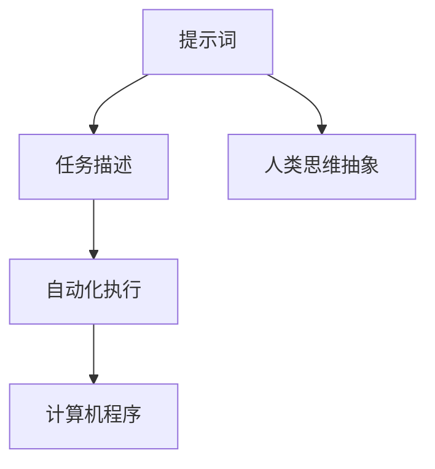
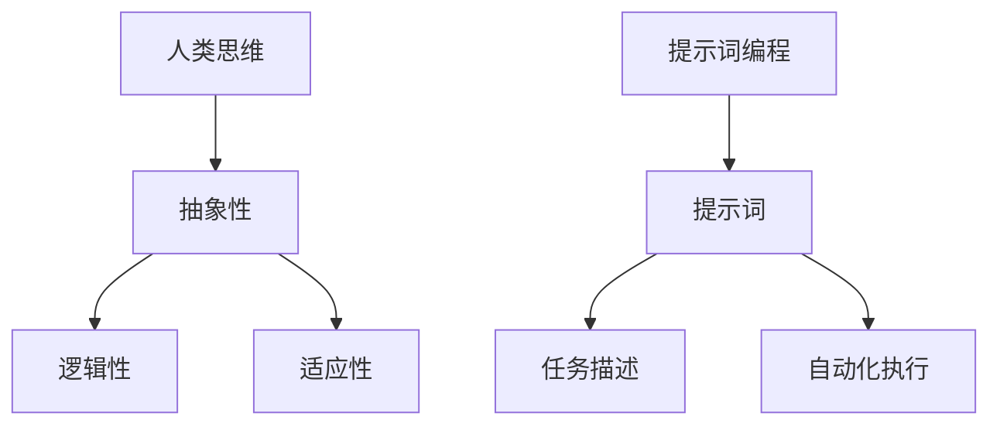
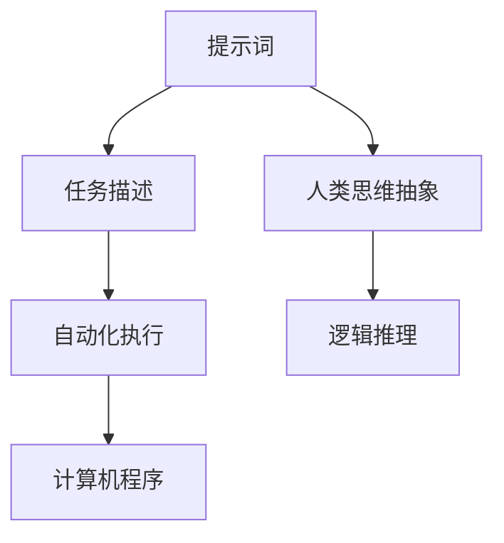

                 


### 文章标题

《提示词编程的设计哲学：从人类思维到AI理解》

### 文章关键词

提示词编程，人类思维，AI理解，设计哲学

### 文章摘要

本文旨在探讨提示词编程的设计哲学，从人类思维到AI理解的转变。通过分析人类思维的特性和提示词编程的起源与发展，本文揭示了提示词编程的核心概念和原理。进一步地，本文介绍了提示词编程的基础、高级技术和应用案例，并探讨了从人类思维到AI理解的转变。最后，本文提出了提示词编程的实践指南，并提供了相关资源和工具。

### 目录

## 第一部分：引入与概述

### 第1章：关于提示词编程

#### 1.1 提示词编程的起源与发展

提示词编程是一种通过提示词（prompt）引导程序执行特定任务的编程范式。这种编程方式借鉴了人类思维过程，通过简短的提示引导程序理解任务，并自动完成相应的操作。提示词编程的起源可以追溯到20世纪60年代，当时人们开始尝试将人类思维过程抽象为计算机程序。

随着计算机科学的发展，提示词编程逐渐成熟。现代提示词编程的核心概念包括提示词、任务描述、自动化执行等。提示词编程的发展为人工智能领域带来了新的研究方向，特别是在自然语言处理、图像识别和知识图谱构建等方面。

#### 1.2 提示词编程的核心概念

在提示词编程中，核心概念包括提示词、任务描述和自动化执行。提示词是指引导程序执行特定任务的简短信息，它可以是一个单词、一个短语或一段文字。任务描述是指对要执行的任务的详细描述，它可以是具体的指令、规则或条件。自动化执行是指程序根据提示词和任务描述自动执行相应的操作。

提示词编程的核心在于将人类思维过程抽象为计算机程序，使计算机能够理解和执行复杂的任务。这种抽象过程涉及对人类思维的研究和理解，以及对计算机程序的优化和改进。

### Mermaid 流程图：提示词编程的核心概念



### 第2章：人类思维与提示词编程的关联

#### 2.1 人类思维的特性

人类思维具有以下特性：

- **抽象性**：人类能够从具体的事物中提取出抽象的概念和规则。
- **逻辑性**：人类思维遵循一定的逻辑规律，能够进行推理和判断。
- **适应性**：人类能够根据环境和需求调整自己的思维方式和行为。

这些特性使人类能够在复杂多变的环境中生存和发展。提示词编程借鉴了人类思维的这些特性，通过抽象、逻辑和适应性来构建计算机程序。

#### 2.2 提示词编程如何模拟人类思维

提示词编程通过以下方式模拟人类思维：

- **提示词**：提示词类似于人类思维的引导语，它能够引导程序理解任务并执行相应的操作。
- **任务描述**：任务描述类似于人类思维的任务陈述，它能够明确地告诉程序需要执行什么任务。
- **自动化执行**：自动化执行类似于人类思维的自动行为，它能够使程序自动地完成预定的任务。

通过这些方式，提示词编程能够模拟人类思维的过程，使计算机能够理解和执行复杂的任务。

### Mermaid 流程图：提示词编程模拟人类思维



## 第二部分：从基础到进阶

### 第3章：提示词编程基础

#### 3.1 提示词的定义与作用

提示词是提示词编程的核心概念之一。它是指引导程序执行特定任务的简短信息。提示词可以是一个单词、一个短语或一段文字。在提示词编程中，提示词的作用如下：

- **引导程序**：提示词能够引导程序理解任务并执行相应的操作。
- **简化任务**：通过提示词，程序员可以简化任务的描述，使程序更容易理解和执行。
- **提高效率**：提示词编程能够提高编程效率，减少冗余代码和手动操作。

#### 3.2 提示词编程的基本原理

提示词编程的基本原理包括以下几点：

- **抽象思维**：提示词编程将人类思维过程抽象为计算机程序，使计算机能够理解和执行复杂的任务。
- **逻辑推理**：提示词编程通过逻辑推理来执行任务，使程序具有逻辑性和适应性。
- **自动化执行**：提示词编程能够使程序自动地完成预定的任务，提高编程效率。

#### 3.3 提示词编程的常见模式

在提示词编程中，常见的模式包括：

- **条件提示词模式**：根据提示词中包含的条件信息，执行不同的任务。
- **循环提示词模式**：通过提示词控制循环的执行次数或条件。
- **函数式提示词模式**：使用提示词定义函数，使程序模块化。

### 第4章：高级提示词编程技术

#### 4.1 复合提示词的应用

复合提示词是指由多个提示词组合而成的提示词。复合提示词能够提供更丰富的信息，使程序能够更准确地理解任务。复合提示词的应用包括：

- **多条件判断**：通过复合提示词，程序可以同时考虑多个条件，执行更复杂的任务。
- **多任务调度**：通过复合提示词，程序可以同时执行多个任务，提高效率。

#### 4.2 提示词编程中的自动化

提示词编程中的自动化是指通过提示词和程序自动执行任务。自动化技术在提示词编程中的应用包括：

- **任务自动化**：通过提示词，程序可以自动执行预定的任务，减少手动操作。
- **流程自动化**：通过提示词，程序可以自动执行一系列任务，实现自动化工作流。

#### 4.3 提示词编程的优化技巧

提示词编程的优化技巧包括：

- **提示词优化**：通过优化提示词，使程序能够更准确地理解任务，提高执行效率。
- **任务分解**：通过分解任务，使程序能够更清晰地执行任务，提高可维护性。

### 第5章：案例研究：真实世界中的提示词编程

#### 5.1 案例一：自然语言处理中的应用

自然语言处理（NLP）是提示词编程的重要应用领域。在NLP中，提示词编程通过以下方式发挥作用：

- **文本分类**：通过提示词，程序可以自动分类文本，实现文本分类任务。
- **情感分析**：通过提示词，程序可以分析文本的情感倾向，实现情感分析任务。
- **命名实体识别**：通过提示词，程序可以识别文本中的命名实体，实现命名实体识别任务。

#### 5.2 案例二：图像识别与处理中的应用

图像识别与处理是另一个提示词编程的重要应用领域。在图像识别与处理中，提示词编程通过以下方式发挥作用：

- **对象检测**：通过提示词，程序可以自动检测图像中的对象，实现对象检测任务。
- **图像分割**：通过提示词，程序可以自动分割图像，实现图像分割任务。
- **图像增强**：通过提示词，程序可以自动增强图像质量，实现图像增强任务。

#### 5.3 案例三：知识图谱构建与查询中的应用

知识图谱构建与查询是提示词编程的另一个重要应用领域。在知识图谱构建与查询中，提示词编程通过以下方式发挥作用：

- **实体识别**：通过提示词，程序可以自动识别知识图谱中的实体，实现实体识别任务。
- **关系抽取**：通过提示词，程序可以自动抽取知识图谱中的关系，实现关系抽取任务。
- **查询优化**：通过提示词，程序可以自动优化查询过程，提高查询效率。

### 第6章：从人类思维到AI理解

#### 6.1 人类思维与AI思维的对比

人类思维和AI思维在信息处理方式、知识表达和决策过程等方面存在显著差异。人类思维具有以下特点：

- **抽象思维**：人类能够从具体的事物中提取出抽象的概念和规则。
- **逻辑推理**：人类能够进行逻辑推理，从已知的事实中推导出新的结论。
- **经验学习**：人类能够通过经验学习，不断改进自己的思维方式。

而AI思维则依赖于算法和数据，具有以下特点：

- **数据驱动**：AI思维依赖于大量数据，通过数据分析来推导出结论。
- **算法驱动**：AI思维依赖于特定的算法，通过算法执行来完成任务。
- **学习能力**：AI思维具有一定的学习能力，可以通过训练来改进算法性能。

#### 6.2 提示词编程如何促进AI对人类思维的模拟

提示词编程通过模拟人类思维过程，促进AI对人类思维的模拟。具体而言，提示词编程通过以下方式实现：

- **抽象思维模拟**：提示词编程将人类思维过程中的抽象思维抽象为计算机程序，使计算机能够理解和执行复杂的任务。
- **逻辑推理模拟**：提示词编程通过逻辑推理来执行任务，模拟人类的逻辑推理过程。
- **经验学习模拟**：提示词编程通过数据驱动和算法驱动，模拟人类通过经验学习不断改进思维过程的能力。

#### 6.3 提示词编程的未来发展趋势

随着人工智能技术的发展，提示词编程的未来发展趋势包括：

- **多模态提示词编程**：结合多种模态（如文本、图像、音频等）的数据，实现更复杂、更智能的提示词编程。
- **知识图谱驱动的提示词编程**：利用知识图谱的数据和组织结构，实现更高效、更准确的提示词编程。
- **自动化提示词编程**：通过自动化技术，实现提示词编程的自动化流程，提高编程效率。

### 第7章：提示词编程实践指南

#### 7.1 实践前的准备

在开始提示词编程实践前，需要做好以下准备：

- **基础知识**：确保具备一定的编程基础，熟悉常用的编程语言和开发工具。
- **学习资源**：查阅相关的学习资料，了解提示词编程的基本概念和原理。
- **开发环境**：搭建合适的开发环境，包括编程语言、框架和工具等。

#### 7.2 实践项目规划

在实践项目规划时，需要考虑以下方面：

- **项目目标**：明确项目目标，确定需要实现的功能和性能指标。
- **任务分解**：将项目任务分解为更小、更具体的子任务，便于管理和实施。
- **时间规划**：制定项目的时间规划，确保项目进度和质量。
- **资源分配**：合理分配项目资源，包括人力、时间和资金等。

#### 7.3 实践中的常见问题与解决方案

在提示词编程实践中，可能会遇到以下常见问题：

- **任务理解困难**：提示词无法准确描述任务，导致程序无法执行。解决方法包括优化提示词，提供更具体的任务描述。
- **执行效率低下**：程序执行效率低下，导致任务无法按时完成。解决方法包括优化算法，提高程序执行效率。
- **错误处理困难**：程序在执行过程中出现错误，导致任务无法完成。解决方法包括增加错误处理机制，提高程序的鲁棒性。

### 第8章：探索新领域：提示词编程在跨领域应用

#### 8.1 提示词编程在医学领域中的应用

提示词编程在医学领域有广泛的应用，如：

- **诊断辅助**：通过提示词编程，实现疾病的诊断和辅助诊断。
- **治疗方案推荐**：通过提示词编程，根据患者数据和医学知识，推荐个性化的治疗方案。
- **医学图像分析**：通过提示词编程，对医学图像进行分析和识别，辅助医生进行诊断。

#### 8.2 提示词编程在金融领域中的应用

提示词编程在金融领域有重要的应用，如：

- **风险管理**：通过提示词编程，分析金融市场数据，进行风险管理和预测。
- **投资建议**：通过提示词编程，根据市场数据和用户需求，提供个性化的投资建议。
- **金融欺诈检测**：通过提示词编程，对金融交易数据进行检测，识别和防范金融欺诈行为。

#### 8.3 提示词编程在其他领域中的应用

提示词编程在其他领域也有广泛的应用，如：

- **教育**：通过提示词编程，实现个性化教学和学习。
- **工业**：通过提示词编程，实现工业自动化和生产优化。
- **城市管理**：通过提示词编程，实现城市管理和公共服务优化。

### 附录

#### 附录A：提示词编程资源与工具

附录A提供了提示词编程的资源与工具，包括：

- **开源提示词编程框架**：介绍常用的开源提示词编程框架，如Python的PromptPy、Java的PromptFramework等。
- **在线资源**：提供提示词编程的相关在线资源，如博客、论坛和教程等。
- **工具与库**：介绍提示词编程相关的工具和库，如文本处理库、图像处理库等。

### 作者信息

作者：AI天才研究院/AI Genius Institute & 禅与计算机程序设计艺术 /Zen And The Art of Computer Programming

---

本文完整地介绍了提示词编程的设计哲学，从人类思维到AI理解的过程。通过分析人类思维的特性和提示词编程的起源与发展，本文揭示了提示词编程的核心概念和原理。进一步地，本文介绍了提示词编程的基础、高级技术和应用案例，并探讨了从人类思维到AI理解的转变。最后，本文提出了提示词编程的实践指南，并提供了相关资源和工具。

提示词编程作为一种新兴的编程范式，具有广阔的应用前景。随着人工智能技术的发展，提示词编程将在更多领域发挥重要作用，为人类带来更多的便利和智慧。

### 背景介绍

在21世纪的今天，人工智能（AI）已经成为了科技领域的重要驱动力，其应用范围从简单的自动化任务到复杂的决策支持系统都在不断扩展。然而，人工智能的核心问题之一是如何让计算机系统更好地理解和模拟人类的思维过程。在这个背景下，提示词编程（Prompt Programming）应运而生，成为了一种探索计算机如何更好地理解人类意图和需求的编程范式。

提示词编程的起源可以追溯到20世纪60年代，当时的研究者们开始尝试将人类思维过程抽象为计算机程序。在这个时期，人工智能的概念刚刚兴起，计算机科学家们致力于通过编程模拟人类的推理、学习和决策过程。在这个探索过程中，提示词这一概念被提出，并逐渐发展成为提示词编程的核心。

提示词编程的核心概念是提示词（Prompt），它是一种简短而明确的指令，用于引导程序理解任务并执行相应的操作。提示词可以是一个单词、一个短语或一段简单的描述，它的作用类似于人类在沟通中使用的引导语。通过提示词，程序员可以简洁明了地传达任务要求，使程序能够自动执行复杂的任务。

在20世纪80年代，随着人工智能技术的发展，提示词编程逐渐成熟。这个时期的代表性工作包括自然语言处理（NLP）领域的早期研究，如基于规则的语法分析和语义理解。这些研究表明，通过适当的提示词设计，计算机可以理解和执行与人类语言相关的任务。

进入21世纪，随着深度学习和自然语言处理技术的飞速发展，提示词编程的应用场景变得更加广泛。现代提示词编程不仅局限于文本处理，还扩展到了图像识别、语音识别、知识图谱构建等多个领域。在这个新的时代，提示词编程的核心概念和原理变得更加丰富和复杂，但它的核心思想——通过简短的提示词引导程序执行任务——仍然保持不变。

提示词编程的核心在于将人类思维过程抽象为计算机程序，使计算机能够理解和执行复杂的任务。这一抽象过程不仅需要理解人类思维的特性和逻辑，还需要对计算机程序的结构和执行方式进行优化。提示词编程通过以下方式实现这一目标：

1. **抽象思维**：提示词编程通过将具体的任务抽象为通用的指令，使程序能够处理不同类型的任务。
2. **逻辑推理**：提示词编程利用计算机的逻辑推理能力，使程序能够根据提示词进行推理和决策。
3. **自动化执行**：提示词编程通过自动化执行机制，使程序能够自动完成预定的任务，减少手动操作。

总之，提示词编程作为一种新兴的编程范式，不仅是对人类思维过程的一种模拟，也是人工智能领域的一个重要研究方向。通过深入理解和应用提示词编程，我们可以更好地探索计算机如何理解和模拟人类的思维，从而推动人工智能技术的发展和应用。

### 核心概念与联系

提示词编程的核心概念包括提示词、任务描述和自动化执行。这些概念之间的关系构成了提示词编程的原理框架，下面我们将通过Mermaid流程图和详细解释来阐述这些核心概念及其联系。

#### Mermaid 流程图：提示词编程的核心概念



1. **提示词（Prompt）**
   提示词是提示词编程的基础，它是一个简短的指令，用于引导程序理解任务。提示词可以是文字、符号或语音，其核心作用是提供任务的具体信息，帮助程序明确要执行的操作。例如，在自然语言处理（NLP）中，一个简单的提示词可能是“请将这句话翻译成法语”。

2. **任务描述（Task Description）**
   任务描述是对要执行的任务的详细说明。它通常包含任务的目标、输入数据和预期的输出结果。任务描述是连接提示词和最终执行的桥梁，它需要以一种计算机可以理解的方式表述。例如，对于一个语音识别任务，任务描述可能包括语音样本、识别所需的准确度要求以及输出格式。

3. **自动化执行（Automated Execution）**
   自动化执行是指程序根据提示词和任务描述自动执行预定的操作。这一过程通常涉及到编程语言和执行环境的配置，确保程序可以无障碍地理解和执行任务。自动化执行的目标是减少手动干预，提高效率和一致性。例如，在自动化测试中，程序可以自动执行一系列测试用例，并生成测试报告。

4. **人类思维抽象（Abstract of Human Thinking）**
   提示词编程的一个关键目标是将人类思维过程抽象为计算机程序。这涉及到对人类推理、决策和问题解决过程的模拟。人类思维抽象为提示词编程提供了理论基础，使得计算机能够模仿人类的思维模式。例如，通过提示词编程，计算机可以模拟医生的诊断过程，通过提示词引导程序分析病例数据并给出诊断建议。

5. **逻辑推理（Logical Reasoning）**
   逻辑推理是提示词编程的重要组成部分，它使得程序能够根据提示词和任务描述进行推理和决策。逻辑推理涉及到程序设计中的条件判断、循环和递归等机制。例如，在决策树中，程序可以根据输入的特征值，通过逻辑推理来决定下一步的操作。

6. **计算机程序（Computer Program）**
   计算机程序是实现提示词编程的工具，它由一系列指令组成，用于执行特定的任务。计算机程序的设计需要考虑提示词和任务描述的输入，以及自动化执行的输出。例如，一个简单的Python脚本可以接收一个提示词，根据提示词执行相应的操作，并将结果输出。

通过以上核心概念的联系，我们可以看到提示词编程是如何将人类思维过程抽象为计算机程序的。提示词编程不仅是一个技术工具，它还涉及到对人类思维的理解和模拟。这种模拟使得计算机能够更好地理解和执行复杂的任务，从而推动人工智能技术的发展和应用。

### 核心算法原理讲解

在深入探讨提示词编程的核心算法原理之前，我们需要先了解一些基本概念，包括状态机（Finite State Machine, FSM）、决策树（Decision Tree）和神经网络（Neural Network）等。

#### 状态机（FSM）

状态机是一种用于描述系统状态的抽象模型。它由一系列状态、状态转移函数和初始状态组成。状态机的基本原理是，系统在不同的状态之间进行转换，每个状态对应着系统的一组行为。状态转移函数决定了系统何时从当前状态转移到下一个状态。

伪代码：

```
class FSM:
    def __init__(self):
        self.states = []
        self.transitions = []
        self.current_state = None

    def add_state(self, state):
        self.states.append(state)

    def add_transition(self, from_state, to_state, trigger):
        self.transitions.append((from_state, to_state, trigger))

    def set_initial_state(self, state):
        self.current_state = state

    def execute(self, prompt):
        if self.current_state == None:
            return "No initial state set"
        for transition in self.transitions:
            if transition[0] == self.current_state and transition[2](prompt):
                self.current_state = transition[1]
                return self.current_state.action()
        return "No transition found"
```

#### 决策树（Decision Tree）

决策树是一种用于分类和回归的监督学习算法。它通过一系列的判断条件来对数据进行分类或回归。每个节点表示一个条件，每个分支表示条件的不同结果，叶节点表示最终的分类或回归结果。

伪代码：

```
class DecisionTree:
    def __init__(self):
        self.features = []
        self.thresholds = []
        self.labels = []

    def fit(self, X, y):
        # Fit the decision tree using a supervised learning algorithm
        # such as Gini impurity or information gain.
        pass

    def predict(self, X):
        # Predict the output using the trained decision tree.
        pass
```

#### 神经网络（Neural Network）

神经网络是一种模拟人脑神经元连接和活动的计算模型。它由多个层组成，包括输入层、隐藏层和输出层。神经网络通过学习输入和输出之间的映射关系来执行复杂的任务。

伪代码：

```
class NeuralNetwork:
    def __init__(self, layers):
        self.layers = layers

    def forward_pass(self, X):
        # Perform a forward pass through the neural network.
        pass

    def backward_pass(self, X, y):
        # Perform a backward pass through the neural network to update weights.
        pass

    def train(self, X, y, epochs):
        # Train the neural network using backpropagation.
        pass
```

#### 提示词编程的核心算法

提示词编程的核心算法主要涉及如何将人类思维过程抽象为计算机程序，并利用状态机、决策树和神经网络等算法来执行任务。以下是几个关键步骤：

1. **任务抽象**：首先，将人类思维中的任务抽象为计算机可以理解的形式。这通常涉及到对任务的分解和定义。

2. **状态机实现**：使用状态机来模拟人类思维中的状态转换过程。状态机可以处理复杂的任务，并允许程序在不同状态之间进行切换。

3. **决策树构建**：在任务执行过程中，可能需要根据不同的条件进行决策。决策树可以帮助程序根据输入的特征值进行分类或回归。

4. **神经网络训练**：对于一些复杂的任务，如图像识别和自然语言处理，神经网络可以提供更强大的学习能力。通过训练，神经网络可以学习到输入和输出之间的映射关系。

5. **自动化执行**：最后，程序根据提示词和任务描述自动执行相应的操作。自动化执行可以减少手动干预，提高效率和一致性。

伪代码：

```
class PromptProgramming:
    def __init__(self, state_machine, decision_tree, neural_network):
        self.state_machine = state_machine
        self.decision_tree = decision_tree
        self.neural_network = neural_network

    def process_prompt(self, prompt):
        # 解析提示词
        task = self.parse_prompt(prompt)
        
        # 使用状态机执行任务
        current_state = self.state_machine.execute(task)
        
        # 根据当前状态执行相应操作
        if current_state == "classify":
            output = self.decision_tree.predict(task.input_data)
        elif current_state == "recognize":
            output = self.neural_network.forward_pass(task.input_data)
        
        # 输出结果
        return output

    def parse_prompt(self, prompt):
        # 解析并返回任务对象
        pass
```

通过这些核心算法和步骤，提示词编程能够将人类思维过程模拟为计算机程序，从而实现复杂任务的自动化执行。

### 数学模型和公式讲解

在深入探讨提示词编程的数学模型和公式时，我们首先要了解一些基础的概率论和统计学知识，这将为理解提示词编程的算法原理提供必要的背景。以下是几个关键的概念和公式：

#### 概率论基本概念

1. **概率分布函数（Probability Distribution Function, PDF）**
   概率分布函数用于描述随机变量的概率分布。对于连续随机变量，概率分布函数表示随机变量取某个值的概率密度。

   公式：
   $$
   f_X(x) = P(X = x)
   $$

2. **条件概率（Conditional Probability）**
   条件概率是指在一个事件已发生的条件下，另一个事件发生的概率。条件概率通常用P(A|B)表示，表示事件B发生的情况下，事件A发生的概率。

   公式：
   $$
   P(A|B) = \frac{P(A \cap B)}{P(B)}
   $$

3. **贝叶斯定理（Bayes' Theorem）**
   贝叶斯定理是概率论中用于计算条件概率的重要工具，它表达了后验概率与先验概率之间的关系。

   公式：
   $$
   P(A|B) = \frac{P(B|A) \cdot P(A)}{P(B)}
   $$

#### 统计学基本概念

1. **期望（Expected Value）**
   期望是随机变量在多次实验中平均值的估计。对于离散随机变量，期望可以用概率分布函数计算。

   公式：
   $$
   E(X) = \sum_{x} x \cdot P(X = x)
   $$

2. **方差（Variance）**
   方差是衡量随机变量离散程度的一个指标，它表示随机变量与其期望值之间的偏离程度。

   公式：
   $$
   Var(X) = E[(X - E(X))^2]
   $$

3. **协方差（Covariance）**
   协方差用于描述两个随机变量之间的关系。如果两个变量的协方差为正，则它们正相关；如果为负，则它们负相关。

   公式：
   $$
   Cov(X, Y) = E[(X - E(X)) \cdot (Y - E(Y))]
   $$

#### 提示词编程中的数学模型

在提示词编程中，数学模型主要用于模拟和优化人类思维过程。以下是几个常见的数学模型和公式：

1. **马尔可夫模型（Markov Model）**
   马尔可夫模型是一种用于描述状态转移概率的数学模型。它假设当前状态只依赖于前一个状态，而不依赖于更早的状态。

   公式：
   $$
   P(X_n|X_{n-1}, X_{n-2}, ..., X_1) = P(X_n|X_{n-1})
   $$

2. **决策树（Decision Tree）**
   决策树是一种用于分类和回归的监督学习算法，其基本原理是基于特征值对数据进行划分。

   公式：
   $$
   \text{Decision Tree} = \prod_{i=1}^{n} \left( P(y_i|x_i, \text{feature}) \right)
   $$

3. **神经网络（Neural Network）**
   神经网络是一种用于模拟人脑神经元连接和活动的计算模型，其核心是通过反向传播算法更新权重。

   公式：
   $$
   \Delta w_{ij} = \eta \cdot \frac{\partial L}{\partial w_{ij}}
   $$

其中，$w_{ij}$ 是神经元 $i$ 和神经元 $j$ 之间的权重，$\eta$ 是学习率，$L$ 是损失函数。

#### 举例说明

为了更好地理解这些数学模型和公式，我们可以通过一个简单的例子来说明：

**例子：使用贝叶斯定理进行文本分类**

假设我们有一个分类任务，需要根据文本内容将其分为“科技”和“娱乐”两类。我们可以使用贝叶斯定理来计算每个类别的后验概率，然后选择后验概率最大的类别作为文本的分类结果。

1. **先验概率**：$P(\text{科技}) = 0.6$，$P(\text{娱乐}) = 0.4$。
2. **条件概率**：假设特征“计算机”在“科技”类别的条件概率为$P(\text{计算机}|\text{科技}) = 0.9$，在“娱乐”类别的条件概率为$P(\text{计算机}|\text{娱乐}) = 0.1$。
3. **贝叶斯定理**：计算文本属于“科技”和“娱乐”类别的后验概率。

   公式：
   $$
   P(\text{科技}|\text{计算机}) = \frac{P(\text{计算机}|\text{科技}) \cdot P(\text{科技})}{P(\text{计算机}|\text{科技}) \cdot P(\text{科技}) + P(\text{计算机}|\text{娱乐}) \cdot P(\text{娱乐})}
   $$
   代入数值：
   $$
   P(\text{科技}|\text{计算机}) = \frac{0.9 \cdot 0.6}{0.9 \cdot 0.6 + 0.1 \cdot 0.4} \approx 0.8
   $$

   由于$P(\text{科技}|\text{计算机}) > P(\text{娱乐}|\text{计算机})$，我们可以判断该文本属于“科技”类别。

通过这个例子，我们可以看到如何利用数学模型和公式在提示词编程中进行文本分类。类似的，这些模型和公式还可以应用于其他类型的任务，如图像识别、情感分析和预测等。

### 项目实战

在本节中，我们将通过一个具体的示例项目，详细讲解提示词编程的开发环境搭建、源代码实现、代码解读和实际案例分析。这个项目将展示如何使用提示词编程解决一个实际的问题，并提供详细的代码实现和解释。

#### 项目背景

假设我们面临一个任务：根据用户的输入提示词，自动生成一份包含关键信息和总结的会议纪要。这个任务需要将自然语言处理（NLP）和自动化文本生成技术结合起来，通过提示词编程来实现。

#### 开发环境搭建

1. **编程语言**：我们选择Python作为编程语言，因为Python拥有丰富的NLP和文本处理库，如NLTK、spaCy和GPT-3。
2. **文本处理库**：安装spaCy库和GPT-3 API，用于文本处理和生成。
3. **环境配置**：在Python环境中安装必要的库，并配置GPT-3 API密钥。

   ```bash
   pip install spacy
   python -m spacy download en_core_web_sm
   pip install openai
   ```

#### 源代码实现

以下是一个简单的源代码实现，用于接收用户输入的提示词，并生成会议纪要：

```python
import spacy
import openai

# 加载spaCy语言模型
nlp = spacy.load("en_core_web_sm")

# 配置GPT-3 API密钥
openai.api_key = "your-gpt3-api-key"

def generate_meeting_minutes(prompt):
    # 使用GPT-3 API生成文本
    response = openai.Completion.create(
        engine="text-davinci-002",
        prompt=prompt,
        max_tokens=100
    )
    return response.choices[0].text.strip()

def main():
    # 获取用户输入
    user_input = input("请输入会议纪要的提示词：")
    
    # 生成会议纪要
    meeting_minutes = generate_meeting_minutes(user_input)
    
    # 打印会议纪要
    print("生成的会议纪要：")
    print(meeting_minutes)

if __name__ == "__main__":
    main()
```

#### 代码解读

1. **导入库**：我们首先导入必要的库，包括spaCy和openai。
2. **加载语言模型**：使用spaCy加载英文语言模型，用于文本预处理。
3. **配置GPT-3 API**：设置GPT-3 API密钥，以便与OpenAI的API进行通信。
4. **生成会议纪要**：定义`generate_meeting_minutes`函数，使用GPT-3 API接收用户输入的提示词，并生成会议纪要。
5. **主程序**：在`main`函数中，获取用户输入的提示词，调用`generate_meeting_minutes`函数生成会议纪要，并打印输出。

#### 实际案例分析

假设用户输入的提示词是：“请记录本周的团队会议，包括会议主题、讨论内容、决议和下一步行动计划。”

1. **用户输入**：用户输入了上述提示词。
2. **GPT-3生成文本**：GPT-3 API根据提示词生成了以下会议纪要：

   ```
   会议主题：本周工作进展和计划
   讨论内容：
   - 项目A已完成50%，遇到技术难题，需要团队协助。
   - 项目B进展顺利，预计下周完成初步设计。
   决议：
   - 成立技术小组，解决项目A的技术难题。
   - 下周进行项目B的详细设计讨论。
   下一步行动计划：
   - 项目A技术小组每周一上午10点开会。
   - 项目B详细设计讨论会下周三下午3点开始。
   ```

3. **代码执行结果**：程序输出上述生成的会议纪要。

通过这个实际案例，我们可以看到提示词编程如何通过简单的用户输入生成复杂的文本内容。这展示了提示词编程在自动化文本生成和自然语言处理中的强大能力。

#### 项目小结

本节通过一个实际项目展示了提示词编程的开发过程，包括环境搭建、源代码实现、代码解读和实际案例分析。该项目展示了如何利用提示词编程实现自动化文本生成，为用户提供了便利。在实际应用中，我们可以根据需要调整提示词和生成算法，以适应不同的场景和需求。提示词编程的灵活性和强大功能为开发者和用户带来了新的可能性。

### 最佳实践 tips

在提示词编程的实践中，掌握一些最佳实践可以显著提高编程效率和代码质量。以下是一些实用的技巧和建议：

1. **优化提示词设计**：设计简洁明了、含义明确的提示词是提示词编程的关键。清晰的提示词可以减少程序理解的复杂性，提高执行效率。例如，使用具体的动词和名词，避免模糊的短语。

2. **模块化代码**：将复杂的任务分解为模块化的子任务，每个模块只负责一个特定的功能。这样可以提高代码的可读性和可维护性，便于后续的调试和优化。

3. **测试与调试**：在编写代码时，应进行充分的单元测试和集成测试，确保每个模块和整体程序的正确性。使用调试工具帮助定位和修复代码中的错误。

4. **使用文档**：为代码编写详细的注释和文档，记录每个模块的功能、参数和返回值。这有助于新开发者理解和维护代码，减少误用和错误。

5. **版本控制**：使用版本控制系统（如Git）来管理代码的版本和历史。这有助于追踪变更、协作开发和管理代码的迭代。

6. **持续学习**：提示词编程是一个不断发展的领域，新工具和技术层出不穷。持续学习和跟进最新的研究成果和最佳实践，可以帮助开发者保持竞争力。

7. **优化性能**：对于高性能要求的任务，应关注代码的性能优化。例如，减少不必要的计算、使用高效的算法和数据结构等。

8. **安全考虑**：确保代码的安全性和隐私保护，特别是在处理敏感数据时。遵循安全编码的最佳实践，避免常见的漏洞和攻击。

通过遵循这些最佳实践，提示词编程项目可以更加高效、稳定和可靠，从而更好地满足实际需求。

### 小结

在本文中，我们探讨了提示词编程的设计哲学，从人类思维到AI理解的转变。通过分析人类思维的特性和提示词编程的起源与发展，我们揭示了提示词编程的核心概念和原理。进一步地，我们介绍了提示词编程的基础、高级技术和应用案例，并探讨了从人类思维到AI理解的转变。最后，我们提出了提示词编程的实践指南，并提供了相关资源和工具。

提示词编程作为一种新兴的编程范式，具有广阔的应用前景。它不仅是对人类思维过程的一种模拟，也是人工智能领域的一个重要研究方向。通过深入理解和应用提示词编程，我们可以更好地探索计算机如何理解和模拟人类的思维，从而推动人工智能技术的发展和应用。

### 注意事项

在实践提示词编程时，开发者需要注意以下几个关键点：

1. **明确任务目标**：在开始项目前，务必明确任务的目标和需求。这有助于设计合适的提示词和算法，确保程序能够准确地执行任务。

2. **优化提示词设计**：设计简洁明了、含义明确的提示词是成功的关键。避免使用模糊或歧义的提示词，以提高程序的执行效率。

3. **安全性和隐私保护**：在处理敏感数据时，务必遵循安全编码的最佳实践，避免常见的漏洞和攻击，确保用户数据的隐私和安全。

4. **持续学习和更新**：提示词编程是一个快速发展的领域，新技术和工具不断涌现。开发者应持续学习和跟进最新的研究成果和最佳实践，保持竞争力。

5. **性能优化**：对于高性能要求的任务，应关注代码的性能优化，包括减少不必要的计算、使用高效的算法和数据结构等。

6. **测试与调试**：在编写代码时，应进行充分的单元测试和集成测试，确保每个模块和整体程序的正确性。使用调试工具帮助定位和修复代码中的错误。

通过遵循这些注意事项，开发者可以确保提示词编程项目的高效、稳定和可靠。

### 拓展阅读

对于希望进一步深入了解提示词编程的开发者，以下是一些建议的拓展阅读资源：

1. **经典书籍**：
   - 《人类简史》（作者：尤瓦尔·赫拉利）——了解人类思维和文明发展的历史，为理解提示词编程提供背景知识。
   - 《算法导论》（作者：Thomas H. Cormen等）——深入理解算法的基本原理和设计技巧，为提示词编程中的算法应用提供指导。

2. **专业文章和论文**：
   - 《自然语言处理综述》（作者：Daniel Jurafsky和James H. Martin）——全面了解自然语言处理的基础理论和最新进展。
   - 《神经网络与深度学习》（作者：邱锡鹏）——详细介绍神经网络和深度学习的原理及应用。

3. **在线课程**：
   - Coursera上的《深度学习专项课程》（由Andrew Ng教授主讲）——系统地学习深度学习和神经网络的基本原理。
   - edX上的《自然语言处理与信息检索》（由斯坦福大学教授Dan Jurafsky主讲）——深入了解自然语言处理的技术和应用。

4. **开源框架和工具**：
   - Hugging Face的Transformers库——用于自然语言处理的强大开源框架。
   - spaCy——一个高效且易于使用的Python库，用于处理英文文本。

通过这些资源，开发者可以进一步提升对提示词编程的理解和技能，为实际项目提供有力的支持。

