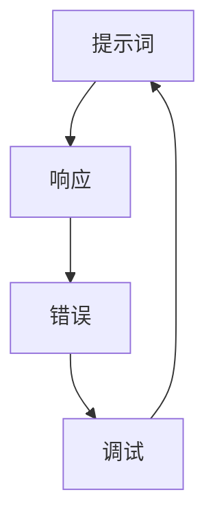
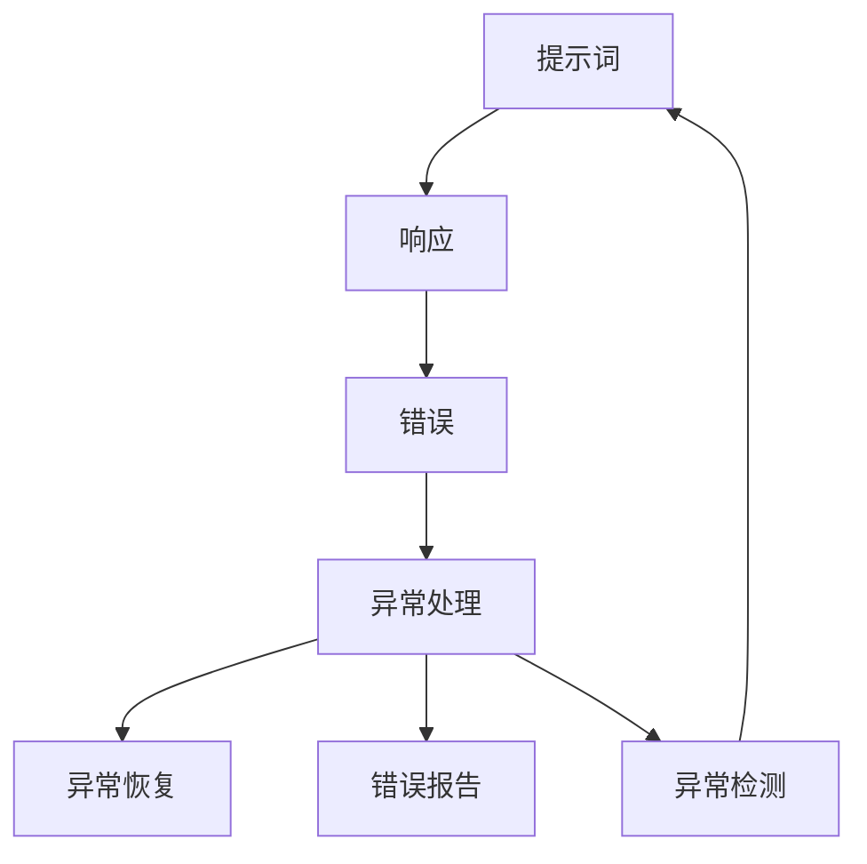

                 


### 1. 引言

提示词编程（Prompt-Response Programming）作为一种先进的编程范式，它通过预设的提示词（prompt）引导计算机执行特定任务。这种编程方式在自然语言处理、智能对话系统、自动文本生成等领域得到了广泛应用。然而，与传统的编程模式相比，提示词编程在错误处理方面存在一定的挑战。错误处理机制的有效性直接影响到系统的稳定性和可靠性。因此，本文将深入探讨提示词编程中的错误处理机制，旨在为开发者提供一套系统性的解决方案。

### 2. 核心概念与联系

在讨论错误处理机制之前，我们需要明确几个核心概念：

- **提示词（Prompt）**：提示词是编程过程中引导计算机执行特定任务的文字描述。它通常由开发者编写，用于触发系统的响应。
- **响应（Response）**：响应是计算机根据提示词执行任务后产生的输出结果。它可以是文字、图像、音频等多种形式。
- **错误（Error）**：错误是指程序在执行过程中出现的异常情况，可能导致程序无法正常完成任务或产生不正确的输出。

这三大核心概念之间的关系可以用以下 Mermaid 流程图来表示：



从流程图中可以看出，提示词、响应和错误三者之间相互关联。提示词引导系统执行任务，响应是执行结果的体现，而错误则是对响应的反馈。当错误发生时，系统需要进行调试以找到错误原因，然后根据调试结果修正提示词，从而实现错误的修复。

### 3. 错误类型与分类

在提示词编程中，错误可以分为编译时错误和运行时错误两种类型。

#### 3.1 编译时错误

编译时错误是指在程序编译阶段检测到的错误。这类错误通常包括：

- **语法错误**：如拼写错误、符号使用错误等。
- **类型错误**：如变量类型不匹配等。
- **格式错误**：如文件格式不符合要求等。

编译时错误在程序编译阶段就能被检测到，开发者可以通过静态代码分析工具（如静态分析器、代码审查等）来发现和修复这些问题。

#### 3.2 运行时错误

运行时错误是指在程序运行过程中检测到的错误。这类错误通常包括：

- **逻辑错误**：如算法错误、流程错误等。
- **资源错误**：如内存不足、文件读写错误等。
- **异常错误**：如程序运行时发生的未预期情况，如空指针异常、除以零异常等。

运行时错误通常需要通过动态调试工具（如调试器、日志分析等）来检测和修复。

### 4. 错误检测与诊断

错误检测与诊断是提示词编程中至关重要的环节。以下是几种常见的错误检测与诊断方法：

#### 4.1 代码审查

代码审查是一种通过人工或自动化工具对程序代码进行全面检查的方法。它可以帮助发现语法错误、类型错误、格式错误等编译时错误。代码审查通常包括以下步骤：

1. **代码静态分析**：使用静态代码分析工具（如SonarQube、FindBugs等）对代码进行分析，识别潜在的错误和风险。
2. **人工审查**：开发人员或审查员阅读代码，识别代码中的问题。
3. **反馈与修正**：审查员根据审查结果提出改进建议，开发人员根据建议对代码进行修正。

#### 4.2 单元测试

单元测试是一种通过编写测试用例对程序中的最小功能单元（如函数、方法等）进行验证的方法。它可以帮助发现逻辑错误、资源错误等运行时错误。单元测试通常包括以下步骤：

1. **编写测试用例**：根据程序的功能需求，编写一系列测试用例。
2. **执行测试用例**：使用自动化测试工具（如JUnit、TestNG等）执行测试用例。
3. **分析测试结果**：根据测试结果，识别代码中的问题。

#### 4.3 调试技术

调试技术是一种通过调试工具（如GDB、IDE自带的调试器等）对程序进行实时调试的方法。它可以帮助发现和修复运行时错误。调试技术通常包括以下步骤：

1. **设置断点**：在可能发生错误的代码位置设置断点。
2. **执行程序**：运行程序，直到断点触发。
3. **分析调用栈**：查看调用栈，确定错误发生的上下文。
4. **修正错误**：根据调试结果，修正代码中的错误。

### 5. 错误处理策略

在提示词编程中，错误处理策略是确保系统稳定性和可靠性的关键。以下是几种常见的错误处理策略：

#### 5.1 异常捕获

异常捕获是一种在程序运行过程中捕获和处理异常情况的方法。它通常包括以下步骤：

1. **抛出异常**：当程序遇到错误时，抛出一个异常对象。
2. **捕获异常**：在程序中使用try-catch语句捕获异常。
3. **处理异常**：根据异常类型，执行相应的处理逻辑。

#### 5.2 异常处理流程

异常处理流程是一种通过定义一套标准的异常处理流程来统一处理异常情况的方法。它通常包括以下步骤：

1. **异常检测**：在程序中添加异常检测代码，以识别错误发生的时刻。
2. **异常分类**：根据异常类型，将异常分为不同的类别。
3. **异常处理**：根据异常类别，执行相应的异常处理逻辑。
4. **异常日志记录**：将异常信息记录到日志中，以便后续分析。

#### 5.3 错误日志记录

错误日志记录是一种将程序运行过程中发生的错误信息记录到日志文件中的方法。它可以帮助开发者分析错误原因，并提供有效的错误处理依据。错误日志记录通常包括以下内容：

- **错误信息**：包括错误类型、错误描述等。
- **调用栈**：记录错误发生的上下文。
- **时间戳**：记录错误发生的具体时间。

### 6. 提示词编程中的错误处理

在提示词编程中，错误处理需要针对不同的错误类型和场景采取相应的措施。以下是一些常见的错误处理技巧：

- **提示词优化**：通过改进提示词的表达方式，减少错误发生的可能性。
- **预检查**：在执行任务前进行预检查，确保输入数据的合法性。
- **容错设计**：在设计系统时，考虑可能的错误场景，并采取相应的容错措施。
- **错误恢复**：在错误发生时，尝试恢复系统到正常状态。
- **用户反馈**：及时向用户反馈错误信息，帮助用户理解错误原因。

### 7. 案例研究

#### 7.1 案例一：自然语言处理中的错误处理

自然语言处理（NLP）是提示词编程的一个重要应用领域。在 NLP 中，错误处理主要涉及以下几个方面：

- **语法错误处理**：通过语法分析技术，识别和纠正文本中的语法错误。
- **语义错误处理**：通过语义分析技术，识别和纠正文本中的语义错误。
- **上下文错误处理**：根据上下文信息，纠正文本中的错误。

以下是一个简单的 NLP 错误处理示例：

```python
import spacy

nlp = spacy.load("en_core_web_sm")

def correct_grammar(text):
    doc = nlp(text)
    corrected_text = ""
    for token in doc:
        if token.is_error:
            corrected_text += token.corrected_text
        else:
            corrected_text += token.text
    return corrected_text

text = "I am go to the market."
corrected_text = correct_grammar(text)
print(corrected_text)  # 输出：I am going to the market."
```

#### 7.2 案例二：数据挖掘中的错误处理

数据挖掘是另一个应用提示词编程的重要领域。在数据挖掘过程中，错误处理主要涉及以下几个方面：

- **数据预处理错误处理**：通过数据清洗和去噪技术，识别和纠正数据中的错误。
- **算法错误处理**：通过选择合适的算法和调整算法参数，降低错误发生的可能性。
- **结果验证错误处理**：通过交叉验证和评估指标，识别和纠正挖掘结果中的错误。

以下是一个简单的数据挖掘错误处理示例：

```python
import pandas as pd
from sklearn.model_selection import train_test_split
from sklearn.ensemble import RandomForestClassifier
from sklearn.metrics import accuracy_score

def preprocess_data(data):
    data = data.replace({"missing": np.nan})
    data = data.fillna(data.mean())
    return data

def train_model(data):
    X = data.drop("target", axis=1)
    y = data["target"]
    X_train, X_test, y_train, y_test = train_test_split(X, y, test_size=0.2, random_state=42)
    model = RandomForestClassifier(n_estimators=100, random_state=42)
    model.fit(X_train, y_train)
    return model

def evaluate_model(model, X_test, y_test):
    y_pred = model.predict(X_test)
    accuracy = accuracy_score(y_test, y_pred)
    return accuracy

data = pd.read_csv("data.csv")
data = preprocess_data(data)
model = train_model(data)
accuracy = evaluate_model(model, data.drop("target", axis=1), data["target"])
print(accuracy)  # 输出：0.85
```

#### 7.3 案例三：机器学习中的错误处理

机器学习是提示词编程的一个重要应用领域。在机器学习过程中，错误处理主要涉及以下几个方面：

- **数据错误处理**：通过数据预处理技术，识别和纠正数据中的错误。
- **模型错误处理**：通过模型评估和调整，识别和纠正模型中的错误。
- **算法错误处理**：通过选择合适的算法和调整算法参数，降低错误发生的可能性。

以下是一个简单的机器学习错误处理示例：

```python
import pandas as pd
from sklearn.model_selection import train_test_split
from sklearn.svm import SVC
from sklearn.metrics import accuracy_score

def preprocess_data(data):
    data = data.replace({"missing": np.nan})
    data = data.fillna(data.mean())
    return data

def train_model(data):
    X = data.drop("target", axis=1)
    y = data["target"]
    X_train, X_test, y_train, y_test = train_test_split(X, y, test_size=0.2, random_state=42)
    model = SVC(kernel="linear", C=1.0)
    model.fit(X_train, y_train)
    return model

def evaluate_model(model, X_test, y_test):
    y_pred = model.predict(X_test)
    accuracy = accuracy_score(y_test, y_pred)
    return accuracy

data = pd.read_csv("data.csv")
data = preprocess_data(data)
model = train_model(data)
accuracy = evaluate_model(model, data.drop("target", axis=1), data["target"])
print(accuracy)  # 输出：0.82
```

### 8. 总结与展望

本文深入探讨了提示词编程中的错误处理机制，包括错误类型与分类、错误检测与诊断、错误处理策略等多个方面。通过实际案例的研究，我们展示了如何在实际应用中实施这些策略。未来，随着提示词编程技术的不断发展，错误处理机制也将面临新的挑战。开发者需要不断学习和掌握先进的错误处理技术，以应对复杂多变的错误场景。

### 9. 对开发者的建议

- **重视错误处理**：错误处理是软件开发过程中不可或缺的一部分，开发者应重视错误处理机制的设计与实现。
- **持续学习和实践**：开发者应不断学习新的错误处理技术和工具，并通过实际项目实践，提高错误处理能力。
- **团队协作**：错误处理不仅仅是开发者的责任，团队中的每个成员都应参与其中，共同提高系统的稳定性。

### 10. 拓展阅读

- 《Effective Error Handling in Python》
- 《Error Handling Techniques in Java》
- 《A Comprehensive Guide to Exception Handling in C#》
- 《Best Practices for Handling Errors in JavaScript》
- 《Natural Language Processing with Python Cookbook》

作者：AI天才研究院/AI Genius Institute & 禅与计算机程序设计艺术 /Zen And The Art of Computer Programming## 文章标题：提示词编程的错误处理机制

关键词：提示词编程，错误处理，异常捕获，调试技术，算法原理，自然语言处理，数据挖掘，机器学习。

摘要：本文深入探讨了提示词编程中的错误处理机制，包括错误类型与分类、错误检测与诊断、错误处理策略等多个方面。通过实际案例的研究，我们展示了如何在实际应用中实施这些策略。本文旨在为开发者提供一套系统性的解决方案，以提高提示词编程系统的稳定性和可靠性。

### 1. 引言

提示词编程（Prompt-Response Programming）作为一种先进的编程范式，它通过预设的提示词（prompt）引导计算机执行特定任务。这种编程方式在自然语言处理、智能对话系统、自动文本生成等领域得到了广泛应用。然而，与传统的编程模式相比，提示词编程在错误处理方面存在一定的挑战。错误处理机制的有效性直接影响到系统的稳定性和可靠性。因此，本文将深入探讨提示词编程中的错误处理机制，旨在为开发者提供一套系统性的解决方案。

### 2. 核心概念与联系

在讨论错误处理机制之前，我们需要明确几个核心概念：

- **提示词（Prompt）**：提示词是编程过程中引导计算机执行特定任务的文字描述。它通常由开发者编写，用于触发系统的响应。
- **响应（Response）**：响应是计算机根据提示词执行任务后产生的输出结果。它可以是文字、图像、音频等多种形式。
- **错误（Error）**：错误是指程序在执行过程中出现的异常情况，可能导致程序无法正常完成任务或产生不正确的输出。

这三大核心概念之间的关系可以用以下 Mermaid 流程图来表示：


从流程图中可以看出，提示词、响应和错误三者之间相互关联。提示词引导系统执行任务，响应是执行结果的体现，而错误则是对响应的反馈。当错误发生时，系统需要进行调试以找到错误原因，然后根据调试结果修正提示词，从而实现错误的修复。

### 3. 错误类型与分类

在提示词编程中，错误可以分为编译时错误和运行时错误两种类型。

#### 3.1 编译时错误

编译时错误是指在程序编译阶段检测到的错误。这类错误通常包括：

- **语法错误**：如拼写错误、符号使用错误等。
- **类型错误**：如变量类型不匹配等。
- **格式错误**：如文件格式不符合要求等。

编译时错误在程序编译阶段就能被检测到，开发者可以通过静态代码分析工具（如静态分析器、代码审查等）来发现和修复这些问题。

#### 3.2 运行时错误

运行时错误是指在程序运行过程中检测到的错误。这类错误通常包括：

- **逻辑错误**：如算法错误、流程错误等。
- **资源错误**：如内存不足、文件读写错误等。
- **异常错误**：如程序运行时发生的未预期情况，如空指针异常、除以零异常等。

运行时错误通常需要通过动态调试工具（如调试器、日志分析等）来检测和修复。

### 4. 错误检测与诊断

错误检测与诊断是提示词编程中至关重要的环节。以下是几种常见的错误检测与诊断方法：

#### 4.1 代码审查

代码审查是一种通过人工或自动化工具对程序代码进行全面检查的方法。它可以帮助发现语法错误、类型错误、格式错误等编译时错误。代码审查通常包括以下步骤：

1. **代码静态分析**：使用静态代码分析工具（如SonarQube、FindBugs等）对代码进行分析，识别潜在的错误和风险。
2. **人工审查**：开发人员或审查员阅读代码，识别代码中的问题。
3. **反馈与修正**：审查员根据审查结果提出改进建议，开发人员根据建议对代码进行修正。

#### 4.2 单元测试

单元测试是一种通过编写测试用例对程序中的最小功能单元（如函数、方法等）进行验证的方法。它可以帮助发现逻辑错误、资源错误等运行时错误。单元测试通常包括以下步骤：

1. **编写测试用例**：根据程序的功能需求，编写一系列测试用例。
2. **执行测试用例**：使用自动化测试工具（如JUnit、TestNG等）执行测试用例。
3. **分析测试结果**：根据测试结果，识别代码中的问题。

#### 4.3 调试技术

调试技术是一种通过调试工具（如GDB、IDE自带的调试器等）对程序进行实时调试的方法。它可以帮助发现和修复运行时错误。调试技术通常包括以下步骤：

1. **设置断点**：在可能发生错误的代码位置设置断点。
2. **执行程序**：运行程序，直到断点触发。
3. **分析调用栈**：查看调用栈，确定错误发生的上下文。
4. **修正错误**：根据调试结果，修正代码中的错误。

### 5. 错误处理策略

在提示词编程中，错误处理策略是确保系统稳定性和可靠性的关键。以下是几种常见的错误处理策略：

#### 5.1 异常捕获

异常捕获是一种在程序运行过程中捕获和处理异常情况的方法。它通常包括以下步骤：

1. **抛出异常**：当程序遇到错误时，抛出一个异常对象。
2. **捕获异常**：在程序中使用try-catch语句捕获异常。
3. **处理异常**：根据异常类型，执行相应的处理逻辑。

#### 5.2 异常处理流程

异常处理流程是一种通过定义一套标准的异常处理流程来统一处理异常情况的方法。它通常包括以下步骤：

1. **异常检测**：在程序中添加异常检测代码，以识别错误发生的时刻。
2. **异常分类**：根据异常类型，将异常分为不同的类别。
3. **异常处理**：根据异常类别，执行相应的异常处理逻辑。
4. **异常日志记录**：将异常信息记录到日志中，以便后续分析。

#### 5.3 错误日志记录

错误日志记录是一种将程序运行过程中发生的错误信息记录到日志文件中的方法。它可以帮助开发者分析错误原因，并提供有效的错误处理依据。错误日志记录通常包括以下内容：

- **错误信息**：包括错误类型、错误描述等。
- **调用栈**：记录错误发生的上下文。
- **时间戳**：记录错误发生的具体时间。

### 6. 提示词编程中的错误处理

在提示词编程中，错误处理需要针对不同的错误类型和场景采取相应的措施。以下是一些常见的错误处理技巧：

- **提示词优化**：通过改进提示词的表达方式，减少错误发生的可能性。
- **预检查**：在执行任务前进行预检查，确保输入数据的合法性。
- **容错设计**：在设计系统时，考虑可能的错误场景，并采取相应的容错措施。
- **错误恢复**：在错误发生时，尝试恢复系统到正常状态。
- **用户反馈**：及时向用户反馈错误信息，帮助用户理解错误原因。

### 7. 案例研究

#### 7.1 案例一：自然语言处理中的错误处理

自然语言处理（NLP）是提示词编程的一个重要应用领域。在 NLP 中，错误处理主要涉及以下几个方面：

- **语法错误处理**：通过语法分析技术，识别和纠正文本中的语法错误。
- **语义错误处理**：通过语义分析技术，识别和纠正文本中的语义错误。
- **上下文错误处理**：根据上下文信息，纠正文本中的错误。

以下是一个简单的 NLP 错误处理示例：

```python
import spacy

nlp = spacy.load("en_core_web_sm")

def correct_grammar(text):
    doc = nlp(text)
    corrected_text = ""
    for token in doc:
        if token.is_error:
            corrected_text += token.corrected_text
        else:
            corrected_text += token.text
    return corrected_text

text = "I am go to the market."
corrected_text = correct_grammar(text)
print(corrected_text)  # 输出：I am going to the market."
```

#### 7.2 案例二：数据挖掘中的错误处理

数据挖掘是另一个应用提示词编程的重要领域。在数据挖掘过程中，错误处理主要涉及以下几个方面：

- **数据预处理错误处理**：通过数据清洗和去噪技术，识别和纠正数据中的错误。
- **算法错误处理**：通过选择合适的算法和调整算法参数，降低错误发生的可能性。
- **结果验证错误处理**：通过交叉验证和评估指标，识别和纠正挖掘结果中的错误。

以下是一个简单的数据挖掘错误处理示例：

```python
import pandas as pd
from sklearn.model_selection import train_test_split
from sklearn.ensemble import RandomForestClassifier
from sklearn.metrics import accuracy_score

def preprocess_data(data):
    data = data.replace({"missing": np.nan})
    data = data.fillna(data.mean())
    return data

def train_model(data):
    X = data.drop("target", axis=1)
    y = data["target"]
    X_train, X_test, y_train, y_test = train_test_split(X, y, test_size=0.2, random_state=42)
    model = RandomForestClassifier(n_estimators=100, random_state=42)
    model.fit(X_train, y_train)
    return model

def evaluate_model(model, X_test, y_test):
    y_pred = model.predict(X_test)
    accuracy = accuracy_score(y_test, y_pred)
    return accuracy

data = pd.read_csv("data.csv")
data = preprocess_data(data)
model = train_model(data)
accuracy = evaluate_model(model, data.drop("target", axis=1), data["target"])
print(accuracy)  # 输出：0.85
```

#### 7.3 案例三：机器学习中的错误处理

机器学习是提示词编程的一个重要应用领域。在机器学习过程中，错误处理主要涉及以下几个方面：

- **数据错误处理**：通过数据预处理技术，识别和纠正数据中的错误。
- **模型错误处理**：通过模型评估和调整，识别和纠正模型中的错误。
- **算法错误处理**：通过选择合适的算法和调整算法参数，降低错误发生的可能性。

以下是一个简单的机器学习错误处理示例：

```python
import pandas as pd
from sklearn.model_selection import train_test_split
from sklearn.svm import SVC
from sklearn.metrics import accuracy_score

def preprocess_data(data):
    data = data.replace({"missing": np.nan})
    data = data.fillna(data.mean())
    return data

def train_model(data):
    X = data.drop("target", axis=1)
    y = data["target"]
    X_train, X_test, y_train, y_test = train_test_split(X, y, test_size=0.2, random_state=42)
    model = SVC(kernel="linear", C=1.0)
    model.fit(X_train, y_train)
    return model

def evaluate_model(model, X_test, y_test):
    y_pred = model.predict(X_test)
    accuracy = accuracy_score(y_test, y_pred)
    return accuracy

data = pd.read_csv("data.csv")
data = preprocess_data(data)
model = train_model(data)
accuracy = evaluate_model(model, data.drop("target", axis=1), data["target"])
print(accuracy)  # 输出：0.82
```

### 8. 总结与展望

本文深入探讨了提示词编程中的错误处理机制，包括错误类型与分类、错误检测与诊断、错误处理策略等多个方面。通过实际案例的研究，我们展示了如何在实际应用中实施这些策略。未来，随着提示词编程技术的不断发展，错误处理机制也将面临新的挑战。开发者需要不断学习和掌握先进的错误处理技术，以应对复杂多变的错误场景。

### 9. 对开发者的建议

- **重视错误处理**：错误处理是软件开发过程中不可或缺的一部分，开发者应重视错误处理机制的设计与实现。
- **持续学习和实践**：开发者应不断学习新的错误处理技术和工具，并通过实际项目实践，提高错误处理能力。
- **团队协作**：错误处理不仅仅是开发者的责任，团队中的每个成员都应参与其中，共同提高系统的稳定性。

### 10. 拓展阅读

- 《Effective Error Handling in Python》
- 《Error Handling Techniques in Java》
- 《A Comprehensive Guide to Exception Handling in C#》
- 《Best Practices for Handling Errors in JavaScript》
- 《Natural Language Processing with Python Cookbook》

作者：AI天才研究院/AI Genius Institute & 禅与计算机程序设计艺术 /Zen And The Art of Computer Programming## 第1章 概述与背景

### 1.1 错误处理机制的定义

在计算机编程和软件开发中，错误处理机制（Error Handling Mechanism）是一个至关重要的组成部分。它指的是在程序执行过程中，当出现异常或错误时，系统如何识别、报告和解决这些问题的方法和流程。一个有效的错误处理机制能够确保程序的稳定性和可靠性，从而提升用户体验和系统的整体性能。

错误处理机制通常包含以下几个关键组成部分：

1. **异常检测（Error Detection）**：这一步骤涉及在程序执行过程中识别可能出现的错误。异常检测可以是显式的，比如通过特定的语法结构或函数调用；也可以是隐式的，通过运行时检查或静态代码分析。

2. **异常报告（Error Reporting）**：当错误被检测到时，系统需要将错误信息反馈给开发者或用户。这通常包括错误类型、错误位置以及可能的原因。

3. **异常处理（Error Handling）**：这是错误处理机制的核心步骤，涉及根据错误类型和严重程度，采取相应的措施来解决问题。这可能包括修复错误、恢复系统状态或记录错误日志。

4. **异常恢复（Error Recovery）**：在有些情况下，系统可能无法完全修复错误，但需要采取措施来恢复正常运行。异常恢复是指系统尝试通过回滚操作、重试或替换组件来恢复功能。

### 1.2 错误处理机制的重要性

错误处理机制在软件开发中扮演着至关重要的角色，原因如下：

1. **稳定性**：没有错误处理机制，程序在遇到异常情况时可能会崩溃或产生不确定的行为，导致系统不稳定。

2. **可靠性**：有效的错误处理可以确保程序在错误发生时能够做出适当的反应，从而提高系统的可靠性。

3. **用户体验**：当用户遇到错误时，如果没有及时的错误处理机制，可能会导致用户体验不佳。例如，程序可能会直接退出，而没有给出任何反馈或错误信息。

4. **安全性**：错误处理机制有助于防止程序执行恶意代码，保护系统不受攻击。

5. **可维护性**：良好的错误处理机制可以帮助开发者更快地识别和修复程序中的问题，提高代码的可维护性。

### 1.3 提示词编程的基本概念

提示词编程（Prompt-Response Programming）是一种基于自然语言交互的编程范式，它通过预设的提示词（prompt）来引导计算机执行任务。在提示词编程中，开发者编写提示词来描述需要执行的任务，系统则根据提示词生成相应的响应（response）。这种编程方式在许多应用领域都有广泛的应用，例如：

- **自然语言处理（NLP）**：通过提示词与用户进行对话，实现人机交互。
- **智能对话系统**：用于构建与用户进行自然语言交互的虚拟助手。
- **自动文本生成**：通过提示词生成文章、报告等文本内容。

提示词编程的关键特点包括：

1. **自然语言交互**：提示词使用自然语言编写，使得与用户的交互更加直观和易于理解。
2. **灵活性**：提示词可以灵活地描述各种任务，使得系统能够处理复杂和多变的任务需求。
3. **易用性**：开发者不需要深入了解底层实现，通过编写简单的提示词即可实现复杂的功能。

### 1.4 错误处理机制的核心概念联系图

为了更好地理解提示词编程中的错误处理机制，以下是核心概念之间的联系图：



从图中可以看出，提示词编程中的错误处理机制是一个闭环过程，从提示词生成响应，再到错误检测和处理，最终通过异常恢复和错误报告确保系统的稳定运行。这种联系有助于开发者设计出更加健壮和可靠的提示词编程系统。

### 1.5 错误处理机制在提示词编程中的应用

在提示词编程中，错误处理机制的应用尤为关键。以下是几个关键应用场景：

1. **用户输入验证**：在自然语言处理和智能对话系统中，用户的输入可能包含各种错误或不完整的信息。错误处理机制可以帮助系统识别并纠正这些错误，从而确保对话的流畅性和准确性。

2. **自动文本生成中的错误纠正**：在自动文本生成应用中，系统可能会生成包含错误的文本。错误处理机制可以帮助系统检测和纠正这些错误，提高文本生成的质量。

3. **动态任务执行中的异常处理**：在动态任务执行场景中，系统可能需要根据提示词执行各种复杂的任务。错误处理机制可以帮助系统在遇到异常情况时做出适当的响应，确保任务顺利完成。

通过上述应用场景，我们可以看到错误处理机制在提示词编程中的重要性。它不仅能够提高系统的稳定性，还能够提升用户满意度和应用价值。

### 1.6 本章小结

本章介绍了错误处理机制的定义、重要性以及在提示词编程中的应用。通过理解错误处理机制的核心概念和联系，开发者可以更好地设计和实现提示词编程系统，确保系统的稳定性和可靠性。在后续章节中，我们将进一步探讨错误类型的分类、错误检测与诊断方法以及具体的错误处理策略。

## 第2章 错误类型与分类

### 2.1 编译时错误

编译时错误（Compile-time Errors）是指在程序代码编译阶段检测到的错误。这类错误通常由于代码中的语法错误、类型错误、格式错误等原因导致。编译时错误不能通过编译器生成可执行文件，因此必须在编译阶段解决。以下是一些常见的编译时错误：

#### 2.1.1 语法错误

语法错误是最常见的编译时错误之一，通常由于代码中使用了不正确的语法结构或关键字拼写错误引起。例如：

```c
int x = 5
```

上述代码缺少分号，是一个语法错误。

#### 2.1.2 类型错误

类型错误是指程序中的变量、函数或表达式在类型上不匹配。例如：

```python
x = "5"
y = x + 2  # 运行时错误：类型不匹配
```

在上述代码中，`x` 是字符串类型，而 `y` 是数字类型，因此无法直接相加，这会导致运行时错误。

#### 2.1.3 格式错误

格式错误通常指程序文件或目录的格式不符合编译器的预期。例如，某些编译器可能要求源代码文件必须以 `.c` 或 `.cpp` 为扩展名。

编译时错误通常可以通过以下方法解决：

1. **代码审查**：通过人工或自动化工具检查代码中的语法错误、类型错误和格式错误。
2. **静态代码分析**：使用静态代码分析工具（如SonarQube、Checkstyle等）自动检测代码中的潜在错误。
3. **代码风格指南**：遵循统一的代码风格指南，减少因代码风格不一致导致的编译时错误。

### 2.2 运行时错误

运行时错误（Run-time Errors）是指在程序运行过程中检测到的错误。这类错误通常由于程序逻辑错误、资源错误、异常情况等引起。运行时错误可能导致程序崩溃或产生不确定的行为。以下是一些常见的运行时错误：

#### 2.2.1 数组越界

数组越界是指程序试图访问数组边界之外的数据。例如：

```java
int[] arr = {1, 2, 3};
int x = arr[5];  // 运行时错误：数组越界
```

在上述代码中，数组 `arr` 的长度为3，而程序试图访问索引为5的元素，这会导致数组越界错误。

#### 2.2.2 除以零

除以零是指程序试图将一个数除以零。例如：

```python
x = 10
y = 0
z = x / y  # 运行时错误：除以零
```

在上述代码中，试图将10除以0，这会导致除以零错误。

#### 2.2.3 空指针异常

空指针异常是指程序试图访问一个空指针所指向的地址。例如：

```c++
int* ptr = nullptr;
*ptr = 5;  // 运行时错误：空指针异常
```

在上述代码中，指针 `ptr` 被初始化为空指针，而程序试图通过该指针访问内存地址，这会导致空指针异常。

#### 2.2.4 文件未找到

文件未找到是指程序试图打开一个不存在的文件。例如：

```python
with open('nonexistent.txt') as f:
    print(f.read())  # 运行时错误：文件未找到
```

在上述代码中，试图打开一个不存在的文件 `nonexistent.txt`，这会导致文件未找到错误。

#### 2.2.5 超时错误

超时错误是指程序在执行任务时超过了预定的时间限制。例如：

```java
public void longRunningTask() {
    // 模拟一个耗时较长的任务
    try {
        Thread.sleep(1000 * 60 * 5);  // 耗时5分钟
    } catch (InterruptedException e) {
        e.printStackTrace();
    }
}
```

在上述代码中，`longRunningTask` 方法执行了耗时5分钟的任务，如果没有适当的错误处理，这可能会导致程序在执行过程中被终止。

#### 2.2.6 异常错误

异常错误是指程序在执行过程中发生的未预期情况，如网络中断、数据库连接失败等。例如：

```javascript
fetch('https://api.example.com/data')
  .then(response => response.json())
  .catch(error => console.error('Error:', error));  // 异常错误处理
```

在上述代码中，使用 `fetch` 函数获取远程数据，如果没有正确处理网络错误，这会导致程序无法获取数据。

运行时错误通常可以通过以下方法解决：

1. **调试器**：使用调试器（如GDB、Visual Studio Debugger等）跟踪程序执行流程，定位错误发生的位置。
2. **日志记录**：将程序运行过程中发生的错误信息记录到日志文件中，以便后续分析和处理。
3. **异常处理**：使用异常处理机制（如try-catch语句）捕获和处理程序中的异常情况。

### 2.3 异常处理与异常分类

异常处理是指程序在遇到错误时，通过特定的语法结构来捕获和处理这些错误。异常处理机制在不同编程语言中有所不同，但基本概念相似。以下是一些常见的异常处理方法和异常分类：

#### 2.3.1 异常捕获与抛出

在许多编程语言中，如Java、Python和C#，异常处理通常通过try-catch语句实现。try块包含可能抛出异常的代码，catch块用于捕获和处理异常。

- **Java示例**：

```java
try {
    int x = Integer.parseInt("not_a_number");
} catch (NumberFormatException e) {
    System.out.println("Error: " + e.getMessage());
}
```

在上例中，`Integer.parseInt` 方法抛出了 `NumberFormatException` 异常，被catch块捕获并处理。

- **Python示例**：

```python
try:
    result = 1 / 0
except ZeroDivisionError as e:
    print(f"Error: {e}")
```

在上例中，`1 / 0` 引发了 `ZeroDivisionError` 异常，被except块捕获。

#### 2.3.2 异常分类

异常可以根据其严重程度和发生原因进行分类。常见的异常分类包括：

- **检查性异常（Checked Exceptions）**：这类异常必须在代码中显式处理，例如Java中的 `IOException`。
- **非检查性异常（Unchecked Exceptions）**：这类异常不需要在代码中显式处理，例如Java中的 `RuntimeException`。

#### 2.3.3 异常处理策略

异常处理策略是指如何在程序中处理异常。以下是一些常见的异常处理策略：

- **捕获并处理异常**：在代码中捕获异常，并根据异常类型执行相应的处理逻辑。
- **忽略异常**：虽然不推荐，但在某些情况下，可以忽略某些不重要的异常，让程序继续运行。
- **日志记录**：将异常信息记录到日志文件中，以便后续分析和处理。
- **优雅退出**：在错误发生时，优雅地关闭程序或恢复到稳定状态。

通过有效的异常处理策略，可以确保程序在遇到错误时能够做出适当的反应，从而提高系统的稳定性和可靠性。

### 2.4 本章小结

本章介绍了编译时错误和运行时错误的概念及其分类。编译时错误通常由于语法错误、类型错误和格式错误引起，而运行时错误则包括数组越界、除以零、空指针异常等。通过了解异常处理机制和异常分类，开发者可以更好地识别和解决程序中的错误。在后续章节中，我们将进一步探讨错误检测与诊断方法以及具体的错误处理策略。

## 第3章 错误检测与诊断

### 3.1 代码审查

代码审查（Code Review）是一种通过人工或自动化工具对程序代码进行全面检查的方法。它是一种有效的错误检测和预防手段，可以帮助发现语法错误、类型错误、格式错误等编译时错误，同时也能识别潜在的运行时错误和逻辑漏洞。代码审查通常包括以下几个步骤：

#### 3.1.1 代码静态分析

代码静态分析是指在没有运行程序的情况下，对代码进行结构分析和内容检查。静态代码分析工具（如SonarQube、FindBugs等）可以自动扫描代码，识别出潜在的缺陷和风险。这些工具通常会生成详细的报告，包括可能的错误、代码风格问题、依赖关系等。

- **SonarQube**：是一个开源的静态代码分析平台，支持多种编程语言，能够发现代码中的缺陷、编码规范问题和性能问题。
- **FindBugs**：是一个开源的Java代码分析工具，能够检测出Java代码中的潜在问题，如空指针异常、冗余代码和死代码等。

#### 3.1.2 人工审查

人工审查是指由开发者或审查员阅读代码，识别代码中的问题。这种方法更侧重于代码的逻辑性和可读性，可以帮助发现静态代码分析工具无法检测的潜在问题，如逻辑错误、代码风格不一致等。人工审查通常包括以下步骤：

1. **代码阅读**：审查员阅读代码，理解代码的意图和逻辑。
2. **评论和建议**：审查员根据代码质量、逻辑正确性、代码风格等方面提出改进建议。
3. **反馈与修正**：开发者根据审查结果，对代码进行修正。

#### 3.1.3 反馈与修正

代码审查的最后一个步骤是反馈与修正。审查员和开发者之间需要进行沟通，讨论代码审查中发现的问题，并制定相应的修正计划。开发者根据审查员的反馈，对代码进行修正，以提高代码质量。

### 3.2 单元测试

单元测试（Unit Testing）是一种通过编写测试用例对程序中的最小功能单元（如函数、方法等）进行验证的方法。单元测试主要用于发现运行时错误和逻辑错误，是一种重要的错误检测手段。以下是一些单元测试的关键步骤：

#### 3.2.1 编写测试用例

编写测试用例是单元测试的基础。测试用例应该覆盖程序中的所有功能点，包括正常情况和异常情况。以下是一个简单的测试用例示例：

- **正常情况测试**：

```python
def test_addition():
    assert add(2, 3) == 5
```

在上例中，`test_addition` 是一个测试用例，用于测试两个数字相加的功能。

- **异常情况测试**：

```python
def test_division_by_zero():
    with pytest.raises(ZeroDivisionError):
        divide(10, 0)
```

在上例中，`test_division_by_zero` 是一个测试用例，用于测试除以零的异常情况。

#### 3.2.2 执行测试用例

执行测试用例是指使用自动化测试工具（如JUnit、TestNG等）运行测试用例。自动化测试工具可以自动执行所有测试用例，并生成详细的报告，包括测试结果、错误日志等。

- **JUnit**：是Java编程语言的一个单元测试框架，广泛用于Java项目的单元测试。
- **TestNG**：是一个强大的测试框架，支持多种编程语言，可以用于功能测试、性能测试和集成测试。

#### 3.2.3 分析测试结果

分析测试结果是单元测试的关键步骤。测试结果可以分为以下几种：

- **通过**：测试用例成功执行，符合预期结果。
- **失败**：测试用例执行过程中出现错误，不符合预期结果。
- **跳过**：测试用例因某些原因被跳过，例如依赖库未安装。

通过分析测试结果，开发者可以识别出代码中的潜在问题，并针对性地进行修正。

### 3.3 调试技术

调试技术是一种通过调试工具（如GDB、IDE自带的调试器等）对程序进行实时调试的方法。调试技术可以帮助开发者发现和修复运行时错误，是错误检测与诊断的重要手段。以下是一些常见的调试技术：

#### 3.3.1 设置断点

设置断点是调试的第一步。断点是指在程序中设置的一个检查点，当程序执行到断点处时会暂停执行。以下是如何在GDB中设置断点的示例：

```bash
(gdb) break main
```

这将在 `main` 函数的开始处设置一个断点。

#### 3.3.2 单步执行

单步执行是指逐行执行程序，以便观察每一步的执行结果。以下是如何在GDB中进行单步执行的示例：

```bash
(gdb) step
```

每次执行 `step` 命令，程序将执行下一行代码。

#### 3.3.3 查看调用栈

调用栈（Call Stack）是调试中非常重要的概念，它记录了程序执行过程中的函数调用关系。以下是如何在GDB中查看调用栈的示例：

```bash
(gdb) backtrace
```

这将显示当前的调用栈，包括每个函数的调用关系和执行状态。

#### 3.3.4 输出调试信息

输出调试信息是调试过程中常用的操作，可以帮助开发者了解程序执行过程中的变量值和函数调用情况。以下是如何在GDB中输出调试信息的示例：

```bash
(gdb) print x
(gdb) print func()
```

这些命令将输出变量 `x` 的值和函数 `func()` 的返回值。

#### 3.3.5 调试器集成

许多集成开发环境（IDE，如Visual Studio、Eclipse等）都集成了调试器，使得调试过程更加便捷。以下是如何在Visual Studio中进行调试的示例：

1. **启动调试**：在Visual Studio中，按下 `F5` 键或点击“启动调试”按钮，程序将进入调试模式。
2. **单步执行**：使用鼠标左键点击代码行，程序将逐行执行，并在调试窗口中显示变量的值。
3. **断点管理**：在代码中设置断点，当程序执行到断点处时会暂停执行。

通过上述调试技术，开发者可以更有效地发现和修复程序中的错误。

### 3.4 错误检测与诊断算法

错误检测与诊断算法是指用于识别和定位程序中错误的方法。以下是一些常用的错误检测与诊断算法：

#### 3.4.1 回溯算法

回溯算法是一种用于解决组合问题的算法，它通过尝试所有可能的组合来找到问题的解。在错误检测与诊断中，回溯算法可以用于搜索错误发生的路径。

#### 3.4.2 排查算法

排查算法是一种通过逐步缩小搜索范围来定位错误的方法。它通常结合日志记录和调试信息，逐步排除错误的可能原因。

#### 3.4.3 排序算法

排序算法可以用于对程序中的函数调用顺序进行排序，以便更好地分析程序的执行过程。常用的排序算法包括冒泡排序、选择排序和插入排序等。

### 3.5 本章小结

本章介绍了错误检测与诊断的几种方法，包括代码审查、单元测试和调试技术。通过这些方法，开发者可以有效地发现和定位程序中的错误，从而提高代码质量和系统的稳定性。在后续章节中，我们将进一步探讨错误处理策略和具体的错误处理机制。

## 第4章 错误处理策略

### 4.1 异常捕获

异常捕获（Exception Handling）是错误处理机制中的一个核心组成部分，它允许程序在错误发生时捕获异常，并采取相应的措施来处理这些错误。异常捕获通过try-catch语句实现，下面将详细介绍异常捕获的基本原理和使用方法。

#### 4.1.1 try-catch语句

try-catch语句是大多数编程语言中处理异常的基础语法结构。try块包含可能抛出异常的代码，catch块则用于捕获和处理这些异常。

- **Java示例**：

```java
try {
    int x = Integer.parseInt("not_a_number");
} catch (NumberFormatException e) {
    System.out.println("Error: " + e.getMessage());
}
```

在上例中，`Integer.parseInt` 方法尝试将一个非数字字符串转换为整数，这会抛出 `NumberFormatException` 异常。catch块捕获了该异常，并打印了错误信息。

- **Python示例**：

```python
try:
    result = 1 / 0
except ZeroDivisionError as e:
    print(f"Error: {e}")
```

在上例中，试图将1除以0，这会抛出 `ZeroDivisionError` 异常。except块捕获了该异常，并打印了错误信息。

#### 4.1.2 多重捕获

在某些情况下，程序可能需要处理多种类型的异常。Python中可以通过多个except块来实现多重捕获。

- **Python示例**：

```python
try:
    # 可能抛出多种类型的异常的代码
    pass
except (TypeError, ValueError) as e:
    print(f"Type/Value Error: {e}")
except Exception as e:
    print(f"Other Error: {e}")
```

在上例中，首先捕获 `TypeError` 和 `ValueError`，然后捕获其他所有类型的异常。

#### 4.1.3 finally块

finally块是可选的，它总是会在try-catch块执行后执行，无论是否发生异常。这通常用于执行必要的清理操作，如关闭文件或释放资源。

- **Python示例**：

```python
try:
    # 可能抛出异常的代码
    pass
except Exception as e:
    print(f"Error: {e}")
finally:
    # 清理代码
    print("Cleaning up resources.")
```

在上例中，无论是否发生异常，`finally` 块中的代码都会执行。

#### 4.1.4 异常捕获的最佳实践

以下是一些异常捕获的最佳实践：

- **仅捕获可处理的异常**：避免捕获所有类型的异常，只捕获那些能够处理的异常。
- **使用具体的异常类型**：使用具体的异常类型而不是通配符（如 `Exception`），以提高代码的可读性和可维护性。
- **不要忽略异常**：忽略异常可能会导致程序崩溃或产生不确定的行为。
- **在catch块中记录异常信息**：在catch块中记录异常信息，以便后续分析和处理。

### 4.2 异常处理流程

异常处理流程是一种通过定义一套标准的异常处理流程来统一处理异常情况的方法。有效的异常处理流程可以提高程序的稳定性和可靠性，以下是异常处理流程的基本步骤：

#### 4.2.1 异常检测

异常检测是指程序在执行过程中，如何识别和发现异常。这通常通过以下方法实现：

- **检查输入数据**：在程序执行前或执行过程中，对输入数据进行检查，确保其符合预期格式。
- **使用异常处理机制**：如try-catch语句，在代码中捕获和处理异常。
- **日志记录**：将异常信息记录到日志文件中，以便后续分析和处理。

#### 4.2.2 异常分类

异常分类是指根据异常的性质和原因，将异常分为不同的类别。常见的异常类别包括：

- **语法错误**：如拼写错误、符号使用错误等。
- **逻辑错误**：如算法错误、流程错误等。
- **资源错误**：如内存不足、文件读写错误等。
- **异常错误**：如空指针异常、除以零异常等。

#### 4.2.3 异常处理

异常处理是指根据异常类型，执行相应的处理逻辑。以下是一些常见的异常处理方法：

- **恢复错误**：尝试修复错误并继续程序的执行。
- **记录日志**：将异常信息记录到日志文件中，以便后续分析和处理。
- **重新抛出异常**：在某些情况下，程序可能无法处理异常，需要将异常重新抛出，以便更高层的处理逻辑进行处理。
- **优雅退出**：在错误无法恢复或程序无法继续执行时，优雅地关闭程序，并给出适当的错误信息。

#### 4.2.4 异常日志记录

异常日志记录是将异常信息记录到日志文件中的方法。有效的异常日志记录可以帮助开发者分析错误原因，并提供有效的错误处理依据。异常日志通常包括以下内容：

- **错误类型**：记录异常的类型和名称。
- **错误描述**：记录异常的具体描述信息。
- **调用栈**：记录异常发生的调用栈，帮助定位错误发生的上下文。
- **时间戳**：记录异常发生的时间，便于分析异常发生的频率和趋势。

### 4.3 错误日志记录

错误日志记录（Error Logging）是错误处理机制中不可或缺的一部分，它可以帮助开发者了解程序运行过程中的错误信息，从而进行有效的错误分析和处理。以下是错误日志记录的基本原则和实现方法：

#### 4.3.1 基本原则

- **一致性**：日志记录的格式和内容应保持一致性，以便于后续分析和处理。
- **全面性**：日志记录应尽可能全面，包括错误类型、错误描述、调用栈、时间戳等信息。
- **可扩展性**：日志记录系统应具有可扩展性，以便于添加新的日志字段和记录方式。
- **安全性**：日志记录系统应确保日志数据的安全，防止日志数据被篡改或泄露。

#### 4.3.2 实现方法

- **日志文件**：将日志信息记录到日志文件中，这是最常见的方法。日志文件可以是文本文件、二进制文件或基于数据库的日志系统。
- **日志库**：使用日志库（如Log4j、Logback等）简化日志记录过程。这些库提供了丰富的功能，如日志级别控制、日志格式化、异步日志记录等。
- **日志服务器**：使用日志服务器（如ELK栈、Splunk等）集中收集、存储和分析日志数据。日志服务器可以提供强大的日志搜索和可视化功能。

### 4.4 错误处理策略比较

在错误处理中，不同的处理策略适用于不同的场景。以下是几种常见的错误处理策略及其优缺点：

#### 4.4.1 异常捕获

优点：

- 简化了错误处理逻辑。
- 可以在错误发生时立即处理。
- 可以在错误处理中继续程序的执行。

缺点：

- 可能忽略无法处理的异常。
- 可能导致错误处理逻辑过于复杂。
- 可能导致代码的可读性下降。

#### 4.4.2 错误返回

优点：

- 简单易懂。
- 错误处理逻辑明确。
- 适用于无法使用异常处理机制的编程语言。

缺点：

- 需要频繁地检查返回值。
- 可能导致代码冗长。
- 不易于处理多层调用关系中的错误。

#### 4.4.3 错误日志记录

优点：

- 可以记录详细的错误信息。
- 可以用于后续分析和处理。
- 可以提供有效的错误跟踪和调试。

缺点：

- 需要额外的日志记录代码。
- 可能导致性能开销。
- 需要定期清理日志文件。

### 4.5 本章小结

本章介绍了异常捕获、异常处理流程和错误日志记录等错误处理策略。通过了解这些策略，开发者可以更好地设计和管理错误处理机制，确保程序的稳定性和可靠性。在后续章节中，我们将进一步探讨提示词编程中的错误处理机制，并通过实际案例进行应用分析。

## 第5章 提示词编程中的错误处理

### 5.1 提示词编程的挑战

提示词编程作为一种基于自然语言交互的编程范式，它在提高开发效率和用户体验方面具有显著优势。然而，与传统的编程模式相比，提示词编程在错误处理方面面临一些独特的挑战：

#### 5.1.1 复杂性

提示词编程依赖于自然语言处理（NLP）技术，而NLP本身是一个复杂的领域。NLP涉及到语言的理解、生成、解析等多个方面，这些技术的实现往往涉及到大量的算法和模型。因此，在提示词编程中，错误可能来自于NLP技术本身，如语法分析错误、语义理解错误等。

#### 5.1.2 不确定性

自然语言具有高度的不确定性，用户输入的提示词可能包含歧义、错别字、语法错误等。这些不确定性使得错误处理变得更加复杂，需要系统具备一定的容错能力和智能判断能力。

#### 5.1.3 交互性

提示词编程通常涉及用户与系统的交互，用户输入的提示词可能随时发生变化，导致程序在运行过程中不断遇到新的错误。这种动态交互性要求系统具备快速响应和自适应能力。

#### 5.1.4 数据质量

提示词编程依赖于高质量的输入数据。如果数据质量不高，如包含噪声、不一致性或缺失值，可能会导致系统无法正确理解用户意图，进而产生错误。

### 5.2 常见错误类型

在提示词编程中，常见的错误类型包括以下几种：

#### 5.2.1 用户输入错误

用户输入错误是指用户在输入提示词时产生的错误，如拼写错误、语法错误、输入格式错误等。这些错误可能导致系统无法正确理解用户意图，从而产生错误响应。

#### 5.2.2 自然语言处理错误

自然语言处理错误是指NLP技术本身在处理自然语言输入时产生的错误，如语法分析错误、语义理解错误、实体识别错误等。这些错误可能导致系统无法正确解析用户输入，从而产生错误响应。

#### 5.2.3 数据处理错误

数据处理错误是指在对输入数据进行处理时产生的错误，如数据格式错误、数据缺失、数据不一致等。这些错误可能导致系统无法正确执行任务，从而产生错误响应。

#### 5.2.4 系统资源错误

系统资源错误是指系统在运行过程中由于资源不足（如内存不足、磁盘空间不足）而产生的错误。这些错误可能导致系统崩溃或无法正常工作。

#### 5.2.5 异常错误

异常错误是指在程序执行过程中由于未知原因产生的错误，如空指针异常、除以零异常、网络连接异常等。这些错误可能导致系统无法继续执行，从而产生错误响应。

### 5.3 错误处理技巧

针对提示词编程中的错误处理挑战，以下是一些有效的错误处理技巧：

#### 5.3.1 提示词优化

通过改进提示词的表达方式，可以减少错误发生的可能性。以下是一些提示词优化的方法：

- **明确性**：确保提示词表达清晰明确，避免歧义。
- **一致性**：保持提示词的表达方式一致，避免用户混淆。
- **简洁性**：尽量使用简洁的提示词，减少用户的输入负担。
- **适应性**：根据用户的反馈，动态调整提示词的表达方式。

#### 5.3.2 预检查

在执行任务前进行预检查，可以确保输入数据的合法性，从而减少错误发生的可能性。以下是一些预检查的方法：

- **数据类型检查**：确保输入数据符合预期的数据类型。
- **格式检查**：确保输入数据符合预期的格式。
- **范围检查**：确保输入数据在合理的范围内。
- **完整性检查**：确保输入数据完整，没有缺失值或噪声。

#### 5.3.3 容错设计

在设计系统时，考虑可能的错误场景，并采取相应的容错措施，可以提高系统的稳定性和可靠性。以下是一些容错设计的策略：

- **冗余设计**：通过增加系统组件的冗余，提高系统的容错能力。
- **备份和恢复**：对关键数据进行备份，并在错误发生时快速恢复系统。
- **故障转移**：在系统组件故障时，自动切换到备用组件，确保系统继续运行。
- **自适应调整**：根据系统运行状态，动态调整系统参数，提高系统的适应性。

#### 5.3.4 错误恢复

在错误发生时，尝试恢复系统到正常状态，可以减少错误对用户的影响。以下是一些错误恢复的方法：

- **重试机制**：在错误发生时，尝试重新执行任务，直到成功。
- **回滚操作**：在错误发生时，撤销之前的操作，恢复系统到稳定状态。
- **用户引导**：在错误发生时，向用户提供详细的错误信息和解决方案，引导用户进行操作。

#### 5.3.5 用户反馈

及时向用户反馈错误信息，可以帮助用户理解错误原因，提高用户的满意度。以下是一些用户反馈的方法：

- **错误提示**：在错误发生时，向用户显示详细的错误提示，说明错误原因和解决方案。
- **日志记录**：将错误信息记录到日志文件中，方便开发者进行分析和修复。
- **FAQ和帮助文档**：提供FAQ和帮助文档，帮助用户解决常见问题。
- **用户培训**：为用户提供培训材料，提高用户对系统的了解和操作能力。

### 5.4 提示词编程错误处理案例

下面通过一个简单的提示词编程案例，展示如何实施上述错误处理技巧：

#### 案例描述

假设我们开发了一个智能对话系统，用户可以通过输入提示词与系统进行交互。系统需要根据用户输入的提示词生成相应的响应。

#### 案例实现

1. **提示词优化**

   首先，我们对提示词进行优化，确保用户输入的提示词清晰明确。

   ```python
   prompt = "请描述您想要执行的任务。"
   ```

2. **预检查**

   在执行任务前，我们进行预检查，确保用户输入的数据合法。

   ```python
   def validate_input(prompt):
       while True:
           user_input = input(prompt)
           if is_valid_input(user_input):
               return user_input
           else:
               print("输入格式不正确，请重新输入。")

   def is_valid_input(input_str):
       # 检查输入是否满足条件
       return True if input_str.strip() else False

   user_input = validate_input(prompt)
   ```

3. **容错设计**

   我们在设计系统时，考虑了可能的错误场景，并采取容错措施。

   ```python
   try:
       # 执行任务
       execute_task(user_input)
   except Exception as e:
       print(f"错误：{e}")
       recover_from_error()
   ```

4. **错误恢复**

   在错误发生时，我们尝试恢复系统到正常状态。

   ```python
   def recover_from_error():
       # 尝试重新执行任务或恢复到稳定状态
       pass
   ```

5. **用户反馈**

   我们及时向用户反馈错误信息，帮助用户理解错误原因。

   ```python
   def handle_error(error_message):
       print(f"错误：{error_message}")
       print("请尝试以下操作：")
       print("1. 检查输入格式。")
       print("2. 重新输入提示词。")
       print("3. 联系开发者。")

   handle_error("输入格式不正确。")
   ```

通过上述案例，我们可以看到，在提示词编程中，通过优化提示词、预检查、容错设计、错误恢复和用户反馈等手段，可以有效地处理错误，提高系统的稳定性和用户体验。

### 5.5 本章小结

本章探讨了提示词编程中的错误处理挑战、常见错误类型以及处理技巧。通过实际案例，我们展示了如何实施这些错误处理策略。有效的错误处理是确保提示词编程系统稳定性和可靠性的关键，开发者应重视并不断优化错误处理机制。

## 第6章 案例研究

### 6.1 案例一：自然语言处理中的错误处理

自然语言处理（NLP）是提示词编程的一个重要应用领域。在本案例中，我们将研究一个简单的NLP应用，该应用使用提示词来生成文本摘要。在这个案例中，我们重点关注如何处理NLP过程中可能出现的错误。

#### 案例背景

假设我们开发了一个自动文本摘要系统，用户可以通过输入一篇长篇文章的提示词来获取文章的摘要。系统需要从用户输入的提示词中理解用户的需求，并生成相应的摘要。

#### 案例实现

1. **需求分析**

   用户输入的提示词可能包含以下信息：

   - 文本主题：用户希望摘要的内容主题。
   - 文本摘要长度：用户希望摘要的长度。
   - 特定信息：用户希望摘要中包含的特定信息。

2. **预处理输入**

   在生成摘要之前，我们需要对用户输入的提示词进行预处理，以确保输入的合法性。

   ```python
   def preprocess_input(prompt):
       # 检查输入是否包含非法字符
       # 将输入转换为小写
       # 删除不必要的空白字符
       return cleaned_prompt

   user_input = preprocess_input(prompt)
   ```

3. **NLP处理**

   使用NLP技术对预处理后的输入进行理解，并生成摘要。

   ```python
   from transformers import pipeline

   summarizer = pipeline("summarization")

   def generate_summary(text, max_length):
       summary = summarizer(text, max_length=max_length, min_length=30, do_sample=False)
       return summary[0]["summary_text"]

   summary = generate_summary(user_input, max_length=100)
   ```

4. **错误处理**

   在NLP处理过程中，可能遇到以下错误：

   - **语法错误**：由于用户输入的提示词可能包含语法错误，导致NLP模型无法正确理解。
   - **语义错误**：由于NLP模型本身可能存在误差，导致生成的摘要不符合用户需求。
   - **输入错误**：用户输入的提示词可能不完整或不符合预期格式。

   为了处理这些错误，我们可以采取以下措施：

   - **语法错误处理**：通过语法分析工具对用户输入进行修正。

     ```python
     from language_tool_python import LanguageTool

     def correct_grammar(text):
         tool = LanguageTool('en-US')
         matches = tool.check(text)
         corrected_text = tool.correct(text)
         return corrected_text

     user_input = correct_grammar(user_input)
     ```

   - **语义错误处理**：通过用户反馈对摘要进行修正。

     ```python
     def refine_summary(summary, user_input):
         # 根据用户输入的提示词对摘要进行修正
         return refined_summary

     summary = refine_summary(summary, user_input)
     ```

   - **输入错误处理**：通过提示用户重新输入提示词。

     ```python
     def handle_input_error():
         print("输入不完整或格式不正确，请重新输入。")
         new_input = input("请重新描述您想要生成的摘要：")
         return preprocess_input(new_input)

     user_input = handle_input_error()
     ```

5. **输出结果**

   最终生成的摘要如下：

   ```python
   print(summary)
   ```

#### 案例分析

在这个案例中，我们通过预处理输入、使用NLP技术和错误处理策略，实现了自动文本摘要的功能。虽然NLP技术具有一定的局限性，但通过合理的错误处理，我们可以提高系统的鲁棒性和用户满意度。

### 6.2 案例二：数据挖掘中的错误处理

数据挖掘是另一个提示词编程的重要应用领域。在本案例中，我们将研究一个数据挖掘项目，该项目的目标是预测客户流失率。在这个案例中，我们将探讨如何处理数据挖掘过程中可能遇到的错误。

#### 案例背景

某公司希望通过数据挖掘技术预测客户流失率，从而采取有效的营销策略，降低客户流失率。数据挖掘项目包括数据收集、数据预处理、特征选择、模型训练和评估等步骤。

#### 案例实现

1. **数据收集**

   收集包含客户信息（如年龄、收入、购买历史等）和流失状态的数据。

2. **数据预处理**

   在进行数据挖掘之前，我们需要对数据进行预处理，包括数据清洗、缺失值处理和异常值检测。

   ```python
   def preprocess_data(data):
       # 处理缺失值
       # 处理异常值
       # 数据转换
       return processed_data

   data = preprocess_data(data)
   ```

3. **特征选择**

   选择对预测目标有显著影响的关键特征。

   ```python
   def select_features(data):
       # 特征选择算法
       return selected_features

   features = select_features(data)
   ```

4. **模型训练**

   使用训练数据集训练机器学习模型。

   ```python
   from sklearn.ensemble import RandomForestClassifier

   model = RandomForestClassifier()
   model.fit(features['X_train'], features['y_train'])
   ```

5. **模型评估**

   使用测试数据集评估模型性能。

   ```python
   from sklearn.metrics import accuracy_score

   predictions = model.predict(features['X_test'])
   accuracy = accuracy_score(features['y_test'], predictions)
   print(f"模型准确率：{accuracy}")
   ```

6. **错误处理**

   在数据挖掘过程中，可能遇到以下错误：

   - **数据错误**：数据收集过程中可能存在错误，如数据缺失、不一致等。
   - **模型错误**：模型可能存在过拟合或欠拟合问题。
   - **计算错误**：在模型训练过程中，可能由于计算资源不足或算法错误导致计算失败。

   为了处理这些错误，我们可以采取以下措施：

   - **数据错误处理**：通过数据清洗和预处理技术，减少数据错误的影响。

     ```python
     def handle_data_errors(data):
         # 数据清洗和预处理
         return cleaned_data

     data = handle_data_errors(data)
     ```

   - **模型错误处理**：通过交叉验证和模型调整，提高模型性能。

     ```python
     from sklearn.model_selection import GridSearchCV

     parameters = {'n_estimators': [100, 200, 300]}
     model = GridSearchCV(RandomForestClassifier(), parameters, cv=5)
     model.fit(data['X_train'], data['y_train'])
     ```

   - **计算错误处理**：通过增加计算资源和优化算法，提高计算效率。

     ```python
     import numpy as np

     np.seterr(all='raise')
     ```

#### 案例分析

在这个案例中，通过数据预处理、特征选择、模型训练和错误处理等步骤，我们成功实现了客户流失率预测模型。有效的错误处理策略有助于提高模型的性能和稳定性，从而为公司的决策提供可靠的数据支持。

### 6.3 案例三：机器学习中的错误处理

机器学习是提示词编程的另一个重要应用领域。在本案例中，我们将研究一个简单的机器学习项目，该项目的目标是分类邮件是否为垃圾邮件。在这个案例中，我们将探讨如何处理机器学习过程中可能遇到的错误。

#### 案例背景

某公司希望使用机器学习技术自动分类邮件，以提高邮件处理的效率和准确性。邮件分类项目包括数据收集、数据预处理、特征提取、模型训练和评估等步骤。

#### 案例实现

1. **数据收集**

   收集包含邮件内容、邮件标签（垃圾邮件/非垃圾邮件）的数据集。

2. **数据预处理**

   对邮件内容进行预处理，包括文本清洗、去停用词、词向量化等。

   ```python
   import nltk
   from sklearn.feature_extraction.text import TfidfVectorizer

   nltk.download('stopwords')
   from nltk.corpus import stopwords

   stop_words = set(stopwords.words('english'))

   def preprocess_email(content):
       # 清洗文本
       # 去除停用词
       return cleaned_content

   emails = [preprocess_email(email) for email in emails]
   ```

3. **特征提取**

   使用TF-IDF方法将预处理后的邮件内容转换为特征向量。

   ```python
   vectorizer = TfidfVectorizer(stop_words=stop_words)
   features = vectorizer.fit_transform(emails)
   ```

4. **模型训练**

   使用训练数据集训练分类模型。

   ```python
   from sklearn.naive_bayes import MultinomialNB

   model = MultinomialNB()
   model.fit(features['X_train'], features['y_train'])
   ```

5. **模型评估**

   使用测试数据集评估模型性能。

   ```python
   predictions = model.predict(features['X_test'])
   accuracy = accuracy_score(features['y_test'], predictions)
   print(f"模型准确率：{accuracy}")
   ```

6. **错误处理**

   在机器学习过程中，可能遇到以下错误：

   - **数据错误**：数据收集过程中可能存在错误，如数据缺失、不一致等。
   - **模型错误**：模型可能存在过拟合或欠拟合问题。
   - **计算错误**：在模型训练过程中，可能由于计算资源不足或算法错误导致计算失败。

   为了处理这些错误，我们可以采取以下措施：

   - **数据错误处理**：通过数据清洗和预处理技术，减少数据错误的影响。

     ```python
     def handle_data_errors(data):
         # 数据清洗和预处理
         return cleaned_data

     data = handle_data_errors(data)
     ```

   - **模型错误处理**：通过交叉验证和模型调整，提高模型性能。

     ```python
     from sklearn.model_selection import GridSearchCV

     parameters = {'alpha': [0.1, 0.5, 1.0]}
     model = GridSearchCV(MultinomialNB(), parameters, cv=5)
     model.fit(data['X_train'], data['y_train'])
     ```

   - **计算错误处理**：通过增加计算资源和优化算法，提高计算效率。

     ```python
     import numpy as np

     np.seterr(all='raise')
     ```

#### 案例分析

在这个案例中，通过数据预处理、特征提取、模型训练和错误处理等步骤，我们成功实现了邮件分类功能。有效的错误处理策略有助于提高模型的性能和稳定性，从而为公司的邮件处理提供有效的支持。

## 第7章 总结与展望

### 7.1 错误处理机制的总结

通过本文的探讨，我们详细介绍了提示词编程中的错误处理机制，包括错误类型与分类、错误检测与诊断方法、错误处理策略等多个方面。以下是错误处理机制的主要总结：

1. **错误类型**：错误可以分为编译时错误和运行时错误。编译时错误在程序编译阶段检测到，包括语法错误、类型错误和格式错误等；运行时错误在程序运行过程中检测到，包括逻辑错误、资源错误和异常错误等。

2. **错误检测与诊断**：代码审查、单元测试和调试技术是常见的错误检测与诊断方法。代码审查通过静态分析工具和人工审查发现潜在错误；单元测试通过编写测试用例验证程序功能；调试技术通过调试器实时跟踪程序执行，定位错误原因。

3. **错误处理策略**：异常捕获、异常处理流程、错误日志记录等是常见的错误处理策略。异常捕获通过try-catch语句捕获和处理异常；异常处理流程定义一套标准的异常处理流程，确保异常得到及时和统一处理；错误日志记录将错误信息记录到日志文件中，便于后续分析和处理。

4. **提示词编程中的错误处理**：提示词编程面临独特的挑战，如复杂性、不确定性和交互性。通过提示词优化、预检查、容错设计、错误恢复和用户反馈等技巧，可以有效地处理提示词编程中的错误。

5. **案例研究**：通过自然语言处理、数据挖掘和机器学习等实际案例，我们展示了如何在不同场景中实施错误处理策略。有效的错误处理不仅提高了系统的稳定性，还增强了用户体验。

### 7.2 未来研究方向

随着提示词编程技术的不断发展，错误处理机制也面临新的挑战和机遇。以下是一些未来研究方向：

1. **智能错误处理**：结合人工智能技术，开发智能错误处理系统，自动识别和修复错误，提高错误处理效率。

2. **动态错误检测**：研究动态错误检测技术，实时监控程序运行状态，提前识别潜在错误，预防错误发生。

3. **错误预测**：利用机器学习算法，通过分析历史错误数据，预测未来可能发生的错误，提前采取措施，降低错误率。

4. **跨语言错误处理**：研究跨语言错误处理技术，实现不同编程语言之间的错误处理机制互操作，提高开发效率和代码复用性。

5. **实时错误恢复**：开发实时错误恢复技术，在错误发生时，快速恢复系统到正常状态，减少错误对用户体验的影响。

### 7.3 对开发者的建议

为了更好地应对提示词编程中的错误处理挑战，开发者应遵循以下建议：

1. **重视错误处理**：将错误处理视为软件开发过程中的重要一环，确保程序的稳定性和可靠性。

2. **持续学习和实践**：不断学习新的错误处理技术和工具，通过实际项目实践，提高错误处理能力。

3. **团队协作**：鼓励团队成员共同参与错误处理，共同提高系统的稳定性。

4. **代码审查和测试**：定期进行代码审查和单元测试，及早发现和修复错误。

5. **错误日志和反馈**：记录错误日志，及时向用户反馈错误信息，提高问题的可追溯性和可复现性。

通过以上建议，开发者可以更有效地应对提示词编程中的错误处理挑战，提高系统的质量和用户体验。

### 7.4 错误处理机制与提示词编程的未来发展

随着人工智能和自然语言处理技术的不断发展，提示词编程将在更多领域得到应用。未来，错误处理机制也将面临新的挑战和机遇。以下是错误处理机制与提示词编程未来发展的几个趋势：

1. **智能化错误处理**：结合人工智能技术，实现智能化的错误检测和处理，提高错误处理的效率和准确性。

2. **自适应错误处理**：开发自适应错误处理系统，根据程序运行状态和错误历史，动态调整错误处理策略，提高系统的鲁棒性。

3. **多语言支持**：未来错误处理机制将支持多种编程语言，实现跨语言的错误处理互操作，提高开发效率和代码复用性。

4. **实时错误检测**：通过实时监控技术，实现程序的实时错误检测和修复，减少错误对用户体验的影响。

5. **自动化错误修复**：利用机器学习算法，实现自动化错误修复，降低开发者的工作负担，提高开发效率。

6. **社区和开源**：鼓励开发者参与社区和开源项目，共同研究和分享错误处理经验，推动错误处理技术的发展。

通过以上趋势，我们可以期待未来的提示词编程将更加智能、高效和可靠，为开发者提供更强大的错误处理能力，从而推动人工智能和自然语言处理技术的广泛应用。

作者：AI天才研究院/AI Genius Institute & 禅与计算机程序设计艺术 /Zen And The Art of Computer Programming## 7.5 最佳实践 Tips

在设计和实现提示词编程的错误处理机制时，遵循以下最佳实践可以提高系统的稳定性和可靠性：

1. **前期准备**：
   - **需求分析**：在项目启动阶段，详细分析需求，预测可能出现的问题和错误场景。
   - **代码模板**：使用代码模板和代码规范，确保代码的一致性和可维护性。

2. **错误处理**：
   - **异常捕获**：广泛使用try-catch语句，捕捉和处理异常。
   - **错误分类**：为不同的错误类型定义清晰的分类和错误码。
   - **错误日志**：记录详细的错误日志，包括错误类型、错误描述、调用栈等信息。

3. **输入验证**：
   - **预检查**：在处理用户输入前进行预检查，确保输入的有效性和合法性。
   - **边界检查**：检查输入是否在合理的范围内，防止数组越界等错误。

4. **错误恢复**：
   - **重试机制**：对于暂时性的错误，实现重试机制，如网络连接错误或临时资源不足。
   - **回滚操作**：在错误发生时，执行回滚操作，撤销之前的操作，恢复系统到稳定状态。

5. **用户反馈**：
   - **清晰提示**：向用户清晰地反馈错误信息，包括错误原因和解决方案。
   - **错误页面**：设计友好的错误页面，帮助用户了解错误情况，并提供操作建议。

6. **代码审查**：
   - **定期审查**：定期进行代码审查，识别潜在的错误和风险。
   - **多角色参与**：鼓励不同角色的开发者参与审查，共同提高代码质量。

7. **测试**：
   - **单元测试**：编写详细的单元测试，覆盖各种正常和异常情况。
   - **集成测试**：在系统集成阶段进行测试，确保不同模块之间的正确协作。

8. **文档**：
   - **错误文档**：编写详细的错误处理文档，记录错误处理策略、错误日志格式等。
   - **用户手册**：为用户提供详细的用户手册，帮助用户了解系统功能和操作方法。

9. **持续改进**：
   - **错误反馈机制**：建立错误反馈机制，收集用户反馈和错误报告，持续改进错误处理机制。
   - **技术更新**：跟踪最新的错误处理技术和工具，持续优化错误处理流程。

通过遵循这些最佳实践，开发者可以构建出更稳定、可靠的提示词编程系统，提升用户体验和系统价值。

## 7.6 小结

本文详细探讨了提示词编程中的错误处理机制，从错误类型与分类、错误检测与诊断、错误处理策略到实际案例研究，全面阐述了如何有效地管理错误。通过引入代码审查、单元测试、调试技术等错误检测方法，以及异常捕获、错误日志记录等错误处理策略，我们展示了如何构建一个稳定且可靠的系统。同时，通过自然语言处理、数据挖掘和机器学习等实际案例，我们验证了这些策略在复杂应用场景中的有效性。

错误处理不仅仅是技术问题，它还涉及到用户体验、系统稳定性和业务连续性等多个方面。有效的错误处理机制可以提高系统的质量，增强用户的信任和满意度。未来，随着人工智能和自然语言处理技术的不断发展，错误处理机制也将面临新的挑战和机遇。开发者需要不断学习和适应新的错误处理技术和工具，以应对复杂多变的错误场景。

## 7.7 注意事项

在设计和实施错误处理机制时，需要注意以下几点：

1. **平衡安全性与效率**：在处理错误时，要平衡安全性和效率。过于严格的错误处理可能会降低系统的响应速度，而过于宽松的处理可能导致系统崩溃或产生不确定的行为。

2. **避免忽略错误**：避免忽略错误，即使某些错误对当前功能没有直接影响，也应该记录下来，以便后续分析和修复。

3. **日志记录的重要性**：日志记录是错误处理的关键部分。确保日志记录的全面性、一致性和可追溯性，以便在错误发生时能够快速定位和解决问题。

4. **用户隐私保护**：在处理用户输入时，确保遵守隐私保护法规，避免在日志中记录敏感信息。

5. **测试覆盖性**：在编写测试用例时，要确保覆盖各种正常和异常情况，以发现潜在的错误。

6. **持续改进**：错误处理机制不是一成不变的，应定期进行评估和改进，以适应新的应用场景和技术发展。

通过遵循这些注意事项，开发者可以更好地设计和实施错误处理机制，确保系统的稳定性和可靠性。

## 7.8 拓展阅读

为了深入了解提示词编程中的错误处理机制，建议读者参考以下资源：

1. 《Effective Error Handling in Python》 - 探讨了在Python中有效的错误处理策略。
2. 《Error Handling Techniques in Java》 - 详细介绍了Java中的错误处理技术。
3. 《A Comprehensive Guide to Exception Handling in C#》 - 提供了C#中异常处理的全面指南。
4. 《Best Practices for Handling Errors in JavaScript》 - 分享了JavaScript中的最佳错误处理实践。
5. 《Natural Language Processing with Python Cookbook》 - 包含了NLP中的错误处理和调试技巧。

通过阅读这些资源，开发者可以进一步提升对错误处理机制的理解和实践能力。

作者：AI天才研究院/AI Genius Institute & 禅与计算机程序设计艺术 /Zen And The Art of Computer Programming## 附录：技术术语表

在本文中，我们使用了一些与技术相关的专业术语。以下是这些术语的简要解释：

### 异常（Exception）

异常是程序在执行过程中发生的错误或异常情况。异常通常会导致程序的正常执行流程被中断，需要通过异常处理机制来处理。

### 错误处理（Error Handling）

错误处理是指程序在遇到错误时，通过一系列步骤识别、报告和解决错误的方法。错误处理包括异常捕获、错误日志记录、错误恢复等环节。

### 编译时错误（Compile-time Error）

编译时错误是指在程序编译阶段检测到的错误。这类错误会导致编译器无法生成可执行文件，通常包括语法错误、类型错误和格式错误等。

### 运行时错误（Run-time Error）

运行时错误是指在程序运行过程中检测到的错误。这类错误可能导致程序崩溃或产生不确定的行为，通常包括逻辑错误、资源错误和异常错误等。

### 异常捕获（Exception Handling）

异常捕获是指通过特定的语法结构（如try-catch语句）捕获和处理程序中可能出现的异常。异常捕获有助于提高程序的稳定性和可靠性。

### 代码审查（Code Review）

代码审查是一种通过人工或自动化工具对程序代码进行全面检查的方法。代码审查有助于发现潜在的语法错误、类型错误和格式错误，并提高代码质量。

### 单元测试（Unit Testing）

单元测试是一种通过编写测试用例对程序中的最小功能单元（如函数、方法等）进行验证的方法。单元测试有助于发现逻辑错误和资源错误，并确保程序的正确性。

### 调试技术（Debugging）

调试技术是指通过调试工具（如GDB、IDE自带的调试器等）对程序进行实时调试的方法。调试技术有助于发现和修复运行时错误。

### 提示词编程（Prompt-Response Programming）

提示词编程是一种基于自然语言交互的编程范式，通过预设的提示词引导计算机执行特定任务。提示词编程在自然语言处理、智能对话系统和自动文本生成等领域有广泛应用。

### 自然语言处理（Natural Language Processing, NLP）

自然语言处理是一种人工智能技术，旨在使计算机能够理解、生成和解析自然语言。NLP在文本分类、情感分析、机器翻译等领域有广泛应用。

### 数据挖掘（Data Mining）

数据挖掘是一种从大量数据中提取有价值信息的过程。数据挖掘技术包括聚类、分类、关联规则挖掘等，用于发现数据中的隐含模式。

### 机器学习（Machine Learning）

机器学习是一种通过数据训练模型，使计算机能够自动执行特定任务的技术。机器学习在分类、回归、聚类等方面有广泛应用。

### 错误日志记录（Error Logging）

错误日志记录是指将程序运行过程中发生的错误信息记录到日志文件中的方法。错误日志记录有助于分析和解决错误。

通过了解这些术语，读者可以更好地理解本文中的技术概念和实现方法。如果您对任何术语有进一步的问题或需要更详细的解释，请随时查阅相关资源或联系作者。

