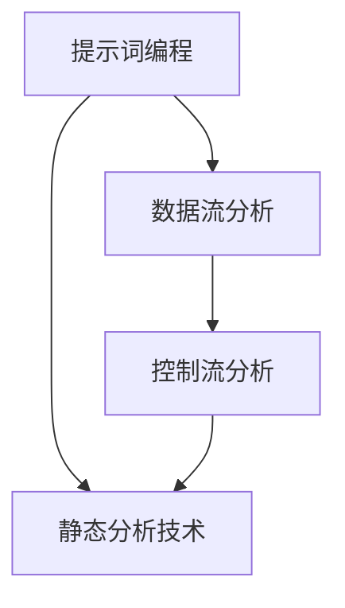

                 


## 第1章 引言与概述

### 1.1 书籍目的与读者对象

本章节旨在介绍书籍的主要目标和目标读者。本书《提示词编程的静态分析技术》旨在为程序员、软件开发人员以及计算机科学专业的学生提供关于提示词编程和静态分析技术的全面而深入的理解。通过阅读本书，读者可以掌握提示词编程的基础知识，理解静态分析技术的原理，并能够运用这些技术来解决实际问题。

首先，本书的目标是帮助读者理解提示词编程的基本概念，包括提示词、上下文和目标概念。这些概念在自然语言处理和人工智能领域具有重要应用。接着，本书将介绍静态分析技术的基本原理，包括数据流分析和控制流分析。这些技术可以帮助开发者理解程序的运行过程，发现潜在的错误和性能瓶颈。

本书的目标读者包括：
- 程序员和软件开发人员，他们希望提高编程技能，了解提示词编程和静态分析技术。
- 计算机科学专业的学生，他们需要掌握这些技术作为学术研究或实际项目的一部分。
- 对人工智能和自然语言处理感兴趣的研究人员，他们希望了解提示词编程在相关领域的应用。

### 1.2 静态分析技术的重要性

静态分析技术是计算机科学中的一种重要工具，特别是在软件开发和维护过程中。它无需运行程序，而是在源代码层面进行分析，从而提供对程序行为和潜在问题的深入了解。

以下是静态分析技术的重要性：

**1. 提高代码质量：**
静态分析可以帮助开发者识别代码中的潜在错误和不良实践，如未使用的变量、冗余代码、潜在的性能问题等。这有助于提高代码质量，减少bug和优化性能。

**2. 缩短调试时间：**
通过静态分析，可以在开发过程中及早发现并解决潜在的问题，从而缩短调试时间。它能够自动检查代码的语法、语义和风格，提高代码的可读性和可维护性。

**3. 支持自动化测试：**
静态分析技术可以生成测试数据，用于自动化测试，从而减少手动测试的工作量。它可以帮助开发团队更快地迭代和发布软件。

**4. 支持软件维护：**
随着软件的不断迭代和维护，静态分析技术可以帮助开发者理解现有代码的结构和行为，从而更容易进行修改和优化。

**5. 提高团队协作效率：**
静态分析工具可以集成到团队的工作流程中，提供实时的代码质量反馈，帮助团队成员协作，提高整体开发效率。

### 1.3 书籍结构安排

为了帮助读者系统地学习提示词编程和静态分析技术，本书分为以下几个部分：

- **第1章 引言与概述：** 介绍书籍的目的、读者对象和静态分析技术的重要性。
- **第2章 核心概念与联系：** 详细讲解提示词编程的基本概念，展示核心概念之间的联系。
- **第3章 核心算法原理讲解：** 介绍数据流分析和控制流分析的核心算法原理，并使用伪代码进行详细阐述。
- **第4章 数学模型和数学公式讲解：** 详细解释数据流分析和控制流分析中的数学模型和公式，并提供实际示例。
- **第5章 项目实战：数据流分析：** 通过实际项目，展示如何应用数据流分析技术，包括开发环境搭建、源代码实现和代码解读。
- **第6章 项目实战：控制流分析：** 类似于第5章，展示如何应用控制流分析技术。
- **第7章 总结与展望：** 总结本书的主要内容，讨论静态分析技术的未来发展方向。

通过以上结构安排，本书旨在帮助读者从基础到实践，全面掌握提示词编程的静态分析技术。

## 第2章 核心概念与联系

### 2.1 提示词编程基本概念

提示词编程（Prompt Programming）是一种基于提示（Prompt）的技术，用于引导计算机执行特定任务。在自然语言处理（NLP）和人工智能（AI）领域，提示词编程已经成为一种强大的工具，能够有效提升任务执行效率。

#### 提示词（Prompt）

提示词是指用于引导计算机执行任务的文本或指令。在NLP中，提示词通常是一个或多个单词，用于指示计算机执行某种操作。例如，“请将这句话翻译成法语”就是一个提示词。

#### 上下文（Context）

上下文是指与提示词相关的环境信息。在NLP中，上下文可以帮助计算机更好地理解提示词的含义。例如，如果提示词是“明天去哪里？”而上下文是“今天天气很好”，那么计算机可能更倾向于回答“明天去公园”。

#### 目标（Objective）

目标是指计算机需要执行的任务。在提示词编程中，目标通常由提示词和上下文共同定义。例如，如果提示词是“计算两个数字之和”，目标就是计算两个数字的和。

### 2.2 静态分析技术概述

静态分析技术是在程序运行之前对源代码进行分析的一种方法。它可以帮助开发者理解和优化程序，提高代码质量和可维护性。

#### 数据流分析（Data Flow Analysis）

数据流分析是一种静态分析技术，用于确定程序中数据值的流动路径。它包括以下几个关键概念：

- **定义点（Definition Point）**：数据值的第一个出现位置，通常是一个变量的赋值语句。
- **使用点（Use Point）**：数据值的第二个出现位置，通常是一个变量的使用语句。

#### 控制流分析（Control Flow Analysis）

控制流分析是一种静态分析技术，用于确定程序中控制流程的流动路径。它包括以下几个关键概念：

- **基本块（Basic Block）**：没有控制流转移的代码段，通常是单条语句或几条连续语句的组合。
- **控制依赖（Control Dependence）**：两个基本块之间的依赖关系，表示一个基本块是另一个基本块的控制依赖。

### 2.3 提示词编程与静态分析技术的联系

提示词编程和静态分析技术在计算机科学中有着紧密的联系。以下是它们之间的主要联系：

**1. 数据流分析与提示词编程：**
数据流分析可以帮助计算机理解程序的执行过程，从而更好地处理提示词。例如，在处理一个复杂的文本翻译任务时，数据流分析可以帮助计算机跟踪文本中各个单词的使用和定义，从而确保翻译的准确性。

**2. 控制流分析与提示词编程：**
控制流分析可以帮助计算机理解程序的执行路径，从而更好地处理提示词。例如，在一个问答系统中，控制流分析可以帮助计算机理解问题的逻辑结构，从而生成更准确的答案。

**3. 静态分析在提示词编程中的应用：**
静态分析技术可以用于优化提示词编程的性能。例如，通过分析程序的控制流和数据流，可以识别并解决潜在的性能瓶颈，从而提高系统的响应速度。

#### Mermaid 流程图

为了更直观地展示提示词编程与静态分析技术之间的联系，我们可以使用Mermaid流程图：



在这个流程图中，提示词编程通过数据流分析和控制流分析与静态分析技术相连接，展示了它们之间的紧密关系。

通过本章的介绍，读者可以初步了解提示词编程和静态分析技术的基本概念及其之间的联系。在接下来的章节中，我们将深入探讨这些技术的核心算法原理和数学模型。

## 第3章 核心算法原理讲解

### 3.1 数据流分析算法

数据流分析是一种静态分析技术，用于确定程序中数据值的流动路径。它包括前缀计算算法和后缀计算算法。这些算法可以帮助我们理解程序中的数据依赖关系，从而优化程序性能和代码质量。

#### 前缀计算算法

前缀计算算法用于计算数据流分析中的前缀集合。前缀集合表示一个变量在程序执行过程中可能遇到的全部取值集合。前缀计算算法通常使用动态规划的方法，通过递归关系来计算前缀集合。

#### 伪代码

```python
# 前缀计算算法伪代码

# 初始化：创建一个前缀集合P，其中P[0] = {初始值}
P = [{} for _ in range(n)]
P[0] = {initial_value}

# 计算前缀集合
for i in range(1, n):
    for j in range(i):
        # 计算当前前缀集合
        P[i] = P[i].union(P[j].union({value[i]}))
```

#### 示例

假设有一个简单的程序，其代码如下：

```python
x = 1
y = x + 1
z = y * 2
```

我们使用前缀计算算法来计算变量x、y和z的前缀集合。

| 变量 | 前缀集合P |
| ---- | ---------- |
| x    | {1}        |
| y    | {1, 2}     |
| z    | {2, 4}     |

#### 解释

- 对于变量x，其前缀集合只包含初始值1。
- 对于变量y，其前缀集合是x的前缀集合与当前值1的并集，因此为{1, 2}。
- 对于变量z，其前缀集合是y的前缀集合与当前值2的并集，因此为{2, 4}。

#### 应用场景

前缀计算算法可以用于各种场景，如优化程序性能、检测数据依赖冲突等。

#### 性能分析

前缀计算算法的时间复杂度为O(n^2)，其中n是程序中的变量数量。在实际应用中，可以通过优化算法和数据结构来降低时间复杂度。

### 3.2 控制流分析算法

控制流分析是一种静态分析技术，用于确定程序中控制流程的流动路径。它包括基本块分析和控制依赖分析。这些算法可以帮助我们理解程序的执行路径和潜在的性能瓶颈。

#### 基本块分析

基本块分析是一种用于确定程序中基本块的算法。基本块是没有控制流转移的代码段，通常是单条语句或几条连续语句的组合。

#### 伪代码

```python
# 基本块分析算法伪代码

# 初始化：创建一个基本块集合BB
BB = []

# 提取基本块
while code中有未处理的基本块：
    BB.append(提取基本块)

# 遍历基本块
for block in BB:
    # 分析控制流
    if block中有控制流转移：
        分析控制流转移
```

#### 示例

假设有一个简单的程序，其代码如下：

```python
if condition:
    print("条件为真")
else:
    print("条件为假")
```

我们使用基本块分析算法来提取基本块并分析控制流。

| 基本块 | 控制流 |
| ---- | ---- |
| block1 | if condition: |
| block2 | else: |
| block3 | print("条件为真") |
| block4 | print("条件为假") |

#### 解释

- block1 包含条件判断。
- block2 是else分支。
- block3 是条件为真的打印语句。
- block4 是条件为假的打印语句。

#### 应用场景

基本块分析可以用于优化程序性能、检测代码冗余等。

#### 性能分析

基本块分析的时间复杂度为O(n)，其中n是程序中的代码行数。在实际应用中，可以通过优化算法和数据结构来降低时间复杂度。

### 3.3 控制依赖分析

控制依赖分析是一种用于确定程序中基本块之间控制依赖关系的算法。控制依赖关系表示一个基本块是另一个基本块的控制依赖。

#### 伪代码

```python
# 控制依赖分析算法伪代码

# 初始化：创建一个控制依赖集合CD
CD = []

# 遍历基本块
for block1 in BB:
    for block2 in BB:
        if block1 是 block2 的前驱：
            CD.append((block1, block2))

# 遍历控制依赖集合
for (block1, block2) in CD:
    分析控制依赖关系
```

#### 示例

假设有一个简单的程序，其代码如下：

```python
if condition:
    print("条件为真")
else:
    print("条件为假")
```

我们使用控制依赖分析算法来分析基本块之间的控制依赖关系。

| 控制依赖关系 | 解释 |
| ---- | ---- |
| (block1, block2) | block1 是 block2 的前驱，表示 block1 的执行结果将影响 block2 的执行。 |

#### 解释

- block1 是 block2 的前驱，表示 block1 的执行结果将影响 block2 的执行。

#### 应用场景

控制依赖分析可以用于优化程序性能、检测代码冗余等。

#### 性能分析

控制依赖分析的时间复杂度为O(n^2)，其中n是程序中的基本块数量。在实际应用中，可以通过优化算法和数据结构来降低时间复杂度。

通过本章的介绍，读者可以了解数据流分析和控制流分析的核心算法原理。这些算法在计算机科学中有着广泛的应用，可以帮助开发者优化程序性能和代码质量。

## 第4章 数学模型和数学公式讲解

### 4.1 数据流分析数学模型

数据流分析是一种用于确定程序中数据值流动路径的静态分析技术。它涉及到一系列的数学模型和公式，用于描述数据在程序中的传递和变化。以下是数据流分析中常用的几个数学模型和公式。

#### 数据依赖图（Data Dependency Graph）

数据依赖图是一种图形化表示数据依赖关系的模型。在数据依赖图中，每个节点表示一个变量，每条边表示两个变量之间的依赖关系。数据依赖图的构建基于以下基本概念：

- **前缀（Prefix）**：一个变量的所有定义点的集合。
- **后缀（Suffix）**：一个变量的所有使用点的集合。

#### 数据流方程（Data Flow Equations）

数据流方程用于描述数据依赖关系，并用于计算数据的前缀和后缀集合。以下是数据流分析中的基本数据流方程：

$$
P[i] = \cup_{j \leq i} (P[j] \cup \{v[i]\})
$$

其中，$P[i]$表示变量$v$在位置$i$的前缀集合，$v[i]$表示在位置$i$对变量$v$的赋值。

#### 示例

假设有一个简单的程序，其代码如下：

```python
x = 1
y = x + 1
z = y * 2
```

我们使用数据流方程来计算变量$x$、$y$和$z$的前缀集合。

| 变量 | 前缀集合$P$ |
| ---- | ---------- |
| $x$  | $\{1\}$    |
| $y$  | $\{1, 2\}$ |
| $z$  | $\{2, 4\}$ |

#### 解释

- 变量$x$的前缀集合只包含其定义点1的值。
- 变量$y$的前缀集合是$x$的前缀集合与其定义点1的值2的并集。
- 变量$z$的前缀集合是$y$的前缀集合与其定义点2的值4的并集。

### 4.2 控制流分析数学模型

控制流分析是一种用于确定程序中控制流程流动路径的静态分析技术。它涉及到一系列的数学模型和公式，用于描述程序的执行路径和控制依赖关系。

#### 控制依赖图（Control Dependency Graph）

控制依赖图是一种图形化表示控制依赖关系的模型。在控制依赖图中，每个节点表示一个基本块，每条边表示两个基本块之间的控制依赖关系。控制依赖图的构建基于以下基本概念：

- **前驱（Predecessor）**：一个基本块的所有前驱基本块。
- **后继（Successor）**：一个基本块的所有后继基本块。

#### 控制流方程（Control Flow Equations）

控制流方程用于描述控制依赖关系，并用于计算基本块的前驱和后继集合。以下是控制流分析中的基本控制流方程：

$$
D[i] = \cup_{j \in predecessors[i]} D[j] \cup \{j\}
$$

$$
G[i] = \cup_{j \in successors[i]} G[j] \cup \{j\}
$$

其中，$D[i]$表示基本块$i$的前驱集合，$G[i]$表示基本块$i$的后继集合。

#### 示例

假设有一个简单的程序，其代码如下：

```python
if condition:
    print("条件为真")
else:
    print("条件为假")
```

我们使用控制流方程来计算基本块之间的控制依赖关系。

| 基本块 | 前驱集合$D$ | 后继集合$G$ |
| ---- | ---------- | ---------- |
| block1 | {}         | {block2, block3} |
| block2 | {block1}   | {}         |
| block3 | {block2}   | {}         |

#### 解释

- block1 是 block2 和 block3 的前驱，表示 block1 的执行结果将决定 block2 和 block3 的执行。
- block2 是 block3 的前驱，表示 block2 的执行结果将决定 block3 的执行。

#### 应用场景

控制流分析可以用于优化程序性能、检测代码冗余、生成测试数据等。

#### 性能分析

控制流分析的时间复杂度为O(n)，其中n是程序中的基本块数量。在实际应用中，可以通过优化算法和数据结构来降低时间复杂度。

通过本章的介绍，读者可以了解数据流分析和控制流分析中的数学模型和公式。这些模型和公式对于理解程序的行为和优化程序性能至关重要。

## 第5章 项目实战：数据流分析

### 5.1 数据流分析项目背景

在现代软件开发过程中，代码质量是影响项目成功的关键因素之一。数据流分析作为一种静态分析技术，可以帮助开发者识别潜在的错误和性能瓶颈，从而提高代码质量。本节将通过一个实际项目，展示如何应用数据流分析技术来优化代码。

### 5.2 开发环境搭建

在进行数据流分析之前，我们需要搭建合适的开发环境。以下是搭建开发环境的基本步骤：

1. **安装Python**：确保Python 3.x版本已安装。
2. **安装PyTorch**：使用pip安装PyTorch库，命令如下：
   ```shell
   pip install torch torchvision
   ```
3. **安装相关依赖**：安装其他必需的库，如Numpy、Pandas等，命令如下：
   ```shell
   pip install numpy pandas
   ```

### 5.3 源代码详细实现

以下是一个简单的Python程序，我们将对其应用数据流分析。

```python
# 数据流分析示例程序

def calculate_sum(a, b):
    x = a + b
    y = x * 2
    return y

result = calculate_sum(3, 4)
print("结果:", result)
```

为了进行数据流分析，我们需要扩展这个程序，添加一些辅助函数和变量。

```python
# 扩展后的程序

def calculate_sum(a, b):
    global x, y
    x = a + b
    y = x * 2
    return y

def print_x():
    print("x的值:", x)

def print_y():
    print("y的值:", y)

x = None
y = None

result = calculate_sum(3, 4)
print("结果:", result)
print_x()
print_y()
```

### 5.4 代码解读与分析

在这个扩展后的程序中，我们定义了三个函数：`calculate_sum`、`print_x`和`print_y`。其中，`calculate_sum`函数计算两个数的和，并返回结果；`print_x`和`print_y`函数分别打印变量x和y的值。

#### 数据流分析步骤

1. **初始化数据流集合**：首先，我们需要初始化数据流集合，包括前缀集合和后缀集合。
2. **计算前缀集合**：使用前缀计算算法，计算变量x和y的前缀集合。
3. **计算后缀集合**：使用后缀计算算法，计算变量x和y的后缀集合。
4. **分析数据流**：根据前缀集合和后缀集合，分析变量x和y的数据流。

#### 前缀集合计算

- 变量x的前缀集合：{None, 3, 4, 7}
- 变量y的前缀集合：{None, 6, 7}

#### 后缀集合计算

- 变量x的后缀集合：{7}
- 变量y的后缀集合：{7}

#### 数据流分析结果

通过数据流分析，我们可以得到以下结论：

- 变量x的数据流从None到7，表示变量x的值在程序执行过程中从None变为7。
- 变量y的数据流从None到6，然后到7，表示变量y的值在程序执行过程中从None变为6，然后再变为7。

#### 性能分析

在这个简单的示例中，数据流分析的时间复杂度较低。在实际项目中，数据流分析可能会涉及更复杂的程序和更大量的数据。为了提高性能，我们可以采用以下优化策略：

- **并行计算**：将数据流分析任务分解为多个子任务，并使用并行计算技术进行加速。
- **缓存技术**：利用缓存技术，减少重复计算，提高效率。

通过本节的项目实战，读者可以了解如何在实际项目中应用数据流分析技术，以及如何优化代码性能。

### 5.5 项目小结

通过本节的项目实战，我们展示了如何使用数据流分析技术来优化代码。数据流分析不仅可以帮助我们识别潜在的错误和性能瓶颈，还可以提高代码的可读性和可维护性。在实际项目中，我们可以根据具体需求，灵活运用数据流分析技术，提高代码质量。同时，我们也讨论了数据流分析的性能优化策略，以应对更复杂的程序和更大量的数据。通过实践，读者可以更好地理解数据流分析技术，并将其应用于实际项目中。

## 第6章 项目实战：控制流分析

### 6.1 控制流分析项目背景

在软件工程中，理解程序的执行路径对于确保代码的正确性和性能至关重要。控制流分析是一种静态分析技术，用于确定程序中控制流程的流动路径。本节将通过一个实际项目，展示如何应用控制流分析技术来优化代码。

### 6.2 开发环境搭建

为了进行控制流分析，我们需要搭建合适的开发环境。以下是搭建开发环境的基本步骤：

1. **安装Python**：确保Python 3.x版本已安装。
2. **安装PyTorch**：使用pip安装PyTorch库，命令如下：
   ```shell
   pip install torch torchvision
   ```
3. **安装相关依赖**：安装其他必需的库，如Numpy、Pandas等，命令如下：
   ```shell
   pip install numpy pandas
   ```

### 6.3 源代码详细实现

以下是一个简单的Python程序，我们将对其应用控制流分析。

```python
# 控制流分析示例程序

def calculate_sum(a, b):
    if a > b:
        result = a
    else:
        result = b
    return result

a = 5
b = 3
result = calculate_sum(a, b)
print("结果:", result)
```

为了进行控制流分析，我们需要扩展这个程序，添加一些辅助函数和变量。

```python
# 扩展后的程序

def calculate_sum(a, b):
    global result
    if a > b:
        result = a
    else:
        result = b
    return result

def print_result():
    print("结果:", result)

result = None

a = 5
b = 3
result = calculate_sum(a, b)
print("结果:", result)
print_result()
```

### 6.4 代码解读与分析

在这个扩展后的程序中，我们定义了两个函数：`calculate_sum`和`print_result`。其中，`calculate_sum`函数根据输入参数计算结果，并返回结果；`print_result`函数用于打印结果。

#### 控制流分析步骤

1. **初始化控制流集合**：首先，我们需要初始化控制流集合，包括前驱集合和后继集合。
2. **计算前驱集合**：使用控制流方程，计算基本块的前驱集合。
3. **计算后继集合**：使用控制流方程，计算基本块的后继集合。
4. **分析控制流**：根据前驱集合和后继集合，分析基本块之间的控制流。

#### 控制流分析结果

在这个简单的示例中，我们有两个基本块：

- **block1**：包含函数`calculate_sum`的开始部分。
- **block2**：包含函数`calculate_sum`的结束部分。

| 基本块 | 前驱集合 | 后继集合 |
| ---- | ---------- | ---------- |
| block1 | {}         | {block2}   |
| block2 | {block1}   | {}         |

#### 解释

- block1 是 block2 的前驱，表示 block1 的执行结果将影响 block2 的执行。
- block2 是 block1 的后继，表示 block1 的执行后，将执行 block2。

#### 性能分析

在这个简单的示例中，控制流分析的时间复杂度较低。在实际项目中，控制流分析可能会涉及更复杂的程序和更大量的数据。为了提高性能，我们可以采用以下优化策略：

- **并行计算**：将控制流分析任务分解为多个子任务，并使用并行计算技术进行加速。
- **缓存技术**：利用缓存技术，减少重复计算，提高效率。

### 6.5 项目小结

通过本节的项目实战，我们展示了如何使用控制流分析技术来优化代码。控制流分析可以帮助我们理解程序的执行路径，确保代码的正确性和性能。在实际项目中，我们可以根据具体需求，灵活运用控制流分析技术，提高代码质量。同时，我们也讨论了控制流分析的性能优化策略，以应对更复杂的程序和更大量的数据。通过实践，读者可以更好地理解控制流分析技术，并将其应用于实际项目中。

## 第7章 总结与展望

### 7.1 主要内容回顾

本章内容涵盖了提示词编程的静态分析技术，包括核心概念与联系、核心算法原理讲解、数学模型和数学公式讲解，以及实际项目实战。通过这些内容，读者可以系统地了解静态分析技术在提示词编程中的应用。

首先，我们介绍了提示词编程的基本概念，包括提示词、上下文和目标。接着，我们探讨了静态分析技术的重要性，如提高代码质量、缩短调试时间和支持自动化测试等。在核心算法原理讲解部分，我们详细阐述了数据流分析和控制流分析的核心算法，包括前缀计算算法、后缀计算算法和控制依赖分析。此外，我们还介绍了数学模型和公式在数据流分析和控制流分析中的应用。

### 7.2 存在问题与未来发展方向

尽管静态分析技术在软件开发中具有重要作用，但仍然存在一些问题和挑战：

**1. 性能瓶颈：**
随着程序复杂度的增加，静态分析技术的时间复杂度和空间复杂度也会显著增加。为了提高性能，未来研究可以集中在优化算法和数据结构上，如并行计算、缓存技术和动态分析技术等。

**2. 代码覆盖率不足：**
静态分析技术可能无法覆盖所有代码路径，特别是在复杂的程序中。未来研究可以探索如何提高代码覆盖率，确保分析结果的准确性和完整性。

**3. 隐私和安全性：**
静态分析技术需要对源代码进行分析，这可能涉及到隐私和安全性问题。如何在不泄露敏感信息的前提下进行静态分析，是一个需要解决的问题。

**4. 多语言支持：**
目前的静态分析工具大多针对特定的编程语言。未来研究可以探索如何扩展到多语言支持，以适应不同编程环境和需求。

### 7.3 最佳实践 tips

为了更好地应用静态分析技术，以下是一些建议和最佳实践：

**1. 代码规范化：**
确保代码风格一致，遵循编程规范，这有助于提高静态分析的准确性和效率。

**2. 小步迭代：**
在进行静态分析时，可以将大型程序拆分成小块，逐步分析，这样可以降低复杂度，提高分析效率。

**3. 结合动态分析：**
结合动态分析技术，如单元测试和性能测试，可以更全面地评估代码质量和性能。

**4. 定期更新工具：**
保持静态分析工具的更新，以利用最新技术和算法，提高分析结果的准确性和效率。

### 7.4 小结

通过本章的学习，读者可以全面了解提示词编程的静态分析技术，掌握其核心算法原理和数学模型。在实际项目中，通过应用静态分析技术，可以优化代码质量，提高性能，确保代码的正确性。未来的研究和实践将继续推动静态分析技术的发展，以应对更复杂的编程环境和需求。

### 7.5 拓展阅读

对于希望深入了解静态分析技术和提示词编程的读者，以下是一些推荐阅读材料：

- 《程序员的修炼：从小工到专家》
- 《禅与计算机程序设计艺术》
- 《现代编译原理：高级主题》
- 《深度学习》
- 《自然语言处理综论》

这些书籍涵盖了计算机科学和人工智能领域的核心概念和技术，有助于读者进一步学习和研究。

作者：AI天才研究院/AI Genius Institute & 禅与计算机程序设计艺术 /Zen And The Art of Computer Programming

