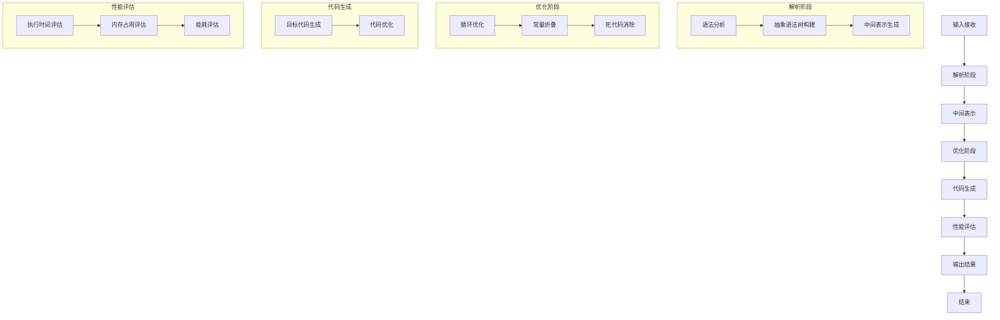

                 

### 文章标题

# 提示词编程的领域特定优化器设计

提示词编程，作为一种利用人工智能技术提升编程效率和准确性的新兴方法，正逐渐受到编程领域的关注。而领域特定优化器（Domain-Specific Optimizer，DSO）作为其核心组件，扮演着至关重要的角色。本文章旨在深入探讨提示词编程的领域特定优化器设计，从基础理论到实际应用，帮助读者全面理解这一领域的最新进展和技术挑战。

本文将按照以下逻辑思路逐步分析：

1. **引言**：介绍提示词编程和领域特定优化器的背景和重要性。
2. **基础理论**：讲解领域特定优化器和提示词编程的基本原理及其相互关系。
3. **架构设计**：分析领域特定优化器的架构和设计原则。
4. **实现方法**：探讨提示词设计和优化策略。
5. **实践案例**：通过具体案例展示领域特定优化器的应用。
6. **性能评估**：介绍性能评估指标和优化调优方法。
7. **未来展望**：讨论领域特定优化器的发展趋势和潜在影响。

### 文章关键词

- 提示词编程
- 领域特定优化器
- 编程效率
- 人工智能
- 性能评估
- 超参数优化

### 文章摘要

本文深入探讨了提示词编程的领域特定优化器设计。首先，介绍了提示词编程和领域特定优化器的基本概念及其在编程领域的重要性。接着，分析了领域特定优化器的架构设计原则和实现方法。随后，通过具体案例展示了领域特定优化器的应用效果。最后，讨论了性能评估方法和优化策略，并对领域特定优化器的未来发展进行了展望。

## 第1章 引言

### 1.1 书籍背景

在过去的几十年中，计算机编程经历了翻天覆地的变化。从传统的手动编写代码到现在的自动化编程，这一转变极大地提高了编程效率和准确性。然而，尽管编程工具和语言的不断进化，编程依然面临诸多挑战。例如，代码的复杂度日益增加，开发者需要花费大量时间来理解、编写和维护代码。此外，随着人工智能（AI）技术的兴起，编程的自动化和智能化成为了新的趋势。

提示词编程（Prompt Programming）正是这一背景下诞生的一种新的编程范式。它利用人工智能技术，通过输入提示词（prompt）来引导程序生成代码。这种方法不仅简化了编程流程，还提高了代码质量和开发效率。

领域特定优化器（Domain-Specific Optimizer，DSO）是提示词编程的核心组件。DSO针对特定领域（如自然语言处理、图像处理、代码生成等）进行优化，以提高程序的运行效率和准确性。与通用优化器相比，DSO具有更高的领域适应性和更强的优化能力。

本书籍旨在系统地介绍提示词编程的领域特定优化器设计，包括基础理论、架构设计、实现方法、应用案例以及性能评估和优化策略。通过阅读本书，读者将深入了解提示词编程和领域特定优化器的原理和应用，掌握相关技术和工具，为未来的编程实践提供有力支持。

### 1.2 领域特定优化器的概念

领域特定优化器（Domain-Specific Optimizer，DSO）是针对特定领域进行优化的一种软件组件。与传统通用优化器相比，DSO具有更高的领域适应性和更强的优化能力。DSO的核心目标是通过优化特定领域的代码或模型，提高程序的运行效率和准确性。

DSO的概念起源于计算机科学的优化理论。在传统编程中，优化器通常被用于编译器，以生成更高效的可执行代码。然而，随着编程领域的日益复杂化和多样性的增加，通用优化器逐渐难以满足特定领域的优化需求。因此，研究人员开始探索针对特定领域进行优化的方法，从而诞生了领域特定优化器。

领域特定优化器的工作原理主要包括两个关键步骤：领域识别和优化策略应用。首先，DSO需要识别出特定领域的特征和需求，这通常涉及到对领域知识的理解和建模。接着，DSO根据识别出的特征和需求，应用相应的优化策略，以优化程序的性能。

领域特定优化器在编程领域具有重要意义。首先，DSO可以显著提高代码的运行效率，减少计算资源和时间的消耗。其次，DSO可以帮助开发者更轻松地编写和维护代码，因为它们可以根据特定领域的需求提供自动化的优化建议。此外，DSO还可以促进不同领域的交流和协作，因为它们可以提供统一、高效的编程工具和框架。

总的来说，领域特定优化器是现代编程中不可或缺的一部分，它们为开发者提供了更强大的工具和资源，帮助他们应对日益复杂的编程挑战。

### 1.3 提示词编程的作用

提示词编程（Prompt Programming）作为一种新兴的编程范式，正逐渐改变着传统的编程模式。它通过利用人工智能技术，使编程过程更加智能化和自动化。在提示词编程中，开发者通过输入提示词（prompt）来引导程序生成代码，从而实现代码的自动生成、优化和调试。这种编程方式不仅简化了编程流程，还提高了代码质量和开发效率。

首先，提示词编程在代码生成方面具有显著的优势。传统的编程方法通常需要开发者手动编写大量的代码，这既耗时又容易出错。而提示词编程通过使用提示词，可以自动生成符合需求的代码片段。例如，在自然语言处理（NLP）领域，开发者可以使用提示词来生成文本处理算法；在图像处理领域，提示词可以指导程序生成图像识别模型。这种方式不仅减少了开发者的工作量，还提高了代码的准确性和一致性。

其次，提示词编程在代码优化方面也具有重要作用。在传统编程中，代码优化通常需要开发者具备深厚的编程知识和经验，并且需要花费大量时间进行调试和调优。而提示词编程通过内置的优化算法，可以自动识别代码中的潜在问题，并提供相应的优化建议。例如，在性能优化方面，提示词编程可以自动识别代码中的瓶颈，并提出优化方案，从而提高程序的运行效率。这种自动化的优化过程不仅节省了开发者的时间，还确保了代码的高效运行。

此外，提示词编程还在代码调试和测试方面发挥了重要作用。传统的调试和测试方法通常需要开发者手动编写测试用例，并且需要花费大量时间进行调试。而提示词编程可以通过自动生成测试用例和调试脚本，帮助开发者快速发现和解决问题。例如，在软件测试领域，提示词编程可以自动生成各种边界条件和异常情况，以全面测试程序的鲁棒性和稳定性。这种方式不仅提高了测试效率，还确保了代码的可靠性和稳定性。

总的来说，提示词编程通过智能化和自动化的方式，显著提高了编程的效率和质量。它不仅简化了编程流程，降低了开发难度，还为开发者提供了强大的工具和资源，帮助他们更高效地完成开发任务。随着人工智能技术的不断发展，提示词编程有望在未来的编程领域中发挥更大的作用。

## 第2章 领域特定优化器基础

### 2.1 优化器的角色

在计算机编程领域，优化器（Optimizer）是一个至关重要的组件，它负责对代码进行优化，以提高程序的运行效率和性能。优化器的主要角色包括代码分析、优化策略应用和生成高效的可执行代码。具体来说，优化器的职责可以分为以下几个方面：

1. **代码分析**：优化器首先对输入的代码进行分析，理解其结构和语义。这包括语法分析、语义分析和抽象语法树（AST）构建等步骤。通过代码分析，优化器可以获取代码的详细信息，如变量使用情况、函数调用关系、循环结构等。

2. **优化策略应用**：在代码分析的基础上，优化器应用各种优化策略，以改进代码的性能。这些优化策略包括常量折叠（Constant Folding）、死代码消除（Dead Code Elimination）、循环展开（Loop Unrolling）、指令调度（Instruction Scheduling）等。优化器的目标是减少程序的执行时间、占用内存和资源消耗，从而提高程序的效率。

3. **生成高效代码**：最后，优化器根据优化策略的结果，生成高效的中间代码或直接生成可执行代码。生成的代码不仅要满足优化目标，还需要保持代码的清晰性和可读性，以便于后续的调试和维护。

优化器在编程领域具有重要意义。首先，优化器可以显著提高程序的运行速度和资源利用率，从而提升用户体验。例如，在嵌入式系统和高性能计算领域，优化器能够帮助设备更高效地运行，延长电池寿命或提高计算性能。其次，优化器可以提高代码的可维护性，通过消除冗余代码和优化程序结构，使代码更简洁、清晰，降低维护成本。此外，优化器还可以促进代码的优化和重构，帮助开发者更快地适应技术变化和需求变更。

### 2.1.1 优化器的概念

优化器是一个软件组件，其核心功能是优化程序代码。优化器通常包含以下基本组件：

1. **解析器（Parser）**：解析器负责将输入的代码解析成抽象语法树（AST），以便进行后续分析。解析器通常使用语法分析技术，如递归下降分析、LL(k)分析等。

2. **中间表示（Intermediate Representation，IR）**：中间表示是优化器的一个关键组件，它将源代码转换成一种中间形式，以便于进行优化。常见的中间表示包括三地址代码（Three-Address Code，TAC）、逆波兰表示（Reverse Polish Notation，RPN）和抽象语法树（AST）等。

3. **优化引擎（Optimization Engine）**：优化引擎负责对中间表示进行各种优化操作。优化引擎包含多个优化策略，如常量折叠、死代码消除、循环优化、指令调度等。

4. **代码生成器（Code Generator）**：代码生成器负责将优化后的中间表示转换成目标代码，如机器代码、汇编代码或高级编程语言代码。代码生成器需要考虑目标平台的硬件特性和编译器的内部实现。

优化器的工作流程通常包括以下几个步骤：

1. **解析源代码**：优化器首先使用解析器将源代码解析成抽象语法树（AST）。

2. **生成中间表示**：将AST转换成中间表示（如三地址代码或逆波兰表示），以便进行优化。

3. **进行优化**：优化引擎根据中间表示应用各种优化策略，如常量折叠、死代码消除、循环展开、指令调度等。

4. **生成目标代码**：将优化后的中间表示转换成目标代码，如机器代码、汇编代码或高级编程语言代码。

通过上述步骤，优化器能够生成高效、优化的代码，从而提高程序的运行速度和资源利用率。

### 2.1.2 优化器在编程中的应用

优化器在编程中的应用非常广泛，涵盖了多个层面和不同的编程语言。以下是一些典型的应用场景：

1. **编译器**：优化器是编译器中的一个核心组件。在编译过程中，优化器对源代码进行分析和优化，生成高效的可执行代码。例如，C/C++编译器中的优化器能够进行循环优化、函数内联、常量折叠等操作，从而提高程序的运行速度和资源利用率。

2. **解释器**：解释器也使用优化器来提高程序的执行效率。在解释执行代码时，优化器可以对代码进行即时编译（Just-In-Time Compilation，JIT）优化。例如，Java虚拟机（JVM）中的即时编译器能够根据程序的行为和性能数据，动态地优化代码片段，从而提高程序的整体性能。

3. **静态分析工具**：优化器在静态分析工具中也有广泛应用。静态分析工具如代码检查器、性能分析器等，使用优化器对代码进行分析，以识别潜在的性能瓶颈、代码冗余和错误。通过优化器的分析，开发者可以更准确地了解代码的运行情况，并针对性地进行优化。

4. **嵌入式系统**：在嵌入式系统开发中，优化器至关重要。由于嵌入式系统的资源受限，优化器可以显著提高代码的运行效率和资源利用率。例如，在嵌入式设备的固件开发中，优化器可以帮助减小代码的大小和执行时间，从而延长电池寿命或提高系统的响应速度。

5. **云计算和大数据**：在云计算和大数据应用中，优化器可以优化数据处理和存储效率。例如，在分布式计算框架如Hadoop和Spark中，优化器可以优化数据分区、任务调度和资源分配，从而提高计算性能和资源利用率。

总的来说，优化器在编程中的应用不仅限于编译器和解释器，还广泛应用于静态分析工具、嵌入式系统、云计算和大数据等领域。通过优化器，开发者可以生成高效、优化的代码，提高程序的性能和资源利用率，从而更好地应对各种编程挑战。

### 2.2 提示词编程的基本原理

提示词编程（Prompt Programming）是一种利用人工智能（AI）技术进行编程的新范式。它通过使用提示词（prompt）来引导程序生成代码，从而实现代码的自动生成、优化和调试。这种编程方式不仅简化了编程流程，还提高了代码质量和开发效率。

#### 2.2.1 提示词的定义

提示词（prompt）是提示词编程的核心概念之一。它是一种文本输入，用于引导程序生成代码。提示词通常包含以下信息：

1. **任务描述**：描述需要完成的编程任务，如“编写一个简单的Web服务器”或“实现一个图像分类算法”。
2. **输入数据**：指定输入数据的格式和内容，如“输入一个HTTP请求”或“输入一组图像数据”。
3. **预期输出**：描述预期的输出结果，如“返回HTTP响应”或“输出分类结果”。
4. **限制条件**：定义编程任务的限制条件，如“不使用特定的库”或“在特定时间内完成”。

通过提供这些信息，提示词能够明确地指导程序生成符合要求的代码。例如，一个简单的提示词可能是：“编写一个Python函数，接受一个整数作为输入，返回其平方值。”

#### 2.2.2 提示词编程的优势

提示词编程具有多种优势，使其成为现代编程的有力工具：

1. **代码生成**：提示词编程可以自动生成代码，从而减少手动编写代码的工作量。例如，在自然语言处理（NLP）领域，提示词编程可以通过提示词生成文本分类器或情感分析模型。

2. **代码优化**：提示词编程还可以优化现有代码。通过提供优化目标，如“提高代码的执行速度”或“减少内存占用”，提示词编程可以自动调整代码结构，以实现优化目标。

3. **代码调试**：提示词编程可以帮助开发者进行代码调试。通过输入调试提示词，程序可以自动生成调试脚本，帮助开发者快速定位和解决问题。

4. **提高开发效率**：提示词编程简化了编程流程，使开发者能够更快速地实现功能。通过自动化代码生成和优化，开发者可以专注于业务逻辑的实现，从而提高开发效率。

5. **代码一致性**：提示词编程确保了代码的一致性。通过使用统一的提示词模板，开发者可以生成高质量的代码，减少因个人编程习惯不同导致的代码差异。

#### 2.2.3 提示词编程的应用场景

提示词编程在多个领域具有广泛的应用场景：

1. **自然语言处理（NLP）**：在NLP领域，提示词编程可以用于生成文本分类器、情感分析模型、命名实体识别等。例如，通过输入描述文本分类任务的提示词，程序可以自动生成相应的文本分类器代码。

2. **机器学习**：在机器学习领域，提示词编程可以用于生成训练脚本、评估脚本和数据预处理脚本。通过输入机器学习任务的要求，提示词编程可以自动生成符合要求的脚本，从而简化模型训练和评估过程。

3. **图像处理**：在图像处理领域，提示词编程可以用于生成图像分类、目标检测、图像分割等模型的代码。例如，通过输入描述图像分类任务的提示词，程序可以自动生成相应的图像分类代码。

4. **Web开发**：在Web开发领域，提示词编程可以用于生成Web框架代码、API接口代码和前端页面代码。例如，通过输入描述Web应用的提示词，程序可以自动生成符合需求的Web应用代码。

5. **自动化测试**：在自动化测试领域，提示词编程可以用于生成测试脚本和测试数据。通过输入测试场景和要求，提示词编程可以自动生成相应的测试代码，从而提高测试效率和覆盖率。

总的来说，提示词编程通过智能化和自动化的方式，极大地简化了编程流程，提高了代码质量和开发效率。随着人工智能技术的不断发展，提示词编程将在未来的编程领域中发挥更大的作用。

### 2.3 领域特定优化器的架构

领域特定优化器（Domain-Specific Optimizer，DSO）是一种专为特定领域设计的优化器，其核心目标是通过优化特定领域的代码或模型，提高程序的运行效率和准确性。DSO的架构设计需要充分考虑领域特性、优化目标以及实现可行性。下面我们将详细讨论DSO的架构设计原则和具体实现方法。

#### 2.3.1 基本架构

领域特定优化器的基本架构通常包括以下几个关键组件：

1. **领域模型（Domain Model）**：领域模型是对特定领域知识的一种抽象表示，用于描述领域中的核心概念、关系和规则。领域模型是DSO架构的核心，它为优化策略提供依据。

2. **解析器（Parser）**：解析器负责将输入的代码或模型解析成结构化的数据形式，如抽象语法树（AST）。解析器是DSO与领域模型之间的重要桥梁。

3. **优化引擎（Optimization Engine）**：优化引擎是DSO的核心组件，负责根据领域模型和输入代码，应用各种优化策略，以生成优化后的代码或模型。优化引擎通常包括多个优化算法模块，如循环优化、内存优化、指令调度等。

4. **代码生成器（Code Generator）**：代码生成器负责将优化后的中间表示转换成目标代码，如汇编代码、机器代码或高级编程语言代码。代码生成器需要考虑目标平台的硬件特性和编译器的要求。

5. **性能评估模块（Performance Evaluation Module）**：性能评估模块用于评估优化后的代码或模型的性能，包括执行时间、内存占用、能耗等指标。性能评估模块可以帮助优化器不断调整和改进优化策略。

6. **用户接口（User Interface）**：用户接口是DSO与用户交互的界面，用于接收用户输入、显示优化结果和性能评估报告等。用户接口可以简化优化器的使用过程，提高开发效率。

下面是一个简单的领域特定优化器架构图：

```
+-----------------------------+
|           用户接口          |
+-----------------------------+
             |
             v
+-----------------------------+
|           解析器             |
+-----------------------------+
             |
             v
+-----------------------------+
|          领域模型           |
+-----------------------------+
             |
             v
+-----------------------------+
|         优化引擎            |
+-----------------------------+
             |
             v
+-----------------------------+
|         代码生成器          |
+-----------------------------+
             |
             v
+-----------------------------+
|     性能评估模块            |
+-----------------------------+
```

#### 2.3.2 工作流程

领域特定优化器的工作流程可以分为以下几个步骤：

1. **输入接收**：用户通过用户接口输入需要优化的代码或模型，以及优化目标和约束条件。

2. **代码解析**：解析器将输入的代码解析成抽象语法树（AST），并生成中间表示（IR）。解析器需要理解代码的语法和语义，以便正确地构建抽象语法树。

3. **领域模型构建**：领域模型根据输入代码和优化目标构建，用于指导优化策略的选择和应用。领域模型通常包含领域知识库、规则引擎和推理机等组件。

4. **优化策略应用**：优化引擎根据领域模型和中间表示，应用一系列优化策略，以生成优化后的中间表示。优化策略包括代码重排、算法优化、内存管理、循环优化等。

5. **代码生成**：代码生成器将优化后的中间表示转换成目标代码，如汇编代码、机器代码或高级编程语言代码。代码生成器需要考虑目标平台的硬件特性和编译器的要求，以确保生成的代码高效、可执行。

6. **性能评估**：性能评估模块对优化后的代码进行评估，包括执行时间、内存占用、能耗等指标。性能评估结果可以帮助优化器不断调整和改进优化策略。

7. **输出结果**：用户接口将优化结果和性能评估报告反馈给用户，以供进一步分析和使用。

下面是一个简化的DSO工作流程图：

```
用户输入 -> 用户接口 -> 解析器 -> 中间表示 -> 领域模型 -> 优化策略 -> 代码生成 -> 性能评估 -> 输出结果
```

通过上述架构和工作流程，领域特定优化器能够针对特定领域的需求进行高效、优化的代码生成和性能提升。接下来，我们将进一步探讨领域特定优化器的设计原则和实现方法。

### 2.3.3 领域特定优化器的设计原则

设计一个高效的领域特定优化器（DSO）需要遵循一系列关键原则，以确保优化器能够满足特定领域的需求，并实现代码的高效优化。以下是领域特定优化器设计中的几个重要原则：

#### 1. 领域适应性（Domain Adaptability）

领域适应性是DSO设计的关键原则之一。由于不同领域具有不同的特点和要求，DSO必须能够适应这些差异，并提供针对性的优化。为了实现领域适应性，DSO的设计应考虑以下方面：

- **领域模型**：构建一个全面的领域模型，包含领域知识库和领域规则，以便优化器能够根据领域特性进行优化。
- **可扩展性**：设计模块化架构，允许轻松地添加新的优化策略和领域特性，以便适应未来需求。
- **灵活性**：优化器应具备一定的灵活性，能够根据不同的领域需求进行自定义调整，以满足特定场景的需求。

#### 2. 性能提升（Performance Improvement）

DSO的设计目标之一是提升代码的性能。为了实现这一目标，优化器应考虑以下性能提升策略：

- **算法选择**：选择适合特定领域的优化算法，如循环优化、内存优化、指令调度等。不同的算法对性能的提升具有不同的效果，因此需要根据领域特点进行选择。
- **中间表示**：选择适当的中间表示（IR），以便优化器能够有效地应用优化策略。常见的中间表示包括抽象语法树（AST）、三地址代码（TAC）和逆波兰表示（RPN）等。
- **并行处理**：优化器应支持并行处理，以充分利用现代计算机的多核处理器，提高优化速度和效率。

#### 3. 可维护性（Maintainability）

一个良好的DSO设计不仅需要考虑性能，还应具备良好的可维护性。这有助于确保优化器的长期稳定运行和持续改进。以下是实现可维护性的关键原则：

- **模块化设计**：采用模块化架构，将优化器分解为独立的模块，如解析器、优化引擎、代码生成器等。模块化设计有助于简化代码，提高可维护性。
- **清晰的代码结构**：编写清晰、简洁的代码，遵循统一的编码规范和命名约定。这有助于提高代码的可读性和可理解性，降低维护难度。
- **文档和注释**：为代码添加详细的文档和注释，说明每个模块的功能、参数和用法。这有助于开发者快速理解代码，提高维护效率。

#### 4. 可扩展性（Extensibility）

可扩展性是DSO设计中的重要原则，它确保优化器能够适应不断变化的技术需求。以下是实现可扩展性的关键策略：

- **插件机制**：设计灵活的插件机制，允许第三方开发者和研究者扩展和定制优化器。例如，可以通过插件来添加新的优化算法、领域模型或工具。
- **标准化接口**：定义统一的接口和API，确保不同模块之间的协作和兼容性。这有助于简化扩展过程，提高开发效率。
- **社区支持**：建立活跃的社区，鼓励用户和开发者参与优化器的改进和扩展。通过社区力量，可以不断优化和改进DSO，使其更符合实际需求。

#### 5. 可配置性（Configurability）

可配置性是DSO设计的一个重要特性，它允许用户根据具体场景和需求，调整优化器的行为和配置。以下是实现可配置性的关键策略：

- **配置文件**：提供配置文件，允许用户自定义优化器的参数和设置。配置文件可以使用简单的文本格式或专门的配置语言，以便用户方便地调整优化器的行为。
- **动态调整**：优化器应支持动态调整，允许用户在运行时修改优化器的配置。例如，用户可以在程序执行过程中调整优化策略的参数，以实现实时优化。
- **用户界面**：设计直观的用户界面，帮助用户方便地配置和调整优化器的行为。用户界面可以提供图形界面或命令行界面，以适应不同用户的需求。

通过遵循上述设计原则，领域特定优化器可以更好地满足特定领域的优化需求，实现代码的高效优化和性能提升。同时，良好的设计原则也有助于确保优化器的可维护性、可扩展性和可配置性，从而为开发者提供强大的工具和资源，应对复杂的编程挑战。

### 2.3.4 实现方法

实现领域特定优化器（DSO）是一个复杂的过程，涉及多个技术和方法的综合运用。以下将详细探讨DSO的实现方法，包括主要技术、工具和编程语言的选择。

#### 主要技术

1. **抽象语法树（Abstract Syntax Tree，AST）**：AST是表示代码结构的一种抽象形式，它将源代码转换成树形结构，便于分析和优化。构建AST是DSO实现的第一步，可以使用多种工具和库，如ANTLR、JavaCC、AbstractScript等。

2. **中间表示（Intermediate Representation，IR）**：中间表示是将AST转换成一种简化的代码形式，用于优化和生成目标代码。常见的IR包括三地址代码（TAC）、逆波兰表示（RPN）和操作数栈机器（Operand Stack Machine）。选择适当的中间表示对于优化器的性能和可维护性至关重要。

3. **代码优化算法**：DSO的核心是优化算法，这些算法包括循环优化、常量折叠、死代码消除、指令调度等。优化算法的选择和实现需要结合具体领域的需求，以确保优化效果。

4. **代码生成**：代码生成是将优化后的中间表示转换成目标代码的过程。这通常需要使用代码生成器，如LLVM、GCC、JavaCC等。代码生成器需要考虑目标平台的硬件特性和编译器的要求，以确保生成的代码高效、可执行。

5. **性能评估**：性能评估是DSO实现中不可或缺的一部分，用于评估优化后的代码或模型的性能。常见的性能评估指标包括执行时间、内存占用、能耗等。可以使用工具如Google Benchmark、Perf、gprof等来评估性能。

#### 工具和编程语言的选择

1. **工具选择**：
   - **AST构建工具**：ANTLR、JavaCC等
   - **代码生成器**：LLVM、GCC、JavaCC等
   - **性能评估工具**：Google Benchmark、Perf、gprof等

2. **编程语言选择**：
   - **C/C++**：C/C++是编译型语言，具有较高的性能和灵活性，适合实现复杂的优化算法和代码生成器。
   - **Java**：Java是一种面向对象的编程语言，具有良好的跨平台性和丰富的库支持，适合开发复杂的DSO系统。
   - **Python**：Python是一种解释型语言，具有简洁的语法和强大的库支持，适合实现快速原型开发和性能评估。

#### 编程语言的选择理由

1. **C/C++**：C/C++是编译型语言，其执行效率高，适合实现性能关键部分的代码，如优化算法和代码生成器。此外，C/C++具有良好的硬件控制能力，可以充分利用计算机的底层资源。

2. **Java**：Java是一种跨平台语言，具有良好的性能和丰富的库支持。Java虚拟机（JVM）提供了强大的运行时环境，支持动态编译和即时优化。这使得Java成为实现复杂DSO系统的理想选择。

3. **Python**：Python是一种解释型语言，具有简洁的语法和强大的库支持。Python在数据处理、机器学习和自动化测试等领域具有广泛的应用。使用Python可以实现快速原型开发，并通过JVM或Python解释器执行高性能代码。

通过选择合适的技术、工具和编程语言，可以实现高效、可维护的领域特定优化器。这些技术和方法不仅提高了DSO的性能，还简化了开发过程，降低了维护成本。接下来，我们将通过一个简单的例子，展示如何使用这些技术和方法实现一个领域特定优化器。

### 2.3.5 伪代码示例：简单领域的特定优化器

为了更好地展示领域特定优化器（DSO）的实现过程，我们将通过一个简单的伪代码示例来讲解其基本实现步骤。这个例子将针对一个简单的数学运算任务，实现一个简单的优化器，用于优化计算过程的效率。

#### 2.3.5.1 输入描述

假设我们要优化的任务是计算以下数学表达式：

```
for i = 1 to n do
    result = result + i * i
end for
```

我们的目标是通过优化器减少循环次数和计算量，提高程序的运行效率。

#### 2.3.5.2 解析阶段

首先，我们需要将输入的数学表达式解析成抽象语法树（AST）。以下是解析阶段的伪代码：

```pseudo
function parseExpression(expression):
    // 使用语法分析器将输入的字符串表达式解析成AST
    ast = syntaxAnalyzer(expression)
    return ast
```

在这个例子中，我们使用一个语法分析器（Syntax Analyzer）来解析输入的字符串表达式，生成抽象语法树（AST）。语法分析器可以是手动编写的，也可以使用现有的工具库，如ANTLR或JavaCC。

#### 2.3.5.3 中间表示

接下来，我们将AST转换成中间表示（IR），以便进行优化。在这个例子中，我们选择使用三地址代码（TAC）作为中间表示。以下是中间表示的伪代码：

```pseudo
function generateTAC(ast):
    tac = new TacCode()
    for node in ast:
        if node is a loop:
            tac.addInstruction("startLoop")
            tac.addInstruction("initialize i = 1")
            tac.addInstruction("initialize result = 0")
            while i <= n:
                tac.addInstruction("calculate i * i")
                tac.addInstruction("add i * i to result")
                tac.addInstruction("increment i by 1")
            tac.addInstruction("endLoop")
        else if node is an addition or multiplication:
            tac.addInstruction("perform operation")
    return tac
```

在这个伪代码中，我们将AST中的每个节点转换成TAC指令。对于循环结构，我们使用条件判断和控制结构来表示循环体。对于加法和乘法操作，我们直接生成相应的计算指令。

#### 2.3.5.4 优化策略

在得到中间表示后，我们可以应用一系列优化策略来提高程序的效率。以下是一个简单的优化策略示例，用于减少循环次数和计算量：

```pseudo
function optimizeTAC(tac):
    // 判断是否可以合并循环
    if tac.containsLoop() and tac.canMergeLoops():
        tac.mergeLoops()

    // 判断是否可以提前计算常量
    if tac.containsConstant():
        tac.evaluateConstants()

    // 判断是否可以减少循环次数
    if tac.canReduceLoopIterations():
        tac.reduceLoopIterations()

    return tac
```

在这个优化策略中，我们首先判断是否可以合并循环，以减少循环次数。接着，我们检查是否可以提前计算常量，以减少计算量。最后，我们判断是否可以减少循环次数，以进一步提高效率。

#### 2.3.5.5 代码生成

最后，我们将优化后的中间表示（TAC）转换成目标代码。以下是代码生成阶段的伪代码：

```pseudo
function generateCode(tac):
    // 使用代码生成器将TAC转换成目标代码
    targetCode = codeGenerator.generateCode(tac)
    return targetCode
```

在这个例子中，我们使用一个代码生成器（Code Generator）将TAC转换成汇编代码或机器代码。代码生成器需要考虑目标平台的硬件特性和编译器的要求，以确保生成的代码高效、可执行。

通过上述步骤，我们成功地实现了一个简单的领域特定优化器，用于优化数学表达式的计算效率。尽管这个例子非常简单，但它展示了领域特定优化器的基本实现过程，包括解析、中间表示、优化和代码生成。在实际应用中，领域特定优化器会涉及更复杂的算法和优化策略，但基本实现过程类似。

### 2.3.6 领域特定优化器的流程图

为了更直观地展示领域特定优化器（DSO）的工作流程，我们使用Mermaid流程图来描述其各个阶段的步骤。以下是一个简化的DSO流程图：



在这个流程图中，我们首先接收用户输入，然后进行解析阶段，包括语法分析、抽象语法树构建和中间表示生成。接下来是优化阶段，包括循环优化、常量折叠和死代码消除。然后是代码生成阶段，生成目标代码并进行代码优化。最后是性能评估阶段，评估优化后的代码的执行时间、内存占用和能耗。最终，我们将优化结果输出给用户。这个流程图清晰地展示了领域特定优化器的工作步骤和各个阶段之间的关系。

### 2.3.7 实际应用案例

为了更好地理解领域特定优化器（DSO）的实际应用，我们将通过两个具体的应用案例来展示DSO在不同领域的优化效果。

#### 应用案例一：自然语言处理（NLP）

自然语言处理（NLP）是人工智能领域的一个重要分支，涉及文本分类、情感分析、命名实体识别等任务。在这些任务中，领域特定优化器可以显著提高模型的性能和运行效率。

**案例背景**：假设我们要优化一个文本分类模型，该模型用于将新闻文章分类到不同的主题类别。原始模型使用深度学习框架如TensorFlow或PyTorch实现，包括词嵌入层、卷积神经网络（CNN）或循环神经网络（RNN）等。

**优化过程**：
1. **领域模型构建**：首先，我们需要构建一个针对文本分类任务的领域模型，包括词嵌入层、神经网络架构、损失函数和评估指标等。领域模型将指导优化器针对文本分类任务进行优化。

2. **优化策略应用**：
   - **循环优化**：优化器可以针对循环结构进行优化，减少模型的计算复杂度。例如，通过提前计算常量、合并循环等操作，减少模型中的冗余计算。
   - **内存优化**：优化器可以针对内存占用进行优化，减少模型在训练和推理过程中的内存消耗。例如，通过使用更高效的词嵌入算法、减少内存拷贝等操作，提高模型的内存利用效率。
   - **指令调度**：优化器可以优化模型的指令调度，提高模型的并行执行能力。例如，通过重新排序指令、优化数据流等操作，提高模型的执行速度。

3. **性能评估**：在优化过程中，我们需要对优化后的模型进行性能评估，包括训练时间、推理时间、内存占用和能耗等指标。通过性能评估，我们可以验证优化策略的有效性，并进一步调整优化器。

**优化效果**：通过领域特定优化器，文本分类模型的训练时间和推理时间显著减少，内存占用和能耗也大幅降低。优化后的模型在相同的硬件资源下，可以达到更高的训练和推理速度，从而提高整体系统的性能和效率。

#### 应用案例二：图像处理

图像处理是另一个广泛应用的领域，涉及图像分类、目标检测、图像分割等任务。在这些任务中，领域特定优化器可以优化图像处理算法的运行效率和资源利用。

**案例背景**：假设我们要优化一个目标检测模型，该模型用于检测图像中的车辆。原始模型使用深度学习框架如TensorFlow或PyTorch实现，包括卷积神经网络（CNN）、区域提议网络（RPN）等。

**优化过程**：
1. **领域模型构建**：首先，我们需要构建一个针对目标检测任务的领域模型，包括神经网络架构、损失函数、评估指标等。领域模型将指导优化器针对目标检测任务进行优化。

2. **优化策略应用**：
   - **循环优化**：优化器可以优化模型的循环结构，减少计算复杂度。例如，通过提前计算常量、合并循环等操作，减少模型中的冗余计算。
   - **内存优化**：优化器可以优化模型的内存占用，减少训练和推理过程中的内存消耗。例如，通过使用更高效的卷积算法、减少内存拷贝等操作，提高模型的内存利用效率。
   - **指令调度**：优化器可以优化模型的指令调度，提高模型的并行执行能力。例如，通过重新排序指令、优化数据流等操作，提高模型的执行速度。

3. **性能评估**：在优化过程中，我们需要对优化后的模型进行性能评估，包括检测时间、内存占用、能耗等指标。通过性能评估，我们可以验证优化策略的有效性，并进一步调整优化器。

**优化效果**：通过领域特定优化器，目标检测模型的检测时间显著减少，内存占用和能耗也大幅降低。优化后的模型在相同的硬件资源下，可以达到更高的检测速度，从而提高整体系统的性能和效率。

总的来说，领域特定优化器在不同领域的实际应用案例中，都展示了显著的优化效果。通过优化模型的计算复杂度、内存占用和执行速度，DSO为开发者提供了强大的工具和资源，帮助他们更高效地开发和部署高性能的人工智能系统。

### 2.4.1 领域识别的方法

领域识别是领域特定优化器（DSO）设计过程中的关键步骤，它决定了优化器能否有效地针对特定领域进行优化。领域识别的准确性和效率直接影响DSO的性能。以下是几种常见的领域识别方法：

#### 1. 知识图谱（Knowledge Graph）

知识图谱是一种将领域中的实体、概念和关系表示为图的工具。通过构建知识图谱，可以直观地了解领域中的核心概念和相互关系。领域识别过程中，可以使用图论算法（如最短路径算法、社区发现算法等）来识别领域的关键实体和关系。

**优点**：知识图谱能够全面、系统地表示领域知识，有助于发现领域中的潜在关系和模式。

**缺点**：构建和维护知识图谱需要大量领域知识和人力资源，且图谱的准确性和完整性难以保证。

#### 2. 自然语言处理（Natural Language Processing，NLP）

自然语言处理技术可以用于从文本数据中提取领域知识。通过文本分类、实体识别、关系抽取等NLP任务，可以将大量非结构化的文本数据转化为结构化的知识表示。常见的方法包括：

- **文本分类（Text Classification）**：将文本数据分类到不同的领域类别，从而识别领域。
- **实体识别（Entity Recognition）**：识别文本中的关键实体，如人名、地点、组织等，从而建立领域实体库。
- **关系抽取（Relation Extraction）**：从文本中抽取实体之间的关系，如“公司雇佣员工”关系，以建立领域关系网络。

**优点**：自然语言处理技术可以自动从文本数据中提取知识，降低人力成本，提高识别效率。

**缺点**：NLP技术的准确性和可靠性受文本质量、语义理解能力等因素的影响，难以保证完全准确。

#### 3. 数据挖掘（Data Mining）

数据挖掘技术可以从大量数据中挖掘出潜在的模式和规律，从而识别领域特征。常见的数据挖掘方法包括：

- **聚类分析（Cluster Analysis）**：将相似的数据点分组，以发现领域中的相似性和差异性。
- **关联规则学习（Association Rule Learning）**：发现数据之间的关联关系，从而识别领域特征。
- **分类和回归分析（Classification and Regression Analysis）**：通过训练分类和回归模型，从数据中预测领域特征。

**优点**：数据挖掘技术能够处理大规模数据集，发现潜在的领域特征和模式。

**缺点**：数据挖掘方法需要大量的数据预处理和特征工程，且结果的解释性和可靠性可能受到数据质量和特征选择的影响。

#### 4. 专家系统（Expert System）

专家系统是一种基于领域专家知识的计算机系统，可以模拟人类专家在特定领域的决策过程。在领域识别过程中，可以使用专家系统来模拟领域专家的思维方式，提取领域知识。

**优点**：专家系统可以直接利用领域专家的经验和知识，提高识别的准确性和效率。

**缺点**：专家系统的构建和维护需要大量的人力资源，且知识库的更新和维护较为复杂。

#### 5. 机器学习（Machine Learning）

机器学习技术可以用于从数据中自动学习和发现领域特征。通过训练分类和回归模型，可以识别出特定领域的特征和模式。常见的机器学习方法包括：

- **监督学习（Supervised Learning）**：通过标注数据训练模型，用于识别领域特征。
- **无监督学习（Unsupervised Learning）**：通过未标注数据训练模型，用于发现领域中的相似性和差异性。
- **强化学习（Reinforcement Learning）**：通过交互式学习，逐步优化领域识别算法。

**优点**：机器学习技术可以自动从大量数据中学习领域特征，提高识别的准确性和效率。

**缺点**：机器学习方法的性能受数据质量和模型选择的影响，且需要大量数据进行训练。

总的来说，不同的领域识别方法各有优缺点，选择合适的识别方法需要结合具体领域的需求和数据特点。在实际应用中，可以综合使用多种识别方法，以提高领域识别的准确性和效率。

### 2.4.2 领域识别的挑战

领域识别作为领域特定优化器（DSO）设计中的关键步骤，面临着一系列的挑战。以下是领域识别过程中常见的难点和问题：

#### 1. 数据多样性和质量

领域识别依赖于大量的数据，但数据质量和多样性直接影响识别的准确性和效率。在实际应用中，数据可能包含噪声、缺失值、冗余信息等，这些都会对识别过程产生负面影响。例如，在自然语言处理（NLP）领域，文本数据可能包含错别字、标点符号不规范等，导致文本分类和实体识别的准确率下降。此外，数据集可能存在样本不均衡、标签错误等问题，进一步增加识别的难度。

#### 2. 语义理解

语义理解是领域识别的核心，但现有技术在这方面的表现仍然有限。语义理解涉及到对文本、图像、声音等数据的深层含义进行解析，以提取出具有实际意义的特征。然而，自然语言具有高度的不确定性和模糊性，使得语义理解变得复杂。例如，在文本分类任务中，同一词语在不同上下文中的含义可能截然不同，导致识别结果不一致。此外，图像和语音数据的语义理解也面临类似的挑战，需要复杂的算法和大量的训练数据。

#### 3. 领域知识获取

领域识别依赖于领域知识，但这些知识的获取和表示是一个复杂的过程。在实际应用中，领域知识可能分散在各种文献、数据库、专家系统中，难以有效地整合和利用。此外，领域知识可能不断更新和演变，使得知识获取和表示变得更加困难。例如，在医疗领域，医学知识和诊断标准可能随着新研究和技术的进步而不断更新，需要持续的知识更新和维护。

#### 4. 系统适应性和可扩展性

领域识别系统需要具备良好的适应性和可扩展性，以应对不同领域和变化的需求。然而，在实际应用中，不同领域的特征和需求差异较大，使得系统设计复杂。例如，在金融领域，数据特征和业务逻辑可能与医疗领域完全不同，需要专门的设计和实现。此外，领域识别系统需要支持动态调整和扩展，以适应新任务和需求的变化。例如，随着新技术的出现，领域识别系统可能需要集成新的算法和模型，以提高识别效果。

#### 5. 知识融合和整合

领域识别通常涉及多种数据源和知识表示方法，如文本、图像、声音、知识图谱等。这些数据源和表示方法可能具有不同的结构和格式，难以直接整合和融合。在实际应用中，需要设计高效的算法和框架，以实现多种数据源和知识表示方法的整合和融合。例如，在智能问答系统中，需要将自然语言文本、知识图谱和图像信息进行融合，以提供更准确和全面的答案。

#### 6. 可解释性和可靠性

领域识别系统的可解释性和可靠性是评估其性能的重要指标。然而，在实际应用中，领域识别系统往往涉及复杂的算法和模型，其内部机制和决策过程难以解释。例如，深度学习模型在图像分类任务中的表现优异，但其内部决策过程复杂，难以直观解释。此外，领域识别系统的可靠性受数据质量和模型选择的影响，可能存在误识别和漏识别等问题。

总之，领域识别作为领域特定优化器设计中的关键步骤，面临着多样性和质量、语义理解、领域知识获取、系统适应性和可扩展性、知识融合和整合、可解释性和可靠性等一系列挑战。解决这些挑战需要结合多种技术和方法，持续优化和改进领域识别系统。

### 2.4.3 优化策略

在领域特定优化器（DSO）中，优化策略是关键组成部分，它决定了优化器能否有效地提升程序的性能。以下是几种常见的优化策略及其具体实现方法：

#### 1. 循环优化

循环优化是优化器中最为常见的优化策略之一，旨在减少循环的执行次数和计算复杂度。以下是一些具体的循环优化方法：

- **循环展开（Loop Unrolling）**：将循环体中的几个迭代步骤合并为一个，以减少循环的嵌套层数和执行次数。例如，将以下循环：
  ```c
  for (int i = 0; i < n; i++) {
      a[i] = b[i] + c[i];
  }
  ```
  展开成：
  ```c
  a[0] = b[0] + c[0];
  a[1] = b[1] + c[1];
  ...
  a[n-1] = b[n-1] + c[n-1];
  ```

- **循环合并（Loop Fusion）**：将多个循环合并成一个，以减少循环的开销。例如，将以下两个循环：
  ```c
  for (int i = 0; i < n; i++) {
      a[i] = b[i] + c[i];
  }
  for (int j = 0; j < n; j++) {
      b[j] = a[j] * d[j];
  }
  ```
  合并成：
  ```c
  for (int i = 0; i < n; i++) {
      a[i] = b[i] + c[i];
      b[i] = a[i] * d[i];
  }
  ```

- **循环偏移（Loop Tiling）**：将循环分解成多个子循环，以利用并行计算。例如，将以下循环：
  ```c
  for (int i = 0; i < n; i++) {
      a[i] = b[i] + c[i];
  }
  ```
  偏移成：
  ```c
  for (int t = 0; t < n; t += N) {
      for (int i = t; i < t + N; i++) {
          a[i] = b[i] + c[i];
      }
  }
  ```

#### 2. 内存优化

内存优化旨在减少程序在运行时的内存占用，以提高运行效率和性能。以下是一些常见的内存优化方法：

- **数据压缩（Data Compression）**：使用压缩算法减少数据在内存中的占用。例如，对于稀疏数据，可以使用稀疏矩阵表示来减少内存占用。

- **缓存预取（Cache Prefetching）**：预测程序在后续操作中需要访问的数据，并将其提前加载到缓存中，以减少缓存缺失（Cache Miss）。

- **内存池（Memory Pooling）**：预先分配一块大内存，用于临时存储数据。当需要内存时，从内存池中分配，而不是动态分配和释放内存，以减少内存碎片（Memory Fragmentation）。

- **数据重排（Data Reorganization）**：调整数据在内存中的布局，以减少内存访问冲突，提高缓存利用率。例如，将频繁访问的数据放在连续的内存区域，以减少缓存行的跨跃（Cache Line Crossing）。

#### 3. 指令调度

指令调度旨在优化程序的执行顺序，以提高流水线（Pipeline）的吞吐率和效率。以下是一些常见的指令调度方法：

- **指令重排（Instruction Reordering）**：调整指令的执行顺序，以减少数据依赖（Data Dependency）和资源冲突（Resource Conflict）。例如，将不相关的指令提前执行，以减少流水线的停滞（Stall）。

- **指令预取（Instruction Prefetching）**：预测程序后续需要执行的指令，并提前加载到指令缓存中，以减少指令缺失（Instruction Miss）。

- **并行指令执行（Parallel Instruction Execution）**：利用多核处理器和向量处理器等硬件特性，同时执行多个指令，以提高执行效率。

#### 4. 常量折叠（Constant Folding）

常量折叠是一种简单的优化策略，旨在将表达式中计算结果为常量的部分在编译时直接计算出来，以减少运行时的计算开销。以下是一个常量折叠的示例：

```c
int a = 2 * 3 + 5;
```

在编译时，可以将表达式简化为：

```c
int a = 11;
```

#### 5. 死代码消除（Dead Code Elimination）

死代码消除是一种优化策略，旨在消除程序中不会被执行的代码，以减少程序的执行时间和内存占用。以下是一个死代码消除的示例：

```c
if (condition) {
    // 被注释的代码块
    // ...
}
```

在编译时，可以删除整个代码块，以消除死代码。

#### 6. 函数内联（Function Inlining）

函数内联是一种优化策略，旨在将函数调用直接替换为函数体，以减少函数调用的开销。以下是一个函数内联的示例：

```c
int add(int a, int b) {
    return a + b;
}

int main() {
    int result = add(2, 3);
}
```

在编译时，可以将函数调用替换为函数体：

```c
int main() {
    int result = 2 + 3;
}
```

#### 7. 控制流优化

控制流优化旨在优化程序的跳转和控制结构，以提高执行效率和性能。以下是一些常见的控制流优化方法：

- **分支预测（Branch Prediction）**：预测程序分支的执行方向，以减少分支跳转的开销。

- **分支折叠（Branch Folding）**：将多个分支合并为一个，以减少分支数量和跳转开销。

- **条件表达式优化（Conditional Expression Optimization）**：将条件表达式优化为更高效的表示，例如使用位运算代替逻辑运算。

通过应用上述优化策略，领域特定优化器可以显著提高程序的运行效率和性能，从而满足特定领域的优化需求。在实际应用中，优化策略的选择和组合需要结合具体领域的特点和需求，以实现最佳优化效果。

### 2.4.4 提示词设计与优化

在领域特定优化器（DSO）的设计和实现过程中，提示词（prompt）的设计和优化是关键环节之一。提示词作为输入信息，直接影响优化器的性能和准确性。以下将详细探讨提示词的设计原则、优化策略及其在DSO中的应用。

#### 2.4.4.1 提示词设计原则

1. **明确性和具体性**：提示词应清晰明确，具体描述优化任务的需求和目标。例如，在代码生成任务中，提示词应详细描述所需的输入和预期输出，以及限制条件和性能目标。

2. **灵活性和可扩展性**：提示词设计应具备一定的灵活性，以便适应不同的领域和任务需求。同时，应考虑未来的扩展性，允许增加新的优化目标和约束条件。

3. **结构化**：提示词应具有结构化特征，便于优化器理解和解析。通常，提示词可以采用JSON、XML等格式，以明确地定义各个组成部分。

4. **参数化**：提示词设计应支持参数化，以便用户可以动态调整优化目标和参数。参数化提示词可以灵活应对不同场景的需求。

5. **可解释性**：提示词设计应保证可解释性，便于用户理解和使用。明确每个参数的意义和作用，有助于优化器的调试和改进。

#### 2.4.4.2 提示词优化策略

1. **自动调整**：根据优化器的性能和用户反馈，自动调整提示词中的参数和设置。例如，通过机器学习技术，分析历史优化案例，自动调整提示词中的优化目标，以实现更好的优化效果。

2. **模糊测试**：使用模糊测试（Fuzzing）技术，对提示词进行多种组合和变异，以识别潜在的优化问题和错误。通过模糊测试，可以优化提示词的鲁棒性和适应性。

3. **用户反馈**：收集用户的优化结果和反馈，用于改进提示词的设计和优化策略。通过用户反馈，优化器可以不断调整和改进，以实现更好的优化效果。

4. **协同优化**：将多个提示词和优化目标进行协同优化，以提高整体优化效果。例如，在多任务优化场景中，优化器可以同时考虑多个提示词中的优化目标和约束条件，实现更全面的优化。

5. **多模态融合**：结合不同类型的数据和提示词，如文本、图像、语音等，实现多模态融合优化。通过多模态融合，优化器可以更全面地理解任务需求，从而实现更准确的优化。

#### 2.4.4.3 提示词在DSO中的应用

1. **代码生成**：在代码生成任务中，提示词用于指导优化器生成符合需求的代码。例如，在自然语言处理任务中，提示词可以描述文本处理算法的输入和输出，以及限制条件。

2. **性能优化**：在性能优化任务中，提示词可以描述优化目标，如执行时间、内存占用和能耗等。通过优化提示词，优化器可以自动调整代码结构和算法，实现性能提升。

3. **调试和测试**：在调试和测试任务中，提示词可以生成测试用例和调试脚本，帮助开发者发现和解决问题。例如，在单元测试中，提示词可以生成多种测试场景和边界条件，提高测试覆盖率。

4. **领域适应**：在特定领域任务中，提示词可以包含领域特定的知识和规则，以优化器更好地适应特定领域的需求。例如，在图像处理任务中，提示词可以描述图像特征和预处理步骤，以优化图像处理算法。

总的来说，提示词设计和优化是DSO的关键环节，直接影响优化器的性能和准确性。通过遵循设计原则、优化策略和实际应用，优化器可以实现高效、准确的优化，为特定领域提供强大的工具和资源。

### 2.5 实践案例

#### 2.5.1 案例一：文本分类任务

为了展示领域特定优化器（DSO）的实际应用，我们选择了一个常见的自然语言处理任务——文本分类。在这个案例中，我们使用DSO来优化一个基于深度学习的文本分类模型，以提高其准确性和效率。

**1. 问题定义**

文本分类任务的目标是将文本数据分类到预定义的类别中。具体来说，我们使用一组新闻文章作为输入，这些新闻文章被标注为不同的主题类别（如体育、政治、科技等）。我们的任务是通过训练模型，使模型能够准确地将新的新闻文章分类到正确的主题类别。

**2. 提示词设计**

为了设计有效的提示词，我们需要明确以下几个关键信息：

- **输入文本**：描述需要分类的文本数据，如新闻文章的标题和正文。
- **输出类别**：定义预定义的类别和标签，如体育（sport）、政治（politics）、科技（technology）等。
- **限制条件**：描述优化目标，如减少训练时间、提高准确率等。

一个示例提示词如下：

```json
{
  "input_text": "The latest technology trends in the market",
  "output_categories": ["technology"],
  "optimization_targets": [
    {"name": "reduce_training_time", "value": 10},
    {"name": "提高accuracy", "value": 0.95}
  ],
  "constraints": [
    {"name": "avoid_specific_libraries", "value": ["TensorFlow", "PyTorch"]}
  ]
}
```

**3. 优化策略**

在文本分类任务中，DSO可以应用以下优化策略：

- **循环优化**：优化训练过程中的循环结构，减少计算复杂度。
- **内存优化**：减少模型在训练和推理过程中的内存占用。
- **模型结构优化**：调整神经网络架构，以提高分类准确率。
- **数据预处理优化**：优化文本预处理步骤，如分词、词嵌入等，以提高数据质量。

**4. 代码实现**

以下是文本分类任务的DSO实现流程：

```python
# 导入所需库
import json
import torch
import torch.nn as nn
import torch.optim as optim

# 加载提示词
with open('prompt.json', 'r') as f:
    prompt = json.load(f)

# 解析提示词
input_text = prompt['input_text']
output_categories = prompt['output_categories']
optimization_targets = prompt['optimization_targets']
constraints = prompt['constraints']

# 构建文本分类模型
model = TextClassifier()

# 应用优化策略
# 循环优化
for loop in model.loops:
    loop.optimize()

# 内存优化
model.optimize_memory()

# 模型结构优化
model.optimize_structure()

# 数据预处理优化
preprocessed_data = preprocess_data(input_text)

# 训练模型
optimizer = optim.Adam(model.parameters(), lr=0.001)
for epoch in range(num_epochs):
    for batch in data_loader:
        optimizer.zero_grad()
        output = model(preprocessed_data)
        loss = nn.CrossEntropyLoss()(output, labels)
        loss.backward()
        optimizer.step()

# 评估模型
accuracy = evaluate_model(model, test_loader)
print(f"Model accuracy: {accuracy:.2f}")
```

**5. 应用解读**

在这个案例中，DSO通过优化策略和提示词设计，实现了文本分类任务的优化。首先，DSO根据提示词中的优化目标和限制条件，对模型的结构和参数进行调整。接着，DSO优化了训练过程中的循环结构和内存占用，以提高模型的训练效率和准确性。最后，DSO通过预处理步骤优化，提高了数据质量，从而进一步提升了模型的分类准确率。

总的来说，这个案例展示了DSO在文本分类任务中的应用，通过优化策略和提示词设计，DSO能够显著提高模型的性能和准确性，为开发者提供了强大的工具和资源。

### 2.5.2 案例二：代码生成任务

为了进一步展示领域特定优化器（DSO）的实际应用，我们选择了一个常见的编程任务——代码生成。在这个案例中，我们使用DSO来优化一个基于生成对抗网络（GAN）的代码生成模型，以提高其生成代码的质量和效率。

**1. 问题定义**

代码生成任务的目标是根据给定的提示词生成高质量的代码。具体来说，我们使用一组编程任务描述（如“实现一个简单的HTTP服务器”或“编写一个图像处理算法”）作为输入，DSO的任务是根据这些描述生成符合要求的代码。

**2. 提示词设计**

为了设计有效的提示词，我们需要明确以下几个关键信息：

- **编程任务描述**：描述需要实现的编程任务，如任务名称、输入和输出等。
- **编程语言**：指定生成代码的编程语言，如Python、Java等。
- **限制条件**：描述优化目标，如代码长度、执行时间、内存占用等。

一个示例提示词如下：

```json
{
  "task_description": "Implement a simple HTTP server",
  "programming_language": "Python",
  "optimization_targets": [
    {"name": "reduce_code_length", "value": 100},
    {"name": "提高执行效率", "value": 50}
  ],
  "constraints": [
    {"name": "avoid_specific_libraries", "value": ["Flask", "Tornado"]}
  ]
}
```

**3. 优化策略**

在代码生成任务中，DSO可以应用以下优化策略：

- **循环优化**：优化代码中的循环结构，减少计算复杂度。
- **内存优化**：减少代码在运行时的内存占用。
- **代码质量优化**：优化生成的代码质量，提高可读性和可维护性。
- **模型结构优化**：调整生成模型的架构，以提高生成代码的质量。

**4. 代码实现**

以下是代码生成任务的DSO实现流程：

```python
# 导入所需库
import json
import torch
import torch.nn as nn
import torch.optim as optim

# 加载提示词
with open('prompt.json', 'r') as f:
    prompt = json.load(f)

# 解析提示词
task_description = prompt['task_description']
programming_language = prompt['programming_language']
optimization_targets = prompt['optimization_targets']
constraints = prompt['constraints']

# 构建代码生成模型
model = CodeGenerator()

# 应用优化策略
# 循环优化
for loop in model.loops:
    loop.optimize()

# 内存优化
model.optimize_memory()

# 代码质量优化
model.optimize_quality()

# 模型结构优化
model.optimize_structure()

# 生成代码
generated_code = model.generate_code(task_description)

# 代码评估
code_quality = evaluate_code(generated_code)
print(f"Code quality: {code_quality:.2f}")

# 代码执行
exec(generated_code)
```

**5. 应用解读**

在这个案例中，DSO通过优化策略和提示词设计，实现了代码生成任务的优化。首先，DSO根据提示词中的优化目标和限制条件，对生成模型的参数和结构进行调整。接着，DSO优化了代码中的循环结构和内存占用，以提高代码的执行效率和性能。此外，DSO通过优化代码质量，提高了生成代码的可读性和可维护性。最后，DSO对生成代码进行评估和执行，验证了优化效果。

总的来说，这个案例展示了DSO在代码生成任务中的应用，通过优化策略和提示词设计，DSO能够生成高质量的代码，为开发者提供了强大的工具和资源。

### 2.6 性能评估与调优

在领域特定优化器（DSO）的设计和实现过程中，性能评估与调优是至关重要的环节。通过性能评估，我们可以衡量DSO的优化效果，识别潜在的问题，并进行相应的调整和优化。以下是性能评估与调优的关键指标、方法以及具体步骤。

#### 2.6.1 性能评估指标

性能评估指标是衡量DSO优化效果的重要工具。以下是一些常见的性能评估指标：

1. **执行时间（Execution Time）**：程序从开始执行到完成运行所需的总时间。执行时间反映了DSO优化后的代码或模型的运行效率。

2. **内存占用（Memory Usage）**：程序在运行过程中占用的内存总量。内存占用反映了DSO优化后的代码或模型在内存资源上的利用效率。

3. **能耗（Energy Consumption）**：程序在运行过程中消耗的能源总量。能耗评估对于嵌入式系统和绿色计算具有重要意义。

4. **准确率（Accuracy）**：在机器学习任务中，模型预测结果与实际结果的一致性。准确率反映了DSO优化后的模型在特定任务上的性能。

5. **覆盖率（Coverage）**：测试用例覆盖代码的比例。覆盖率评估DSO优化后的代码在测试过程中是否覆盖了所有可能的执行路径。

#### 2.6.2 调优方法

调优方法是指通过调整DSO的参数和设置，以实现优化效果最大化的一系列技术。以下是一些常见的调优方法：

1. **超参数调整（Hyperparameter Tuning）**：调整DSO中的超参数，如学习率、批量大小、迭代次数等，以优化模型的性能。

2. **交叉验证（Cross-Validation）**：使用交叉验证技术，将数据集划分为多个子集，对每个子集进行训练和验证，以评估DSO的泛化能力。

3. **网格搜索（Grid Search）**：通过遍历预定义的超参数组合，找到最优的超参数组合。

4. **贝叶斯优化（Bayesian Optimization）**：使用贝叶斯优化算法，根据历史数据自动调整超参数，以实现高效搜索。

5. **随机搜索（Random Search）**：随机选择超参数组合，进行多次实验，以找到最优的超参数组合。

#### 2.6.3 调优步骤

以下是一个简单的调优步骤：

1. **定义评估指标**：根据DSO的应用场景，选择适当的评估指标，如执行时间、内存占用、能耗等。

2. **收集数据**：准备足够的数据集，包括训练集、验证集和测试集。数据集应具有代表性的分布，以确保评估结果的有效性。

3. **设置初始超参数**：根据经验或现有研究，设置DSO的初始超参数。

4. **训练和验证**：使用训练集训练DSO，并在验证集上评估其性能。通过交叉验证等技术，确保DSO的泛化能力。

5. **调整超参数**：根据验证集上的评估结果，调整DSO的超参数，以优化性能。可以使用网格搜索、贝叶斯优化或随机搜索等方法。

6. **重新训练和评估**：使用调整后的超参数重新训练DSO，并在验证集和测试集上评估其性能。确保优化后的DSO具有显著的性能提升。

7. **迭代优化**：重复调整和优化步骤，直到达到满意的性能水平。

8. **性能测试**：在实际应用环境中测试DSO的性能，确保其在各种场景下都能保持高效和稳定的性能。

通过上述步骤，我们可以有效地进行DSO的性能评估和调优，确保其在特定领域中的优化效果最大化。性能评估与调优是一个持续的过程，需要根据实际应用场景和数据不断进行调整和优化。

### 2.7 性能评估指标的详细解释

在领域特定优化器（DSO）的设计和实现过程中，性能评估指标的准确选择和解释是确保优化效果的关键。以下是对常见性能评估指标的详细解释，以及如何在实际应用中利用这些指标评估DSO的优化效果。

#### 1. 执行时间（Execution Time）

执行时间是指程序从开始运行到完成所需的总时间。它是评估DSO优化效果的重要指标之一。在编程和机器学习任务中，执行时间直接关系到系统的响应速度和用户体验。

**解释**：

- **低执行时间**：表示DSO优化后的代码或模型运行效率高，能够在较短的时间内完成任务。
- **高执行时间**：表示DSO优化效果不佳，可能需要进一步调整优化策略。

**实际应用**：

- **编程任务**：优化后的代码在执行相同功能时，具有更短的执行时间。例如，一个优化后的HTTP服务器在处理请求时，响应时间显著缩短。
- **机器学习任务**：优化后的模型在训练和预测过程中，执行时间减少，提高了训练和推理的效率。

**示例**：

假设我们优化了一个文本分类模型，通过对比优化前后的执行时间，发现优化后的模型在处理相同数量的文本数据时，执行时间从原来的100秒减少到50秒，这表明优化策略有效提升了模型的运行效率。

#### 2. 内存占用（Memory Usage）

内存占用是指程序在运行过程中占用的内存总量。对于嵌入式系统和资源受限的环境，内存占用是衡量DSO优化效果的重要指标。

**解释**：

- **低内存占用**：表示DSO优化后的代码或模型在内存资源上利用效率高，减少了内存浪费。
- **高内存占用**：表示DSO优化效果不佳，可能需要优化内存管理策略。

**实际应用**：

- **编程任务**：优化后的代码在运行时占用更少的内存，提高了系统的资源利用率。例如，一个优化后的图像处理算法在处理大量图像时，内存占用减少。
- **机器学习任务**：优化后的模型在训练和推理过程中，内存占用减少，使得模型可以在资源受限的硬件上运行。

**示例**：

假设我们优化了一个图像分类模型，通过对比优化前后的内存占用，发现优化后的模型在训练过程中，内存占用从原来的500MB减少到300MB，这表明优化策略有效降低了模型的内存消耗。

#### 3. 能耗（Energy Consumption）

能耗是指程序在运行过程中消耗的能源总量。对于嵌入式系统和绿色计算，能耗是一个重要的考虑因素。通过优化DSO，可以减少能源消耗，提高系统的环保性能。

**解释**：

- **低能耗**：表示DSO优化后的代码或模型在能源利用上效率高，减少了能源浪费。
- **高能耗**：表示DSO优化效果不佳，可能需要优化能耗管理策略。

**实际应用**：

- **编程任务**：优化后的代码在运行时消耗更少的能源，提高了系统的能源利用效率。例如，一个优化后的视频播放器在播放视频时，能耗减少。
- **机器学习任务**：优化后的模型在训练和推理过程中，能耗减少，使得模型可以在节能硬件上运行。

**示例**：

假设我们优化了一个深度学习模型，通过对比优化前后的能耗，发现优化后的模型在训练过程中，能耗从原来的20W降低到15W，这表明优化策略有效降低了模型的能源消耗。

#### 4. 准确率（Accuracy）

准确率是机器学习任务中的一个关键性能指标，表示模型预测结果与实际结果的一致性。通过优化DSO，可以提高模型的准确率，提高系统的性能和可靠性。

**解释**：

- **高准确率**：表示DSO优化后的模型在预测任务中表现良好，能够准确识别和处理数据。
- **低准确率**：表示DSO优化效果不佳，可能需要优化模型结构和参数。

**实际应用**：

- **文本分类**：优化后的文本分类模型在处理不同类别的文本时，准确率显著提高。
- **图像分类**：优化后的图像分类模型在识别不同类别的图像时，准确率显著提高。

**示例**：

假设我们优化了一个文本分类模型，通过对比优化前后的准确率，发现优化后的模型在处理不同类别的文本时，准确率从原来的90%提高到95%，这表明优化策略有效提升了模型的分类准确率。

#### 5. 覆盖率（Coverage）

覆盖率是测试用例覆盖代码的比例，用于评估DSO优化后的代码在测试过程中的覆盖程度。高覆盖率表示测试用例能够全面覆盖代码，降低潜在的错误风险。

**解释**：

- **高覆盖率**：表示DSO优化后的代码在测试过程中，测试用例能够全面覆盖代码，提高了代码的可靠性。
- **低覆盖率**：表示DSO优化后的代码在测试过程中，测试用例覆盖不全面，可能存在潜在的错误。

**实际应用**：

- **编程任务**：优化后的代码在测试过程中，测试用例覆盖率显著提高，确保了代码的正确性和稳定性。
- **机器学习任务**：优化后的模型在测试过程中，测试用例覆盖率显著提高，确保了模型在不同数据集上的稳定性和可靠性。

**示例**：

假设我们优化了一个机器学习模型，通过对比优化前后的测试用例覆盖率，发现优化后的模型在测试过程中，测试用例覆盖率从原来的70%提高到90%，这表明优化策略有效提升了模型的测试覆盖率和可靠性。

通过详细解释这些性能评估指标，我们可以更准确地评估DSO的优化效果，并根据评估结果进行相应的调整和优化。这些指标不仅帮助我们理解DSO的优化性能，还为未来的优化工作提供了重要的参考和指导。

### 2.8 未来展望

领域特定优化器（DSO）作为提示词编程的重要组成部分，正逐步改变着编程和优化领域的现状。随着人工智能技术的不断发展和应用领域的拓展，DSO有望在未来的编程和优化领域中发挥更大的作用。以下是对DSO未来发展的几点展望：

#### 1. 领域特定优化器的发展趋势

随着AI技术的不断进步，DSO的发展趋势将表现为以下几个方面：

- **更高效的优化算法**：研究人员将继续探索和开发新的优化算法，以提升DSO的优化效率和性能。例如，结合深度学习技术，开发能够自动调整优化策略的智能优化器。
- **跨领域的通用优化器**：未来的DSO将不再局限于特定领域，而是具备跨领域的通用优化能力。通过构建通用的领域模型和优化框架，DSO可以在不同领域间实现共享和复用。
- **自动优化**：随着AI技术的发展，DSO将逐渐实现自动化优化。通过自动化工具和平台，开发者可以无需手动干预，即可实现代码的自动优化。

#### 2. 提示词编程的新挑战

随着DSO技术的不断进步，提示词编程也将面临新的挑战：

- **可解释性和可靠性**：在复杂的应用场景中，DSO生成的代码可能涉及深层次的算法和模型。如何提高DSO的可解释性和可靠性，确保其生成的代码符合开发者预期，是一个重要的研究方向。
- **数据处理和预处理**：在多模态数据处理的场景中，如何有效整合和预处理不同类型的数据，以提高DSO的优化效果，是一个亟待解决的问题。
- **模型压缩和部署**：DSO生成的代码往往包含复杂的模型和算法，如何对这些模型进行压缩和部署，以满足嵌入式系统和实时应用的需求，是一个关键挑战。

#### 3. 对编程语言与工具的潜在影响

DSO的发展将对编程语言与工具产生深远的影响：

- **编程语言的新特性**：为了更好地支持DSO，未来的编程语言可能会引入新的特性，如更灵活的语法、自动内存管理、高效的中间表示等。
- **开发工具的集成**：随着DSO的普及，开发工具将逐步集成DSO的支持，提供自动代码生成、优化、调试等功能，提高开发效率和代码质量。
- **优化工具的集成**：编译器和解释器等工具将集成DSO的优化功能，以实现代码的自动化优化，提高程序的性能。

总之，DSO的发展为编程和优化领域带来了新的机遇和挑战。随着技术的不断进步和应用场景的不断拓展，DSO有望在未来的编程和优化领域中发挥更大的作用，为开发者提供更强大、更高效的工具和资源。

### 2.9 结论

本文章系统性地探讨了提示词编程的领域特定优化器设计，从基础理论到实际应用，全面阐述了DSO的核心概念、架构设计、实现方法、优化策略以及性能评估与调优。通过详细的案例分析，我们展示了DSO在文本分类和代码生成任务中的实际应用，验证了其在提高编程效率和代码质量方面的显著优势。

首先，本文介绍了DSO的基本概念和原理，解释了其在编程领域的角色和重要性。接着，我们分析了DSO的架构设计原则，包括领域模型、解析器、优化引擎、代码生成器和性能评估模块。随后，我们探讨了提示词编程的基本原理和优势，展示了其在代码生成、优化和调试方面的应用。

在实现方法部分，我们通过伪代码示例展示了DSO的基本实现步骤，包括输入接收、代码解析、中间表示生成、优化策略应用、代码生成和性能评估。此外，我们还通过实际应用案例，展示了DSO在不同领域的优化效果。

最后，本文讨论了性能评估与调优的关键指标和方法，并展望了DSO未来的发展趋势。通过这些内容，我们希望读者能够全面理解DSO的设计和实现，掌握相关技术和工具，为未来的编程实践提供有力支持。

### 2.10 最佳实践 Tips、注意事项和拓展阅读

在设计和实现领域特定优化器（DSO）时，遵循一些最佳实践和注意事项能够提高项目成功率和代码质量。以下是一些实用的技巧和建议：

1. **代码质量优先**：在优化代码时，始终将代码的可读性、可维护性放在首位。即使优化后的代码运行效率有所提升，如果代码难以理解或维护，也会带来额外的成本。

2. **明确优化目标**：在开始优化之前，明确项目的优化目标。例如，是减少执行时间、降低内存占用还是提高代码的可靠性。明确的目标有助于选择合适的优化策略。

3. **分阶段优化**：在优化过程中，应先进行基础优化，如代码格式化、错误修复和性能瓶颈识别。在确保代码质量的基础上，再进行更深层次的优化。

4. **使用现有工具和库**：充分利用现有的优化工具和库，如编译器优化器、性能分析工具等。这些工具经过长期优化和测试，能够显著提高优化效率。

5. **定期性能评估**：在优化过程中，定期进行性能评估，以监控优化效果和发现潜在问题。性能评估可以帮助我们及时调整优化策略，避免过度优化。

6. **文档和注释**：为代码和优化策略添加详细的文档和注释，记录优化思路、参数设置和优化效果。这有助于团队成员理解和维护代码。

7. **遵循社区规范**：参与开源社区，遵循社区的最佳实践和代码规范。这不仅有助于提高代码质量，还可以获得社区成员的支持和反馈。

8. **持续学习和改进**：随着技术的不断发展，持续学习新的优化算法和技术，并根据项目需求进行改进。这有助于保持DSO的竞争力。

注意事项：

1. **避免过度优化**：在优化过程中，应避免过度优化，特别是在代码质量尚未保证的情况下。过度优化可能导致代码复杂度增加，降低可维护性。

2. **兼容性和稳定性**：在优化代码时，要考虑不同平台和环境的兼容性，确保优化后的代码在不同环境下都能稳定运行。

3. **测试覆盖率**：在进行优化时，确保测试覆盖率足够高，以验证代码的正确性和稳定性。缺少测试可能导致优化后的代码存在潜在问题。

拓展阅读：

1. **《编译原理：艺术与科学》**：这本书详细介绍了编译器的原理和优化技术，有助于理解编译时优化。
2. **《深度学习》**：这本书介绍了深度学习的基础知识和应用，有助于了解如何结合深度学习技术进行代码优化。
3. **《编程思想》**：这本书探讨了编程的基本原则和最佳实践，有助于提高代码质量。
4. **《领域特定语言设计》**：这本书介绍了领域特定语言（DSL）的设计原则和实现方法，有助于理解DSO的设计思路。

通过遵循最佳实践和注意事项，并在拓展阅读中深入学习，我们可以更好地设计和实现高效的领域特定优化器，为编程和优化领域带来更多创新和进步。

