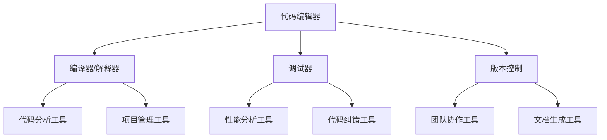

                 


### 1. 确定书籍主题

《提示词编程语言的IDE设计：增强开发体验》这本书的主题非常明确，即探讨如何设计一款IDE来提升提示词编程语言的开发体验。首先，我们需要了解两个核心概念：提示词编程语言和IDE设计。

**提示词编程语言**是一种将编程任务分解成一系列提示（即指令或任务）的语言，开发人员通过编写和组合这些提示来完成复杂的编程任务。这种编程范式与传统的命令式编程不同，它更注重流程和任务分解，有助于提高编程的效率和可读性。

**IDE设计**则是指软件开发环境中集成开发工具的设计。一个好的IDE不仅要有强大的编程语言支持，还要提供高效的用户界面和丰富的功能模块，如代码编辑、编译、调试、版本控制等，从而提升开发体验。

### 2. 设计书籍结构

为了系统地探讨这个主题，我们可以将书籍分为以下几个部分：

#### 第一部分：引言与概述
- **引言与概述**：介绍提示词编程语言和IDE设计的基本概念，阐述书籍的目的和结构。

#### 第二部分：提示词编程语言基础
- **提示词编程语言核心技术**：详细探讨提示词编程语言的基本原理、架构设计以及编程范式。
- **编程语言设计原则**：分析提示词编程语言的设计原则，如语法规则、语义模型等。

#### 第三部分：IDE设计原理与流程
- **IDE设计原理**：介绍IDE设计的基本原理和方法论，如用户界面设计、性能优化等。
- **IDE功能模块设计**：详细讨论IDE的功能模块设计，包括编辑器、编译器/解释器、调试器等。

#### 第四部分：开发体验优化策略
- **代码智能辅助**：探讨如何通过智能代码补全、代码分析工具等优化开发体验。
- **调试体验优化**：分析如何提升调试器的功能和效率。
- **用户体验设计**：介绍用户体验设计的方法和最佳实践。

#### 第五部分：案例研究
- **案例研究**：通过具体的案例，展示如何在实际项目中应用提示词编程语言的IDE设计。

#### 第六部分：实践指南
- **实践指南**：提供详细的实践指导，包括开发环境搭建、源代码实现、代码解读等。

### 3. 细化章节内容

在确定了书籍的基本结构后，我们需要进一步细化每个章节的内容，确保每个部分都能提供深入且有价值的讨论。

**第一部分：引言与概述**
- **引言与概述**：介绍书籍的背景、目的和读者对象。
- **提示词编程语言与IDE设计概述**：简述提示词编程语言和IDE设计的基本概念和发展现状。

**第二部分：提示词编程语言基础**
- **提示词编程语言核心技术**：介绍提示词编程语言的原理、流程和处理算法。
- **编程语言设计原则**：分析设计提示词编程语言时需要考虑的原则，如清晰性、灵活性、扩展性等。
- **提示词编程语言的架构设计**：讨论提示词编程语言的层次结构、模块设计及其可扩展性。

**第三部分：IDE设计原理与流程**
- **IDE设计原理**：阐述IDE设计的目标和原则，如用户友好性、高效性、可扩展性等。
- **IDE功能模块设计**：详细讨论IDE的不同功能模块，如代码编辑器、编译器/解释器、调试器等的设计原则和实现方法。
- **IDE用户界面设计**：介绍用户界面设计的基本原则、布局和交互设计。
- **IDE性能优化**：分析如何优化IDE的性能，包括编译优化、内存管理等。

**第四部分：开发体验优化策略**
- **代码智能辅助**：探讨如何通过智能代码补全、代码分析工具等提高开发效率。
- **调试体验优化**：分析如何提升调试器的功能和用户体验。
- **用户体验设计**：介绍用户体验设计的方法和最佳实践，如用户研究、界面设计等。

**第五部分：案例研究**
- **案例背景与目标**：介绍案例的背景和设计目标。
- **IDE设计流程**：详细描述从需求分析到用户界面设计、开发与测试的整个过程。
- **案例分析**：对案例中的成功要素、问题和解决方案进行分析。
- **案例总结与启示**：总结案例的成果和启示，为后续设计提供参考。

**第六部分：实践指南**
- **设计工具与开发环境搭建**：介绍设计工具的选择、开发环境的配置和开发流程。
- **源代码实现与解读**：提供具体的源代码实现和详细解读。
- **代码应用解读与分析**：分析代码的实际应用，讨论其在项目中的角色和影响。
- **实际案例分析与讲解**：对实际案例进行详细分析，展示设计原则和策略的应用。
- **项目小结**：总结项目经验，提出最佳实践、注意事项和拓展阅读。

### 4. 使用Mermaid流程图

为了帮助读者更好地理解书籍中的核心概念和架构设计，我们将在相关章节中使用Mermaid流程图。Mermaid是一种易于理解的图形描述语言，可以用来创建流程图、序列图、网络图等。

例如，在讨论IDE功能模块设计时，我们可以使用Mermaid流程图来展示IDE的核心模块及其交互关系：



### 5. 伪代码与数学公式

在讲解核心算法原理和数学模型时，我们将使用伪代码和LaTeX格式来详细阐述。

**伪代码示例**：
```plaintext
function findMax(arr):
    max = arr[0]
    for i from 1 to arr.length:
        if arr[i] > max:
            max = arr[i]
    return max
```

**LaTeX公式示例**：
$$
E = mc^2
$$

### 6. 案例研究与实践指南

在书籍的案例研究部分，我们将选择一个典型的提示词编程语言的IDE设计案例，详细分析其设计过程、关键技术和实施效果。

**案例研究**：
- **案例背景**：选择一个流行的提示词编程语言（如Prolog或Lua）和一个典型的IDE（如Visual Studio Code）进行设计。
- **设计目标**：优化该IDE的代码编辑、编译、调试和用户界面等功能，提升开发体验。
- **IDE设计流程**：详细描述从需求分析、功能设计、用户界面设计到开发与测试的整个流程。
- **案例分析**：分析设计过程中的成功要素、遇到的问题及解决方案。
- **案例总结与启示**：总结案例的成果和经验，为后续设计提供参考。

**实践指南**：
- **设计工具与开发环境搭建**：介绍设计工具的选择、开发环境的配置和开发流程。
- **源代码实现与解读**：提供具体的源代码实现和详细解读。
- **代码应用解读与分析**：分析代码的实际应用，讨论其在项目中的角色和影响。
- **实际案例分析与讲解**：对实际案例进行详细分析，展示设计原则和策略的应用。
- **项目小结**：总结项目经验，提出最佳实践、注意事项和拓展阅读。

### 7. 保持简洁性与完整性

在撰写书籍内容时，我们需要保持简洁性和完整性。每个章节的内容都要确保深入但不过于冗长，避免过度细节和重复。同时，确保核心内容和关键概念得到充分阐述，使读者能够清晰地理解整个主题。

### 8. 书籍目录大纲

综上所述，以下是《提示词编程语言的IDE设计：增强开发体验》的书籍目录大纲：

```
# 《提示词编程语言的IDE设计：增强开发体验》目录大纲

## 第一部分 引言与概述
### 1.1 提示词编程语言与IDE设计概述
### 1.2 本书结构安排与内容概述

## 第二部分 提示词编程语言基础
### 2.1 提示词编程语言核心技术
### 2.2 编程语言设计原则
### 2.3 提示词编程语言的架构设计

## 第三部分 IDE设计原理与流程
### 3.1 IDE设计原理
### 3.2 IDE功能模块设计
### 3.3 IDE用户界面设计
### 3.4 IDE性能优化

## 第四部分 开发体验优化策略
### 4.1 代码智能辅助
### 4.2 调试体验优化
### 4.3 用户体验设计

## 第五部分 案例研究
### 5.1 案例背景与目标
### 5.2 IDE设计流程
### 5.3 案例分析
### 5.4 案例总结与启示

## 第六部分 实践指南
### 6.1 设计工具与开发环境搭建
### 6.2 源代码实现与解读
### 6.3 代码应用解读与分析
### 6.4 实际案例分析与讲解
### 6.5 项目小结
```

这个目录大纲结构清晰，涵盖了书籍的核心主题和关键内容，既保证了内容的完整性，又便于读者快速找到所需信息。

### 9. 总结

通过以上的步骤，我们详细规划了《提示词编程语言的IDE设计：增强开发体验》的书籍目录大纲。这个大纲不仅结构合理，内容详尽，而且通过逐步分析推理的方式，确保了每个章节都能提供深入且有价值的讨论。接下来，我们可以根据这个大纲撰写每个章节的具体内容，逐步完善书籍的整个框架。在撰写过程中，我们还将结合Mermaid流程图、伪代码和LaTeX公式等工具，以增强文章的可读性和实用性。最终，我们将创作一篇具有深度、思考和见解的专业技术博客文章，为读者提供宝贵的知识和实践经验。

